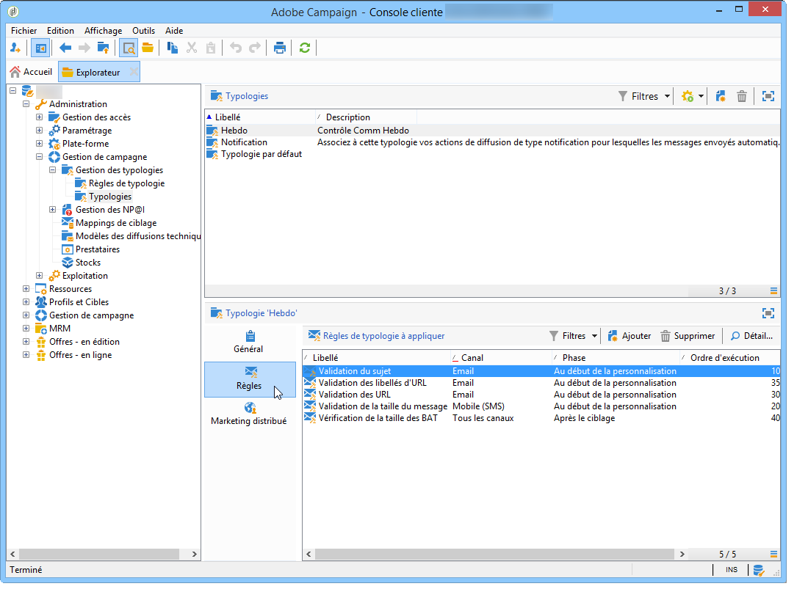

# À propos des typologies de campagne{#about-campaign-typologies}

Le module d’optimisation des campagnes d’Adobe Campaign permet de contrôler, de filtrer et de surveiller l’envoi des diffusions. Pour éviter les conflits entre les campagnes, Adobe Campaign peut tester différentes combinaisons en appliquant des règles de contrainte spécifiques. Elles permettent de s’assurer que les messages envoyés répondent aux attentes et aux besoins des clients et des stratégies de communication de l’entreprise.

 [Découvrez cette fonctionnalité en vidéo](#typologies-video)

>[!NOTE]
>
>Selon votre offre, Campaign Optimization peut être inclus ou proposé sous la forme d&#39;un composant additionnel. Vérifiez votre contrat de licence.

## Règles de typologie {#typology-rules}

Avec Adobe Campaign, vous pouvez concevoir et appliquer quatre types de règles de typologie :

* Les règles de **filtrage** qui vous permettent d’exclure une partie de la cible en fonction de critères. Voir à ce sujet la section [Règles de filtrage](filtering-rules.md).
* Les règles de **pression** qui vous permettent de contrôler la lassitude marketing. Voir à ce sujet la section [Règles de pression](pressure-rules.md).
* Les règles de **capacité** qui vous permettent de limiter les charges pour garantir des conditions de traitement optimales. Voir à ce sujet la section [Contrôler la capacité](consistency-rules.md#controlling-capacity).
* Les règles de **contrôle** qui vous permettent de vérifier la validité des messages avant leur envoi. Voir à ce sujet la section [Règles de contrôle](control-rules.md).

Une fois créées, les règles de typologie sont regroupées dans des typologies de campagne, qui sont référencées dans les diffusions. Pour plus d&#39;informations, consultez la section [Appliquer les typologies](#applying-typologies).

## Typologies {#typologies}

Une typologie de campagne peut contenir plusieurs [règles de typologie](#typology-rules), mais une diffusion ne peut référencer qu&#39;une seule typologie.

L&#39;onglet **[!UICONTROL Règles]** permet d&#39;ajouter, supprimer ou visualiser les règles de typologie à appliquer.

## Appliquer les typologies {#applying-typologies}

Vous trouverez ci-dessous les étapes nécessaires pour créer et appliquer une typologie à vos diffusions :

1. Créez des règles de typologie.

   Les règles de typologies sont regroupées sous le noeud **[!UICONTROL Administration > Gestion de campagne > Gestion des typologies > Règles de typologie]**.

   Les différents types de règles disponibles dans Campaign sont présentés dans les sections suivantes : [règles de pression commerciale](pressure-rules.md), [règles de capacité](consistency-rules.md#controlling-capacity), [règles de contrôle](control-rules.md) et [règles de filtrage](filtering-rules.md).

1. Créez une typologie et référencez les règles que vous avez créées dans celle-ci.

   Les typologies sont accessibles sous le nœud **[!UICONTROL Administration > Gestion de campagne > Gestion des typologies]** > **[!UICONTROL Typologies]**.

1. Configurez votre diffusion pour utiliser la typologie que vous avez créée. Pour plus d&#39;informations, consultez [cette section](applying-rules.md#applying-a-typology-to-a-delivery).
1. Testez et contrôlez le comportement par le biais de simulations de campagnes. Pour plus d&#39;informations sur les simulations de campagnes, consultez [cette section](campaign-simulations.md).

Pendant la préparation de la diffusion, les destinataires sont exclus lorsque le critère est satisfait. Vous pouvez consultez les logs pour suivre les exclusions. Des exemples d&#39;utilisation des règles de typologie de pression sont disponibles sur [cette page](pressure-rules.md#use-cases-on-pressure-rules).

## Tutoriels vidéo {#typologies-video}

### Comment configurer la gestion de la fatigue à l’aide de règles de typologie

Cette vidéo explique comment implémenter la gestion de la fatigue dans Adobe Campaign en utilisant les règles de typologie.

>[!VIDEO](https://video.tv.adobe.com/v/25090?quality=12)

### Comment configurer la gestion de la fatigue à l&#39;aide de filtres prédéfinis

La gestion de la fatigue contrôle la fréquence et le nombre des messages afin d&#39;éviter une sollicitation excessive des destinataires. Si votre instance ne contient pas le module d&#39;optimisation de campagne, vous pouvez configurer un filtre prédéfini qui filtrera la population cible en fonction du nombre de messages reçus. Cette vidéo explique comment implémenter la gestion de la fatigue dans Adobe Campaign Classic à l&#39;aide de filtres.

>[!VIDEO](https://video.tv.adobe.com/v/25091?quality=12)

D’autres vidéos pratiques sur Campaign sont disponibles [ici](https://experienceleague.adobe.com/docs/campaign-classic-learn/tutorials/overview.html?lang=fr).

**Rubrique connexe**

* [Prise en main des typologies et de la gestion de la fatigue](pressure-rules.md)

