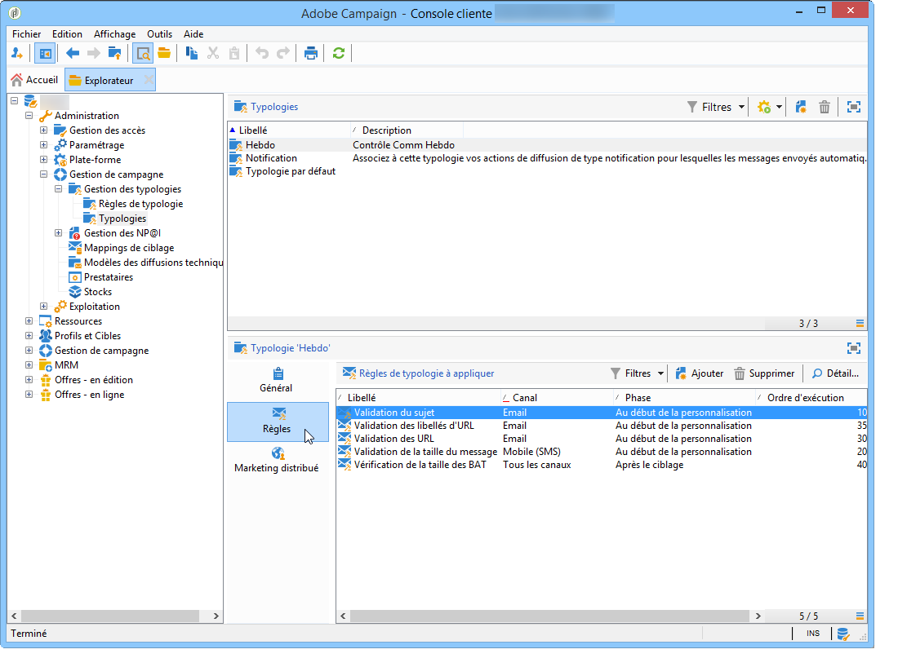

# A propos des typologies de campagne{#about-campaign-typologies}

Optimisation de campagne est le module Adobe Campaign qui vous permet de contrôler, de filtrer et de surveiller l’envoi des livraisons. Pour éviter les conflits entre les campagnes, Adobe Campaign peut tester diverses combinaisons en appliquant des règles de contrainte spécifiques. Cela garantit que les messages envoyés répondent aux besoins et aux attentes des clients et aux politiques de communication de l&#39;entreprise.

>[!NOTE]
>
>Selon votre offre, Campaign Optimization peut être inclus ou proposé sous la forme d&#39;un composant additionnel. Vérifiez votre contrat de licence.

## Règles de typologie {#typology-rules}

Avec Adobe Campaign, vous pouvez concevoir et appliquer quatre types de règles de typologie :

1. **Règles de filtrage** qui vous permettent d’exclure une partie de la cible en fonction de critères. For more on this, refer to [Filtering rules](../../campaign/using/filtering-rules.md).
1. **Règles de pression** qui vous permettent de contrôler la fatigue du marketing. For more on this, refer to [Pressure rules](../../campaign/using/pressure-rules.md).
1. **Règles de capacité** qui vous permettent de limiter les charges pour garantir des conditions de traitement optimales. For more on this, refer to [Controlling capacity](../../campaign/using/consistency-rules.md#controlling-capacity).
1. **Règles de contrôle** qui vous permettent de vérifier la validité des messages avant leur envoi. For more on this, refer to [Control rules](../../campaign/using/control-rules.md).

Une fois créées, les règles de typologie sont regroupées dans des typologies de campagne, qui sont référencées dans les diffusions. Reportez-vous à la section [Appliquer les typologies](#applying-typologies).

## Typologies {#typologies}

Une typologie de campagne peut contenir plusieurs [règles de typologie](#typology-rules), mais une diffusion ne peut référencer qu&#39;une seule typologie.

The **[!UICONTROL Rules]** tab lets you add, delete or view the typology rules to apply.

## Appliquer les typologies {#applying-typologies}

Vous trouverez ci-dessous les étapes nécessaires pour créer et appliquer une typologie à vos diffusions :

1. Créez des règles de typologie.

   Les règles de typologie se trouvent dans le **[!UICONTROL Administration > Campaign management > Typology management > Typology rules]** noeud.

   Les différents types de règles disponibles dans Campaign sont présentés dans les sections suivantes : [règles de pression commerciale](../../campaign/using/pressure-rules.md), [règles de capacité](../../campaign/using/consistency-rules.md#controlling-capacity), [règles de contrôle](../../campaign/using/control-rules.md) et [règles de filtrage](../../campaign/using/filtering-rules.md).

1. Créez une typologie et référencez les règles que vous avez créées dans celle-ci.

   Les typologies sont accessibles via le noeud **[!UICONTROL Administration > Campaign Management > Typology management]** > **[!UICONTROL Typologies]** .

1. Configurez votre diffusion pour utiliser la typologie que vous avez créée. Pour plus d&#39;informations, consultez [cette section](../../campaign/using/applying-rules.md#applying-a-typology-to-a-delivery).
1. Testez et contrôlez le comportement par le biais de simulations de campagnes. Pour plus d&#39;informations sur les simulations de campagnes, consultez [cette section](../../campaign/using/campaign-simulations.md).

Pendant la préparation de la diffusion, les destinataires sont exclus lorsque le critère est satisfait. Vous pouvez consultez les logs pour suivre les exclusions. Des exemples d&#39;utilisation des règles de typologie de pression sont disponibles sur [cette page](../../campaign/using/pressure-rules.md#use-cases-on-pressure-rules).

**Rubrique connexe**

* [Appliquer des règles de fonctionnement automatiques aux livraisons sur n’importe quel canal](https://helpx.adobe.com/campaign/kb/simplifying-campaign-management-acc.html#Applyautomaticbusinessrulestodeliveriesonanychannel)