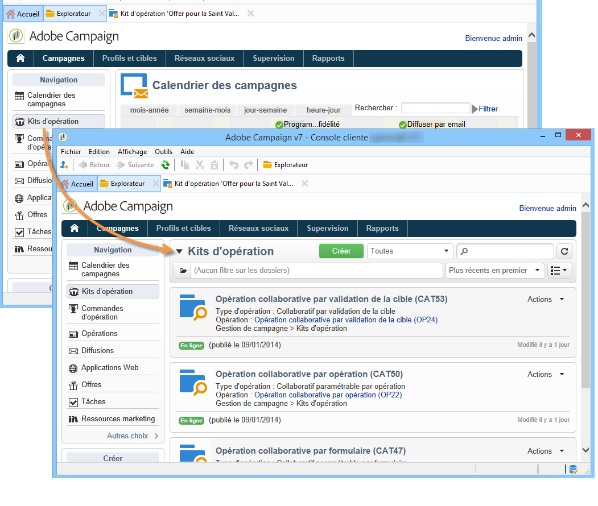
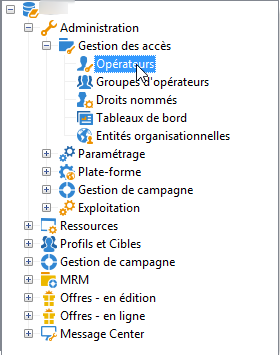
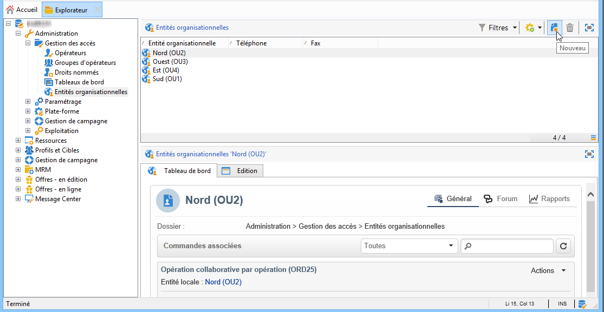
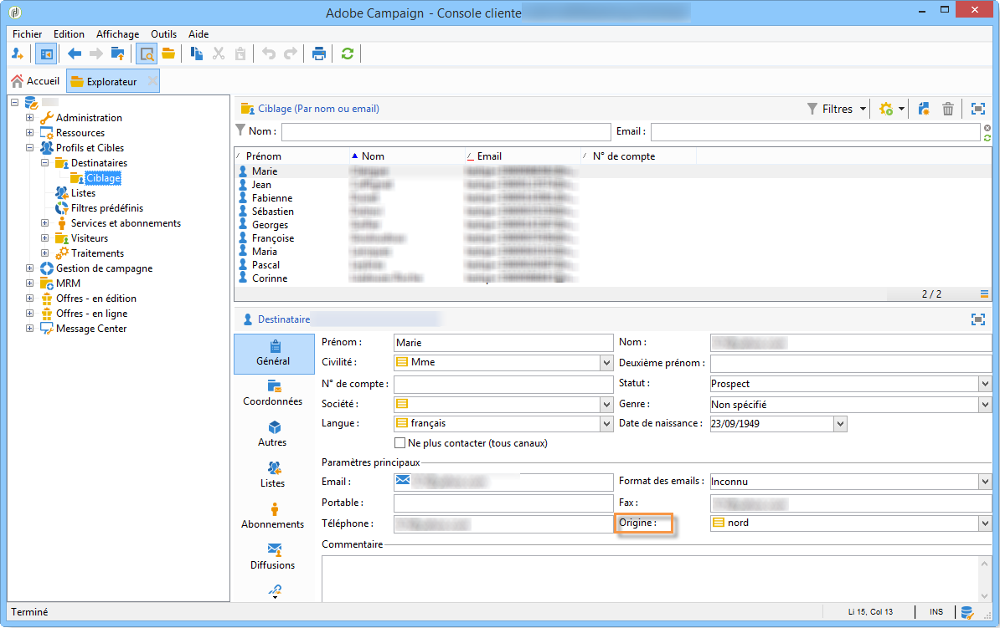

# A propos du marketing distribué{#about-distributed-marketing}

## Introduction {#introduction}

Adobe Campaign propose une application de Marketing Distribué - **Distributed Marketing** - qui permet de mettre en place des opérations collaboratives entre des entités centrales (par exemple le siège de l&#39;entreprise, le service marketing, etc.) et des entités locales (par exemple des points de vente, des agences régionales, etc.). Cette collaboration s&#39;organise autour d&#39;un espace commun, la **[!UICONTROL liste des kits d&#39;opération]**, où des modèles et des instances d&#39;opérations créés au niveau central sont proposés aux entités locales.

L&#39;entité centrale propose aux entités locales des opérations auxquelles elles peuvent participer. Ces opérations sont matérialisées par des kits, qui peuvent être associés à des opérations locales ou collaboratives. Pour participer, l&#39;entité locale doit faire une commande d&#39;opération et cette commande doit être validée.

>[!CAUTION]
>
>Le module Distributed Marketing est une option de **Campaign**. Vérifiez votre contrat de licence.

## Terminologie {#terminology}

### Entité centrale {#central-entities}

Une entité centrale regroupe les opérateurs marketing chargés de définir la communication et d&#39;assister les entités locales dans la réalisation de leur campagne marketing.

L&#39;entité centrale peut, grâce au module de Marketing Distribué :

* mettre en place des kits de campagne marketing à destination des entités locales,
* favoriser l&#39;autonomie des entités locales dans le choix de leurs communications envers leurs clients/prospects, leur ciblage, leur contenu, etc.,
* gérer et maîtriser les coûts,
* animer un réseau d&#39;agences.

### Entité locale {#local-entities}

Une entité locale correspond à une agence, un magasin ou un groupe d&#39;opérateurs locaux spécifiques (responsables de pays ou de régions, responsables de marques, etc.).

Le Marketing Distribué permet aux entités locales d&#39;avoir plus d&#39;autonomie tout en optimisant les coûts de réalisation.

### Localisation {#localization}

La localisation est la capacité pour une entité locale de modifier la cible et le contenu d&#39;une opération. Le niveau de localisation possible dépend du type d&#39;opération et de la mise en oeuvre.

### Liste des kits d&#39;opération {#list-of-campaign-packages}

La liste des kits d&#39;opération regroupe les opérations qui sont disponibles pour les entités locales.

### Kit d&#39;opération {#campaign-package}

Modèle (ou instance d&#39;opération) créé par une entité centrale et mis à disposition d&#39;un ensemble d&#39;entités locales.

### Opération locale {#local-campaign}

Une opération locale est une instance d&#39;opération créée à partir d&#39;un modèle d&#39;opération référencé dans la liste des **[!UICONTROL kits d&#39;opération]** avec un **planning d&#39;exécution spécifique** à chaque commande de l&#39;entité locale. L&#39;objectif est de répondre à un besoin local de communication en utilisant un modèle d&#39;opération formalisé et paramétré par l&#39;entité centrale.

Le degré d&#39;autonomie de l&#39;entité locale dépend de la mise en oeuvre utilisée.

Reportez-vous à [Création d&#39;une campagne](../../campaign/using/creating-a-local-campaign.md)locale.

### Opération collaborative {#collaborative-campaign}

Une opération collaborative est une opération dont le **planning d&#39;exécution est défini** par l&#39;entité centrale. Les entités locales sont libres de participer ou non à l&#39;opération. En fonction du paramétrage de l&#39;opération, le contenu et la cible peuvent être localisés par l&#39;entité locale. Il existe plusieurs types d&#39;opérations collaboratives :

* **[!UICONTROL Opération collaborative par formulaire]** : conseillée pour des opérations visant jusqu&#39;à 300 entités locales. L&#39;entité locale peut saisir des paramètres prédéfinis en terme de ciblage et de personnalisation de contenu dans un formulaire Web. Le formulaire peut être un formulaire Adobe Campaign ou un formulaire externe (extranet client). La définition et le paramétrage de ce formulaire peuvent être réalisés par un administrateur fonctionnel sur la base d&#39;un modèle de formulaire défini par l&#39;intégrateur. Pour commander l&#39;opération, l&#39;entité locale a seulement besoin d&#39;un accès Web.
* **[!UICONTROL Opération collaborative par opération]** : conseillée pour des opérations visant quelques dizaines d&#39;entités locales. Ce type d&#39;opération crée des opérations filles pour chaque entité locale. Lorsque la commande d&#39;une **[!UICONTROL Opération collaborative par opération]** est validée par l&#39;entité centrale, l&#39;opération est mise à disposition de l&#39;entité locale qui peut la modifier. L&#39;exécution est automatiquement synchronisée entre les opérations filles et l&#39;opération mère. L&#39;entité locale doit avoir un accès client riche pour commander l&#39;opération et y participer.
* **[!UICONTROL Opération collaborative par validation de la cible]** : conseillée pour des opérations visant jusqu&#39;à plusieurs milliers d&#39;entités locales. L&#39;entité locale reçoit une liste de contacts sélectionnés par l&#39;entité centrale. L&#39;entité locale choisit de garder ou non certains contacts en fonction du contenu de l&#39;opération, grâce à un formulaire Web. Les entités locales sont déduites de la liste de contacts sélectionnés. Pour participer à l&#39;opération, l&#39;entité locale a seulement besoin d&#39;un accès Web.
* **[!UICONTROL Opération collaborative simple]** : ce mode permet d&#39;assurer la compatibilité avec les développements spécifiques réalisés dans les versions précédentes.

Reportez-vous à [Création d’une campagne](../../campaign/using/creating-a-collaborative-campaign.md)collaborative.

### Commande de kits d&#39;opération {#ordering-campaign-packages}

L&#39;inscription d&#39;une entité locale à une opération se traduit par la création d&#39;une commande qui regroupe toutes les informations relatives à la localisation de la campagne.

## Espace de travail {#workspace}

La liste des kits d&#39;opération est accessible à partir de l&#39;univers **Campagnes** : cliquez sur le lien **[!UICONTROL Kits d&#39;opération]**.

Pour chaque opérateur local, cette fenêtre permet de visualiser les opérations disponibles pour son agence locale.

Pour les agences centrales, cette fenêtre affiche tous les kits disponibles dans la liste des kits d&#39;opération et propose des liens supplémentaires afin d&#39;agir sur la liste.

## Opérateurs et entités {#operators-and-entities}

Vous devez d&#39;abord définir les acteurs des entités centrales et locales à partir du dossier de **[!UICONTROL Gestion des accès]**.

### Opérateurs {#operators}

Vous devez créer des opérateurs centraux et des opérateurs locaux.

Les opérateurs centraux doivent appartenir au groupe d&#39;opérateurs **[!UICONTROL Gestion en central]** ou être titulaire du droit nommé **[!UICONTROL CENTRAL]**.

Les opérateurs locaux doivent appartenir au groupe d&#39;opérateurs **[!UICONTROL Gestion en local]** ou être titulaire du droit nommé **[!UICONTROL LOCAL]**. De plus, ils doivent être associés à leur entité locale.

### Entités organisationnelles {#organizational-entities}

Pour créer une entité organisationnelle, cliquez sur le noeud **[!UICONTROL Administration > Gestion des accès > Entités organisationnelles]** puis cliquez sur l&#39;icône **[!UICONTROL Nouveau]** au-dessus de la liste des entités.

Chaque entité organisationnelle contient les informations d&#39;identification (libellé, nom interne, coordonnées, etc.) et les groupes de travail utilisés dans le processus de validation des commandes. Ces groupes sont définis dans la section **[!UICONTROL Notifications et validations]** de l&#39;onglet **[!UICONTROL Général]**.

* Vous devez définir un groupe de notification des kits : les opérateurs de ce groupe recevront un message de notification lorsqu&#39;un nouveau kit sera ajouté à la liste des kits d&#39;opération et lorsqu&#39;une opération est disponible.
* Vous devez également sélectionner le groupe d&#39;opérateurs responsables de la validation des commandes, c&#39;est-à-dire chargés de valider les opérations commandées par l&#39;entité locale.
* Sélectionnez enfin le groupe d&#39;opérateurs chargés de la validation de l&#39;opération locale (validation de la cible, du contenu, du budget, etc.). Ce groupe peut être surchargé lors de la commande d&#39;une opération, si le modèle le permet.

>[!NOTE]
>
>The approval process is presented in the [Approval process](../../campaign/using/creating-a-local-campaign.md#approval-process) section.

## Mise en oeuvre {#implementation}

Les opérations de Marketing Distribué sont créées et publiées par l&#39;entité centrale, puis peuvent être utilisées par les entités locales autant que par l&#39;entité centrale, selon les besoins.

Les étapes de mise en oeuvre dépendent du type de kit d&#39;opération utilisé et du niveau de délégation au niveau des entités locales.

### Côté intégrateur {#integrator-side}

1. Créer les entités locales.
1. Associer les destinataires aux opérateurs en charge des entités locales.

   

1. Définir les droits et les règles de navigation pour les entités locales.
1. Définir l&#39;ensemble des champs nécessaires à la localisation des campagnes :

   * la définition de la cible et sa taille maximale,
   * la définition du contenu,
   * le planning d&#39;exécution (date de contact et date d&#39;extraction), **pour les opérations locales seulement**,
   * l&#39;extension du schéma des commandes avec l&#39;ensemble des champs additionnels nécessaires.

1. Créer un modèle de formulaire Web (Adobe Campaign ou extranet client) qui permet d&#39;exposer les paramètres de localisation, d&#39;évaluer la cible et le budget ; ainsi que de prévisualiser le contenu et valider la commande.

   Pour les **opérations collaboratives par validation de la cible**, créer la table où seront enregistrées les validations pour chaque entité locale.

### Côté administrateur fonctionnel {#functional-administrator-side}

Ces étapes doivent être réalisées à chaque création d&#39;opération.

1. Mettre à jour le formulaire avec les champs utilisés pour la localisation de la campagne.
1. Créer une instance à partir du modèle d&#39;opération approprié (opération collaborative) ou dupliquer le modèle d&#39;opération (opération locale).
1. Paramétrer l&#39;opération avec les champs de localisation et la référence du formulaire.
1. Publiez l&#39;opération.

### Côté opérateur local {#local-operator-side}

Ces étapes doivent être réalisées à chaque opération.

1. A la réception de la notification de disponibilité du kit d&#39;opération, définir la localisation éventuelle de l&#39;opération.
1. Evaluer la cible, le budget, etc..
1. Prévisualiser le contenu de l&#39;opération.
1. Commander l&#39;opération.

