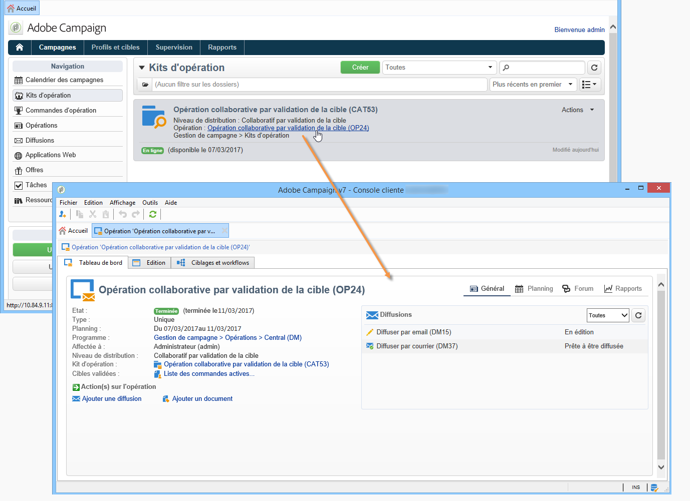

# Accéder aux opérations{#accessing-campaigns}

Une fois une opération commandée, la commande validée, et la date de disponibilité atteinte, elle peut être exécutée.

Selon le type d&#39;opération et les options sélectionnées, elle est exécutée au niveau de chaque entité locale ou par l&#39;entité centrale.

## Accéder à l&#39;opération {#accessing-the-campaign}

Une fois la commande validée et la date de disponibilité atteinte, l&#39;opération est créée au niveau local et peut être utilisée. Les opérateurs locaux sont notifiés de sa disponibilité.

Elle est ajoutée dans le détail de la commande correspondante et peut être éditée. Son tableau de bord est alors complet et permet de la piloter au niveau local.

L&#39;opération est également accessible à partir de la vue d&#39;ensemble des opérations affichées à partir du lien **[!UICONTROL Opérations]** de la page d&#39;accueil.

## Paramétrages disponibles {#available-settings}

Les entités locales peuvent adapter le contenu de l&#39;opération afin qu&#39;elle réponde au mieux à leur besoin. Pour cela, ils peuvent utiliser tous les éléments du tableau de bord de l&#39;opération. Ils seront principalement amenés à adapter le workflow de ciblage, et éventuellement personnaliser le contenu de la ou des diffusions.

## Exécution de campagne {#campaign-execution}

Chaque entité locale peut exécuter le workflow de l&#39;opération puis procéder aux validations nécessaires, selon le processus de validation défini dans le modèle associé à l&#39;opération.
