# Accès aux campagnes marketing{#accessing-marketing-campaigns}

Adobe Campaign vous permet de créer, paramétrer, exécuter et analyser des campagnes marketing. Toutes les campagnes marketing peuvent être gérées à partir d’un centre de contrôle unifié.

## Notions de base sur l&#39;espace de travail {#workspace-basics}

### Page d&#39;accueil        {#home-page}

Une fois connecté à Adobe Campaign, parcourez les différentes fonctionnalités à l’aide de liens dans la barre de navigation.

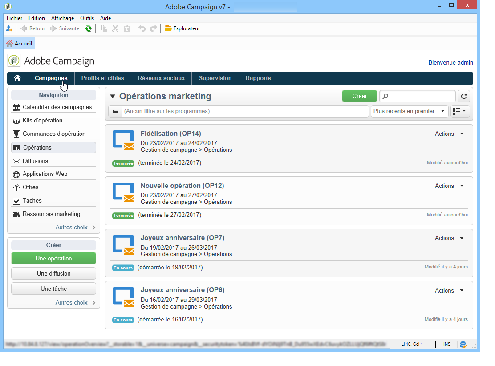

Les éléments de campagne se trouvent dans la variable **[!UICONTROL Campagnes]** tab : vous y trouverez un aperçu des programmes marketing, des campagnes et de leurs sous-ensembles. Un programme de marketing est constitué de campagnes, elles-mêmes formées de diffusions, de tâches, de ressources liées, etc. Dans le cadre de la gestion des campagnes marketing via Campaign, les informations relatives aux diffusions, aux budgets, aux validants et aux documents associés figurent dans les opérations.

Le bloc de **[!UICONTROL Navigation]** de l&#39;onglet **[!UICONTROL Campagnes]** offre diverses entrées en fonction des modules installés sur l&#39;instance. Vous pouvez, par exemple, accéder aux éléments suivants :

* **Calendrier des campagnes**: calendrier des plans, programmes marketing, diffusions et campagnes. Voir à ce sujet la section [Calendrier des campagnes](#campaign-calendar).
* **Opérations** : accès aux campagnes contenues dans l&#39;ensemble des programmes marketing.
* **Diffusions** : accès aux diffusions contenues dans les opérations.
* **Applications Web** : accès aux applications web (formulaires, landing pages, etc.)

>[!NOTE]
>
>L&#39;ergonomie générale de la console Adobe Campaign, ainsi que les autorisations et les fonctionnalités de gestion des profils, sont présentées dans [cette section](../../platform/using/adobe-campaign-workspace.md).
>
>Les fonctionnalités relatives aux canaux et aux diffusions sont présentées dans [cette section](../../delivery/using/steps-about-delivery-creation-steps.md).

### Calendrier des campagnes {#campaign-calendar}

Chaque campagne appartient à un programme qui appartient à son tour à un plan. Les plans, programmes et campagnes sont accessibles à partir du **[!UICONTROL Calendrier des campagnes]** dans le menu **Campagnes** .

Pour éditer un plan, un programme, une opération ou une diffusion, cliquez sur son nom dans le calendrier, puis sur le lien **[!UICONTROL Ouvrir...]**. L&#39;élément visé est alors affiché dans un nouvel onglet, comme dans l&#39;exemple ci-dessous :

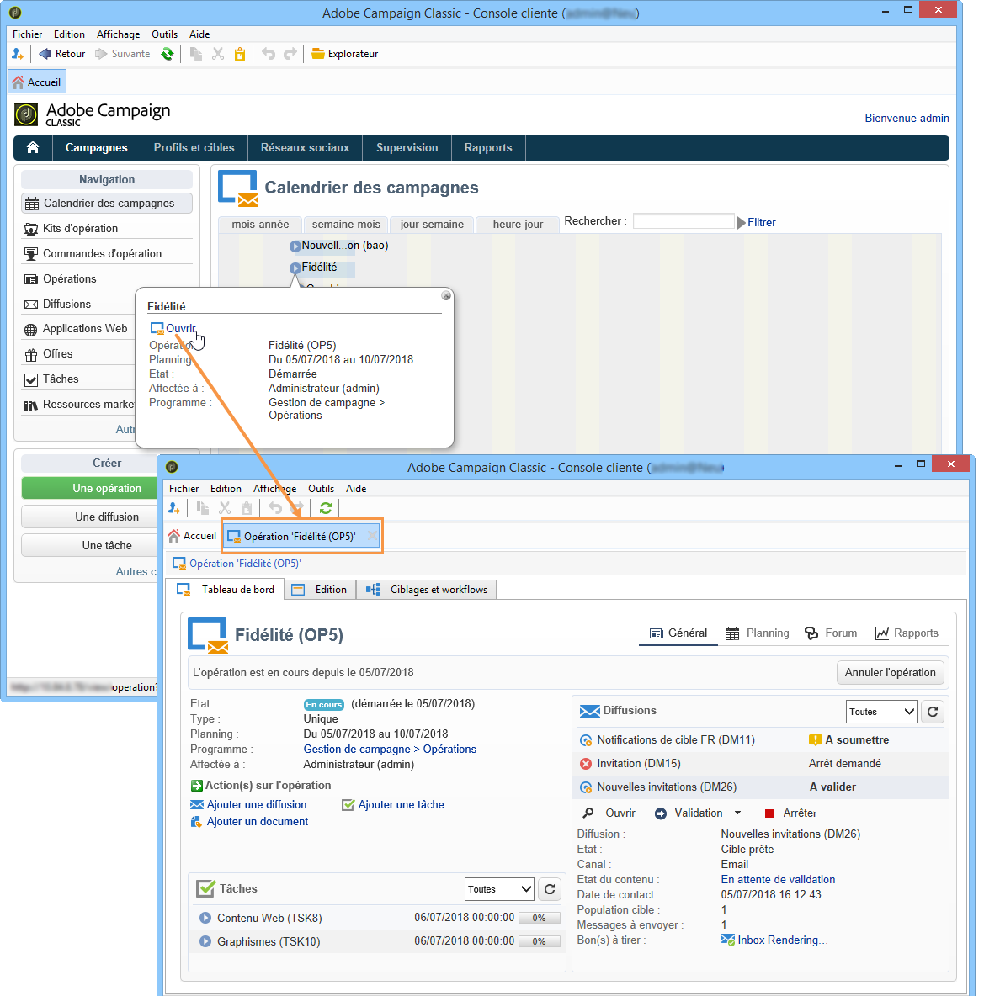

Vous pouvez filtrer les informations affichées dans le calendrier des campagnes : cliquez sur **[!UICONTROL Filtrer]** et sélectionnez les critères de filtrage.

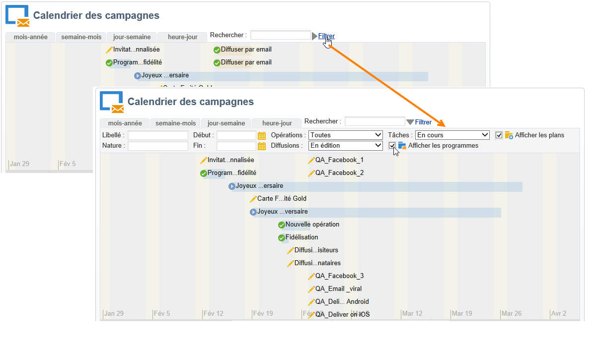

>[!NOTE]
>
>Lorsque vous filtrez sur une date, toutes les campagnes dont la date de début est postérieure à la date spécifiée et/ou dont la date de fin est antérieure à la date spécifiée sont affichées. Sélectionnez des dates à l’aide des calendriers situés à droite de chaque champ.

Vous pouvez également utiliser le champ **[!UICONTROL Rechercher]** pour filtrer les éléments affichés.

Les icônes associées à chaque élément vous permettent de visualiser son statut : terminé, en cours, en édition, etc.

### Navigation dans un programme marketing {#browsing-in-a-marketing-program}

Grâce à Campaign, vous pouvez gérer un ensemble de programmes composés de différentes campagnes marketing. Chaque campagne (ou opération) contient des diffusions, et les traitements et ressources associés.

#### Naviguer dans un programme {#browsing-a-program}

Lorsque vous éditez un programme, utilisez les onglets présentés ci-dessous pour naviguer et le paramétrer.

* Le **Planification** Cet onglet affiche le calendrier des programmes pour un mois, une semaine ou un jour selon l’onglet sur lequel vous cliquez dans l’en-tête du calendrier.

   Au besoin, vous pouvez créer une opération, un programme ou une tâche depuis cette vue.

   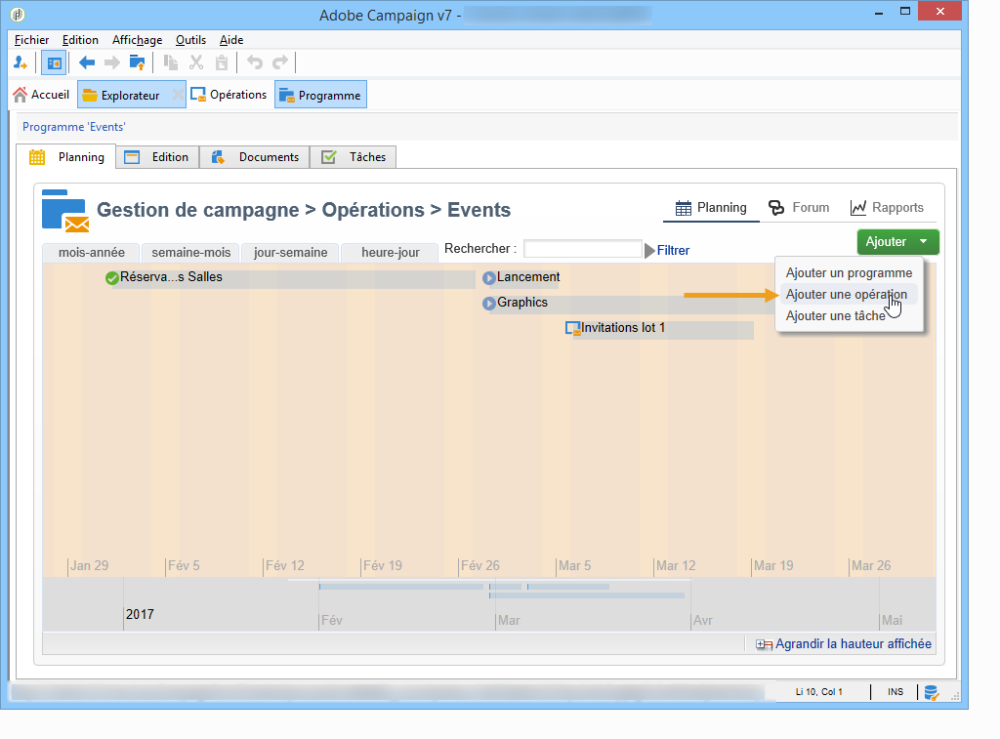

* L&#39;onglet **Edition** vous permet de modifier le programme : son nom, ses dates de début et fin, son budget, ses documents associés, etc.

   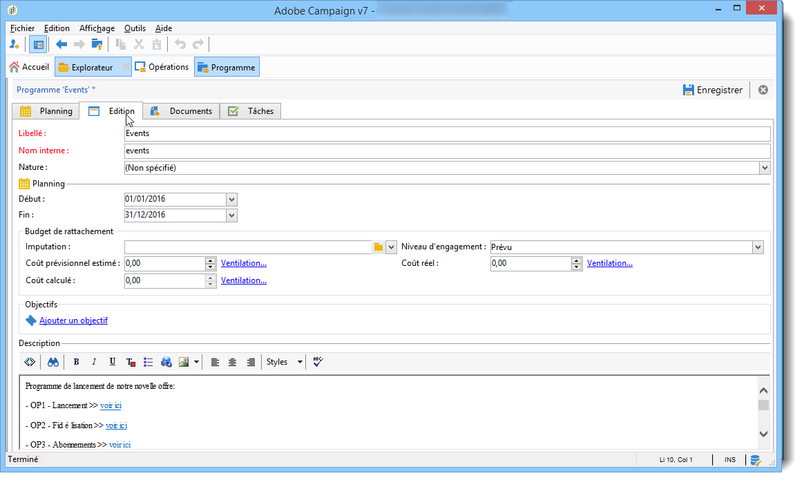

#### Parcourir les opérations {#browsing-campaigns}

Vous pouvez accéder aux opérations à partir du calendrier des campagnes, de l&#39;onglet **[!UICONTROL Planning]** du programme ou à partir de la liste des opérations.

1. Depuis le calendrier des campagnes, sélectionnez l&#39;opération à afficher puis cliquez sur le lien **[!UICONTROL Ouvrir]**.

   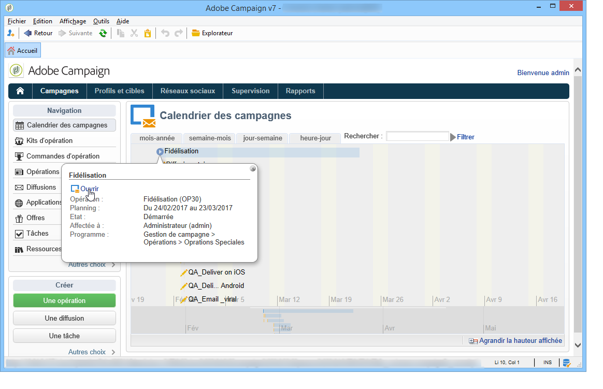

   L&#39;opération est alors éditée dans un nouvel onglet, comme dans l&#39;exemple ci-dessous :

   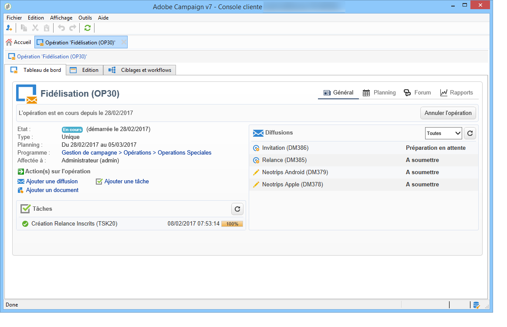

1. Depuis l&#39;onglet **[!UICONTROL Planning]** du programme, le mode d&#39;édition est le même que depuis le calendrier des campagnes.
1. Depuis le lien **[!UICONTROL Opérations]** de l&#39;onglet **[!UICONTROL Campagnes]**, cliquez sur le nom de l&#39;opération à modifier.

   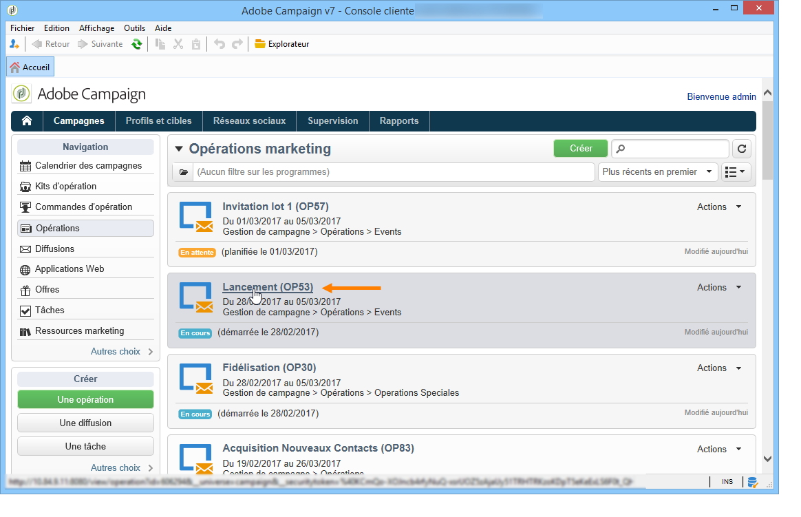

### Piloter une opération {#controlling-a-campaign}

#### Tableau de bord {#dashboard}

Pour chaque opération, les traitements, ressources et diffusions sont centralisés dans un écran unique - le tableau de bord - qui permet de gérer les actions marketing dans un mode collaboratif.

Le tableau de bord d&#39;une opération est utilisé comme une interface de pilotage. Il permet d&#39;accéder directement aux principales étapes de création et de gestion de l&#39;opération : diffusions, fichiers d&#39;extraction, notifications, budgets, etc.

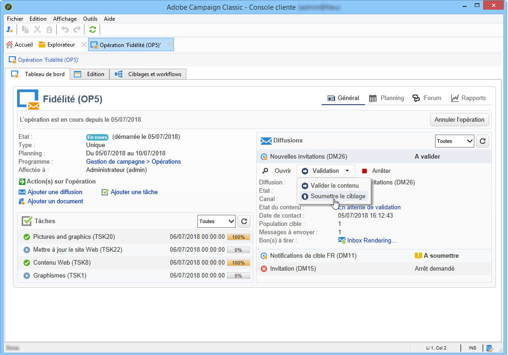

Avec Adobe Campaign, vous pouvez mettre en place des processus collaboratifs pour la réalisation, mais aussi pour la validation des différentes étapes des campagnes marketing et communication : validation du budget, de la cible, du contenu, etc.

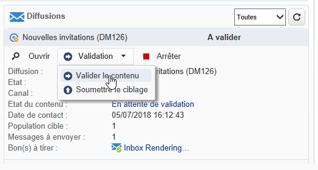

>[!NOTE]
>
>Le paramétrage des modèles d&#39;opération est présenté dans la section [Modèles d&#39;opération](../../campaign/using/marketing-campaign-templates.md#campaign-templates).

#### Planning {#schedule}

Une opération centralise un ensemble de diffusions. Pour chaque opération, le planning propose une vue globale de tous les composants : vous pouvez afficher les tâches et les diffusions, et y accéder facilement.

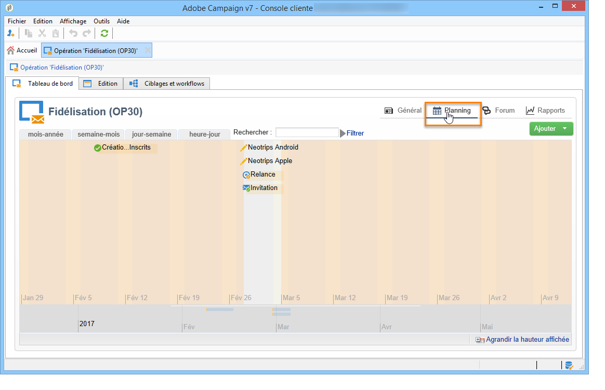

#### Forum {#forum}

Pour chaque opération, les intervenants peuvent échanger des messages via un forum dédié.

En savoir plus dans [Forums de discussion](../../mrm/using/discussion-forums.md).

#### Rapports  {#reports}

Le lien **[!UICONTROL Rapports]** permet d&#39;accéder aux rapports de l&#39;opération.

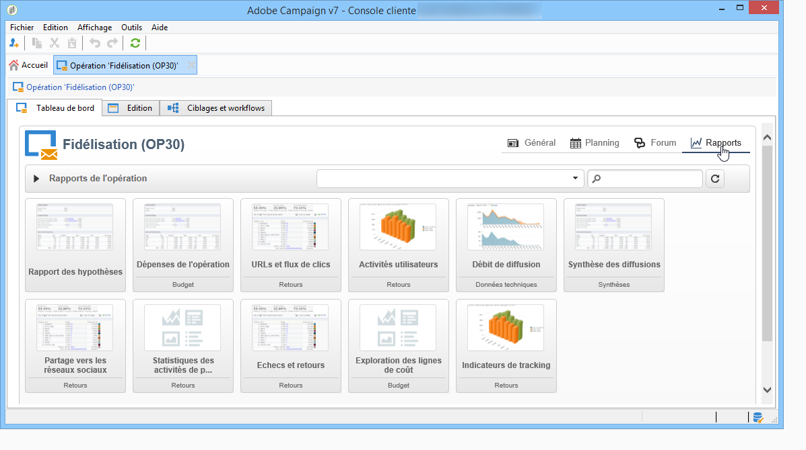

>[!NOTE]
>
>Les rapports sont présentés dans [cette section](../../reporting/using/about-adobe-campaign-reporting-tools.md).

#### Configuration  {#configuration}

Les opérations sont créées à partir de modèles d&#39;opérations : vous pouvez paramétrer des modèles réutilisables pour lesquels certaines options sont sélectionnées et certains paramétrages seront déjà enregistrés. Pour chaque opération, les fonctionnalités suivantes sont proposées :

* Référencement de [documents et ressources](../../campaign/using/marketing-campaign-deliveries.md#managing-associated-documents): vous pouvez associer des documents à l&#39;opération (brief, compte-rendu, images, etc.). Tous les formats de document sont pris en charge.
* Définition des coûts : pour chaque opération, Adobe Campaign permet de définir [postes de coûts et structures de calcul des coûts](../../campaign/using/providers--stocks-and-budgets.md#defining-cost-categories) qui peut être utilisé lors de la création de la campagne marketing. Par exemple : frais d&#39;impression, utilisation d&#39;une agence externe, location de salle.
* Définition d’objectifs : vous pouvez définir des objectifs à réaliser dans le cadre d’une opération. Ces objectifs sont quantifiables, par exemple : nombre d’abonnés à atteindre, chiffre d’affaires à réaliser, etc. Ces informations sont ensuite exploitées dans les rapports sur les opérations.
* Gestion [adresses de contrôle](../../delivery/using/about-seed-addresses.md) et [populations témoins](../../campaign/using/marketing-campaign-deliveries.md#defining-a-control-group).
* Gestion des validations : vous pouvez sélectionner les traitements qui feront l&#39;objet d&#39;une validation et éventuellement sélectionner les opérateurs ou groupes d&#39;opérateurs validants. [En savoir plus](../../campaign/using/marketing-campaign-approval.md#checking-and-approving-deliveries)

>[!NOTE]
>
>Vous pouvez accéder aux paramétrages de la campagne, et, au besoin, les modifier, à partir du lien **[!UICONTROL Paramètres avancés de la campagne...]** disponible dans l’onglet **[!UICONTROL Edition.]**

## Utiliser l&#39;interface web {#using-the-web-interface-}

Vous pouvez accéder aux écrans de la console Adobe Campaign par l&#39;intermédiaire d&#39;un navigateur Internet pour visualiser l&#39;ensemble des opérations et leurs diffusions, les rapports et les informations relatives aux profils de votre base. Cet accès ne vous permet pas de créer des enregistrements. Vous pouvez cependant consulter et, selon les permissions associées à votre profil d&#39;opérateur, agir sur les données de la base. Ainsi, vous pouvez par exemple valider les contenus et ciblages de vos opérations, relancer ou interrompre une diffusion, etc.

1. Connectez-vous comme vous le faites habituellement à l&#39;aide de l&#39;adresse https://`<your instance>:<port>/view/home`.
1. Utilisez les menus pour accéder aux vues d&#39;ensemble.

   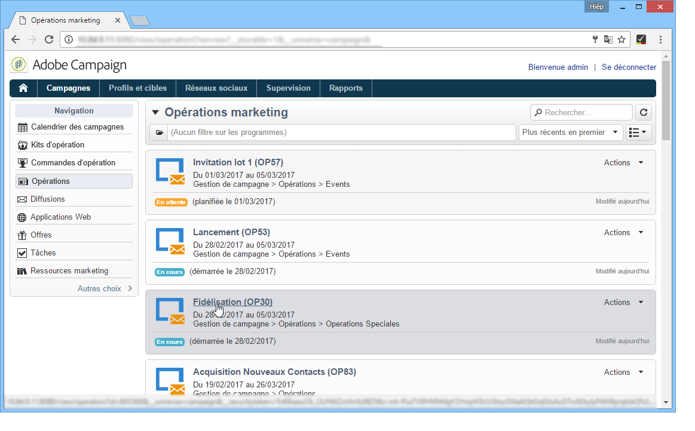

Outre la navigation dans les campagnes et leur affichage, vous pouvez effectuer les tâches suivantes :

* Surveillance de l’activité sur une instance
* Participation aux processus de validation, par exemple, validation ou refus du contenu d’une diffusion
* Exécution d’autres actions rapides, par exemple mis en pause d’un workflow
* Accès à toutes les fonctionnalités de rapport
* Participation aux discussions de forum

Ce tableau résume les actions que vous pouvez effectuer sur les campagnes à partir d’un navigateur :

| Page  | Action |
| --- | --- |
| Liste des campagnes, diffusions, offres, etc. | Suppression d’un élément de liste |
| Campagne | Annulation d’une campagne |
| Diffusion | Valider le contenu et la cible de la diffusion Envoyer le contenu de la diffusion Confirmer une diffusion Mettre en pause et arrêter une diffusion |
| Application web | Créer une application web Modifier le contenu et les propriétés de l’application Enregistrer le contenu de l’application en tant que modèle Publier l’application |
| Offre | Valider le contenu et l’éligibilité de l’offre Désactiver une offre en ligne |
| Tâche | Terminer une tâche Annuler une tâche |
| Ressource marketing | Approuver une ressource Verrouiller et déverrouiller une ressource |
| Package de campagnes | Soumettre un package pour validation Valider ou refuser un package Annuler un package |
| Commande de campagne | Créer une commande Accepter ou refuser une commande <!-- Je n'ai pas pu créer de campaign order pour vérifier cela. Peut-on accéder à ces fonctionnalités depuis l'accès web ? --> |
| Stock | Supprimer des données de stock |
| Simulation d’offres | Démarrer et arrêter une simulation |
| Workflow de ciblage | Démarrer, mettre en pause et arrêter un workflow |
| Rapport | Enregistrer les données actives dans l’historique du rapport |
| Forum | Ajouter une discussion Répondre à un message dans une discussion Suivre une discussion et s’en désabonner |

### Validations

Les validations (de la cible ou du contenu d&#39;une diffusion, par exemple) peuvent être réalisées par le biais d&#39;un accès web.

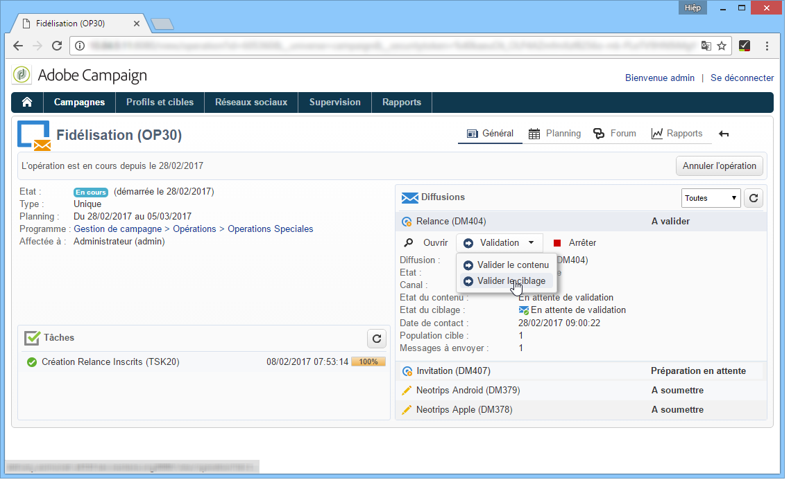

Vous pouvez également utiliser le lien contenu dans les messages de notification. Pour plus d&#39;informations, reportez-vous à la section [Contrôler et valider les diffusions](../../campaign/using/marketing-campaign-approval.md#checking-and-approving-deliveries).
