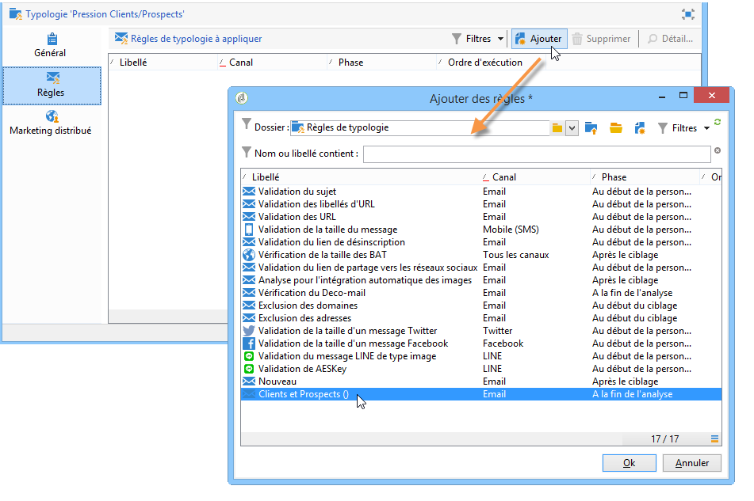
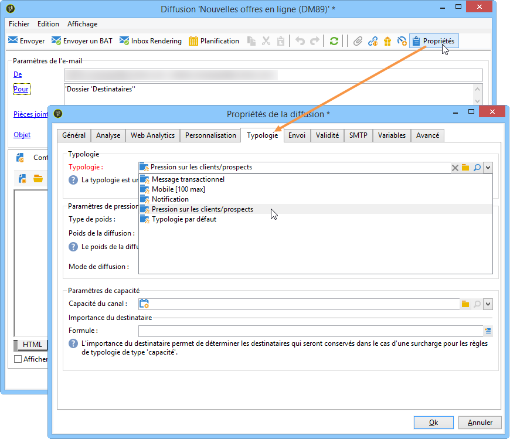
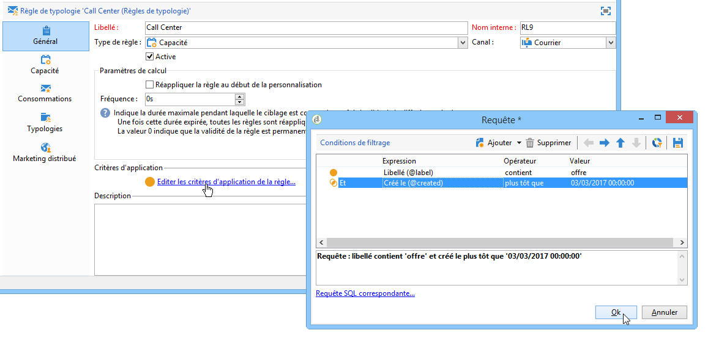
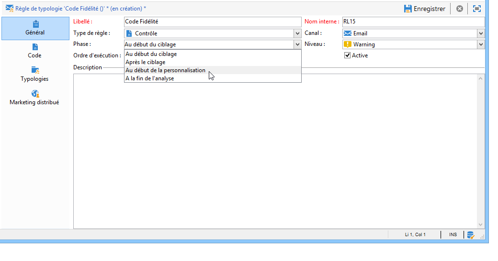
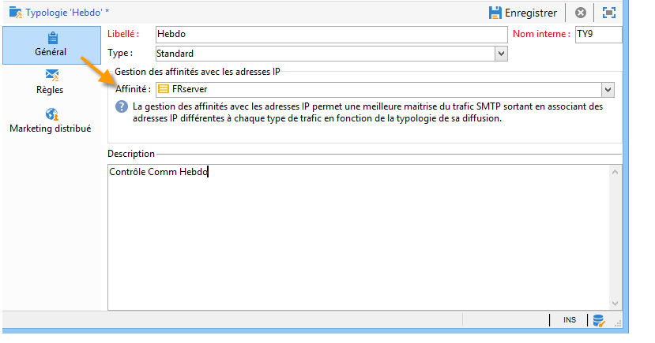
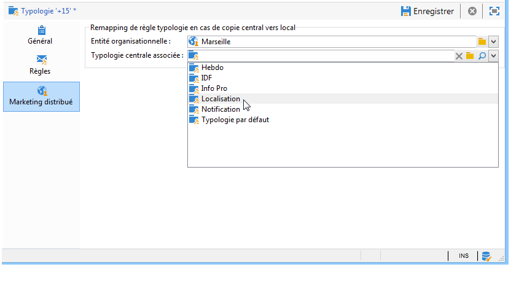

# Appliquer les règles{#applying-rules}

## Appliquer une typologie à une diffusion {#applying-a-typology-to-a-delivery}

Pour appliquer les règles de typologie que vous avez créées, vous devez les associer à une typologie, puis référencer cette typologie dans votre diffusion. Pour cela :

1. Créez une typologie de campagne.

   Les typologies sont accessibles via le noeud **[!UICONTROL Administration > Campaign Management > Typology management]** > **[!UICONTROL Typologies]** .

1. Go to the **[!UICONTROL Rules]** tab, click the **[!UICONTROL Add]** button and select the rules to apply with this typology.

   

1. Enregistrez la typologie : elle est alors ajoutée à la liste des typologies existantes.
1. Ouvrez la diffusion à laquelle vous souhaitez appliquer les règles.
1. Open the delivery properties and access the **[!UICONTROL Typology]** tab.
1. Sélectionnez la typologie dans la liste déroulante.

   

   >[!NOTE]
   >
   >La typologie peut être définie au niveau du modèle de diffusion afin d&#39;être appliquée automatiquement à toutes les diffusions créées à partir de ce modèle.

## Définir des critères d&#39;application {#defining-application-conditions}

Vous pouvez restreindre le champ d&#39;application d&#39;une règle selon vos besoins (sauf pour les règles de contrôle).

En effet, les règles de typologie peuvent ne concerner que certaines diffusions auxquelles elles sont associées, ou certains destinataires parmi la cible d&#39;une diffusion.

Pour définir les conditions d’application d’une règle, cliquez sur le **[!UICONTROL Edit the rule application conditions...]** lien dans l’ **[!UICONTROL General]** onglet.

Utilisez alors l&#39;éditeur de requêtes pour définir les conditions de filtrage. Dans l&#39;exemple ci-dessous, seules les diffusions contenant le terme &#39;offre&#39; dans leur libellé, et celles créées avant le 1er avril 2013, sont concernées par la règle de capacité.

>[!NOTE]
>
>Pour les règles de filtrage, vous pouvez sélectionner la condition d’application des critères de filtrage : elles peuvent dépendre de la prestation ou de l&#39; aperçu de la prestation. Pour plus d’informations, reportez-vous à la section [Conditionnement d’une règle](../../campaign/using/filtering-rules.md#conditioning-a-filtering-rule)de filtrage.

## Ajuster la fréquence des calculs {#adjusting-calculation-frequency}

Les arbitrages sont automatiquement ré-exécutés chaque nuit, via le workflow de nettoyage de la base. Vous pouvez toutefois conserver les valeurs calculées au-delà de ce délai.

En effet, certains calculs utilisent des valeurs qui ne changent pas quotidiennement. Il serait donc inutile de recalculer les données tous les jours, et de surcharger inutilement la base de données. Par exemple, si un processus alimente toutes les semaines la base de marketing avec les scores d&#39;appétence des clients et les éléments de consolidation des actes d&#39;achat, il est inutile de recalculer tous les jours les données basées sur ces valeurs.

Pour ce faire, le **[!UICONTROL Frequency]** champ de l’ **[!UICONTROL General]** onglet vous permet de définir une période maximale pendant laquelle le ciblage est enregistré. Par défaut, la valeur **0** indique que le calcul reste valide jusqu’à la prochaine exécution du réarbitrage quotidien.

To save the results beyond this period, enter a value greater than 12 in the **[!UICONTROL Frequency]** field: once this period expires, all rules are re-applied.

L’ **[!UICONTROL Re-apply the rule at the start of personalization]** option vous permet d’appliquer automatiquement la règle pendant la phase de personnalisation, y compris si la période indiquée dans le **[!UICONTROL Frequency]** champ est toujours valide.

## Sélectionner la phase d&#39;application de la règle {#selecting-the-rule-application-phase}

Les règles de typologies sont exécutées dans un ordre précis lors des phases de ciblage, d&#39;analyse et de personnalisation des diffusions auxquelles elles s&#39;appliquent.

### Ordre d&#39;exécution {#execution-order}

Dans un fonctionnement standard, les règles sont appliquées dans l&#39;ordre suivant :

1. Règles de contrôle, si elles s&#39;appliquent au début du ciblage.
1. Règles de filtrage :

   * Règles natives de l&#39;application pour la qualification des adresses : adresse définie / adresse non vérifiée / adresse en blackliste / adresse en quarantaine / qualité de l&#39;adresse.
   * Règles de filtrage définies par l&#39;utilisateur.
   * Règle de déduplication sur l&#39;adresse ou sur l&#39;identifiant (appliquée si nécessaire).

1. Règles de pression.
1. Règles de capacité.
1. Règles de contrôle, si elles s&#39;appliquent à la fin du ciblage.
1. Règles de contrôle, si elles s&#39;appliquent au début de la personnalisation. Si les règles utilisateurs (filtrage / pression / capacitif) sont à recalculer du fait de leur expiration, elles sont réappliquées à cette étape.
1. Règles de contrôle, si elles s&#39;appliquent à la fin de la personnalisation.

>[!NOTE]
>
>Si vous utilisez le module Interaction de Campaign, les règles d&#39;éligibilité aux offres sont appliquées avec les règles de filtrage (pour les offres présentes dans les compositions de diffusion) ou lors de la phase de personnalisation, lors de l&#39;appel au moteur d&#39;offres.

Vous pouvez adapter la séquence d’exécution des règles du même type à l’aide du champ approprié dans l’ **[!UICONTROL General]** onglet de la règle. Lorsque plusieurs règles sont exécutées au cours de la même phase de traitement des messages, vous pouvez configurer leur séquence d’exécution dans le **[!UICONTROL Execution sequence]** champ.

Par exemple, une règle de pression dont l&#39;ordre d&#39;exécution est positionné à 20 sera exécutée avant une règle de pression dont l&#39;ordre d&#39;exécution est positionné à 30.

### Cas des règles de contrôle {#control-rules}

Pour **[!UICONTROL Control]** les règles, vous pouvez décider à quel moment du cycle de vie de la diffusion la règle sera appliquée (avant ou après le ciblage, au début de la personnalisation, à la fin de l’analyse). Select the value to apply in the drop-down list of the **[!UICONTROL Phase]** field, in the **[!UICONTROL General]** tab of the typology rule.

Les valeurs possibles sont les suivantes :

* **[!UICONTROL At the start of targeting]**

   La règle de contrôle peut être appliquée à cette phase afin de ne pas exécuter l&#39;étape de personnalisation en cas d&#39;erreur.

* **[!UICONTROL After targeting]**

   Lorsqu&#39;il est utile de connaître le volume de la cible pour appliquer la règle de contrôle, sélectionnez cette phase.

   For example, the **[!UICONTROL Check proof size]** control rule applies after each targeting stage: this rule prevents message personalization if there are too many proof recipients.

* **[!UICONTROL At the start of personalization]**

   Cette phase doit être sélectionnée lorsque le contrôle porte sur la validation de la personnalisation des messages. La personnalisation des messages est réalisée au cours de la phase d&#39;analyse.

* **[!UICONTROL At the end of the analysis]**

   Lorsqu&#39;un contrôle nécessite que la personnalisation des messages soit terminée, sélectionnez cette phase.

## Paramétrages additionnels {#additional-configurations}

### Contrôle du trafic SMTP sortant {#control-outgoing-smtp-traffic}

Vous pouvez également utiliser le **[!UICONTROL Managing affinities with IP addresses]** champ pour lier les livraisons au serveur de distribution (MTA) de cette affinité. Cela vous permet de limiter le nombre de courriers électroniques pour des livraisons spécifiques vers des ordinateurs ou des adresses de sortie.

>[!NOTE]
>
>Affinity management does not apply for **[!UICONTROL Filtering]** typologies.\
>Les affinités sont définies directement dans le fichier de configuration de l&#39;instance, sur le serveur Adobe Campaign. Voir à ce sujet [cette section](../../installation/using/about-initial-configuration.md).

### Campaign Optimization et le Marketing Distribué {#campaign-optimization-and-distributed-marketing}

L’ **[!UICONTROL Distributed Marketing]** onglet vous permet de définir le remappage des typologies et/ou des règles qui s’appliquent lorsqu’une campagne partagée est commandée et/ou réservée. Les typologies/règles définies pour une entité locale (liées à celles définies pour l&#39;entité centrale) remplacent les règles/typologies liées à l&#39;entité centrale. Le remappage permet d’adapter les règles d’entité centrale aux entités locales qui commandent la campagne.

>[!NOTE]
>
>In typologies and typology rules, the **[!UICONTROL Distributed Marketing]** tab is added if your license includes this option: please check you license agreement.\
>Pour plus d’informations sur le marketing distribué, voir [A propos du marketing](../../campaign/using/about-distributed-marketing.md)distribué.

