# Simulation de campagnes{#campaign-simulations}

## A propos des simulations {#about-simulations}

Campaign Optimization permet de tester l&#39;efficacité d&#39;un plan de campagne au travers des simulations. Vous pouvez ainsi mesurer le succès potentiel d&#39;une campagne : le revenu généré, le volume de la cible en fonction des règles de typologies appliquées, etc.

La simulation permet de suivre et de comparer l&#39;impact des diffusions les unes par rapport aux autres.

>[!NOTE]
>
>Les diffusions préparées en mode Test n&#39;ont pas d&#39;impact les unes sur les autres, par exemple lors de l&#39;évaluation d&#39;une opération dans le cadre du marketing distribué, ou tant que l&#39;inscription des diffusions au calendrier prévisionnel n&#39;est pas validée.\
>Cela signifie que les règles de pression et de capacité ne sont appliquées qu&#39;aux livraisons en **[!UICONTROL Target estimation and message personalization]** mode. Les livraisons en **[!UICONTROL Estimation and approval of the provisional target]** mode et en **[!UICONTROL Target evaluation]** mode ne sont pas prises en compte.\
>The delivery mode is chosen in the **[!UICONTROL Typology]** sub-tab of the delivery properties.

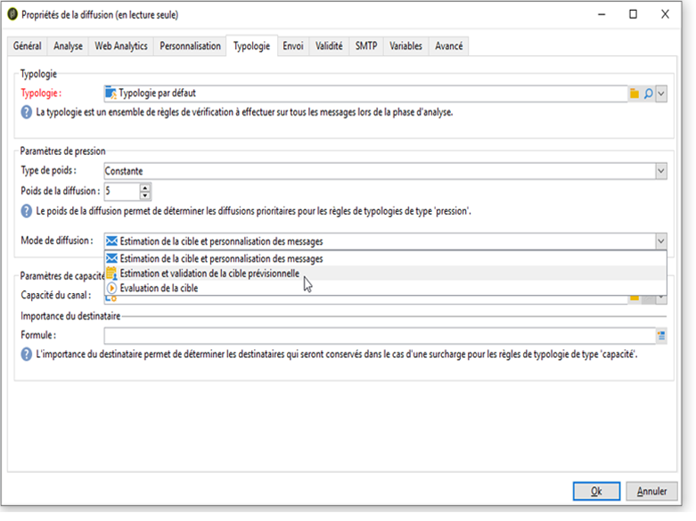

## Configurer une simulation {#setting-up-a-simulation}

### Créer une simulation {#creating-a-simulation}

Pour créer une simulation, les étapes sont les suivantes :

1. Go to the **[!UICONTROL Campaigns]** universe, click the **[!UICONTROL More]** link within the **[!UICONTROL Create]** section and select the **[!UICONTROL Simulation]** option.

   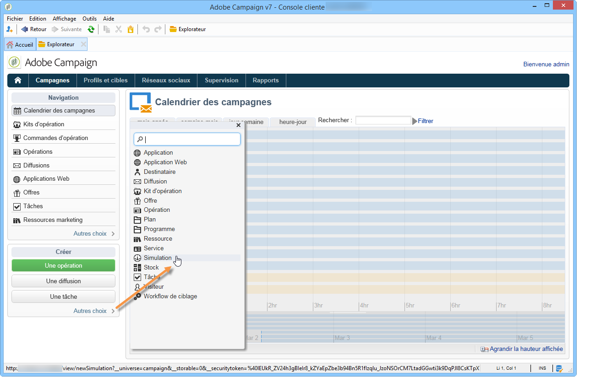

1. Entrez le modèle et le nom de la simulation. Cliquez sur **[!UICONTROL Save]** pour créer la simulation.

   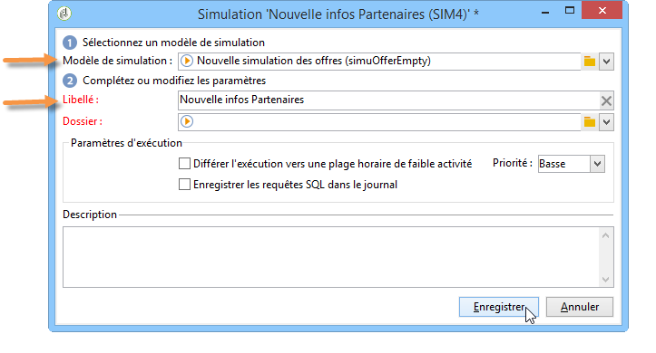

1. Click the **[!UICONTROL Edit]** tab to configure it.

   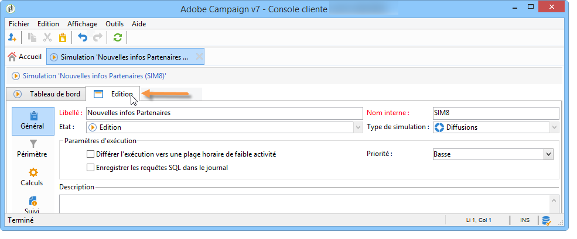

1. Dans l’ **[!UICONTROL Scope]** onglet, spécifiez les livraisons à prendre en compte pour cette simulation. Pour ce faire, cliquez sur le **[!UICONTROL Add]** bouton et spécifiez le mode de sélection de remise à prendre en compte.

   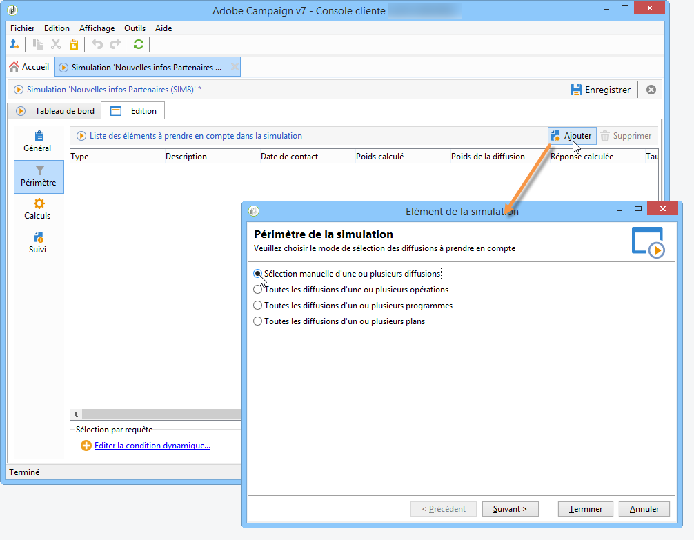

   Vous pouvez sélectionner unitairement chaque diffusion ou considérer celles appartenant à une ou plusieurs opérations, programmes ou plans.

   >[!NOTE]
   >
   >Si vous sélectionnez des livraisons par le biais d’un plan, d’un programme ou d’une campagne, Adobe Campaign peut automatiquement actualiser la liste des livraisons afin de tenir compte de chaque lancement d’une simulation. Pour ce faire, cochez l’ **[!UICONTROL Refresh the selection of deliveries each time the simulation is started]** option.
   >  
   >Dans le cas contraire, seules les diffusions présentes dans le plan, le programme et la ou les opérations au moment de la création de la simulation seront prises en comptes : les diffusions ajoutées ultérieurement seront ignorées.

   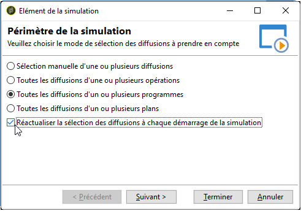

1. Sélectionnez les éléments à inclure dans le périmètre de la simulation. Au besoin, vous pouvez effectuer une multi-sélection en utilisant les touches MAJ et CTRL du clavier.

   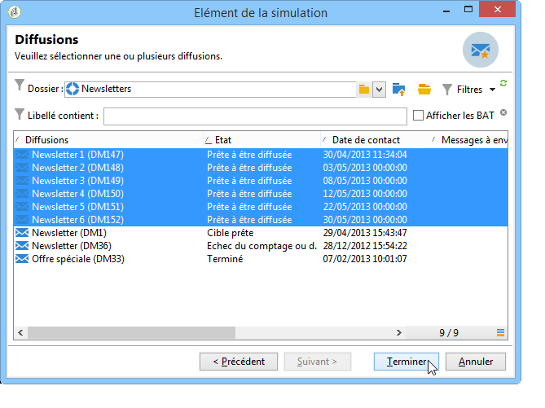

   Cliquez sur **[!UICONTROL Finish]** pour valider la sélection.

   Il est possible de combiner des diffusions sélectionnées manuellement avec celles appartenant à un ou plusieurs plans, programmes ou opérations.

   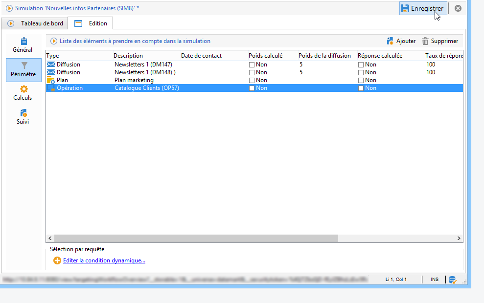

   Si nécessaire, vous pouvez utiliser une condition dynamique via le **[!UICONTROL Edit the dynamic condition...]** lien

   Click **[!UICONTROL Save]** to approve this configuration.

   >[!CAUTION]
   >
   >Seules les diffusions dont la cible a été calculée sont prises en compte dans les calculs des simulations (états : **Cible prête** ou **Prête à être diffusée**).

1. In the **[!UICONTROL Calculations]** tab, select an analysis dimension such as the recipient schema for example.

   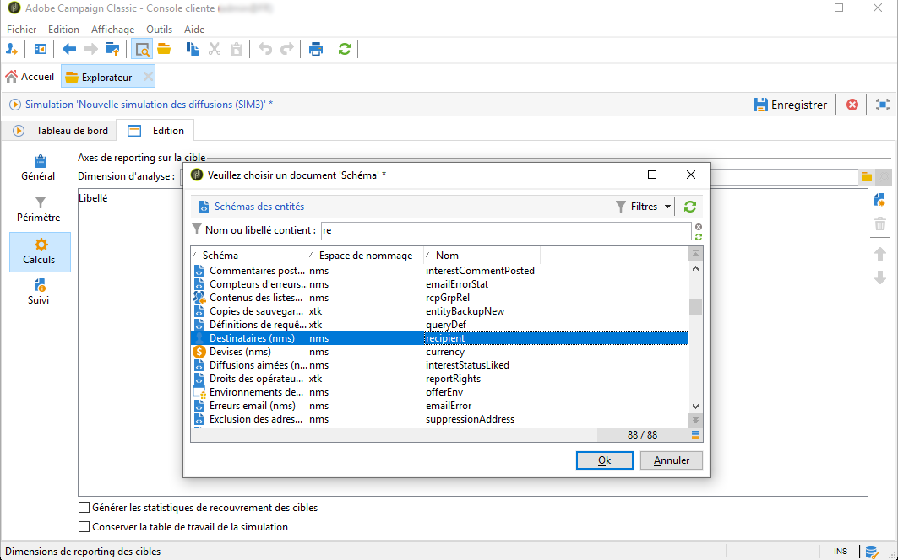

1. Vous pouvez ensuite ajouter des expressions.

   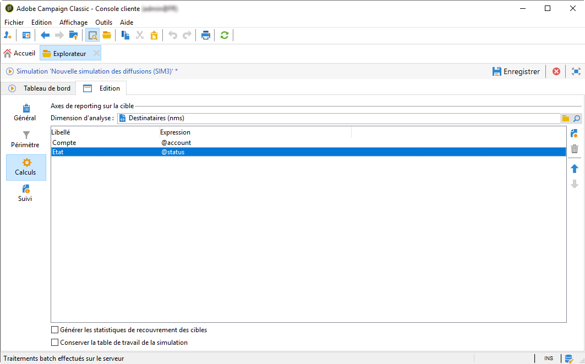

### Paramètres d&#39;exécution {#execution-settings}

The **[!UICONTROL General]** tab of the simulation lets you enter execution settings:

* L’ **[!UICONTROL Schedule execution for down-time]** option reporte le lancement de la simulation à une période moins occupée, en fonction du niveau de priorité choisi. Les simulations utilisent des ressources de base de données importantes, c&#39;est pourquoi les simulations non urgentes devraient être programmées la nuit, par exemple.
* The **[!UICONTROL Priority]** is the level applied to the simulation to delay its triggering.
* **[!UICONTROL Save SQL queries in the log]**. Les journaux SQL vous permettent de diagnostiquer une simulation lorsqu’elle se termine par des erreurs. Ils peuvent également vous aider à comprendre pourquoi une simulation est trop lente. Ces messages seront visibles après la simulation dans le **[!UICONTROL SQL logs]** sous-onglet de l’ **[!UICONTROL Audit]** onglet.

## Exécuter la simulation {#executing-a-simulation}

### Démarrer une simulation {#starting-a-simulation}

Une fois le périmètre de la simulation défini, vous pouvez l&#39;exécuter.

To do this, open the simulation dashboard and click **[!UICONTROL Start simulation]**.

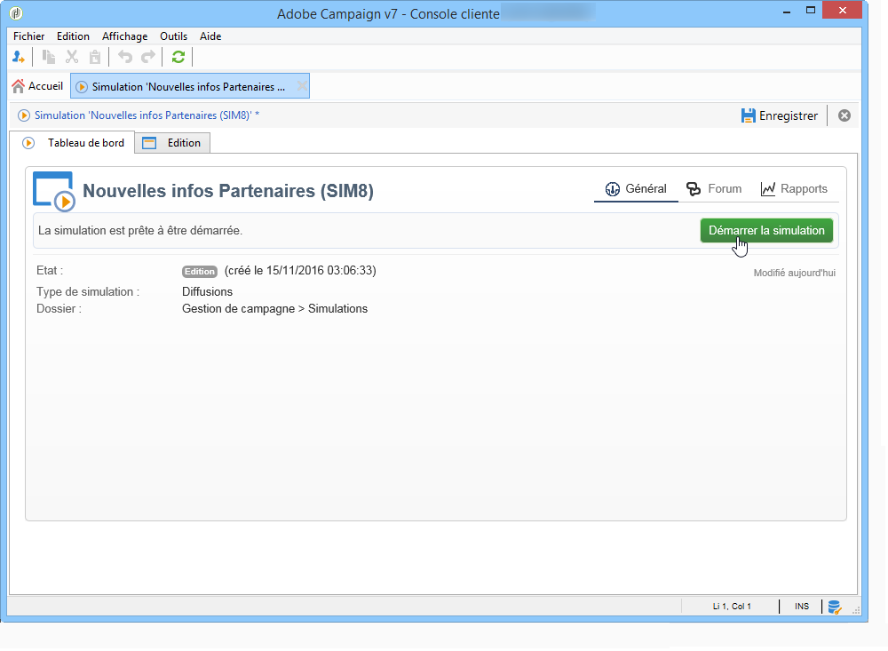

Once execution is complete, open the simulation and click the **[!UICONTROL Results]** tab to view the targets calculated for each delivery.

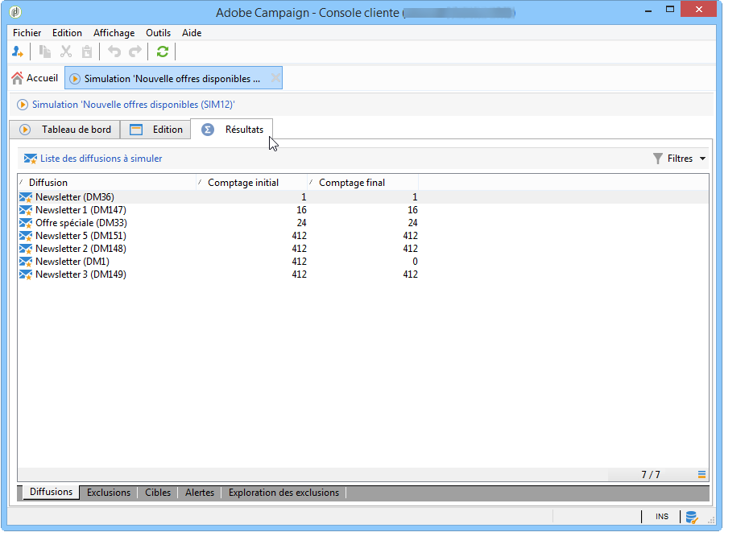

1. Le **[!UICONTROL Deliveries]** sous-onglet répertorie toutes les livraisons prises en compte par la simulation. Il montre deux chiffres :

   * The **[!UICONTROL Initial count]** is the target as it was calculated during its estimation in the delivery.
   * The **[!UICONTROL Final count]** is the number of recipients counted after simulation.

      Le delta entre comptage initial et final reflète l&#39;application des différentes règles ou filtrages paramétrés en amont de la simulation.

      Pour comprendre ce calcul, éditez le sous-onglet **[!UICONTROL Exclusions]**.

1. Le sous-onglet **[!UICONTROL Exclusions]** permet de visualiser la répartition des exclusions par diffusions.

   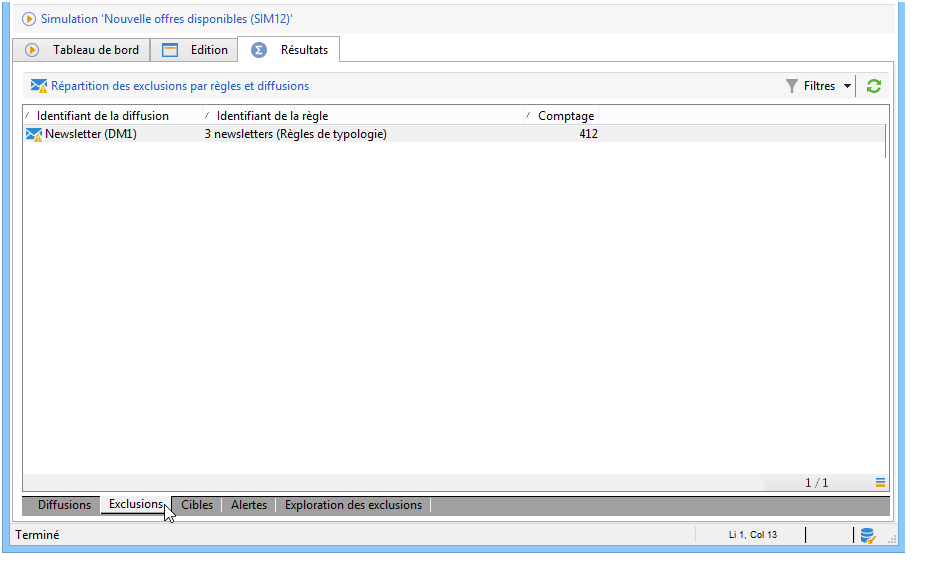

1. Le **[!UICONTROL Alerts]** sous-onglet regroupe tous les messages d’alerte générés pendant la simulation. Des messages d’alerte peuvent être envoyés en cas de surcharge de capacité (si le nombre de destinataires ciblés dépasse la capacité définie, par exemple).
1. Le **[!UICONTROL Exploration of the exclusions]** sous-onglet permet de créer un tableau d’analyse des résultats. L’utilisateur doit indiquer des variables dans les axes abscisses/ordinates.

   For an example of analysis table creation, refer to the end of [Exploring results](#exploring-results).

### Consulter les résultats {#viewing-results}

#### Journal {#audit}

L’ **[!UICONTROL Audit]** onglet permet de surveiller l’exécution de la simulation. Le **[!UICONTROL SQL Logs]** sous-onglet est utile aux utilisateurs expérimentés. Il répertorie les journaux d’exécution au format SQL. Ces journaux ne s’affichent que si l’ **[!UICONTROL Save SQL queries in the log]** option a été sélectionnée dans l’ **[!UICONTROL General]** onglet avant l’exécution de la simulation.

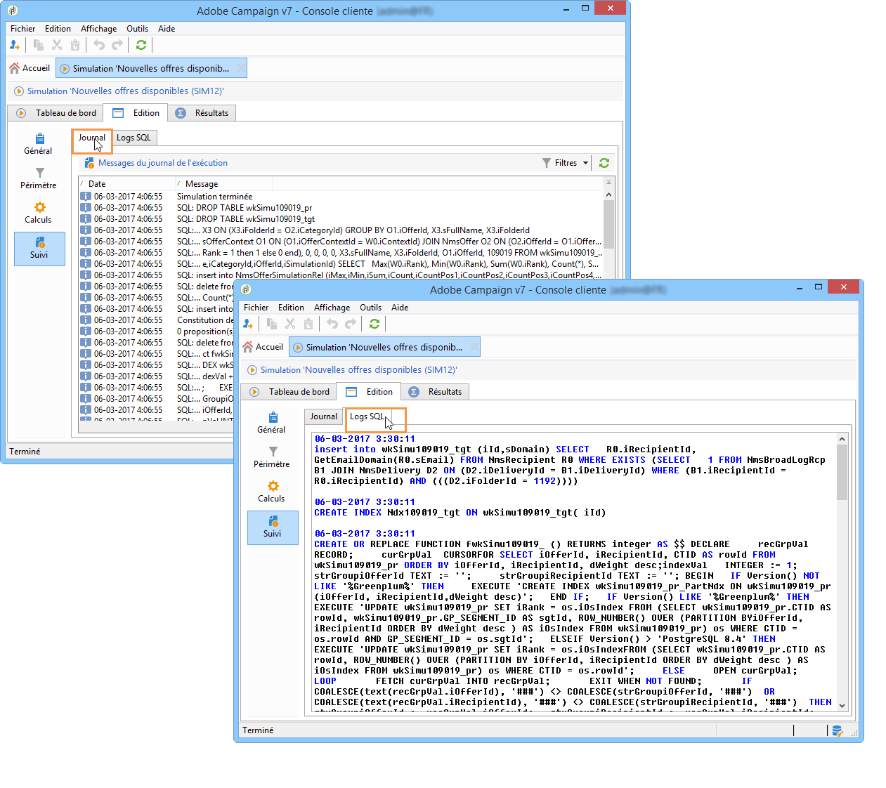

#### Explorer les résultats {#exploring-results}

Le **[!UICONTROL Exploration of the exclusions]** sous-onglet permet d’analyser les données résultant d’une simulation.

L&#39;analyse descriptive est présentée dans cette [section](../../reporting/using/about-adobe-campaign-reporting-tools.md).

## Résultats d&#39;une simulation {#results-of-a-simulation}

Les indicateurs dans les **[!UICONTROL Log]** onglets **[!UICONTROL Results]** et fournissent un premier aperçu des résultats de la simulation. Pour une vue plus détaillée des résultats, ouvrez l’ **[!UICONTROL Reports]** onglet.

### Rapports {#reports}

Pour analyser le résultat d&#39;une simulation, éditez les rapports qui lui sont associés: ils présentent les exclusions de la simulation et leurs causes.

Par défaut, les rapports suivants sont proposés :

* **[!UICONTROL Detail of simulation exclusions]** : ce rapport fournit un tableau détaillé des causes d&#39;exclusion pour toutes les livraisons concernées.
* **[!UICONTROL Simulation summary]** : ce rapport montre les populations exclues de la simulation tout au long des différentes livraisons.
* **[!UICONTROL Summary of exclusions linked to the simulation]** : ce rapport montre un graphique des exclusions causées par la simulation, ainsi que la règle de typologie appliquée et un graphique montrant le ratio d’exclusion par règle.

>[!NOTE]
>
>Vous pouvez créer des rapports et les ajouter aux rapports proposés. Voir à ce sujet [cette section](../../reporting/using/about-adobe-campaign-reporting-tools.md).

To access reports, click the **[!UICONTROL Reports]** link of the targeted simulation via its dashboard.

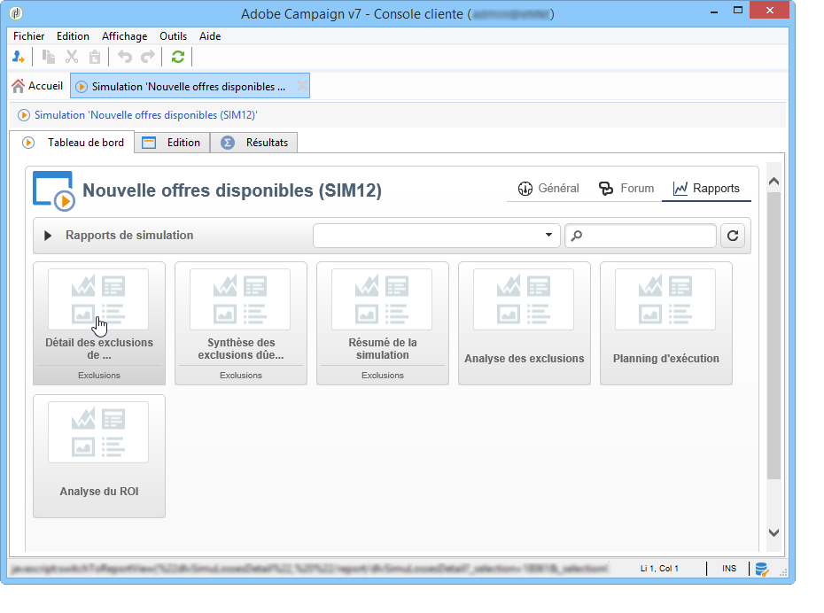

You can also edit reports using the **[!UICONTROL Reports]** link accessible from the simulation dashboard.

### Comparer les simulations {#comparing-simulations-}

A nouvelle exécution d&#39;une simulation, le résultat calculé remplace le résultat antérieur : vous ne pouvez pas afficher et comparer les résultats d&#39;une exécution à l&#39;autre.

Pour comparer les résultats, vous devez utiliser les rapports. En effet, Adobe Campaign permet d&#39;enregistrer un historique de rapport afin de le ré-afficher ultérieurement : cet historique est conservé tout au long du cycle de vie de la simulation.

**Exemple:**

1. Créez une simulation sur une diffusion à laquelle la typologie **A** est appliquée.
1. Dans l’ **[!UICONTROL Reports]** onglet, modifiez l’un des rapports disponibles, par exemple **[!UICONTROL Detail of simulation exclusions]** .
1. Dans la section supérieure droite du rapport, cliquez sur l&#39;icône de création d&#39;un nouvel historique.

   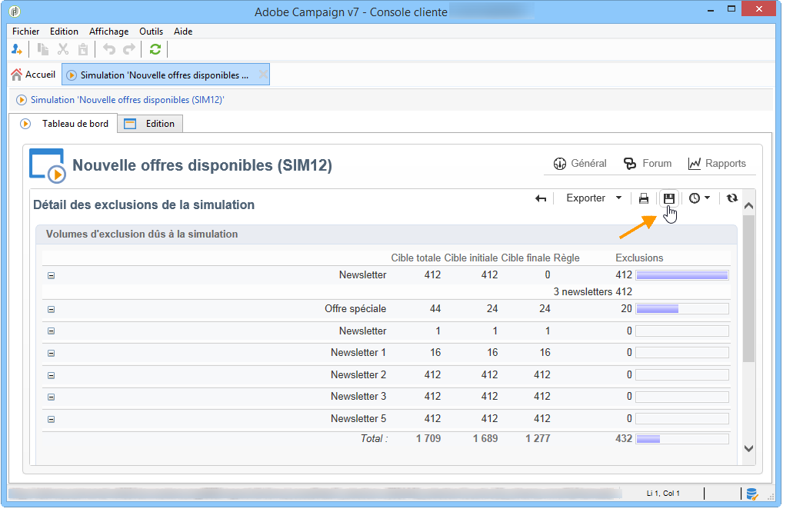

1. Fermez cette simulation et modifiez le paramétrage de la typologie **A**.
1. Exécutez à nouveau la simulation et comparez le résultat obtenu à celui affiché dans le rapport dont vous avez créé l&#39;historique.

   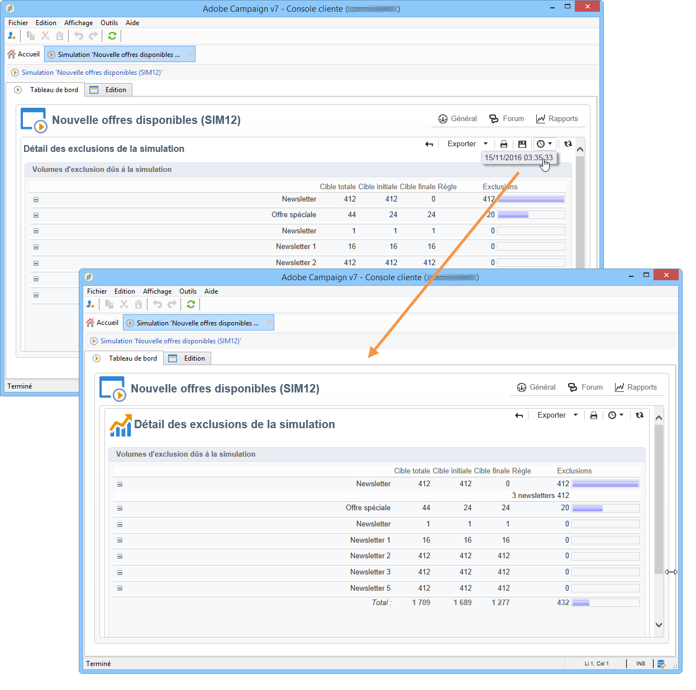

   Vous pouvez enregistrer autant d&#39;historiques de rapports que nécessaire.

### Axes de reporting {#reporting-axes}

L’ **[!UICONTROL Calculations]** onglet vous permet de définir les axes des rapports sur la cible. Ces axes seront utilisés lors de l’analyse des résultats (voir [Exploration des résultats](#exploring-results)).

>[!NOTE]
>
>Il est recommandé de définir des axes de calculs dans un modèle de simulation plutôt que dans chaque simulation.\
>Les modèles de simulation sont enregistrés dans le **[!UICONTROL Resources > Templates > Simulation templates]** noeud de l’arborescence Adobe Campaign.

**Exemple:**

Dans l&#39;exemple suivant, nous allons créer un axe de reporting supplémentaire portant sur le statut du destinataire (&quot;Client&quot;, &quot;Prospect&quot; ou aucun).

1. Pour définir un axe de création de rapports, sélectionnez le tableau contenant les informations à traiter dans le **[!UICONTROL Analysis dimension]** champ. Cette information est obligatoire.
1. Ici, nous allons sélectionner le champ Segment de la table des destinataires.

   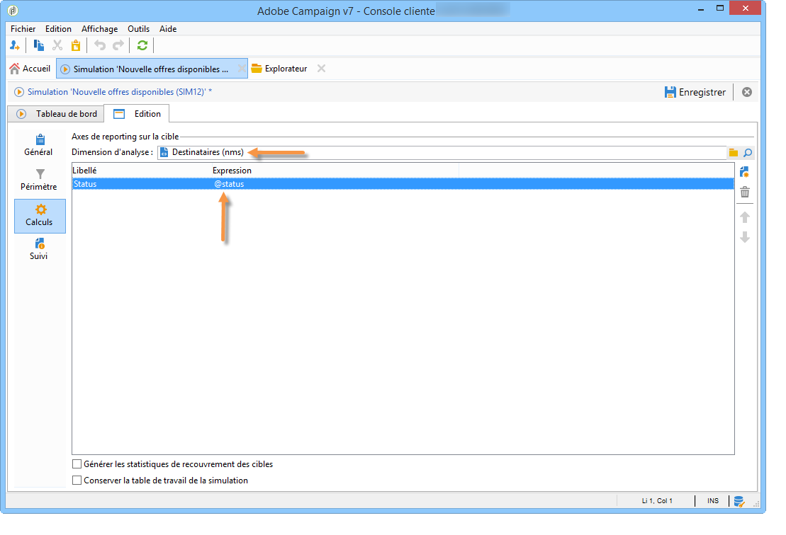

1. Les options disponibles sont les suivantes :

   * **[!UICONTROL Generate target overlap statistics]** permet de récupérer toutes les statistiques de chevauchement dans le rapport de simulation. Les chevauchements sont des destinataires ciblés dans au moins deux livraisons au sein d’une même simulation.

      >[!CAUTION]
      >
      >Le choix de cette option augmente considérablement le temps d&#39;exécution de la simulation.

   * **[!UICONTROL Keep the simulation work table]** permet de conserver les traces de simulation.

      >[!CAUTION]
      >
      >La conservation systématique de ces tables requiert une capacité de stockage élevée : assurez-vous que la taille de la base de données le permet.

When the simulation results are displayed, the information on the selected expression will be displayed in the **[!UICONTROL Overlaps]** sub-tab.

Les recouvrements des cibles de diffusions indiquent les destinataires ciblés dans au moins deux des diffusions d&#39;une simulation.

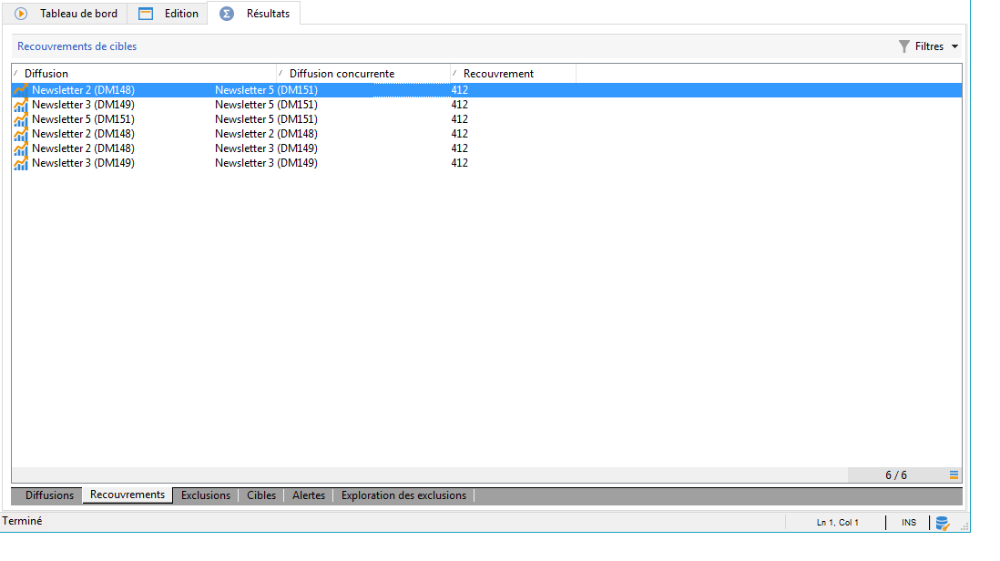

>[!NOTE]
>
>Ce sous-onglet s’affiche uniquement si l’ **[!UICONTROL Generate target recovery statistics]** option a été activée.

Les informations sur les axes de création de rapports peuvent être traitées dans les rapports d’analyse des exclusions créés dans le **[!UICONTROL Exploring exclusions]** sous-onglet. For more on this, refer to [Exploring results](#exploring-results).
