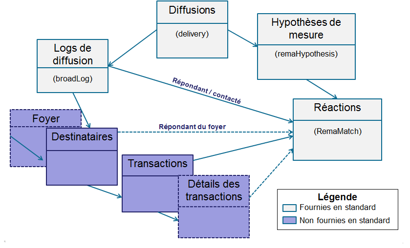
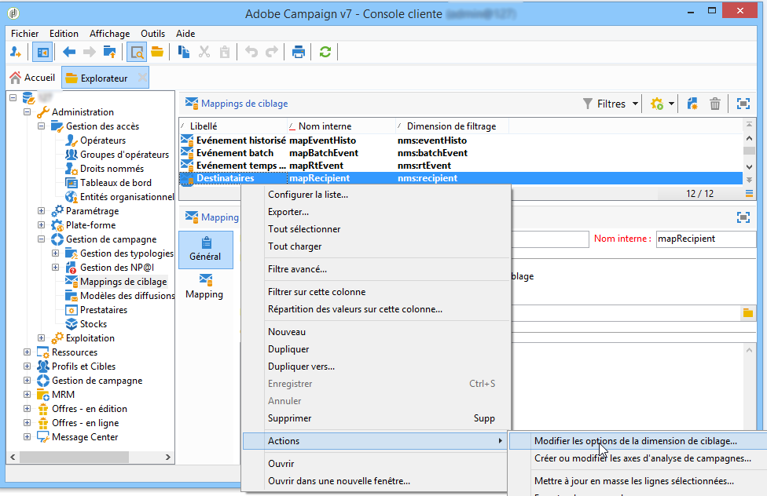
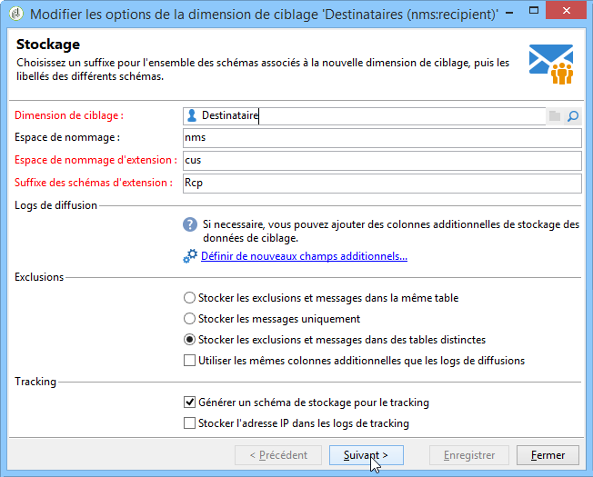
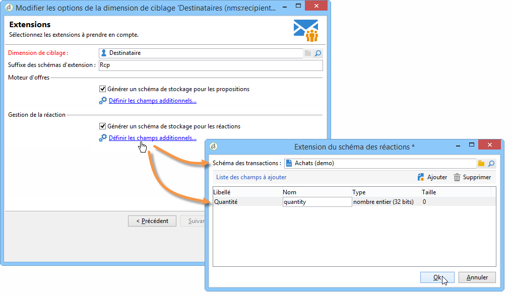

# Configuration{#configuration}

Cette section s&#39;adresse aux opérateurs chargés du paramétrage de la gestion de la réaction. La mise en oeuvre de cette configuration requiert des connaissances en termes d&#39;extension de schémas, de création et gestion de workflows et de programmation SQL.

Elle permet de comprendre comment adapter le modèle de données standard aux spécificités d&#39;une table de transactions externe à Adobe Campaign avec la table des individus. Cette table d&#39;individus peut correspondre à la table des destinataires disponible dans Adobe Campaign ou à une table différente.

L’hypothèse de mesure est lancée par le processus d’opération ( **[!UICONTROL operationMgt]** ). Chaque hypothèse représente un processus distinct exécuté de manière asynchrone avec un état d’exécution (En cours de modification, En attente, Terminé, Echec, etc.) et contrôlé par un planificateur qui gère les contraintes de priorité, la restriction du nombre de processus simultanés, la page de faible activité et l’exécution automatique avec fréquence.

## Paramétrage des schémas {#configuring-schemas}

>[!CAUTION]
>
>Vous ne devez pas modifier directement les schémas standards de l&#39;application mais utiliser le mécanisme d&#39;extension de schémas, à défaut de quoi les éventuelles mises à jour ultérieures de l&#39;application risquent d&#39;écraser les schémas modifiés, ce qui pourrait entraîner des dysfonctionnements dans l&#39;utilisation d&#39;Adobe Campaign.

Avant toute utilisation du module de la réaction, vous devez définir les différentes tables (transactions, détails des transactions) et leur relation avec les diffusions, les offres et les individus.

### Schémas standards {#standard-schemas}

Le **[!UICONTROL nms:remaMatch]** schéma prêt à l&#39;emploi contient la table du journal des réactions, c&#39;est-à-dire la relation entre les individus, l&#39;hypothèse et la table des transactions. Ce schéma doit être utilisé comme schéma d&#39;héritage pour la table de destination finale des journaux des réactions.

Le **[!UICONTROL nms:remaMatchRcp]** schéma est également fourni en tant que norme. Il contient le stockage des journaux de réaction pour les destinataires d’Adobe Campaign ( **[!UICONTROL nms:recipient]** ). Pour pouvoir être utilisé, il faudra l&#39;étendre à une table de transactions (contenant des achats, etc.).

### Tables des transactions et des détails des transactions {#transaction-tables-and-transaction-details}

La table des transactions doit comporter un lien direct vers les individus.

Vous pouvez aussi ajouter une table contenant les détails des transactions, qui elle n&#39;est pas liée directement aux individus.

Par exemple dans le cas d&#39;un ticket de caisse, une table des transactions est liée au contact (la table des tickets) et une table des lignes de tickets n&#39;est reliée qu&#39;à la table des tickets (la table des détails). Vous pouvez ainsi paramétrer l&#39;hypothèse directement au niveau de la table des lignes de tickets associée à la table des tickets.

>[!NOTE]
>
>Si vous souhaitez conserver l&#39;identifiant des lignes de ticket qui décrit le comportement attendu dans l&#39;hypothèse, vous pouvez étendre le modèle de la table nms:remaMatchRcp afin d&#39;y ajouter ce dernier (dans ce cas, aucun calcul de ROI n&#39;est associé à ces champs).

L&#39;ajout d&#39;une date d&#39;évènement est également fortement recommandée.

Le schéma suivant représente les jointures entre les différentes tables une fois le paramétrage effectué :



### Gestion de la réaction avec les destinataires Adobe Campaign {#response-management-with-adobe-campaign-recipients}

Dans cet exemple, vous allez intégrer une table d&#39;actes d&#39;achats dans votre module de gestion de la réaction en utilisant la table des destinataires d&#39;Adobe Campaign ( **[!UICONTROL nms:recipient]** ).

La table des journaux des réponses sur un **[!UICONTROL nms:remaMatchRcp]** destinataire est étendue pour ajouter un lien au schéma de la table des achats. Dans l’exemple suivant, le tableau d’achat s’appelle **demo:purchase**.

1. Dans l’explorateur Adobe Campaign, sélectionnez **[!UICONTROL Administration]** > **[!UICONTROL Campaign management]** > **[!UICONTROL Target mappings]**.
1. Cliquez avec le bouton droit sur **Destinataire** , puis sélectionnez **[!UICONTROL Actions]** et **[!UICONTROL Modify the options of the targeting dimensions]**.

   

1. You can personalize the **[!UICONTROL Extension namespace]** in the next window, then click **[!UICONTROL Next]**.

   

1. Dans la **[!UICONTROL Response management]** catégorie, assurez-vous que la **[!UICONTROL Generate a storage schema for reactions]** case est cochée.

   Then click **[!UICONTROL Define additional fields...]** to select the related transaction tables and add the desired fields to the extension of the nms:remaMatchRcp schema.

   

Le schéma alors créé se présente comme suit :

```
<srcSchema _cs="Reactions (Recipients) (cus)" entitySchema="xtk:srcSchema" extendedSchema="nms:remaMatchRcp" 
img="nms:remaMatch.png" implements="xtk:persist" label="Reactions (Recipients)" mappingType="sql"
name="remaMatchRcp" namespace="cus">  
 <element label="Reactions (Recipients)" name="remaMatchRcp">    
  <key internal="true" name="match">      
   <keyfield xlink="hypothesis"/>      
   <keyfield xlink="broadLog"/>      
   <keyfield xlink="proposition"/>    
  </key>    
  <attribute label="Quantity" name="quantity" type="long"/>    
  <element name="purchase" target="demo:purchase" type="link"/>    
  <element name="hypothesis" revLabel="Reactions (Recipients)" revLink="remaMatchRcp"/>    
  <element applicableIf="HasPackage('nms:coreInteraction')" label="Proposition" name="proposition" target="nms:propositionRcp" type="link"/>   
  <element desc="Message (Delivery log)" label="Message" name="broadLog" target="nms:broadLogRcp" type="link"/>    
  <element label="Respondent" name="responder" target="nms:recipient" type="link"/>  
 </element>  
 <createdBy _cs="Administrator (admin)"/>  
 <modifiedBy _cs="Administrator (admin)"/>
</srcSchema>
```

### Gestion de la réaction avec une table des destinataires personnalisée {#response-management-with-a-personalized-recipient-table}

Dans cet exemple, vous allez intégrer une table d&#39;actes d&#39;achat dans votre module de gestion de la réaction en utilisant une table d&#39;individus autre que la table des destinataires disponible dans Adobe Campaign.

* Création d&#39;un nouveau schéma de logs de réaction dérivé du schéma **[!UICONTROL nms:remaMatch]**.

   La table des personnes étant différente de celle des destinataires d’Adobe Campaign, il est nécessaire de créer un nouveau schéma des journaux de réponses basé sur le **[!UICONTROL nms:remaMatch]** schéma. Complétez-le ensuite avec des liens vers les journaux de livraison et le tableau d’achat.

   In the following example, we will use the **demo:broadLogPers** schema and the **demo:purchase** transaction table:

   ```
   <srcSchema desc="Linking of a recipient transaction to a hypothesis"    
   img="nms:remaMatch.png" label="Responses on persons" labelSingular="Responses on a person" name="remaMatchPers" namespace="nms">
     <element name="remaMatchPers" template="nms:remaMatch">
       <key internal="true" name="match">
         <keyfield xlink="hypothesis"/>
        <keyfield xlink="purchase"/>
       </key>
   
       <element name="hypothesis" revLabel="Response logs for persons" revLink="remaMatchPers"/>
       <element applicableIf="HasPackage('nms:interaction')" label="Proposition" name="proposition"
                target="demo:propositionPers" type="link"/>
       <element label="Delivery log" name="broadLog" target="demo:broadLogPers" type="link"/>
     </element>
   </srcSchema>
   ```

* Modifying the hypothesis form in the **[!UICONTROL nms:remaHypothesis]** schema.

   Par défaut, la liste des logs de réaction est visible dans les logs des destinataires. Il faut donc modifier la forme des hypothèses pour pouvoir visualiser les nouveaux logs de réaction créés à l&#39;étape précédente.

   Par exemple :

   ```
    <container type="visibleGroup" visibleIf="[context/@remaMatchStorage]= 'demo:remaMatchPers'">
                 <input hideEditButtons="true" img="nms:remaMatch.png" nolabel="true" refresh="true"
                  toolbarCaption="Responses generated by the hypothesis" type="linklist"
                  xpath="remaMatchPers">
             <input xpath="[.]"/>
             <input xpath="@controlGroup"/>
           </input>
      </container> 
   ```

## Gestion des indicateurs {#managing-indicators}

Le module Response Manager est fourni avec une liste d&#39;indicateurs prédéfinis. Vous pouvez cependant ajouter d&#39;autres indicateurs de mesures personnalisés.

Pour cela, vous devez étendre la table des hypothèses en insérant deux champs pour chaque nouvel indicateur :

* le premier pour la population ciblée ;
* le second pour la population témoin.

Par exemple :

```
<srcSchema entitySchema="xtk:srcSchema" extendedSchema="nms:remaHypothesis" label="Measurement hypothesis" 
md5="1D4DED54FF8EC2432AED6736EDE6F547" name="remaHypothesis" namespace="demo" xtkschema="xtk:srcSchema">  
    <element name="remaHypothesis">    
        <element name="indicators">      
            <!-- Quantity -->      
            <attribute label="Total contacted" name="contactReactedTotalQuantity" type="long"/>
            <attribute label="Total number of people in the control group" name="proofReactedTotalquantity" type="long"/> 
        </element> 
    </element>
</srcSchema>
```

