# Règles de cohérence{#consistency-rules}

## A propos des règles de cohérence {#about-consistency-rules}

Adobe Campaign permet d&#39;assurer la cohérence des communications au travers d&#39;un ensemble de règles regroupées dans des typologies de campagne. Ces règles ont pour objectif d&#39;assurer un contrôle sur les diffusions envoyées aux destinataires, leur volume, leur nature, leur pertinence, etc.

**Les règles de capacité** , par exemple, peuvent éviter de surcharger la plateforme concernée par la diffusion de messages. Par exemple, les offres spéciales qui contiennent un lien de téléchargement ne doivent pas être envoyées simultanément à un trop grand nombre de personnes pour éviter de saturer le serveur ; les campagnes par téléphone ne doivent pas dépasser la capacité de traitement des centres d&#39;appel, etc. For more on this, refer to [Controlling capacity](#controlling-capacity).

## Contrôler la capacité {#controlling-capacity}

Avant de diffuser des messages, vous devez vous assurer que votre organisation a la capacité de gérer l&#39;envoi (infrastructure matérielle), les réponses que la diffusion peut générer (messages entrants), le nombre d&#39;appels à assurer pour contacter les adhérents (capacités de traitement du centre d&#39;appels), etc.

To do this, you need to create **[!UICONTROL Capacity]** typology rules.

Dans l&#39;exemple suivant, nous allons créer une règle de typologie pour une campagne de fidélisation par téléphone. Elle permettra de limiter le nombre de messages à 20 par jour, c&#39;est-à-dire la capacité de traitement des appels par un centre d&#39;appels. Cette règle sera ensuite appliquée à deux diffusions afin de suivre son effet par le biais des logs.

Pour créer une règle de capacité, procédez comme suit :

1. Sous le **[!UICONTROL Administration > Campaign management > Typology management > Typology rules]** noeud, cliquez sur **[!UICONTROL New]**.
1. Select a **[!UICONTROL Capacity]** rule type.

   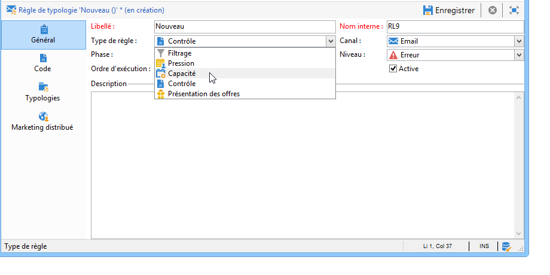

1. Dans l’ **[!UICONTROL Capacity]** onglet, créez les lignes de disponibilité : dans notre exemple, il s&#39; agit de périodes pendant lesquelles des appels peuvent être faits. Sélectionnez une période de 24 heures et entrez 150 dans la quantité initiale, ce qui signifie que le centre d’appels peut gérer 150 appels par jour.

   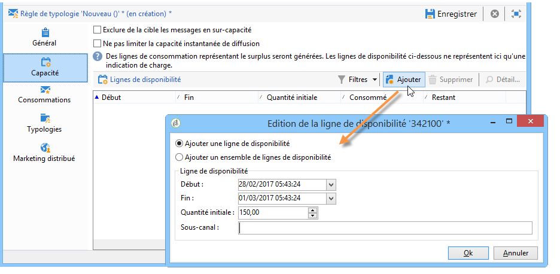

   >[!NOTE]
   >
   >Les lignes de disponibilité n&#39;ont qu&#39;un caractère indicatif. Si vous devez exclure des messages lorsque la limite de capacité est atteinte, reportez-vous à [cette section](#exclude-messages-when-capacity-limit-reached).

1. Associez cette règle à une typologie, puis référencez cette typologie au niveau de la diffusion pour appliquer cette règle de capacité. Pour plus d&#39;informations, consultez [cette section](../../campaign/using/applying-rules.md#applying-a-typology-to-a-delivery).
1. You can monitor consumption from the rule **[!UICONTROL Consumptions]** and **[!UICONTROL Capacity]** tabs.

   When a rule is used in a delivery, the **[!UICONTROL Consumed]** and **[!UICONTROL Remaining]** columns provide information on the load, as shown below:

   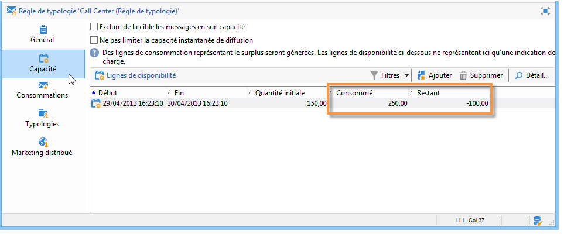

   Voir à ce propos [cette section](#monitoring-consumption).

## Définir la charge maximale {#defining-the-maximum-load}

Pour définir la charge maximale, vous devez définir les lignes de disponibilité. Pour ce faire, deux options sont disponibles : vous pouvez créer manuellement une ou plusieurs lignes de disponibilité (voir [Ajout de lignes de disponibilité une par une](#adding-availability-lines-one-by-one)) ou créer des plages de disponibilité. La fréquence de ces périodes peut être automatisée (voir [Ajouter un ensemble de lignes](#add-a-set-of-availability-lines)de disponibilité).

### Ajouter unitairement les lignes de disponibilité {#adding-availability-lines-one-by-one}

Pour créer une ligne de disponibilité, cliquez sur le **[!UICONTROL Add]** bouton et sélectionnez **[!UICONTROL Add an availability line]**. Entrez la période de disponibilité et la charge disponible.

Vous pouvez ajouter autant de lignes que nécessaires pour correspondre à votre capacité de traitement.

### Ajouter un ensemble de lignes de disponibilité {#add-a-set-of-availability-lines}

Pour définir des périodes de disponibilité pour une période donnée, cliquez sur le **[!UICONTROL Add]** bouton et sélectionnez l’ **[!UICONTROL Add a set of availability lines]** option. Indiquez une durée pour chaque période et le nombre de périodes à créer.

To automate the frequency of page creation, click the **[!UICONTROL Change]** button and define time period scheduling.

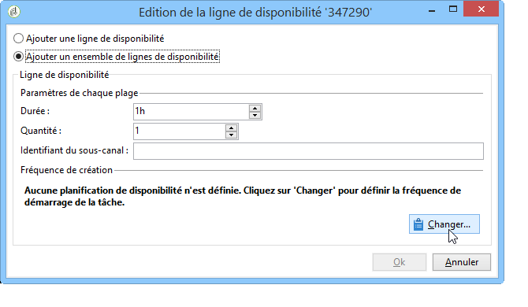

Par exemple, nous allons définir un planning afin de créer les plages de disponibilité pour tous les jours ouvrés, pour 10 appels par heure, entre 9h et 17h. Pour cela, les étapes de configuration sont les suivantes :

1. Sélectionnez le type de périodicité et les jours et heures de validité :

   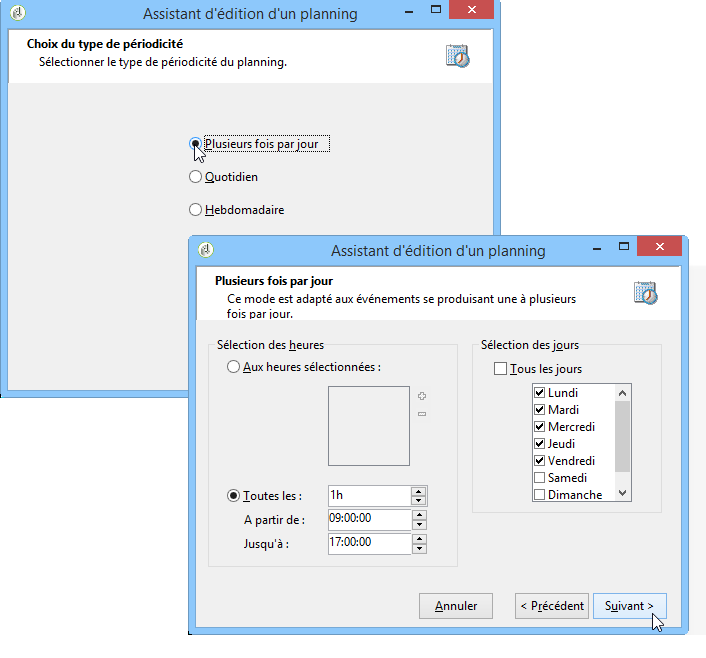

1. Indiquez les dates de validité :

   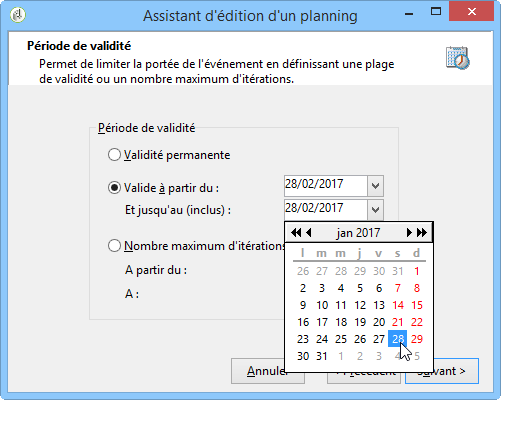

1. Vérifiez ce planning avant de le valider :

   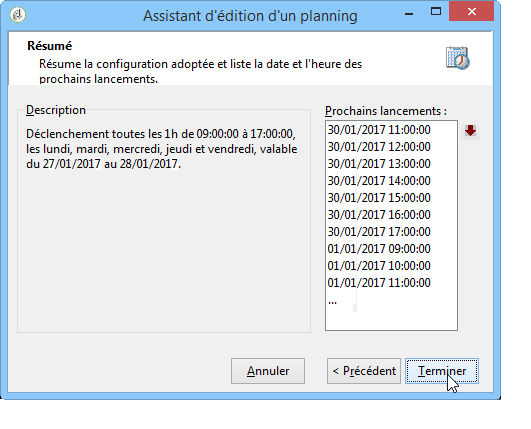

The **[!UICONTROL Forecasting]** workflow automatically creates all matching lines.

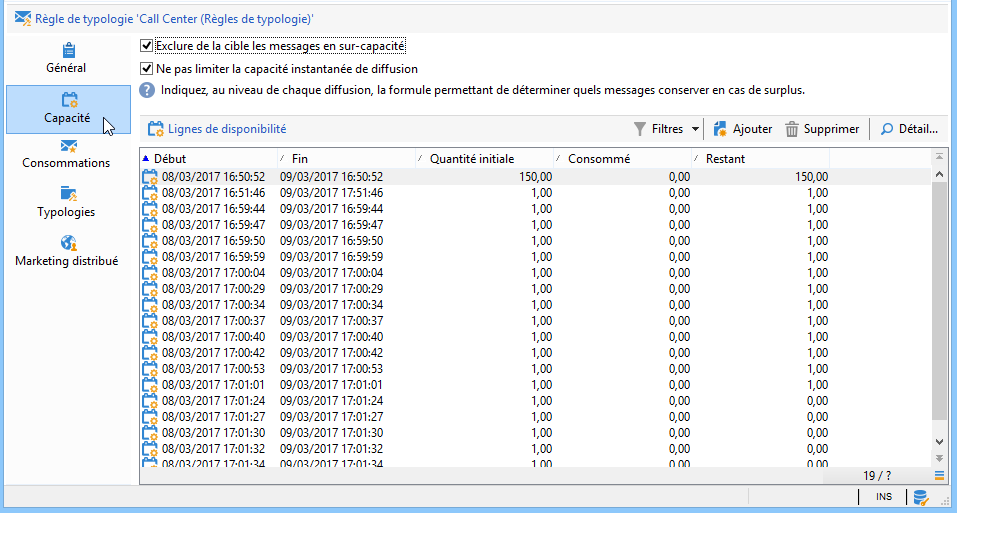

>[!NOTE]
>
>Il est recommandé de créer les lignes de disponibilité à partir d&#39;un import de fichier. Cet onglet permet alors de visualiser et contrôler les lignes de consommation.

## Exclure des messages lorsque la limite de capacité est atteinte {#exclude-messages-when-capacity-limit-reached}

Les lignes de disponibilité ne sont fournies qu&#39;à titre d&#39;information. Pour exclure les messages en trop, cochez l’ **[!UICONTROL Exclude from the target messages in excess of capacity]** option. Cela empêche le dépassement de la capacité. Pour la même population que dans l&#39;exemple précédent, la consommation et la capacité restante ne peuvent pas dépasser la quantité initiale:

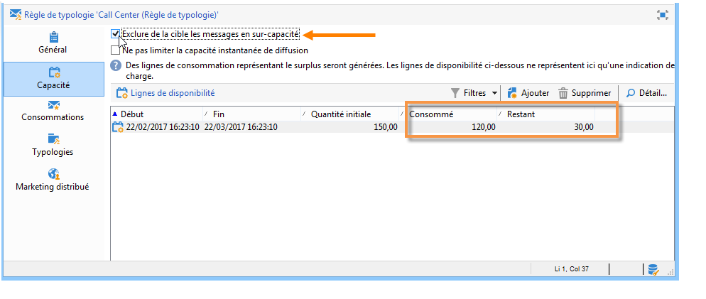

Le nombre de messages à traiter est réparti uniformément sur la plage de disponibilité définie. Ceci est particulièrement pertinent pour les centres d’appels, car leur nombre maximal d’appels par jour est limité. Dans le cas des diffusions par courrier électronique, l’ **[!UICONTROL Do not limit instantaneous delivery capacity]** option vous permet d’ignorer cette plage de disponibilité et d’envoyer vos courriers électroniques en même temps.

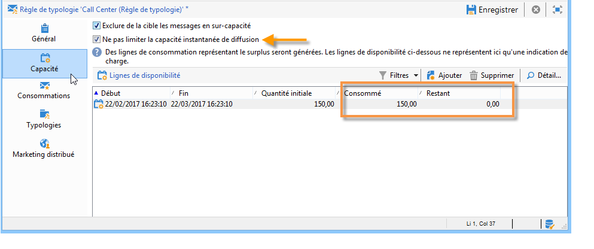

>[!NOTE]
>
>En cas de surcharge, les messages enregistrés sont sélectionnés selon la formule définie dans les propriétés de remise.

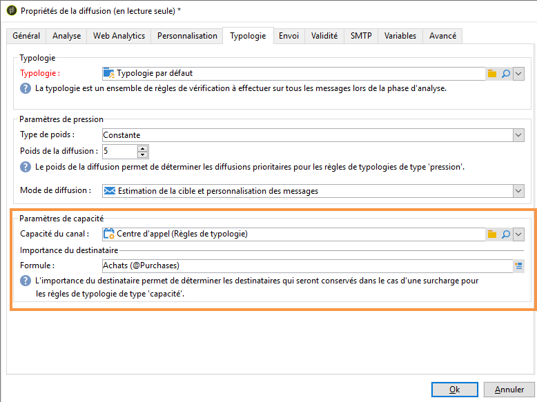

## Suivre les consommations {#monitoring-consumption}

Par défaut, les règles de capacité ne sont utilisées qu’à des fins d’indication. Sélectionnez l’ **[!UICONTROL Exclude messages in excess of capacity from the target]** option pour empêcher le dépassement de la charge définie. Dans ce cas, les messages en excès seront automatiquement exclus des remises à l’aide de cette règle de typologie.

To monitor consumptions, view the values displayed in the **[!UICONTROL Consumed]** column of the **[!UICONTROL Capacity]** tab in the typology rule.

To view consumption lines, click the **[!UICONTROL Consumptions]** tab in the rule.
