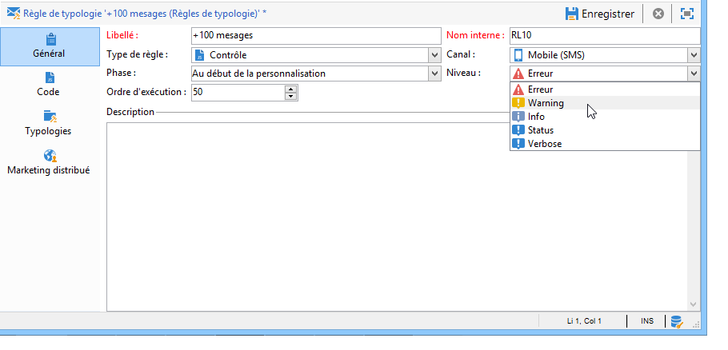
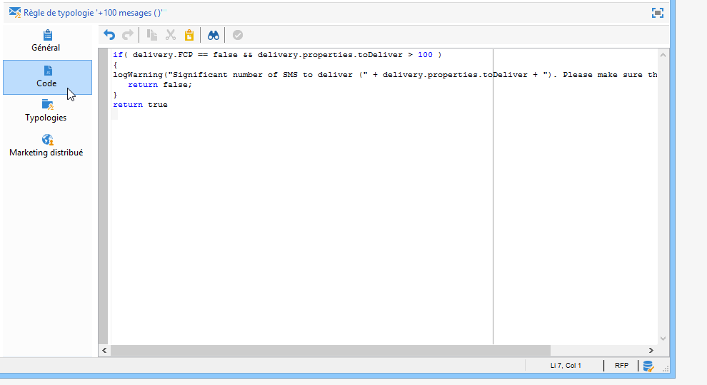
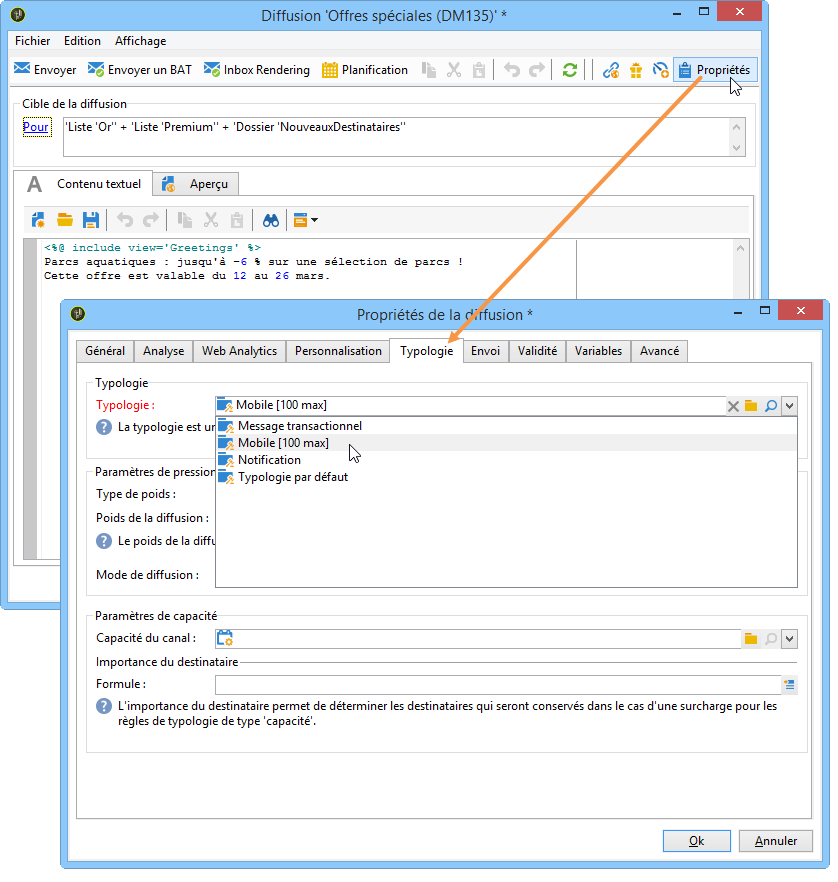
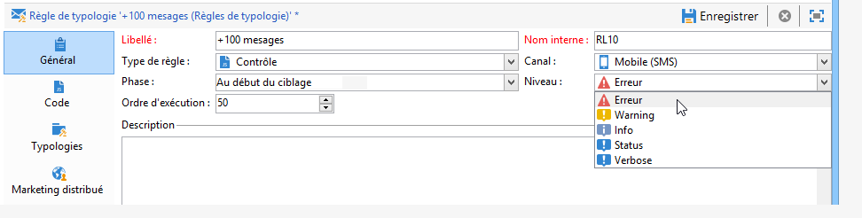
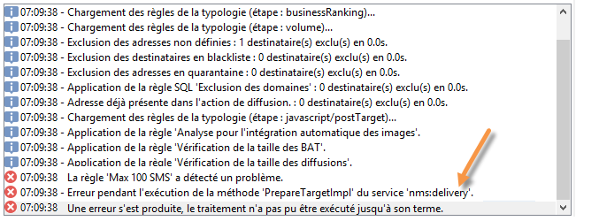

# Cas des règles de contrôle{#control-rules}

## Analyse et règles de contrôle d’arbitrage {#analysis-and-arbitration-control-rules}

Les règles de contrôle permettent de s&#39;assurer de la validité et la qualité des messages avant leur diffusion : bon affichage des caractères, taille des SMS, format des adresses, etc.

Un ensemble de règles livrées d&#39;usine assurent les contrôles usuels. Ces règles, qui apparaissent en gras dans l&#39;interface, sont les suivantes :

* **[!UICONTROL Object approval]** (adresse électronique) : vérifie que l&#39;objet et l&#39;adresse de l&#39;expéditeur ne contiennent pas de caractères spéciaux pouvant entraîner des problèmes pour certains agents de messagerie.
* **[!UICONTROL URL label approval]** (adresse électronique) : vérifie que chaque URL de suivi possède une étiquette.
* **[!UICONTROL URL approval]** (adresse électronique) : vérifie les URL de suivi (présence du caractère &quot;&amp;&quot;).
* **[!UICONTROL Message size approval]** (mobile) : vérifie la taille des messages SMS.
* **[!UICONTROL Validity period check]** (adresse électronique) : vérifie que la période de validité de la remise est suffisamment longue pour envoyer tous les messages.
* **[!UICONTROL Proof size check]** (tous les canaux) : génère un message d’erreur si la population cible de la preuve dépasse 100 destinataires.
* **[!UICONTROL Wave scheduling check]** (adresse électronique) : vérifie que la dernière vague de livraisons doit commencer avant la fin de la période de validité, si la livraison est ventilée en plusieurs vagues.
* **[!UICONTROL Unsubscription link approval]** (adresse électronique) : vérifie la présence d’au moins une URL de désabonnement (exclusion) dans chaque contenu (HTML et texte).

## Créer une règle de contrôle {#creating-a-control-rule}

Il est possible de créer de nouvelles règles de contrôle en fonction de vos besoins. Pour ce faire, créez une règle **[!UICONTROL Control]** de typologie et saisissez la formule de contrôle dans SQL dans l’ **[!UICONTROL Code]** onglet.

**Exemple:**

Dans l&#39;exemple suivant, nous allons créer une règle afin de ne pas diffuser une offre par SMS à plus de 100 destinataires. Cette règle sera référencée dans une typologie de campagne qui sera associée aux diffusions SMS proposant l&#39;offre concernée.

Les étapes sont les suivantes :

1. Create a **[!UICONTROL Control]** typology rule. Sélectionnez un niveau **[!UICONTROL Warning]** d’alerte.

   

1. Dans l&#39;onglet **[!UICONTROL Code]**, saisissez le script permettant d&#39;appliquer la limite souhaitée, comme dans l&#39;exemple suivant :

   

   Ce script permet de générer un avertissement lorsque la cible de la diffusion excède 100 contacts :

   ```
   if( delivery.FCP == false && delivery.properties.toDeliver > 100 ) { logWarning("Significant number of SMS to deliver (" + delivery.properties.toDeliver + "). Please make sure the target is correct.") return false; } return true
   ```

1. Associez cette règle à une typologie de campagne et référencez cette typologie dans la diffusion SMS concernée.

   

1. Lors de la phase d&#39;analyse de la diffusion, la règle est appliquée et un avertissement est généré, s&#39;il y a lieu.

   

   La diffusion est toutefois prête à être envoyée.

   Si vous augmentez le niveau d&#39;alerte, la diffusion ne pourra pas être démarrée.

   

   At the end of the analysis, the **[!UICONTROL Confirm delivery]** button will not be available.

   

