# Maîtriser les coûts{#controlling-costs}

## A propos de la maîtrise des coûts {#about-cost-control}

Adobe Campaign permet de contrôler les coûts marketing planifiés, engagés et facturés, et de les ventiler par catégories à l&#39;aide du module Marketing Resource Management.

Les coûts engagés au niveau des différents traitements d&#39;une opération sont imputés à un budget dont le montant est défini au préalable par la direction marketing. Les montants peuvent être ventilés en plusieurs catégories afin de permettre une meilleure lisibilité des informations et un reporting plus fin des investissements marketing.

La gestion et le tracking des budgets sont centralisés dans un nœud dédié de l&#39;arborescence d&#39;Adobe Campaign. Vous pouvez ainsi suivre, depuis la même vue et pour tous les budgets, les montants alloués, réservés, engagés et dépensés.

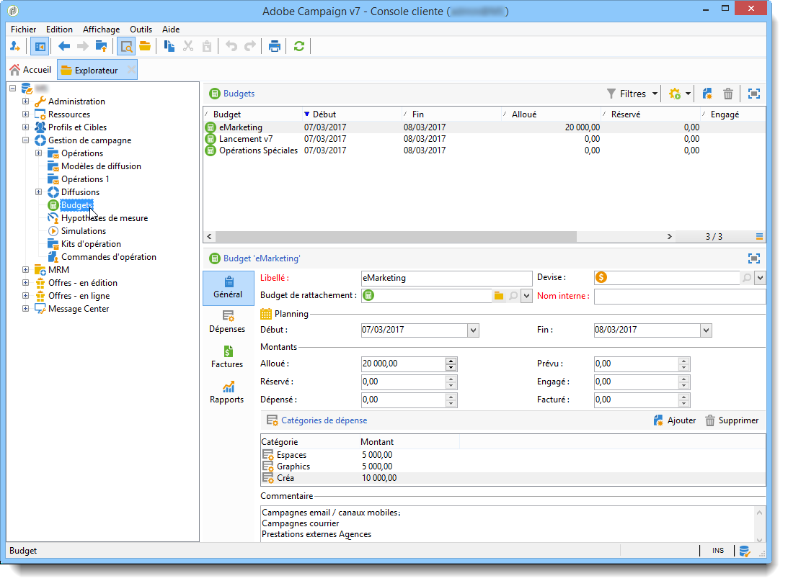

Les étapes de mise en oeuvre de la gestion des budgets avec MRM sont les suivantes :

1. Définition du budget

   For more on this, refer to [Creating a budget](#creating-a-budget).

1. Définition du mode de calcul des coûts

   Les structures de coûts sont définies pour les fournisseurs de services. See [Creating a service provider and its cost categories](../../campaign/using/providers--stocks-and-budgets.md#creating-a-service-provider-and-its-cost-categories).

1. Définition des coûts des opérations (diffusions/tâches)

   Les coûts engagés par les livraisons et les tâches sont entrés individuellement ou globalement pour le modèle de campagne. See [Calculation of costs and stocks](../../campaign/using/marketing-campaign-deliveries.md#calculation-of-costs-and-stocks).

1. Consolidation

   En fonction du statut de réalisation des tâches, diffusions et opérations, les coûts seront calculés et répercutés au niveau du budget correspondant.

   When the creation of the campaign is sufficiently advanced, the progress status of the campaign budget can be changed to **[!UICONTROL Specified]**. The calculated cost of the program is then entered automatically with the costs calculated on the campaign. See [Cost commitment, calculation and charging](#cost-commitment--calculation-and-charging).

## Créer un budget {#creating-a-budget}

Les budgets sont créés dans la carte, via le **[!UICONTROL Campaign management > Budgets]** noeud. Le **[!UICONTROL New]** bouton de la barre d’outils vous permet de créer un budget.

* Ajouter un nouveau budget

   Click the **[!UICONTROL New]** icon, name and save the budget.

* Saisir le montant initial

   Indiquez le montant alloué dans le champ correspondant. Les autres montants sont entrés automatiquement. Voir [Calcul des montants](#calculating-amounts).

* Définir la période de validité

   Indiquez les dates de début et de fin. Ces informations sont indicatives.

* Dépenses

   Créez les catégories de dépenses auxquelles les coûts affectés à ce budget pour les campagnes, les tâches, etc. peuvent être liés. Voir Catégories [de](#expense-categories)dépenses.

   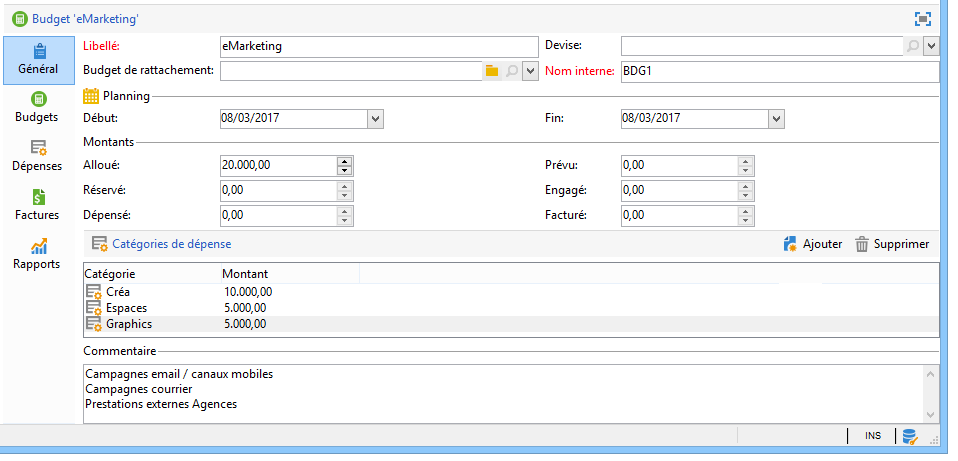

>[!NOTE]
>
>Vous pouvez sélectionner un budget de rattachement.
>
>Pour plus d&#39;informations sur ce sujet, consultez la section [Liaison d&#39;un budget à un autre](#linking-a-budget-to-another).

### Calcul des montants {#calculating-amounts}

Chaque budget est défini par un montant initial qui sera décrémenté des coûts des différentes opérations, diffusions ou tâches qui lui sont rattachées, une fois qu&#39;elles auront été planifiées ou réalisées. Le statut des montants (prévu, réservé, engagé, dépensé, facturé) dépend du type de coût et du niveau d&#39;engagement définis au niveau de l&#39;opération, de la diffusion ou de la tâche.

>[!NOTE]
>
>The amounts entered for the categories must match the budget envelope defined in the **[!UICONTROL Allocated]** field.

Au niveau des opérations, selon le niveau d&#39;engagement, un coût peut être prévu, engagé ou réservé pour une action à venir.

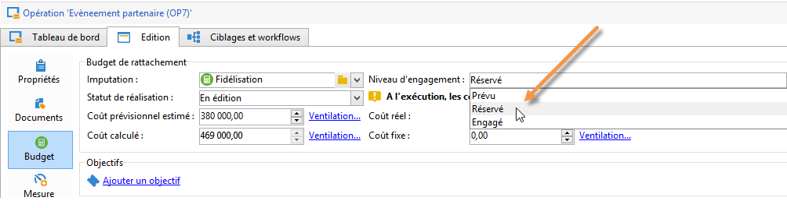

>[!CAUTION]
>
>Lors de la création d’une campagne, l’état de progression dans **[!UICONTROL Budget]** doit être défini sur **[!UICONTROL Defined]** pour que les coûts soient pris en compte lors de l’exécution. Si le statut est **[!UICONTROL Being edited]**, les coûts ne seront pas consolidés.
>   
>L&#39;option **[!UICONTROL Commitment level]** représente une projection des coûts à l&#39;avenir avant qu&#39;ils ne soient imputés au budget. Selon la progression d’une campagne, d’une tâche ou d’une diffusion, vous pouvez décider d’affecter un niveau d’engagement supérieur ou inférieur (1. Prévu, 2. Réservé, 3. Valide) à l’aide de la zone combinée.

Par exemple, une opération est associée au budget Web et a un coût prévisionnel estimé de 45 000 euros.

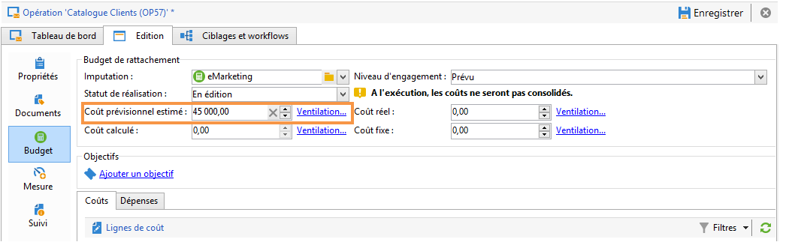

For the campaign, when the budget creation status is set to **[!UICONTROL Defined]**, the real cost of the campaign (or, if none, the computed cost) will be carried over into the budget totals.

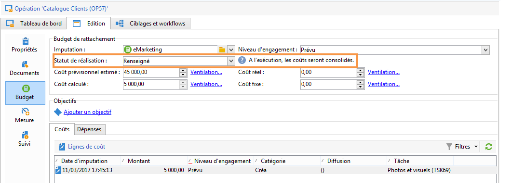

According to the level of commitment of the campaign budget, the amount will be entered in the **[!UICONTROL Planned]**, **[!UICONTROL Reserved]** or **[!UICONTROL Committed]** field.

Le niveau d&#39;engagement peut être modifié:

* au niveau de la **campagne** , dans la **[!UICONTROL Budget]** fenêtre, se trouve dans l’ **[!UICONTROL Edit]** onglet. C&#39;est là que les budgets, les coûts et les dépenses sont configurés.
* au niveau des **tâches** , dans la **[!UICONTROL Expenses and revenues]** fenêtre.

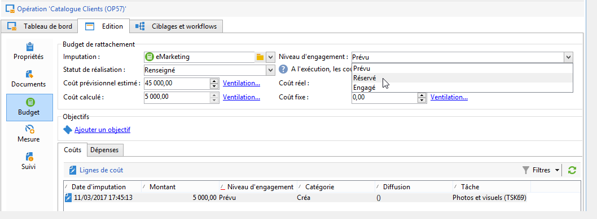

When the budget is **[!UICONTROL Reserved]**, the update is performed automatically for the charged budget.

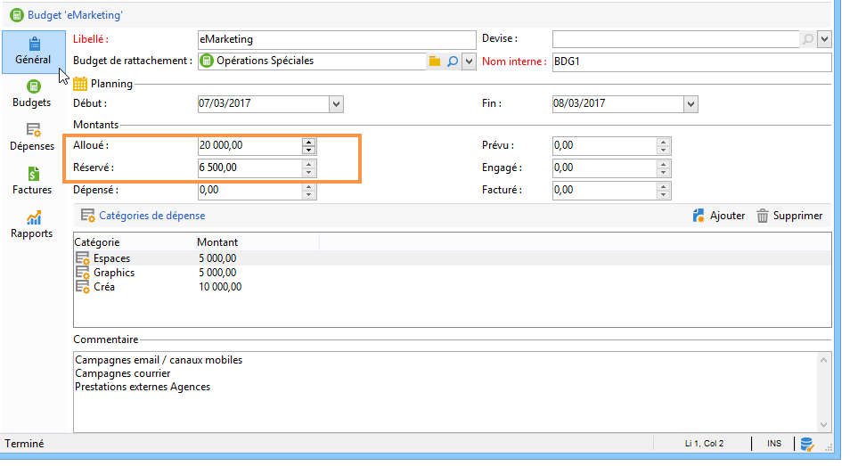

Le fonctionnement est le même au niveau des tâches.

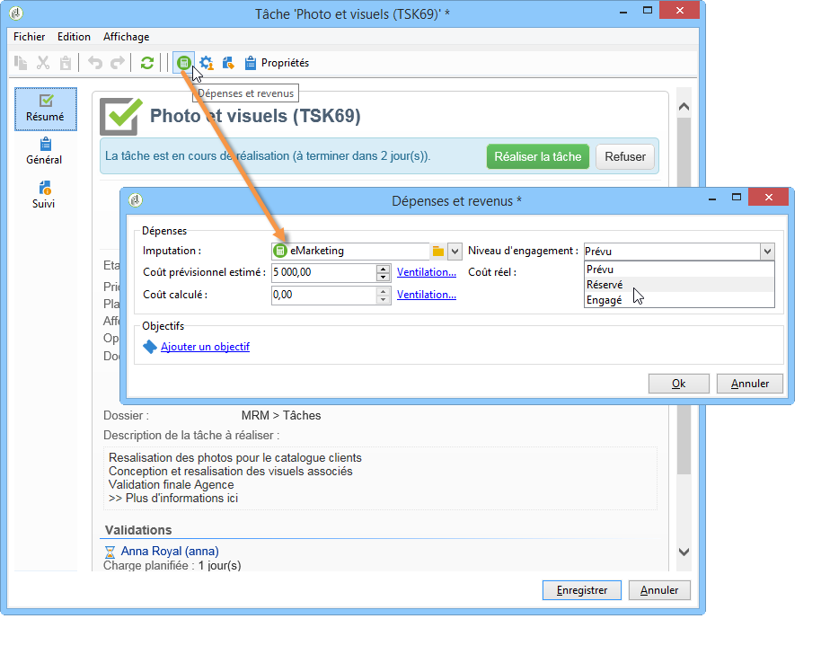

When an expenditure gives rise to an invoice and the invoice is paid, its amount is then entered in the **[!UICONTROL Invoiced]** field.

### Catégories de dépense {#expense-categories}

Les montants peuvent être répartis dans plusieurs catégories de dépenses pour une meilleure lisibilité des données et pour une présentation plus détaillée des investissements marketing. Les catégories de dépenses sont définies lors de la création du budget, via le **[!UICONTROL Budgets]** noeud de l&#39;arborescence.

To add a category, click the **[!UICONTROL Add]** button in the lower section of the window.

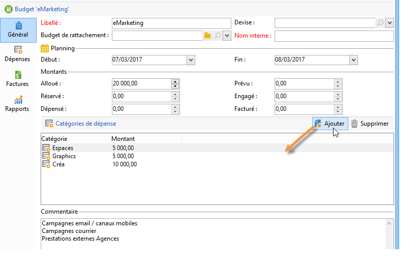

Vous pouvez sélectionner une catégorie parmi celles existantes ou définir une nouvelle catégorie en la saisissant directement dans le champ. Lorsque vous validez votre saisie, un message de confirmation vous permet d&#39;ajouter cette catégorie dans la liste des catégories existantes et éventuellement de l&#39;associer à une Nature. Ces informations seront exploitées dans les rapports sur les budgets.

### Rattacher un budget à un autre {#linking-a-budget-to-another}

Vous pouvez lier un budget à un budget principal. Pour ce faire, sélectionnez le budget principal dans le **[!UICONTROL related budget]** champ des budgets secondaires.

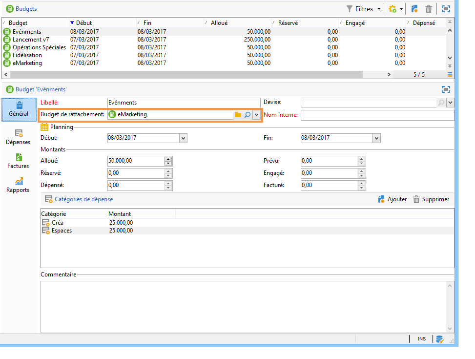

Un onglet supplémentaire sera ajouté au budget principal afin d&#39;afficher la liste des budgets rattachés.

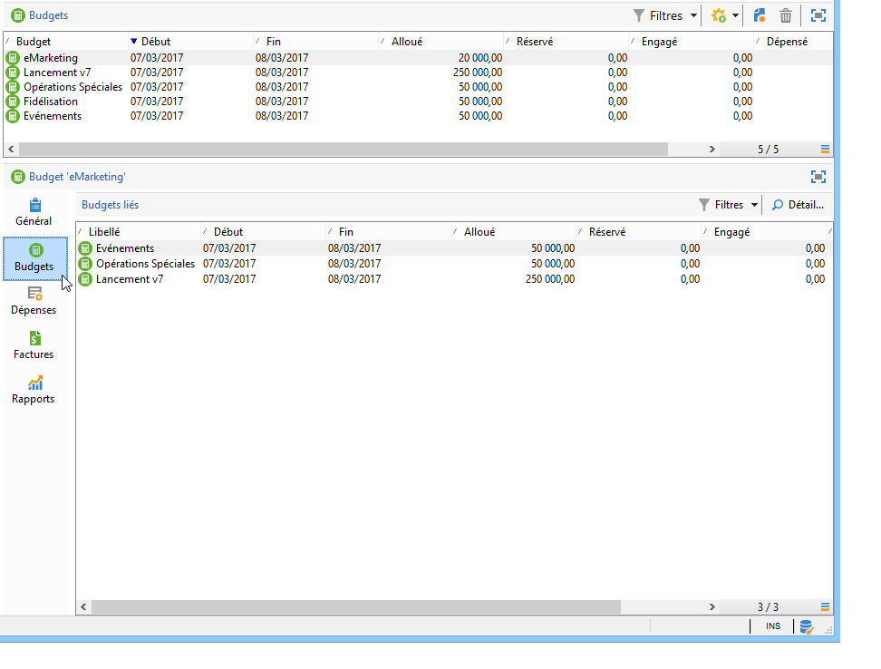

Ces informations sont remontées au niveau des rapports sur les budgets.

## Ajout des lignes de dépenses {#adding-expense-lines}

Les lignes de dépenses sont ajoutées automatiquement au budget. Elles sont créées lors de l&#39;analyse des diffusions et lorsqu&#39;une tâche est terminée.

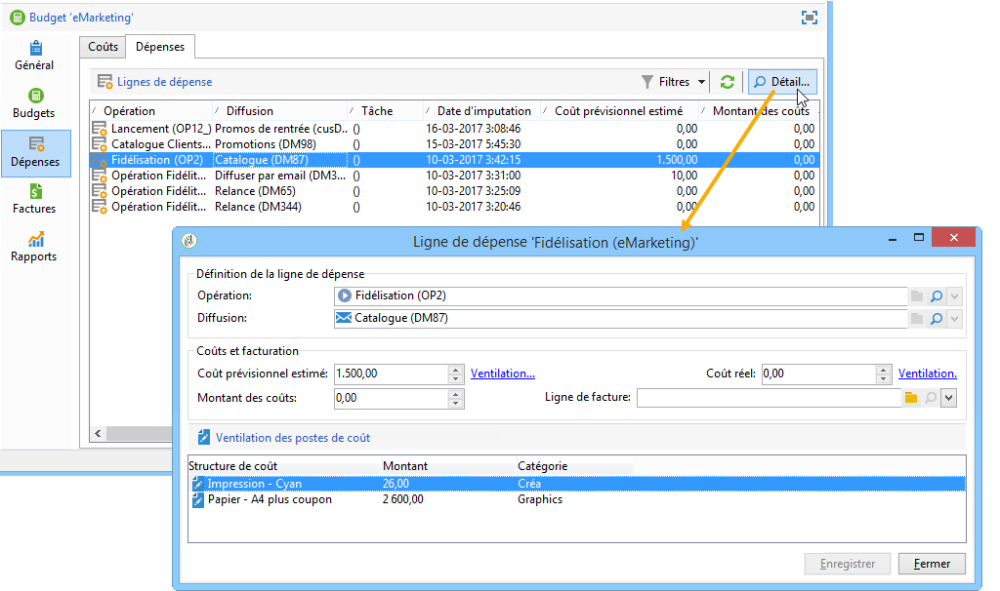

Pour chaque opération, diffusion, ou tâche, les coûts engendrés sont regroupés dans les lignes de dépenses du budget auquel ils sont imputés. Ces lignes de dépenses sont créées en fonction des postes de coûts du prestataire impliqué, et calculées via les structures de coût associées.

Ainsi, chaque ligne de dépense contient les informations suivantes :

* L&#39;opération et la diffusion ou la tâche auxquelles elle est rattachée
* Le montant calculé à partir des structures de coût ou du coût prévisionnel estimé
* Le coût réel de la diffusion ou de la tâche concernée
* La ligne de facture correspondante (MRM seulement)
* La liste des coûts calculés par postes de coûts (si une structure de coûts existe)

Dans l’exemple ci-dessus, la ligne de dépense modifiée contient les coûts calculés pour la remise des **nouvelles cartes** pour la campagne du Pack **Printemps** Fidélité. Lorsque la livraison est modifiée, l&#39; **[!UICONTROL Direct Mail]** onglet vous permet de voir comment la ligne de dépense est calculée.

Le calcul des coûts pour cette diffusion se base sur les postes de coûts sélectionnés pour le prestataire concerné :

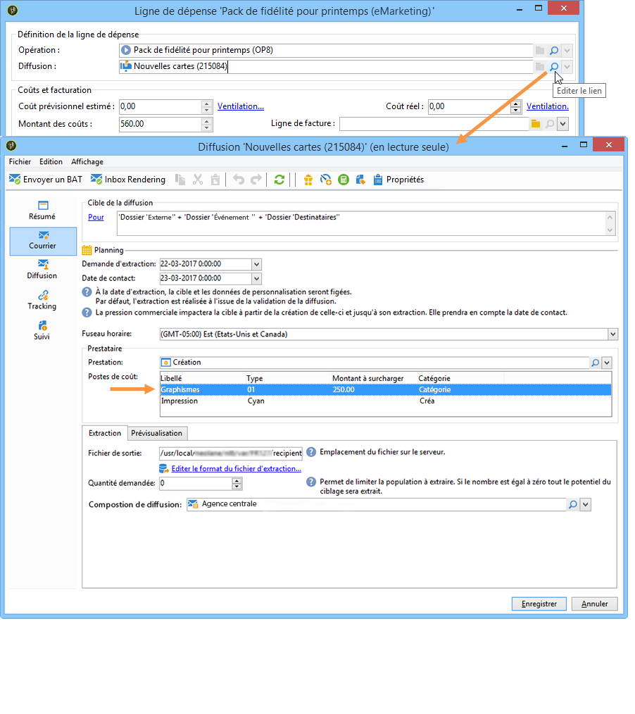

En fonction des postes de coûts sélectionnés, les structures de coûts correspondantes sont appliquées afin de calculer les lignes de coûts. Dans cet exemple, pour le prestataire concerné, les structures de coûts sont les suivantes :

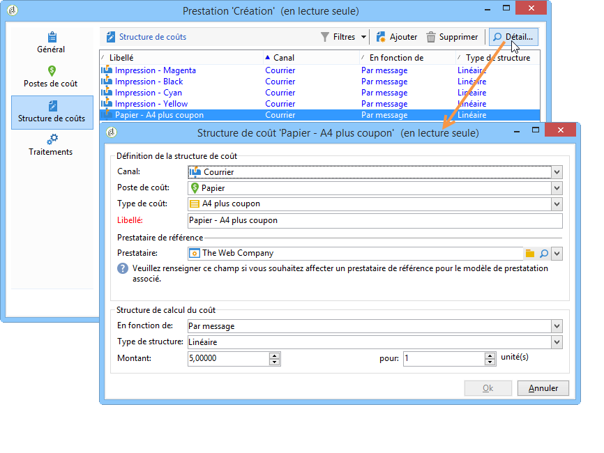

>[!NOTE]
>
>Les catégories et structures de coûts sont présentées dans [Création d&#39;un fournisseur de services et dans ses catégories](../../campaign/using/providers--stocks-and-budgets.md#creating-a-service-provider-and-its-cost-categories)de coûts.

## Engagement, calcul et imputation des coûts {#cost-commitment--calculation-and-charging}

Les coûts peuvent être engagés au niveau des diffusions et des tâches. En fonction de l&#39;avancement du traitement auquel il est attaché, le statut d&#39;un coût est mis à jour.

### Processus de calcul des coûts {#cost-calculation-process}

Les coûts sont répartis en 3 catégories :

1. Coût prévisionnel estimé

   Le coût provisoire estimé est une estimation des coûts des processus de la campagne. Tant qu&#39;il est modifié, les montants saisis ne sont pas consolidés. Il doit avoir **[!UICONTROL Specified]** le statut pour que les montants saisis soient pris en compte dans les calculs.

   Ce montant est saisi manuellement et peut être ventilé en plusieurs catégories de dépenses. Pour réduire un coût, cliquez sur le **[!UICONTROL Breakdown...]** lien, puis sur le **[!UICONTROL Add]** bouton pour définir un nouveau montant.

   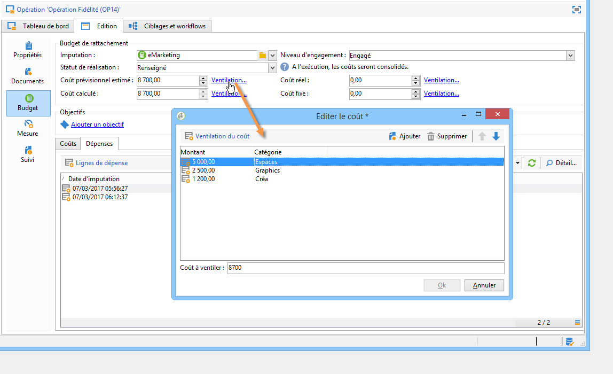

   Vous pouvez associer chaque coût à une catégorie, afin de visualiser par la suite la répartition des coûts par catégories de dépenses dans le budget de rattachement et dans les rapports sur les budgets.

1. Coût calculé

   Le coût calculé dépend de l&#39;élément concerné (opération, diffusion, tâche, etc.) et de son état (en édition, en cours, terminé). Dans tous les cas, si le coût réel est renseigné, le coût calculé reprendra ce montant.

   Si le coût réel n&#39;est pas renseigné, les règles sont les suivantes :

   * Pour une opération en édition, le coût calculé reprend le coût prévisionnel estimé de l&#39;opération ou, si ce coût n&#39;est pas renseigné, le coût calculé sera la somme de tous les coûts prévisionnels des diffusions et tâches de l&#39;opération. Si l&#39;opération est terminée, le coût calculé de l&#39;opération sera la somme de tous les coûts calculés.
   * Pour une diffusion qui n&#39;a pas encore été analysée, le coût calculé reprend le coût prévisionnel estimé. Si l&#39;analyse a déjà eu lieu, le coût calculé sera la somme de tous les coûts calculés à partir des structures de coût du prestataire et du nombre de destinataires ciblés.
   * Pour une tâche en cours, le coût calculé reprend le coût prévisionnel estimé. Si la tâche est terminée, le coût calculé sera la somme de tous les coûts calculés à partir des structures de coût du prestataire et du nombre de jours réalisés.
   * Pour le plan marketing, comme pour le programme, le coût calculé est la somme des coûts calculés sur les opérations. Si ces coûts ne sont pas renseignés, le coût calculé reprendra les coûts prévisionnels estimés.
   >[!NOTE]
   >
   >The **[!UICONTROL Breakdown]** link lets you view the details of the calculation and the last cost calculation date.

1. Coût réel

   Le coût réel est saisi manuellement, et éventuellement ventilé entre différentes catégories de dépenses.

### Calcul et imputation {#calculation-and-charging}

Les coûts sont calculés via les structures de coûts et imputés aux budgets sélectionnés au niveau des opérations, des diffusions ou des tâches concernées.

Une vérification peut être effectuée sur les montants engagés dans les campagnes via l&#39;approbation du budget. D’autres tâches de type point de contrôle peuvent être créées dans une campagne afin de configurer d’autres approbations. Voir [Types de tâche](../../campaign/using/creating-and-managing-tasks.md#types-of-task).

### Exemple {#example}

Nous allons créer une opération avec :

* Une diffusion courrier utilisant les structures de coûts d&#39;un prestataire
* Une tâche avec un coût fixe
* Une tâche avec un coût journalier

#### Etape 1 - Créer le budget {#step-1---creating-the-budget}

Créez un nouveau budget via le **[!UICONTROL Campaign management > Budgets]** noeud.

Définissez un budget de 10 000 euros dans le **[!UICONTROL Allocated]** champ de la **[!UICONTROL Amounts]** section. Ajoutez deux catégories de dépenses dans la section inférieure de la fenêtre :

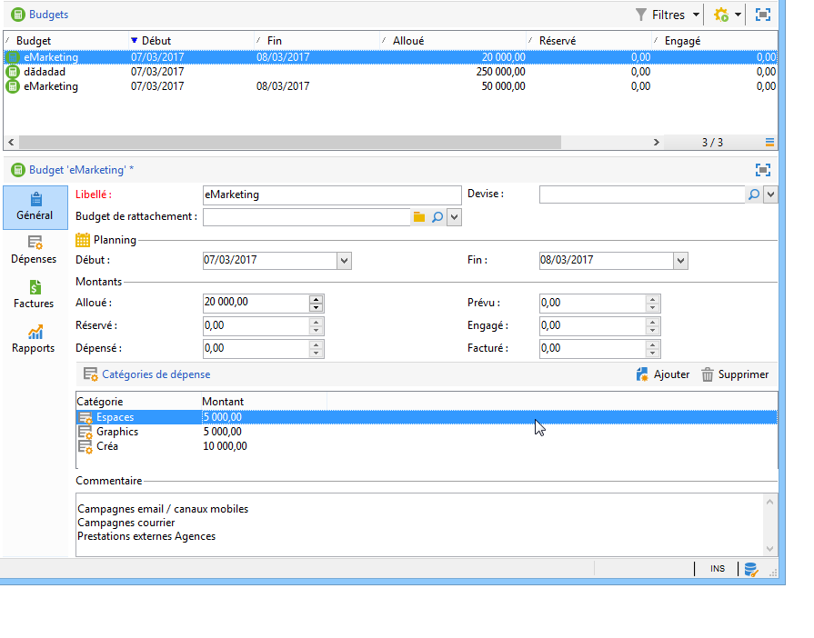

#### Etape 2 - Configurer le prestataire et définir les structures de coûts {#step-2---configuring-the-service-provider-and-defining-the-cost-structures}

Create a service provider and a service template with its cost structure from the **[!UICONTROL Administration > Campaigns]** node.

Pour plus d’informations, reportez-vous à la section [Création d’un fournisseur de services et de ses catégories](../../campaign/using/providers--stocks-and-budgets.md#creating-a-service-provider-and-its-cost-categories)de coûts.

* Pour les livraisons par courrier direct, créez des catégories de coûts **[!UICONTROL Envelopes]** (types 114x229 et 162x229) **[!UICONTROL Postage]** et **[!UICONTROL Print]** (types A3 et A4). Créez ensuite les structures de coûts suivantes :

   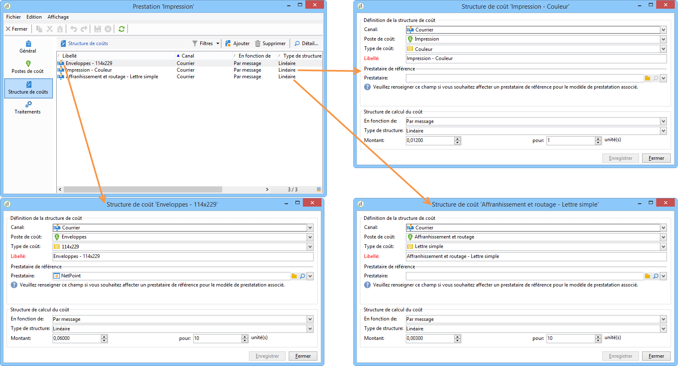

   Ajoutez un coût fixe (dans les postes de coûts), dont le calcul est fixe et le montant est vide (dans la structure de coût correspondante), et qui sera renseigné unitairement pour chaque diffusion.

   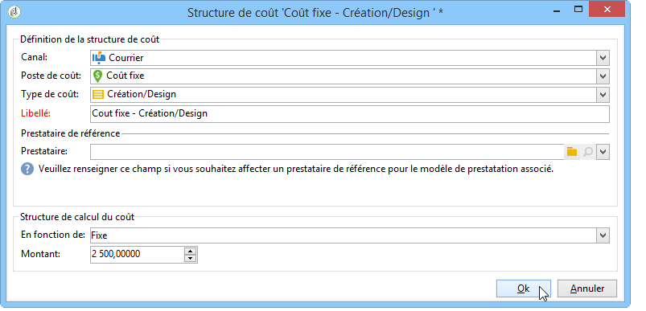

* Pour les tâches, créez les deux postes de coût suivants :

   1. **[!UICONTROL Room reservation]** (Petite chambre et Grande chambre), avec une structure de coût **fixe** de 300 et 500 euros :

      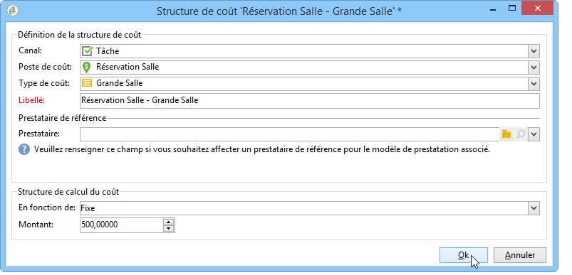

   1. **[!UICONTROL Creation]** (Type de modèle **de** contenu), avec une structure de coûts **quotidiens** de 300 euros :

      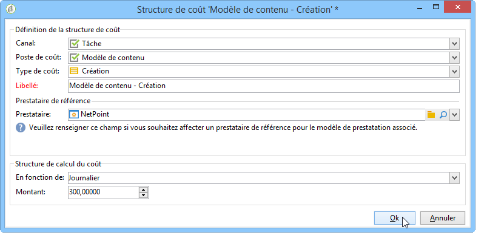

#### Etape 3 - Imputer le budget dans l&#39;opération {#step-3---charging-the-budget-in-the-campaign}

Créez une opération et sélectionnez le budget créé lors de l&#39;étape 1.

>[!NOTE]
>
>Par défaut, le budget qui a été sélectionné au niveau du programme est appliqué à toutes les opérations du programme.

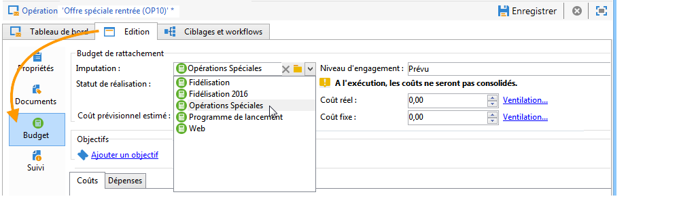

Indiquez le coût prévisionnel estimé, avec ventilation :

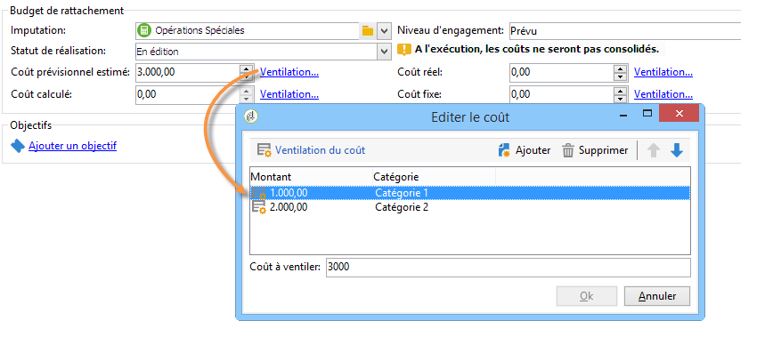

Cliquez sur **[!UICONTROL Ok]** puis **[!UICONTROL Save]** pour confirmer ces informations. Le coût calculé de la campagne est alors mis à jour avec le coût provisoire estimé.

#### Etape 4 - Créer la diffusion courrier {#step-4---creating-the-direct-mail-delivery}

Créez un workflow au niveau de l&#39;opération et positionnez les activités de requête afin de sélectionner la cible (attention, l&#39;adresse postale des destinataires doit être renseignée).

Créez une diffusion Courrier et sélectionnez le prestataire créé à l&#39;étape 2 : les postes de coûts s&#39;affichent automatiquement.

Surchargez le coût des enveloppes et ajoutez un coût fixe. Sélectionnez également les catégories concernées par ces coûts.

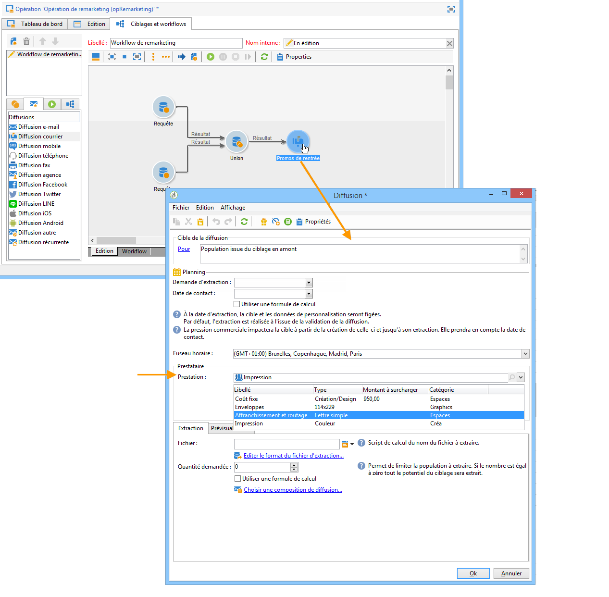

>[!NOTE]
>
>Si l&#39;un des postes de coûts n&#39;est pas utilisé, il n&#39;engendrera aucune dépense.

Démarrez le workflow que vous venez de créer pour lancer l&#39;analyse et calculer les coûts.

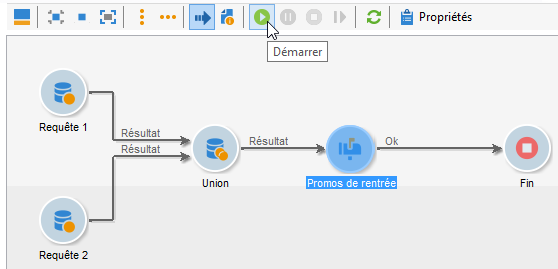

Si la validation du budget est activée pour cette opération, validez le budget depuis le tableau de bord. Vous pouvez vérifier la validation des postes de coût.

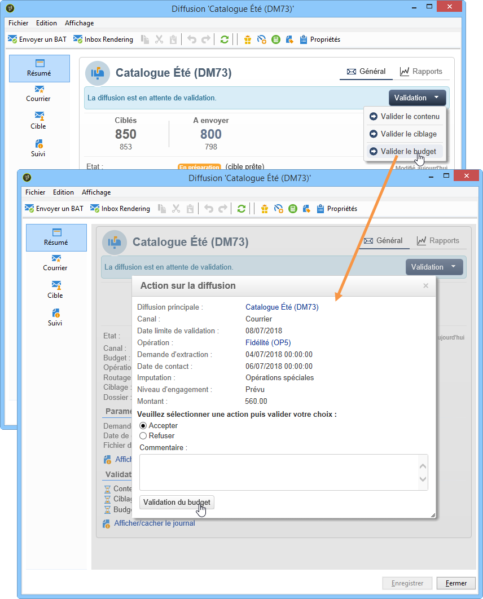

La ligne de dépense concernant la remise est ajoutée dans l’ **[!UICONTROL Edit > Budget]** onglet de la campagne. Modifiez-la pour afficher les détails du calcul.

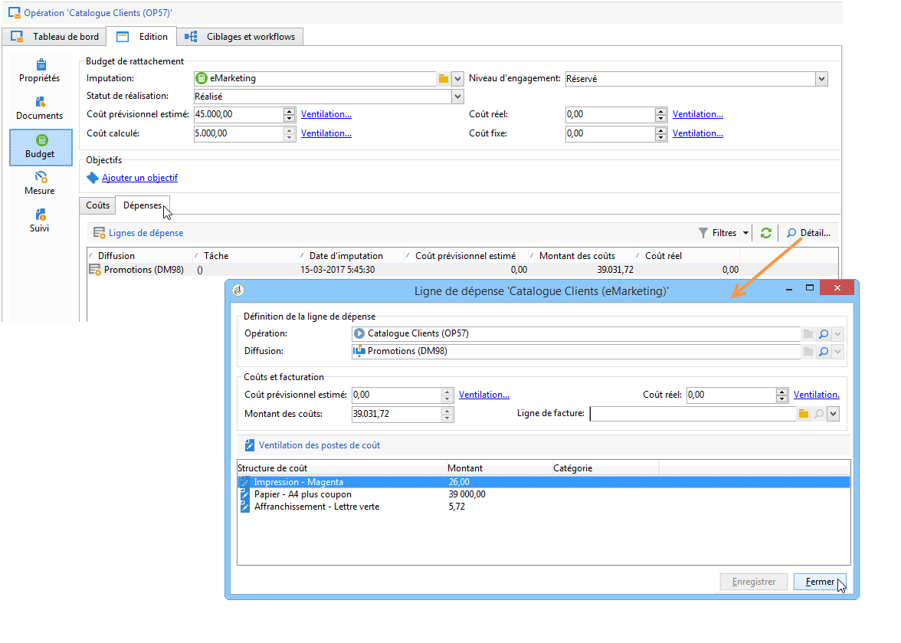

Au niveau de la diffusion, le coût calculé est mis à jour avec ces informations :

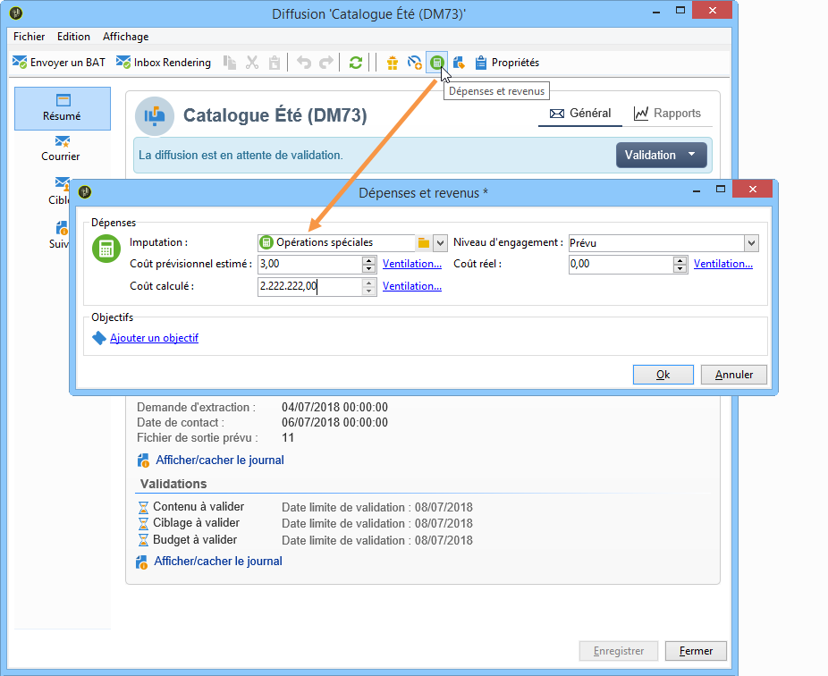

Lorsque vous éditez le coût calculé, vous pouvez vérifier la ventilation des coûts ainsi que l&#39;état et la date du calcul des coûts.

#### Etape 5 - Créer les tâches {#step-5---creating-tasks}

Dans cette campagne, nous allons ajouter les deux tâches pour lesquelles les structures de coûts ont été créées précédemment (voir [Étape 2 - Configuration du fournisseur de services et définition des structures](#step-2---configuring-the-service-provider-and-defining-the-cost-structures)de coûts). Pour ce faire, dans le tableau de bord de la campagne, cliquez sur le **[!UICONTROL Add a task]** bouton. Nommez la tâche et cliquez sur **[!UICONTROL Save]**.

La tâche est alors ajoutée dans la liste des tâches. Vous devez l&#39;éditer pour la configurer.

In the **[!UICONTROL Properties]** tab, select the service and the corresponding cost category:

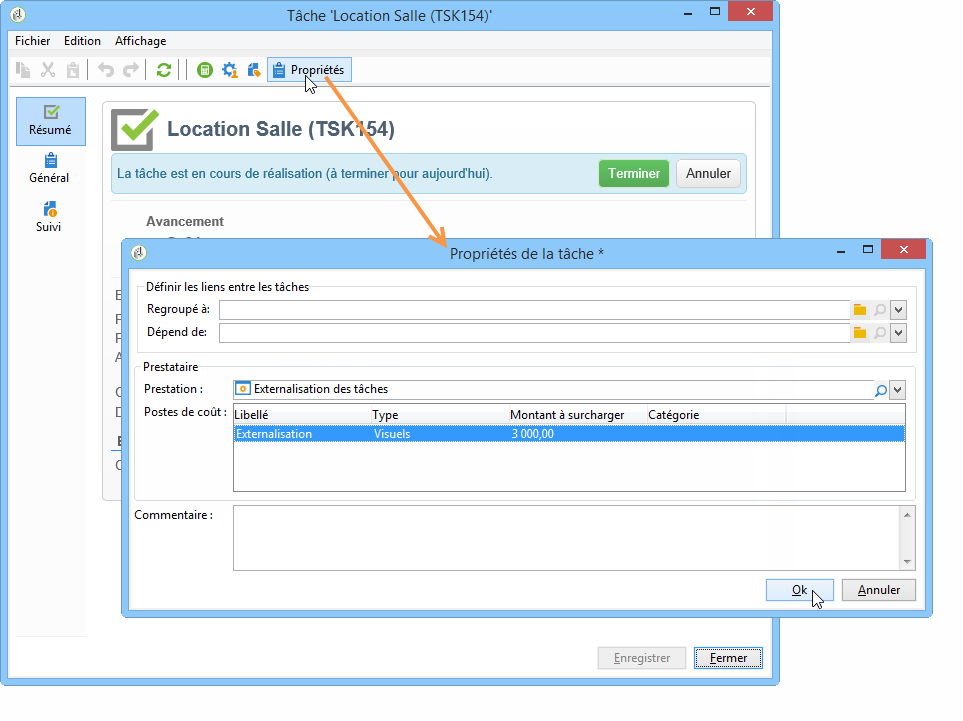

Next, click the **[!UICONTROL Expenses and revenue]** icon of the task and specify the estimated provisional cost.

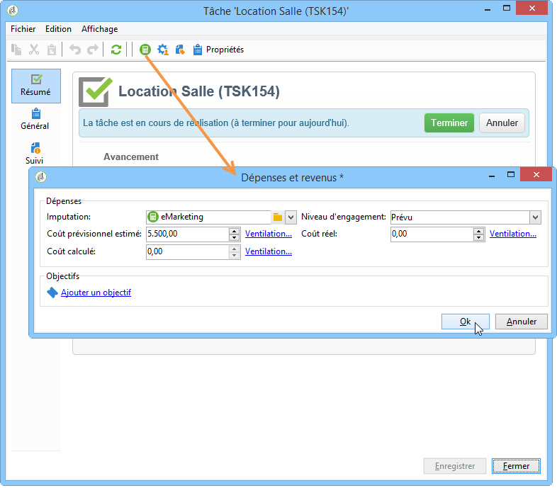

Une fois la tâche enregistrée, le coût calculé est renseigné avec la valeur saisie pour le coût prévisionnel estimé.

Une fois la tâche terminée (état **[!UICONTROL Finished]** ), le coût calculé est automatiquement mis à jour avec le coût de la grande salle tel qu&#39;il est entré dans sa structure de coûts. Ce coût apparaît également dans cette catégorie dans la ventilation.

Selon le même mode opératoire, créez ensuite une seconde tâche, planifiée sur 5 jours et associée à la structure de coûts créée précédemment.

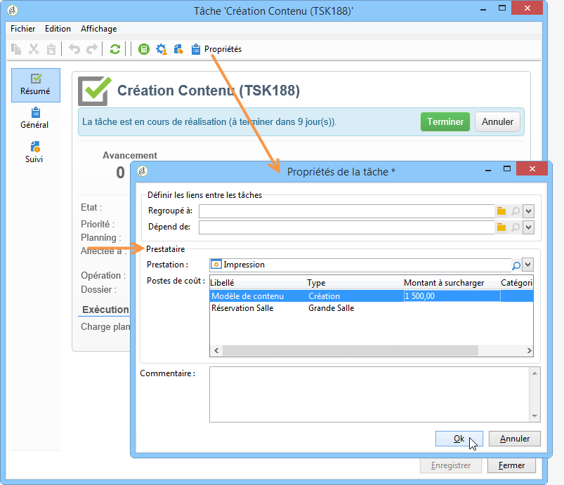

Une fois la tâche terminée, le coût calculé est renseigné avec la valeur issue de la structure de coût associée, soit 1500 euros dans notre exemple (5 jours x 300 euros) :

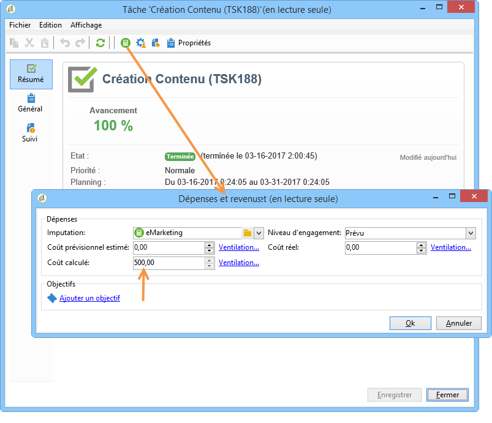

#### Etape 6 - Mettre à jour le statut du budget de l&#39;opération {#step-6---update-the-campaign-budget-status}

When the campaign is configured, its status can be updated by setting it to **[!UICONTROL Specified]**. The calculated cost of the campaign will then indicate the sum of the calculated costs of the delivery and the tasks of the campaign:

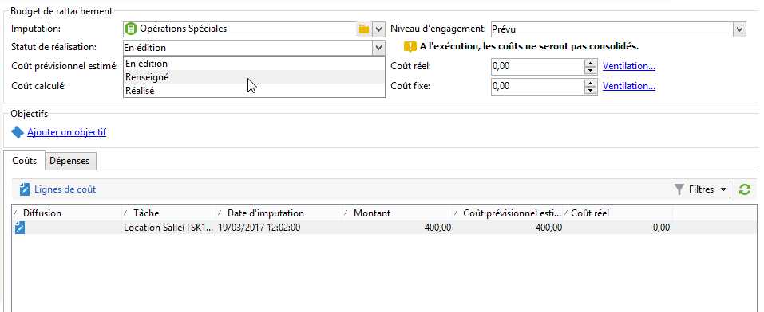

#### Validation du budget {#budget-approval}

Lorsque la validation est activée, un lien spécifique permet de valider le budget à partir du tableau de bord de l&#39;opération. Ce lien est affiché une fois le workflow de ciblage lancé et lorsqu&#39;une diffusion courrier est à valider.

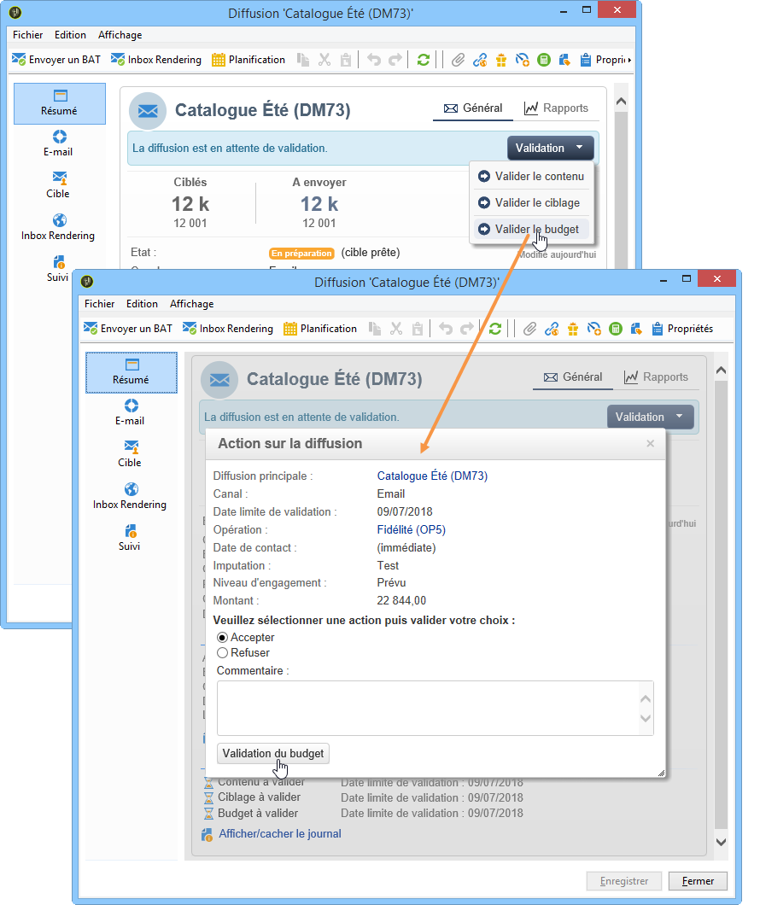

Vous pouvez alors cliquer sur le lien pour valider ou refuser la validation, ou utiliser le lien contenu dans le mail de notification, si la notification a été activée pour cette opération.

Une fois le budget validé, et la diffusion terminée, les coûts sont remontés automatiquement via un workflow technique spécifique.

## Commandes et factures {#orders-and-invoices}

Dans un contexte MRM, vous pouvez enregistrer des commandes auprès d&#39;un prestataire et émettre des factures. L&#39;ensemble du cycle de vie de ces commandes et factures peut être géré au travers de l&#39;interface d&#39;Adobe Campaign.

### Création de commande {#order-creation}

To save a new order with a service provider, click the **[!UICONTROL MRM > Orders]** node of the tree, and then click the **[!UICONTROL New]** button.

Indiquez le numéro de la commande, le prestataire concerné et le montant total de la commande.

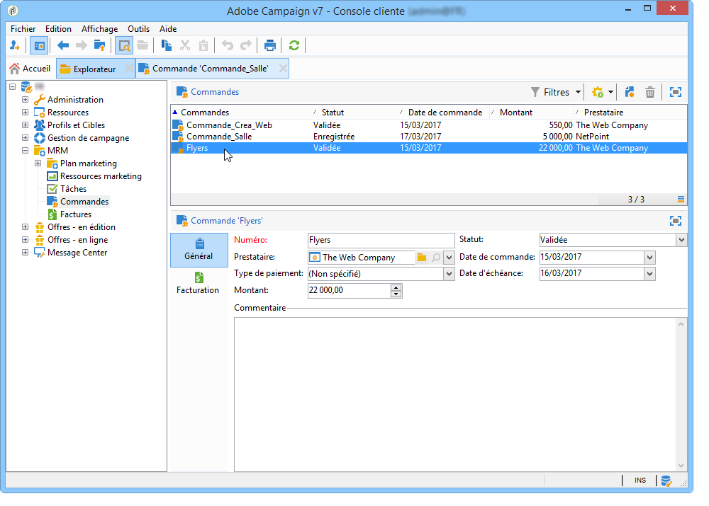

### Emission et tracking de facture {#issuing-and-tracking-invoices}

Pour chaque prestataire, vous pouvez enregistrer des factures et définir leur statut et le budget imputé.

Invoices are created and stored in the **[!UICONTROL MRM > Invoices]** node of the Adobe Campaign tree.

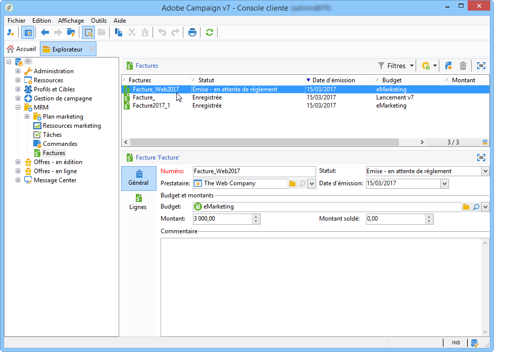

Une facture se compose de lignes de facture dont le total permet le calcul automatique du montant. Ces lignes sont créées manuellement à partir de l’ **[!UICONTROL Invoice lines]** onglet. Ils peuvent être associés à une commande pour transférer les informations vers les commandes.

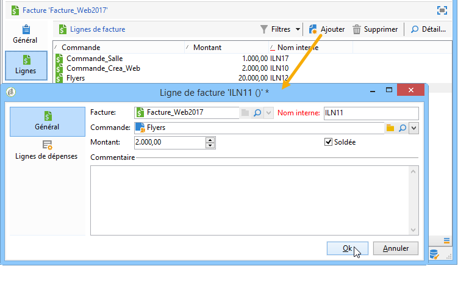

The invoices of each service provider are displayed in the **[!UICONTROL Invoices]** tab of the profile:

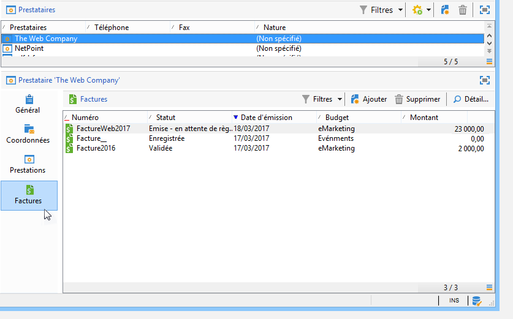

The **[!UICONTROL Details]** tab lets you display the content of the invoice.

Click **[!UICONTROL Add]** to create a new invoice.
