# Créer une opération collaborative{#creating-a-collaborative-campaign-intro}

L&#39;entité centrale crée les opérations collaboratives à partir des modèles d&#39;opération du **Marketing Distribué**. Voir [cette page](../../campaign/using/about-distributed-marketing.md#collaborative-campaign).

## Créer une opération collaborative {#creating-a-collaborative-campaign}

Pour configurer une campagne collaborative, cliquez sur le **[!UICONTROL Campaign management > Campaigns]** noeud, puis sur l’ **[!UICONTROL New]** icône .

>[!NOTE]
>
>Apart from **[!UICONTROL collaborative campaigns (by campaign)]**, these campaigns can be configured and executed via a web interface.

Le paramétrage de base d&#39;une opération collaborative est similaire à celui d&#39;un modèle d&#39;opération locale. Les spécificités des différents types d&#39;opération collaborative sont présentées ci-dessous.

### Par formulaire {#by-form}

Pour créer une campagne collaborative (par formulaire), le **[!UICONTROL Collaborative campaign (by form)]** modèle doit être sélectionné.

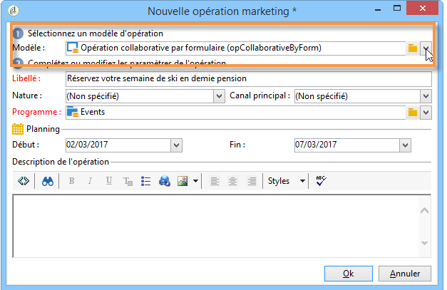

In the **[!UICONTROL Edit]** tab, click the **[!UICONTROL Advanced campaign settings...]** link to access the **Distributed Marketing** tab.

Select the **By form** Web interface. This type of interface lets you create personalization fields that will be used by local entities when ordering a campaign. Reportez-vous à [Création d’une campagne locale (par formulaire)](../../campaign/using/examples.md#creating-a-local-campaign--by-form-).

Enregistrez votre campagne. You can now use it from the **Campaign packages** view in the **Campaign** universe, by clicking the **[!UICONTROL Create]** button.

The **[!UICONTROL Campaign Package]** view allows you to use local campaign templates (out-of-the-box or duplicated), as well as reference campaigns for collaborative campaigns, with the aim of creating campaigns for your different organizational entities.

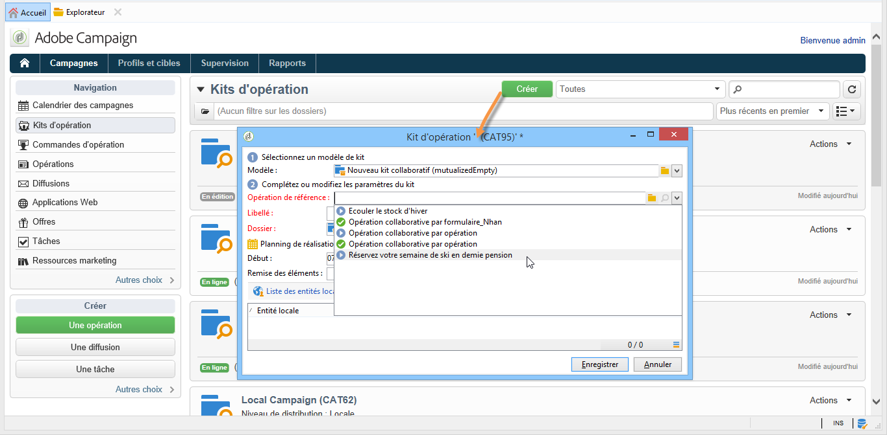

### Par opération {#by-campaign}

Pour créer une campagne collaborative (par campagne), le **[!UICONTROL Collaborative campaign (by campaign) (opCollaborativeByCampaign)]** modèle doit être sélectionné.

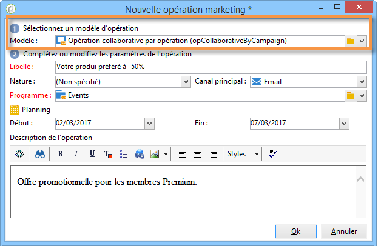

Lors de la commande de l&#39;opération, l&#39;entité locale peut remplir des critères prédéfinis par l&#39;entité centrale, et évaluer l&#39;opération avant de la commander.

Lorsque la commande d&#39;une **Opération collaborative par opération** est validée par l&#39;entité centrale, une opération fille est créée pour l&#39;entité locale. La mise à disposition de l&#39;opération permet à l&#39;entité locale de modifier :

* le workflow de l&#39;opération,
* les règles de typologie,
* et les champs de personnalisation.

L&#39;exécution de l&#39;opération fille est faite par l&#39;entité locale. L&#39;entité centrale exécute l&#39;opération mère.

The central entity can view all child campaigns linked with a **Collaborative campaign (by campaign)** from this dashboard (via the **[!UICONTROL List of associated campaigns]** link).

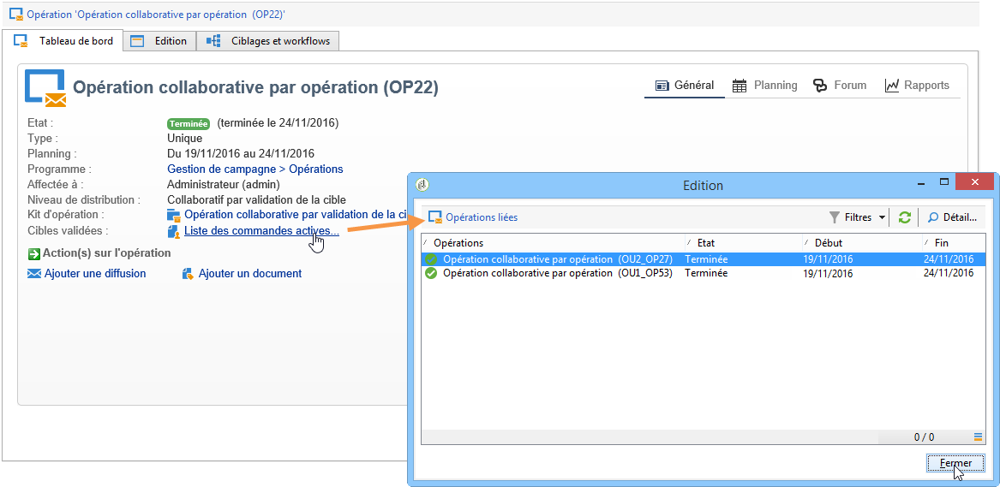

### Par validation de la cible {#by-target-approval}

Pour créer une campagne collaborative (par approbation de la cible), le **[!UICONTROL Collaborative campaign (by target approval)]** modèle doit être sélectionné.

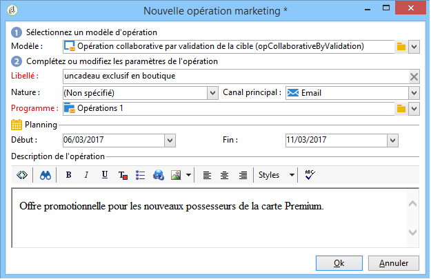

>[!NOTE]
>
>Dans ce mode, l&#39;entité centrale n&#39;a pas à spécifier les entités locales.

Le workflow de l&#39;opération doit intégrer l&#39;activité de type **Validation en local**. Les paramètres de l&#39;activité sont les suivants :

* **[!UICONTROL Action to perform]** : Notification pour la validation de la cible.
* **[!UICONTROL Distribution context]** : Explicite.
* **[!UICONTROL Data distribution]** : Distribution d&#39;entités locales.

**La distribution** locale des données de type de distribution d&#39;entité doit être créée. Le modèle de distribution de données vous permet de limiter le nombre d’enregistrements d’une liste de valeurs de regroupement. Dans **[!UICONTROL Resources > Campaign management > Data distribution]**, cliquez sur l’ **[!UICONTROL New]** icône pour créer une nouvelle **[!UICONTROL Data distribution]**. For more information on data distribution, refer to the [Workflows](../../workflow/using/using-the-local-approval-activity.md#step-1--creating-the-data-distribution-template-) guide.

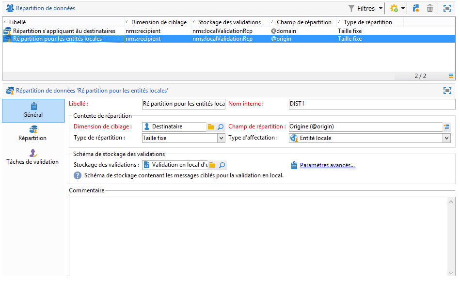

Sélectionnez la dimension **** Ciblage et le **[!UICONTROL Distribution field]**. Pour le **[!UICONTROL Assignment type]**, sélectionnez Entité **** locale.

In the **[!UICONTROL Distribution]** tab, add a field for each local entity and specify the value.

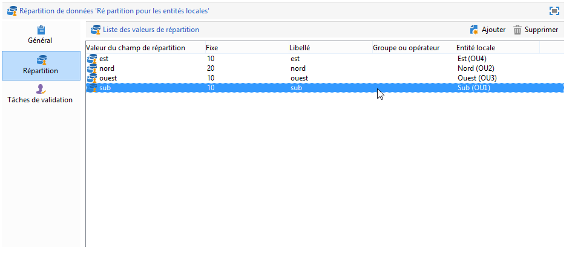

Il est possible de rajouter une deuxième activité de type **Validation de la cible** après l&#39;activité de type **Diffusion** pour paramétrer un rapport sur celle-ci.

Dans le mail de notification de création de l&#39;opération, l&#39;entité locale reçoit une liste de contact prédéfinie par les paramétrages de l&#39;entité centrale.

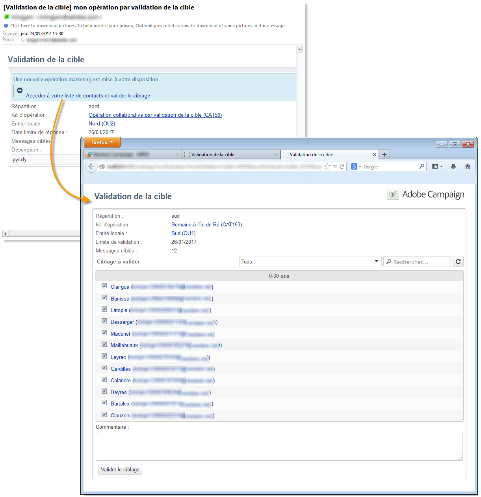

L&#39;entité locale peut supprimer certains contacts en fonction du contenu de l&#39;opération.

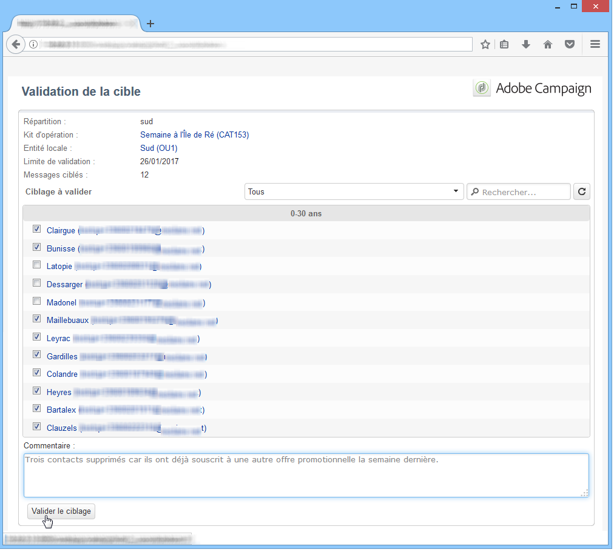

### Simple {#simple}

To create a simple collaborative campaign, the **[!UICONTROL Collaborative campaign (simple)]** template must be selected.

## Créer un kit d&#39;opération collaborative {#creating-a-collaborative-campaign-package}

Pour mettre à disposition l&#39;opération auprès des entités locales, l&#39;entité centrale doit créer un kit d&#39;opération.

Les étapes sont les suivantes :

1. In the **[!UICONTROL Navigation]** section on the **Campaigns** page, click the **[!UICONTROL Campaign packages]** link.
1. Cliquez sur le **[!UICONTROL Create]** bouton.
1. The section at the top of the window lets you select the **[!UICONTROL New collaborative package (mutualizedEmpty)]** template.
1. Sélectionnez l&#39;opération de référence.
1. Définissez le libellé du kit d&#39;opération, son dossier d&#39;enregistrement et indiquez son planning de réalisation.

### Dates  {#dates}

Les dates de début et de fin correspondent à la période de visibilité de l&#39;opération dans la liste des kits.

Pour les **opérations collaboratives**, l&#39;entité centrale doit indiquer la date limite d&#39;inscription à l&#39;opération et éventuellement la date de remise des éléments.

>[!NOTE]
>
>L’ **[!UICONTROL Personalization deadline]** entité centrale peut choisir une échéance dans laquelle les entités locales doivent avoir remis les documents (feuilles de calcul, images) à utiliser pour configurer la campagne. Il ne s’agit pas d’une option obligatoire. L’exécution en parallèle de cette date n’affectera pas l’implémentation de la campagne.

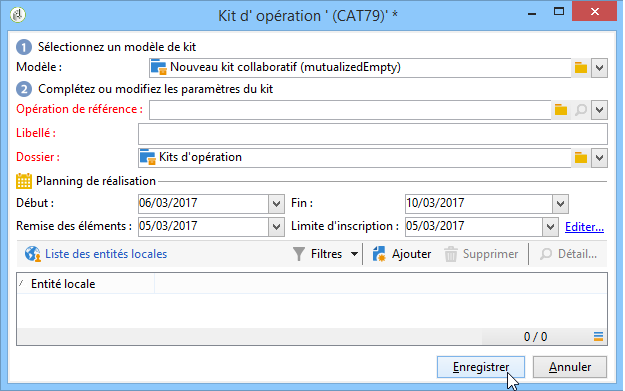

### Audience {#audience}

L&#39;entité centrale doit renseigner les entités locales impliquées par l&#39;opération dès la création de l&#39;opération collaborative.

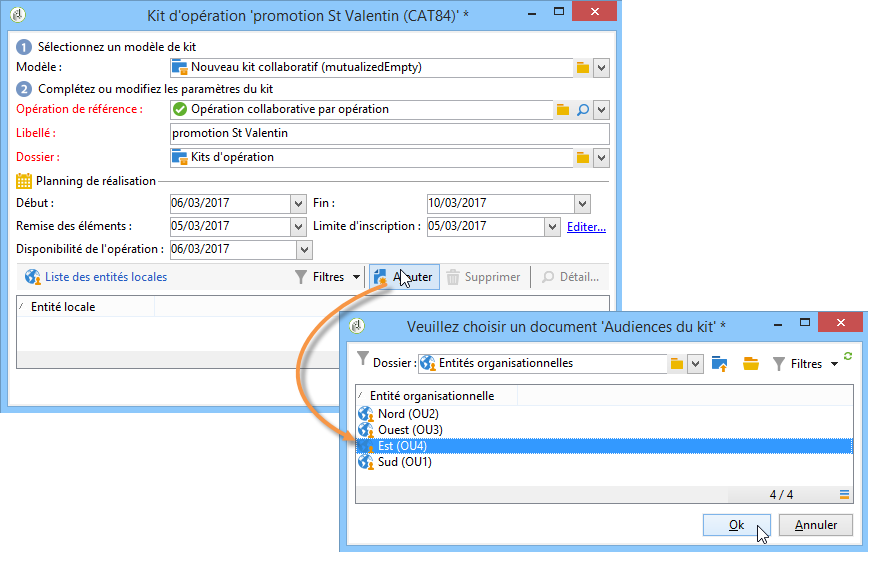

>[!CAUTION]
>
>**[!UICONTROL Simple, by form and by campaign collaborative campaign kits]** ne peuvent être approuvées que si les entités locales concernées ont été spécifiées.

### Modes de validation {#approval-modes}

Pour les **opérations collaboratives**, il est possible de définir le type de validation des commandes :

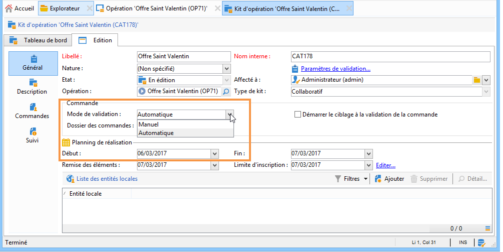

En mode manuel, l&#39;entité locale doit s&#39;inscrire à l&#39;opération pour pouvoir y participer.

En mode automatique, l&#39;entité locale est préinscrite à l&#39;opération et cette inscription est validée. Elle peut se désinscrire de l&#39;opération, ou en modifier le paramétrage sans qu&#39;aucune validation par l&#39;entité centrale ne soit possible.

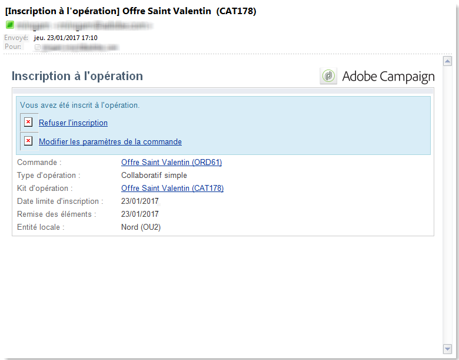

### Notifications {#notifications}

Le paramétrage des messages de notification est identique à celui d&#39;une opération locale. Voir [cette section](../../campaign/using/creating-a-local-campaign.md#notifications).

## Commander une opération {#ordering-a-campaign}

Lorsqu&#39;une opération collaborative est ajoutée dans la liste des kits d&#39;opération, les entités locales faisant partie de l&#39;audience définie par l&#39;entité centrale sont avisées par un message de notification (les **opérations collaboratives par validation de la cible** n&#39;ont pas d&#39;audience prédéfinie). Ce message propose un lien pour s&#39;inscrire à l&#39;opération, comme dans l&#39;exemple ci-dessous :

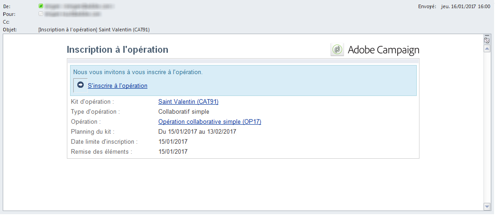

Ce message permet également aux entités locales de visualiser la description renseignée par l&#39;opérateur central qui a créé le kit, et les documents associés à l&#39;opération, s&#39;ils existent. Ces documents permettent de compléter la description de l&#39;opération mais ils n&#39;appartiennent pas à l&#39;opération.

Une fois connecté via une interface Web, l&#39;entité locale peut indiquer les informations de personnalisation pour l&#39;opération collaborative qu&#39;elle souhaite commander :

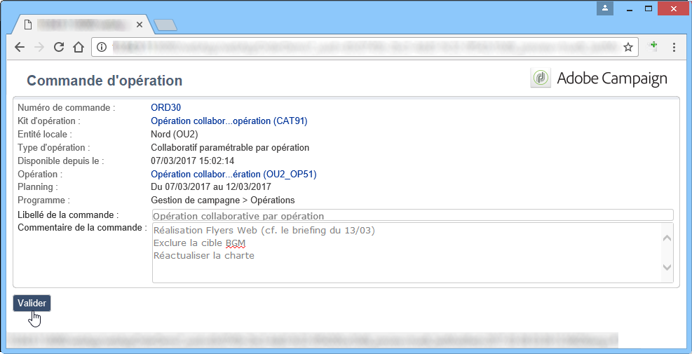

Lorsqu&#39;une entité locale enregistre sa participation, une notification est adressée par email à l&#39;entité centrale afin de valider sa commande.

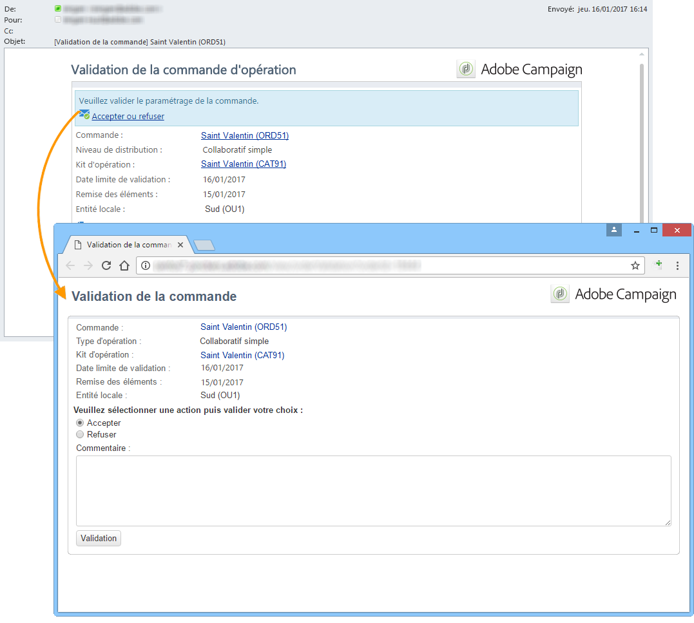

For more on this, refer to the [Approval process](../../campaign/using/creating-a-local-campaign.md#approval-process) section.

## Valider une commande {#approving-an-order}

La validation d&#39;une commande d&#39;un kit d&#39;opération collaborative est identique à celle d&#39;une opération locale. Voir [cette section](../../campaign/using/creating-a-local-campaign.md#approving-an-order).
