# Créer une opération locale{#creating-a-local-campaign}

Une campagne locale est une instance créée à partir d’un modèle référencé dans la liste de **[!UICONTROL campaign packages]** avec un calendrier **d’exécution** spécifique. Son objectif est de répondre à un besoin de communication local en utilisant un modèle de campagne qui a été configuré et configuré par l&#39;entité centrale. Les principales étapes de la mise en oeuvre d’une opération locale sont les suivantes :

**Pour l&#39;entité centrale**

1. Créer un modèle d&#39;opération locale.
1. Créer un kit d&#39;opération à partir du modèle.
1. Publier le kit d&#39;opération.
1. Valider les commandes.

**Pour l&#39;entité locale**

1. Commander l&#39;opération.
1. Exécuter l&#39;opération.

## Créer un modèle d&#39;opération locale {#creating-a-local-campaign-template}

To create a campaign package, you must first create the **campaign template** via the **[!UICONTROL Resources > Templates]** node.

To create a new local template, duplicate the default **[!UICONTROL Local campaign (opLocal)]** template.

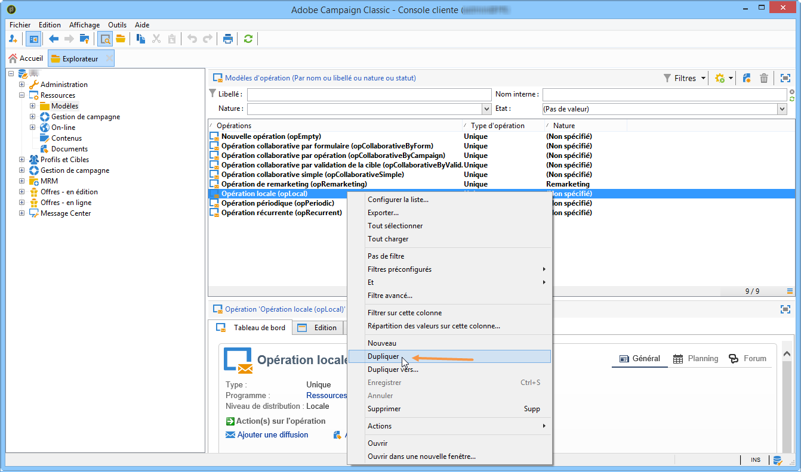

Nommez votre modèle d&#39;opération et renseignez les champs disponibles.

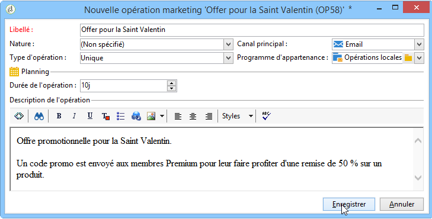

Dans la fenêtre de campagne, cliquez sur l’ **[!UICONTROL Edit]** onglet, puis sur le **[!UICONTROL Advanced campaign settings...]** lien.

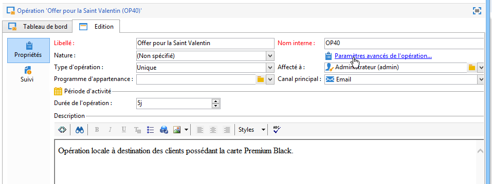

### Interface Web {#web-interface}

Dans l&#39;onglet **Marketing Distribué**, vous pouvez choisir le type d&#39;interface Web, les valeurs par défaut et indiquer les paramètres avancés à saisir lors de la commande par les entités locales.

L&#39;interface Web correspond à un formulaire à renseigner par l&#39;entité locale lors de la commande de l&#39;opération.

Sélectionnez le type d&#39;interface Web à appliquer aux opérations créées à partir du modèle :

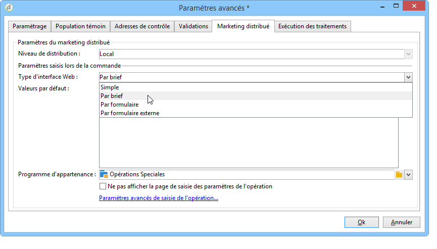

Quatre types d&#39;interface Web sont disponibles :

* **[!UICONTROL By brief]** : l’entité locale doit fournir une description décrivant les configurations de campagne. Une fois la commande approuvée, l’entité centrale configure et exécute la campagne dans son ensemble.

   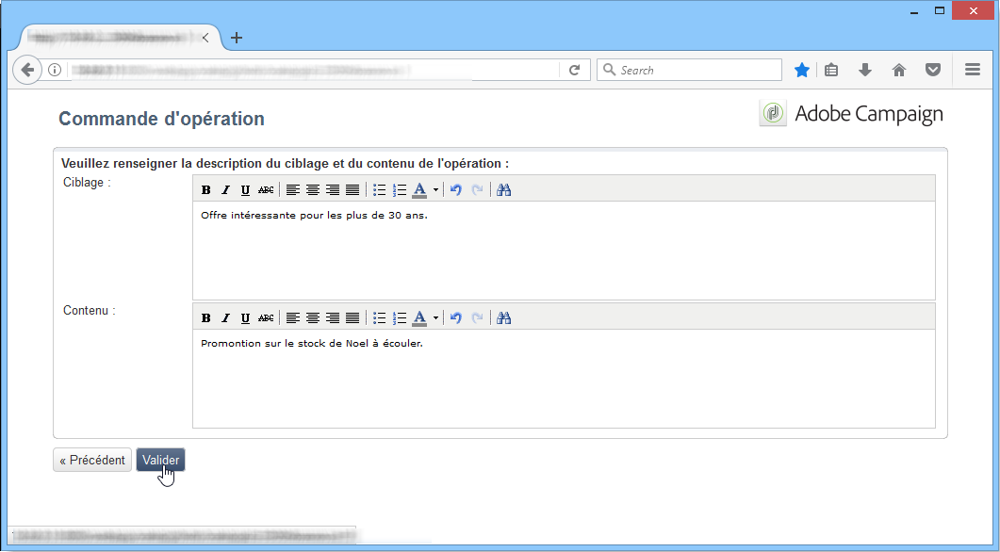

* **[!UICONTROL By form]** : l&#39;entité locale a accès à un formulaire Web où, selon le modèle utilisé, elle peut modifier le contenu, la cible, sa taille maximale, ainsi que les dates de création et d&#39;extraction à l&#39;aide des champs de personnalisation. L&#39;entité locale peut évaluer la cible et prévisualiser le contenu de ce formulaire Web.

   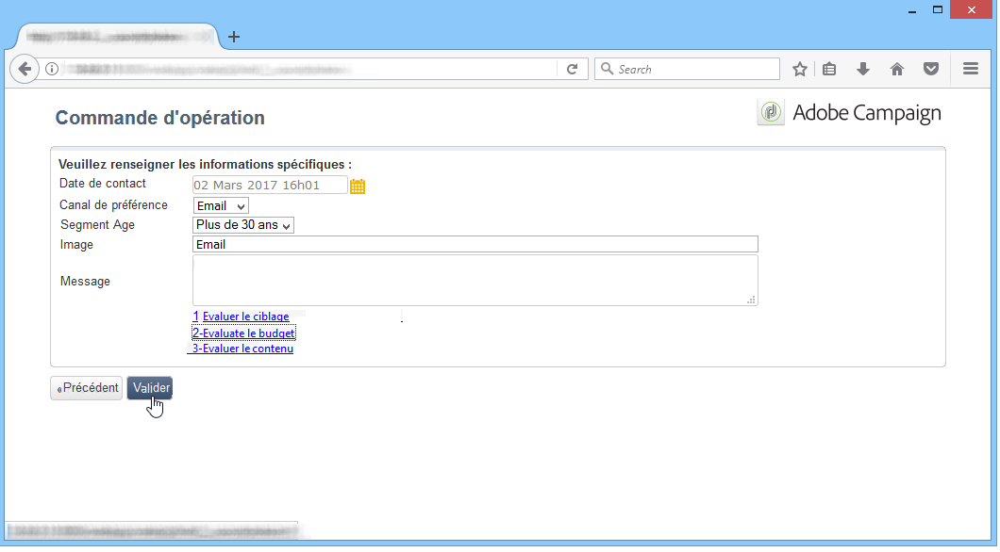

   The form offered is specified in a Web application that must be selected in a drop-down list from the **[!UICONTROL Web Interface]** field in the template&#39;s **[!UICONTROL Advanced campaign settings...]** link. Reportez-vous à [Création d’une campagne locale (par formulaire)](../../campaign/using/examples.md#creating-a-local-campaign--by-form-).

   >[!NOTE]
   >
   >L&#39;application Web utilisée ici est un exemple. Vous devez créer une application Web spécifique pour pouvoir utiliser un formulaire. Voir [API](../../configuration/using/about-web-services.md).

   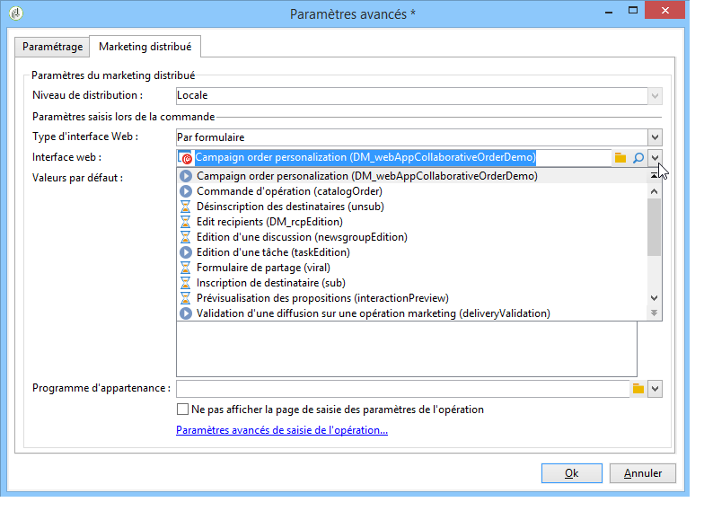

* **[!UICONTROL By external form]** : l’entité locale a accès aux paramètres de campagne dans son extranet (et non dans Adobe Campaign). Ces paramètres sont identiques à ceux d’une campagne **locale (par formulaire)**.
* **[!UICONTROL Pre-set]** : l&#39;entité locale commande la campagne à l&#39;aide du formulaire par défaut, sans le localiser.

   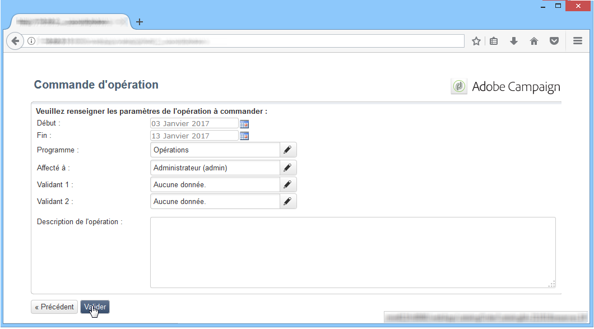

### Les valeurs par défaut {#default-values}

Sélectionnez les éléments **[!UICONTROL Default values]** à remplir par les entités locales. Par exemple :

* les dates de contact et d&#39;extraction,
* les caractéristiques de la cible (segment d&#39;âge, etc.).

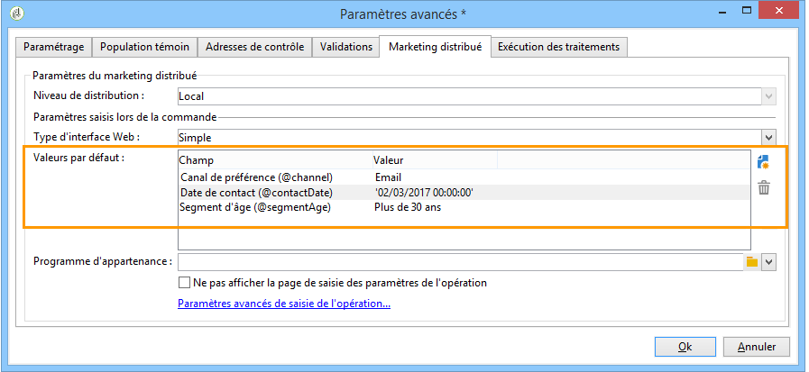

Renseignez les champs **[!UICONTROL Parent marketing program]** et **[!UICONTROL Charge]** .

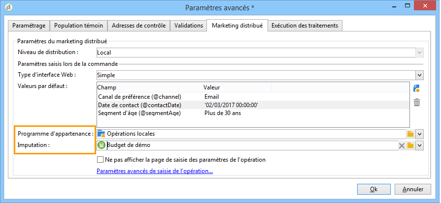

### Validations {#approvals}

À partir du **[!UICONTROL Advanced parameters for campaign entry]** lien, vous pouvez spécifier le nombre maximal de réviseurs.

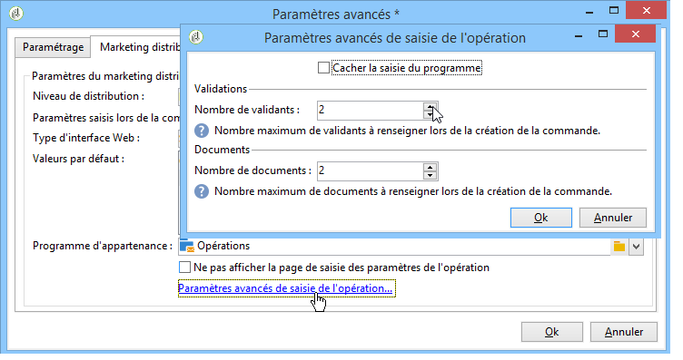

Les validants seront renseignés par l&#39;entité locale lors de la commande de l&#39;opération.

Si l&#39;on ne souhaite pas renseigner de validants pour les opérations, le nombre de validants doit être défini à 0.

### Documents {#documents}

Vous pouvez autoriser les opérateurs d’entité locale à lier des documents (fichiers texte, feuilles de calcul, images, descriptions de campagne, etc.) à la campagne locale lors de la création de la commande. Le **[!UICONTROL Advanced parameters for campaign entry...]** lien permet de limiter le nombre de documents. Pour ce faire, entrez simplement le nombre maximal autorisé dans le **[!UICONTROL Number of documents]** champ.

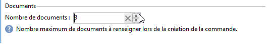

Lors de la commande d&#39;un kit d&#39;opération, le formulaire propose d&#39;associer autant de documents qu&#39;indiqué dans le champ correspondant du modèle :

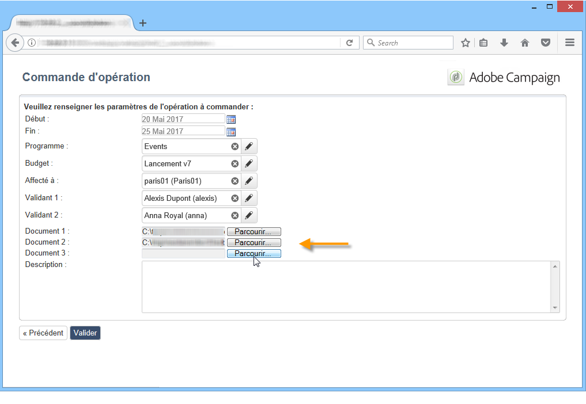

If you do not wish to display a document upload field, enter **[!UICONTROL 0]** in the **[!UICONTROL Number of documents]** field.

>[!NOTE]
>
>Vous **[!UICONTROL Advanced parameters for campaign entry]** pouvez désactiver la fonction en cochant **[!UICONTROL Do not display the page used to enter the campaign parameters]**.

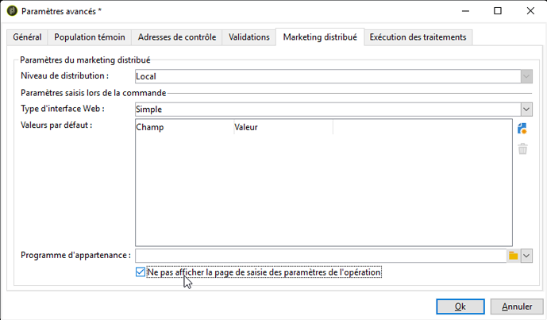

### Workflow {#workflow}

Dans l’ **[!UICONTROL Targeting and workflows]** onglet, créez le processus de campagne qui collecte les **[!UICONTROL Default values]** données spécifiées dans la **[!UICONTROL Advanced campaign settings...]** section et crée les livraisons.

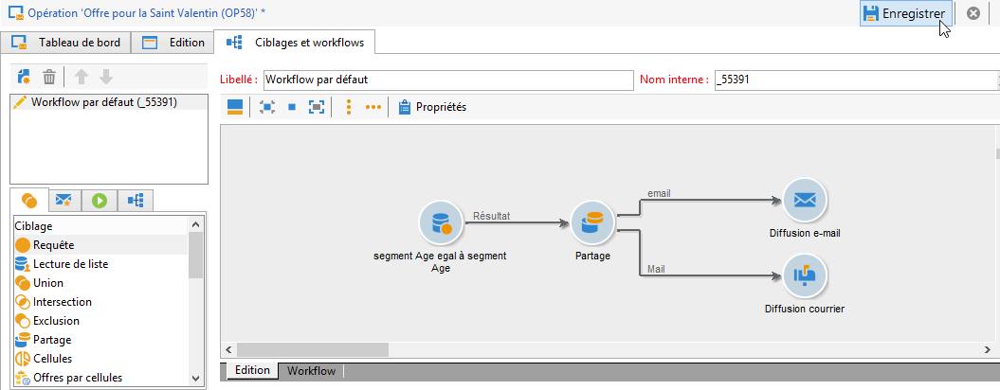

Double click the **[!UICONTROL Query]** activity to configure it according to the specified **[!UICONTROL Default values]**.

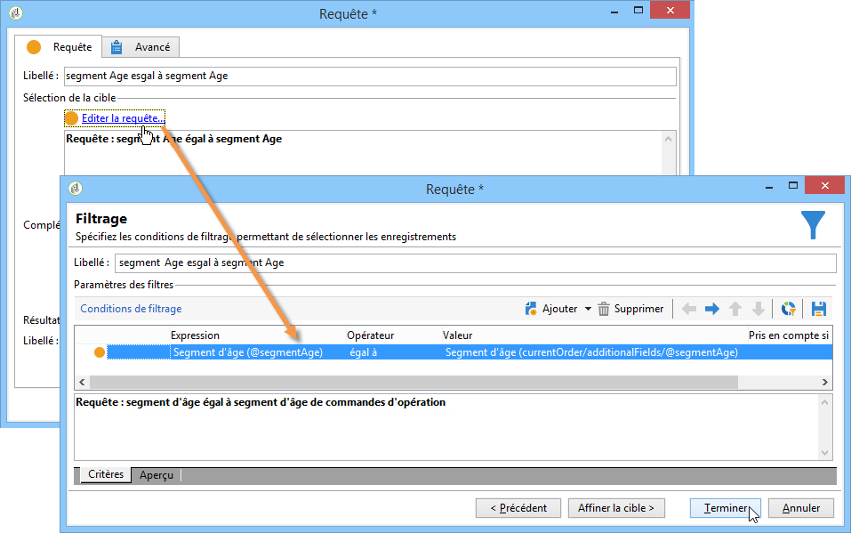

### Diffusion {#delivery}

In the **[!UICONTROL Audit]** tab, click the **[!UICONTROL Detail...]** icon to view the **[!UICONTROL Scheduling]** for the selected delivery.

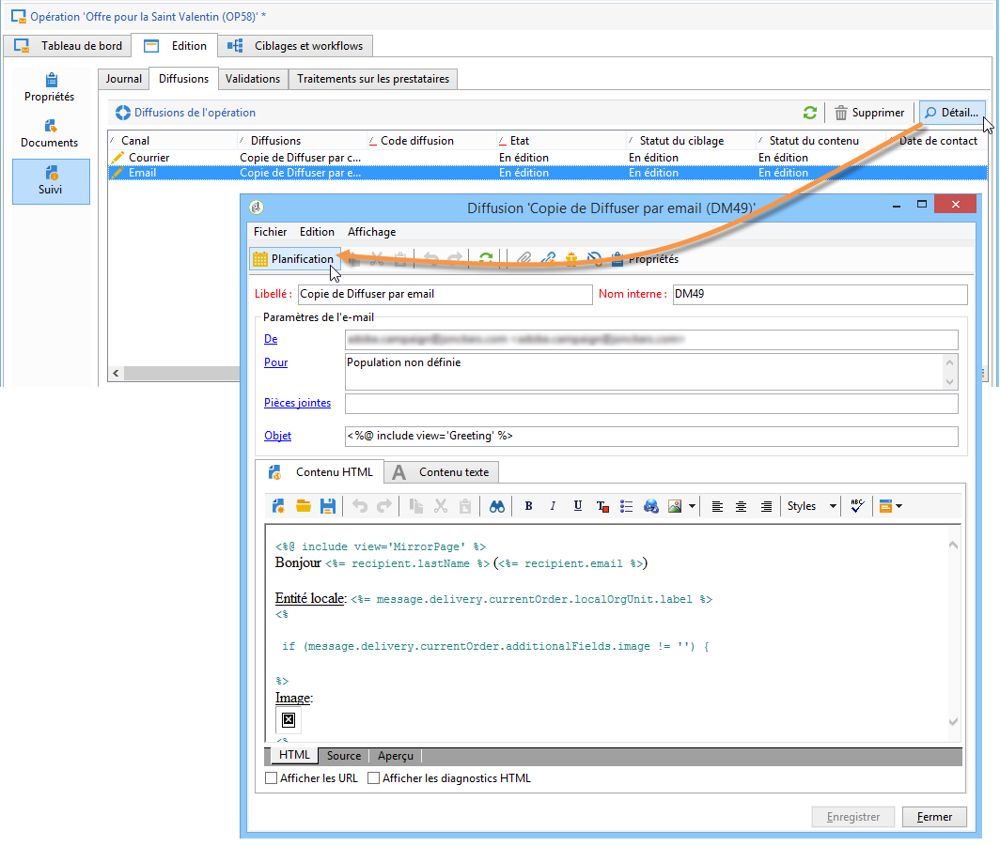

The **[!UICONTROL Scheduling]** icon lets you configure the delivery&#39;s contact and execution date.

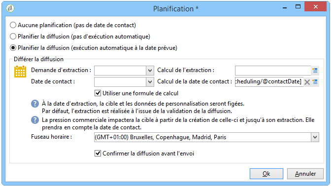

Au besoin, paramétrez la taille maximale de la diffusion :

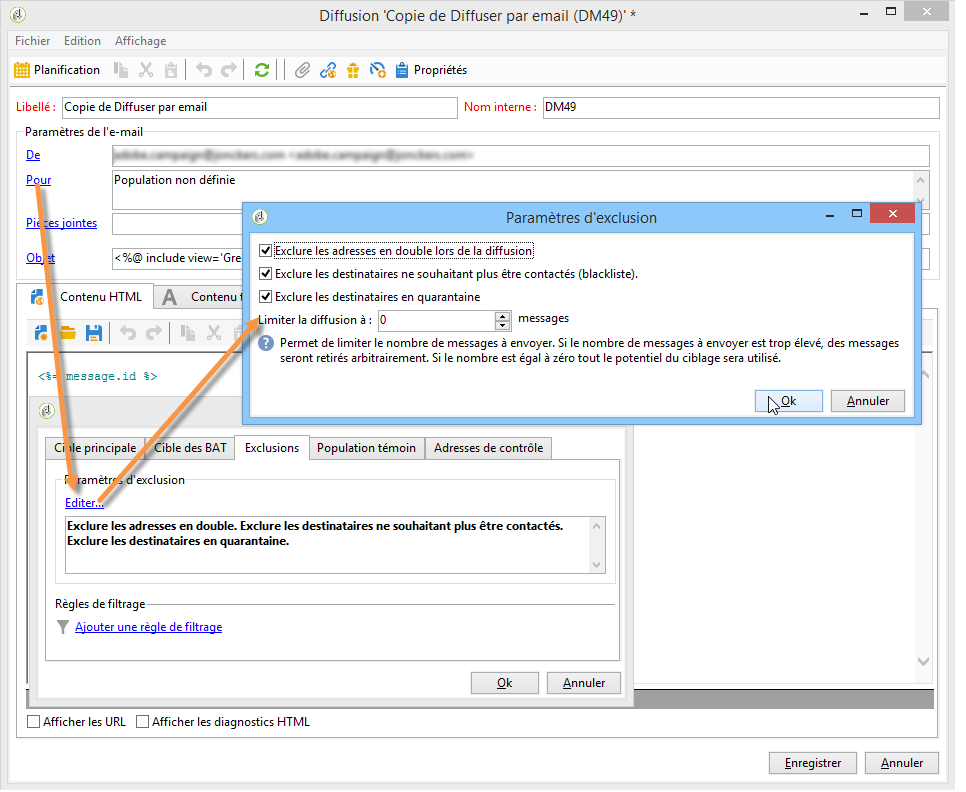

Localisez le code HTML de votre diffusion. Par exemple, dans **[!UICONTROL Delivery > Current order > Additional fields]**, utilisez le **[!UICONTROL Age segment]** champ pour localiser la remise en fonction de l’âge de la cible.

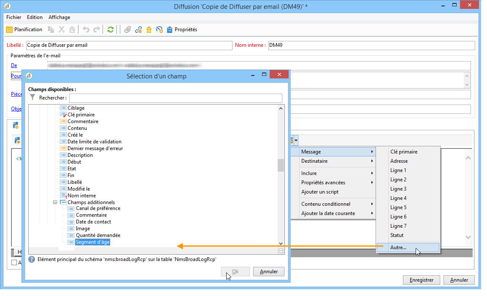

Enregistrez votre modèle de campagne. You can now use it from the **Campaign packages** view in the **Campaigns** universe, by clicking the **[!UICONTROL Create]** button.

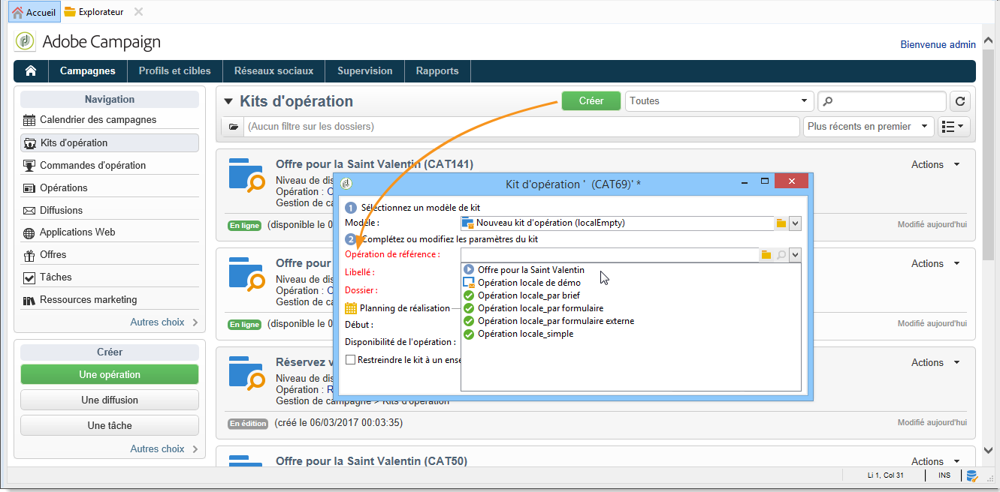

>[!NOTE]
>
>Campaign templates and their general configuration are detailed in [Campaign templates](../../campaign/using/marketing-campaign-templates.md#campaign-templates).

## Créer le kit d&#39;opération {#creating-the-campaign-package}

Pour mettre à disposition le modèle d&#39;opération auprès des entités locales, il doit être ajouté dans la liste. Pour cela, l&#39;entité centrale doit créer un nouveau kit.

Les étapes sont les suivantes :

1. In the **[!UICONTROL Navigation]** section on the **Campaigns** page, click the **[!UICONTROL Campaign packages]** link.
1. Cliquez sur le **[!UICONTROL Create]** bouton.

   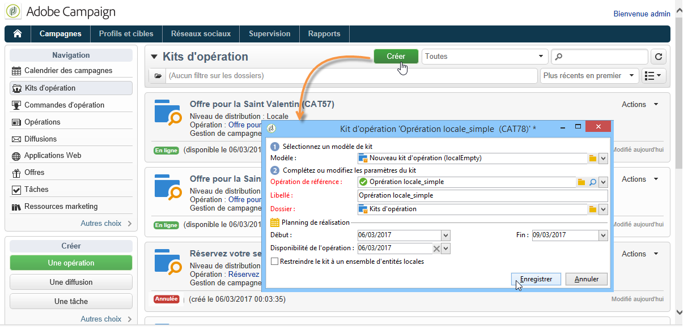

1. La section supérieure de la fenêtre permet de sélectionner le modèle de kit d&#39;opération défini [précédemment](#creating-a-local-campaign-template).

   Par défaut, le **[!UICONTROL New local campaign package (localEmpty)]** modèle est utilisé pour les campagnes locales.

1. Définissez le libellé du kit d&#39;opération, son dossier d&#39;enregistrement et indiquez son planning de réalisation.

### Dates  {#dates}

Les dates de début et de fin correspondent à la période de visibilité de l&#39;opération dans la liste des kits.

La date de disponibilité est la date à partir de laquelle l&#39;opération est disponible auprès des entités locales (pour la commander).

>[!CAUTION]
>
>Si une entité locale n&#39;a pas réservé l&#39;opération avant la date limite d&#39;inscription, elle ne pourra pas y participer.

Ces informations sont accessibles depuis le mail de notification adressé aux agences locales, comme dans l&#39;exemple ci-dessous :

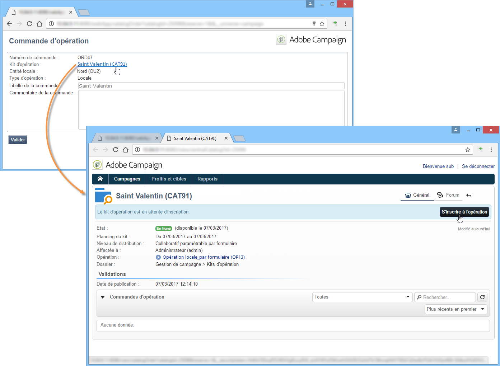

### Audience {#audience}

Pour une campagne locale, l’entité centrale peut spécifier les entités locales impliquées en vérifiant le **[!UICONTROL Limit the package to a set of local entities]**.

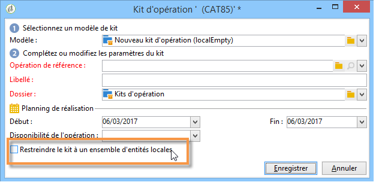

### Paramétrages additionnels {#additional-settings}

Once the package is saved, the central entity can edit it from the **[!UICONTROL Edit]** tab.

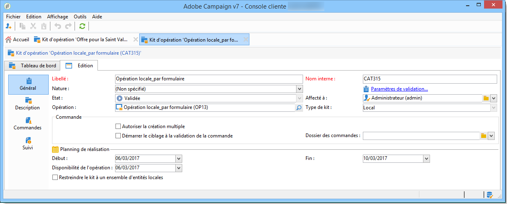

From the **[!UICONTROL General]** tab, the central entity can:

* configure the campaign package reviewer(s) from the **[!UICONTROL Approval parameters...]** link,
* revoir le planning de réalisation,
* ajouter ou supprimer des entités locales.

>[!NOTE]
>
>Par défaut, chaque entité ne peut commander qu&#39;une seule fois une **opération locale**.
>   
>Check the **[!UICONTROL Enable multiple creation]** option to allow several local campaigns to be created from the campaign package.

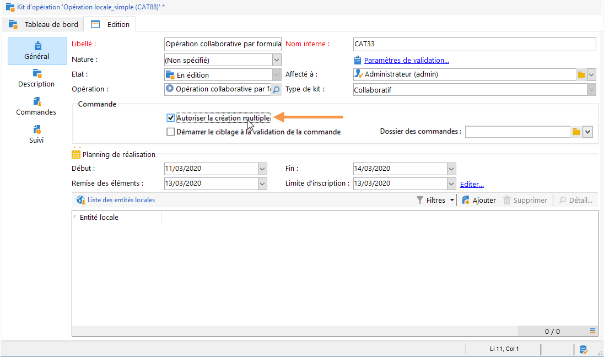

### Notifications {#notifications}

Lorsqu’une campagne devient disponible ou lorsque la date limite d’enregistrement est atteinte, un message est envoyé aux opérateurs du groupe de notification local. For more on this, refer to [Organizational entities](../../campaign/using/about-distributed-marketing.md#organizational-entities).

## Commander une opération {#ordering-a-campaign}

Une fois validés et leur période de réalisation débutée, les kits d&#39;opération sont accessibles au niveau des entités locales. Les acteurs locaux sont avisés par email de la disponibilité d&#39;un nouveau kit d&#39;opération (dès que sa date de disponibilité est atteinte).

>[!NOTE]
>
>Si des entités locales ont été indiquées lors de la création du kit d&#39;opération, elles seules recevront une notification. Si aucune entité locale n&#39;a été indiquée, toutes les entités locales recevront une notification.

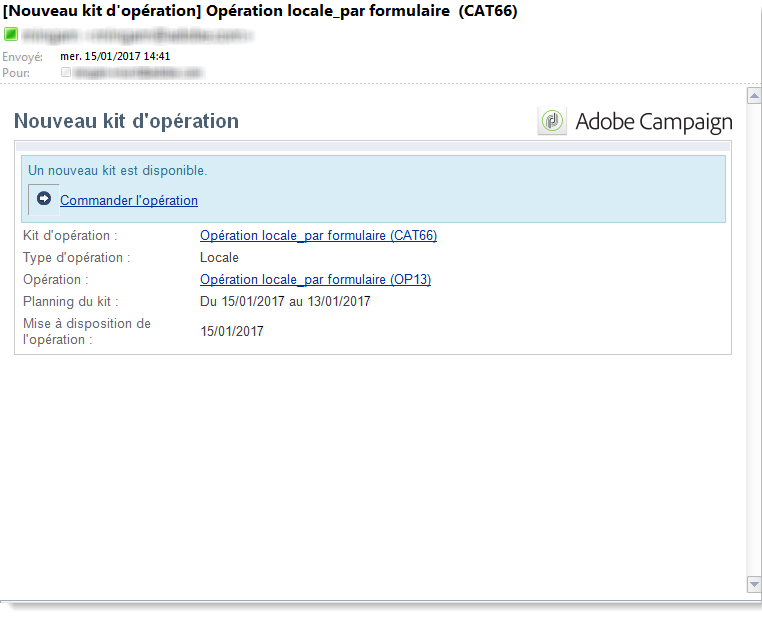

Pour utiliser une opération proposée par l&#39;entité centrale, l&#39;entité locale doit la commander.

Pour commander une opération :

1. Click **[!UICONTROL Order campaign]** in the notification message, or the corresponding button in Adobe Campaign.

   Saisissez votre identifiant et votre mot de passe pour procéder à la commande. L&#39;interface de saisie des paramétrages se compose d&#39;un ensemble de pages définies dans une application Web.

   >[!NOTE]
   >
   >Les applications Web sont présentées dans le guide [Fonctionnalités Web](../../web/using/about-web-applications.md) .

1. Enter the necessary information in the first page (order label and comment) and click **[!UICONTROL Next]**.

   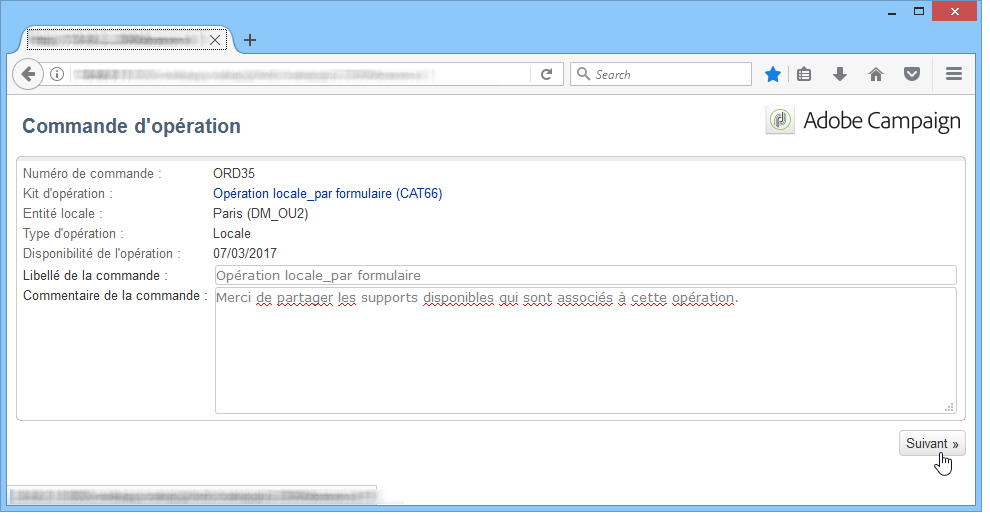

   Renseignez les paramètres disponibles et validez la commande.

   Une notification est adressée au responsable de l&#39;entité organisationnelle à laquelle appartient l&#39;agence locale, pour valider cette commande.

   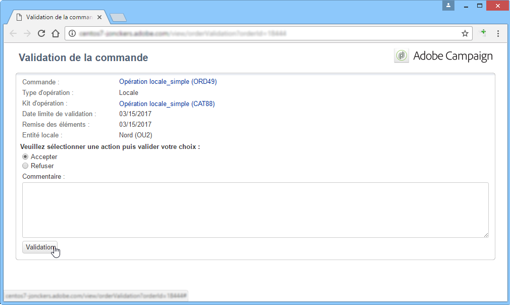

1. L&#39;information est remontée au niveau de l&#39;entité locale et de l&#39;entité centrale. Si chaque entité locale ne voit que ses commandes, l&#39;entité centrale peut visualiser toutes les commandes de toutes les entités locales, comme ci-dessous :

   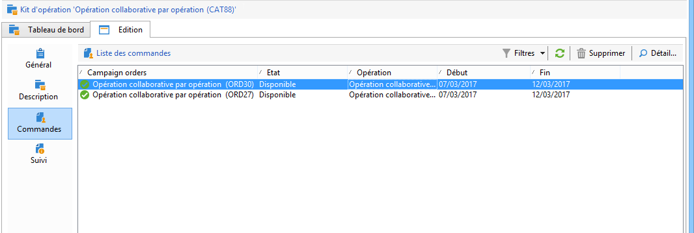

   Les opérateurs peuvent afficher le détail de la commande :

   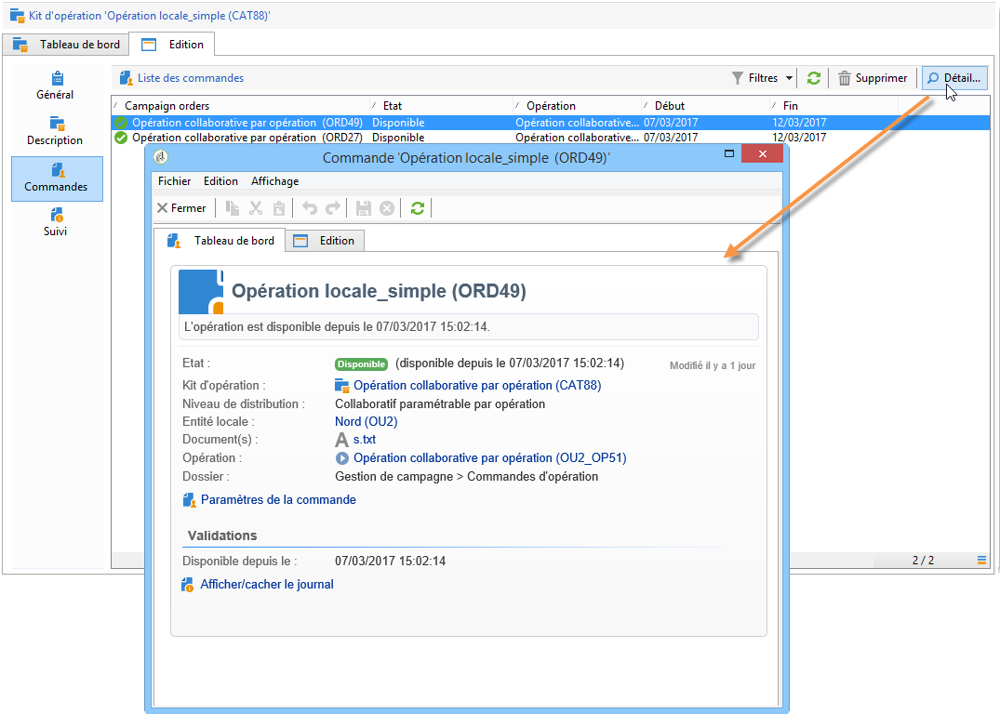

   The **[!UICONTROL Edit]** tab contains information entered by the local entity when ordering the campaign.

   

1. La commande doit être validée par l&#39;entité centrale pour être définitive.

   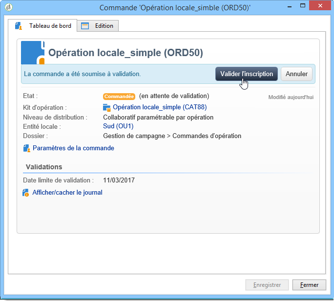

   For more on this, refer to the [Approval process](#approval-process) section.

1. The local operator is then notified that the campaign is available: campaign availability can be found in the list of campaign packages within the **Campaigns** universe. The campaign can then be used. For more on this, refer to [Accessing campaigns](../../campaign/using/accessing-campaigns.md).

   The **[!UICONTROL Start targeting with order approval]** option lets the local entity run the campaign as soon as the order has been approved.

   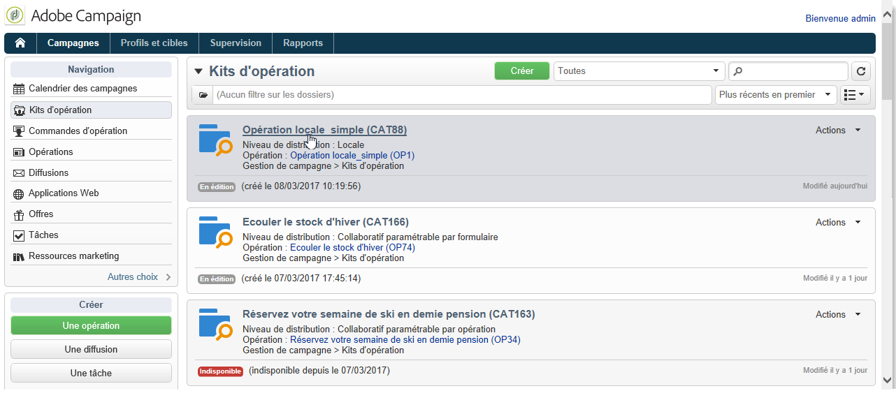

## Valider une commande {#approving-an-order}

Pour confirmer la commande d&#39;une opération, l&#39;entité centrale doit la valider.

The **[!UICONTROL Campaign orders]** overview, accessed via the **Campaigns** universe lets you view the status of campaign orders and approve them.

>[!NOTE]
>
>Tant que la commande n&#39;est pas validée, les acteurs locaux peuvent la modifier.

### Processus de validation {#approval-process}

#### Notification par email {#email-notification}

Lorsqu&#39;une commande d&#39;opération est effectuée par une entité locale, les opérateurs validants de cette entité sont notifiés par email, comme dans l&#39;exemple ci-dessous :

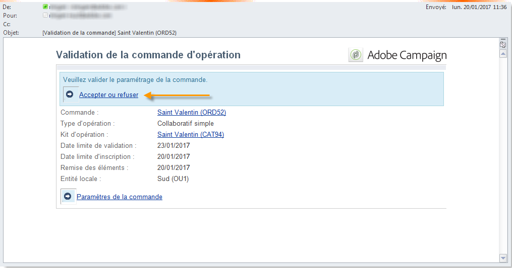

>[!NOTE]
>
>La sélection des réviseurs est présentée dans la section [Réviseurs](#reviewers) . Ils peuvent accepter ou rejeter l&#39;ordre.

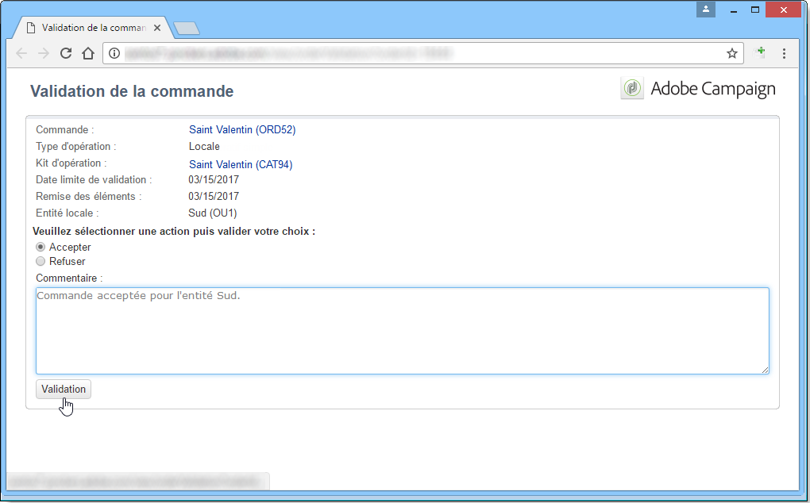

#### Validation via la console Adobe Campaign {#approving-via-the-adobe-campaign-console}

The order may also be approved via the console, in the campaign order overview. To approve an order, select it and click **[!UICONTROL Approve the order]**.

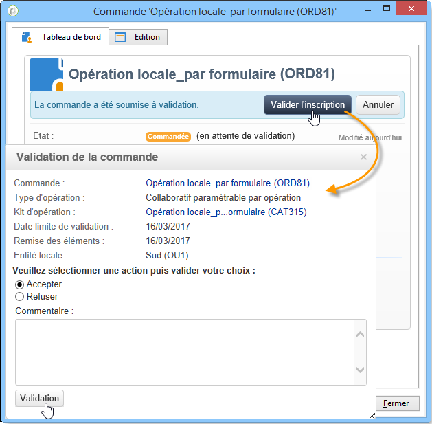

>[!NOTE]
>
>La campagne peut toujours être modifiée et reconfigurée jusqu’à la date de disponibilité de la campagne. Les entités locales peuvent également rejeter la campagne en cliquant sur le **[!UICONTROL Cancel]** bouton.

#### Créer une campagne  {#creating-a-campaign}

Lorsque la commande d&#39;une opération est validée, celle-ci peut être paramétrée et exécutée par l&#39;entité locale.

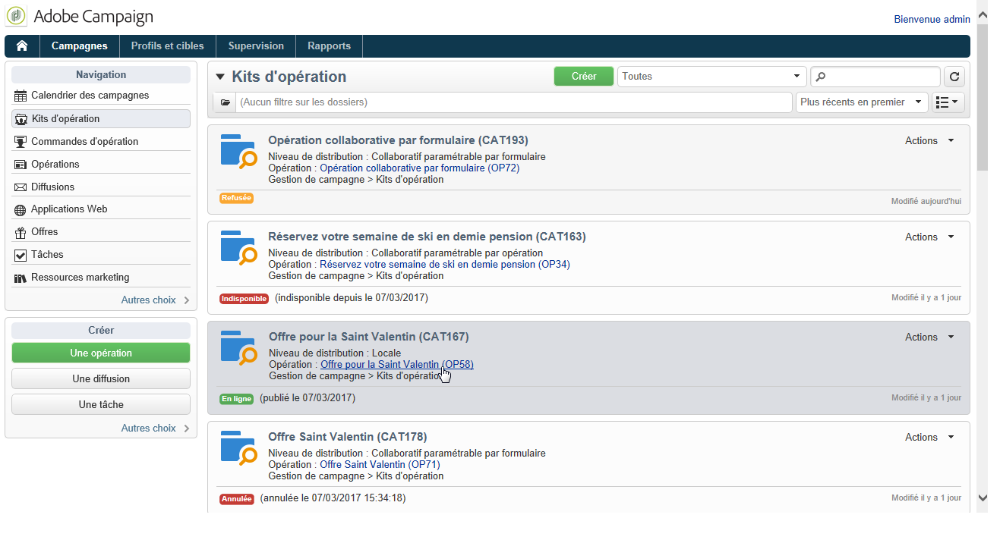

For more on this, refer to [Accessing campaigns](../../campaign/using/accessing-campaigns.md).

### Refuser une validation {#rejecting-an-approval}

L&#39;opérateur validant peut refuser la validation d&#39;un kit d&#39;opération ou d&#39;une commande.

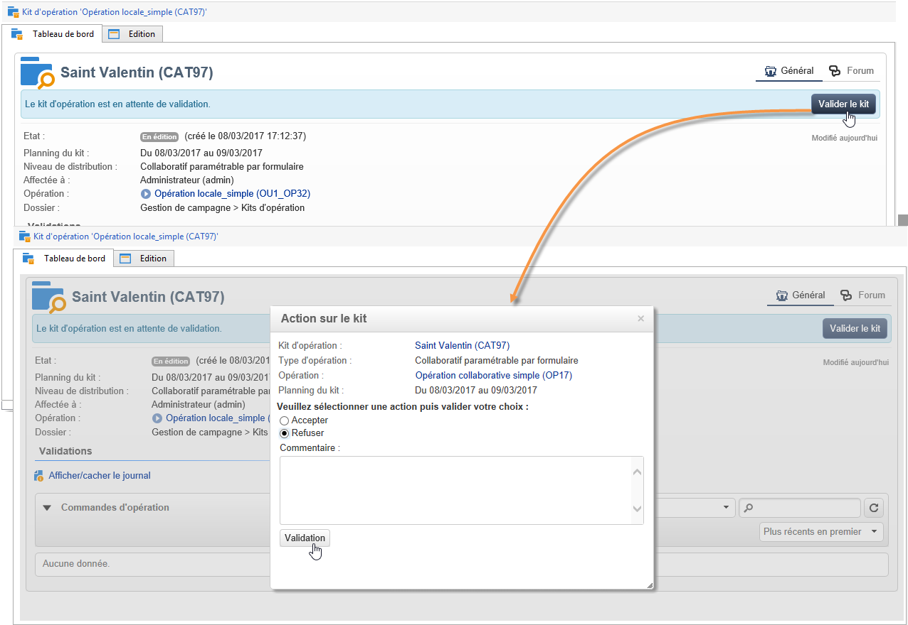

Si l&#39;opérateur validant refuse une commande, la notification correspondante est automatiquement envoyée aux entités locales concernées : elle affiche le commentaire saisi par l&#39;opérateur ayant refusé la validation.

L&#39;information est affichée dans la liste des kits d&#39;opération ou dans celle des commandes d&#39;opérations. Lorsqu&#39;elles ont accès à la console Adobe Campaign, les entités locales peuvent ainsi être informées de ce refus.

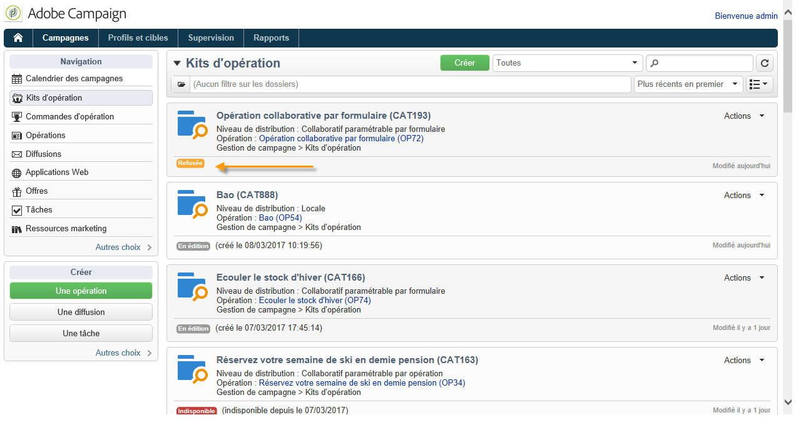

They can view the related comment in the campaign package&#39;s **[!UICONTROL Edit]** tab.

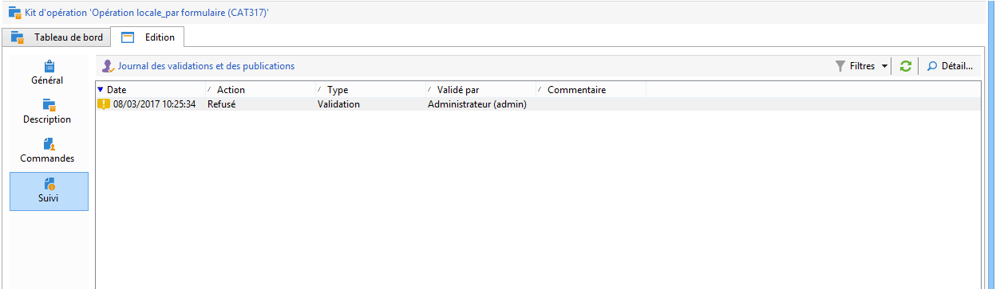

### Opérateurs validants {#reviewers}

Les opérateurs validants sont notifiés par email lorsqu&#39;une validation est requise.

Pour chaque entité locale, les réviseurs sont sélectionnés pour l’approbation des commandes de campagne et de la campagne. Pour plus d’informations sur la sélection des réviseurs locaux, voir Entités organisationnelles.

>[!NOTE]
>
>La validation de la commande ne doit pas encore être effective pour que cette sélection soit possible.

### Annuler une commande {#canceling-an-order}

The central agency can cancel an order using the **[!UICONTROL Delete]** button, located on the order dashboard.

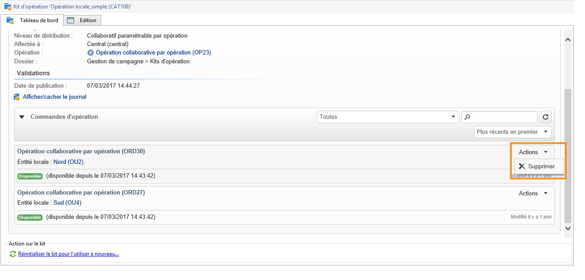

This cancels the campaign in the **[!UICONTROL Campaign orders]** view.
