# Créer et gérer les tâches{#creating-and-managing-tasks}

## A propos des tâches {#about-tasks}

Adobe Campaign permet de créer des tâches et de gérer leur cycle de vie complet directement au sein de l&#39;application. La mise en oeuvre des programmes et des opérations peut être découpée en tâches qui sont assignées à des opérateurs Adobe Campaign ou à des prestataires externes. Ce mode de fonctionnement permet de créer un environnement de collaboration ouvert incluant tous les participants au programme et les intervenants externes.

Les tâches peuvent être créées, visualisées et suivies au niveau de liste des tâches et du tableau de bord d&#39;une opération. Elles peuvent également être visualisées et suivies au niveau des plannings du plan marketing, des programmes et des opérations.

Les tâches sont attachées à des opérations, et peuvent avoir des dépendances, c&#39;est-à-dire des tâches associées. Chaque tâche a un statut, une priorité, une charge estimée et des coûts associés.

Toutes les tâches sont regroupées dans une liste accessible via l’univers **Campagnes** . For more on this, refer to [Accessing tasks](#accessing-tasks).

Elles peuvent être affichées dans le planning du programme auquel elles appartiennent.

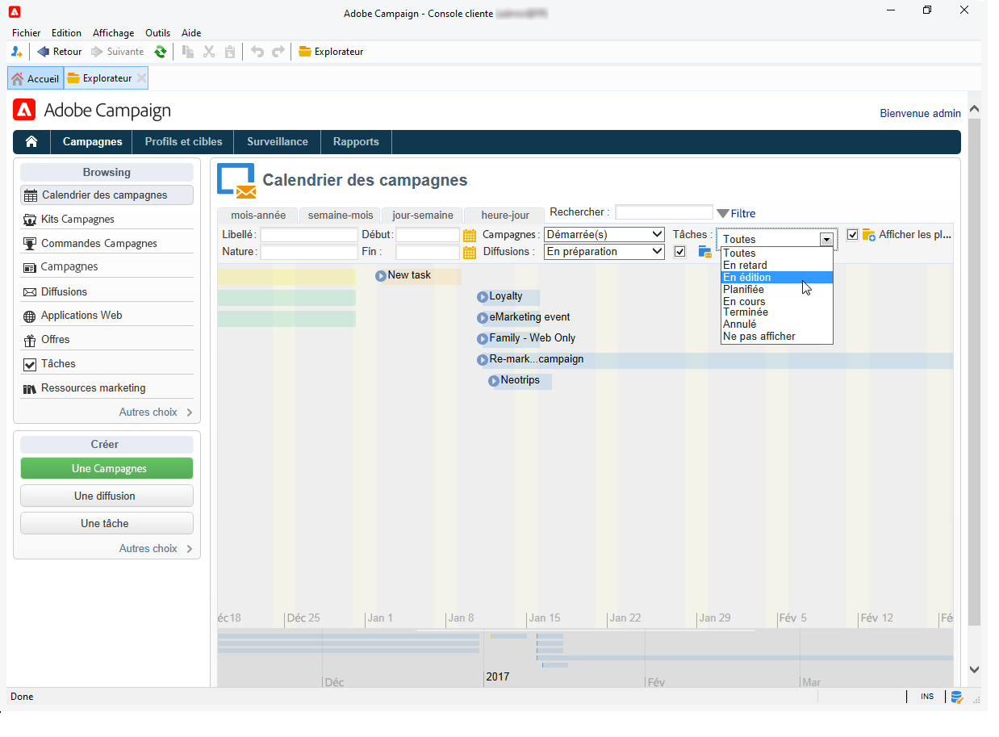

## Accéder aux tâches {#accessing-tasks}

### Afficher les tâches {#displaying-tasks}

The tasks are displayed in the task list accessible via the **[!UICONTROL Campaigns]** universe.

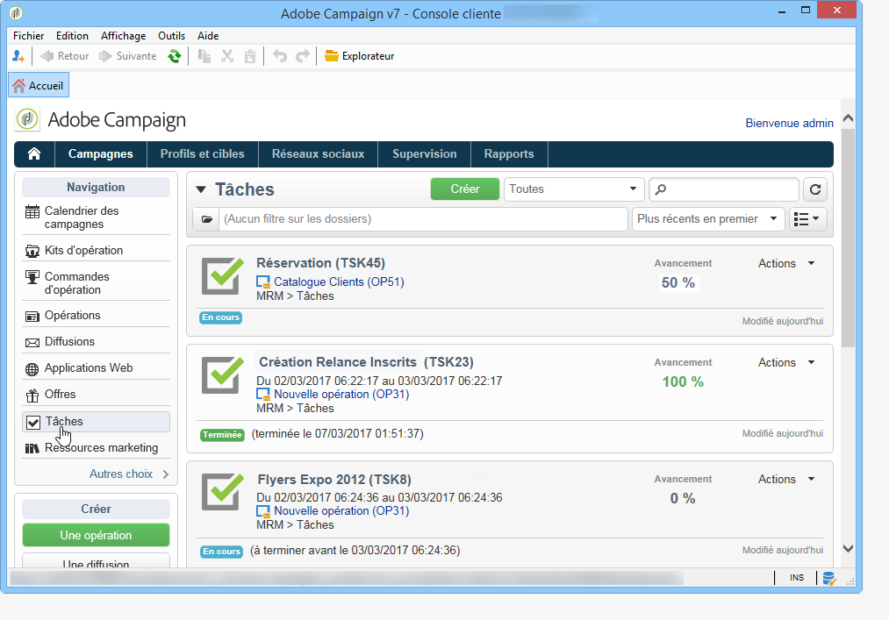

Vous pouvez y visualiser toutes les tâches de l&#39;opérateur connecté.

Pour plus d’informations, reportez-vous à l’état [d’exécution d’une tâche](#execution-status-of-a-task) et à l’état de [progression d’une tâche](#progress-status-of-a-task).

### Filtrer les tâches {#filtering-tasks}

When you display this view, it is automatically filtered in order to display only **[!UICONTROL operator tasks]**. You can also filter the tasks using the fields in the upper section of the window.

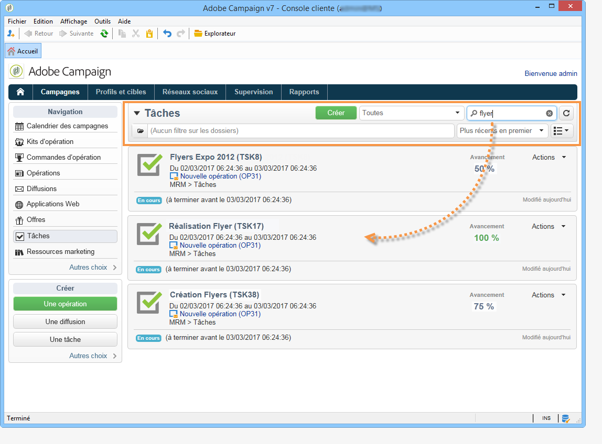

### Editer les tâches {#editing-tasks}

Cliquez sur une tâche pour l&#39;éditer.

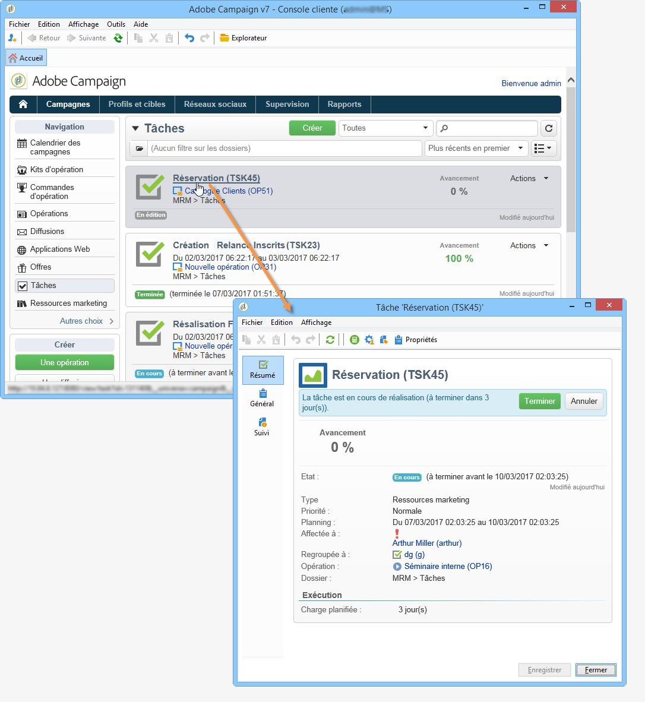

## Créer une nouvelle tâche {#creating-a-new-task}

To create a task, click the **[!UICONTROL Tasks]** link in the Campaigns universe and select **[!UICONTROL Create]**.

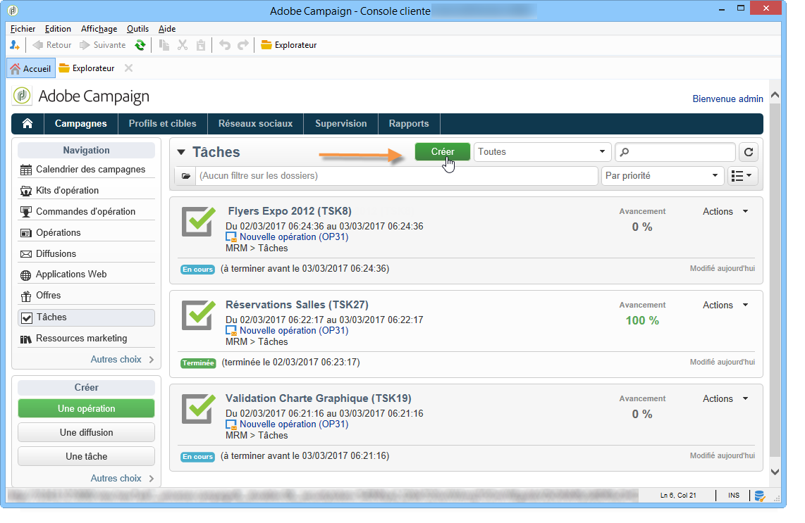

Saisissez au minimum le nom de la tâche et sélectionnez l&#39;opération à laquelle elle est rattachée. Vous devez également indiquer les dates de début et de fin. Ces trois informations sont obligatoires.

Click **[!UICONTROL Save]** to create the task.

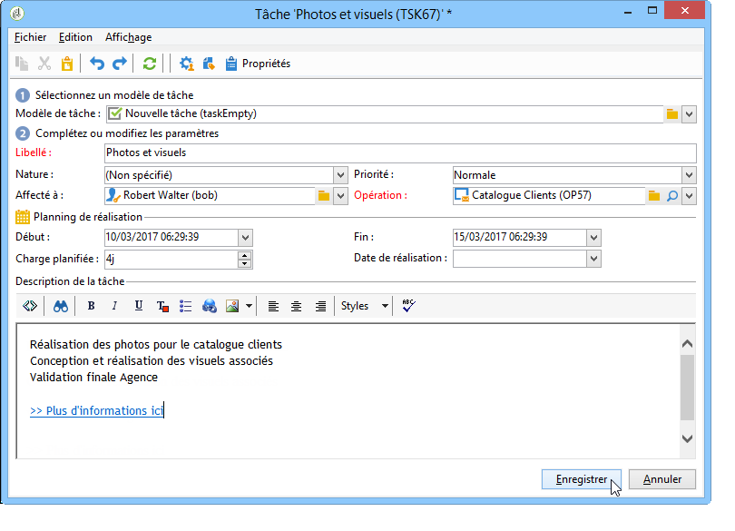

Vous pouvez également créer une tâche à partir du tableau de bord d&#39;une opération : dans ce cas, elle est automatiquement associée à l&#39;opération à partir de laquelle elle a été créée.

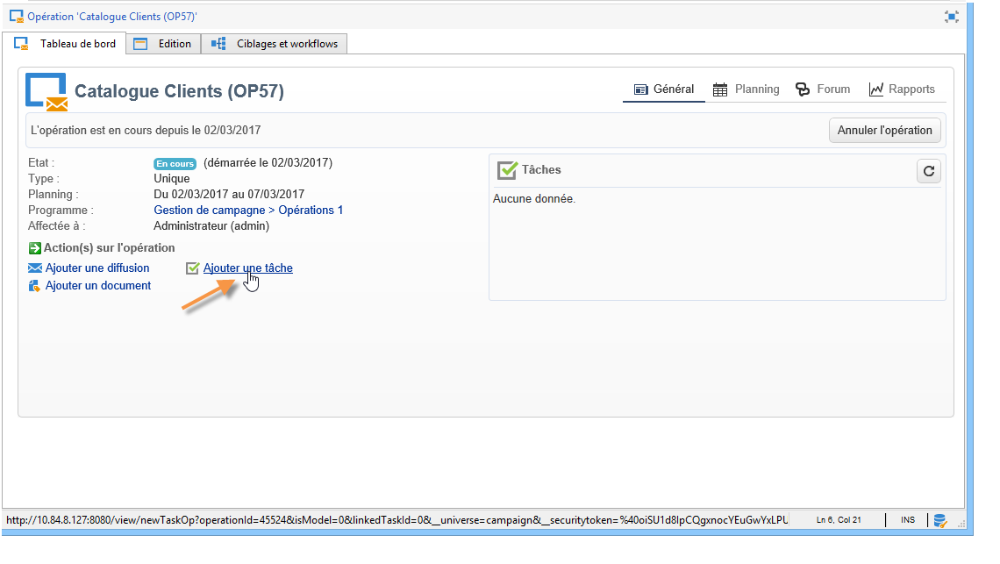

Une fois une tâche créée, elle est ajoutée au calendrier de campagne et à la liste des tâches. Pour modifier une tâche, sélectionnez-la dans la planification ou cliquez sur son nom dans l’aperçu de la tâche, puis cliquez sur le **[!UICONTROL Open]** lien.

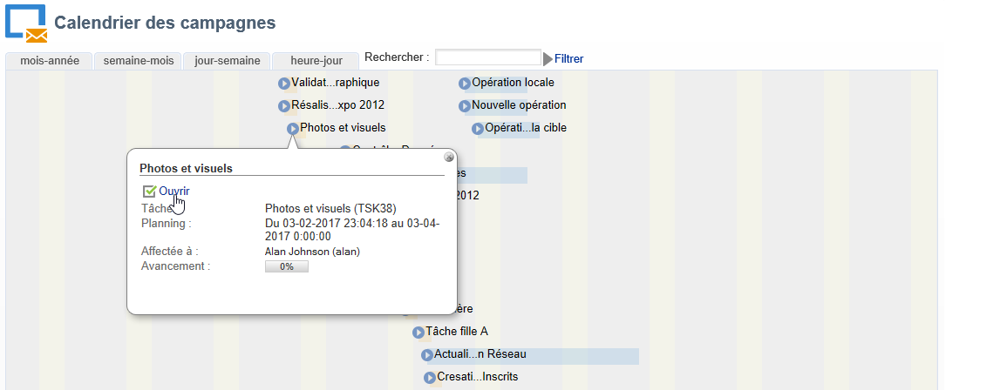

Pour la paramétrer, vous devez indiquer :

* Le directeur et les participants : reportez-vous au [gestionnaire et aux participants](#manager-and-participants).
* Calendrier de création : reportez-vous au calendrier [d’](#execution-schedule)exécution.
* Les coûts engagés : consultez [Dépenses et recettes](#expenses-and-revenues).

It is also possible to ad reviewers (refer to [Reviewers](#reviewers)) and referenced documents (refer to [Documents referenced](#documents-referenced)).

Task life cycle is presented in [Life cycle](#life-cycle).

### Responsable et intervenants {#manager-and-participants}

Le responsable de la tâche est le seul opérateur habilité à clore la tâche.

Par défaut, lorsqu’un opérateur Adobe Campaign crée une tâche, elle lui est affectée automatiquement. Pour sélectionner un autre opérateur, utilisez le **[!UICONTROL Assigned to]** champ.

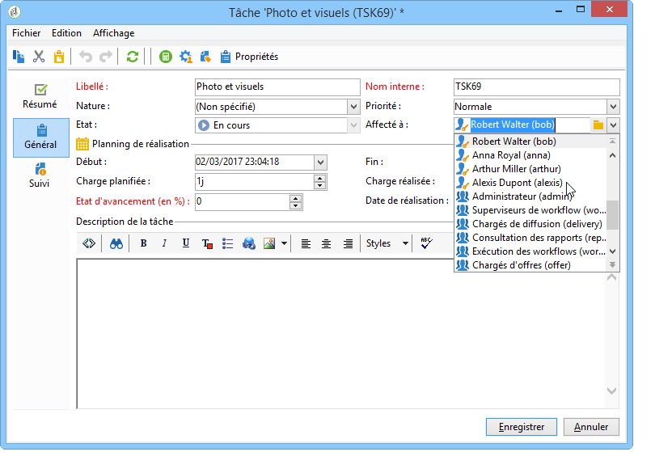

>[!NOTE]
>
>La gestion des opérateurs est présentée dans [cette section](../../platform/using/access-management.md).

En plus du responsable, vous pouvez indiquer les opérateurs impliqués dans la réalisation de la tâche. Ces opérateurs ne sont pas habilités à clore la tâche. Ils peuvent uniquement valider la partie de la tâche qui leur est assignée.

Ils sont sélectionnés à l’aide de l’ **[!UICONTROL Resources]** icône de la barre d’outils de la tâche. Cliquez sur **[!UICONTROL Add]** et sélectionnez les opérateurs concernés.

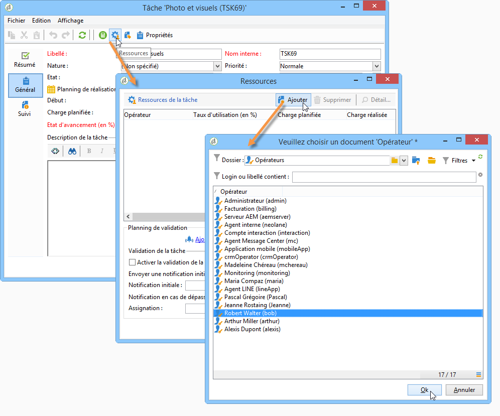

Cliquez sur **[!UICONTROL Ok]** puis entrez le taux d’utilisation : représente la charge affectée à l’opérateur pendant la durée de l’exécution de la tâche. Ce taux est une indication seulement et est exprimé en pourcentage.

Par exemple, pour une tâche dont le planning de réalisation est fixé à 10 jours, un opérateur pour lequel le taux d&#39;utilisation est de 50% sera mobilisé pour la moitié de son temps de travail sur la réalisation de cette tâche, pendant les 10 jours prévus.

Il est également possible de renseigner, pour chaque opérateur, une charge planifiée ainsi qu&#39;une charge réalisée. Ces durées sont également indicatives.

Vous avez la possibilité de définir un rappel qui sera automatiquement envoyé aux opérateurs impliqués dans la réalisation de la tâche, avant la date de fin de la tâche.

You can view the Adobe Campaign operator profile via the **[!UICONTROL Edit link]** icon.

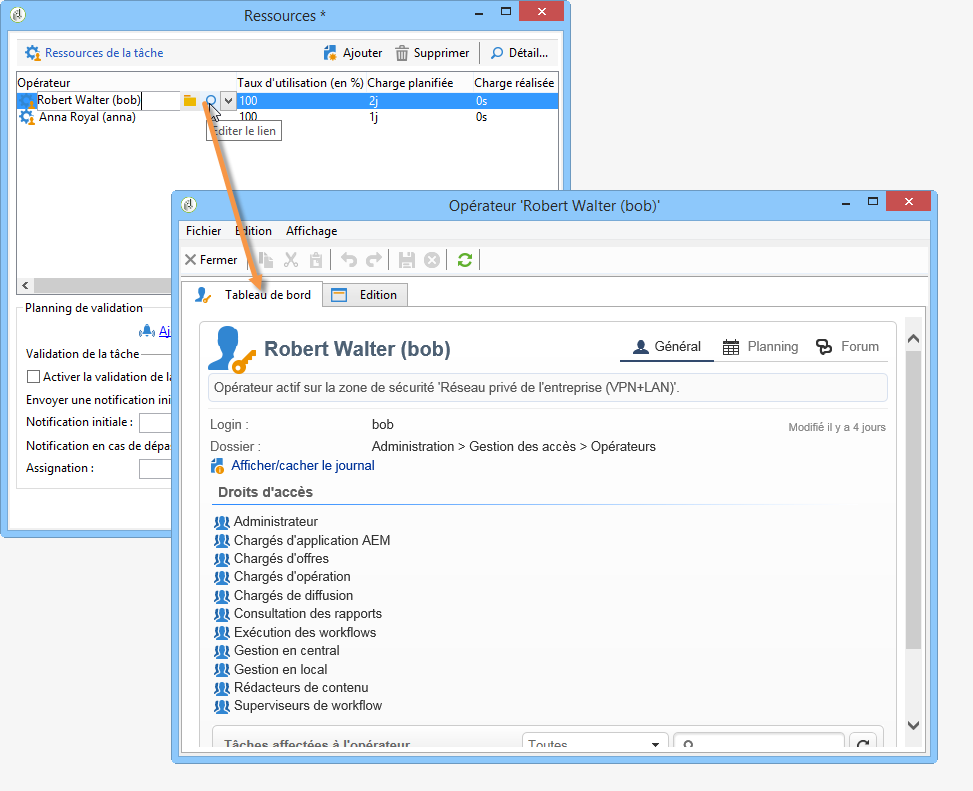

Le tableau de bord de l&#39;opérateur permet de consulter sa charge de travail, c&#39;est-à-dire les autres tâches.

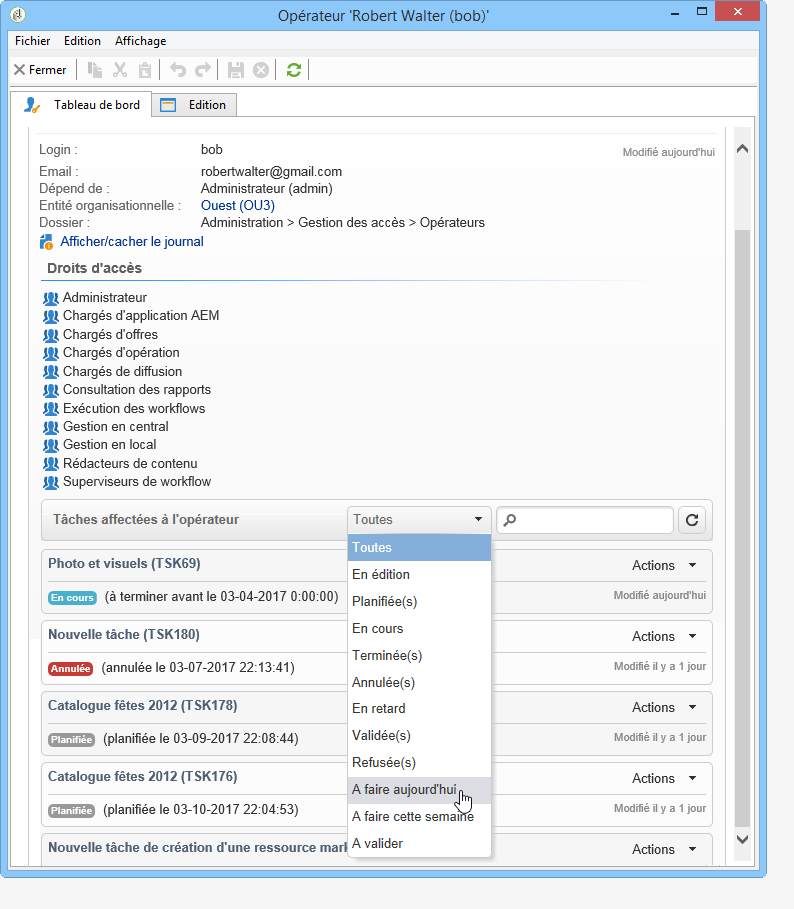

### Opérateurs validants {#reviewers}

Outre les participants, vous pouvez définir les opérateurs qui passeront en revue la tâche une fois qu’elle aura été fermée par la personne responsable. Pour ce faire, cliquez sur l’ **[!UICONTROL Enable task approval]** option dans la section inférieure gauche de la **[!UICONTROL Resources]** fenêtre. Il peut s’agir d’un opérateur individuel, d’un groupe d’opérateurs ou d’une liste d’opérateurs.

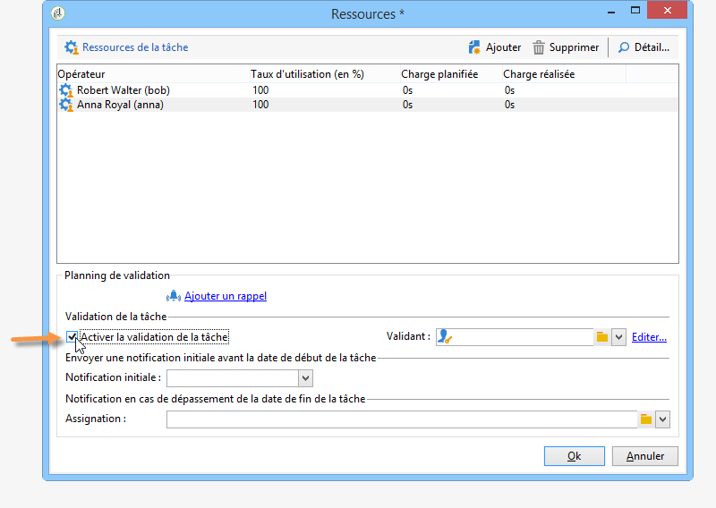

To specify a list of operators, click the **[!UICONTROL Edit...]** link to the right of the first reviewer and add as many operators as necessary, as shown below:

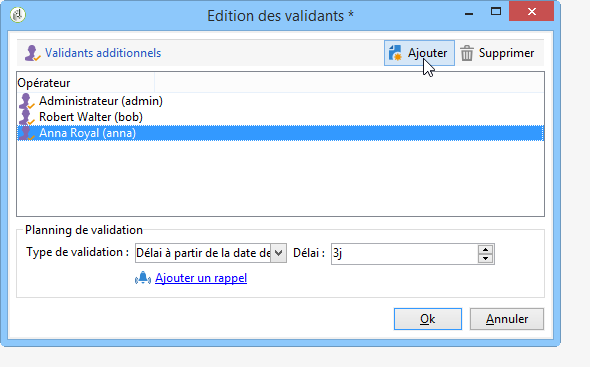

Vous pouvez définir un planning de validation pour la tâche, dans la section inférieure de la fenêtre d&#39;édition des validants. Par défaut, les validants ont trois jours à partir de la date de soumission pour valider la tâche. Il est possible de définir un rappel qui sera automatiquement envoyé aux opérateurs concernés avant l&#39;expiration du délai de validation.

La personne responsable de la tâche peut se charger de l’approuver, même si d’autres opérateurs ont déjà été affectés à cette fin. Si aucun réviseur n’a été défini, les notifications sont envoyées à la personne responsable de la tâche. Tous les autres opérateurs Adobe Campaign disposant de **[!UICONTROL Administrator]** droits d’accès peuvent également approuver la tâche. Toutefois, ils ne recevront pas de notifications.

### Documents référencés {#documents-referenced}

Il est possible d’ajouter des documents et des ressources marketing à une tâche (pour plus d’informations, voir [Gestion des ressources](../../campaign/using/managing-marketing-resources.md)marketing). Pour ce faire, ouvrez la tâche et cliquez sur l’ **[!UICONTROL Documents]** icône dans la barre d’outils de la tâche.

Cliquez sur **[!UICONTROL Add]** et sélectionnez le document à ajouter à votre tâche. Appliquez le même processus aux ressources marketing.

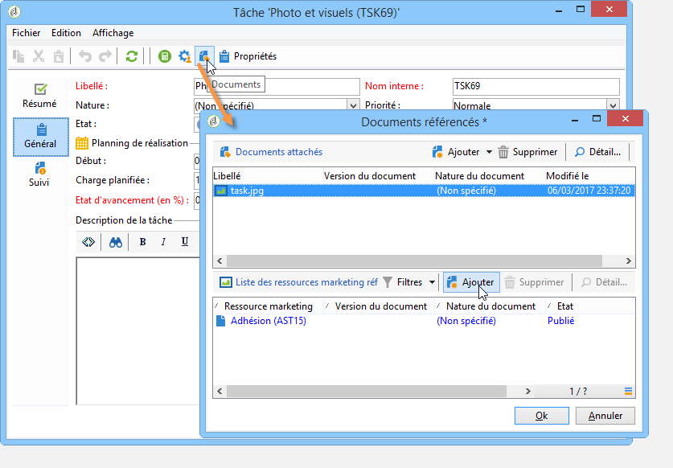

Les documents référencés apparaîtront dans les notifications envoyées aux différents opérateurs impliqués dans la tâche, ainsi que dans le tableau de bord de la tâche.

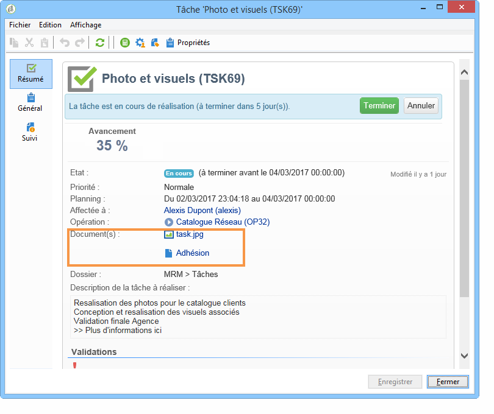

### Planning d&#39;exécution {#execution-schedule}

La période de validité d’une tâche est indiquée dans les **[!UICONTROL Start]** champs et **[!UICONTROL End]** . La charge planifiée exprime la charge de travail à exécuter pendant la période. Il est exprimé en jours ou en heures.

>[!NOTE]
>
>The life cycle of a task is presented in [Life cycle](#life-cycle).

The **[!UICONTROL Workload performed]** field also expressed in days and hours, lets you manually update the progress of the task with respect to the scheduled workload.

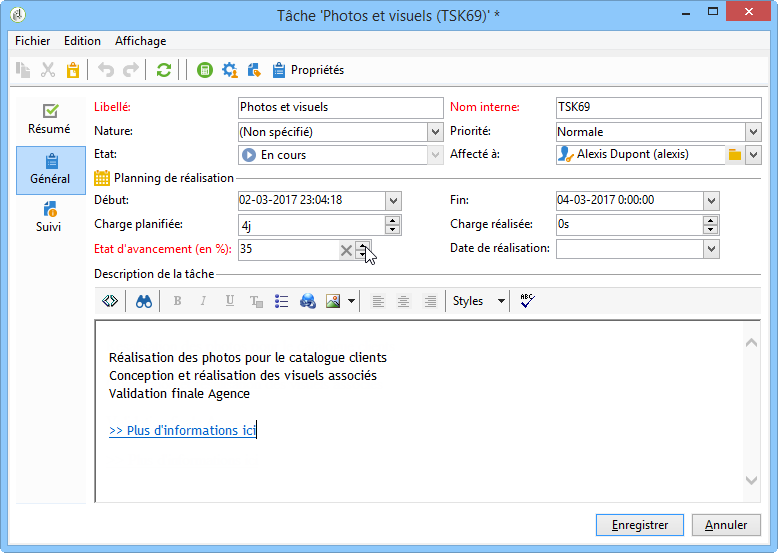

La tâche, exprimée en pourcentage, est automatiquement mise à jour en fonction **[!UICONTROL Progress status]** des tâches effectuées par les opérateurs concernés. Il peut être saisi manuellement.

Cette information est visualisable dans le tableau de bord de la tâche.

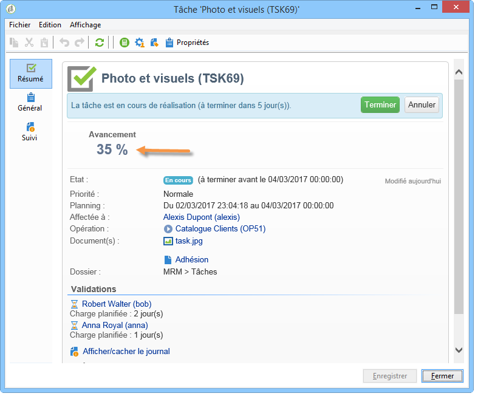

Elle est également affichée dans celui de l&#39;opération.

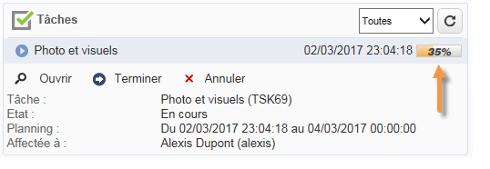

If the task execution schedule end date has been reached but the task is not completed, the task will be **[!UICONTROL Late]**. A warning message will also be displayed to alert operators.

Pour plus d’informations, reportez-vous à l’état [de progression d’une tâche](#progress-status-of-a-task).

### Dépenses et revenus {#expenses-and-revenues}

Pour chaque tâche, vous pouvez définir les dépenses liées et les revenus prévisionnels. Ils seront calculés puis consolidés au niveau de l&#39;opération à laquelle est rattachée la tâche.

To specify this information, click the **[!UICONTROL Expenses and revenue]** icon in the task toolbar.

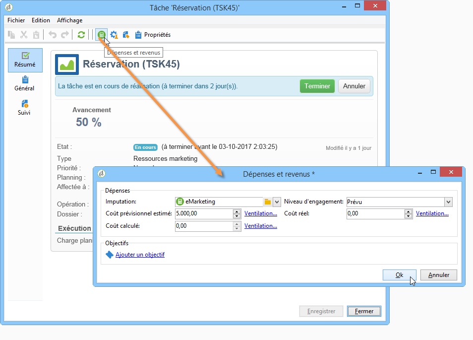

Par défaut, le budget imputé est celui de l&#39;opération à laquelle est rattachée la tâche. Il est affiché dans le détail de la tâche.

>[!NOTE]
>
>Pour plus d&#39;informations sur les dépenses et les budgets, consultez la section Engagement [des coûts, calcul et imputation](../../campaign/using/controlling-costs.md#cost-commitment--calculation-and-charging).

Vous pouvez également définir à partir de cette fenêtre les objectifs à réaliser. Les objectifs correspondent aux revenus prévisionnels de la tâche.

### Prestataires {#service-providers}

Un prestataire externe peut être impliqué dans la gestion de la tâche.

Pour cela, éditez les propriétés de la tâche et sélectionnez le prestataire concerné. Les postes de coûts associés au prestataire sont automatiquement listés dans la section centrale de la fenêtre.

Pour plus d’informations, reportez-vous à la section [Création d’un fournisseur de services et de ses catégories](../../campaign/using/providers--stocks-and-budgets.md#creating-a-service-provider-and-its-cost-categories)de coûts.

Sélectionnez les postes de coûts afférents à la réalisation de la tâche. Pour cela, choisissez le type de coût et ajoutez éventuellement un montant à surcharger.

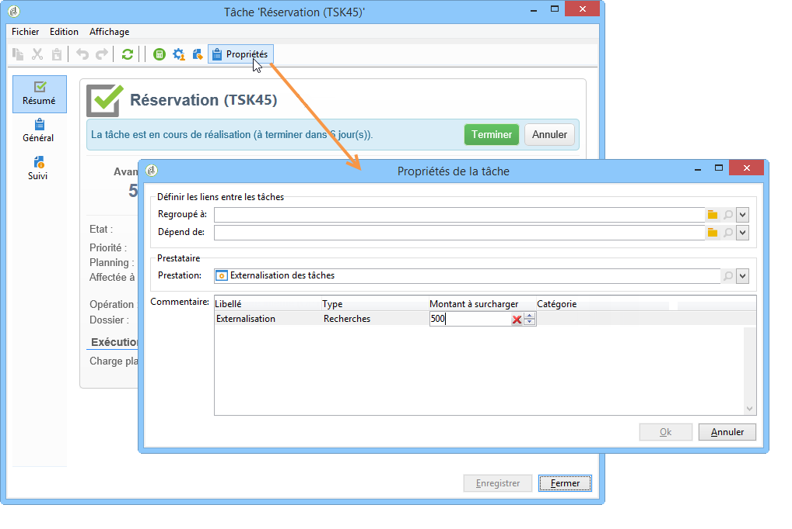

>[!NOTE]
>
>The method for managing budgets and costs is presented in [Controlling costs](../../campaign/using/controlling-costs.md).

Lorsqu&#39;un prestataire est sélectionné, il est affiché dans le tableau de bord de la tâche :

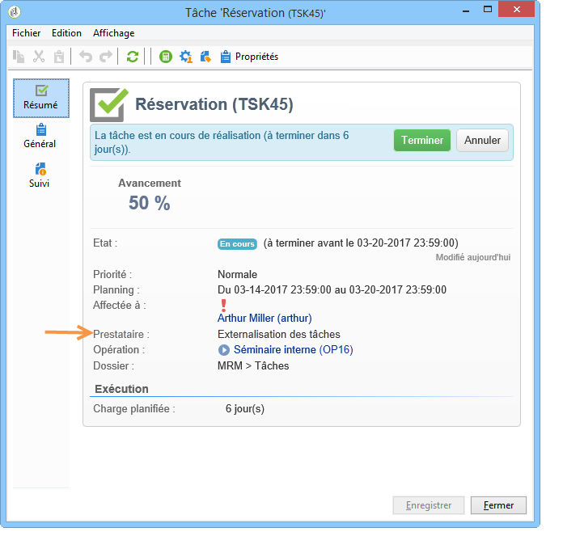

### Tâches en retard {#late-tasks}

Une tâche est en retard si elle a atteint sa date de fin sans que son état ne change **[!UICONTROL Finished]**. Par défaut, aucun opérateur n’est averti lorsqu’une tâche est en retard. Vous pouvez configurer la remise d’un courrier électronique de notification : tous les opérateurs peuvent être avertis même s’ils ne sont pas impliqués dans la tâche.

Accédez à la **[!UICONTROL Resources]** zone et ajoutez l’opérateur au **[!UICONTROL Assignation]** champ. Pour avertir plusieurs personnes, sélectionnez un groupe d’opérateurs.

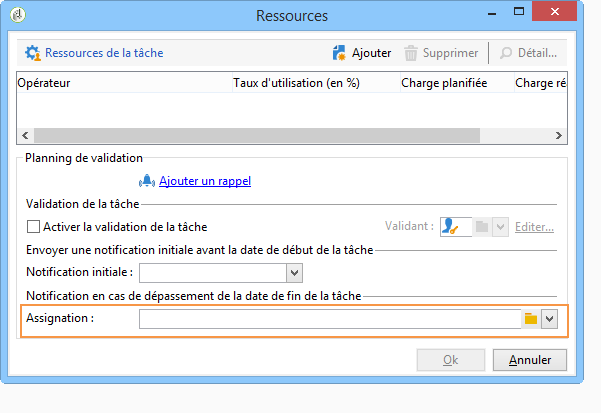

### Notifications initiales {#initial-notifications}

Lorsque vous créez ou modifiez une tâche dont la date de début se situe dans le futur, Adobe Campaign vous propose d&#39;envoyer un email au responsable de la tâche pour lui signaler le début de celle-ci.

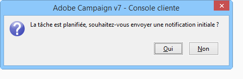

Cependant, si la tâche que vous êtes en train de créer est éloignée dans le temps, il peut être préférable de programmer l&#39;envoi de l&#39;email de notification un peu avant le début de la tâche. Par exemple, si la tâche ne commence que dans 1 mois, vous pouvez faire en sorte que le responsable de la tâche soit notifié une semaine avant le début de celle-ci.

To schedule a notification, go to the **[!UICONTROL Resources]** box and use the **[!UICONTROL Initial notification]** field.

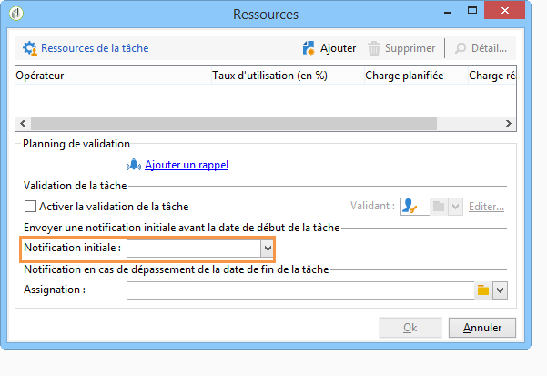

* Pour les tâches dans les opérations, choisissez une date et une heure précises.
* For tasks within campaign templates, the notification time is expressed as the time remaining before the task starts (for instance, if you enter 2d in the **[!UICONTROL Initial notification]** field, the email will be sent 2 days before the task start date).

Si vous avez programmé une notification, lorsque vous enregistrez la tâche, Adobe Campaign vous proposera quand même d&#39;envoyer une notification immédiatement. Si vous choisissez de l&#39;envoyer, celle-ci ne remplacera pas la notification programmée.

### Tâche liée à un programme {#task-linked-to-a-program}

Vous pouvez créer des tâches directement au niveau d&#39;un programme pour gérer les actions qui relèvent de l&#39;organisation globale de celui-ci et non d&#39;une opération particulière (par exemple, une réunion pour discuter du thème des prochaines opérations au sein du programme). La tâche apparaîtra dans le planning du programme.

Pour créer une tâche directement rattachée à un programme :

1. Open the program schedule: on the home page, go to **[!UICONTROL Campaigns > Browse > Other choices > Programs]**. The overall program schedule opens in the right-hand section of the window.
1. Dans le planning, cliquez sur le programme désiré : une fenêtre décrivant le programme apparaît.
1. In this window, click **[!UICONTROL Open]**. The program schedule opens.
1. Cliquez sur le **[!UICONTROL Add]** bouton au-dessus de la planification sur la droite, puis cliquez sur **[!UICONTROL Add a task]**.

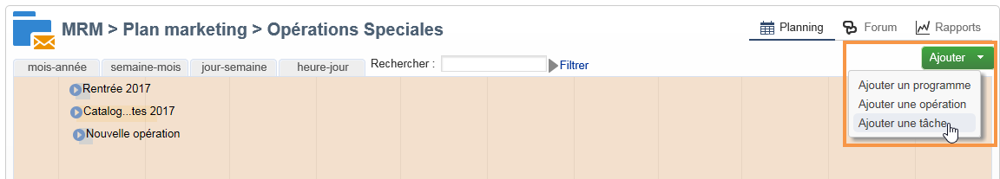

### Disponibilité des opérateurs {#operator-availability}

Dans le tableau de bord de la tâche, une icône en regard du nom de l’opérateur indique qu’il travaille déjà sur une autre tâche ou un autre événement pendant la période couverte par la tâche. (Tâche dont l&#39;opérateur est responsable ou impliqué dans: il apparaît dans le **[!UICONTROL Assigned to]** champ ou dans la **[!UICONTROL Resources]** zone de tâche).

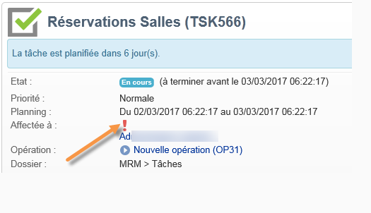

### Tâche dans un workflow {#task-in-a-workflow}

Using a **[!UICONTROL Task]** element in a campaign workflow enables you to define two scenarios depending on whether or not the task is approved.

In the campaign workflows, the **[!UICONTROL Task]** activity is found in the **[!UICONTROL Flow control]** tab.

## Types de tâches {#types-of-task}

Lorsque vous créez des tâches depuis une opération, vous pouvez créer des tâches spécifiques. Le type de tâche est défini dans le modèle sélectionné.

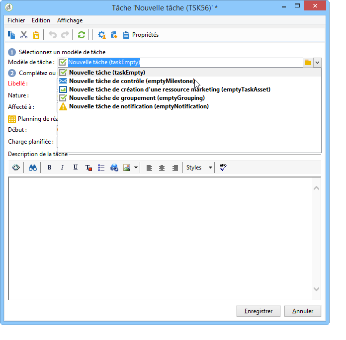

Les tâches suivantes peuvent être planifiées :

* **[!UICONTROL Control task]**, reportez-vous aux tâches [de](#control-tasks)contrôle,
* **[!UICONTROL Marketing resource creation task]**, voir Tâche [de](#grouping-task)regroupement,
* **[!UICONTROL Grouping task]**, voir Tâche [de](#grouping-task)regroupement,
* **[!UICONTROL Notification task]**, reportez-vous à la tâche Notification.

>[!NOTE]
>
>**[!UICONTROL Control task]** et **[!UICONTROL Grouping]** les tâches peuvent être créées **uniquement** via le tableau de bord de la campagne.\
>Ils sont affichés dans la carte des tâches de l’opérateur auquel ils sont affectés. Voir [Accès aux tâches](#accessing-tasks).

### Tâche de contrôle {#control-tasks}

A **[!UICONTROL Control task]** is linked to delivery approval: approval of targeting, content, extraction file, budget or proof.

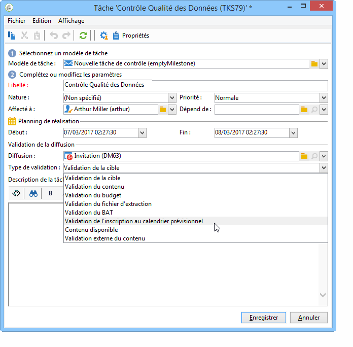

Une fois créée, la tâche est ajoutée dans le tableau de bord de l&#39;opération.

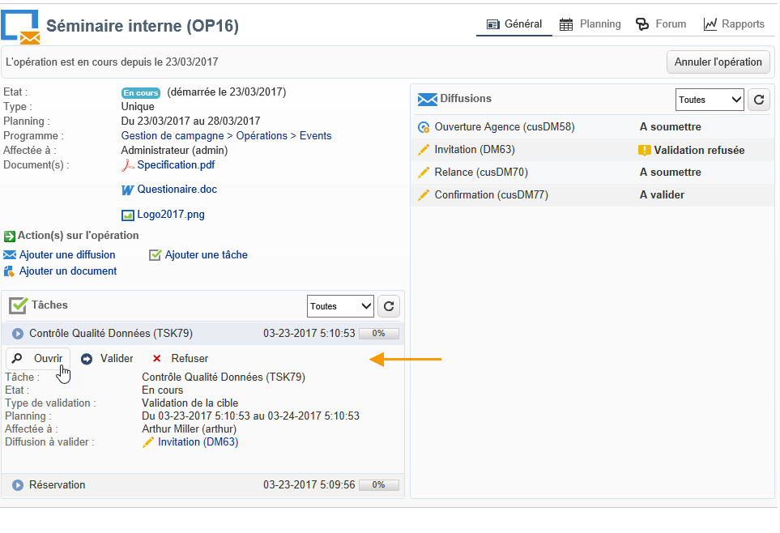

Vous pouvez alors l&#39;éditer et en préciser les paramètres.

### Tâche de création de ressource marketing {#marketing-resource-creation-task}

Une tâche de création de ressource marketing peut être utilisée pour gérer la création et la publication d&#39;une ressource marketing. Si vous gérez une ressource via une tâche et non uniquement via la ressource elle-même, vous pouvez :

* Piloter le processus de création de la ressource à partir d&#39;une opération.
* Visualiser le processus de création de la ressource dans un planning.
* Maîtriser le planning de création de la ressource (rappels, notifications).
* Comptabiliser et contrôler les coûts liés à l&#39;élaboration de la ressource.
* Valider et publier la ressource via la tâche (si l&#39;option correspondante est activée).

#### Interaction entre la tâche et sa ressource associée {#interaction-between-the-task-and-its-linked-resource}

La tâche de création d&#39;une ressource marketing interagit avec la ressource qui lui est associée. Ainsi :

* Le planning d&#39;élaboration de la ressource et les coûts liés à celle-ci sont gérés via la tâche.
* Les opérateurs peuvent travailler normalement sur la ressource (télécharger le fichier vers ou depuis le serveur, verrouiller et déverrouiller la ressource) : cela n&#39;a pas d&#39;incidence sur la tâche.
* L&#39;approbation et la publication des ressources peuvent être effectuées par le biais de la tâche suivante: si l’ **[!UICONTROL Publish the marketing resource]** option est activée, la ressource est approuvée et publiée automatiquement une fois la tâche terminée. Si l’option n’est pas activée, la tâche et la ressource n’interagissent pas : agir sur l&#39;un n&#39;affectera pas l&#39;autre.

   Vous pouvez utiliser une série de tâches liées pour définir un cycle d’approbation complet. Cochez l’ **[!UICONTROL Publish the marketing resource]** option uniquement pour la dernière tâche : toutes les tâches devront être terminées pour que la ressource soit publiée. De plus, lorsque vous créez une tâche de ressource marketing enfant, la ressource est automatiquement sélectionnée dans la tâche enfant.

   * **Via la ressource** : si vous soumettez la ressource à validation ou la validez, ces actions n&#39;auront aucun effet sur la tâche.
   * **Par le biais de la tâche**: si l’ **[!UICONTROL Publish the marketing resource]** option est cochée dans la tâche, la ressource est approuvée et publiée automatiquement une fois la tâche terminée (voir ci-dessus). Si l’option n’est pas cochée, la tâche et la ressource n’interagissent pas : agir sur l&#39;un n&#39;affectera pas l&#39;autre.

#### Paramétrage d&#39;une tâche de création de ressource marketing {#configuring-a-marketing-resource-creation-task}

La personne qui révise la tâche n’est pas nécessaire à la même personne qui révise le contenu défini dans la ressource. Cependant, si l’ **[!UICONTROL Publish the marketing resource]** option est cochée (voir ci-dessous), le réviseur de tâche est autorisé à approuver le contenu de la ressource, car la fin de la tâche approuve automatiquement la ressource (ou, si aucun réviseur n’est défini, le gestionnaire de tâches).

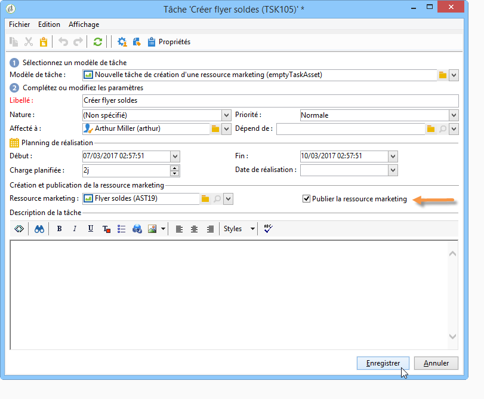

In the **[!UICONTROL Marketing resource]** field, define the resource you want to manage via this task. Vous pouvez ainsi :

* Select an existing resource: the drop-down list offers all resources with the status **[!UICONTROL Being edited]**.
* Création d&#39;une ressource : cliquez sur l’ **[!UICONTROL Select the link]** icône, puis sur l’ **[!UICONTROL Create]** icône.

The **[!UICONTROL Publish the marketing resource]** option lets you automate resource publishing: once the task is **[!UICONTROL Finished]**, the status of the resource automatically switches to **[!UICONTROL Published]**, even if it was neither submitted for approval or approved, including if the reviewer who completes the task isn&#39;t the content reviewer defined in the resource.

Le **[!UICONTROL Publish the resource]** bouton est rendu disponible et le réviseur de publication de ressources reçoit un courrier électronique de notification lui indiquant qu’il est prêt à être publié. Dans l’ **[!UICONTROL Edit > Tracking]** onglet, la révision et la publication par le réviseur de la tâche deviennent visibles. Si un processus de post-traitement de ressource a été défini, il est exécuté maintenant.

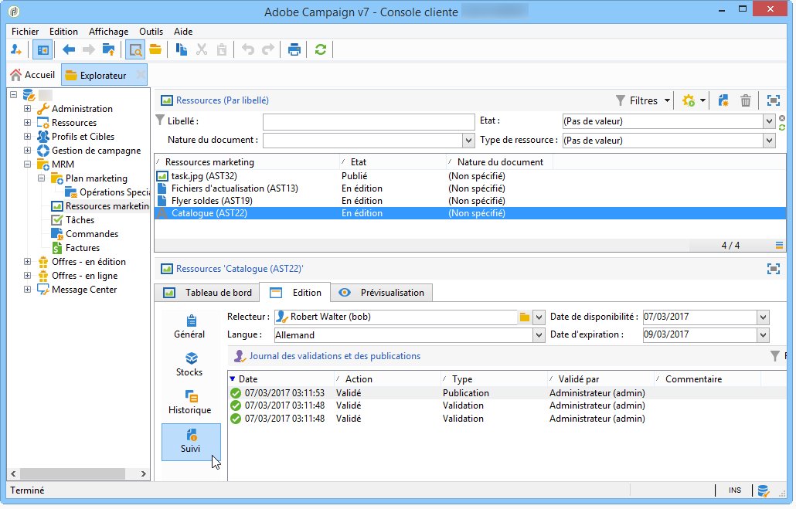

### Tâche de groupement {#grouping-task}

The **[!UICONTROL Grouping task]** type task lets you group several tasks and synchronize the management of their progress and their approval.

Les tâches de groupement n&#39;ont ni dépenses ni ressources associées.

Vous pouvez voir toutes les tâches groupées à une tâche de groupement dans le tableau de bord de celle-ci. Cela vous permet de filtrer la liste des tâches afin de ne voir que les tâches qui vous intéressent.

Les tâches de groupement comprennent un lien permettant de créer rapidement une tâche groupée.

To create a grouped task based on a grouping task, go to the campaign dashboard and click the name of the grouping task to display its description, then click **[!UICONTROL Add a task]**.

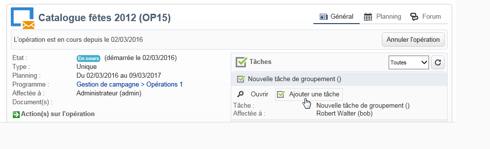

However, if you have already created a task that you want to link to a grouping task, you can do it via the **[!UICONTROL Linked to]** field of the **[!UICONTROL Properties]** box.

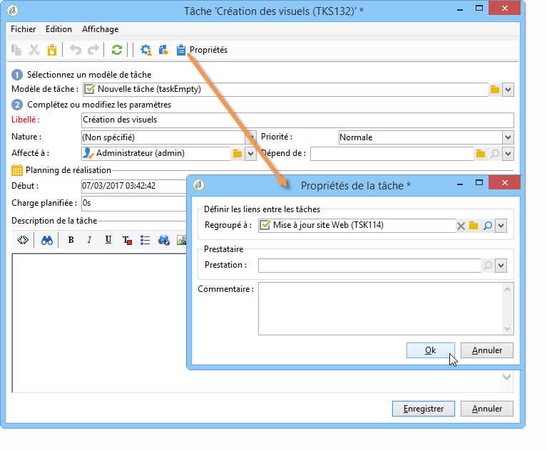

### Tâche de notification {#notification-task}

Les tâches de notification permettent de programmer l&#39;envoi d&#39;emails (à un opérateur, un groupe d&#39;opérateurs, un prestataire, etc.). Vous pouvez ainsi programmer des rappels, par exemple pour alerter une personne qu&#39;une opération finit bientôt, ou bien envoyer des documents avant le début de l&#39;opération pour permettre à des opérateurs de la préparer. Ainsi, vous gardez la trace de ces communications dans votre opération ou votre programme et vous avez une meilleure visibilité sur les actions réalisées.

#### Cycle de vie {#life-cycle}

Les tâches de notification ne font pas l&#39;objet d&#39;une validation. Leur cycle de vie est donc plus simple que celui d&#39;une tâche standard :

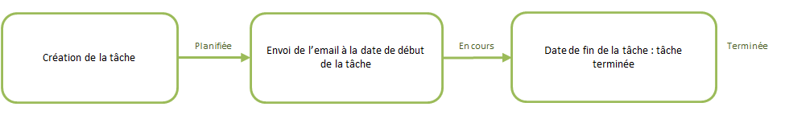

Une tâche de notification peut avoir les états suivants :

* **[!UICONTROL Scheduled]** jusqu’à ce que le courrier électronique ait été envoyé
* **[!UICONTROL In progress]** une fois le courrier électronique envoyé et jusqu’à la date de fin atteinte
* **[!UICONTROL Finished]** une fois la date de fin atteinte.

#### Configuration {#configuration}

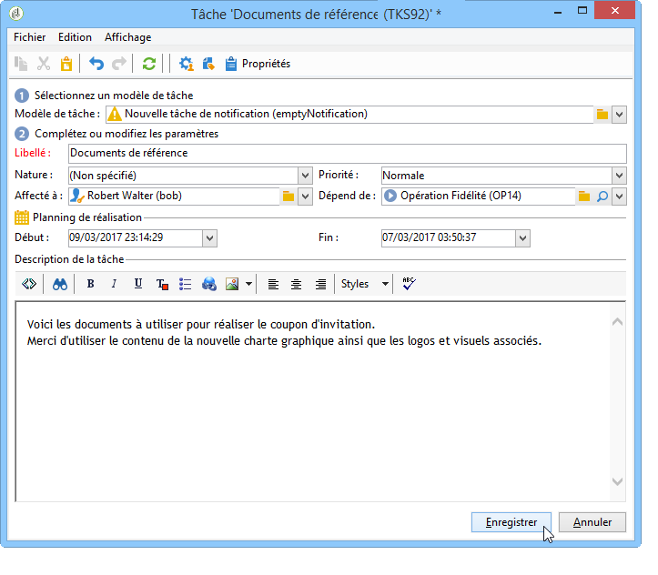

Lors de sa création, les éléments suivants doivent être renseignés dans la tâche :

* **[!UICONTROL Assigned to]** : l’opérateur ou le groupe d’opérateurs qui recevra le courrier électronique. Si vous réaffectez la tâche une fois que le courrier électronique a été envoyé, il ne sera pas envoyé au nouvel opérateur (pour ce faire, vous devez réinitialiser la tâche et modifier sa date de début).
* **Date de début de la tâche** : date à laquelle l&#39;email de notification sera envoyé. Cette date doit impérativement être située dans le futur par rapport au moment où vous enregistrez la tâche.
* **Date** de fin de la tâche : date à laquelle le statut de la tâche devient **[!UICONTROL Finished]**. Par défaut, la date de fin est identique à la date de début. Cependant, l’attribution d’une durée à la tâche vous permet de symboliser la durée pendant laquelle l’opérateur doit agir dans la planification, si nécessaire.
* **[!UICONTROL Description]** : le texte entré ici apparaîtra dans le corps de l&#39;email de notification.

   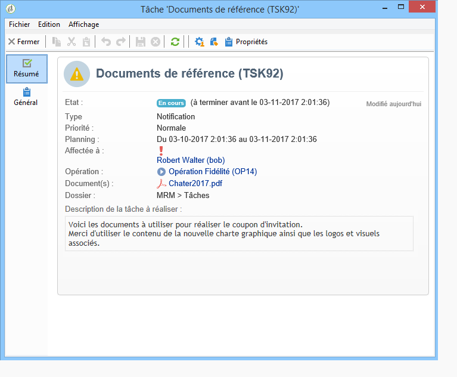

Vous pouvez ajouter une pièce jointe à la tâche et au courrier électronique de notification. Pour ce faire, cliquez sur l’ **[!UICONTROL Documents]** icône de la barre d’outils dans le coin supérieur droit.

## Cycle de vie {#life-cycle-1}

### Liens entre les tâches {#links-between-tasks}

Le **[!UICONTROL Properties]** bouton de chaque tâche vous permet de définir les liens entre les tâches d’une campagne. Vous pouvez fractionner des tâches en sous-tâches à l’aide d’une tâche de regroupement (voir Tâches [liées) ou définir des dépendances entre les tâches (voir](#linked-tasks)Regroupement de tâches ).

#### Tâches liées {#linked-tasks}

Use the **[!UICONTROL Linked task]** field to associate tasks with a grouping task. Voir [Types de tâche](#types-of-task).

Dans l&#39;exemple suivant, la validation des ciblages est découpée en quatre sous-tâches.

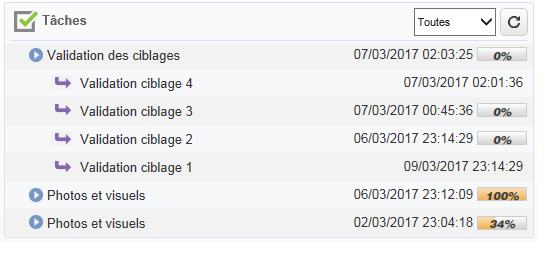

Chaque sous-tâche est une tâche standard, liée à la tâche principale.

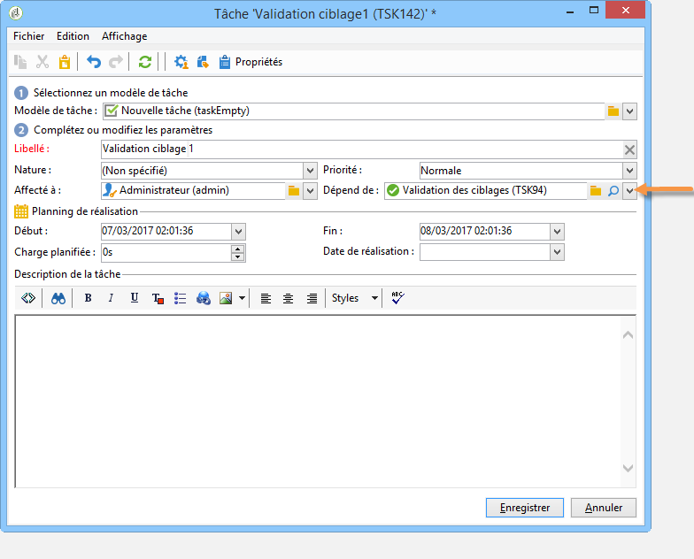

#### Tâches de groupement {#grouping-tasks}

Use the **[!UICONTROL Grouped to]** field to make the execution of a task depend on the execution of another task.

La dépendance entre les tâches est matérialisée par des flèches dans le tableau de bord de l&#39;opération.

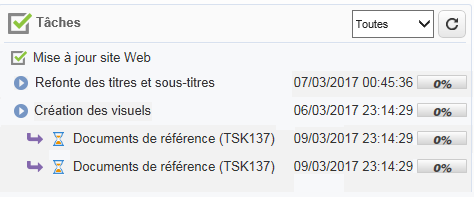

Dans le cas de tâches groupées, Adobe Campaign attribue automatiquement la date de fin de la tâche parent à la tâche enfant comme date de début. Par exemple, si une tâche **Créer une invitation** se termine le 15 octobre à 15h30, la tâche enfant Envoyer un courrier électronique **** d’invitation démarre le 15 octobre à 15h30.

En outre, si vous remettez la fin d’une tâche parent, certaines de ses tâches enfants peuvent être affectées : il s’agit des tâches enfants dont l’état est **[!UICONTROL Scheduled]** et dont la date de début est antérieure à la nouvelle date de fin de la tâche parent. La durée de la tâche reste la même. Si la date de début d’une tâche enfant est postérieure à la nouvelle date de fin de la tâche parent, la tâche enfant n’est pas affectée.

**Exemple**

Une tâche mère planifiée pour finir le mardi 9 octobre à 17h a 2 tâches filles, la tâche A et la tâche B. La tâche A est planifiée pour commencer le 10 octobre à 14h et la tâche B, planifiée pour commencer le 12 octobre à 8h.

On décale la tâche mère : elle finit maintenant le 11 octobre à 13h. Seule la tâche A est décalée pour commencer le 11 octobre à 13h.

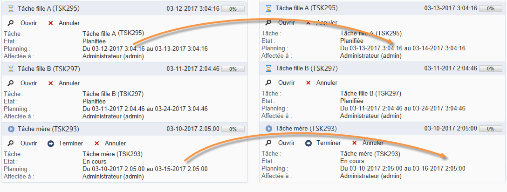

### Etat d&#39;exécution d&#39;une tâche {#execution-status-of-a-task}

Les statuts des tâches sont visualisables dans la vue d&#39;ensemble des tâches. Le statut de réalisation d&#39;une tâche est mis à jour automatiquement en fonction des actions des opérateurs.

Une tâche peut être : **[!UICONTROL Scheduled]**, **[!UICONTROL In progress]**, **[!UICONTROL Finished]**, **[!UICONTROL Canceled]**, **[!UICONTROL Pending approval]** ou **[!UICONTROL Rejected]**.

* Lorsqu’une tâche est créée, c’est **[!UICONTROL Scheduled]** si sa date de début est ultérieure. Il conserve ce statut jusqu’à ce que la date de début soit atteinte.
* Once it has been started, the task is **[!UICONTROL In progress]**. When the person in charge of the task closes it, it changes to **[!UICONTROL Finished]**.
* Si un réviseur a été défini, la tâche sera effectuée **[!UICONTROL Pending approval]** une fois que la personne en charge la fermera et jusqu’à ce que le réviseur l’approuve. Si le réviseur le rejette, la tâche sera **[!UICONTROL Rejected]**.
* A task can be canceled by the person responsible for it via the dashboard or the **[!UICONTROL Task map]** by clicking the **[!UICONTROL Cancel]** button.
* Pour planifier une tâche, entrez une date de début dans le futur. Vous pouvez ensuite envoyer une première notification aux opérateurs Adobe Campaign impliqués dans l’exécution de la tâche. See [Complete task life cycle](#complete-task-life-cycle).

>[!NOTE]
>
>* Le statut de la tâche est mis à jour automatiquement.
>* Même si la période de validité est terminée, une tâche qui n&#39;a pas été close par son responsable apparaît toujours dans les tâches en cours. Un message d&#39;avertissement est affiché pour alerter les opérateurs que la tâche est en retard.
>

### Etat d&#39;avancement d&#39;une tâche {#progress-status-of-a-task}

Outre son état d’exécution, une tâche peut être associée à un état de progression : **[!UICONTROL Late]**, **[!UICONTROL To approve]**, **[!UICONTROL To do today]** ou **[!UICONTROL To do this week]**. Ces informations sont saisies automatiquement selon le calendrier de la tâche.

Vous pouvez filtrer la liste des tâches par Statut de réalisation de la tâche ou Etat d&#39;avancement de la tâche.

For more on this, refer to [Accessing tasks](#accessing-tasks).

### Cycle de vie complet d&#39;une tâche {#complete-task-life-cycle}

Voici les différentes étapes du cycle de vie complet d&#39;une tâche pour laquelle le responsable a défini des intervenants et des validants.

1. Le responsable crée la tâche et entre les différents champs. For more on this, refer to [Creating a new task](#creating-a-new-task).

   Lors de la création, et à chaque modification d&#39;une tâche **planifiée dans le futur** (tant que la date de début de la tâche n&#39;a pas été atteinte), vous avez la possibilité d&#39;envoyer un email de notification aux intervenants ainsi qu&#39;au responsable, les informant qu&#39;une nouvelle tâche a été planifiée.

   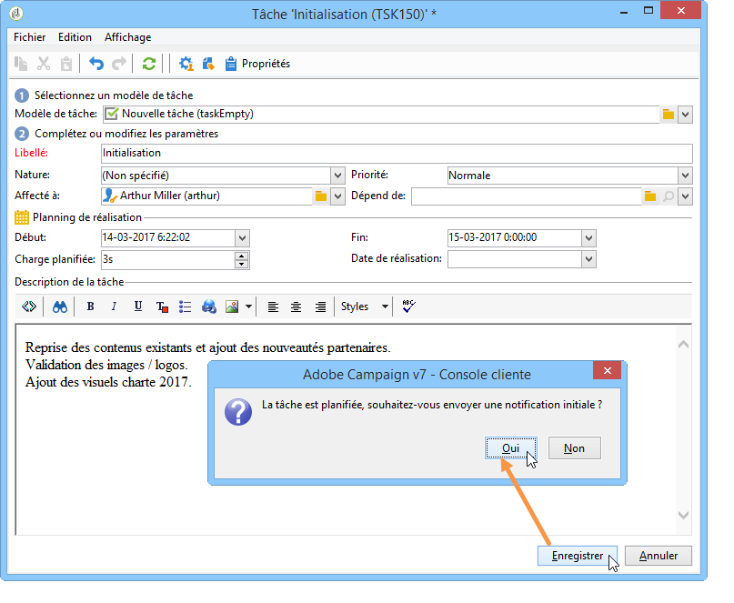

   To send this first notification, click **[!UICONTROL Yes]**. This notification tells them about the next task and includes details on content and the number of days remaining until its deadline.

   When a task is created and scheduled for the future, its status is **[!UICONTROL Scheduled]**.

1. On the task start date, the person responsible and the participants receive a notification telling them that the task is started. Its status changes to **[!UICONTROL In progress]**.
1. Lorsqu&#39;un intervenant a terminé la partie qui lui a été assignée, il valide la tâche, au choix :

   * à partir de l&#39;email de notification.
   * à partir de la console ou de l&#39;interface web, au niveau du tableau de bord de la tâche.

      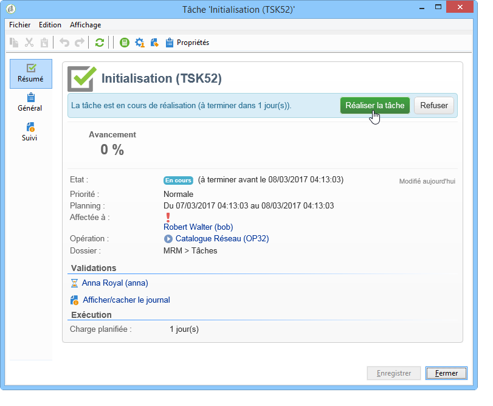

1. A chaque validation d&#39;un intervenant, l&#39;état d&#39;avancement de la tâche est automatiquement mis à jour.

   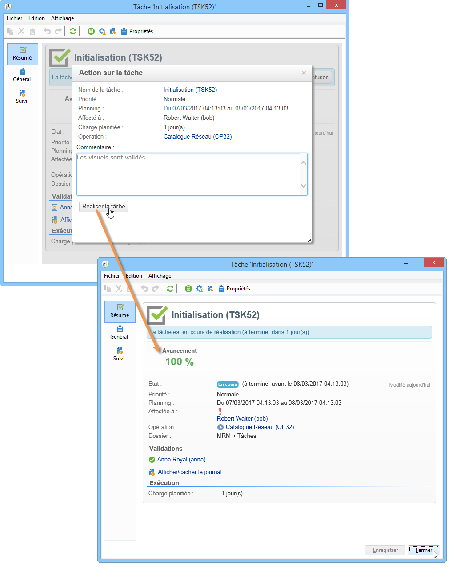

1. Le responsable reçoit un email de notification l&#39;informant que l&#39;intervenant a terminé la partie qui lui a été assignée.

   Il peut suivre l&#39;avancement dans le tableau de bord de la tâche.

   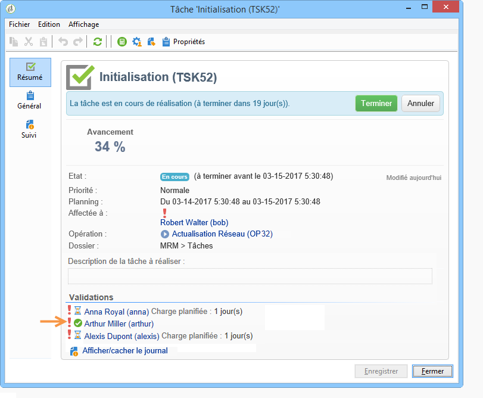

1. Lorsqu&#39;il estime que la tâche est terminée, le responsable peut alors la clore, à partir de l&#39;email de notification envoyé à la date de début de la tâche, depuis la console ou l&#39;interface web.

   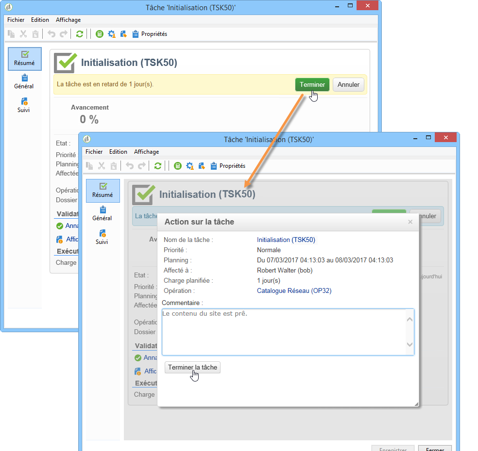

   >[!NOTE]
   >
   >Le responsable peut clore la tâche à tout moment, même si les intervenants n&#39;ont pas tous validé leur partie. L&#39;état d&#39;avancement passe alors automatiquement à 100%.

1. The task status changes to **[!UICONTROL To approve]**, and a notification is sent to the reviewer.

   Ce dernier valide la tâche à partir de l&#39;email de notification, depuis la console ou l&#39;interface web.

   Il peut agir depuis le tableau de bord de l&#39;opération :

   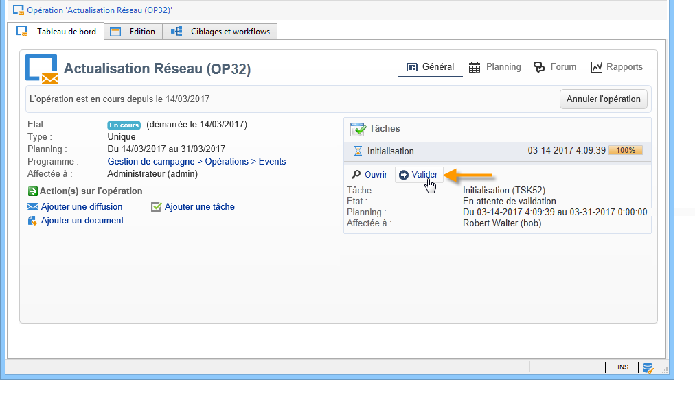

   Il peut également utiliser le bouton de validation de la tâche :

   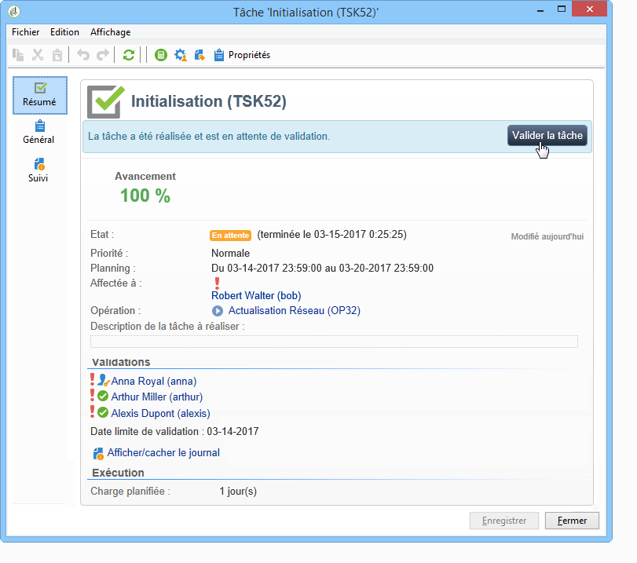

   >[!NOTE]
   >
   >The task status will only change to **[!UICONTROL To approve]** if you have enabled the **[!UICONTROL Enable task validation]** option in the **[!UICONTROL Resources]** window of the task.\
   >If the reviewer rejects the task, its status changes to **[!UICONTROL Rejected]**, and the task life cycle starts again automatically.

1. The task status changes to **[!UICONTROL Finished]**. A notification is sent to everyone involved.

   >[!NOTE]
   >
   >Une fois une tâche terminée, son cycle de vie peut être réinitialisé par la personne qui en est responsable. Pour ce faire, ouvrez la tâche et cliquez sur le **[!UICONTROL Reset task to execute it again...]** lien au bas du tableau de bord.

