# Création d&#39;hypothèses{#creating-hypotheses}

Il existe différentes possibilités pour créer/associer des hypothèses à une offre ou a une diffusion d&#39;une opération :

* Via the **[!UICONTROL Measurement hypotheses]** folder by creating a new hypothesis based on an existing template and linking it to an existing delivery.
* Dans une campagne, cliquez sur l’onglet **[!UICONTROL Edit]** > **[!UICONTROL Measurement]** .
* Via the **[!UICONTROL Measurement]** option of a delivery created from a campaign.

Les hypothèses ne peuvent être calculées qu’une fois que la campagne marketing a été lancée et que les destinataires ont reçu la diffusion. Si l&#39;hypothèse est basée sur une proposition d&#39;offre, celle-ci doit au moins être présentée et être active. Les hypothèses d’offre et de diffusion sont créées via le **[!UICONTROL Measurement hypotheses]** dossier et reposent sur un modèle d’hypothèse. Il est toutefois possible de référencer une hypothèse directement dans la diffusion ou la campagne avant le début de la campagne. Dans ce cas, les hypothèses sont calculées automatiquement une fois la campagne marketing lancée, en fonction des paramètres d’exécution (pour plus d’informations, reportez-vous aux paramètres [d’exécution des modèles d’](../../campaign/using/hypothesis-templates.md#hypothesis-template-execution-settings)hypothèse).

## Créer une hypothèse à la volée sur une diffusion {#creating-a-hypothesis-on-the-fly-on-a-delivery}

Pour créer une hypothèse sur une diffusion existante, procédez comme suit :

>[!NOTE]
>
>Cette opération est uniquement possible pour les diffusions en édition.

1. Dans l’arborescence d’Adobe Campaign, accédez à **[!UICONTROL Campaign management > Measurement hypotheses]**.
1. Click the **[!UICONTROL New]** button or right-click on the list of hypotheses and select **[!UICONTROL New]** in the drop-down list.

   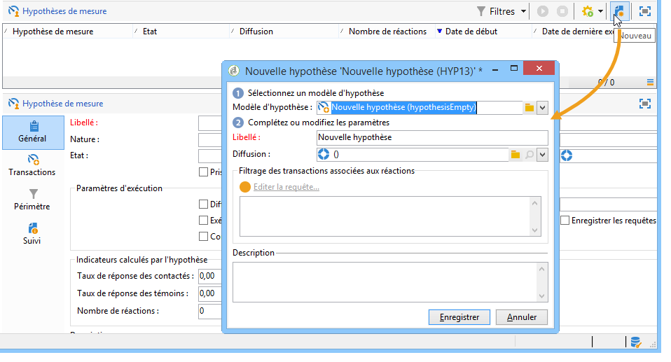

1. In the hypothesis window, select a previously created template (refer to [Hypothesis templates](../../campaign/using/hypothesis-templates.md)).

   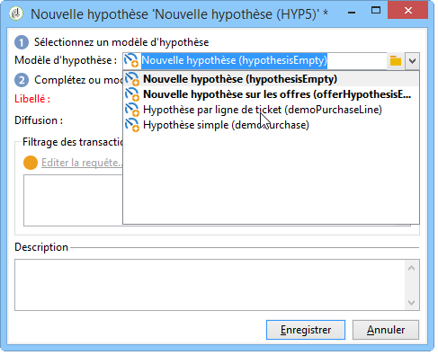

   Le contexte d&#39;hypothèse tel qu&#39;il a été défini dans le modèle sélectionné s&#39;affiche dans la fenêtre.

   >[!NOTE]
   >
   >Les paramètres définis dans le modèle et non visibles à cette étape sont également gardés en mémoire et réaffectés à l&#39;hypothèse en cours.

   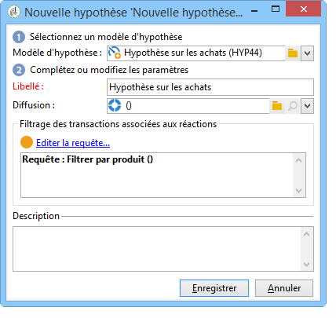

1. Sélectionnez la diffusion sur laquelle vous souhaitez faire une hypothèse.

   

1. Vous pouvez personnaliser votre hypothèse en modifiant les onglets **[!UICONTROL General]**, **[!UICONTROL Transactions]** et **[!UICONTROL Scope]** . Pour plus d&#39;informations, reportez-vous à [Création d&#39;un modèle](../../campaign/using/hypothesis-templates.md#creating-a-hypothesis-model)d&#39;hypothèse.
1. Start the hypothesis by clicking **[!UICONTROL Start]**.

   Un workflow est alors automatiquement créé afin de procéder au calcul. Son nom est défini automatiquement en fonction du paramétrage de l&#39;hypothèse.

   >[!CAUTION]
   >
   >You can access this if you have checked the **[!UICONTROL Keep execution workflow]** box.\
   >Cette option ne doit être activée qu&#39;à des fins de débogage, en cas d&#39;erreur lors de l&#39;exécution de l&#39;hypothèse. Les processus générés automatiquement sont enregistrés dans le dossier **[!UICONTROL Administration]** > **[!UICONTROL Production]** > **[!UICONTROL Objects created automatically]** > **[!UICONTROL Campaign workflows]** de l’explorateur Adobe Campaign.
   > 
   >De plus, les workflows générés automatiquement ne doivent pas être modifiés. Toute modification éventuelle ne serait par ailleurs pas prise en compte pour les calculs ultérieurs.
   >
   >Si vous avez coché cette option, supprimez le workflow après son exécution.

   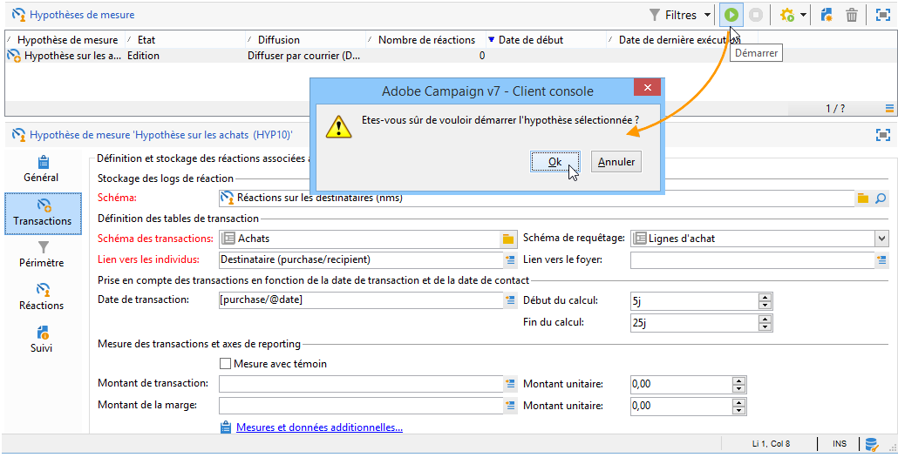

   Lorsque le calcul est terminé, les indicateurs de mesure sont automatiquement mis à jour.

   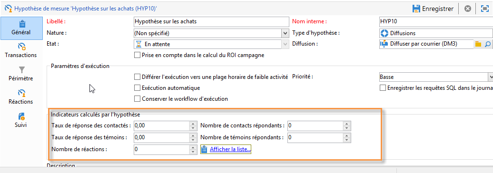

1. Si besoin est, modifiez les paramètres et relancez l&#39;hypothèse.

## Référencer une hypothèse dans une diffusion d&#39;une campagne {#referencing-a-hypothesis-in-a-campaign-delivery}

Vous pouvez référencer une hypothèse dans une campagne marketing avant qu&#39;elle ne soit démarrée. Dans ce cas, l&#39;hypothèse sera lancée automatiquement après l&#39;envoi de la diffusion, selon les paramètres d&#39;exécution définis dans le modèle d&#39;hypothèse. Procédez comme suit pour créer une hypothèse dans une diffusion :

1. Depending on your needs, you can create one or more **[!UICONTROL Delivery]** type templates, as described in [Creating a hypothesis model](../../campaign/using/hypothesis-templates.md#creating-a-hypothesis-model)
1. Créez votre opération marketing et vos workflows de ciblage.
1. In the delivery window, click the **[!UICONTROL Delivery measurement]** icon.
1. Sélectionnez le modèle d&#39;hypothèse (la requête paramétrée dans le modèle apparaît dans la fenêtre de l&#39;hypothèse).

   The hypothesis will be calculated automatically once the campaign is finished, based on the dates configured in the model (refer to [Hypothesis template execution settings](../../campaign/using/hypothesis-templates.md#hypothesis-template-execution-settings)).

   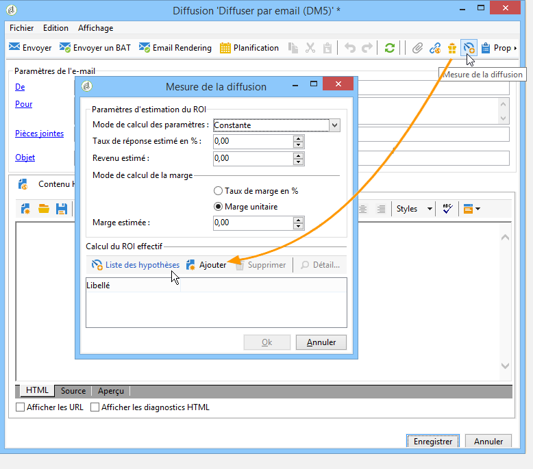

## Ajouter une hypothèse par défaut aux diffusions d&#39;une opération {#adding-a-default-hypothesis-to-deliveries-for-a-campaign}

Vous pouvez directement référencer une hypothèse au niveau d&#39;une opération. De ce fait, l&#39;hypothèse sera automatiquement rattachée à toutes les diffusions crées dans l&#39;opération. Pour cela :

1. Go to the **[!UICONTROL Edit]** tab of the campaign.
1. In the measurement section, click the **[!UICONTROL Default hypotheses]** tab.

   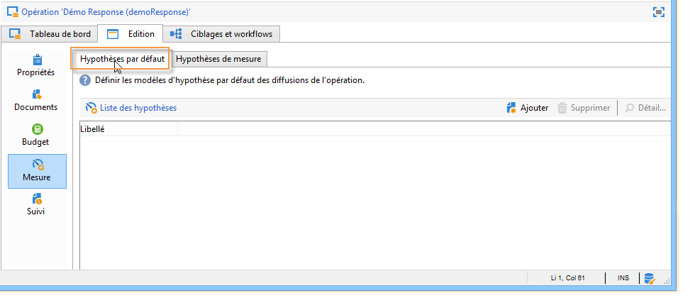

1. Click **[!UICONTROL Add]** and select a hypothesis template.

   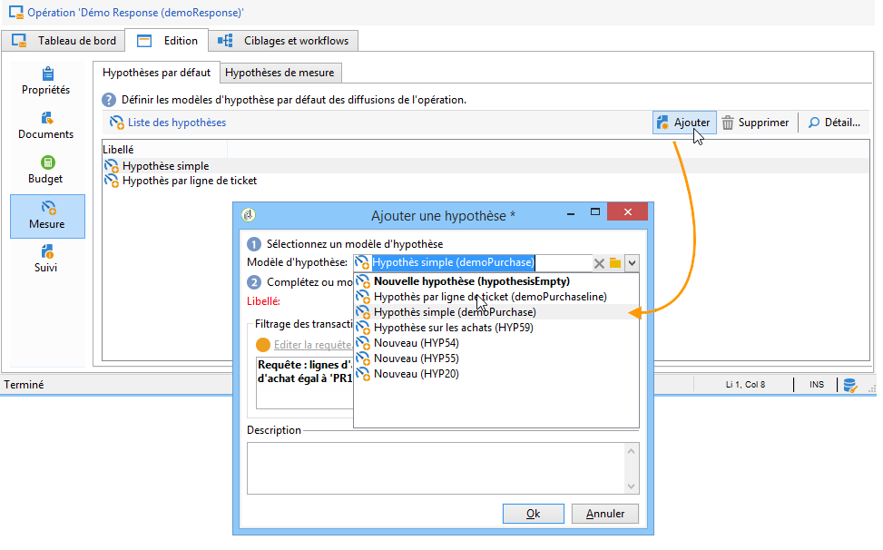

   Une hypothèse basée sur ce modèle sera désormais référencée par défaut dans chaque nouvelle diffusion de l&#39;opération.

   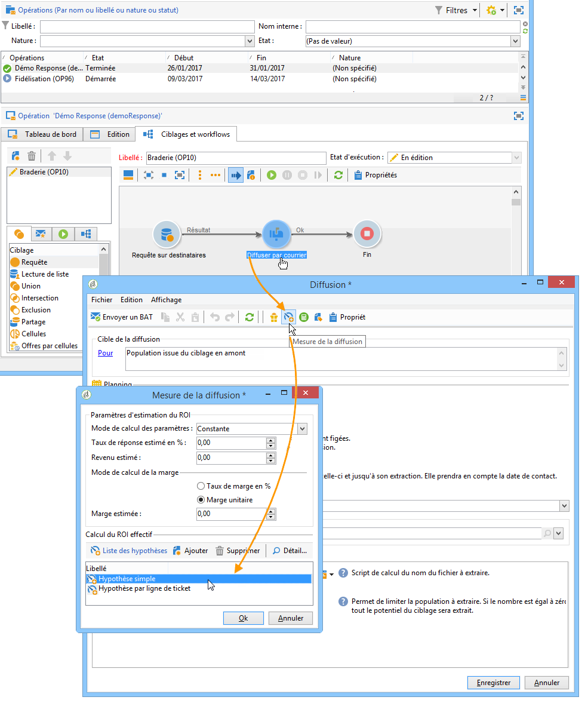

The hypothesis results can be viewed in the **[!UICONTROL General]** and **[!UICONTROL Reactions]** tabs of the hypothesis (refer to [Hypothesis tracking](../../campaign/using/hypothesis-tracking.md))

Pour plus d’informations, reportez-vous également à [Exemple : création d’une hypothèse liée à une livraison](#example--creating-a-hypothesis-linked-to-a-delivery).

## Créer une hypothèse sur une offre {#creating-a-hypothesis-on-an-offer}

La création d’une hypothèse sur une proposition d’offre est similaire à la création d’une hypothèse de livraison à la volée. L’hypothèse peut être exécutée tant que l’offre est active. La période de calcul est basée sur la date de proposition d’offre. Lorsque l’hypothèse vous permet de lier un destinataire à un achat, le statut de la proposition d’offre susceptible d’être acceptée peut être modifié automatiquement (pour plus d’informations, reportez-vous à [Transactions](../../campaign/using/hypothesis-templates.md#transactions)).

1. Créez un ou plusieurs modèles de **[!UICONTROL Offer]** type comme décrit dans [Création d&#39;un modèle](../../campaign/using/hypothesis-templates.md#creating-a-hypothesis-model)d&#39;hypothèse.
1. Accédez au **[!UICONTROL Campaign management > Measurement hypotheses]** noeud.
1. Create an **[!UICONTROL Offers]** type hypothesis by selecting the model created previously.

   

   La requête créée dans le modèle apparaît dans la fenêtre.

   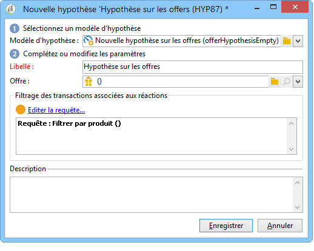

1. Sélectionnez l&#39;offre sur laquelle vous souhaitez faire une hypothèse.

   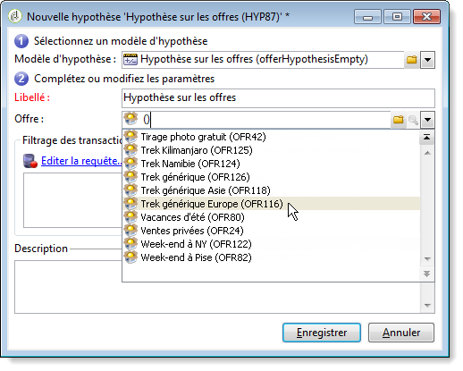

1. Affinez la requête si besoin est.
1. Click **[!UICONTROL Start]** to run the hypothesis.
1. Les résultats de l&#39;hypothèse peuvent être affichés dans ses **[!UICONTROL General]** onglets et dans ses **[!UICONTROL Reactions]** onglets (voir le suivi [des](../../campaign/using/hypothesis-tracking.md)hypothèses).

   Hypotheses made on an offer are referenced in the **[!UICONTROL Measurement]** tab.

   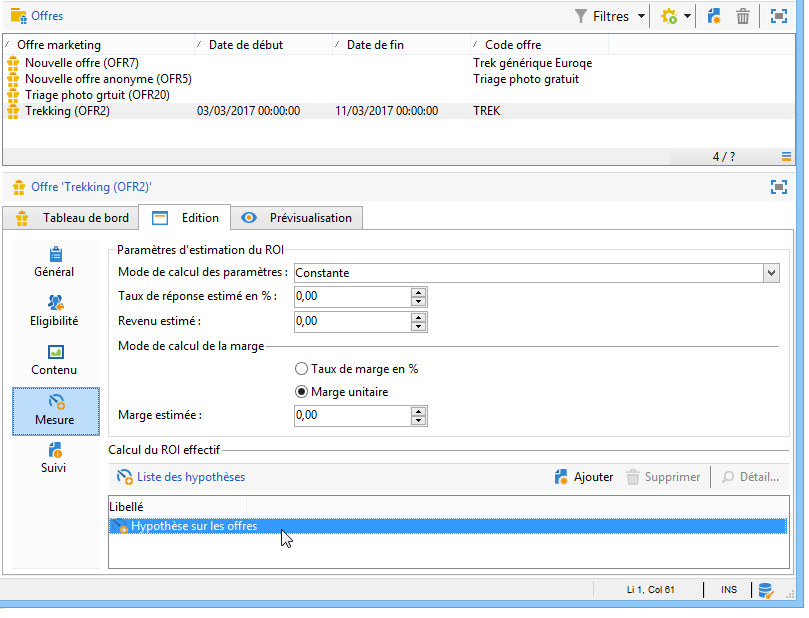

   If the **[!UICONTROL Update offer proposition status]** option was enabled in the hypothesis template, the status of the offer proposition is changed automatically, thereby providing feedback on the impact of the campaign (for more on this, refer to [Transactions](../../campaign/using/hypothesis-templates.md#transactions)).

## Exemple de création d&#39;une hypothèse rattachée à une diffusion {#example--creating-a-hypothesis-linked-to-a-delivery}

Dans cet exemple, nous voulons créer une hypothèse liée à une livraison. Cette hypothèse sera basée sur le modèle créé précédemment (voir [Exemple : création d’un modèle d’hypothèse sur une diffusion](../../campaign/using/hypothesis-templates.md#example--creating-a-hypothesis-template-on-a-delivery)). Nous affinerons ensuite la requête héritée du modèle pour émettre une hypothèse sur un article spécifique de la table d&#39;achat.

1. Create a campaign and a delivery (For more on this, refer to [Creating a campaign](../../campaign/using/setting-up-marketing-campaigns.md#creating-a-campaign)).

   Dans notre exemple, la diffusion est de type courrier.

1. Paramétrez une adresse témoin. En effet, le modèle d&#39;hypothèse créé précédemment a été paramétré pour tenir compte d&#39;une population témoin dans les résultats de la réaction.

   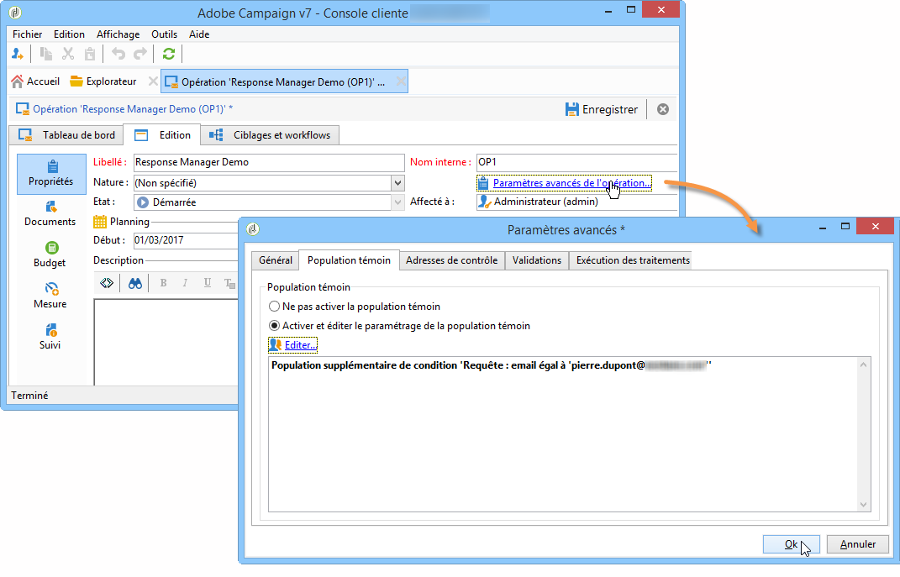

   >[!NOTE]
   >
   >Pour plus d&#39;informations, consultez [Définition d&#39;un groupe](../../campaign/using/marketing-campaign-deliveries.md#defining-a-control-group)de contrôle.

1. Ouvrez le **[!UICONTROL Direct mail delivery]** formulaire, cliquez sur l’ **[!UICONTROL Delivery measurement]** icône, puis sur **[!UICONTROL Add]**.

   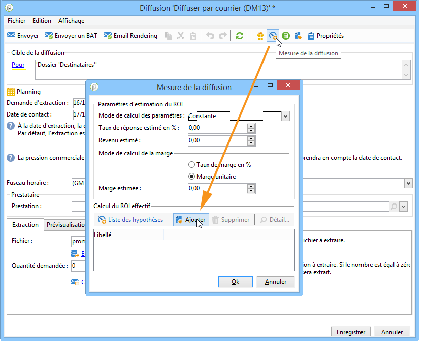

1. Choisissez le modèle d&#39;hypothèse créé précédemment à l&#39;aide de la liste déroulante.

   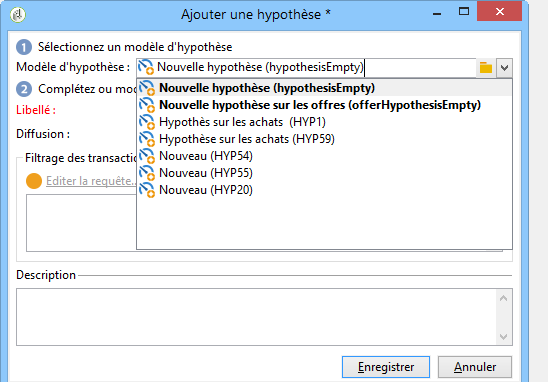

   La requête créée dans le modèle s&#39;affiche.

   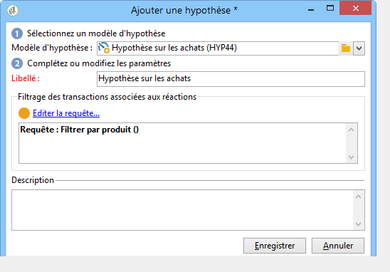

1. Click **[!UICONTROL Edit query...]** and refine the query by entering the product that the hypothesis will concern.

   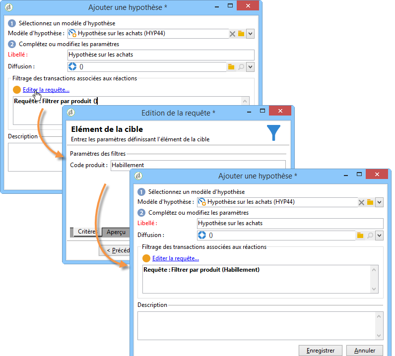

   You can check that the hypothesis is linked to the delivery in the **[!UICONTROL Edit]** > **[!UICONTROL Measurement]** tab of the campaign.

   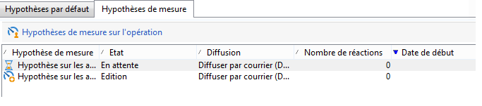

1. Launch your targeting workflow and run the necessary checks until the campaign is finished (for more on this, refer to [Starting a delivery](../../campaign/using/marketing-campaign-deliveries.md#starting-a-delivery)).

   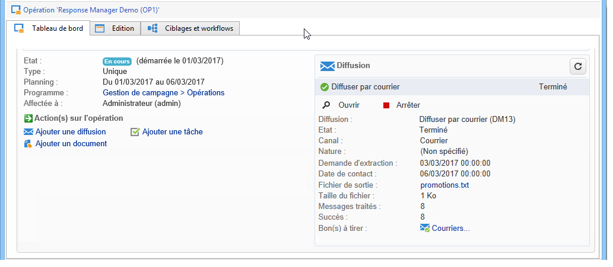

1. In the Adobe Campaign tree, go to the **[!UICONTROL Campaign management > Measurement hypotheses]** node to check the indicators calculated by the hypothesis.

   

