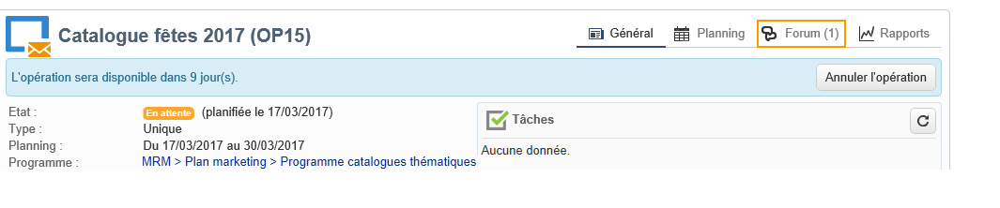
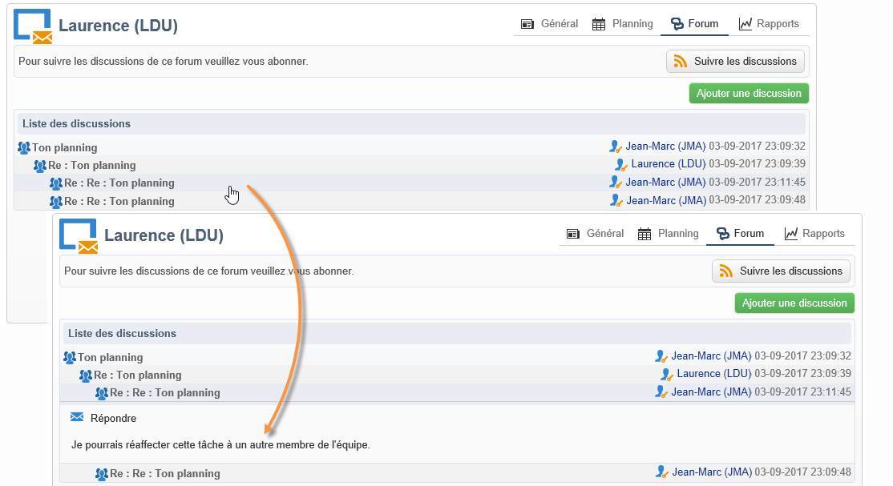
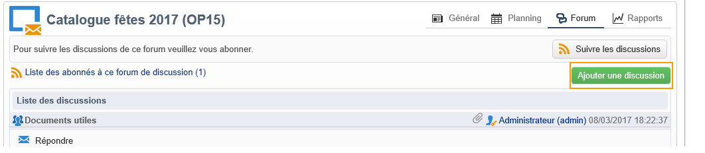
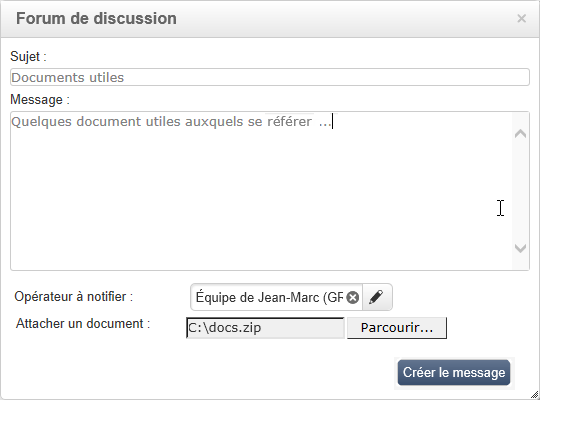
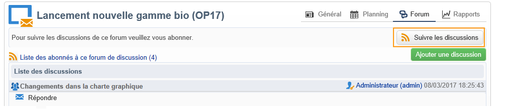
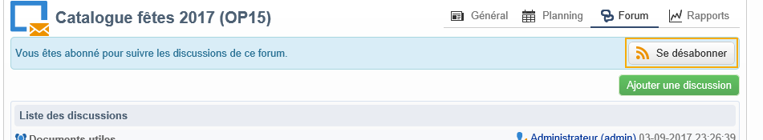
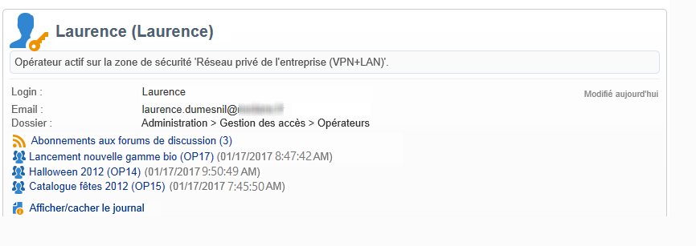
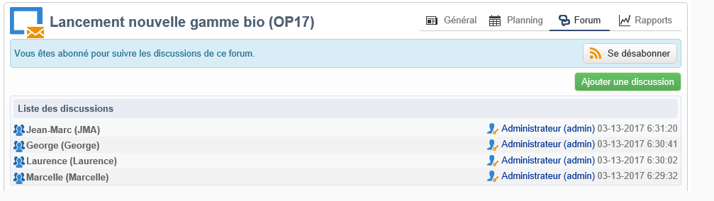

# Forums de discussion{#discussion-forums}

Les opérateurs Adobe Campaign peuvent échanger des informations via les forums de discussion. Les éléments suivants ont chacun leur propre forum : plans, programmes, opérations, ressources, simulations, stocks. Chaque opérateur a également un forum personnel. Toutes les discussions sont publiques, même celles sur les forums personnels des opérateurs.

Les opérateurs peuvent s&#39;abonner à des forums afin de recevoir un email de notification à chaque message posté dans ceux-ci.

## Accéder à un forum {#accessing-a-forum}

Pour visiter le forum d’une campagne, un opérateur, etc., accédez à son tableau de bord et cliquez sur le **[!UICONTROL Forum]** lien dans le coin supérieur droit. Ce lien vous donne également le nombre total de messages dans le forum.

## Utiliser un forum {#using-a-forum}

Dans un forum, les messages et leurs réponses sont classés par ordre chronologique inversé (du plus récent au plus ancien).

Pour afficher le contenu d&#39;un message, cliquez sur son en-tête.

**Commencer une nouvelle discussion**

Pour lancer une nouvelle discussion, cliquez sur le **[!UICONTROL Add a discussion]** bouton dans le coin supérieur droit. La **[!UICONTROL Discussion forum]** boîte apparaît (voir ci-dessous).

**Poster un message dans une discussion existante**

Pour publier un message dans une discussion existante, ouvrez le message auquel vous souhaitez répondre, puis cliquez sur le **[!UICONTROL Reply]** lien dans le coin supérieur gauche. La **[!UICONTROL Discussion forum]** boîte apparaît (voir ci-dessous).

Lorsque vous répondez à un message, la personne ayant posté le message auquel vous répondez recevra un email de notification.

**Rédiger un message**

Dans la **[!UICONTROL Discussion forum]** zone :

1. Enter your text in the **[!UICONTROL Message]** field and a discussion title in the **[!UICONTROL Subject]** field.

   

1. Si besoin :

   * Si vous voulez que quelqu&#39;un participe à la discussion qui n&#39;est pas abonné au forum, utilisez le **[!UICONTROL Operator to notify]** champ. L&#39;opérateur recevra un courrier électronique de notification pour ce message spécifique (il ne sera pas abonné au forum). Pour avertir plusieurs opérateurs, sélectionnez un groupe d’opérateurs.
   * Pour ajouter une pièce jointe au message, cliquez sur **[!UICONTROL Browse]**. La pièce jointe sera également incluse dans le courrier électronique de notification. Les pièces jointes ne peuvent être envoyées qu&#39;individuellement : pour envoyer plusieurs fichiers, vous devez les compresser.

1. Cliquez sur **[!UICONTROL Create the message]** pour le publier sur le forum.

>[!NOTE]
>
>Une fois un message posté dans le forum, il ne peut plus être modifié ni supprimé.

## Poster un message dans le forum personnel d&#39;un opérateur {#posting-to-the-personal-forum-of-an-operator}

Vous pouvez poster un message dans le forum d&#39;un opérateur si par exemple votre message ne relève pas d&#39;une opération particulière mais que vous voulez conservez une trace de votre communication dans Adobe Campaign. Les forums personnels des opérateurs sont publics et tous les opérateurs pourront lire vos messages. L&#39;opérateur reçoit un email à chaque message posté dans son forum personnel.

Pour accéder au forum d&#39;un opérateur :

* If you have the necessary rights to access the **[!UICONTROL Administration > Access management > Operators]** node of the explorer, open the dashboard of the desired operator and click the **[!UICONTROL Forum]** link in the top right-hand corner.
* Sinon, trouvez le nom de l&#39;opérateur dans Adobe Campaign (via un message posté dans un forum par cet opérateur, une tâche lui étant affectée.) et cliquez sur celui-ci pour accéder à son tableau de bord. Vous pouvez également demander à votre administrateur de vous créer une vue sur le dossier des opérateurs.

## S&#39;abonner à un forum {#subscribing-to-a-forum}

Vous pouvez vous abonner à un forum afin d&#39;en suivre les discussions. Une fois abonné, vous recevrez par email une notification pour chaque message posté dans le forum, dans toutes les discussions (cet email inclura le corps du message et l&#39;éventuelle pièce jointe). Vous pourrez répondre au message directement en cliquant dans le corps de l&#39;email, puis en vous connectant à l&#39;interface Web d&#39;Adobe Campaign. Lorsque vous vous abonnez à un forum, cette information est visible par tous.

* To subscribe to a forum, click the **[!UICONTROL Follow discussions]** button in the top right hand section above the list of messages.

   

   Le bandeau devient bleu et indique que vous êtes abonné au forum.

* To unsubscribe from a forum, click the **[!UICONTROL Unsubscribe]** button.

   

* Votre tableau de bord personnel répertorie les forums auxquels vous êtes abonné. Cliquez sur le **[!UICONTROL Subscription to discussion forums]** lien pour afficher la liste, puis sur l’élément qui vous intéresse pour accéder à son forum.

   

   Pour plus d&#39;informations sur le tableau de bord personnel d&#39;un opérateur, consultez [cette section](../../platform/using/access-management.md#operators).

* Pour savoir qui est abonné à un forum, cliquez sur le **[!UICONTROL List of subscribers to this discussion forum]** lien au-dessus de la liste des messages.

   

## Vérifier l&#39;envoi des notifications {#checking-notification-delivery}

Si des opérateurs abonnés à un forum ne reçoivent pas les notifications attendues :

* Vérifiez que les opérateurs ont bien une adresse email renseignée dans leur profil.
* Accédez au **[!UICONTROL Administration > Production > Technical workflows > Campaign processes]** noeud et vérifiez que le **[!UICONTROL Jobs in discussion forums]** processus est démarré et qu’il ne comporte aucune erreur.
* Consultez les logs de diffusion :

   * Sur la page d’accueil d’Adobe Campaign, accédez à **[!UICONTROL Campaigns > Navigation > Deliveries]**, puis ouvrez la **[!UICONTROL Discussion forum notification]** diffusion.
   * Dans l’explorateur, accédez à **[!UICONTROL Administration > Production > Objects created automatically > Technical deliveries > Workflow notifications]**, puis cliquez sur **[!UICONTROL Discussion forum notifications]**.
   Dans la **[!UICONTROL Discussion forum notifications]** zone, les journaux de remise se trouvent dans l’ **[!UICONTROL Edit > Delivery]** onglet. Vous pouvez également afficher les **[!UICONTROL Tracking > Log]** onglets et les **[!UICONTROL Exclusion causes]** onglets.

