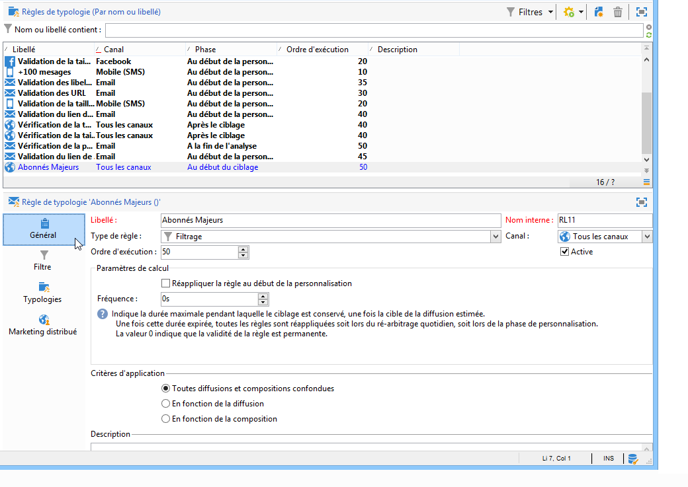
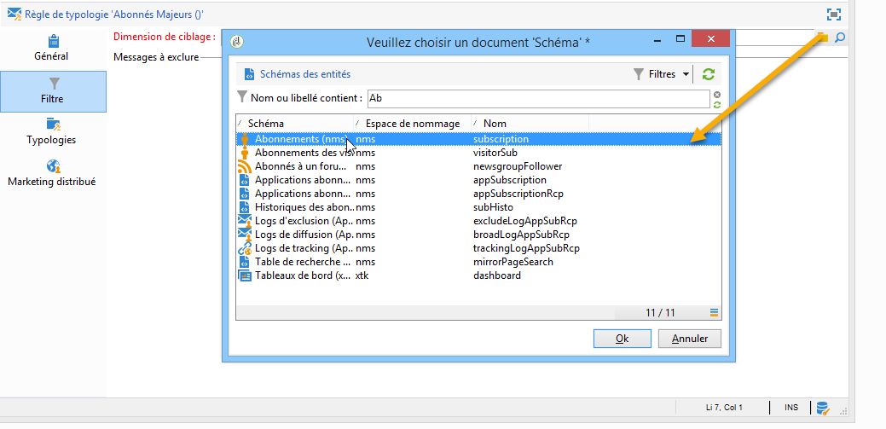
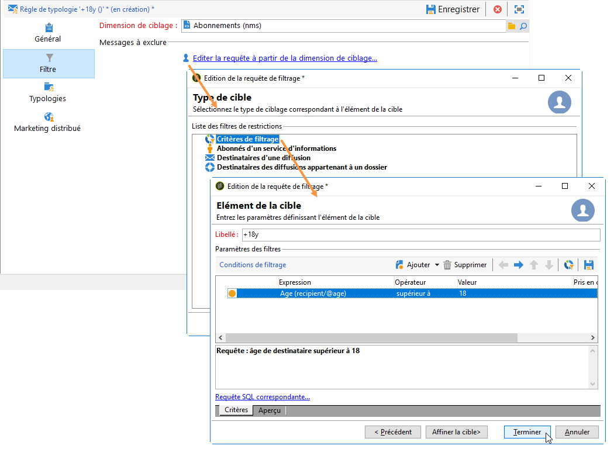
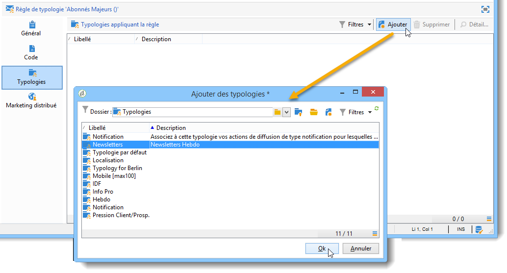
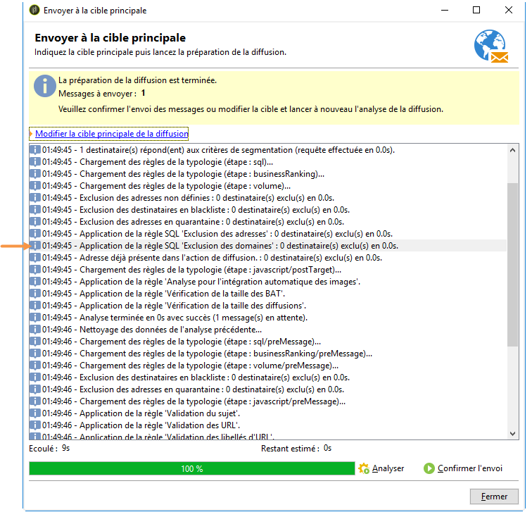
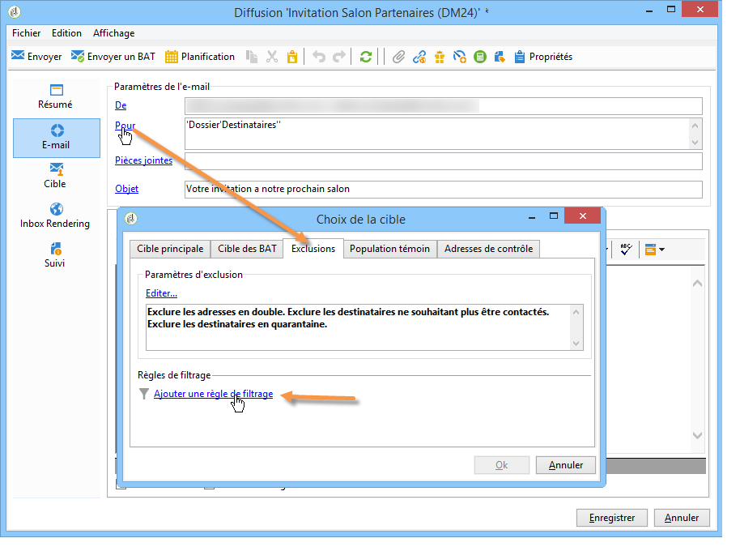
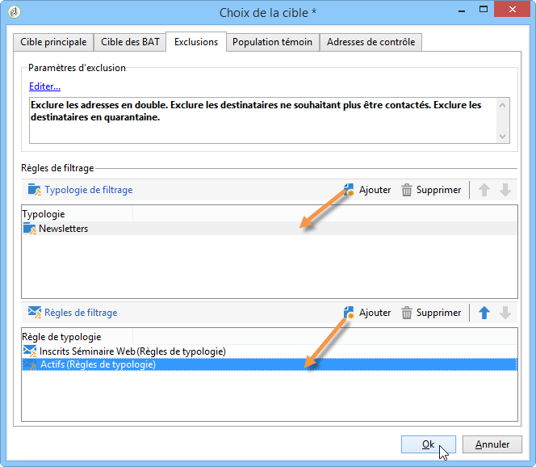

# Règles de filtrage{#filtering-rules}

Les règles de filtrage permettent de définir les messages à exclure en fonction de critères définis dans une requête. Ces règles sont associées à une dimension de ciblage.

Filtering rules can be linked to other types of rules (control, pressure, etc.) in typologies, or grouped in a dedicated **Filtering** typology. Pour plus d’informations, reportez-vous à la section [Création et utilisation d’une typologie](#creating-and-using-a-filtering-typology)de filtrage.

## Créer une règle de filtrage {#creating-a-filtering-rule}

Vous pouvez par exemple filtrer les abonnés à vos newsletters afin de ne jamais adresser de communications aux inscrits mineurs.

Pour définir ce filtrage, les étapes sont les suivantes :

1. Create a **[!UICONTROL Filtering]** typology rule applicable to all communication channels.

   

1. Modifiez la dimension de ciblage par défaut et sélectionnez les abonnements (**nms:subscription**).

   

1. Créez le filtre à l’aide du **[!UICONTROL Edit the query from the targeting dimension...]** lien.

   

1. Associez cette règle à une typologie de campagne et enregistrez-la.

   

Lorsque cette règle est utilisée dans une diffusion, les abonnés mineurs sont automatiquement exclus. Un message spécifique en indique l&#39;application :

## Traiter une règle de filtrage {#conditioning-a-filtering-rule}

Vous pouvez restreindre le champ d&#39;application de la règle de filtrage en fonction de la diffusion ou de la composition de diffusion associée.

To do this, go to the **[!UICONTROL General]** tab of the typology rule, select the type of restriction to apply and create the filter, as shown below:

Dans ce cas, même si la règle est associée à toutes les diffusions, elle ne sera appliquée qu&#39;aux diffusions répondant aux critères du filtre défini.

>[!NOTE]
>
>Typologies and filtering rules can be used in a workflow, in the **[!UICONTROL Delivery outline]** activity. Voir à ce propos [cette section](../../workflow/using/delivery-outline.md).

## Créer et utiliser une typologie de filtrage {#creating-and-using-a-filtering-typology}

You can create **[!UICONTROL Filtering]** typologies: they only contain filtering rules.

These specific typologies can be linked to a delivery when the target is selected: in the delivery wizard, click the **[!UICONTROL To]** link, then click the **[!UICONTROL Exclusions]** tab.

Sélectionnez ensuite la typologie de filtrage à appliquer à la diffusion. Pour ce faire, cliquez sur le **[!UICONTROL Add]** bouton et sélectionnez les typologies à appliquer.

Vous pouvez également associer directement des règles de filtrage depuis cet onglet, sans qu&#39;elles soient regroupées dans une typologie. Pour cela, utilisez la section inférieure de la fenêtre.

>[!NOTE]
>
>* Seules les typologies et règles de filtrage sont proposées dans la fenêtre de sélection.
>* Ces paramétrages peuvent être définis au niveau du modèle de diffusion afin de les appliquer automatiquement à toute nouvelle diffusion créée à partir de ce modèle.
>

## Règles d&#39;exclusion de délivrabilité par défaut {#default-deliverability-exclusion-rules}

Deux règles de filtrage sont disponibles par défaut : **[!UICONTROL Exclude addresses]** ( **[!UICONTROL addressExclusions]** ) et **[!UICONTROL Exclude domains]** ( **[!UICONTROL domainExclusions]** ). Pendant l&#39;analyse de l&#39;email, ces règles comparent les adresses email des destinataires aux adresses ou noms de domaine interdits contenus dans une liste de suppression globale cryptée, gérée dans l&#39;instance de délivrabilité. S&#39;il existe une correspondance, le message n&#39;est pas envoyé au destinataire concerné.

Ces règles d&#39;exclusion permettent d&#39;éviter tout blacklistage lié à une activité malveillante, notamment l&#39;utilisation d&#39;un spam trap (piège à spam). Si un spam trap est par exemple utilisé pour s&#39;abonner par le biais de l&#39;un de vos formulaires web, un email de confirmation lui est automatiquement envoyé. Votre adresse est alors automatiquement blacklistée.

>[!NOTE]
>
>Les adresses et les noms de domaine contenus dans la liste de suppression globale sont masqués. Seul le nombre des destinataires exclus est indiqué dans les logs d&#39;analyse de diffusion.

