# Modèles d&#39;hypothèse{#hypothesis-templates}

## Créer un modèle d&#39;hypothèse {#creating-a-hypothesis-model}

Le paramétrage du modèle d&#39;hypothèse permet de définir le contexte dans lequel les réactions vont être mesurées, qu&#39;elles soient liées à une diffusion ou une offre. C&#39;est à ce niveau que sont référencées les différentes tables nécessaires à la mesure, notamment pour définir les relations entre les individus, les hypothèses et la table des transactions.

Pour créer un modèle d&#39;hypothèse, les étapes sont les suivantes :

1. Dans l’explorateur Adobe Campaign, cliquez sur **[!UICONTROL Resources>Templates>Hypothesis templates]**.

   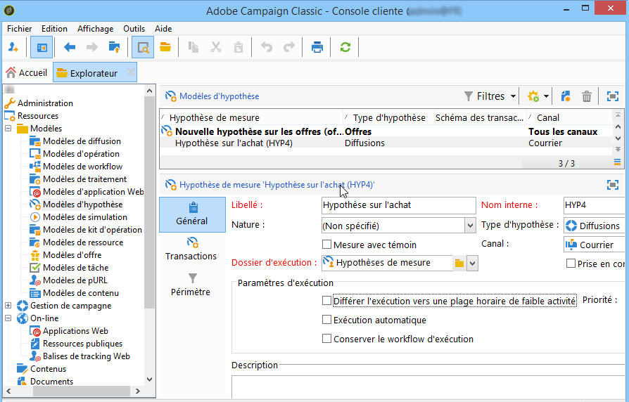

1. Click **[!UICONTROL New]** or right-click in the list of templates and choose **[!UICONTROL New]** in the drop-down list.
1. Saisissez le libellé de l&#39;hypothèse.
1. Specify whether the template is destined for hypotheses on offers or deliveries via the **[!UICONTROL Hypothesis type]**.
1. For **[!UICONTROL Delivery]** type templates, specify whether measurements should be carried out with or without a control group (for more on this, refer to [Properties of a hypothesis template](#properties-of-a-hypothesis-template)).
1. For **[!UICONTROL Delivery]** type templates, you can choose a specific channel or decide to apply the template to all available channels in Adobe Campaign using the **[!UICONTROL Channel]** drop-down list (for more on this, refer to [Properties of a hypothesis template](#properties-of-a-hypothesis-template)).
1. Select the **[!UICONTROL Execution folder]** in which you wish to create and automatically execute the hypotheses that will be created from this template.
1. Choisissez les paramètres d’exécution (pour plus d’informations, reportez-vous à la section Paramètres [d’exécution des modèles d’](#hypothesis-template-execution-settings)hypothèse).
1. Spécifiez la période de calcul de l’hypothèse (pour plus d’informations, reportez-vous aux paramètres [d’exécution du modèle d’](#hypothesis-template-execution-settings)hypothèse).

   >[!CAUTION]
   >
   >Cette période est déterminée à partir de la date de contact.

1. In the **[!UICONTROL Transactions]** tab, specify the tables and fields required for the hypothesis calculation (for more on this, refer to [Transactions](#transactions)).
1. If your template is configured for **[!UICONTROL Offer]** type hypotheses, you can enable the **[!UICONTROL Update offer proposition status]** option: in this case, select the status of the offer proposition you want to change.
1. Specify the scope of the hypothesis application (for more on this, refer to [Hypothesis perimeter](#hypothesis-perimeter)).
1. If necessary, use a script to complete filtering (for more on this, refer to [Hypothesis perimeter](#hypothesis-perimeter)).

### Propriétés d&#39;un modèle d&#39;hypothèse {#properties-of-a-hypothesis-template}

L’ **[!UICONTROL General]** onglet du modèle vous permet de spécifier les options générales du modèle. Les champs disponibles sont les suivants :

* **[!UICONTROL Hypothesis type]**: vous permet de déterminer si le modèle doit être destiné à des hypothèses sur les livraisons ou les offres.

   Vous pouvez également choisir de créer une hypothèse qui s&#39;appliquera à la fois aux diffusions et aux offres.

   >[!NOTE]
   >
   >Si le modèle s’applique aux offres, l’ **[!UICONTROL Update offer proposition status]** option est disponible dans l’ **[!UICONTROL Transactions]** onglet.

* **[!UICONTROL Measurement with control group]**: vous permet d’indiquer si un groupe de contrôle a été défini pour la diffusion ou la campagne et de l’inclure dans les indicateurs de mesure. Le groupe de contrôle, qui ne reçoit pas les livraisons, vous permet de mesurer l&#39;impact de la campagne après la livraison, en la comparant à la population cible qui a reçu la livraison.

   >[!NOTE]
   >
   >Si le modèle est paramétré pour tenir compte d&#39;une population témoin et qu&#39;aucun témoin n&#39;est défini dans la diffusion sur laquelle sont faites les hypothèses, les résultats ne seront basés que sur les destinataires ciblés.

   Pour plus d&#39;informations sur la définition et la configuration d&#39;un groupe de contrôle, reportez-vous à la section [Définition d&#39;un groupe](../../campaign/using/marketing-campaign-deliveries.md#defining-a-control-group)de contrôle.

* **[!UICONTROL Channel]**: vous pouvez choisir un canal spécifique ou rendre le modèle d’hypothèse disponible pour tous les canaux dans la console Adobe Campaign en le sélectionnant **[!UICONTROL All channels]** dans la liste déroulante. Si vous configurez le modèle pour un canal spécifique, cela vous permet de filtrer automatiquement les livraisons par canal lors de la création de l’hypothèse (voir [Création d’hypothèses](../../campaign/using/creating-hypotheses.md)).

   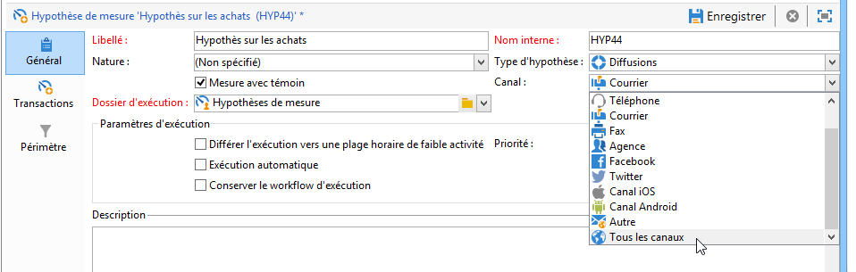

* **[!UICONTROL Execution folder]**: vous permet de spécifier le dossier d’exécution de l’hypothèse.
* **[!UICONTROL Taken into account in campaign ROI calculation]**: prend en compte le résultat de l’hypothèse dans le calcul du RSI pour la campagne associée.

### Paramètres d&#39;exécution d&#39;un modèle d&#39;hypothèse {#hypothesis-template-execution-settings}

L’ **[!UICONTROL General]** onglet du modèle vous permet également de spécifier les paramètres d’exécution de l’hypothèse. Les options disponibles sont les suivantes :

* **[!UICONTROL Schedule execution for a time of low activity]**: vous permet de planifier le lancement de l’hypothèse pour optimiser les performances d’Adobe Campaign. Lorsque cette option est cochée, le processus de traitement des campagnes exécute le calcul d’hypothèse pendant les temps d’arrêt.

   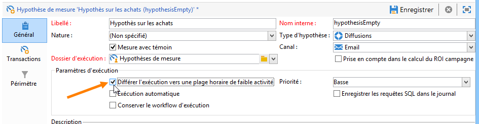

* **[!UICONTROL Priority]**: niveau appliqué à l’hypothèse pour espacer les ordres de calcul de l’hypothèse en cas d’exécutions simultanées.

   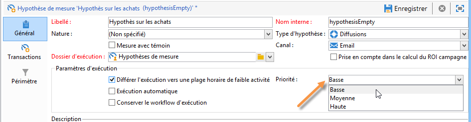

* **[!UICONTROL Automatic execution]**: si nécessaire, vous permet de programmer un nouveau calcul d’hypothèse (par exemple, si vous souhaitez mettre à jour régulièrement les indicateurs jusqu’à la fin de la diffusion).

   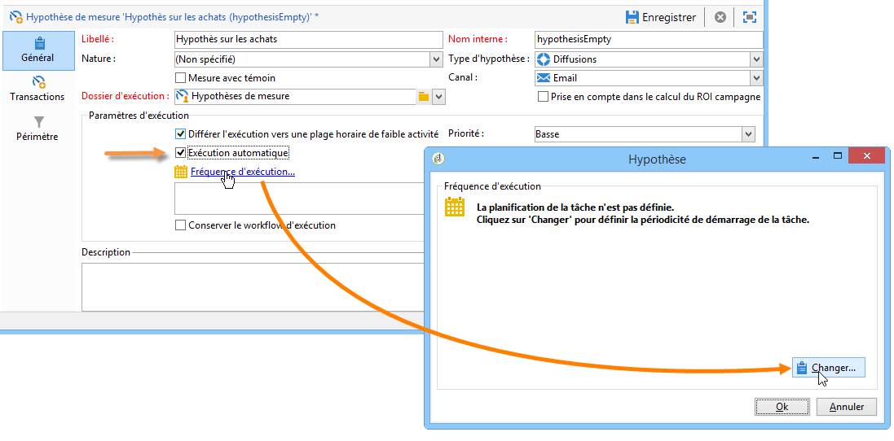

   Pour définir la fréquence, procédez comme suit :

   1. Cliquez sur le **[!UICONTROL Frequency of execution...]** lien, puis sur le **[!UICONTROL Change...]** bouton.

      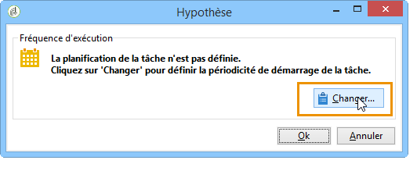

   1. Paramétrez le type de périodicité, les événements de la périodicité et la période de validité des événements.

      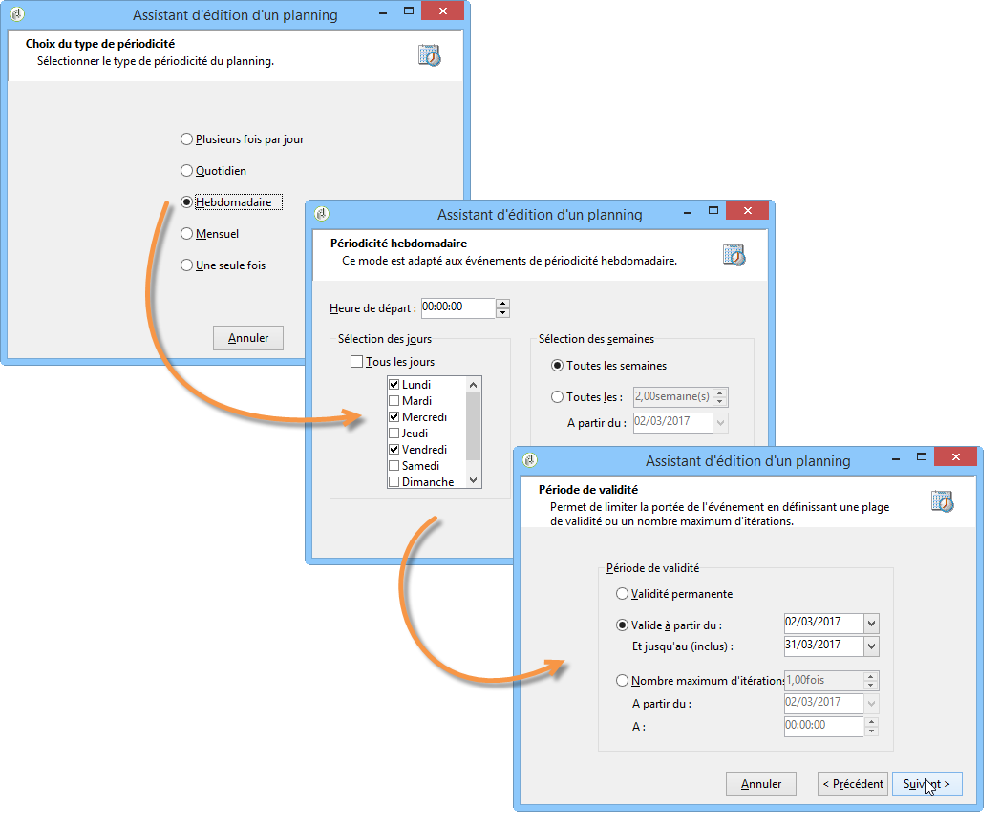

   1. Click **[!UICONTROL Finish]** to save the schedule.

      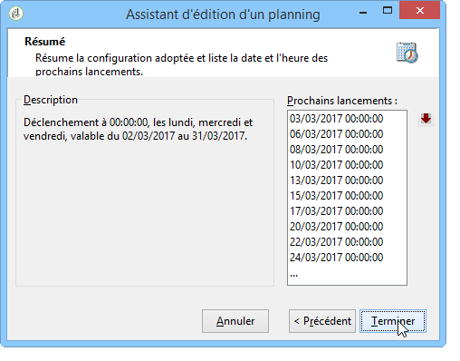

* **[!UICONTROL Log SQL queries in journal]**: cette fonction est réservée aux utilisateurs experts. Il vous permet d&#39;ajouter un onglet à l&#39;audit des hypothèses de mesure pour afficher les requêtes SQL. Cela permet de détecter d’éventuels dysfonctionnements si une simulation se termine par des erreurs.
* **[!UICONTROL Keep execution workflow]**: permet de conserver le flux de travail généré automatiquement au début du calcul de l’hypothèse. Dans les hypothèses créées à partir d’un modèle pour lequel cette option est cochée, le processus généré est disponible pour suivre le processus.

   >[!CAUTION]
   >
   >Cette option ne doit être activée qu&#39;à des fins de débogage, en cas d&#39;erreur lors de l&#39;exécution de l&#39;hypothèse.\
   >De plus, les workflows générés automatiquement ne doivent pas être modifiés. Toute modification éventuelle ne serait par ailleurs pas prise en compte pour les calculs ultérieurs.\
   >Si vous avez coché cette option, supprimez le workflow après son exécution.

### Transactions {#transactions}

Dans cet onglet sont spécifiés les différents champs et tables permettant de conserver l&#39;historique des réactions des destinataires en termes de transaction. Reportez-vous au guide [Configuration](../../configuration/using/about-schema-reference.md) pour plus d&#39;informations sur les tables dédiées à la gestion de la réaction.

* **[!UICONTROL Schema (reaction log storage)]**: sélectionnez le tableau de réaction du destinataire. Le tableau prêt à l’emploi dans Adobe Campaign est **NmsRemaMatchRcp**.
* **[!UICONTROL Transaction schema]**: choisissez le tableau qui sera le sujet des hypothèses, c.-à-d. la transaction ou la table d&#39;achat.
* **[!UICONTROL Querying schema]**: choisissez les critères de filtrage de l&#39;hypothèse.
* **[!UICONTROL Link to individuals]**: choisissez le lien entre les individus et la table utilisée comme schéma de transaction.
* **[!UICONTROL Link to the household]**: sélectionnez le lien vers le ménage dans le schéma des transactions si vous souhaitez inclure tous les membres d&#39;un ménage dans une hypothèse. Ce champ est facultatif.
* **[!UICONTROL Transaction date]**: ce champ est facultatif, mais recommandé car il vous permet de définir une portée pour le calcul d&#39;hypothèse.
* **[!UICONTROL Measurement period]**: vous permet de configurer les dates de début et de fin au cours desquelles les hypothèses sont exécutées et les lignes d’achat récupérées.

   Lorsque l&#39;hypothèse est rattachée à une diffusion, la mesure se déclenche automatiquement quelques jours après la date de contact, dans le cas d&#39;une diffusion courrier, ou après la date d&#39;envoi s&#39;il s&#39;agit d&#39;une diffusion email ou SMS.

   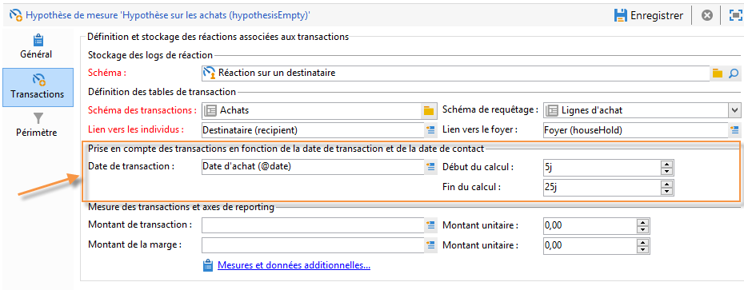

   Si l&#39;hypothèse est lancée à la volée, elle peut être forcée si vous souhaitez la déclencher immédiatement. Sinon, il est déclenché automatiquement en fonction de la date de fin de calcul configurée, qui est basée sur la date de création de l’hypothèse (voir [Création d’une hypothèse à la volée lors d’une livraison](../../campaign/using/creating-hypotheses.md#creating-a-hypothesis-on-the-fly-on-a-delivery)).

* **[!UICONTROL Transaction/Margin amount]**: ces champs sont facultatifs et vous permettent de calculer automatiquement les indicateurs de rotation (reportez-vous à la section [Indicateurs](../../campaign/using/hypothesis-tracking.md#indicators)).
* **[!UICONTROL Unit amount]**: vous permet de définir un montant pour le calcul des recettes (voir [Indicateurs](../../campaign/using/hypothesis-tracking.md#indicators)).

   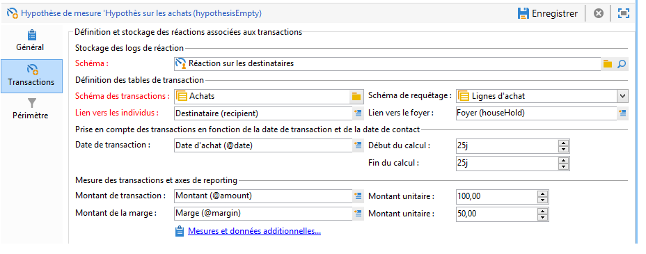

* **[!UICONTROL Additional measures and data]**: vous permet de spécifier d’autres mesures de création de rapports ou des axes à partir des champs des différents tableaux.
* **[!UICONTROL Update offer proposition status]**: vous permet de modifier l’état de la proposition d’offre si un destinataire de l’offre est identifié par l’hypothèse.

   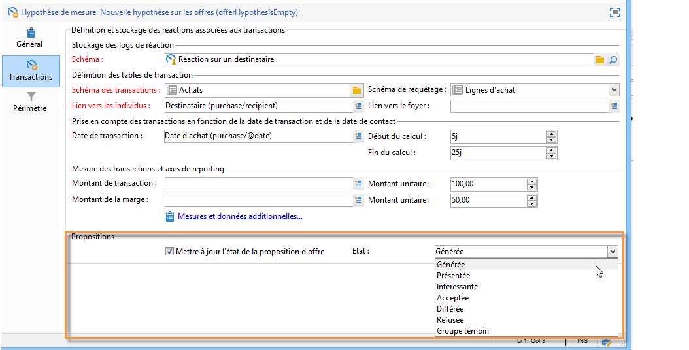

### Périmètre de l&#39;hypothèse {#hypothesis-perimeter}

Lorsque la table des transactions et les champs sur lesquels va porter l&#39;hypothèse sont définis, vous avez la possibilité d&#39;affiner davantage le périmètre de vos hypothèses en indiquant précisément les transactions et les diffusions visées à l&#39;aide de filtres. Vous pouvez également utiliser un script JavaScript pour indiquer explicitement un produit référencé dans la table des transactions sur lequel vous souhaitez faire une hypothèse.

* **Filtrage des transactions**: dans l’ **[!UICONTROL Scope]** onglet, vous pouvez configurer un filtre sur l’hypothèse. Pour cela :

   1. Cliquez sur le **[!UICONTROL Edit query]** lien.

      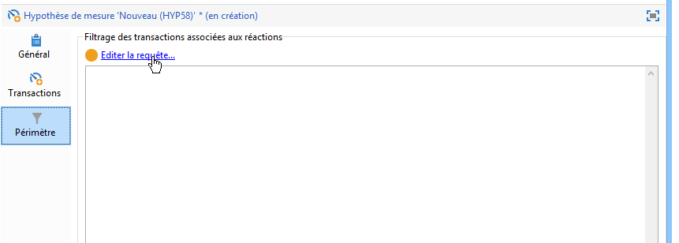

   1. Définissez vos critères de filtrage.

      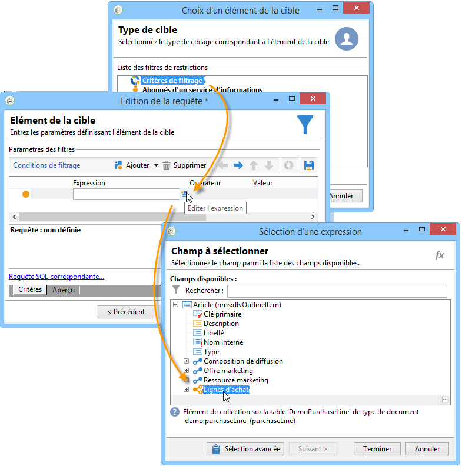

   1. Sélectionnez la transaction sur laquelle doit porter l&#39;hypothèse.

      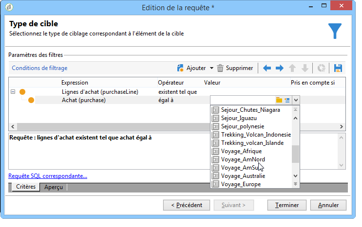

* **Filtrer sur les destinataires**: dans l’ **[!UICONTROL Scope]** onglet, vous pouvez limiter votre hypothèse à toute information liée à un message (remise, destinataire, adresse électronique, service, etc.) :

   1. Cliquez sur le **[!UICONTROL Add a filter]** lien, puis **[!UICONTROL Edit query]**.

      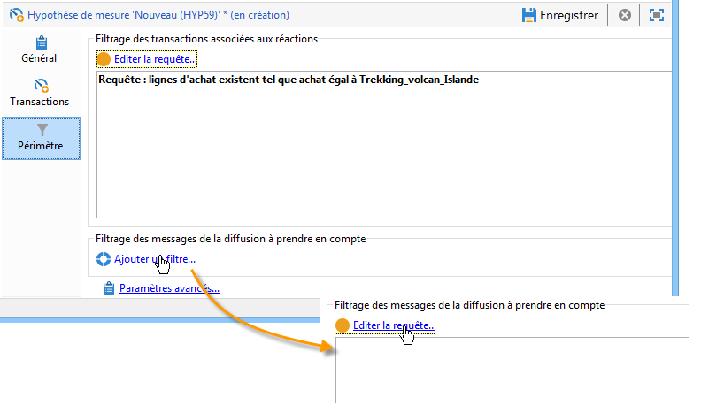

   1. Définissez vos critères de filtrage.

      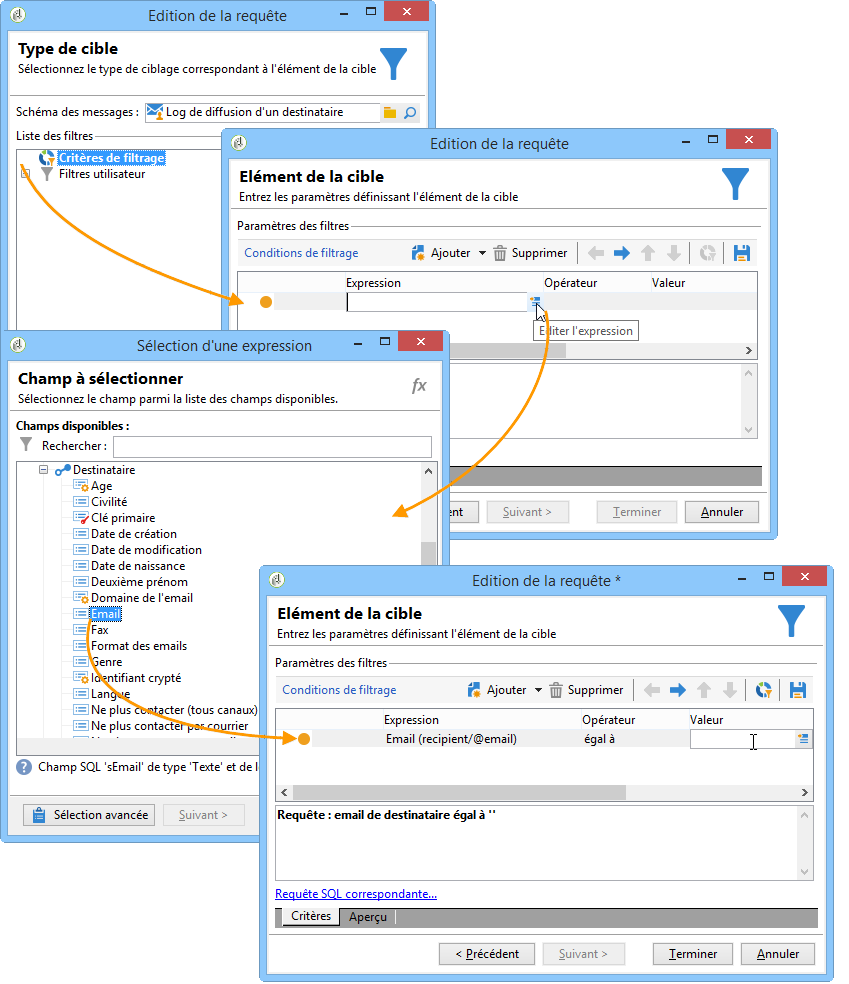

   1. Click **[!UICONTROL Finish]** to save your query.

      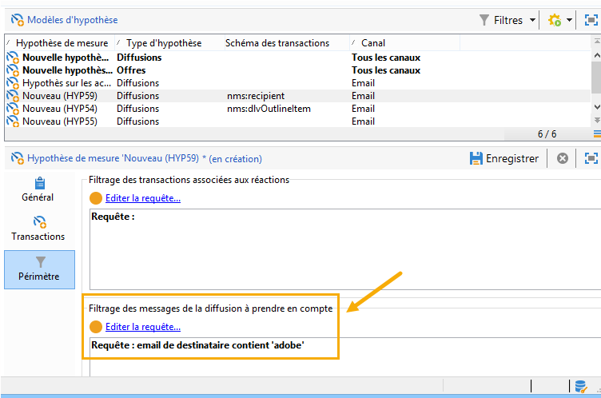

* **Script** : vous pouvez utiliser un script JavaScript pour surcharger dynamiquement les paramètres de l&#39;hypothèse lors de son exécution.

   To do this, click the **[!UICONTROL Advanced settings]** link then enter the desired script.

   >[!NOTE]
   >
   >Cette option est destinée aux utilisateurs experts.

   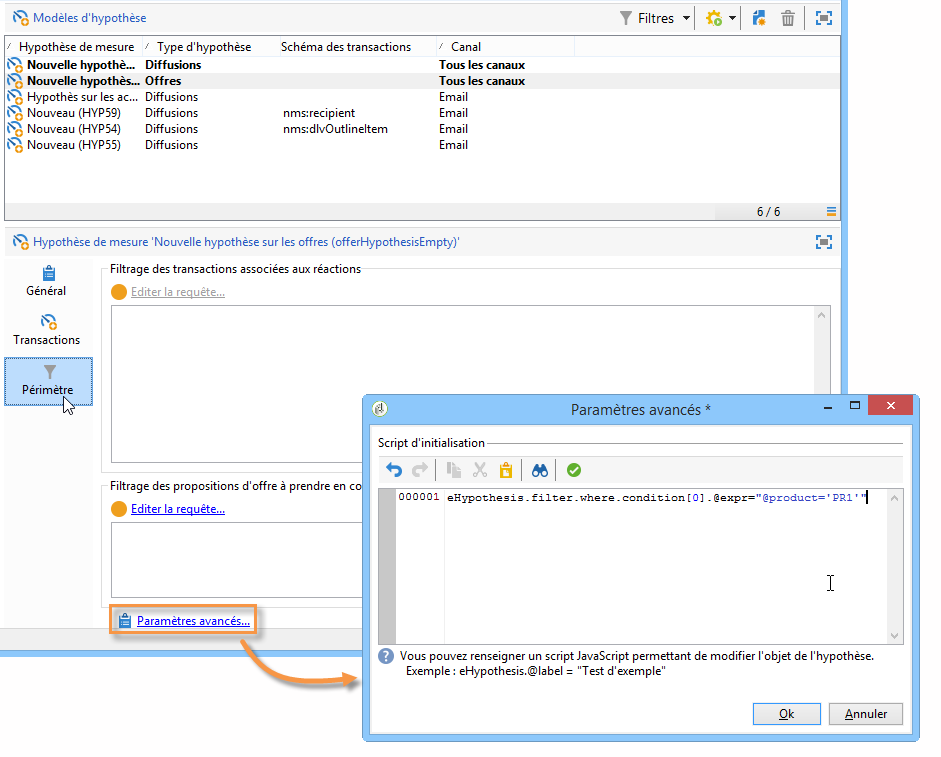

## Exemple de création d&#39;un modèle d&#39;hypothèse sur une diffusion {#example--creating-a-hypothesis-template-on-a-delivery}

Dans cet exemple, vous allez créer un modèle d&#39;hypothèse sur une diffusion de type courrier. La table des transactions (**Achats** dans notre exemple) sur laquelle seront basées les hypothèses contient des lignes d&#39;achat auxquelles sont rattachés des articles ou produits. Vous allez paramétrer votre modèle pour faire des hypothèses sur les articles ou produits de votre table d&#39;achats.

1. Dans l’explorateur Adobe Campaign, accédez au **[!UICONTROL Resources > Templates > Hypothesis templates]** noeud.
1. Click **[!UICONTROL New]** to create a template.

   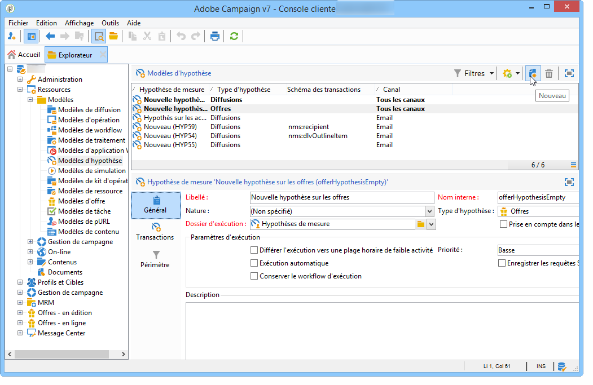

1. Modifiez le libellé du modèle.

   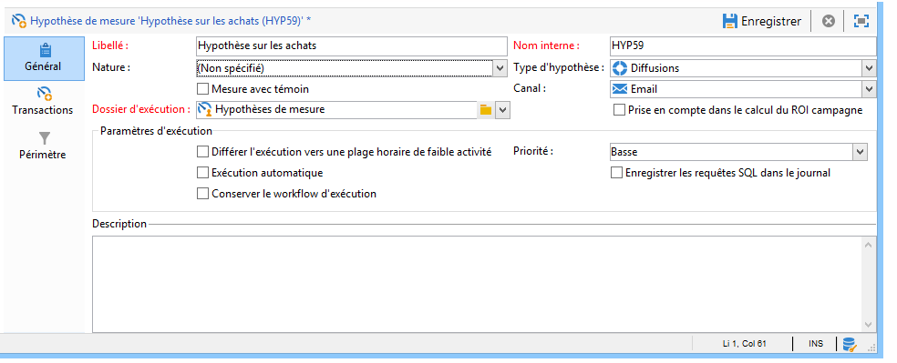

1. Select **[!UICONTROL Deliveries]** as a hypothesis type.
1. Indiquez que la diffusion peut contenir une population témoin en cochant la case correspondante.
1. Sélectionnez le **[!UICONTROL Direct mail]** canal.

   >[!NOTE]
   >
   >Le modèle étant spécifique aux diffusions courrier, les hypothèses créées à partir de ce modèle ne pourront être rattachées à une diffusion utilisant un canal autre que celui du courrier.

1. Dans l&#39;onglet **[!UICONTROL Transactions]**, sélectionnez la table des réactions des destinataires.

   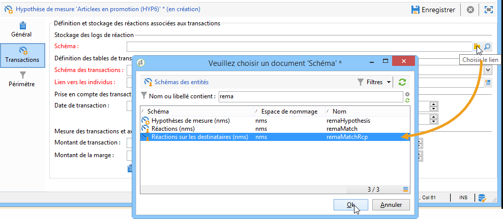

1. In the **[!UICONTROL Transactions schema]** field, choose your purchase table.

   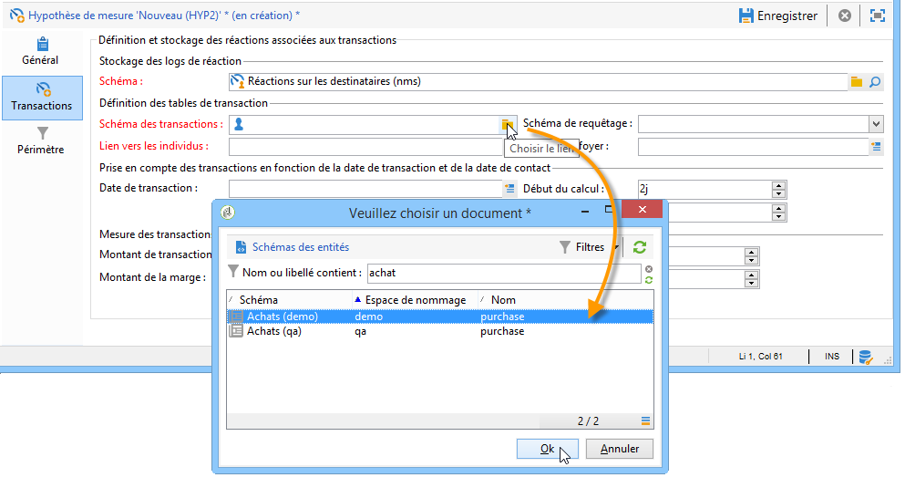

1. Sélectionnez des lignes d’achat dans le **[!UICONTROL Querying schema]** champ.

   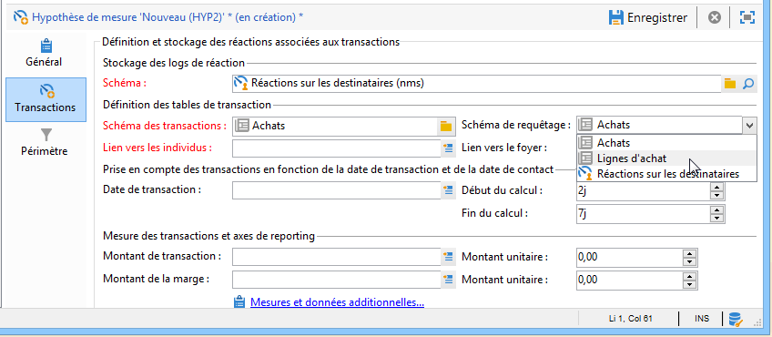

1. Sélectionnez les destinataires liés à la table des achats.

   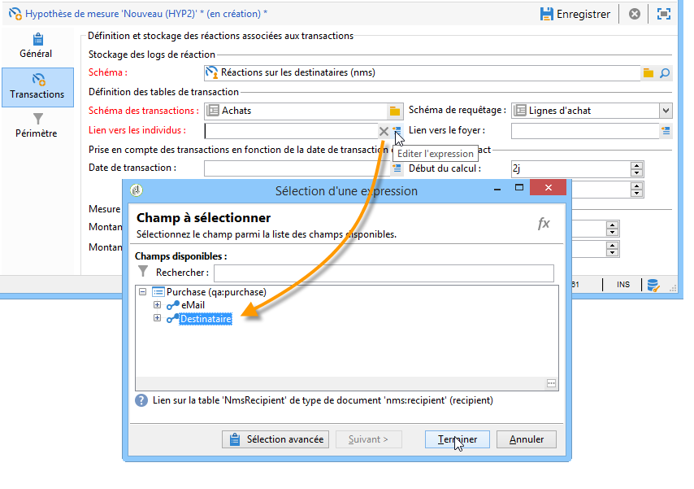

1. Sélectionnez le champ correspondant à la date d&#39;achat.

   Ceci permet de délimiter les hypothèses dans le temps. Cette étape n&#39;est pas obligatoire, mais elle est recommandée.

   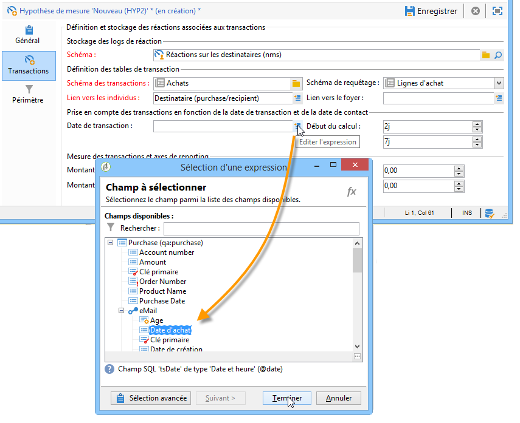

1. Paramétrez la période de calcul entre 5 et 25 jours.

   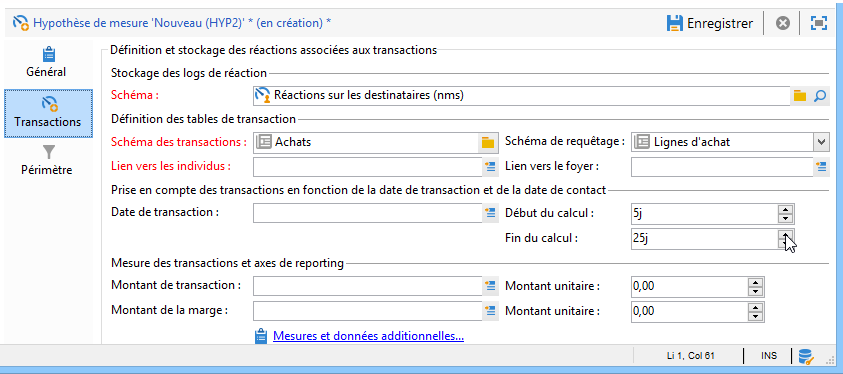

1. In the **[!UICONTROL Scope]** tab, click **[!UICONTROL Edit query]** to create a filter on hypotheses.

   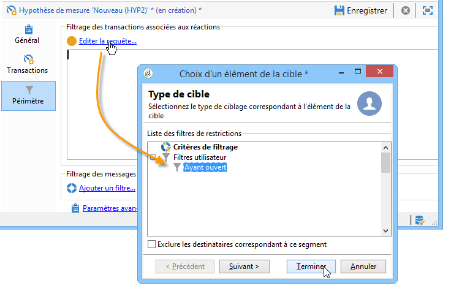

   Le modèle ainsi créé vous permettra de faire des hypothèses sur les produits ou articles contenus dans la table des achats.

1. Click **[!UICONTROL Save]** to record your template.

