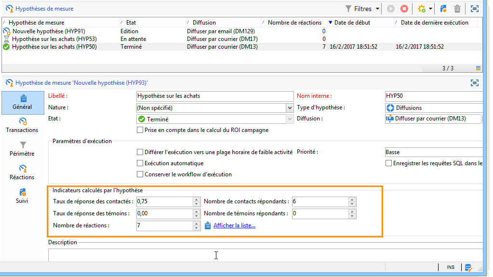
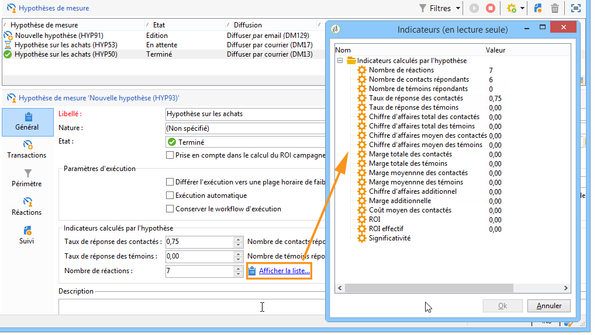
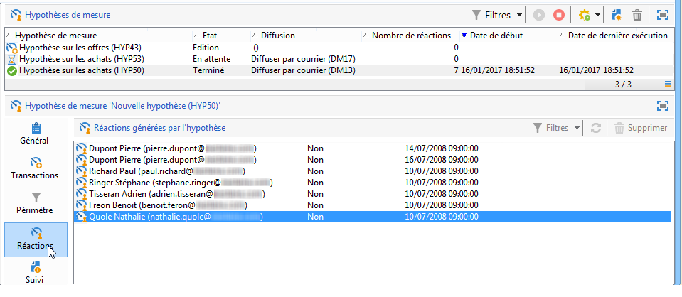
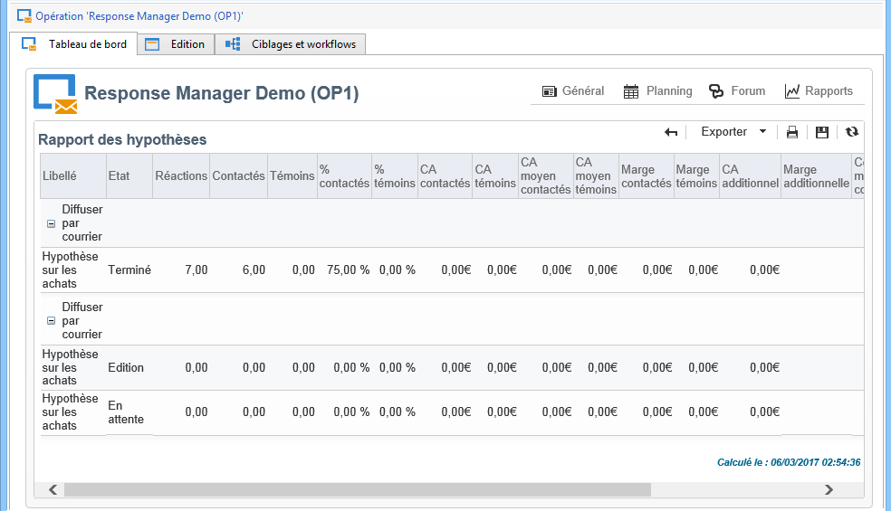
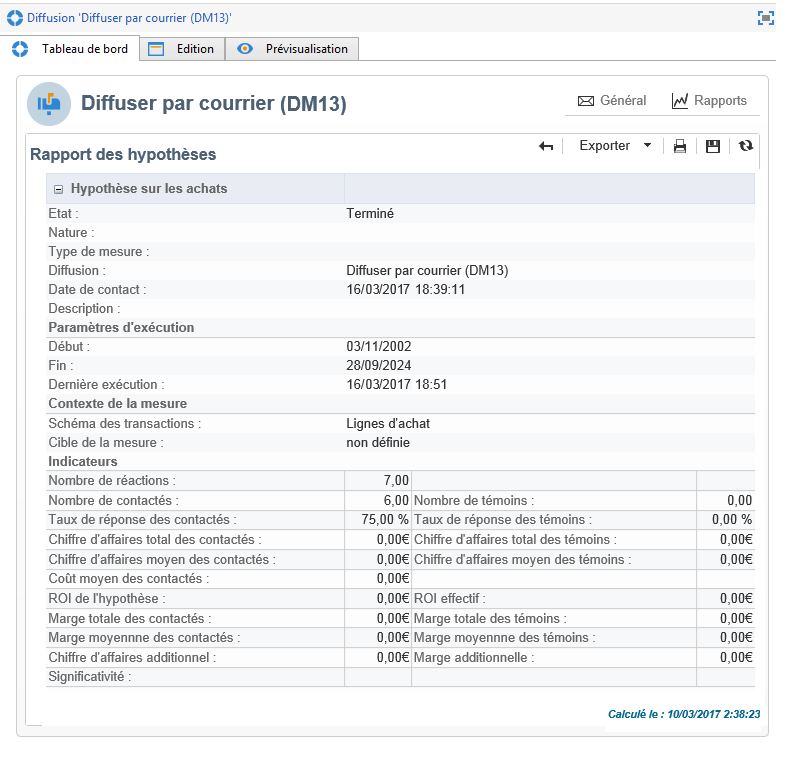

# Suivi des hypothèses{#hypothesis-tracking}

Le résultat des calculs des hypothèses est disponible à divers niveaux de la plateforme Adobe Campaign : les indicateurs calculés par les hypothèses et les réactions de la population ciblée peuvent être consultés depuis l&#39;hypothèse de mesure elle-même, ainsi que dans des rapports d&#39;hypothèses accessibles depuis les opérations et les diffusions.

## Résultats des hypothèses {#hypothesis-results}

### Indicators {#indicators}

Une fois l&#39;hypothèse calculée, plusieurs indicateurs de mesure sont mis à jour automatiquement. Ceux-ci sont disponibles dans l&#39; **[!UICONTROL General]** onglet de l&#39;hypothèse.

Ces indicateurs sont les suivants :

* **Nombre de contacts répondants** : nombre distinct d&#39;individus contactés qui répondent à l&#39;hypothèse.
* **Taux de réponse des contactés** : nombre de contacts répondants / total des contacts de la diffusion.
* **Nombre de témoins répondants** : nombre distinct des témoins répondant à l&#39;hypothèse.
* **Taux de réponse des témoins** : nombre de témoins répondants / total des témoins de la diffusion.
* **Nombres de réactions** : nombre d&#39;enregistrements dans la table contenant la relation entre les individus, l&#39;hypothèse et la table des transactions.

Pour obtenir la liste complète des indicateurs, cliquez sur le **[!UICONTROL Display the list]** lien suivant :

Les informations données par les indicateurs sont les suivantes :

* **Chiffre d&#39;affaires total des contactés** : somme des montants sur le nombre d&#39;individus contactés.
* **Chiffre d&#39;affaires total des témoins** : somme des montants sur le nombre des témoins.
* **Chiffre d&#39;affaires moyen des contactés** : somme des montants / nombre des contactés.
* **Chiffre d&#39;affaires moyen des témoins** : somme des montants / nombre des témoins.
* **Marge totale des contactés** : somme des marges sur le nombre des contactés.
* **Marge totale des témoins** : somme des marges sur le nombre des témoins.
* **Marge moyenne des contactés** : somme des marges / nombre des contactés.
* **Marge moyenne des témoins** : somme des marges / nombre des témoins.
* **Chiffre d&#39;affaire additionnel** : (Chiffre d&#39;affaire moyen des contactés-Chiffre d&#39;affaire moyen des témoins)*Nombre de contactés
* **Marge additionnelle** : (Marge moyenne des contactés-Marge moyenne des témoins) / nombre de contactés
* **Coût moyen des contactés** : coût calculé de la diffusion / Nombre de contactés.
* **ROI** : coût calculé de la diffusion / Marge totale des contactés
* **ROI effectif** : coût calculé de la diffusion / Marge additionnelle.
* **Significativité** : contient les valeurs 0 à 3 selon que la campagne est plus ou moins significative.

### Réactions {#reactions}

You can view recipients&#39; reactions to the hypotheses via the **[!UICONTROL Reactions]** tab.

1. Once hypothesis calculation is complete, go to the **[!UICONTROL Campaign management > Measurement hypotheses]** node of the Adobe Campaign tree.
1. Select the desired hypothesis and click the **[!UICONTROL Reactions]** tab to view the list of recipients likely to purchase something following the marketing campaign.

   

## Rapports {#reports}

Le **[!UICONTROL Hypothesis report]** rapport vous permet d’afficher les résultats des hypothèses appliquées aux campagnes et aux livraisons. Le présent rapport contient les indicateurs calculés par l&#39;hypothèse (pour plus de détails, voir [Indicateurs](#indicators)).

* **Au niveau** de la campagne : cliquez sur le **[!UICONTROL Reports]** lien de la campagne concernée et sélectionnez le **[!UICONTROL Hypothesis report]**. Ce rapport contient la liste des livraisons de campagne et les hypothèses calculées pour chaque remise.

   

* **Au niveau** de la livraison : pour accéder au rapport, ouvrez la remise concernée, cliquez sur le **[!UICONTROL Reports]** sous l&#39; **[!UICONTROL Summary]** onglet et sélectionnez le **[!UICONTROL Hypothesis report]**. Si plusieurs hypothèses ont été calculées pour la même livraison, le rapport contiendra toutes les hypothèses.

   
