# Gérer les ressources marketing{#managing-marketing-resources}

Adobe Campaign permet d&#39;assurer le suivi et le tracking des ressources marketing impliquées dans le cycle de vie des opérations. Ces ressources marketing peuvent être par exemple une brochure, un visuel, ou tout autre support de communication sur lequel plusieurs opérateurs sont appelés à intervenir.

Pour chaque ressource marketing gérée via Adobe Campaign, vous pouvez contrôler à tout moment son statut, son historique et visualiser la version courante.

## Ajouter une ressource marketing {#adding-a-marketing-resource}

Les ressources marketing sont accessibles à partir de l&#39;univers Campagnes.

To add a resource, click the **[!UICONTROL Create]** button.

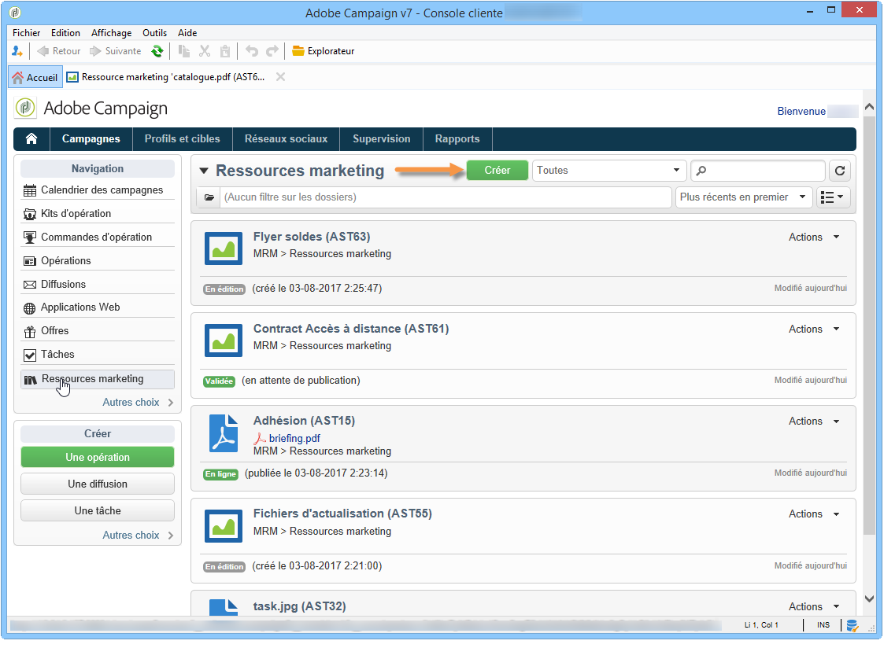

Pour rendre une ressource disponible sur le serveur Adobe Campaign, vous devez ajouter la ressource souhaitée en la faisant glisser dans la zone centrale de l’éditeur. Vous pouvez également cliquer sur le **[!UICONTROL Upload file to server...]** lien.

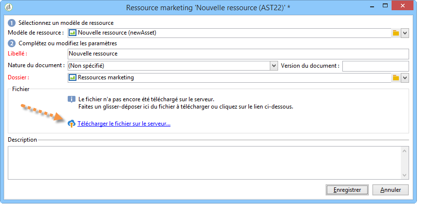

Un message de confirmation permet de lancer le téléchargement.

Une fois le transfert terminé, la ressource est ajoutée à la liste des ressources disponibles. Il est accessible aux opérateurs Adobe Campaign. Ils peuvent le consulter (via l’ **[!UICONTROL Preview]** onglet), en faire une copie pour le modifier ou mettre à jour le fichier sur le serveur (à l’aide de l’ **[!UICONTROL Edit]** onglet).

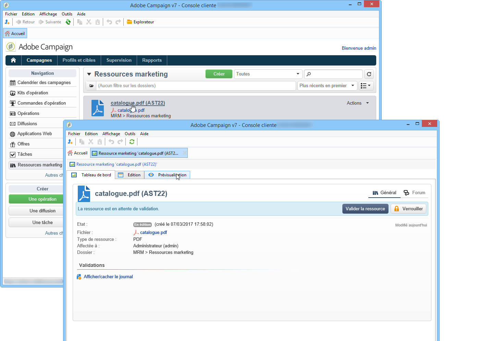

Cliquez sur l’ **[!UICONTROL General]** onglet pour sélectionner les opérateurs ou groupes d’opérateurs chargés de surveiller, de suivre et d’approuver cette ressource. La sélection du réviseur s’effectue via le **[!UICONTROL Advanced parameters]** lien.

* L&#39;opérateur auquel la ressource est affectée est chargé d&#39;en assurer le tracking.
* L&#39;opérateur validant est celui qui est responsable de la validation de la ressource marketing. Il sera notifié lors du lancement du processus de validation de la ressource.

   If no reviewer is selected, the resource **[!UICONTROL cannot be]** subject to approval.

* Au besoin, vous pouvez également définir un relecteur.

Vous pouvez spécifier une date de disponibilité (indicative) pour la ressource. Au-delà de cette date, il apparaîtra avec **[!UICONTROL Late]** le statut.

## Travail collaboratif sur les ressources {#collaborative-work-on-resources}

Vous pouvez modifier et mettre à jour une ressource marketing et, au besoin, en informer les autres opérateurs Adobe Campaign. Ainsi, vous pouvez :

* Télécharger la ressource en local pour la modifier.
* Mettre à jour le fichier sur le serveur et le rendre accessible aux autres opérateurs.
* Verrouiller une ressource afin d&#39;en interdire la modification par les autres opérateurs.

>[!NOTE]
>
>L’ **[!UICONTROL History]** onglet contient le journal de téléchargement et de mise à jour de la ressource. Le **[!UICONTROL Details]** bouton permet d’afficher la version sélectionnée :

### Verrouiller/déverrouiller une ressource {#locking-unlocking-a-resource}

Une fois créées, les ressources sont disponibles dans le tableau de bord des ressources marketing et les opérateurs peuvent les éditer et les modifier.

Lorsqu&#39;un opérateur souhaite travailler sur une ressource, il est préférable de la verrouiller au préalable, afin d&#39;éviter à tout autre opérateur d&#39;y apporter des modifications simultanément. La ressource lui est alors réservée : elle reste accessible mais ne peut être aucunement publiée ni mise à jour sur le serveur par un autre opérateur.

Un message spécifique vient avertir l&#39;opérateur qui souhaite y accéder :

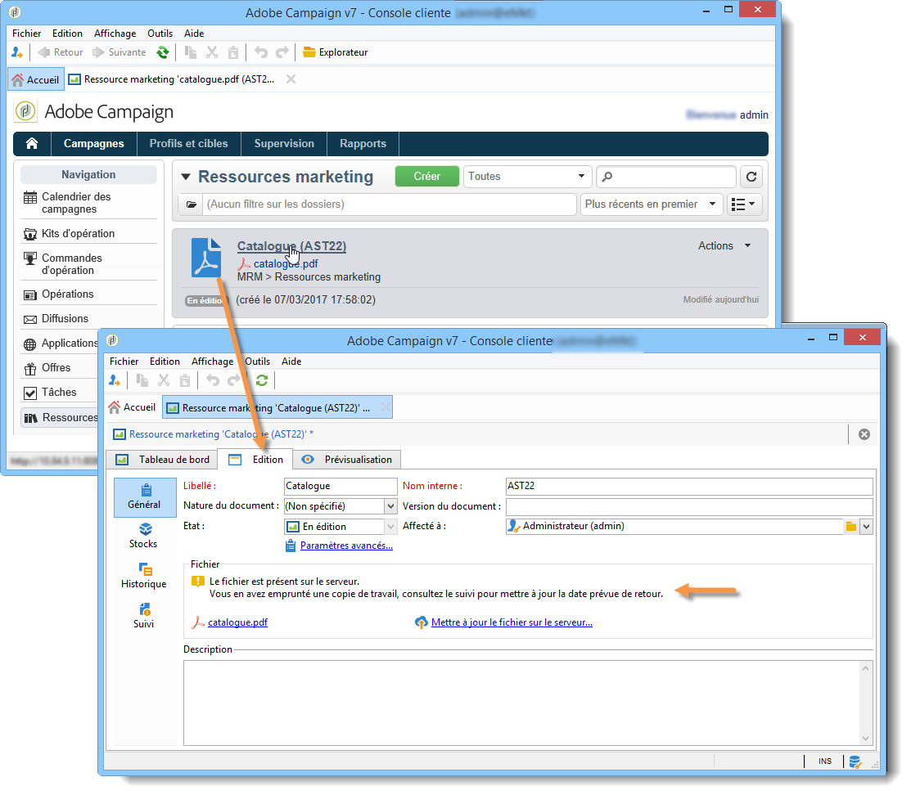

L&#39;onglet **[!UICONTROL Tracking]** indique le nom de l&#39;opérateur qui a verrouillé la ressource et la date prévue de mise à jour.

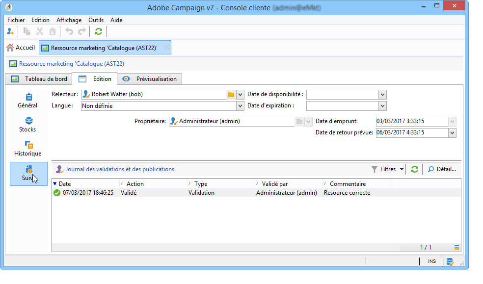

To lock a resource, you must click the resource followed by the **[!UICONTROL Lock]** button in the resource dashboard.

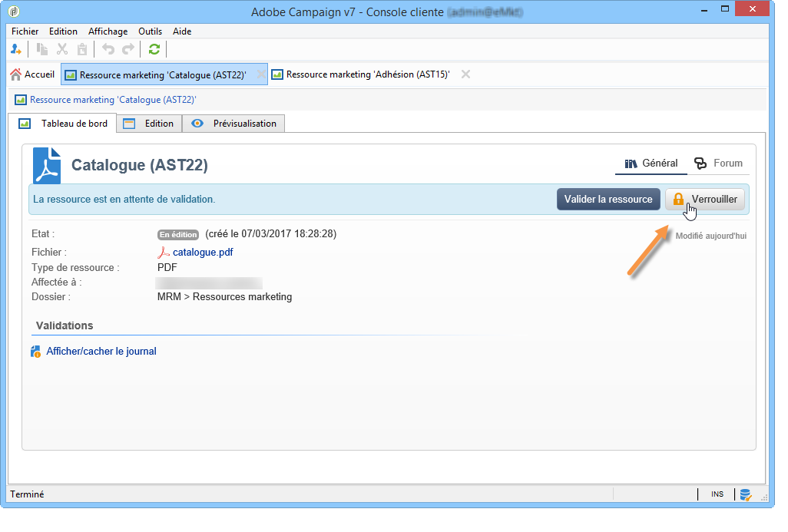

Vous pouvez indiquer la date de retour prévue dans l&#39;onglet **[!UICONTROL Tracking]** de la ressource.

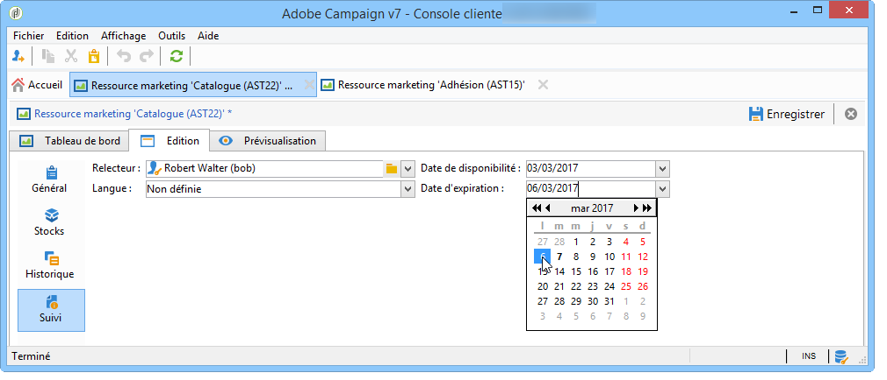

Cette information permet d&#39;indiquer aux autres opérateurs Adobe Campaign la date à laquelle cette ressource sera déverrouillée.

Une fois la ressource mise à jour, elle est automatiquement déverrouillée pour la rendre à nouveau disponible à tous les opérateurs.

Vous pouvez également, au besoin, la déverrouiller manuellement depuis le tableau de bord.

>[!NOTE]
>
>Seul l&#39;opérateur ayant verrouillé la ressource et les opérateurs ayant des droits Administrateur sont autorisés à déverrouiller une ressource verrouillée.

### Forums de discussion {#discussion-forums}

Pour chaque ressource, l&#39;onglet **[!UICONTROL Forum]** permet aux intervenants d&#39;échanger des informations.

[Les forums](../../campaign/using/discussion-forums.md) de discussion expliquent le fonctionnement des forums de discussion dans Adobe Campaign.

## Cycle de vie d&#39;une ressource marketing {#life-cycle-of-a-marketing-resource}

Lors de la création de la ressource, des opérateurs Adobe Campaign sont désignés pour concevoir, relire, valider et publier la ressource. Une durée peut être déterminée pour ces opérations.

L&#39;onglet **[!UICONTROL Tracking]** permet de suivre les interventions réalisées sur la ressource : validations, refus de validation, commentaires associés, publications.

The **[!UICONTROL History]** tab displays file transfers carried out for this resource.

### Processus de validation {#approval-process}

La date de disponibilité prévue s’affiche dans les détails de la ressource, si elle a été spécifiée dans l’ **[!UICONTROL Tracking]** onglet. Une fois cette date atteinte, vous pouvez exécuter le processus d’approbation à l’aide du **[!UICONTROL Submit for approval]** bouton du tableau de bord des ressources. L’état de la ressource devient alors **[!UICONTROL Approval in progress]**.

A resource can be approved via the **[!UICONTROL Approve resource]** button on its dashboard.

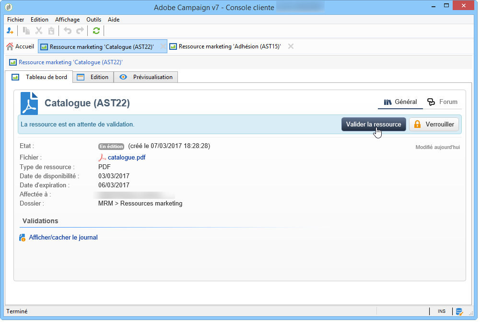

Les opérateurs autorisés peuvent alors accepter ou rejeter l’approbation. Cette action est possible : via le message électronique envoyé (en cliquant sur le lien dans le message de notification) ou via la console (en cliquant sur le bouton **[!UICONTROL Approve]** ).

La fenêtre de validation permet de saisir un commentaire.

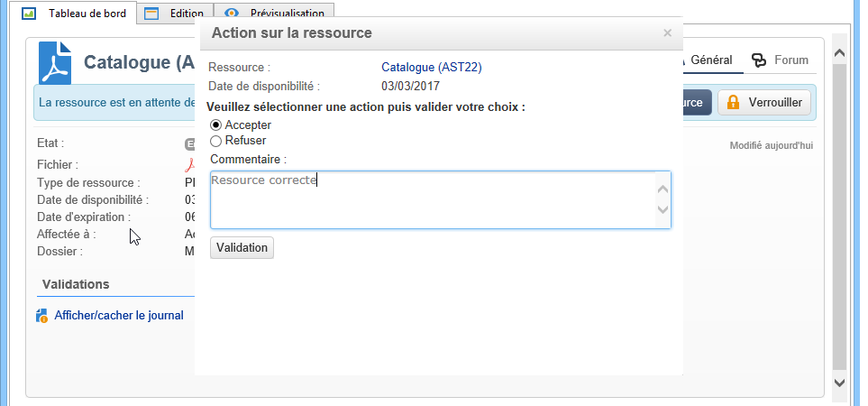

L&#39;onglet **[!UICONTROL Tracking]** permet à tous les opérateurs de suivre les différentes étapes du processus de validation.

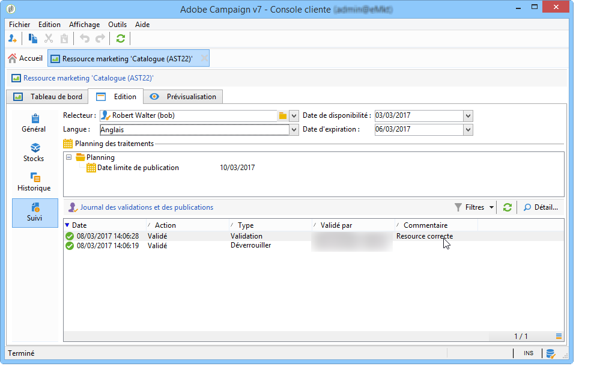

>[!NOTE]
>
>En plus de l&#39;opérateur validant désigné au niveau de chaque ressource marketing, les opérateurs ayant les droits d&#39;administration et le responsable de la ressource sont habilités à valider une ressource marketing.

### Publier une ressource {#publishing-a-resource}

Une fois validée, la ressource marketing doit être publiée. Le processus de publication doit faire l&#39;objet d&#39;une implémentation spécifique en fonction des besoins de l&#39;entreprise. Ainsi, les ressources peuvent être publiées sur un extranet ou tout autre serveur, une information spécifique peut être transmise à un prestataire externe, etc.

To publish a resource, click the **[!UICONTROL Publish]** button in the editing zone of the marketing resource dashboard.

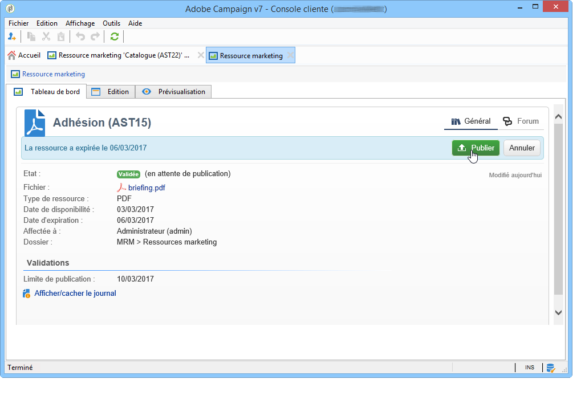

Vous pouvez également automatiser la publication d&#39;une ressource via un workflow.

Publier une ressource signifie la rendre disponible afin qu&#39;elle puisse être utilisée (par exemple dans une autre tâche). La publication proprement dite varie suivant la nature de votre ressource : pour un flyer, la publication peut consister à envoyer le fichier à un imprimeur, pour une page web, la publier sur un site...

Pour publier Adobe Campaign, vous devez créer un flux de travail approprié et le lier à la ressource. Pour ce faire, ouvrez la **[!UICONTROL Advanced settings]** zone de la ressource, puis sélectionnez le flux de travail souhaité dans le **[!UICONTROL Post-processing]** champ.

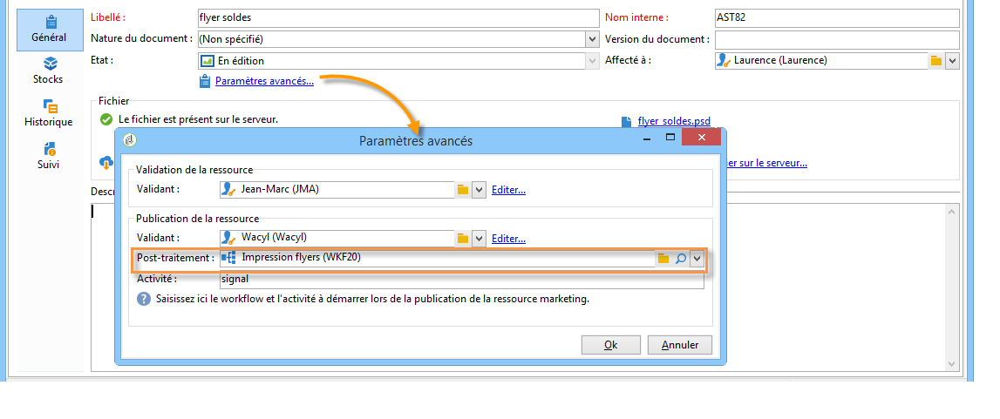

Le workflow sera exécuté :

* When the reviewer clicks the **[!UICONTROL Publish resource]** link (or, if no reviewer was defined, the person in charge of the resource).
* If the resource is managed via a marketing resource creation task, it will be executed when the task is set to **[!UICONTROL Finished]**, as long as the **[!UICONTROL Publish the marketing resource]** box is checked in the task (Refer to [Marketing resource creation task](../../campaign/using/creating-and-managing-tasks.md#marketing-resource-creation-task))

Si un processus n’est pas démarré immédiatement (si le processus est arrêté, par exemple), l’état de la ressource devient **[!UICONTROL Pending publication]**. Une fois le processus démarré, l’état de la ressource devient **[!UICONTROL Published]**. Ce statut ne prend pas en compte les erreurs possibles dans le processus de publication. Vérifiez l’état de votre flux de travaux pour vous assurer qu’il s’est exécuté correctement.

## Associer une ressource à une opération {#linking-a-resource-to-a-campaign}

### Référencer une ressource marketing {#referencing-a-marketing-resource}

Les ressources marketing peuvent être associées aux opérations, sous réserve que cette fonctionnalité ait été sélectionnée au niveau du modèle de l&#39;opération.

>[!NOTE]
>
>For details on how to create and configure campaign templates, refer to [Campaign templates](../../campaign/using/marketing-campaign-templates.md#campaign-templates).

Click the **[!UICONTROL Documents > Resources]** tab in the campaign dashboard, then click **[!UICONTROL Add]** to select the resource concerned.

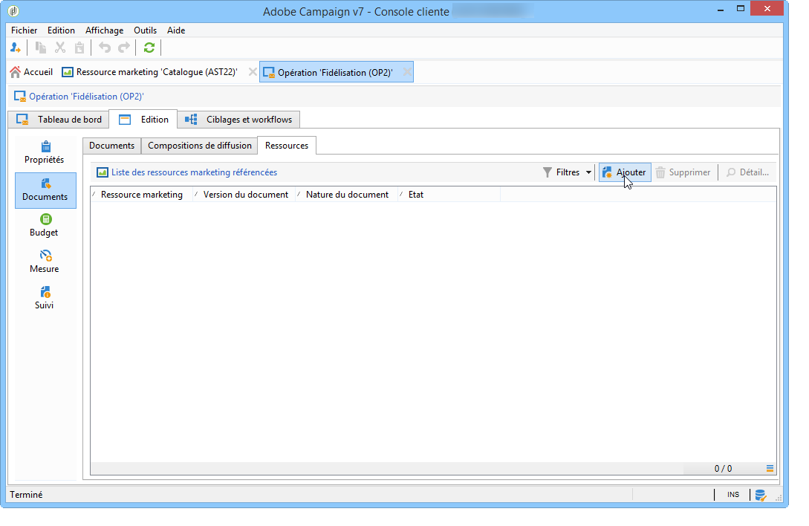

Vous pouvez filtrer les ressources par statut, par nature ou par type, ou appliquer un filtre personnalisé.

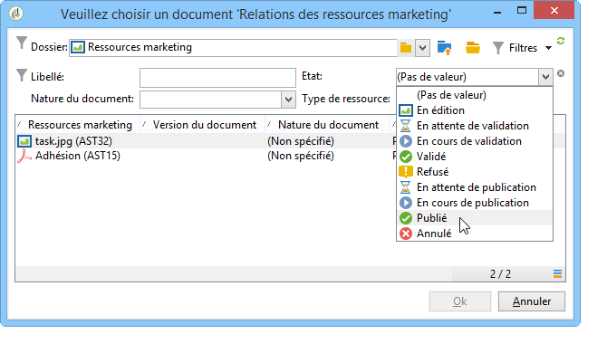

Cliquez sur **[!UICONTROL OK]** pour ajouter la ressource dans la liste des ressources marketing référencées pour cette opération.

The **[!UICONTROL Details]** button lets you edit and view it.

Les ressources ajoutées sont affichées dans le tableau de bord. Elles peuvent également y être éditées.

### Ajouter une ressource marketing dans une composition de diffusion {#adding-a-marketing-resource-to-a-delivery-outline}

Les ressources marketing peuvent être associées à des diffusions via les compositions.

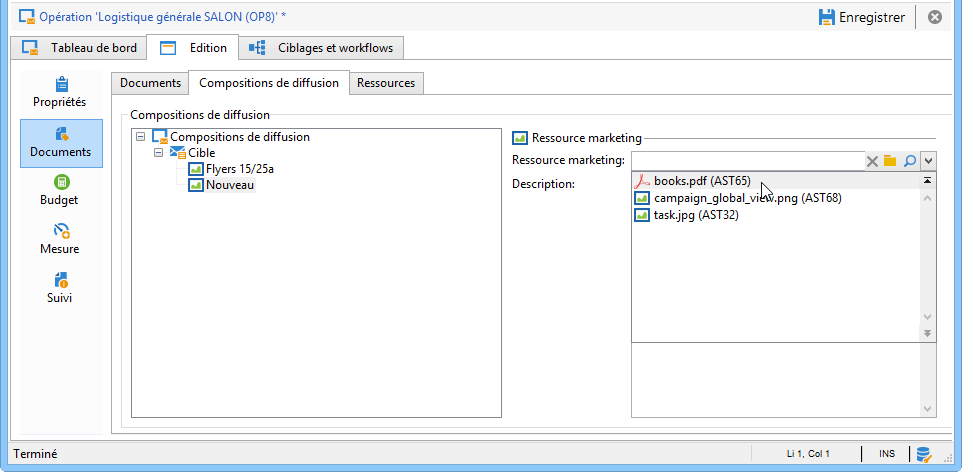

>[!NOTE]
>
>Pour plus d&#39;informations sur les contours de la prestation, consultez [Association et structuration des ressources liées par le biais d&#39;un plan](../../campaign/using/marketing-campaign-deliveries.md#associating-and-structuring-resources-linked-via-a-delivery-outline)de prestation.

## Gestion des stocks {#stock-management}

Vous pouvez associer une ressource marketing à un ou plusieurs stocks afin de gérer l&#39;approvisionnement et, au besoin, en cas de stock insuffisant, afficher une alerte dans le tableau de bord.

>[!NOTE]
>
>For more information on stock management in Adobe Campaign, refer to [Stock management](../../campaign/using/providers--stocks-and-budgets.md#stock-management).

Pour associer une ressource marketing à un stock, éditez la vue d&#39;ensemble des stocks et éditez ou créez un stock. Ajoutez une ligne de stock et sélectionnez la ressource marketing correspondante.

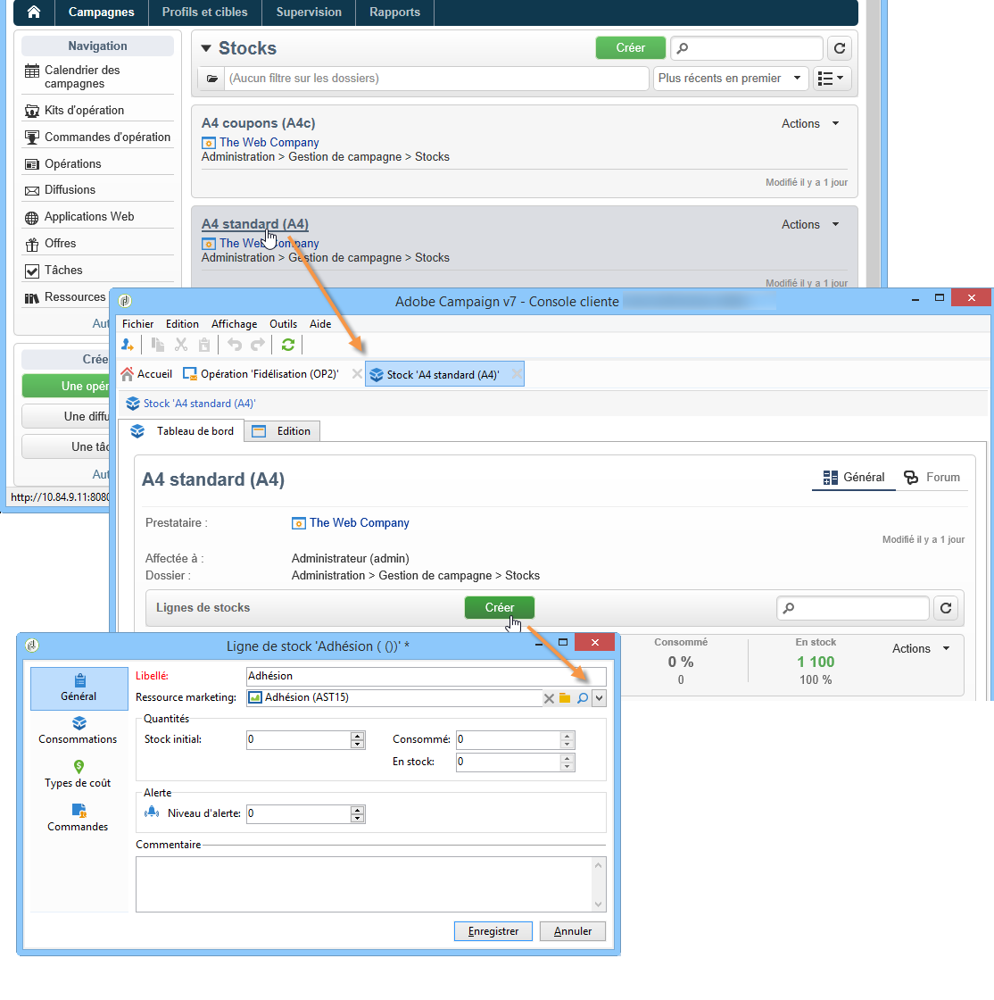

If necessary, you can edit the selected resource via the **[!UICONTROL Edit the link]** icon (magnifying glass) located to the right of the resource once it has been selected.

Indiquez le stock initial et le stock d&#39;alerte puis enregistrez.

Le stock est indiqué dans le détail de la ressource.

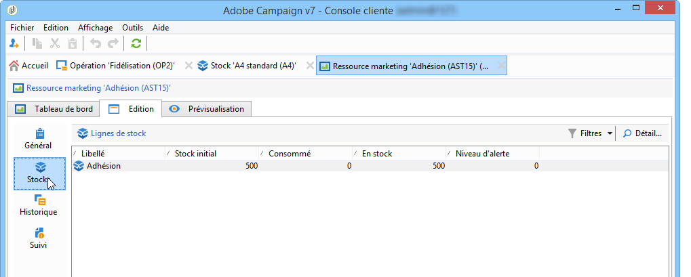

Lorsque le stock est insuffisant, un message d&#39;alerte sera envoyé aux opérateurs auxquels il est affecté.

## Fonctions avancées {#advanced-functions}

Le tableau de bord des ressources marketing vous permet d’effectuer les types d’opérations habituels : ajouter, modifier, verrouiller/déverrouiller, approuver, publier. Vous pouvez créer d’autres types de ressources marketing et accéder à des fonctionnalités avancées via l’arborescence Adobe Campaign. Pour ce faire, cliquez sur **[!UICONTROL Explorer]** dans la page d’accueil d’Adobe Campaign.

By default, marketing resources are stored in the **[!UICONTROL MRM > Marketing resources]** node of the tree.

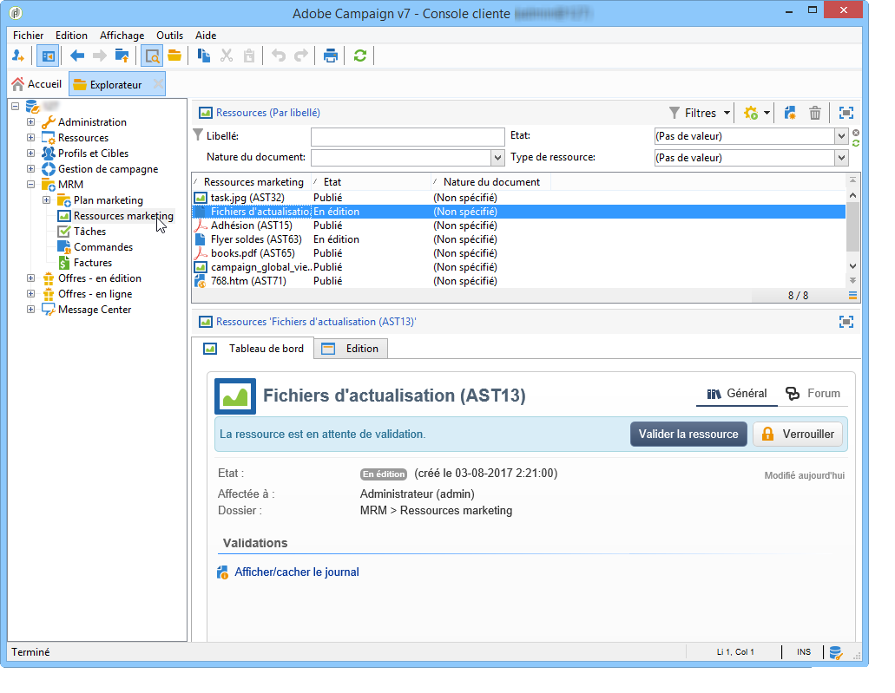

Vous pouvez ajouter les ressources suivantes depuis cette vue :

* Fichier
* HTML
* Texte
* URL

