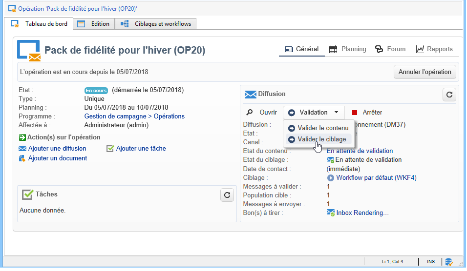

—produit : campaign
titre : configurer et gérer le processus de validation
description : découvrez comment gérer les validations des campagnes marketing
langue : fr
role: User
fonctionnalité : validations, campagnes
masquer : oui
hidefromtoc : oui
exl-id : 8cbb2445-f5e4-4a25-ba7e-56e39ca9d3ce
---
# Configuration et gestion du processus de validation {#approving-marketing-campaigns}

Chaque étape d&#39;une diffusion peut faire l&#39;objet d&#39;une validation afin d&#39;assurer un suivi et un contrôle complets des processus de l&#39;opération. Il s’agit notamment du ciblage, du contenu, du budget, de l’extraction et de l’envoi d’un BAT.

Des messages de notification sont envoyés aux opérateurs [!DNL Adobe Campaign] désignés comme validants afin de les avertir d&#39;une demande de validation. Vérifiez que les validants disposent des **autorisations appropriées** pour la validation et que leur zone de sécurité est correctement définie. [En savoir plus sur la sélection des validants](#selecting-reviewers).

La procédure de validation est présentée dans la [présentation de la procédure de validation](#checking-and-approving-deliveries).

>[!NOTE]
>
>Seule la personne propriétaire de la diffusion peut démarrer une diffusion. Pour qu’un autre opérateur (ou un groupe d’opérateurs) puisse démarrer une diffusion, vous devez l’ajouter comme validant au niveau du champ **[!UICONTROL Démarrage de la diffusion :]**.\
>[En savoir plus sur la sélection des validants](#selecting-reviewers).

## Principe de fonctionnement {#operating-principle-}

Par exemple, pour la validation du budget, le message standard est le suivant :

Les opérateurs validants peuvent alors choisir de valider ou non le budget.

Après validation de l’opérateur, la validation ou le refus du traitement est remontée au niveau du tableau de bord de la diffusion.

Les informations sont également disponibles dans les logs de validation de la campagne. Ces logs sont accessibles à partir de l&#39;onglet **[!UICONTROL Modifier > Tracking > Validations]**.

Ces messages de notification sont envoyés aux opérateurs spécifiés pour chaque traitement pour lequel la validation a été activée.

Les validations peuvent être activées au niveau du modèle de l&#39;opération, au niveau de chaque opération ou au niveau de la diffusion.

Tous les traitements qui doivent faire l&#39;objet d&#39;une validation sont sélectionnés dans le modèle de campagne (onglet **[!UICONTROL Propriétés]** > **[!UICONTROL Paramètres avancés de la campagne...]** > **[!UICONTROL Validations]**). Les opérateurs et opératrices en charge de la validation y sont également sélectionnés et reçoivent des notifications, sauf si cette option est désactivée. Pour plus d&#39;informations, consultez la section [étapes de validation d&#39;une diffusion](#approving-processes).

Ce paramétrage peut être surchargé au niveau de chaque opération créée depuis ce modèle et également unitairement au niveau de chacune des diffusions de l&#39;opération, en cliquant sur le bouton **[!UICONTROL Propriétés]** puis sur l&#39;onglet **[!UICONTROL Validations]**.

Dans l&#39;exemple ci-dessous, le contenu de cette diffusion courrier ne fera l&#39;objet d&#39;aucune validation :

## Sélection des validants {#selecting-reviewers}

Pour chaque type de validation, les opérateurs ou groupes d’opérateurs chargés de la validation sont sélectionnés dans la liste déroulante de la diffusion. Vous pouvez ajouter d’autres opérateurs à l’aide du lien **[!UICONTROL Modifier...]**. Cette fenêtre vous permet également de modifier la date limite de validation.

Si aucun réviseur n&#39;est spécifié, la personne responsable de la campagne est en charge de l’approbation et reçoit les notifications. La personne responsable de la campagne est indiquée dans l&#39;onglet **[!UICONTROL Edition > Propriétés]** de la campagne :

>[!NOTE]
>
>Tous les autres opérateurs [!DNL Adobe Campaign] disposant de droits **[!UICONTROL Administrateur]** sont également habilités à valider les traitements. En revanche, ils ne reçoivent pas de notifications.\
>Par défaut, le responsable de la campagne ne peut pas effectuer de validation ou démarrer les diffusions si des opérateurs validants sont définis. Vous pouvez modifier ce comportement et autoriser le responsable de la campagne à valider/démarrer les diffusions en créant l&#39;option **NmsCampaign_Activate_OwnerConfirmation** avec pour valeur **1**.

## Modes de validation {#approval-modes}

### Validation via le tableau de bord {#approval-via-the-dashboard}

Pour valider un traitement depuis la console ou l&#39;interface web, cliquez sur le lien correspondant dans le tableau de bord de l&#39;opération. Il est également possible de valider un traitement à partir du tracking des diffusions et du tableau de bord de la diffusion.

Vérifiez les informations, puis acceptez ou refusez la validation. Saisissez éventuellement un commentaire et cliquez sur **[!UICONTROL Ok]** pour enregistrer.

>[!NOTE]
>
>Lorsqu&#39;un traitement a déjà été validé par un opérateur, le lien de validation n&#39;est pas proposé.

### Validation via les messages de notification {#approval-via-notification-messages}

Cliquez sur le lien disponible dans le message de notification (voir [Notifications](#notifications)). Vous devez vous connecter, comme illustré ci-dessous :

Sélectionnez **[!UICONTROL Accepter]** ou **[!UICONTROL Refuser]** et saisissez éventuellement un commentaire.

Cliquez sur **[!UICONTROL Valider]**.

>[!NOTE]
>
>Si des alertes ont été générées par le traitement, un message d&#39;avertissement est affiché dans la notification.

### Suivi des validations {#approval-tracking}

Les informations sont remontées à différents niveaux :

* Au niveau du log des validations de l&#39;opération, sous-onglet **[!UICONTROL Validations]** de l&#39;onglet **[!UICONTROL Edition > Tracking]** :

  

* Dans le log des diffusions de l&#39;opération, sous-onglet **[!UICONTROL Diffusions]** de l&#39;onglet **[!UICONTROL Edition > Tracking]** :

  

* Au niveau de chaque diffusion, l&#39;état des validations peut être consulté en cliquant sur l&#39;option **[!UICONTROL Afficher/cacher le log]**, dans l&#39;onglet **[!UICONTROL Résumé]** :

  

* Ces informations sont également accessibles depuis l&#39;onglet **[!UICONTROL Tracking > Validations]** de chaque diffusion :

  

>[!NOTE]
>
>Une fous qu’un traitement a été approuvé ou rejeté, les autres opérateurs validants ne peuvent plus agir sur l’approbation.

### Validation automatique et validation manuelle {#automatic-and-manual-approval}

Lors de la création d&#39;un workflow de ciblage, si la validation est automatique (mode par défaut), [!DNL Adobe Campaign] affiche le lien de validation ou envoie une notification dès qu&#39;une validation est requise.

Pour sélectionner le mode de validation (manuelle ou automatique), cliquez sur l&#39;onglet **[!UICONTROL Edition > Propriétés]** de l&#39;opération ou du modèle d&#39;opération, puis sur l&#39;option **[!UICONTROL Paramètres avancés de l&#39;opération...]**, et enfin sur l&#39;onglet **[!UICONTROL Validations]**.

>[!NOTE]
>
>Le mode de validation sélectionné sera appliqué à toutes les diffusions de l&#39;opération.

Lorsqu’un workflow de ciblage est en cours de construction, la validation manuelle permet d’éviter de créer des liens de validation ou d’envoyer automatiquement des notifications. Le tableau de bord de la campagne propose alors un lien **[!UICONTROL Soumettre le ciblage pour validation]** afin de lancer manuellement le processus de validation.

Un message de confirmation permet d&#39;autoriser les validations sur les traitements sélectionnés pour cette diffusion.

Les boutons de validation sont alors affichés dans le tableau de bord de l&#39;opération (au niveau de cette diffusion), dans le tableau de bord de la diffusion et dans le tracking des diffusions. Si les notifications sont activées, elles seront parallèlement envoyées.

Ce mode d&#39;activation des validations permet de travailler sur des recherches de ciblage sans notifier les opérateurs validants de façon intempestive.

## Notifications {#notifications}

Les notifications sont des emails spécifiques envoyés aux opérateurs validants afin de les avertir qu&#39;un traitement est en attente de validation. Lorsque l&#39;opérateur clique sur le lien contenu dans le message, il accède à une page d&#39;authentification. Après connexion, il peut consulter les éléments concernés puis valider ou non le traitement. Il peut également saisir un commentaire dans la fenêtre de validation.

Le contenu des emails de notification peut être personnalisé. Voir [Contenu des notifications](#notification-content).

### Activation/désactivation de la notification {#enabling-disabling-notification}

Par défaut, les messages de notification sont envoyés si la validation du traitement correspondant est activée au niveau du modèle de la campagne, de la campagne ou de la diffusion concernée. Toutefois, il est possible de désactiver les notifications afin de n&#39;autoriser les validations que depuis la console.

Pour cela, éditez la fenêtre de validation de l&#39;opération ou du modèle d&#39;opération concerné (onglet **[!UICONTROL Edition > Propriétés]** > **[!UICONTROL Paramètres avancés de l&#39;opération...]** > **[!UICONTROL Validations]**) et cochez l&#39;option **[!UICONTROL Ne pas activer l&#39;envoi de notifications]**.

### Contenu des messages de notification {#notification-content}

Le contenu des notifications est défini dans un modèle spécifique : **[!UICONTROL Notification des validations pour la campagne marketing]**. Ce modèle est enregistré dans le dossier **[!UICONTROL Administration > Gestion de campagne > Modèles des diffusions techniques]** de l’arborescence des [!DNL Adobe Campaign].

## Révision et validation des diffusions {#checking-and-approving-deliveries}

[!DNL Adobe Campaign] permet de mettre en place des processus de validation des principales étapes d&#39;une campagne marketing en mode collaboratif.

Pour les diffusions courrier, les opérateurs [!DNL Adobe Campaign] peuvent visualiser le fichier d&#39;extraction avant l&#39;envoi au routeur et, au besoin, modifier le format et relancer l&#39;extraction. Voir [Validation d’un fichier d’extraction](#approving-an-extraction-file).

Pour chaque campagne, vous pouvez valider la cible de diffusion, le contenu (voir [Valider le contenu](#approving-content)) et les coûts. [!DNL Adobe Campaign] opérateurs et opératrices en charge de la validation peuvent être avertis par e-mail et accepter ou refuser la validation depuis la console ou via une connexion web. Voir les [Étapes de validation d’une diffusion](#approving-processes).

Une fois ces phases de validation achevées, la diffusion peut être lancée. [En savoir plus sur le démarrage d&#39;une diffusion](../../campaign/using/marketing-campaign-deliveries.md#starting-a-delivery).

### Étapes de validation d’une diffusion {#approving-processes}

Les étapes qui doivent être validées apparaissent dans le tableau de bord de la campagne (via la console de l’interface web). Elles apparaissent également dans la table de tracking des diffusions et dans le tableau de bord des diffusions.

Le statut de l&#39;opération est alors **[!UICONTROL A valider]**.

>[!NOTE]
>
>Pour sélectionner les processus nécessitant une validation, modifiez le modèle de la campagne. Pour plus d’informations à ce sujet, consultez la section [Modèles de campagnes](../../campaign/using/marketing-campaign-templates.md#campaign-templates).
>

>[!NOTE]
>
>Dans un workflow de ciblage, si une erreur liée à un problème de configuration se produit lors de la préparation du message, le lien **[!UICONTROL Redémarrer la préparation des messages]** s&#39;affiche sur le tableau de bord. Corrigez l&#39;erreur, puis cliquez sur ce lien afin de relancer la préparation des messages sans repasser par la phase de ciblage.

Pour chaque diffusion de l&#39;opération, il est possible de valider les traitements suivants :

* **Valider le ciblage, le contenu, le budget**

  Lorsque les options **[!UICONTROL Activer la validation de la cible]**, **[!UICONTROL Activer la validation du contenu]** ou **[!UICONTROL Activer la validation du budget]** sont sélectionnées dans la fenêtre de paramétrage de la validation des traitements, alors les liens correspondants sont proposés dans le tableau de bord de l&#39;opération pour les diffusions concernées.

  >[!NOTE]
  >
  >La validation du budget n&#39;est disponible que si vous avez activé la validation du ciblage, dans la fenêtre de paramétrage de la validation des traitements. Le lien proposant la validation du budget ne s&#39;affiche qu&#39;une fois que la cible a été analysée. De plus, ce lien s&#39;affiche en même temps que le lien proposant la validation du ciblage.

  Lorsque les options **[!UICONTROL Assigner l&#39;édition du contenu]** ou **[!UICONTROL Validation externe du contenu]** sont sélectionnées dans la fenêtre de paramétrage de la validation des traitements, le tableau de bord propose respectivement les liens **[!UICONTROL Contenu disponible]** et **[!UICONTROL Validation externe du contenu]**.

  La validation du contenu permet d&#39;accéder aux BAT envoyés.

* **Valider l&#39;extraction (diffusion courrier)**

  Lorsque l&#39;option **[!UICONTROL Activer la validation de l&#39;extraction]** est sélectionnée dans la fenêtre de paramétrage de la validation des traitements, le fichier extrait doit être validé avant que le routeur puisse être notifié.

  Un lien **[!UICONTROL Valider le contenu]** est proposé dans le tableau de bord de l&#39;opération, comme dans l&#39;exemple ci-dessous :

  

  Vous pouvez visualiser un aperçu du fichier d&#39;extraction à partir de la boîte de validation puis accepter ou non la validation.

  

  >[!NOTE]
  >
  >La prévisualisation du fichier d&#39;extraction porte sur un échantillon de données. Elle ne charge pas l&#39;intégralité du fichier de sortie.

* **Valider les diffusions associées**

  L&#39;option **[!UICONTROL Activer la validation individuelle de chaque diffusion associée]** est utilisée dans le cas d&#39;une diffusion principale associée à des diffusions secondaires. Par défaut, cette option n&#39;est pas cochée ce qui permet d&#39;effectuer une validation globale au niveau de la diffusion principale. Si cette option est sélectionnée, chaque diffusion devra faire l&#39;objet d&#39;une validation.

  

### Sélection des processus à valider {#choosing-the-processes-to-be-approved}

Les phases de validation sont définies avec le modèle associé à la campagne. Vous devez sélectionner les éléments à valider à partir du modèle et indiquer les opérateurs [!DNL Adobe Campaign] responsables de ces validations. Pour plus d&#39;informations sur les modèles d&#39;opération, voir [modèles d&#39;opération](../../campaign/using/marketing-campaign-templates.md#campaign-templates).

>[!NOTE]
>
>La configuration de la validation pour la campagne (ou le modèle de campagne) s’applique à toutes les futures diffusions liées à cette campagne. Aucune modification de configuration ne sera appliquée aux diffusions précédentes.

Ces informations peuvent cependant être surchargées au niveau de chaque opération et de chacune des diffusions.

Au niveau de l&#39;opération, cliquez sur l&#39;onglet **[!UICONTROL Edition > Propriétés]**, puis sur le lien **[!UICONTROL Paramètres avancés de l&#39;opération...]** et enfin sur le sous-onglet **[!UICONTROL Validations]** pour accéder à la page de paramétrage du mode de validation des traitements.

Vous pouvez sélectionner et désélectionner les processus à valider et nommer [!DNL Adobe Campaign] opérateurs chargés de la validation. Il peut s&#39;agir d&#39;un opérateur individuel, d&#39;un groupe d&#39;opérateurs ou d&#39;une liste d&#39;opérateurs.

Pour désigner une liste d&#39;opérateurs, cliquez sur le lien **[!UICONTROL Editer...]** situé à droite du champ désignant le premier validant et ajoutez autant d&#39;opérateurs additionnels que nécessaire, comme dans l&#39;exemple ci-dessous :

>[!NOTE]
>
>* Si une liste de validants est définie, un traitement est validé lorsqu’un validant l’accepte. Le lien de validation concerné n’est alors plus proposé dans le tableau de bord. Lorsque l’envoi de notifications est activé et qu’un autre validant clique sur le lien de validation du message de notification, il est alors averti qu’un autre opérateur a déjà validé le traitement.
>* Vous pouvez définir un planning de validation pour l&#39;opération, dans la section inférieure de la fenêtre d&#39;édition des validants. Par défaut, les validants ont trois jours à partir de la date de soumission pour valider les traitements. Il est possible de définir un rappel qui sera automatiquement envoyé aux opérateurs concernés avant l&#39;expiration du délai de validation.
>* Vous pouvez ajouter des rappels depuis cette section.
>

Au niveau de chaque diffusion, cliquez sur le bouton **[!UICONTROL Suivi]** puis sur l&#39;onglet **[!UICONTROL Validations]** pour visualiser et modifier les dates de validation et de rappel calculées automatiquement.

>[!NOTE]
>
>Cet onglet est disponible lorsque la validation du contenu est démarrée.

### Validation d’un contenu {#approving-content}

>[!CAUTION]
>
>Pour valider un contenu, un cycle de BAT est obligatoire. Les BAT vous permettent de valider l’affichage des informations, les données de personnalisation et de vérifier que les liens fonctionnent. Découvrez comment créer une épreuve dans [créer une épreuve](../../delivery/using/steps-validating-the-delivery.md#sending-a-proof).
>
>Les fonctionnalités de validation du contenu décrites ci-dessous se rapportent à la diffusion du BAT.

Il est possible de configurer un cycle de validation du contenu. Pour ce faire, sélectionnez l’option **[!UICONTROL Activer la validation du contenu]** dans la fenêtre des paramètres de validation. Les étapes principales du processus de validation de contenu sont les suivantes :

1. Après la création d&#39;une nouvelle diffusion, le responsable de l&#39;opération clique sur le lien **[!UICONTROL Soumettre le contenu]**, dans le tableau de bord de l&#39;opération, pour lancer le cycle de validation du contenu.

   

   >[!NOTE]
   >
   >Si vous avez sélectionné, dans la fenêtre de paramétrage de la validation des traitements, l&#39;option **[!UICONTROL Activer l&#39;envoi des BAT]** (pour une diffusion email) ou **[!UICONTROL Activer l&#39;envoi et la validation des BAT]** (pour une diffusion courrier), l&#39;envoi des BAT se fait automatiquement.

1. Un email de notification est envoyé au responsable du contenu. Celui-ci choisit alors de valider ou non le contenu :

   * à partir de l&#39;email de notification :

     

     >[!NOTE]
     >
     >L&#39;email de notification propose un lien vers les BAT envoyés, et éventuellement vers le rendu du message dans les différents webmails, sous réserve que l&#39;option **Deliverability** soit active pour cette instance.

   * à partir de la console ou de l&#39;interface web, au niveau du tracking des diffusions, du tableau de bord de la diffusion ou du tableau de bord de l&#39;opération :

     

     >[!NOTE]
     >
     >Ce tableau de bord de la campagne permet de visualiser la liste des BAT envoyés, en cliquant sur le lien **[!UICONTROL Inbox rendering…]**. Pour afficher leur contenu, cliquez sur l’icône **[!UICONTROL Détail]** situé à droite de la liste.

     

1. Un email de notification est envoyé au responsable de la campagne pour l’informer de la validation ou de la non-validation du contenu.

   >[!NOTE]
   >
   >La personne responsable de la campagne peut à tout moment relancer le cycle de validation du contenu. Pour ce faire, cliquez sur le lien de la ligne **[!UICONTROL Statut du contenu]** du tableau de bord de la campagne (au niveau de la diffusion), puis cliquez sur **[!UICONTROL Réinitialiser la validation du contenu pour la soumettre à nouveau]**.

   

#### Assigner l’édition du contenu {#assign-content-editing}

Cette option vous permet de définir une personne responsable de l’édition du contenu, par exemple un ou une webmaster. Si l’option **[!UICONTROL Assigner l’édition du contenu]** est sélectionnée dans la fenêtre de paramétrage de la validation, plusieurs étapes de validation sont ajoutées entre la création de la diffusion et la diffusion de l’e-mail de notification à la personne responsable du contenu :

1. Après la création d&#39;une nouvelle diffusion, le responsable de l&#39;opération clique sur le lien **[!UICONTROL Soumettre l&#39;édition du contenu]**, dans le tableau de bord de l&#39;opération, pour lancer le cycle d&#39;édition du contenu.

   

1. Le responsable de l&#39;édition du contenu reçoit un email l&#39;informant de la mise à disposition du contenu.

   

1. Cette personne se connecte à la console, ouvre la diffusion et la modifie via un assistant de modification simplifié lui permettant de modifier l’objet, le contenu HTML et texte, et d’envoyer des BAT.

   

   >[!NOTE]
   >
   >Si vous avez sélectionné, dans la fenêtre de paramétrage de la validation des traitements, l&#39;option **[!UICONTROL Activer l&#39;envoi des BAT]** (pour une diffusion email) ou **[!UICONTROL Activer l&#39;envoi et la validation des BAT]** (pour une diffusion courrier), l&#39;envoi des BAT se fait automatiquement.

1. Lorsqu&#39;il a terminé l&#39;édition du contenu de la diffusion, le responsable de l&#39;édition du contenu peut mettre le contenu à disposition.

   Pour cela, il peut :

   * cliquer sur le lien **[!UICONTROL Contenu disponible]** à partir de la console [!DNL Adobe Campaign].

     

   * cliquer sur le lien proposé dans le message de notification puis valider la mise à disposition du contenu.

     

     L&#39;opérateur peut ajouter un commentaire avant de soumettre le contenu au responsable de l&#39;opération.

     

     Le message de notification permet au réviseur de valider ou refuser le contenu qui lui a été soumis.

     

#### Validation externe du contenu {#external-content-approval}

Cette option permet de définir une personne externe chargée de la validation du rendu des diffusions, comme la cohérence dans la communication de la marque, les tarifs, etc. Lorsque l’option **[!UICONTROL Validation externe du contenu]** est sélectionnée dans la fenêtre de paramétrage de la validation, plusieurs étapes de validation sont ajoutées entre la validation du contenu et l’envoi de la notification à la personne responsable de la campagne :

1. Le responsable externe du contenu reçoit un email de notification l&#39;informant que le contenu a été validé et que la validation externe doit être effectuée.
1. L&#39;email de notification propose des liens vers les BAT envoyés, lui permettant de visualiser le rendu de la diffusion, et un bouton pour valider ou refuser le contenu de la diffusion.

   >[!NOTE]
   >
   >Ces liens ne sont disponibles que si un ou plusieurs BAT ont été envoyés. Si ce n&#39;est pas le cas, vous devez accéder à la console ou l&#39;interface web pour visualiser le rendu de la diffusion.

   

### Validation d’un fichier d’extraction {#approving-an-extraction-file}

Pour les diffusions hors ligne, [!DNL Adobe Campaign] génère un fichier d’extraction qui, selon la configuration, est envoyé au routeur. Le contenu du fichier dépend du modèle d&#39;export utilisé.

Une fois le contenu, le ciblage et le budget validés, la diffusion passe à l&#39;état **[!UICONTROL Extraction en attente]**, en attendant le lancement du workflow d&#39;extraction pour les opérations.

A la date de la demande d&#39;extraction, le fichier d&#39;extraction est créé et la diffusion passe à l&#39;état **[!UICONTROL Fichier à valider]**.

Vous pouvez visualiser le contenu du fichier extrait (en cliquant sur son nom), le valider, ou, au besoin, modifier le format et relancer l&#39;extraction, via les liens proposés dans le tableau de bord.

Une fois le fichier validé, vous pouvez envoyer l’e-mail de notification au routeur. Pour plus d’informations à ce sujet, consultez la section [Démarrage d’une diffusion hors ligne](../../campaign/using/marketing-campaign-deliveries.md#starting-an-offline-delivery).
