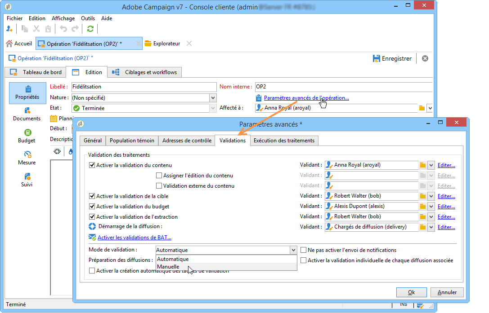

# Approbation des campagnes marketing {#approving-marketing-campaigns}

## Processus de validation {#approval-process}

Chaque étape d&#39;une diffusion peut faire l&#39;objet d&#39;une validation afin d&#39;assurer un suivi et un contrôle complet des différents traitements de l&#39;opération : ciblage, contenu, budget, extraction ou envoi d&#39;un BAT.

>[!NOTE]
>
>Vous devez vérifier que les réviseurs disposent des droits appropriés pour l’approbation. Vérifiez également que leur zone de sécurité est correctement définie.

Des emails de notification sont envoyés aux opérateurs Adobe Campaign désignés comme validants afin de les avertir d&#39;une demande de validation.

La procédure d&#39;approbation est présentée dans [Vérification et approbation des livraisons](#checking-and-approving-deliveries).

>[!NOTE]
>
>Seul le propriétaire d&#39;une diffusion peut démarrer cette dernière. Pour qu&#39;un autre opérateur (ou un groupe d&#39;opérateurs) puisse démarrer une diffusion, vous devez l&#39;ajouter comme validant au niveau du champ **[!UICONTROL Démarrage de la diffusion]**.\
>Voir aussi [Sélection de réviseurs](#selecting-reviewers).

### Principe de fonctionnement {#operating-principle-}

Par exemple, pour la validation du budget, le mail standard sera le suivant :

Les opérateurs validants peuvent alors choisir de valider ou non l&#39;étape concernée.

Après confirmation du choix de l&#39;opérateur, la validation ou le refus du traitement est remontée au niveau du tableau de bord de la diffusion.

L&#39;information est également disponible dans les logs de validation de l&#39;opération. Ils sont accessibles à partir de l&#39;onglet **[!UICONTROL Edition > Tracking > Validations]** :

Ces messages de notification sont envoyés aux opérateurs spécifiés pour chaque traitement pour lequel la validation a été activée.

Les validations peuvent être activées au niveau du modèle de l&#39;opération, au niveau de chaque opération ou au niveau de la diffusion.

**[!UICONTROL Toutes les tâches nécessitant une approbation sont sélectionnées dans le modèle de campagne (]** Propriétés **[!UICONTROL > Paramètres de campagne]** avancés... > **[!UICONTROL onglet Approbations]** ), tout comme les opérateurs chargés de l’approbation (ils recevront des notifications, sauf si cette option n’est pas activée). For more on this, refer to [Approving processes](#approving-processes).

Ce paramétrage peut être surchargé au niveau de chaque opération créée depuis ce modèle et également unitairement au niveau de chacune des diffusions de l&#39;opération, en cliquant sur le bouton **[!UICONTROL Propriétés]** puis sur l&#39;onglet **[!UICONTROL Validations]**.

Dans l&#39;exemple ci-dessous, le contenu de cette diffusion courrier ne fera l&#39;objet d&#39;aucune validation :

### Sélection des opérateurs validants {#selecting-reviewers}

Pour chaque type de validation, les opérateurs ou groupes d&#39;opérateurs validants sont sélectionnés dans la liste déroulante de la validation concernée. Des opérateurs supplémentaires peuvent être ajoutés depuis le lien **[!UICONTROL Editer...]**. Cette fenêtre vous permet également de modifier la date limite de la validation.

Si aucun opérateur validant n&#39;est identifié, le responsable de l&#39;opération sera chargé de la validation. Les notifications lui seront alors adressées. Le responsable de l&#39;opération est désigné dans l&#39;onglet **[!UICONTROL Edition > Propriétés]** de l&#39;opération :

>[!NOTE]
>
>Tous les autres opérateurs Adobe Campaign ayant des droits **[!UICONTROL Administrateur]** sont également habilités à valider les traitements. En revanche, ils ne reçoivent pas de notifications.\
>Par défaut, le responsable de la campagne ne peut pas effectuer de validation ou démarrer les diffusions si des opérateurs validants sont définis. Vous pouvez modifier ce comportement et autoriser le responsable de la campagne à valider/démarrer les diffusions en créant l&#39;option **NmsCampaign_Activate_OwnerConfirmation** avec pour valeur **1**.

### Modes de validation {#approval-modes}

#### Validation via le tableau de bord {#approval-via-the-dashboard}

Pour valider un traitement depuis la console ou l&#39;interface web, cliquez sur le lien correspondant dans le tableau de bord de l&#39;opération. Il est également possible de valider un traitement à partir du tracking des diffusions et du tableau de bord de la diffusion.

Vérifiez les informations, puis acceptez ou refusez la validation. Saisissez éventuellement un commentaire et cliquez sur **[!UICONTROL Ok]** pour enregistrer.

>[!NOTE]
>
>Lorsqu&#39;un traitement a déjà été validé par un opérateur, le lien de validation n&#39;est pas proposé.

#### Validation via les messages de notification {#approval-via-notification-messages}

Cliquez sur le lien disponible dans le message de notification (voir [Notifications](#notifications)). Vous serez invité à vous identifier, comme illustré ci-dessous :

Sélectionnez **[!UICONTROL Accepter]** ou **[!UICONTROL Refuser]** et saisissez éventuellement un commentaire.

Cliquez sur **[!UICONTROL Valider]**.

>[!NOTE]
>
>Si des alertes ont été générées par le traitement, un message d&#39;avertissement est affiché dans la notification.

#### Suivi des validations {#approval-tracking}

Les informations sont remontées à différents niveaux :

* Au niveau du journal des validations de l&#39;opération, sous-onglet **[!UICONTROL Validations]** de l&#39;onglet **[!UICONTROL Edition > Tracking]** :

   

* Dans le journal des diffusions de l&#39;opération, sous-onglet **[!UICONTROL Diffusions]** de l&#39;onglet **[!UICONTROL Edition > Tracking]** :

   

* Au niveau de chaque diffusion, l&#39;état des validations peut être consulté en cliquant sur l&#39;option **[!UICONTROL Afficher/cacher le journal]**, dans l&#39;onglet **[!UICONTROL Résumé]** :

   

* Ces informations sont également accessibles depuis l&#39;onglet **[!UICONTROL Tracking > Validations]** de chaque diffusion :

   

>[!NOTE]
>
>Lorsqu&#39;un opérateur a enregistré une réponse pour une validation, les autres opérateurs validants ne peuvent plus agir sur la validation.

#### Validation automatique et validation manuelle {#automatic-and-manual-approval}

Lors de la création d&#39;un workflow de ciblage, lorsque la validation est automatique (mode par défaut), Adobe Campaign propose le lien de validation ou envoie une notification dès qu&#39;un ciblage est à valider.

Pour sélectionner le mode de validation (manuelle ou automatique), cliquez sur l&#39;onglet **[!UICONTROL Edition > Propriétés]** de l&#39;opération ou du modèle d&#39;opération, puis sur l&#39;option **[!UICONTROL Paramètres avancés de l&#39;opération...]**, et enfin sur l&#39;onglet **[!UICONTROL Validations]**.

>[!NOTE]
>
>Le mode de validation sélectionné sera appliqué à toutes les diffusions de l&#39;opération.

La validation manuelle permet, lors de la construction du workflow de ciblage, de ne pas créer les liens de validation et envoyer les notifications automatiquement. Le tableau de bord de l&#39;opération propose alors un lien **[!UICONTROL Soumettre le ciblage à validation]** afin de lancer le processus de validation manuellement.

Un message de confirmation vous permet d’autoriser les approbations pour les tâches sélectionnées pour cette remise.

Les boutons de validation sont alors affichés dans le tableau de bord de l&#39;opération (au niveau de cette diffusion), dans le tableau de bord de la diffusion et dans le tracking des diffusions. Si les notifications sont activées, elles seront parallèlement envoyées.

Ce mode d&#39;activation des validations permet de travailler sur des recherches de ciblage sans notifier les opérateurs validants de façon intempestive.

### Notifications {#notifications}

Les notifications sont des emails spécifiques envoyés aux opérateurs validants afin de les avertir qu&#39;un traitement est en attente de validation. Lorsque l&#39;opérateur clique sur le lien contenu dans le message, il accède à une page d&#39;authentification. Après connexion, il peut consulter les éléments concernés puis valider ou non le traitement. Il peut également saisir un commentaire dans la fenêtre de validation.

Le contenu des courriers électroniques de notification peut être personnalisé. Voir Contenu [des](#notification-content)notifications.

#### Activation/Désactivation de la notification {#enabling-disabling-notification}

Par défaut, les messages de notification sont envoyés si la validation du traitement correspondant est activée au niveau du modèle de l&#39;opération, au niveau de l&#39;opération ou au niveau de la diffusion concernée. Toutefois, il est possible de désactiver les notifications afin de n&#39;autoriser les validations que depuis la console.

Pour cela, éditez la fenêtre de validation de l&#39;opération ou du modèle d&#39;opération concerné (onglet **[!UICONTROL Edition > Propriétés]** > **[!UICONTROL Paramètres avancés de l&#39;opération...]** > **[!UICONTROL Validations]**) et cochez l&#39;option **[!UICONTROL Ne pas activer l&#39;envoi de notifications]**.

#### Contenu des messages de notification {#notification-content}

Le contenu des notifications est défini dans un modèle spécifique : **[!UICONTROL Notification des validations dans une opération marketing]**. Ce modèle est enregistré dans le dossier **[!UICONTROL Administration > Gestion de campagne > Modèles des diffusions techniques]** de l&#39;arborescence Adobe Campaign.

## Contrôler et valider les diffusions {#checking-and-approving-deliveries}

Adobe Campaign vous permet de configurer des processus d’approbation pour les principales étapes de la campagne marketing en mode collaboratif.

Pour les livraisons par courrier direct, les opérateurs Adobe Campaign peuvent afficher le fichier d&#39;extraction avant qu&#39;il ne soit envoyé au routeur et, si nécessaire, modifier le format et relancer l&#39;extraction. See [Approving an extraction file](#approving-an-extraction-file).

Pour chaque campagne, vous pouvez approuver la cible de diffusion, le contenu (voir [Approbation de contenu](#approving-content)) et les coûts. Les opérateurs Adobe Campaign en charge de l’approbation peuvent être avertis par courrier électronique et peuvent accepter ou refuser l’approbation de la console ou par une connexion Web. Voir [Approbation de processus](#approving-processes).

Une fois ces phases de validation terminées, la remise peut être lancée. Voir [Démarrage d’une remise](../../campaign/using/marketing-campaign-deliveries.md#starting-a-delivery).

>[!NOTE]
>
>For further information about approval modes and tracking, see [Approval process](#approval-process).

### Valider les traitements {#approving-processes}

Les étapes qui doivent être approuvées apparaissent dans le tableau de bord de la campagne (via la console de l’interface Web). Elles apparaissent également dans le tableau de suivi des remises et dans le tableau de bord des remises.

Le statut de l&#39;opération est alors **[!UICONTROL A valider]**.

>[!NOTE]
>
>* Pour sélectionner les processus qui seront soumis à approbation, modifiez le modèle de campagne. For more on this, refer to [Campaign templates](../../campaign/using/marketing-campaign-templates.md#campaign-templates).
   >
   >
* Also refer to the section on the [Approval process](#approval-process).

>[!NOTE]
>
>Lors d&#39;un workflow de ciblage, si une erreur liée à un problème de paramétrage s&#39;est produite au cours de la préparation des messages, le tableau de bord propose le lien **[!UICONTROL Relancer la préparation des messages]**. Corrigez l&#39;erreur, puis cliquez sur ce lien afin de relancer la préparation des messages sans repasser par la phase de ciblage.

Pour chaque diffusion de l&#39;opération, il est possible de valider les traitements suivants :

* **Valider le ciblage, le contenu, le budget**

   Lorsque les options **[!UICONTROL Activer la validation de la cible]**, **[!UICONTROL Activer la validation du contenu]** ou **[!UICONTROL Activer la validation du budget]** sont sélectionnées dans la fenêtre de paramétrage de la validation des traitements, alors les liens correspondants sont proposés dans le tableau de bord de l&#39;opération pour les diffusions concernées.

   >[!NOTE]
   >
   >La validation du budget n&#39;est disponible que si vous avez activé la validation du ciblage, dans la fenêtre de paramétrage de la validation des traitements. Le lien proposant la validation du budget ne s&#39;affiche qu&#39;une fois que la cible a été analysée. De plus, ce lien s&#39;affiche en même temps que le lien proposant la validation du ciblage.

   Lorsque les options **[!UICONTROL Assigner l&#39;édition du contenu]** ou **[!UICONTROL Validation externe du contenu]** sont sélectionnées dans la fenêtre de paramétrage de la validation des traitements, le tableau de bord propose respectivement les liens **[!UICONTROL Contenu disponible]** et **[!UICONTROL Validation externe du contenu]**.

   La validation du contenu permet d&#39;accéder aux BAT envoyés.

* **Valider l&#39;extraction (diffusion courrier)**

   Lorsque l&#39;option **[!UICONTROL Activer la validation de l&#39;extraction]** est sélectionnée dans la fenêtre de paramétrage de la validation des traitements, le fichier extrait doit être validé avant que le routeur puisse être notifié.

   Un lien **[!UICONTROL Valider le contenu]** est proposé dans le tableau de bord de l&#39;opération, comme dans l&#39;exemple ci-dessous :

   

   Vous pouvez visualiser un aperçu du fichier d&#39;extraction à partir de la boîte de validation puis accepter ou non la validation.

   

   >[!NOTE]
   >
   >La prévisualisation du fichier d&#39;extraction porte sur un échantillon de données. Elle ne charge pas l&#39;intégralité du fichier de sortie.

* **Valider les diffusions associées**

   L&#39;option **[!UICONTROL Activer la validation individuelle de chaque diffusion associée]** est utilisée dans le cas d&#39;une diffusion principale associée à des diffusions secondaires. Par défaut, cette option n&#39;est pas cochée ce qui permet d&#39;effectuer une validation globale au niveau de la diffusion principale. Si cette option est sélectionnée, chaque diffusion devra faire l&#39;objet d&#39;une validation.

   

#### Sélection des processus à approuver {#choosing-the-processes-to-be-approved}

Les phases d’approbation sont définies avec le modèle associé à la campagne. Vous devez sélectionner les éléments à approuver à partir du modèle et spécifier les opérateurs Adobe Campaign qui seront responsables de ces approbations. For more on this, refer to [Campaign templates](../../campaign/using/marketing-campaign-templates.md#campaign-templates).

>[!NOTE]
>
>Le paramétrage des validations effectué au niveau de l&#39;opération ou du modèle d&#39;opération sera appliqué à toutes les futures diffusions liées à cette opération. Toute modification de paramétrage ne sera pas appliquée aux diffusions antérieures.

Ces informations peuvent cependant être surchargées au niveau de chaque opération et de chacune des diffusions.

Au niveau de l&#39;opération, cliquez sur l&#39;onglet **[!UICONTROL Edition > Propriétés]**, puis sur le lien **[!UICONTROL Paramètres avancés de l&#39;opération...]** et enfin sur le sous-onglet **[!UICONTROL Validations]** pour accéder à la page de paramétrage du mode de validation des traitements.

Vous pouvez sélectionner et désélectionner les traitements à valider et désigner les opérateurs Adobe Campaign chargés de la validation. Il peut s&#39;agir d&#39;un opérateur individuel, d&#39;un groupe d&#39;opérateurs ou d&#39;une liste d&#39;opérateurs.

Pour désigner une liste d&#39;opérateurs, cliquez sur le lien **[!UICONTROL Editer...]** situé à droite du champ désignant le premier validant et ajoutez autant d&#39;opérateurs additionnels que nécessaire, comme dans l&#39;exemple ci-dessous :

>[!NOTE]
>
>* Lorsqu&#39;une liste de validants est définie, le traitement est validé dès que l&#39;un des opérateurs de la liste a donné son accord. Le lien de validation correspondant n&#39;est alors plus proposé dans le tableau de bord. Lorsque l&#39;envoi de notifications est activé et qu&#39;un autre validant clique sur le lien de validation du mail de notification, il est alors averti qu&#39;un autre opérateur a déjà validé le traitement.
>* Vous pouvez définir un planning de validation pour l&#39;opération, dans la section inférieure de la fenêtre d&#39;édition des validants. Par défaut, les validants ont trois jours à partir de la date de soumission pour valider les traitements. Il est possible de définir un rappel qui sera automatiquement envoyé aux opérateurs concernés avant l&#39;expiration du délai de validation.
>* Vous pouvez ajouter des rappels depuis cette section.
>

Au niveau de chaque diffusion, cliquez sur le bouton **[!UICONTROL Suivi]** puis sur l&#39;onglet **[!UICONTROL Validations]** pour visualiser et modifier les dates de validation et de rappel calculées automatiquement.

>[!NOTE]
>
>Cet onglet est disponible lorsque la validation du contenu est démarrée.

### Valider le contenu {#approving-content}

>[!CAUTION]
>
>Pour valider un contenu, vous devez toujours passer par un cycle de Bon A Tirer (BAT). En effet, les BAT permettent de valider l&#39;affichage des informations, les données de personnalisation, ainsi que le bon fonctionnement des liens. Le mode de création d&#39;un BAT et son cycle de vie sont présentés dans la section [Envoyer les messages](../../delivery/using/steps-validating-the-delivery.md#sending-a-proof).
>
>Les fonctionnalités de validation du contenu présentées ci-après doivent venir en complément de l&#39;envoi des BAT.

Il est possible de configurer un cycle d’approbation du contenu. Pour ce faire, sélectionnez l’option **[!UICONTROL Activer l’approbation]** du contenu dans la fenêtre des paramètres d’approbation. Les étapes principales du cycle d’approbation du contenu sont les suivantes :

1. Après la création d&#39;une nouvelle diffusion, le responsable de l&#39;opération clique sur le lien **[!UICONTROL Soumettre le contenu]**, dans le tableau de bord de l&#39;opération, pour lancer le cycle de validation du contenu.

   

   >[!NOTE]
   >
   >Si vous avez sélectionné, dans la fenêtre de paramétrage de la validation des traitements, l&#39;option **[!UICONTROL Activer l&#39;envoi des BAT]** (pour une diffusion email) ou **[!UICONTROL Activer l&#39;envoi et la validation des BAT]** (pour une diffusion courrier), l&#39;envoi des BAT se fait automatiquement.

1. Un email de notification est envoyé au responsable du contenu. Celui-ci choisi alors de valider ou non le contenu :

   * à partir de l&#39;email de notification :

      

      >[!NOTE]
      >
      >L&#39;email de notification propose un lien vers les BAT envoyés, et éventuellement vers le rendu du message dans les différents webmails, sous réserve que l&#39;option **Deliverability** soit active pour cette instance.

   * à partir de la console ou de l&#39;interface web, au niveau du tracking des diffusions, du tableau de bord de la diffusion ou du tableau de bord de l&#39;opération :

      

      >[!NOTE]
      >
      >Dans le tableau de bord de l&#39;opération, vous pouvez visualiser la liste des BAT envoyés, en cliquant sur le lien **[!UICONTROL Inbox Rendering...]**. Vous pouvez consulter leur contenu en cliquant sur l&#39;icône **[!UICONTROL Détails]** située à droite de la liste.

      

1. Un courrier électronique de notification est envoyé à la personne responsable de la campagne pour l’informer de l’approbation ou non du contenu.

   >[!NOTE]
   >
   >A tout moment, le responsable de l&#39;opération peut relancer le cycle de validation du contenu. Pour cela, cliquez sur le lien situé sur la ligne **[!UICONTROL Etat du contenu]**, dans le tableau de bord de l&#39;opération (au niveau de la diffusion), puis cliquez sur **[!UICONTROL Réinitialiser la validation du contenu pour la soumettre à nouveau.]**

   

#### Assigner l&#39;édition du contenu {#assign-content-editing}

Cette option permet de définir un responsable de l&#39;édition du contenu, par exemple un webmaster. Lorsque l&#39;option **[!UICONTROL Assigner l&#39;édition du contenu]** est sélectionnée dans la fenêtre de paramétrage de la validation des traitements, plusieurs étapes de validation sont ajoutées entre la création de la diffusion et l&#39;envoi de l&#39;email de notification au responsable du contenu :

1. Après la création d&#39;une nouvelle diffusion, le responsable de l&#39;opération clique sur le lien **[!UICONTROL Soumettre l&#39;édition du contenu]**, dans le tableau de bord de l&#39;opération, pour lancer le cycle d&#39;édition du contenu.

   

1. Le responsable de l&#39;édition du contenu reçoit un email l&#39;informant de la mise à disposition du contenu.

   

1. Il se connecte à la console, ouvre la diffusion et l&#39;édite via un assistant d&#39;édition simplifié lui permettant de modifier l&#39;objet, le contenu HTML et texte, et d&#39;envoyer des BAT.

   

   >[!NOTE]
   >
   >Si vous avez sélectionné, dans la fenêtre de paramétrage de la validation des traitements, l&#39;option **[!UICONTROL Activer l&#39;envoi des BAT]** (pour une diffusion email) ou **[!UICONTROL Activer l&#39;envoi et la validation des BAT]** (pour une diffusion courrier), l&#39;envoi des BAT se fait automatiquement.

1. Lorsqu&#39;il a terminé l&#39;édition du contenu de la diffusion, le responsable de l&#39;édition du contenu peut mettre le contenu à disposition.

   Pour cela, il peut :

   * cliquer sur le lien **[!UICONTROL Contenu disponible]** à partir de la console Adobe Campaign.

      

   * cliquer sur le lien proposé dans le message de notification puis valider la mise à disposition du contenu.

      

      L&#39;opérateur peut ajouter un commentaire avant de soumettre le contenu au responsable de l&#39;opération.

      

      Le message de notification permet au responsable de valider ou refuser le contenu qui lui a été soumis.

      

#### Validation externe du contenu {#external-content-approval}

Cette option permet de définir un responsable externe du contenu qui validera le rendu de la diffusion, par exemple la cohérence de la communication de la marque, les tarifs annoncés, etc. Lorsque l&#39;option **[!UICONTROL Validation externe du contenu]** est sélectionnée dans la fenêtre de paramétrage de la validation des traitements, plusieurs étapes de validation sont ajoutées entre la validation du contenu par le responsable du contenu et l&#39;envoi de l&#39;email de notification au responsable de l&#39;opération :

1. Le responsable externe du contenu reçoit un email de notification l&#39;informant que le contenu a été validé et que la validation externe doit être effectuée.
1. L&#39;email de notification propose des liens vers les BAT envoyés, lui permettant de visualiser le rendu de la diffusion, et un bouton pour valider ou refuser le contenu de la diffusion.

   >[!NOTE]
   >
   >Ces liens ne sont disponibles que si un ou plusieurs BAT ont été envoyés. Si ce n&#39;est pas le cas, vous devez accéder à la console ou l&#39;interface web pour visualiser le rendu de la diffusion.

   

### Valider un fichier d&#39;extraction {#approving-an-extraction-file}

Pour les diffusions offline, Adobe Campaign génère un fichier d&#39;extraction qui, selon le paramétrage, est transmis au routeur. Le contenu du fichier dépend du modèle d&#39;export utilisé.

Une fois le contenu, le ciblage et le budget validés, la diffusion passe à l&#39;état **[!UICONTROL Extraction en attente]**, en attendant le lancement du workflow d&#39;extraction pour les opérations.

A la date de la demande d&#39;extraction, le fichier d&#39;extraction est créé et la diffusion passe à l&#39;état **[!UICONTROL Fichier à valider]**.

Vous pouvez visualiser le contenu du fichier extrait (en cliquant sur son nom), le valider, ou, au besoin, modifier le format et relancer l&#39;extraction, via les liens proposés dans le tableau de bord.

Une fois le fichier approuvé, vous pouvez envoyer l&#39;e-mail de notification au routeur. Pour plus d’informations, reportez-vous à [Démarrage d’une diffusion](../../campaign/using/marketing-campaign-deliveries.md#starting-an-offline-delivery)hors ligne.
