# Gestion des documents associés {#managing-associated-documents}

Vous pouvez associer divers documents à une opération : rapports, photos, pages web, diagrammes et bien d’autres. Ces documents peuvent avoir n’importe quel format (Microsoft Word, PowerPoint, PNG, JPG, Acrobat PDF et autres).

>[!IMPORTANT]
>
>Cette fonctionnalité est réservée aux petites ressources et documents.

Dans une campagne, vous pouvez également faire référence à d’autres éléments, tels que des coupons promotionnels, des offres spéciales relatives à une marque ou à un magasin spécifique et bien plus. Lorsque ces éléments sont inclus dans une composition, ils peuvent être associés à une diffusion courrier. Voir à ce sujet la section [Association et structure des ressources liées via une composition de diffusion](#associating-and-structuring-resources-linked-via-a-delivery-outline).

>[!NOTE]
>
>Si vous utilisez le module de gestion de ressources marketing de Campaign, vous pouvez également gérer une bibliothèque de ressources marketing sur lesquelles plusieurs intervenants peuvent agir dans un mode collaboratif. [En savoir plus](../../mrm/using/managing-marketing-resources.md).

## Ajout de documents {#adding-documents}

Des documents peuvent être associés au niveau de l&#39;opération (documents contextuels) ou au niveau du programme (documents généraux).

L&#39;onglet **[!UICONTROL Documents]** contient :

* la liste de tous les documents nécessaires au contenu (maquette, images, etc.) qui pourront être téléchargés en local par les opérateurs Adobe Campaign possédant les droits adéquats,
* les documents contenant des informations destinées au routeur, s&#39;ils existent.

Les documents sont rattachés au programme ou à l&#39;opération via leur onglet **[!UICONTROL Edition > Documents]**.

Vous pouvez également ajouter un document dans une opération via le lien proposé dans son tableau de bord.

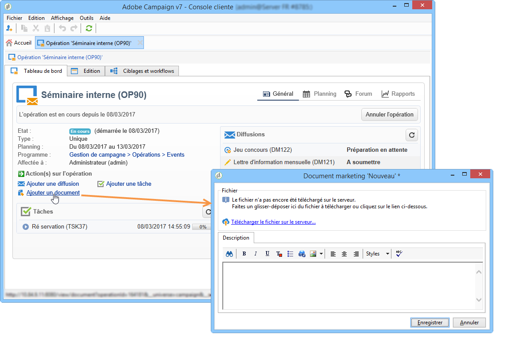

Cliquez sur l&#39;icône **[!UICONTROL Détails]** pour visualiser le contenu d&#39;un fichier et ajouter des informations complémentaires :

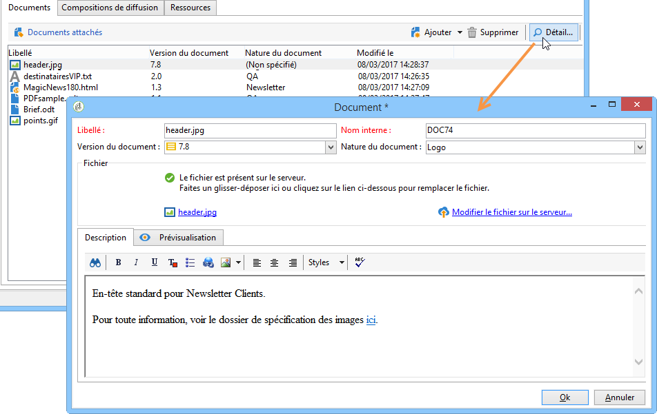

Au niveau du tableau de bord, les documents associés à l&#39;opération sont regroupés dans la section **[!UICONTROL Document(s)]**, comme dans l&#39;exemple ci-dessous :

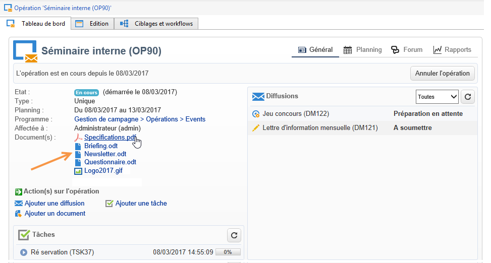

Ils peuvent également être édités et modifiés depuis cette vue.

## Association et structure des ressources liées via une composition de diffusion {#associating-and-structuring-resources-linked-via-a-delivery-outline}

>[!NOTE]
>
>Les compositions de diffusion sont exclusivement utilisées dans le cadre de campagnes courrier.

Une composition de diffusion désigne un ensemble structuré d’éléments (documents, magasins, coupons promotionnels et autres). créé par la société et pour une campagne particulière.

Ces éléments sont regroupés au sein de compositions de diffusions, chacune associée à une diffusion. La composition de diffusion sera référencée dans le fichier d’extraction envoyé au **fournisseur** afin d’être jointe à la diffusion. Par exemple, vous pouvez créer une composition de diffusion qui fait référence à une branche et aux brochures marketing qu’elle utilise.

Les compositions de diffusions permettent, au niveau de la campagne, de structurer des éléments externes qui seront associés à la diffusion en fonction de certains critères : branche de rattachement, offre promotionnelle accordée, invitation à un événement local, etc.

### Création d’une composition {#creating-an-outline}

Pour créer une composition, cliquez sur le sous-onglet **[!UICONTROL Compositions de diffusions]** proposé dans l&#39;onglet **[!UICONTROL Edition > Documents]** de l&#39;opération concernée.

>[!NOTE]
>
>Si cet onglet n&#39;est pas présent, alors cette fonctionnalité n&#39;est pas prise en compte pour cette opération. Reportez-vous à la configuration du modèle d&#39;opération.
>   
>Pour plus d’informations sur les modèles, reportez-vous à [cette section](../../campaign/using/marketing-campaign-templates.md#campaign-templates).

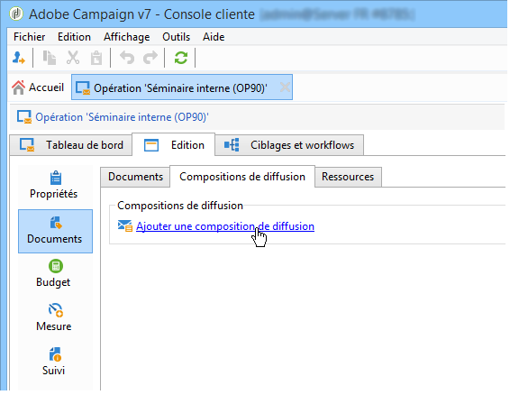

Cliquez ensuite sur **[!UICONTROL Ajouter une composition de diffusion]** et créez l&#39;arborescence des compositions pour l&#39;opération :

1. Cliquez avec le bouton droit sur la racine de l&#39;arborescence et choisissez **[!UICONTROL Nouveau > Compositions de diffusion]**.
1. Cliquez avec le bouton droit de la souris sur la composition que vous venez de créer et choisissez **[!UICONTROL Nouveau > Article]** ou **[!UICONTROL Nouveau > Champs de personnalisation]**.

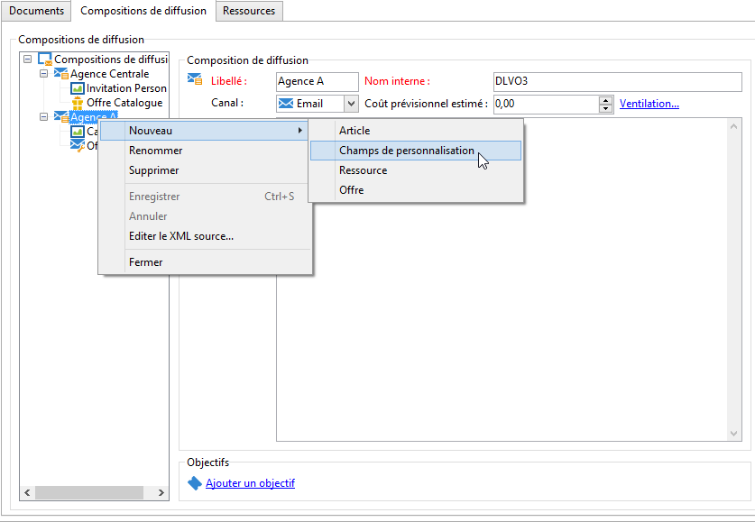

Une composition peut contenir des articles, des champs de personnalisation, des ressources et des offres :

* Les articles sont par exemple des documents physiques qui sont ici référencés et décrits, et seront joints à la diffusion.
* Les champs de personnalisation permettent de créer des éléments de personnalisation relatifs aux diffusions et non aux destinataires. Ainsi, il est possible de créer des valeurs qui seront utilisées dans les diffusions pour une cible spécifique (offre de bienvenue, pourcentage de réduction, etc.) Ils sont créés dans Adobe Campaign et importés dans la composition, via le lien **[!UICONTROL Importer des champs de personnalisation...]**.

   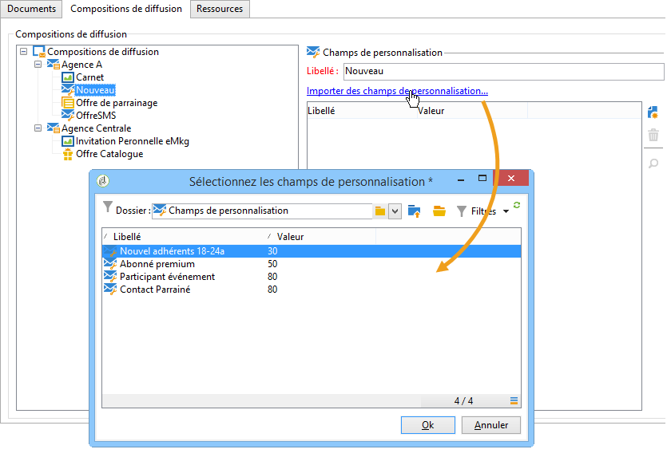

   Ils peuvent également être créés directement dans la composition, en cliquant sur l&#39;icône **[!UICONTROL Ajouter]** située à droite de la zone de liste.

   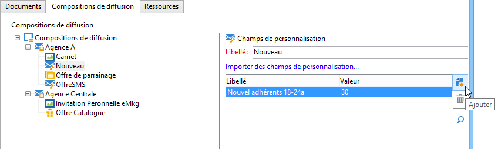

* Les ressources sont des ressources marketing générées dans le tableau de bord des ressources marketing, lequel est accessible à partir du lien **[!UICONTROL Ressources]** de l’onglet **[!UICONTROL Campagnes]**.

   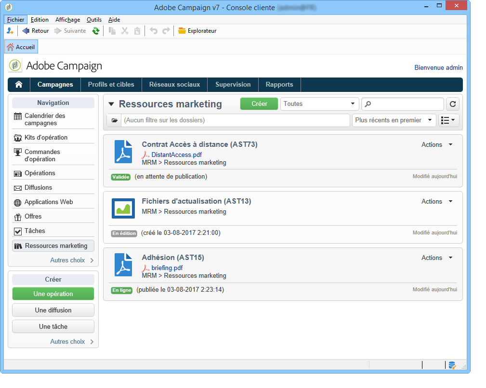

   >[!NOTE]
   >
   >Pour plus d’informations sur les ressources marketing, reportez-vous à [cette section](../../mrm/using/managing-marketing-resources.md).

### Sélection d’une composition {#selecting-an-outline}

Pour chaque diffusion, vous pouvez sélectionner la composition à associer à partir de la section réservée à la configuration de l&#39;extraction, comme dans l&#39;exemple ci-dessous :

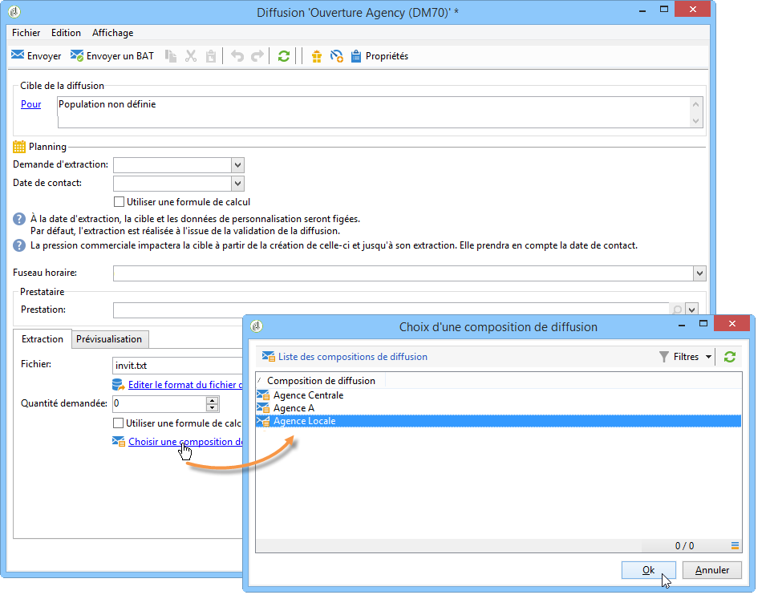

La composition sélectionnée est alors affichée dans la section inférieure de la fenêtre. Elle peut être éditée à partir de l&#39;icône située à droite du champ ou modifiée en utilisant la liste déroulante :

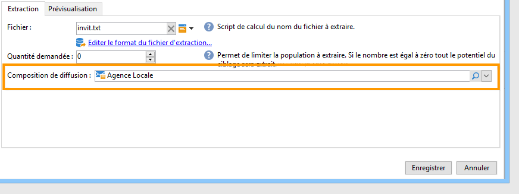

L&#39;onglet **[!UICONTROL Résumé]** de la diffusion affiche également cette information :

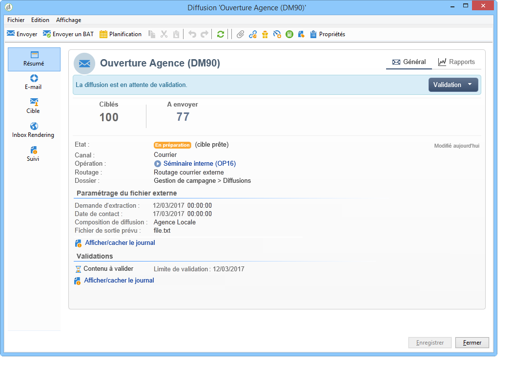

### Résultat de l&#39;extraction {#extraction-result}

Dans le fichier extrait et transmis au prestataire, le nom de la composition et éventuellement ses caractéristiques (coût, description, etc.) sont ajoutés au contenu, selon les informations présentes dans le modèle d&#39;export associé au prestataire.

Dans l&#39;exemple suivant, le libellé, le coût prévisionnel estimé et la description de la composition associée à la diffusion seront ajoutés dans le fichier d&#39;extraction.

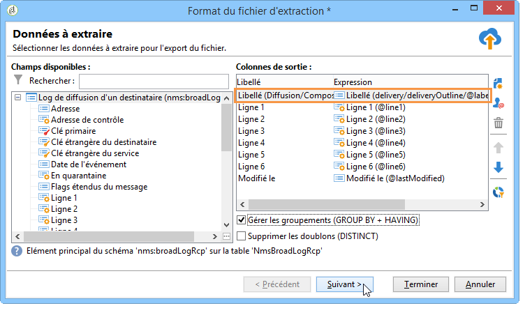

Le modèle d&#39;export doit être associé au prestataire sélectionné pour la diffusion concernée. Consultez [cette section](../../campaign/using/providers--stocks-and-budgets.md#creating-service-providers-and-their-cost-structures).

>[!NOTE]
>
>Pour plus d’informations sur les exports, reportez-vous à [cette section](../../platform/using/get-started-data-import-export.md).
