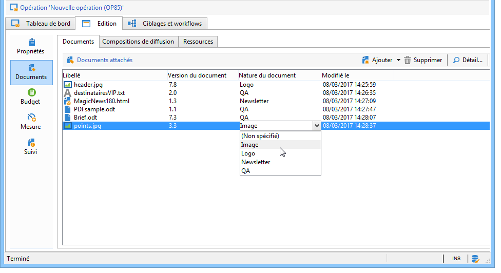
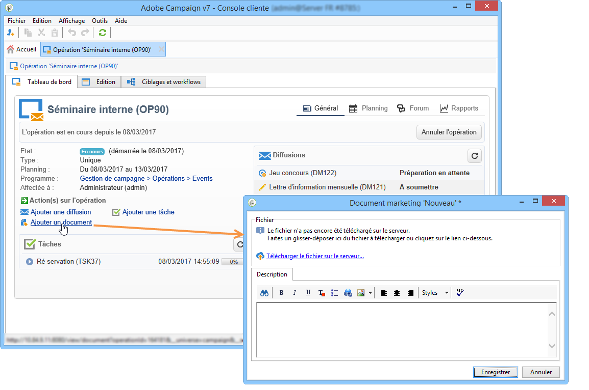
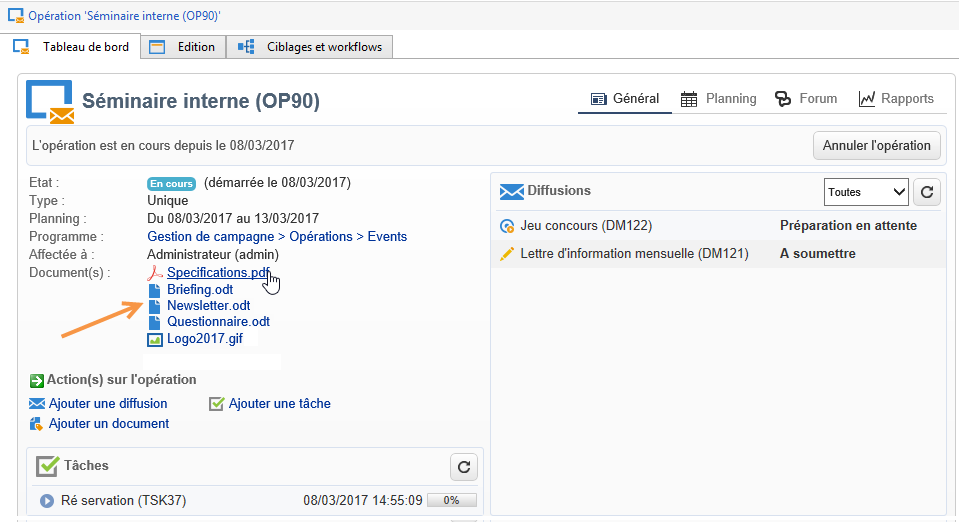
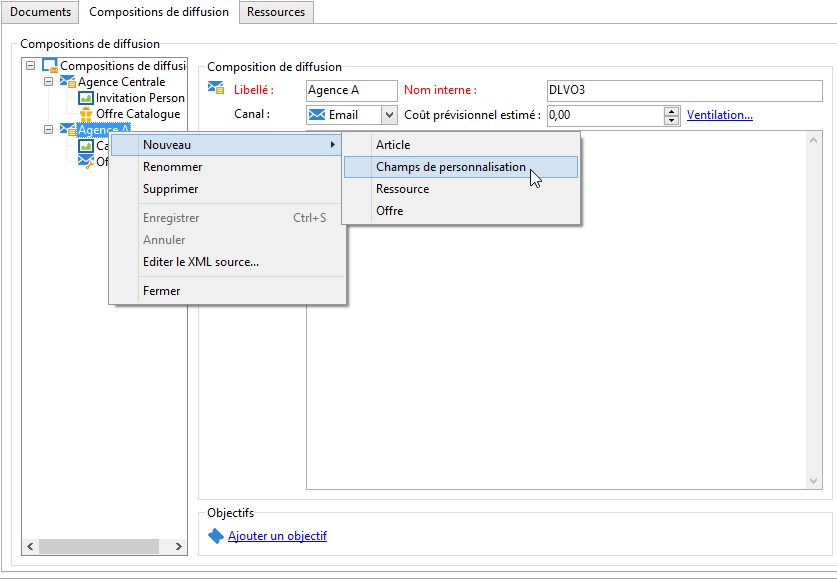
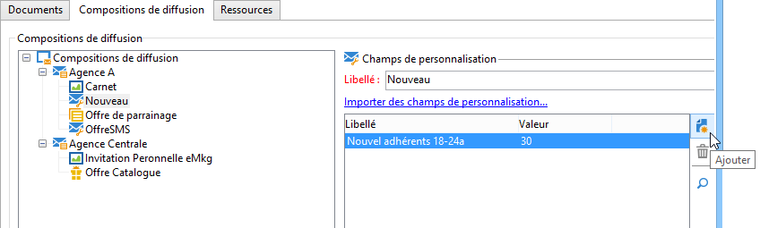
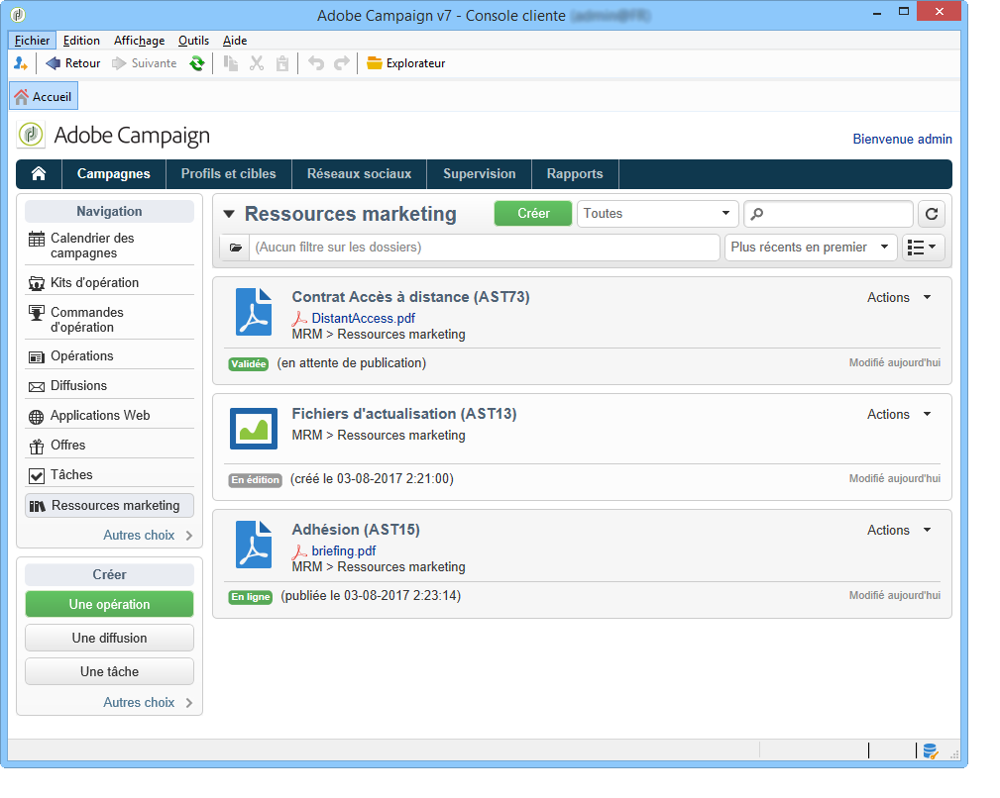
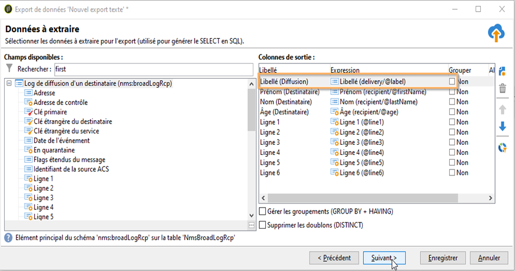

# Diffusions de campagnes marketing {#marketing-campaign-deliveries}

Les diffusions peuvent être créées depuis le tableau de bord d&#39;une opération, un workflow d&#39;opération ou directement à partir de la vue d&#39;ensemble des diffusions.

Une fois créées à partir d’une campagne, les diffusions y sont liées et sont consolidées au niveau de cette campagne.

[Découvrez cette fonctionnalité en vidéo](#create-email-video)

## Création de diffusions {#creating-deliveries}

Pour créer une diffusion associée à une opération, cliquez sur le lien **[!UICONTROL Ajouter une diffusion]** proposé dans le tableau de bord de l&#39;opération.

Les paramétrages proposés sont adaptés au type de diffusion : courrier, email, canaux mobiles. Pour en savoir plus, consultez la [documentation de Campaign v8](https://experienceleague.adobe.com/docs/campaign/campaign-v8/send/create-message.html){target="_blank"}.

## Démarrage dʼune diffusion {#starting-a-delivery}

Une fois que toutes les validations ont été accordées, la diffusion est prête à démarrer. La procédure dépend alors du type de diffusion. Pour les diffusions par email ou sur les canaux mobiles, voir la section [Démarrer une diffusion online](#starting-an-online-delivery) et pour les diffusions courrier, voir la section [Démarrer une diffusion offline](#starting-an-offline-delivery).

### Démarrage dʼune diffusion en ligne {#starting-an-online-delivery}

Une fois toutes les demandes de validation approuvées, l’état passe sur **[!UICONTROL À confirmer]** et la procédure peut être lancée. Le cas échéant, l’opérateur ou l’opératrice Adobe Campaign (ou le groupe) en charge de la révision dans le cadre du démarrage de la procédure reçoit une notification indiquant qu’une livraison est prête à être démarrée.

>[!NOTE]
>
>Si un opérateur spécifique ou groupe d&#39;opérateurs est désigné pour le démarrage de la diffusion dans les propriétés de cette dernière, vous pouvez également permettre à l&#39;opérateur en charge de la diffusion de confirmer l&#39;envoi. Pour cela activez l&#39;option **NMS_ActivateOwnerConfirmation** en indiquant comme valeur **1**. Les options sont gérées à partir du nœud **[!UICONTROL Administration]** > **[!UICONTROL Platform]** > **[!UICONTROL Options]** de l&#39;explorateur Adobe Campaign.
>  
>Pour désactiver cette option, indiquez **0** comme valeur. Le processus de confirmation des envois fonctionnera alors comme par défaut : seul l&#39;opérateur ou le groupe d&#39;opérateurs désigné pour l&#39;envoi (ou un administrateur) dans les propriétés de la diffusion pourra confirmer et effectuer l&#39;envoi.

Les informations s’affichent également dans le tableau de bord de la campagne. Le lien **[!UICONTROL Confirmer la diffusion]** permet de lancer la diffusion.

Un message de confirmation permet de sécuriser cette action.

### Démarrage dʼune diffusion hors ligne {#starting-an-offline-delivery}

Une fois toutes les validations accordées, le statut de la diffusion passe à **[!UICONTROL En attente d&#39;extraction]**. Les fichiers d&#39;extraction sont créés via un workflow spécifique qui, dans une configuration par défaut, démarre automatiquement lorsqu&#39;une diffusion courrier est en attente d&#39;extraction. Lorsqu&#39;un processus est en cours, il est affiché dans le tableau de bord et peut être modifié à partir de son lien.

>[!NOTE]
>
>Les workflows techniques liés au kit de campagne sont présentés dans la [Liste des workflows techniques](../../workflow/using/about-technical-workflows.md).

**Etape 1 - Valider le fichier**

Une fois le workflow d&#39;extraction exécuté correctement, le fichier d&#39;extraction doit être validé (sous réserve que la validation du fichier d&#39;extraction ait été sélectionnée dans le paramétrage de la diffusion).

Pour plus dʼinformations, consultez la section [Validation dʼun fichier dʼextraction](../../campaign/using/marketing-campaign-approval.md#approving-an-extraction-file).

**Étape 2 : validation du message au prestataire**

* Une fois le fichier d’extraction validé, vous pouvez générer le BAT de l’e-mail de notification au routeur. Ce message e-mail est construit à partir d’un modèle de diffusion. Il doit être approuvé.

  >[!NOTE]
  >
  >Cette étape n&#39;est proposée que si l&#39;envoi et la validation des BAT ont été activés à partir de la fenêtre des validations.

* Cliquez sur le bouton **[!UICONTROL Envoyer un BAT]** pour lancer la création des BAT.

  La cible des BAT doit avoir été préalablement définie.

  Vous pouvez créer autant de BAT que nécessaire. Ces derniers sont accessibles via le lien **[!UICONTROL Courrier...]** dans le détail de la diffusion.

  

* Le statut de la diffusion passe alors à **[!UICONTROL À envoyer]**. Cliquez sur le bouton **[!UICONTROL Soumettre les BAT]** pour lancer le processus de validation.

  

* La diffusion passe à l&#39;état **[!UICONTROL BAT à valider]** et un bouton permet d&#39;accepter ou refuser la validation.

  

  Vous pouvez alors accepter ou refuser cette validation, ou revenir à l&#39;étape d&#39;extraction

  

* Puis le fichier d&#39;extraction est envoyé au routeur et la diffusion est terminée.

### Calcul des coûts et des stocks {#calculation-of-costs-and-stocks}

L&#39;extraction du fichier lance deux opérations : le calcul des budgets et le calcul des stocks. Les lignes budgétaires sont mises à jour.

* L&#39;onglet **[!UICONTROL Budget]** vous permet de gérer les budgets de la campagne. Le cumul des lignes de coût est repris dans le champ **[!UICONTROL Coût calculé]** de l&#39;onglet principal de l&#39;opération et du programme auquel elle appartient. Les montants sont également répercutés dans le budget de la campagne.

  Le coût réel sera calculé au final en fonction des informations fournies par le routeur : seuls les messages réellement envoyés sont facturés.

* Les stocks sont définis dans le noeud **[!UICONTROL Administration > Gestion de campagne > Stocks]** de l&#39;arborescence, et les structures de coût, dans le noeud **[!UICONTROL Administration > Gestion de campagne > Prestataires]**.

  Au niveau des stocks, vous pouvez visualiser les lignes de stocks. Pour définir le stock initial, vous devez ouvrir une ligne de stock. Le stock est décrémenté au fur et à mesure des diffusions. Vous pouvez définir un niveau d&#39;alerte et des notifications.

>[!NOTE]
>
>Pour plus d&#39;informations sur le calcul des coûts et la gestion des stocks, voir la section [Prestataires, stocks et budgets](../../campaign/using/providers-stocks-and-budgets.md).

## Gestion des documents associés {#managing-associated-documents}

Vous pouvez associer divers documents à une opération, comme des rapports, photos, pages web, diagrammes, etc. Ces documents peuvent avoir n’importe quel format (Microsoft Word, PowerPoint, PNG, JPG, Acrobat PDF et autres). Découvrez comment lier des documents à une campagne [dans cette section](../../campaign/using/marketing-campaign-assets.md).

>[!IMPORTANT]
>
>Ce mode d&#39;échange est réservé à des documents de faible volume (quelques Mo maximum).

Vous pouvez également référencer dans les opérations des éléments externes, créés dans l&#39;entreprise, tels que des coupons promotionnels, des offres spécifiques à une agence ou à un magasin, etc. Regroupés dans une composition, ces éléments peuvent être associés à une diffusion courrier. [En savoir plus](#associating-and-structuring-resources-linked-via-a-delivery-outline).

>[!NOTE]
>
>Si vous utilisez MRM, vous pouvez également gérer une bibliothèque de ressources marketing sur lesquelles plusieurs intervenants peuvent agir dans un mode collaboratif. Consultez la section [Gestion des ressources marketing](../../mrm/using/managing-marketing-resources.md).

### Ajout de documents {#adding-documents}

Des documents peuvent être associés au niveau de l&#39;opération (documents contextuels) ou au niveau du programme (documents généraux).

L&#39;onglet **[!UICONTROL Documents]** contient :

* la liste de tous les documents nécessaires au contenu (maquette, images, etc.) qui pourront être téléchargés en local par les opérateurs Adobe Campaign possédant les droits adéquats,
* les documents contenant des informations destinées au routeur, s&#39;ils existent.

Les documents sont rattachés au programme ou à l&#39;opération via leur onglet **[!UICONTROL Edition > Documents]**.

Vous pouvez également ajouter un document dans une opération via le lien proposé dans son tableau de bord.

Cliquez sur l&#39;icône **[!UICONTROL Détails]** pour visualiser le contenu d&#39;un fichier et ajouter des informations complémentaires :

Au niveau du tableau de bord, les documents associés à l&#39;opération sont regroupés dans la section **[!UICONTROL Document(s)]**, comme dans l&#39;exemple ci-dessous :

Ils peuvent également être édités et modifiés depuis cette vue.

### Association et structure des ressources liées via une composition de diffusion {#associating-and-structuring-resources-linked-via-a-delivery-outline}

>[!NOTE]
>
>Les compositions de diffusion sont exclusivement utilisées dans le cadre de campagnes courrier.

Une composition désigne un ensemble structuré d&#39;éléments (documents, agences/magasins, coupons promotionnels, etc.) créés dans l&#39;entreprise et pour une opération particulière.

Ces éléments sont regroupés dans des compositions, et telle ou telle composition sera associée à une diffusion : elle sera référencée dans le fichier d&#39;extraction transmis au **prestataire** afin d&#39;être jointe à la diffusion. Vous pouvez par exemple créer une composition qui référence une agence et les brochures marketing qu&#39;elle utilise.

Les compositions permettent, au niveau de l&#39;opération, de structurer des éléments externes qui seront associés à la diffusion en fonction de certains critères : agence de rattachement, offre promotionnelle accordée, invitation à un événement local, etc.

#### Création d’une composition {#creating-an-outline}

Pour créer une composition, cliquez sur le sous-onglet **[!UICONTROL Compositions de diffusions]** proposé dans l&#39;onglet **[!UICONTROL Edition > Documents]** de l&#39;opération concernée.

>[!NOTE]
>
>Si cet onglet n&#39;est pas présent, alors cette fonctionnalité n&#39;est pas prise en compte pour cette opération. Reportez-vous à la configuration du modèle d&#39;opération.
>   
>Voir à ce sujet la section [modèles d&#39;opération](../../campaign/using/marketing-campaign-templates.md#campaign-templates).

Cliquez ensuite sur **[!UICONTROL Ajouter une composition de diffusion]** et créez l&#39;arborescence des compositions pour l&#39;opération :

1. Cliquez avec le bouton droit sur la racine de l&#39;arborescence et choisissez **[!UICONTROL Nouveau > Compositions de diffusion]**.
1. Cliquez avec le bouton droit de la souris sur la composition que vous venez de créer et choisissez **[!UICONTROL Nouveau > Article]** ou **[!UICONTROL Nouveau > Champs de personnalisation]**.

Une composition peut contenir des articles, des champs de personnalisation, des ressources et des offres :

* Les articles sont par exemple des documents physiques qui sont ici référencés et décrits, et seront joints à la diffusion.
* Les champs de personnalisation permettent de créer des éléments de personnalisation relatifs aux diffusions et non aux destinataires. Ainsi, il est possible de créer des valeurs qui seront utilisées dans les diffusions pour une cible spécifique (offre de bienvenue, réduction, etc.) Ils sont créés dans Adobe Campaign et importés dans la composition, via le lien **[!UICONTROL Importer des champs de personnalisation...]**.

  

  Ils peuvent également être créés directement dans la composition, en cliquant sur l&#39;icône **[!UICONTROL Ajouter]** située à droite de la zone de liste.

  

* Les ressources sont des ressources marketing générées dans le tableau de bord des ressources marketing, qui est accessible à partir du lien **[!UICONTROL Ressources]** de l’onglet **[!UICONTROL Campagnes]**.

  

  >[!NOTE]
  >
  >Pour plus d&#39;informations sur les ressources marketing, voir la section [Gérer les ressources marketing](../../mrm/using/managing-marketing-resources.md).

#### Sélection d’une composition {#selecting-an-outline}

Pour chaque diffusion, vous pouvez sélectionner la composition à associer à partir de la section réservée à la configuration de l&#39;extraction, comme dans l&#39;exemple ci-dessous :

La composition sélectionnée est alors affichée dans la section inférieure de la fenêtre. Elle peut être éditée à partir de l&#39;icône située à droite du champ ou modifiée en utilisant la liste déroulante :

L&#39;onglet **[!UICONTROL Résumé]** de la diffusion affiche également cette information :

#### Résultat de l&#39;extraction {#extraction-result}

Dans le fichier extrait et transmis au prestataire, le nom de la composition et éventuellement ses caractéristiques (coût, description, etc.) sont ajoutés au contenu, selon les informations présentes dans le modèle d&#39;export associé au prestataire.

Dans l&#39;exemple suivant, le libellé, le coût prévisionnel estimé et la description de la composition associée à la diffusion seront ajoutés dans le fichier d&#39;extraction.

Le modèle d&#39;export doit être associé au prestataire sélectionné pour la diffusion concernée. Voir à ce sujet la section [Créer les prestataires et leurs structures de coûts](../../campaign/using/providers-stocks-and-budgets.md#creating-service-providers-and-their-cost-structures). 

>[!NOTE]
>
>Pour plus d&#39;informations sur les exports, reportez-vous à la section [Prise en main](../../platform/using/get-started-data-import-export.md).

#### Tutoriel vidéo {#create-email-video}

Cette vidéo explique comment créer une campagne et un e-mail dans Adobe Campaign.

>[!VIDEO](https://video.tv.adobe.com/v/25604?quality=12)

D’autres vidéos pratiques sur Campaign sont disponibles [ici](https://experienceleague.adobe.com/docs/campaign-classic-learn/tutorials/overview.html?lang=fr).
