# Livraisons de campagne marketing {#marketing-campaign-deliveries}

Les diffusions peuvent être créées depuis le tableau de bord d&#39;une opération, un workflow d&#39;opération ou directement à partir de la vue d&#39;ensemble des diffusions.

## Créer des diffusions {#creating-deliveries}

To create a delivery linked to a campaign, click the **[!UICONTROL Add a delivery]** link in the campaign dashboard.

Les paramétrages proposés sont adaptés au type de diffusion (courrier, email, canaux mobiles, fax ou téléphone).

>[!NOTE]
>
>Le mode de création et de paramétrage des diffusions est présenté dans la section [Envoyer les messages](../../delivery/using/communication-channels.md).

## Choisir la population cible {#selecting-the-target-population}

Pour chaque diffusion, le chargé d&#39;opération va définir :

* La cible principale. Pour plus d’informations, reportez-vous à [Création de la cible principale dans un flux de travail](#building-the-main-target-in-a-workflow) et [Sélection de la population](#selecting-the-target-population)cible.
* Groupe de contrôle. Pour plus d&#39;informations, reportez-vous à la section [Définition d&#39;un groupe](#defining-a-control-group)de contrôle.
* Les adresses de départ. Voir à ce propos [cette section](../../delivery/using/about-seed-addresses.md).

Certaines de ces informations sont héritées du modèle.

>[!NOTE]
>
>Les modèles de campagne sont présentés dans les modèles [de](../../campaign/using/marketing-campaign-templates.md#campaign-templates)campagne.

Vous pouvez définir des critères de filtrage des destinataires présents dans la base de données afin de construire la cible de la diffusion. Ce mode de sélection des destinataires est présenté dans la section [Envoyer les messages](../../delivery/using/steps-defining-the-target-population.md).

### Exemple : diffuser à un groupe de destinataires {#example--delivering-to-a-group-of-recipients}

Vous pouvez par exemple importer une population dans une liste puis cibler cette liste dans les diffusions.

1. To do this, edit the concerned delivery and click the **[!UICONTROL To]** link to change the targeted population.

1. Dans l’ **[!UICONTROL Main target]** onglet, sélectionnez l’ **[!UICONTROL Defined via the database]** option et cliquez **[!UICONTROL Add]** pour sélectionner les destinataires.

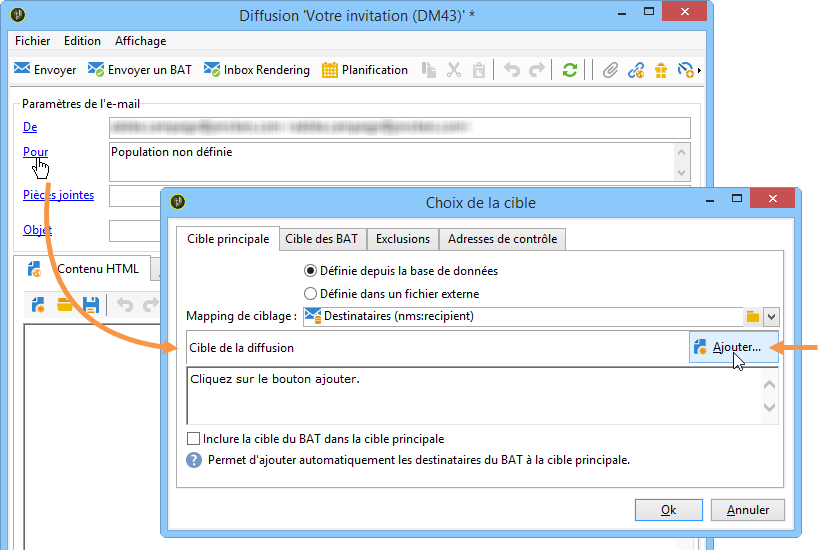

1. Choisissez **[!UICONTROL A list of recipients]** puis cliquez **[!UICONTROL Next]** pour le sélectionner.

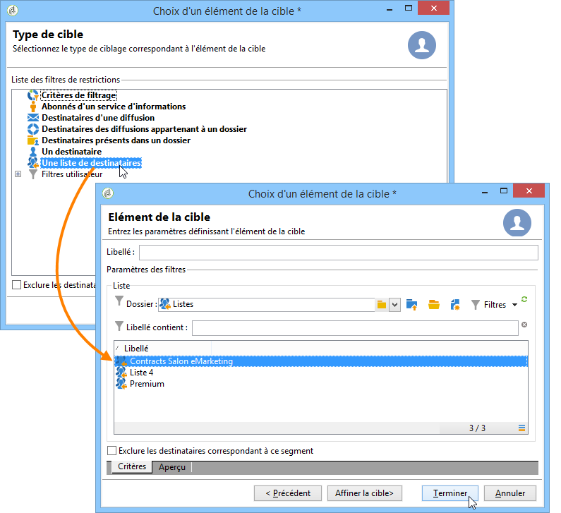

### Construire la cible principale dans un workflow {#building-the-main-target-in-a-workflow}

La cible principale d&#39;une diffusion peut également être définie au travers d&#39;un workflow de ciblage : cet environnement graphique permet de construire une cible via des requêtes, des tests et des unions, déduplications, partages, etc.

Le mode de fonctionnement du module de workflow est détaillé dans le guide [Automatiser avec des workflows](../../workflow/using/executing-a-workflow.md#architecture).

>[!IMPORTANT]
>
>Dans une même campagne, vous ne pouvez pas configurer plus de 28 workflows. Au-delà de cette limite, les workflows supplémentaires ne sont pas visibles dans l&#39;interface et peuvent générer des erreurs.

#### Créer un workflow de ciblage {#creating-a-targeting-workflow}

Le ciblage peut être créé via une combinaison de conditions de filtrage dans une séquence graphique d’un flux de travail. Vous pouvez créer des populations et des sous-populations qui seront ciblées selon vos besoins. Pour afficher l’éditeur de flux de travail, cliquez sur l’ **[!UICONTROL Targeting and workflows]** onglet dans le tableau de bord de la campagne.

La population cible est extraite de la base Adobe Campaign via une ou plusieurs requêtes qui sont positionnées dans un workflow. Pour découvrir comment construire une requête, consultez [cette section](../../workflow/using/query.md).

Il est possible de lancer des requêtes puis de partager les populations via des boîtes de type Union, Intersection, Partage, Exclusion, etc.

Sélectionnez les objets dans les listes situées à gauche de l&#39;espace de travail et enchaînez-les pour construire la cible.

Dans le diagramme, reliez ainsi entre elles les requêtes de ciblage et d&#39;ordonnancement nécessaires à la construction de la cible : vous pouvez exécuter le ciblage en cours de construction afin de contrôler la population extraite de la base de données.

>[!NOTE]
>
>Examples and procedure for defining queries are presented in [this section](../../workflow/using/query.md).

La section gauche de l&#39;éditeur contient une bibliothèque d&#39;objets graphiques qui représentent des activités. Le premier onglet regroupe les activités de ciblage et le deuxième onglet regroupe les activités d&#39;ordonnancement, qui sont utilisées plus occasionnellement afin de coordonner les activités de ciblage.

La barre d&#39;outils de l&#39;éditeur de diagramme permet d&#39;accéder aux fonctions de mise en page et d&#39;exécution du workflow de ciblage.

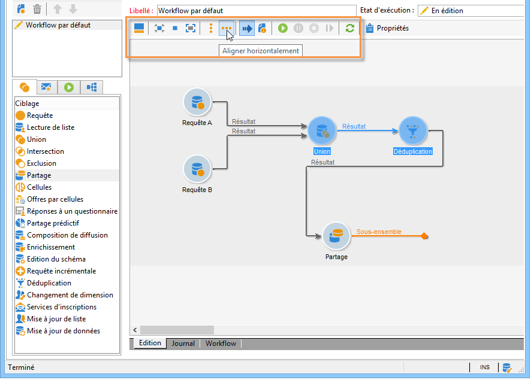

>[!NOTE]
>
>Les activités disponibles pour la construction du diagramme, ainsi que toutes les problématiques d&#39;affichage et de mise en page, sont présentées dans le guide [Automatiser avec des workflows](../../workflow/using/executing-a-workflow.md#architecture).

Vous pouvez créer plusieurs workflows de ciblage pour une même opération. Pour ajouter un workflow :

1. Accédez à la section supérieure gauche de la zone de création du processus, cliquez avec le bouton droit de la souris, puis sélectionnez **[!UICONTROL Add]**. Vous pouvez également utiliser le **[!UICONTROL New]** bouton situé au-dessus de cette zone.

   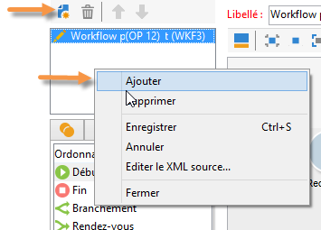

1. Select the **[!UICONTROL New workflow]** template and name this workflow.
1. Cliquez sur **[!UICONTROL OK]** pour valider la création du workflow, puis créez le diagramme pour ce workflow.

#### Exécuter un workflow {#executing-a-workflow}

Targeting workflows can be launched manually via the **[!UICONTROL Start]** button in the toolbar, provided that you have the appropriate rights.

Le ciblage peut être planifié afin de s&#39;exécuter automatiquement selon un planning (planificateur) ou un événement (signal externe, import d&#39;un fichier, etc.).

Les actions relatives à l&#39;exécution du workflow de ciblage (lancement, arrêt, pause, etc.) sont des processus **asynchrones** : la commande est enregistrée et sera effective dès que le serveur sera disponible pour l&#39;appliquer.

Les icônes de la barre d&#39;outils permettent d&#39;agir sur l&#39;exécution du workflow de ciblage.

* Démarrer ou redémarrer

   * L’ **[!UICONTROL Start]** icône vous permet de lancer le processus de ciblage. Lorsque vous cliquez sur cette icône, toutes les activités sans transition d’entrée sont activées (à l’exception des sauts de point de fin).

      

      La demande est prise en compte par le serveur, comme le notifie son état :

      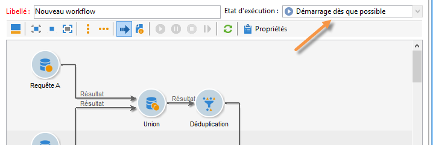

      The process status changes to **[!UICONTROL Started]**.

   * Vous pouvez redémarrer le processus de ciblage via l’icône de barre d’outils appropriée. Cette commande peut s’avérer utile si l’ **[!UICONTROL Start]** icône n’est pas disponible, par exemple lorsque l’arrêt du processus de ciblage est en cours. Dans ce cas, cliquez sur l’ **[!UICONTROL Restart]** icône pour anticiper le redémarrage. Le serveur prend la requête en compte, comme le montre son état :

      

      The process then enters **[!UICONTROL Started]** status.

* Arrêter ou suspendre

   * Les icônes de la barre d&#39;outils permettent d&#39;arrêter ou suspendre un workflow de ciblage en cours d&#39;exécution.

      When you click **[!UICONTROL Pause]**, operations in progress **[!UICONTROL are not]** paused, but no other activity is launched until the next restart.

      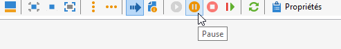

      La commande est prise en compte par le serveur, comme le notifie son état :

      

      You can also pause a targeting workflow automatically when its execution reaches a particular activity. To do this, right-click the activity from which targeting workflow is to be paused, and select **[!UICONTROL Enable but do not execute]**.

      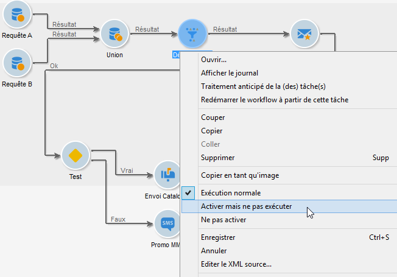

      Une icône spécifique matérialise ce paramétrage.

      

      >[!NOTE]
      >
      >Cette option est utile lors des phases de conception et de test d&#39;une opération de ciblage.

      Click **[!UICONTROL Start]** to resume execution.

   * Click the **[!UICONTROL Stop]** icon to stop the execution in progress.

      

      La commande est prise en compte par le serveur, comme le notifie son état :

      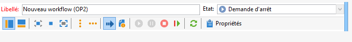
   You can also stop a targeting workflow automatically when the execution reaches an activity. To do this, right-click the activity from which targeting workflow will be stopped, and select **[!UICONTROL Do not activate]**.

   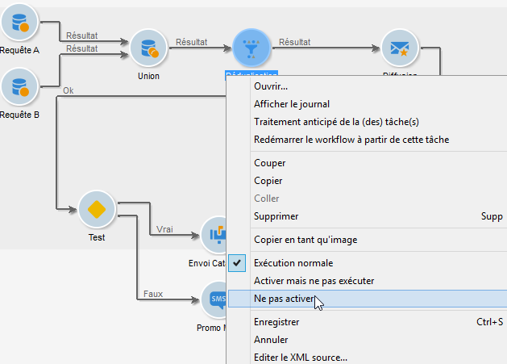

   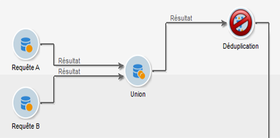

   Une icône spécifique matérialise ce paramétrage.

   >[!NOTE]
   >
   >Cette option est utile lors des phases de conception et de test d&#39;une opération de ciblage.

* Arrêt inconditionnel

   Dans l’Explorateur, sélectionnez **[!UICONTROL Administration > Production > Object created automatically > Campaign workflows]** pour accéder à chaque flux de travail de campagne et agir dessus.

   Vous pouvez arrêter votre flux de travail sans condition en cliquant sur l’ **[!UICONTROL Actions]** icône et en sélectionnant **[!UICONTROL Unconditional]** Arrêter. Cette action met fin à votre processus de campagne.

   

### Définir une population témoin {#defining-a-control-group}

La population témoin est une population qui ne recevra pas la diffusion : elle est utilisée pour suivre les comportements après diffusion et l&#39;impact de la campagne, par comparaison du comportement de la population cible, qui, elle, a reçu la diffusion.

La population témoin peut être extraite de la cible principale et/ou issue d&#39;un groupe ou d&#39;une requête spécifique.

#### Activation du groupe de contrôle pour une campagne {#activating-the-control-group-for-a-campaign}

Vous pouvez définir un groupe de contrôle au niveau de la campagne, auquel cas le groupe de contrôle sera appliqué à chaque diffusion de la campagne concernée.

1. Modifiez la campagne concernée et cliquez sur l’ **[!UICONTROL Edit]** onglet.
1. Clics **[!UICONTROL Advanced campaign settings]**.

   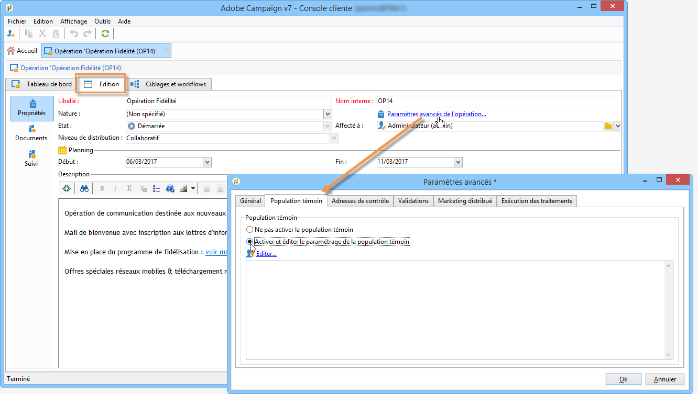

1. Select the **[!UICONTROL Enable and edit control group configuration]** option.
1. Cliquez sur **[!UICONTROL Edit...]** pour configurer le groupe de contrôle.

   

La procédure de configuration est présentée dans [Extraction du groupe de contrôle de la cible](#extracting-the-control-group-from-the-main-target) principale et [Ajout d&#39;une population](#adding-a-population).

#### Activation du groupe de contrôle pour une remise {#activating-the-control-group-for-a-delivery}

Vous pouvez définir un groupe de contrôle au niveau de la diffusion, auquel cas le groupe de contrôle sera appliqué à chaque diffusion de la campagne concernée.

Par défaut, le paramétrage de la population témoin défini au niveau de l&#39;opération s&#39;applique pour chaque diffusion de cette opération. Vous pouvez toutefois adapter la population témoin unitairement pour une diffusion.

>[!NOTE]
>
>Si vous avez défini une population témoin au niveau d&#39;une opération et que vous la configurez également pour une diffusion liée à cette opération, seule la population témoin définie pour la diffusion sera appliquée.

1. Modifiez la livraison concernée, puis cliquez sur le **[!UICONTROL To]** lien dans la **[!UICONTROL Email parameters]** section.

   

1. Cliquez sur l’ **[!UICONTROL Control group]** onglet, puis sélectionnez **[!UICONTROL Enable and edit control group configuration]**.
1. Cliquez sur **[!UICONTROL Edit...]** pour configurer le groupe de contrôle.

La procédure de configuration est présentée dans [Extraction du groupe de contrôle de la cible](#extracting-the-control-group-from-the-main-target) principale et [Ajout d&#39;une population](#adding-a-population).

#### Extraire la population témoin de la cible principale {#extracting-the-control-group-from-the-main-target}

Vous pouvez extraire des destinataires de la cible principale de la diffusion : dans ce cas, les destinataires seront soustraits de la cible des actions de diffusion impactées par ce paramétrage. Cette extraction peut être aléatoire ou résulter d&#39;un tri sur les destinataires.

Pour extraire un groupe de contrôle, activez-le pour la campagne ou la diffusion et sélectionnez l’une des options suivantes : **[!UICONTROL Activate random sampling]** ou **[!UICONTROL Keep only the first records after sorting]**.

* **[!UICONTROL Activate random sampling]** : cette option applique un échantillonnage aléatoire aux destinataires dans la population ciblée. Si vous définissez ensuite le seuil sur 100, le groupe de contrôle sera composé de 100 destinataires sélectionnés de manière aléatoire dans la population ciblée. L’échantillonnage aléatoire dépend du moteur de base de données.
* **[!UICONTROL Keep only the first records after sorting]** : cette option vous permet de définir une limite en fonction d’un ou de plusieurs ordres de tri. Si vous sélectionnez le **[!UICONTROL Age]** champ comme critère de tri, puis définissez 100 comme seuil, le groupe de contrôle sera composé des 100 destinataires les plus jeunes. Par exemple, il peut être intéressant de définir un groupe de contrôle qui comprend les destinataires qui effectuent peu d’achats ou ceux qui effectuent des achats fréquents et de comparer leur comportement avec celui des destinataires contactés.

Click **[!UICONTROL Next]** to define the sorting order (if necessary) and select the recipient limitation mode.

Ce paramétrage correspond à celui d&#39;une activité de partage dans le workflow, qui permet d&#39;éclater une cible en plusieurs sous-ensembles. La population témoin correspond à l&#39;un de ces sous-ensembles. Pour plus d&#39;informations, consultez [cette section](../../workflow/using/executing-a-workflow.md#architecture).

### Ajouter une population supplémentaire {#adding-a-population}

Vous pouvez définir une nouvelle population qui sera utilisée comme population témoin. Cette population peut être issue d&#39;un groupe de destinataires ou construite via une requête spécifique.

>[!NOTE]
>
>Le requêteur d&#39;Adobe Campaign est présenté dans [cette section](../../workflow/using/query.md).

## Démarrer la diffusion {#starting-a-delivery}

Une fois que toutes les approbations ont été accordées, la livraison est prête à démarrer. La procédure de livraison dépend alors du type de livraison. Pour les diffusions par courrier électronique ou sur les canaux mobiles, voir [Démarrage d’une remise](#starting-an-online-delivery)en ligne et pour les remises par courrier direct, voir [Démarrage d’une remise](#starting-an-offline-delivery)hors ligne.

### Démarrer une diffusion online {#starting-an-online-delivery}

Une fois toutes les demandes d’approbation accordées, l’état de remise devient **[!UICONTROL Pending confirmation]** et peut être démarré par un opérateur. Le cas échéant, l’opérateur Adobe Campaign (ou le groupe d’opérateurs) désigné comme réviseur pour lancer la diffusion est averti qu’une diffusion est prête à être lancée.

>[!NOTE]
>
>If a specific operator or group of operators is designated for starting a delivery in the delivery&#39;s properties, you can also allow the operator in charge of the delivery to confirm the send. To do this, activate the **NMS_ActivateOwnerConfirmation** option by entering **1** as the value. Les options sont gérées à partir du noeud **[!UICONTROL Administration]** > **[!UICONTROL Platform]** > **[!UICONTROL Options]** dans l’explorateur Adobe Campaign.
>  
>Pour désactiver cette option, indiquez **0** comme valeur. Le processus de confirmation des envois fonctionnera alors comme par défaut : seul l&#39;opérateur ou le groupe d&#39;opérateurs désigné pour l&#39;envoi (ou un administrateur) dans les propriétés de la diffusion pourra confirmer et effectuer l&#39;envoi.

Les informations s’affichent également dans le tableau de bord de la campagne. Le **[!UICONTROL Confirm delivery]** lien vous permet de démarrer la remise.

Un message de confirmation permet de sécuriser cette action.

### Démarrer une diffusion offline {#starting-an-offline-delivery}

Une fois que toutes les approbations ont été accordées, l’état de remise devient **[!UICONTROL Pending extraction]**. Les fichiers d’extraction sont créés par le biais d’un flux de travail spécial qui, dans une configuration par défaut, démarre automatiquement lorsqu’un envoi direct par courrier est en attente d’extraction. Lorsqu’un processus est en cours, il s’affiche dans le tableau de bord et peut être modifié via son lien.

>[!NOTE]
>
>Les processus techniques relatifs aux processus de campagne sont présentés dans [Liste des processus](../../workflow/using/campaign.md)de campagne.

**Etape 1 - Valider le fichier**

Une fois le workflow d&#39;extraction exécuté correctement, le fichier d&#39;extraction doit être validé (sous réserve que la validation du fichier d&#39;extraction ait été sélectionnée dans le paramétrage de la diffusion).

Pour plus d’informations, reportez-vous à la section [Approbation d’un fichier](../../campaign/using/marketing-campaign-approval.md#approving-an-extraction-file)d’extraction.

**Etape 2 - Valider le message au prestataire**

* Une fois la validation du fichier d&#39;extraction acceptée, vous pouvez générer le BAT de l&#39;email de notification au routeur. Cet email est construit via un modèle de diffusion. Il doit être validé.

   >[!NOTE]
   >
   >Cette étape n&#39;est proposée que si l&#39;envoi et la validation des BAT ont été activés à partir de la fenêtre des validations.

* Cliquez sur le **[!UICONTROL Send a proof]** bouton pour créer les épreuves.

   La cible des BAT doit avoir été préalablement définie.

   Vous pouvez créer autant de preuves que nécessaire. Ces informations sont accessibles via le **[!UICONTROL Direct mail...]** lien des détails de remise.

   

* L’état de remise devient **[!UICONTROL To submit]**. Cliquez sur le **[!UICONTROL Submit proofs]** bouton pour lancer le processus d’approbation.

   

* The delivery status changes to **[!UICONTROL Proof to validate]** and a button lets you accept or reject approval.

   

   Vous pouvez alors accepter ou refuser cette validation, ou revenir à l&#39;étape d&#39;extraction

   

* Puis le fichier d&#39;extraction est envoyé au routeur et la diffusion est terminée.

### Calcul des coûts et des stocks {#calculation-of-costs-and-stocks}

L&#39;extraction du fichier lance deux opérations : le calcul des budgets et le calcul des stocks. Les lignes budgétaires sont mises à jour.

* L’ **[!UICONTROL Budget]** onglet permet de gérer les budgets de la campagne. Le total des entrées de coût est affiché dans le **[!UICONTROL Calculates cost]** champ de l’onglet principal de la campagne et du programme auquel elle appartient. Les montants sont également répercutés dans le budget de la campagne.

   Le coût réel sera calculé au final en fonction des informations fournies par le routeur : seuls les courriers réellement envoyés sont facturés.

* Les stocks sont définis dans le **[!UICONTROL Administration > Campaign management > Stocks]** noeud de l’arborescence et les structures de coûts dans le **[!UICONTROL Administration > Campaign management > Service providers]** noeud.

   Au niveau des stocks, vous pouvez visualiser les lignes de stocks. Pour définir le stock initial, vous devez ouvrir une ligne de stock. Le stock est décrémenté au fur et à mesure des diffusions. Vous pouvez définir un niveau d&#39;alerte et des notifications.

>[!NOTE]
>
>Pour plus d&#39;informations sur le calcul des coûts et la gestion des stocks, voir [Fournisseurs, stocks et budgets](../../campaign/using/providers--stocks-and-budgets.md).

## Gérer les documents associés {#managing-associated-documents}

Vous pouvez associer divers documents à une campagne : rapport, photo, page Web, diagramme, etc. Ces documents peuvent être dans n’importe quel format (Microsoft Word, PowerPoint, PNG, JPG, Acrobat PDF, etc.). Pour lier des documents à une campagne, voir [Ajout de documents](#adding-documents).

>[!IMPORTANT]
>
>Ce mode d&#39;échange est réservé à des documents de faible volume (quelques Mo maximum).

Dans une campagne, vous pouvez également faire référence à d&#39;autres éléments, tels que des bons promotionnels, des offres spéciales relatives à une branche ou à un magasin spécifique, etc. Lorsque ces éléments sont inclus dans un plan, ils peuvent être associés à une livraison directe par courrier électronique. See [Associating and structuring resources linked via a delivery outline](#associating-and-structuring-resources-linked-via-a-delivery-outline).

>[!NOTE]
>
>Si vous utilisez MRM, vous pouvez également gérer une bibliothèque de ressources marketing disponibles pour plusieurs participants pour un travail collaboratif. Voir [Gestion des ressources](../../campaign/using/managing-marketing-resources.md)marketing.

### Ajouter des documents {#adding-documents}

Des documents peuvent être associés au niveau de l&#39;opération (documents contextuels) ou au niveau du programme (documents généraux).

The **[!UICONTROL Documents]** tab contains:

* la liste de tous les documents nécessaires au contenu (maquette, images, etc.) qui pourront être téléchargés en local par les opérateurs Adobe Campaign possédant les droits adéquats,
* les documents contenant des informations destinées au routeur, s&#39;ils existent.

The documents are linked to the program or the campaign via the **[!UICONTROL Edit > Documents]** tab.

Vous pouvez également ajouter un document dans une opération via le lien proposé dans son tableau de bord.

Click the **[!UICONTROL Details]** icon to view the content of a file and to add information:

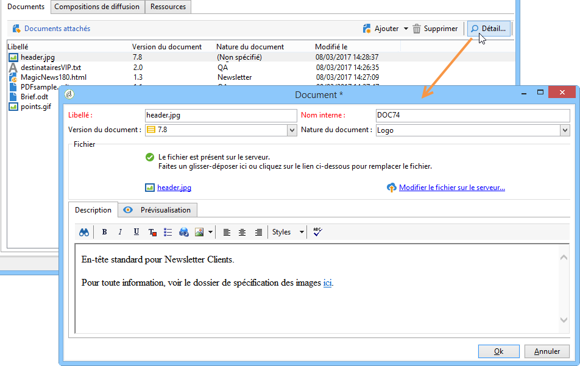

In the dashboard, documents associated with the campaign are grouped in the **[!UICONTROL Document(s)]** section, as in the following example:

Ils peuvent également être édités et modifiés depuis cette vue.

### Associer et structurer les ressources liées via une composition {#associating-and-structuring-resources-linked-via-a-delivery-outline}

>[!NOTE]
>
>Les contours de livraison sont utilisés exclusivement dans le cadre de campagnes par courrier direct.

Une composition désigne un ensemble structuré d&#39;éléments (documents, agences/magasins, coupons promotionnels, etc.) créés dans l&#39;entreprise et pour une opération particulière.

Ces éléments sont regroupés dans des compositions, et telle ou telle composition sera associée à une diffusion : elle sera référencée dans le fichier d&#39;extraction transmis au **prestataire** afin d&#39;être jointe à la diffusion. Vous pouvez par exemple créer une composition qui référence une agence et les brochures marketing qu&#39;elle utilise.

Les compositions permettent, au niveau de l&#39;opération, de structurer des éléments externes qui seront associés à la diffusion en fonction de certains critères : agence de rattachement, offre promotionnelle accordée, invitation à un événement local, etc.

#### Créer une composition {#creating-an-outline}

To create an outline, click the **[!UICONTROL Delivery outlines]** sub-tab in the **[!UICONTROL Edit > Documents]** tab of the concerned campaign.

>[!NOTE]
>
>Si cet onglet n&#39;est pas présent, alors cette fonctionnalité n&#39;est pas prise en compte pour cette opération. Reportez-vous à la configuration du modèle d&#39;opération.
>   
>For more on this, refer to [Campaign templates](../../campaign/using/marketing-campaign-templates.md#campaign-templates).

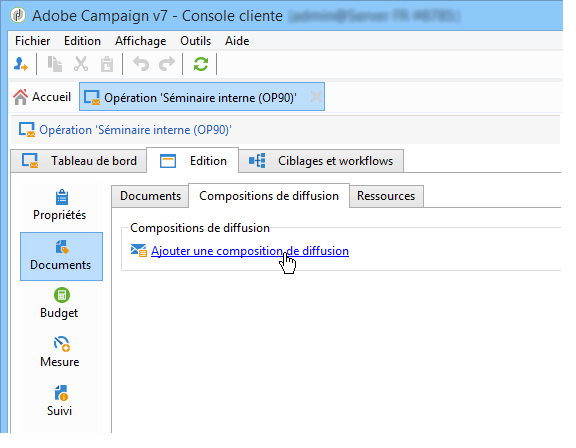

Cliquez ensuite sur **[!UICONTROL Add a delivery outline]** et créez la hiérarchie des contours de la campagne :

1. Cliquez avec le bouton droit sur la racine de l’arborescence et sélectionnez **[!UICONTROL New > Delivery outlines]**.
1. Cliquez avec le bouton droit sur le contour que vous venez de créer et sélectionnez **[!UICONTROL New > Item]** ou **[!UICONTROL New > Personalization fields]**.

Une composition peut contenir des articles, des champs de personnalisation, des ressources et des offres :

* Les articles sont par exemple des documents physiques qui sont ici référencés et décrits, et seront joints à la diffusion.
* Les champs de personnalisation vous permettent de créer des éléments de personnalisation liés aux remises plutôt qu’aux destinataires. Il est ainsi possible de créer des valeurs à utiliser dans les livraisons pour une cible spécifique (offre de bienvenue, réduction, etc.) Ils sont créés dans Adobe Campaign et importés dans le contour via le **[!UICONTROL Import personalization fields...]** lien.

   

   They can also be created directly in the outline by clicking the **[!UICONTROL Add]** icon to the right of the list zone.

   

* The resources are marketing resources generated in the marketing resource dashboard accessed via the **[!UICONTROL Resources]** link of the **[!UICONTROL Campaigns]** universe.

   

   >[!NOTE]
   >
   >Pour plus d’informations sur les ressources marketing, voir [Gestion des ressources](../../campaign/using/managing-marketing-resources.md)marketing.

#### Sélectionner une composition {#selecting-an-outline}

Pour chaque diffusion, vous pouvez sélectionner la composition à associer à partir de la section réservée à la configuration de l&#39;extraction, comme dans l&#39;exemple ci-dessous :

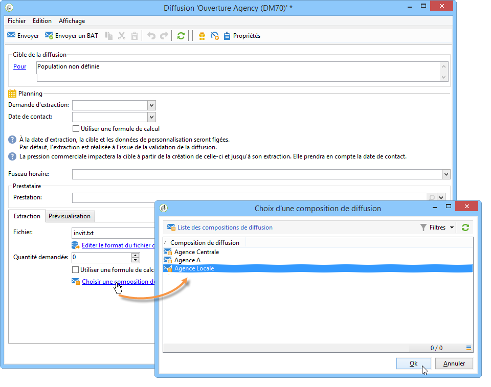

La composition sélectionnée est alors affichée dans la section inférieure de la fenêtre. Elle peut être éditée à partir de l&#39;icône située à droite du champ ou modifiée en utilisant la liste déroulante :

The **[!UICONTROL Summary]** tab of the delivery also displays this information:

#### Résultat de l&#39;extraction {#extraction-result}

Dans le fichier extrait et transmis au prestataire, le nom de la composition et éventuellement ses caractéristiques (coût, description, etc.) sont ajoutés au contenu, selon les informations présentes dans le modèle d&#39;export associé au prestataire.

Dans l&#39;exemple suivant, le libellé, le coût prévisionnel estimé et la description de la composition associée à la diffusion seront ajoutés dans le fichier d&#39;extraction.

Le modèle d&#39;exportation doit être associé au prestataire de services choisi pour la livraison concernée. See [Creating service providers and their cost structures](../../campaign/using/providers--stocks-and-budgets.md#creating-service-providers-and-their-cost-structures).

>[!NOTE]
>
>Pour plus d&#39;informations sur les exports, reportez-vous à la section [Prise en main](../../platform/using/generic-imports-and-exports.md).
