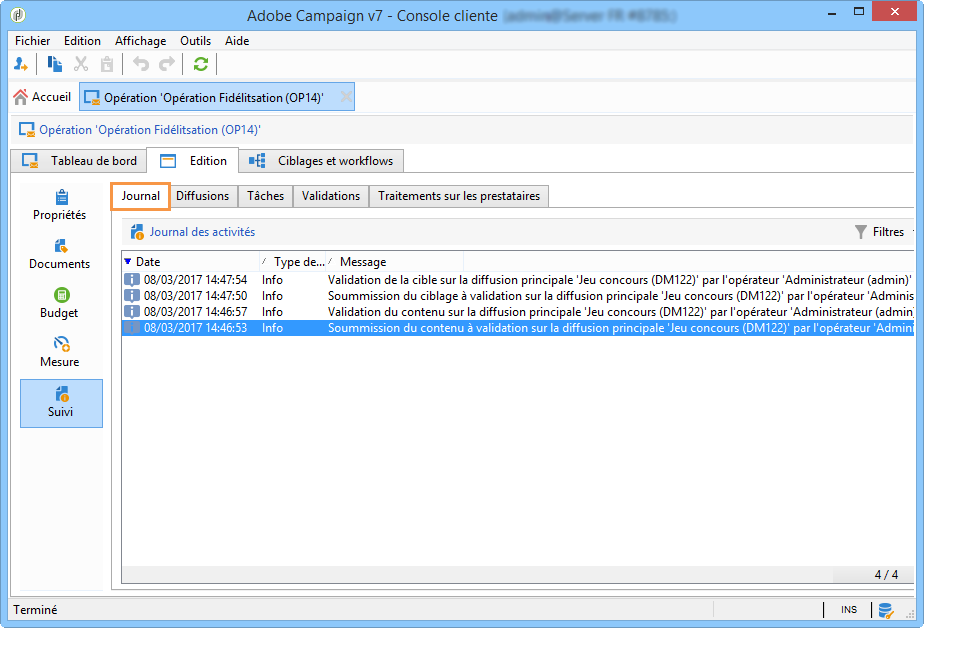
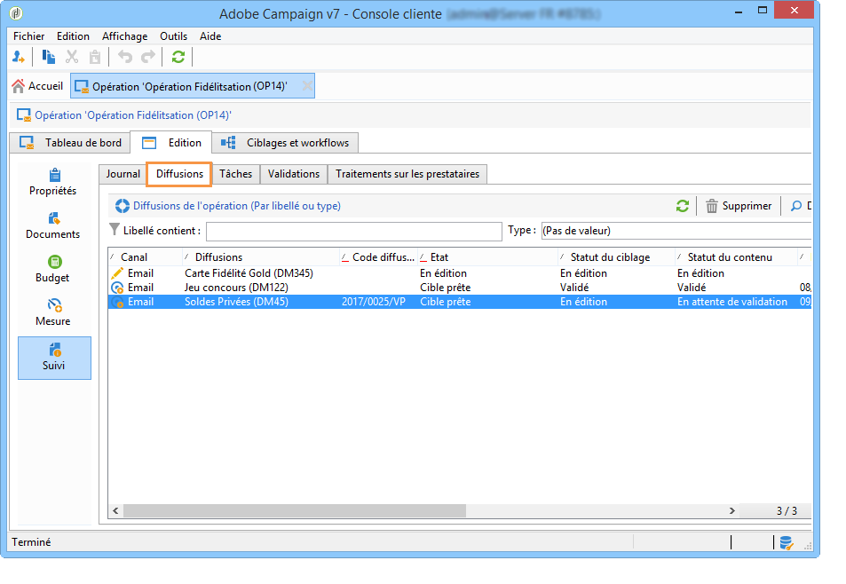
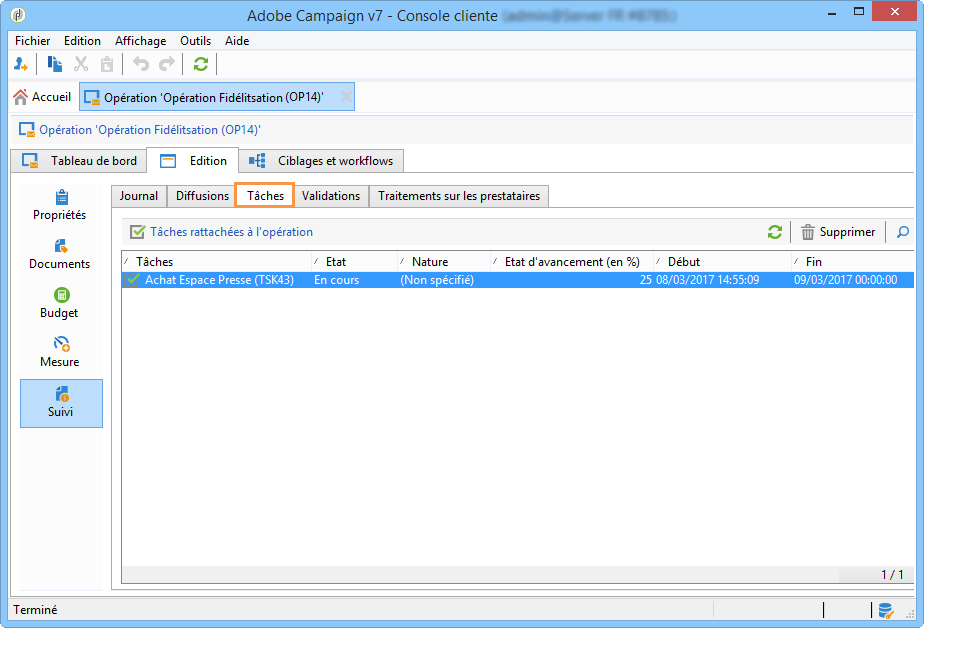
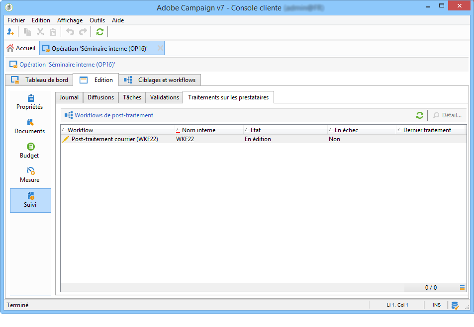
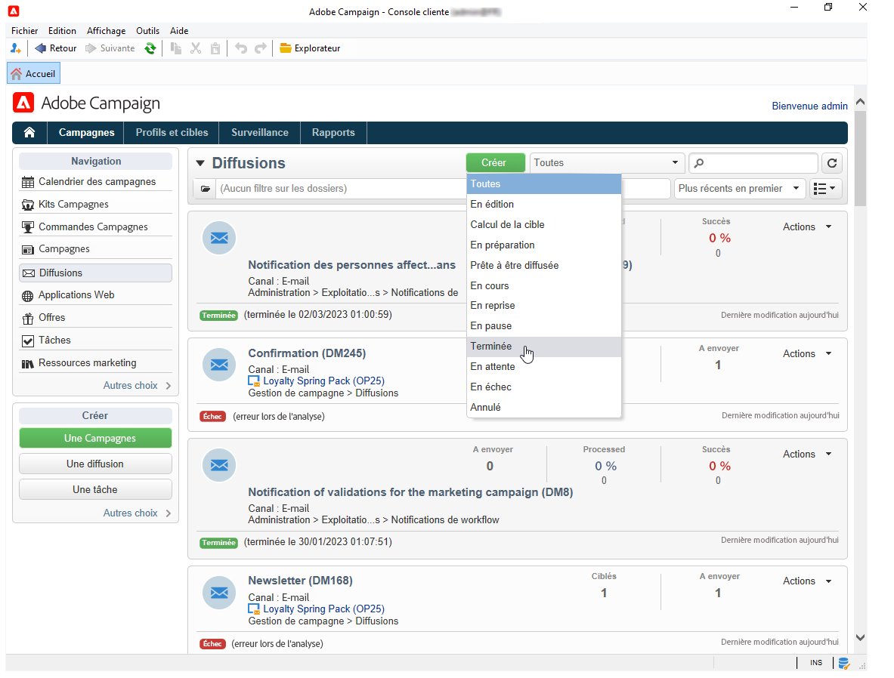

# Surveillance des campagnes marketing {#monitoring-marketing-campaigns}

## Suivi d’une campagne {#tracking-a-campaign}

Pour chaque campagne, l&#39;onglet **[!UICONTROL Tracking]** vous permet de visualiser tous les traitements et leur statut. Les informations accessibles à partir de ce sous-onglet sont les suivantes :

* Le journal des activités affiche les traitements réalisés sur l&#39;opération en général : création ou démarrage de workflow, validation, extraction, etc.

   

* Le sous-onglet **[!UICONTROL Diffusions]** regroupe toutes les diffusions de l&#39;opération. Vous pouvez les éditer depuis cette vue. Pour cela, sélectionner la diffusion et cliquez sur l&#39;icône **[!UICONTROL Détail]**.

   

* Le sous-onglet **[!UICONTROL Tâches]** regroupe toutes les tâches rattachées à l’opération. Cette vue vous permet de les éditer ou de les supprimer. Les tâches sont disponibles avec l&#39;application MRM. Elles sont présentées dans [cette section](../../mrm/using/creating-and-managing-tasks.md).

   

* Les workflows créés pour générer les messages aux prestataires sont affichés dans le sous-onglet **[!UICONTROL Traitements sur les prestataires]**. Cliquez sur l&#39;icône **[!UICONTROL Détail]** pour afficher le workflow sélectionné.

   

## Tracking de la diffusion {#delivery-tracking}

La liste des diffusions peut être affichée à partir du lien **[!UICONTROL Diffusions]** de l&#39;univers des Campagnes.

Pour chaque diffusion, vous pouvez accéder depuis cette liste aux indicateurs-clés : état, nombre de destinataires ciblés, opération de rattachement, etc.

Pour contrôler l&#39;état d&#39;une diffusion, éditez-la et consultez son tableau de bord et ses onglets.

>[!NOTE]
>
>Des informations relatives aux détails de la diffusion sont disponibles dans [cette section](../../delivery/using/about-message-tracking.md).

## Tracking de l&#39;exécution {#execution-tracking}

Vous pouvez consulter l&#39;état des diffusions en cliquant sur le lien **[!UICONTROL Diffusions]**, accessible à partir de la page d&#39;accueil d&#39;Adobe Campaign. Voir [Suivi des diffusions](#delivery-tracking).

Les informations relatives aux traitements exécutés dans une opération sont regroupées dans l&#39;onglet **[!UICONTROL Edition > Suivi]** de l’opération. Vous pouvez y visualiser la liste des diffusions de l&#39;opération. [En savoir plus](#tracking-a-campaign).
