# Sélection de l’audience de vos campagnes {#marketing-campaign-deliveries}

Dans une campagne marketing, pour chaque diffusion, vous pouvez définir :

* L’audience : en savoir plus dans les sections [Création de l’audience dans un workflow](#building-the-main-target-in-a-workflow) et [Sélection de la population cible](#selecting-the-target-population).
* Une population témoin : en savoir plus dans [cette section](#defining-a-control-group).
* Adresses de contrôle : en savoir plus dans [cette section](../../delivery/using/about-seed-addresses.md).

Certaines de ces informations sont héritées du [modèle d’opération](../../campaign/using/marketing-campaign-templates.md#campaign-templates).

Pour créer la cible de diffusion, vous pouvez définir des critères de filtrage pour les destinataires dans la base de données. Ce mode de sélection des destinataires est présenté dans [cette section](../../delivery/using/steps-defining-the-target-population.md).

## Envoi à un groupe

Vous pouvez importer une population dans une liste puis cibler cette liste dans les diffusions. Pour ce faire, procédez comme suit :

1. Modifiez la diffusion concernée et cliquez sur le lien **[!UICONTROL Pour]** afin de modifier la population ciblée.

1. Dans l&#39;onglet **[!UICONTROL Cible principale]**, choisissez l&#39;option **[!UICONTROL Définie depuis la base de données]** et cliquez sur **[!UICONTROL Ajouter]** pour sélectionner les destinataires.

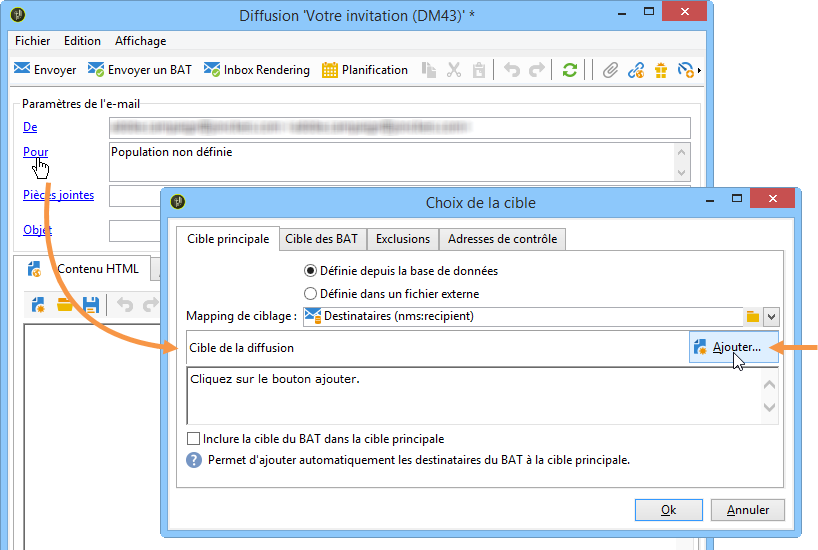

1. Choisissez **[!UICONTROL Une liste de destinataires]** et cliquez sur **[!UICONTROL Suivant]** pour le sélectionner parmi les listes existantes.

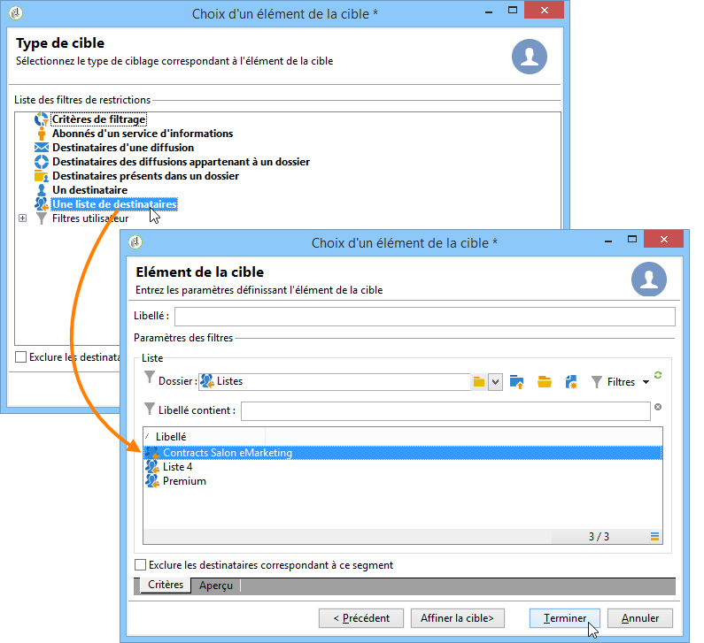

## Création de l’audience dans un workflow de campagne {#building-the-main-target-in-a-workflow}

La cible principale d’une diffusion peut également être définie au travers d’un workflow de campagne : cet environnement graphique permet de créer une cible via des requêtes, des tests et des opérateurs tels que des unions, déduplications, partages, etc.

>[!IMPORTANT]
>
>Vous ne devez pas ajouter plus de 28 workflows dans une campagne. Au-delà de cette limite, les autres workflows sont invisibles dans l’interface et peuvent générer des erreurs.

### Créer le workflow {#creating-a-targeting-workflow}

Le ciblage peut être construit grâce à une combinaison de critères de filtrage, enchaînés graphiquement dans un workflow. Vous pouvez ainsi créer des populations et sous-populations qui seront ciblées selon vos besoins. Pour afficher l&#39;éditeur de workflows, cliquez sur l&#39;onglet **[!UICONTROL Ciblages et workflows]** dans le tableau de bord de la campagne.

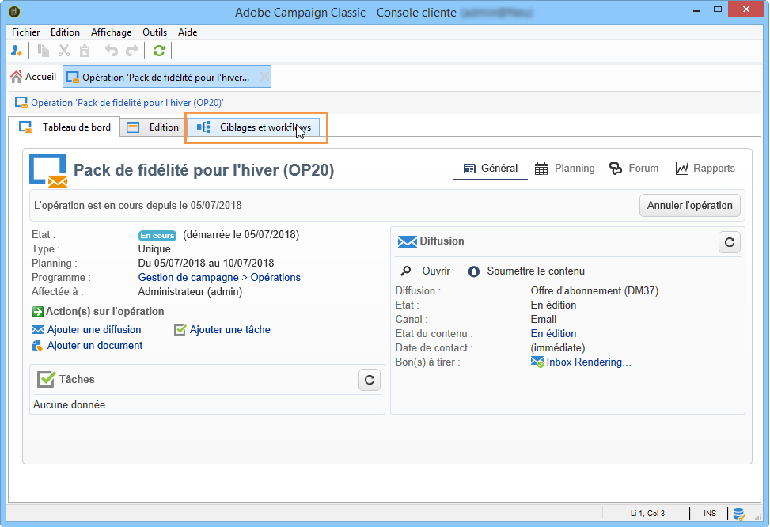

La population cible est extraite de la base Adobe Campaign via une ou plusieurs requêtes qui sont positionnées dans un workflow. Pour découvrir comment construire une requête, consultez [cette section](../../workflow/using/query.md).

Il est possible de lancer des requêtes puis de partager les populations via des boîtes de type Union, Intersection, Partage, Exclusion, etc.

Sélectionnez les objets dans les listes situées à gauche de l&#39;espace de travail et enchaînez-les pour construire la cible.

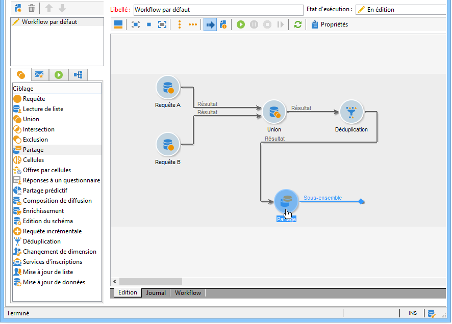

Dans le diagramme, reliez ainsi entre elles les requêtes de ciblage et d&#39;ordonnancement nécessaires à la construction de la cible : vous pouvez exécuter le ciblage en cours de construction afin de contrôler la population extraite de la base de données.

>[!NOTE]
>
>La procédure pour définir des requêtes est présentée avec des exemples dans [cette section](../../workflow/using/query.md).

La section gauche de l&#39;éditeur contient une bibliothèque d&#39;objets graphiques qui représentent des activités. Le premier onglet regroupe les activités de ciblage et le deuxième onglet regroupe les activités d&#39;ordonnancement, qui sont utilisées plus occasionnellement afin de coordonner les activités de ciblage.

La barre d&#39;outils de l&#39;éditeur de diagramme permet d&#39;accéder aux fonctions de mise en page et d&#39;exécution du workflow de ciblage.

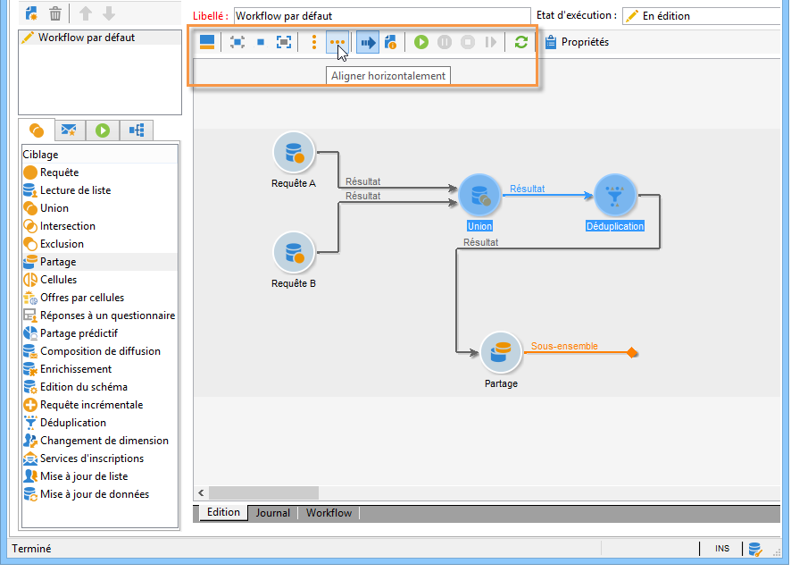

>[!NOTE]
>
>Les activités disponibles pour la construction du diagramme, ainsi que toutes les problématiques d&#39;affichage et de mise en page, sont présentées dans le guide [Automatiser avec des workflows](../../workflow/using/architecture.md).

Vous pouvez créer plusieurs workflows de ciblage pour une même opération. Pour ajouter un workflow :

1. Positionnez le pointeur de la souris dans la section supérieure gauche de la zone de création des workflows, cliquez avec le bouton droit et choisissez **[!UICONTROL Ajouter]**. Vous pouvez également utiliser le bouton **[!UICONTROL Nouveau]** situé au-dessus de cette zone.

   

1. Sélectionnez le modèle de workflow **[!UICONTROL Nouveau workflow]** et nommez ce workflow.
1. Cliquez sur **[!UICONTROL Ok]** pour valider la création du workflow, puis créez le diagramme pour ce workflow.

### Exécuter le workflow {#executing-a-workflow}

Les workflows de ciblage peuvent être lancés manuellement via le bouton **[!UICONTROL Démarrer]** de la barre d&#39;outils, sous réserve que vous disposiez des droits adéquats.

Le ciblage peut être planifié afin de s&#39;exécuter automatiquement selon un planning (planificateur) ou un événement (signal externe, import d&#39;un fichier, etc.).

Les actions relatives à l&#39;exécution du workflow de ciblage (lancement, arrêt, pause, etc.) sont des processus **asynchrones** : la commande est enregistrée et sera effective dès que le serveur sera disponible pour l&#39;appliquer.

Les icônes de la barre d&#39;outils permettent d&#39;agir sur l&#39;exécution du workflow de ciblage.

* Démarrer ou redémarrer

   * L&#39;icône **[!UICONTROL Démarrer]** permet de lancer le workflow de ciblage. Lorsque vous cliquez sur cette icône, toutes les activités qui n&#39;ont pas de transition entrante sont activées (sauf les sauts de type &#39;arrivée&#39;).

     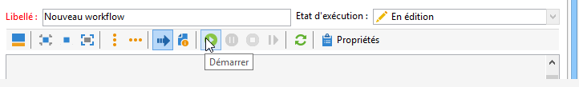

     La demande est prise en compte par le serveur, comme le notifie son état :

     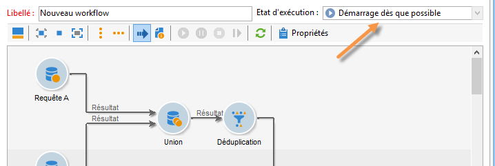

     Puis le processus passe en état **[!UICONTROL Démarré]**.

   * Vous pouvez redémarrer le workflow de ciblage à partir de l&#39;icône correspondante de la barre d&#39;outils. Cette commande peut être utile si l&#39;icône **[!UICONTROL Démarrer]** n&#39;est pas disponible, par exemple lorsque l&#39;arrêt du workflow de ciblage est en cours. Dans ce cas, cliquez sur l&#39;icône **[!UICONTROL Redémarrer]** pour anticiper le démarrage. La demande est prise en compte par le serveur, comme le notifie son état :

     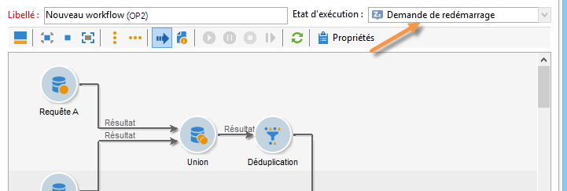

     Puis le processus passe en état **[!UICONTROL Démarré]**.

* Arrêter ou suspendre

   * Les icônes de la barre d&#39;outils permettent d&#39;arrêter ou suspendre un workflow de ciblage en cours d&#39;exécution.

     Lorsque vous cliquez sur l&#39;icône **[!UICONTROL Pause]**, les opérations en cours **[!UICONTROL ne sont pas]** suspendues, mais aucune autre activité n&#39;est lancée jusqu&#39;à la prochaine reprise.

     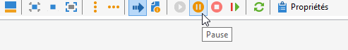

     La commande est prise en compte par le serveur, comme le notifie son état :

     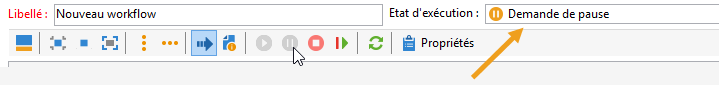

     Vous pouvez également suspendre automatiquement un workflow de ciblage lorsque l&#39;exécution arrive à une activité. Pour cela, cliquez avec le bouton droit sur l&#39;activité à partir de laquelle le workflow de ciblage sera suspendu et choisissez **[!UICONTROL Activer mais ne pas exécuter]**.

     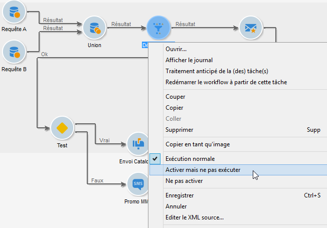

     Une icône spécifique matérialise ce paramétrage.

     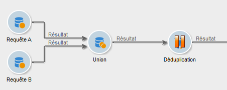

     >[!NOTE]
     >
     >Cette option est utile lors des phases de conception et de test d&#39;une opération de ciblage.

     Cliquez sur **[!UICONTROL Démarrer]** pour reprendre l&#39;exécution.

   * Cliquez sur l&#39;icône **[!UICONTROL Arrêter]** pour stopper l&#39;exécution en cours.

     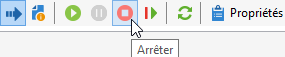

     La commande est prise en compte par le serveur, comme le notifie son état :

     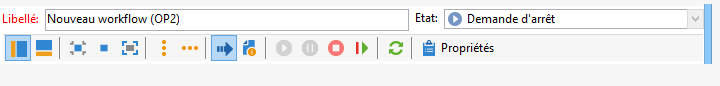

  Vous pouvez également arrêter automatiquement un workflow de ciblage lorsque l&#39;exécution arrive à une activité. Pour cela, cliquez avec le bouton droit sur l&#39;activité à partir de laquelle le workflow de ciblage sera suspendu et choisissez **[!UICONTROL Ne pas activer]**.

  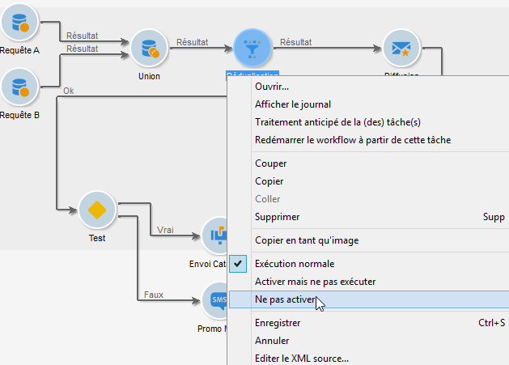

  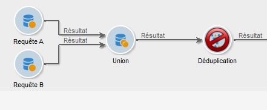

  Une icône spécifique matérialise ce paramétrage.

  >[!NOTE]
  >
  >Cette option est utile lors des phases de conception et de test d&#39;une opération de ciblage.

* Arrêt inconditionnel

  Dans l&#39;Explorateur, sélectionnez **[!UICONTROL Administration > Exploitation > Objets créés automatiquement > Workflows des opérations]** pour accéder aux workflows des opérations et agir sur ces derniers.

  Vous pouvez effectuer un arrêt conditionnel de votre workflow en cliquant sur l&#39;icône **[!UICONTROL Actions]** et en sélectionnant **[!UICONTROL Arrêt inconditionnel]**. Cette action arrête votre workflow d&#39;opération.

  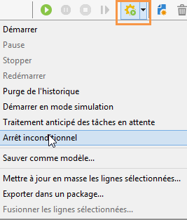

## Ajout d’une population témoin {#defining-a-control-group}

La population témoin est une population qui ne recevra pas la diffusion : elle est utilisée pour suivre les comportements après diffusion et l&#39;impact de la campagne, par comparaison du comportement de la population cible, qui, elle, a reçu la diffusion.

La population témoin peut être extraite de la cible principale et/ou issue d&#39;un groupe ou d&#39;une requête spécifique.

### Activation de la population témoin pour une campagne {#activating-the-control-group-for-a-campaign}

Vous pouvez définir une population témoin au niveau de l&#39;opération : elle sera alors appliquée à chaque diffusion de l&#39;opération concernée.

1. Éditez l&#39;opération concernée et cliquez sur l&#39;onglet **[!UICONTROL Edition]**.
1. Cliquez sur **[!UICONTROL Paramètres avancés de l&#39;opération...]**.

   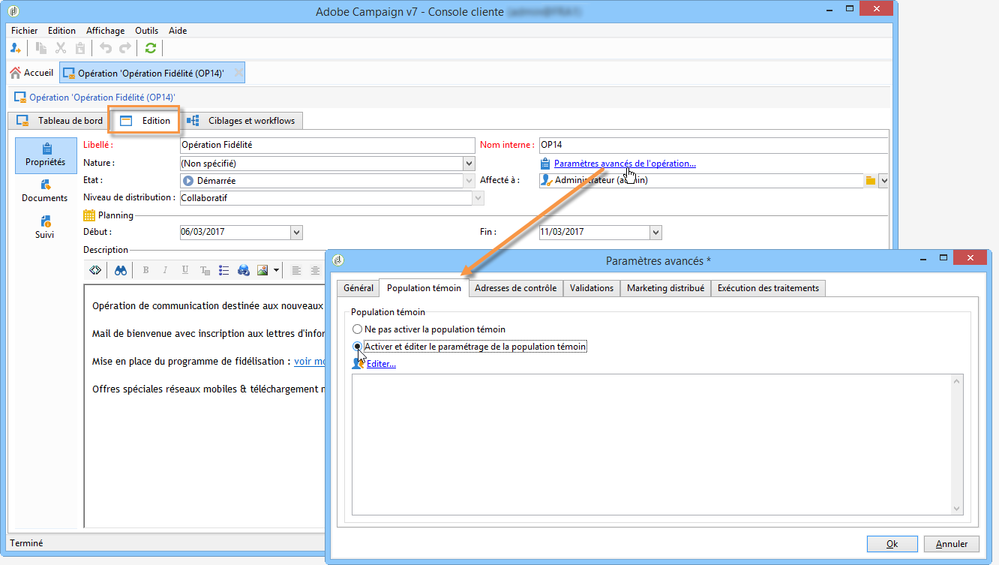

1. Sélectionnez l&#39;option **[!UICONTROL Activer et éditer le paramétrage de la population témoin]**.
1. Cliquez sur **[!UICONTROL Editer...]** pour paramétrer la population témoin.

   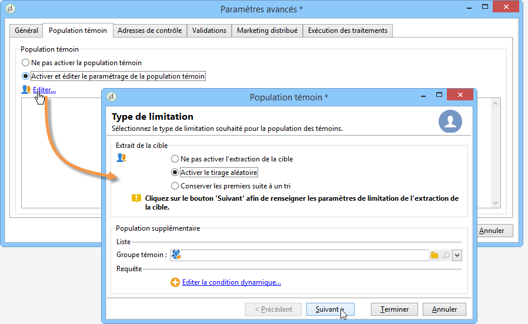

La procédure de paramétrage est présentée dans les sections [Extraire la population témoin de la cible principale](#extracting-the-control-group-from-the-main-target) et [Ajouter une population témoin](#adding-a-population).

### Activation de la population témoin pour une diffusion {#activating-the-control-group-for-a-delivery}

Vous pouvez définir une population témoin au niveau de la diffusion : elle sera alors appliquée à chaque diffusion de l&#39;opération concernée.

Par défaut, le paramétrage de la population témoin défini au niveau de l&#39;opération s&#39;applique pour chaque diffusion de cette opération. Vous pouvez toutefois adapter la population témoin unitairement pour une diffusion.

>[!NOTE]
>
>Si vous avez défini une population témoin au niveau d&#39;une opération et que vous la configurez également pour une diffusion liée à cette opération, seule la population témoin définie pour la diffusion sera appliquée.

1. Éditez la diffusion concernée et cliquez sur le lien **[!UICONTROL Pour]** de la section **[!UICONTROL Paramètres de l&#39;e-mail]**.

   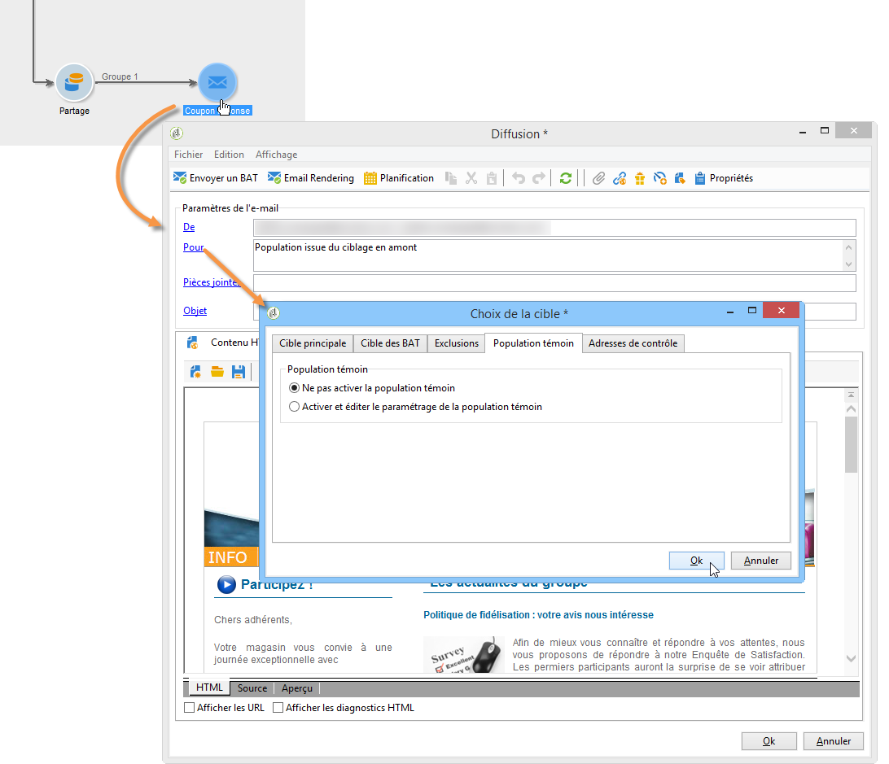

1. Cliquez sur l&#39;onglet **[!UICONTROL Population témoin]**, puis sélectionnez **[!UICONTROL Activer et éditer le paramétrage de la population témoin]**.
1. Cliquez sur **[!UICONTROL Editer...]** pour paramétrer la population témoin.

La procédure de paramétrage est présentée dans les sections [Extraire la population témoin de la cible principale](#extracting-the-control-group-from-the-main-target) et [Ajouter une population témoin](#adding-a-population).

### Extraction de la population témoin de la cible principale {#extracting-the-control-group-from-the-main-target}

Vous pouvez extraire des destinataires de la cible principale de la diffusion : dans ce cas, les destinataires seront soustraits de la cible des actions de diffusion impactées par ce paramétrage. Cette extraction peut être aléatoire ou résulter d&#39;un tri sur les destinataires.

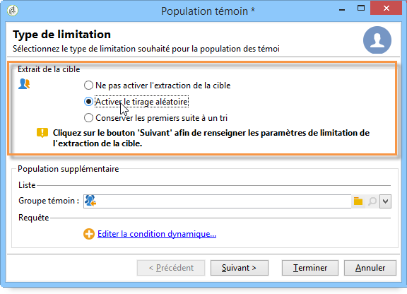

Pour extraire une population témoin, activez la population témoin au niveau de l&#39;opération ou de la diffusion et choisissez une des options suivantes : **[!UICONTROL Activer le tirage aléatoire]** ou **[!UICONTROL Conserver les premiers suite à un tri]**.

* **[!UICONTROL Activer le tirage aléatoire]** : cette option applique un tirage aléatoire sur les destinataires présents dans la population ciblée. Si vous définissez ensuite une limite de 100, la population témoin sera composée de 100 destinataires choisis aléatoirement dans la population ciblée. Le tirage aléatoire appliqué dépend du moteur de base de données.
* **[!UICONTROL Conserver les premiers suite à un tri]** : cette option permet de définir une limitation suivant un ou plusieurs ordres de tri. Si vous choisissez le champ **[!UICONTROL Age]** comme critère de tri, et que vous définissez ensuite une limite de 100, la population témoin sera composée des 100 destinataires les moins âgés. Il peut être intéressant, par exemple, de définir comme population témoin, des contacts qui achètent peu, ou au contraire, qui achètent fréquemment, et de comparer leur comportement aux destinataires qui ont été contactés.

Cliquez sur **[!UICONTROL Suivant]** pour définir l&#39;ordre de tri (si besoin) et sélectionnez le mode de limitation des destinataires.

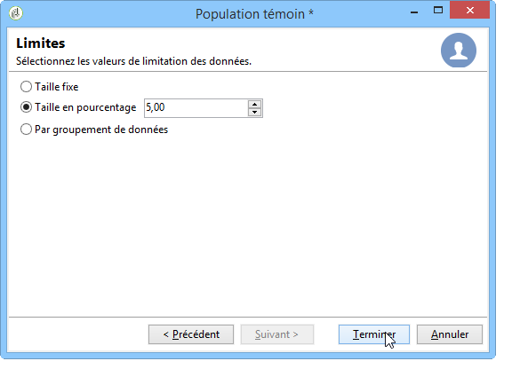

Ce paramétrage correspond à celui d&#39;une activité de partage dans le workflow, qui permet d&#39;éclater une cible en plusieurs sous-ensembles. La population témoin correspond à l&#39;un de ces sous-ensembles. Pour plus d&#39;informations, consultez [cette section](../../workflow/using/architecture.md).

### Utilisation d’une nouvelle population comme population témoin {#adding-a-population}

Vous pouvez définir une nouvelle population qui sera utilisée comme population témoin. Cette population peut être issue d&#39;un groupe de destinataires ou construite via une requête spécifique.

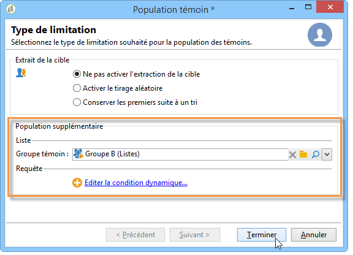

>[!NOTE]
>
>Le requêteur d&#39;Adobe Campaign est présenté dans [cette section](../../workflow/using/query.md).

#### Tutoriel vidéo {#create-email-video}

Cette vidéo explique comment créer une campagne et un e-mail dans Adobe Campaign.

>[!VIDEO](https://video.tv.adobe.com/v/25604?quality=12)

D’autres vidéos pratiques sur Campaign sont disponibles [ici](https://experienceleague.adobe.com/docs/campaign-classic-learn/tutorials/overview.html?lang=fr).
