# Modèles de campagne marketing {#campaign-templates}

Les modèles de campagne sont centralisés dans le **[!UICONTROL Resources > Templates > Campaign templates]** noeud. Un modèle par défaut est fourni en standard. Il vous permet de créer une campagne à l’aide de tous les modules disponibles (documents, tâches, adresses de départ, etc.), mais les modules proposés dépendent de vos droits et de la configuration de votre plateforme Adobe Campaign.

## Création ou duplication d&#39;un modèle d&#39;opération {#creating-or-duplicating-a-campaign-template}

Pour créer un modèle, procédez comme suit :

1. Ouvrez l&#39;**Explorateur** de Campaign.
1. Dans **Ressources > Modèles > Modèles d&#39;opération**, cliquez sur **Nouveau** dans la barre d&#39;outils située au-dessus de la liste des modèles.

   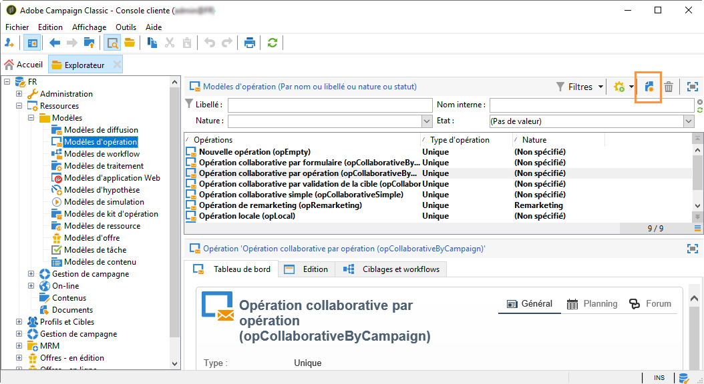

1. Saisissez le libellé du nouveau modèle d&#39;opération.
1. Cliquez sur **Enregistrer**, puis rouvrez le modèle.
1. Dans l&#39;onglet **Edition**, saisissez le **nom interne** et d&#39;autres valeurs si nécessaire.
1. Sélectionnez **Paramètres avancés de l&#39;opération** pour ajouter un workflow à votre modèle d&#39;opération.

   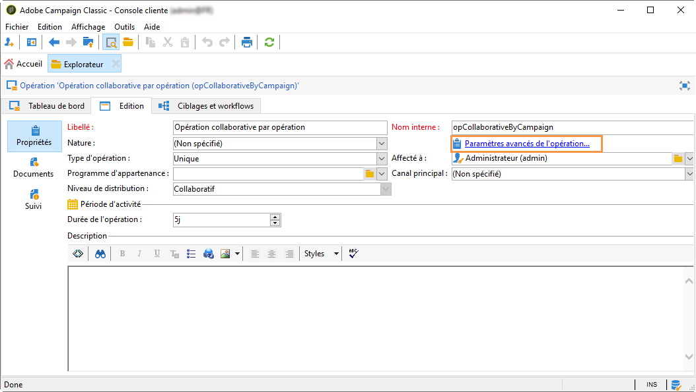

1. Remplacez la valeur **Ciblages et workflows** par **Oui**.

   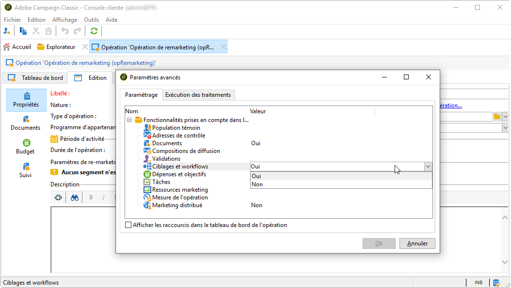

1. Dans l&#39;onglet **Ciblages et workflows**, cliquez sur **Ajouter un workflow...**.

   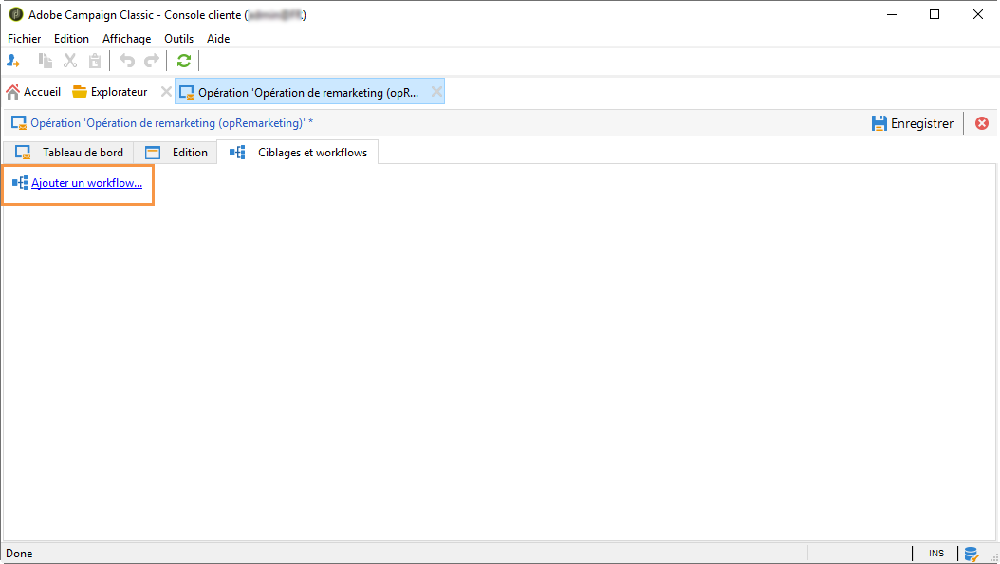

1. Renseignez le champ **Libellé** et cliquez sur **OK**.
1. Créez votre workflow selon vos besoins.
1. Cliquez sur **Enregistrer**. Le modèle peut maintenant être utilisé dans une campagne.

Vous pouvez également dupliquer le modèle par défaut afin de le réutiliser et adapter sa configuration à vos besoins.

The various tabs and sub-tabs of the campaign template allow you to access its settings, described in [General configuration](#general-configuration).

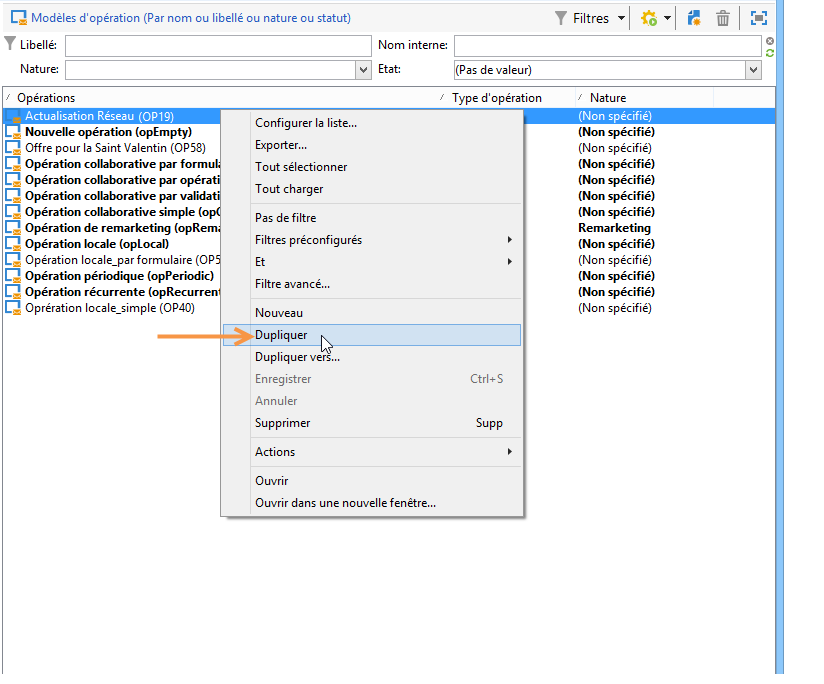

## Configurer un modèle d&#39;opération {#configuring-a-campaign-template}

Les campagnes reposent sur des modèles qui partagent un ensemble de paramètres prédéfinis.

In a default configuration, the campaign templates are centralized in the **[!UICONTROL Resources > Templates > Campaign templates]** node of the Adobe Campaign tree.

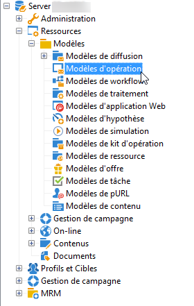

>[!NOTE]
>
>The tree is displayed when you click the **[!UICONTROL Explorer]** icon on the home page.

Un modèle prêt à l’emploi est fourni pour créer une campagne pour laquelle aucune configuration spécifique n’a été définie. Vous pouvez créer et configurer des modèles de campagne, puis créer des campagnes à partir de ces modèles.

The creation and configuration of campaign templates are presented in [Campaign templates](#campaign-templates).

Pour plus d&#39;informations sur la création d&#39;une opération, voir la vidéo sur la [création d&#39;une opération et d&#39;un email](https://docs.campaign.adobe.com/doc/AC/en/Videos/Videos.html).

## Configuration des modules proposés {#configuration-of-the-available-modules}

### Sélection des modules {#module-selection}

Le **[!UICONTROL Advanced campaign settings...]** lien vous permet d’activer et de désactiver des tâches pour les campagnes basées sur ce modèle. Sélectionnez les fonctions à activer dans les campagnes créées à partir de ce modèle.

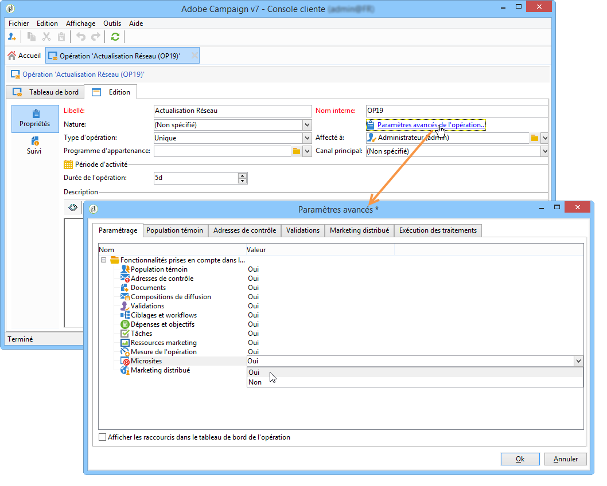

Si aucune fonctionnalité n’est sélectionnée, les éléments concernant le processus (menus, icônes, options, onglets, sous-onglets, etc.) n’apparaîtront pas dans l’interface du modèle ou dans les campagnes basées sur ce modèle. Les onglets à gauche des détails de la campagne coïncident généralement avec les processus sélectionnés dans le modèle. Par exemple, si **Dépenses et objectifs** ne sont pas sélectionnés, l’ **[!UICONTROL Budget]** onglet correspondant ne s’affichera pas dans les campagnes basées sur ce modèle.

De plus, des raccourcis vers les fenêtres de configuration sont ajoutés dans le tableau de bord de l&#39;opération : lorsqu&#39;une fonctionnalité est activée, un lien direct permet d&#39;y accéder depuis le tableau de bord de l&#39;opération.

Par exemple, avec le paramétrage ci-dessous :

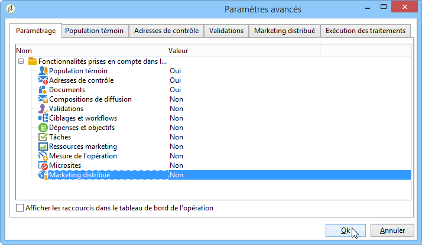

The following links are displayed in the campaign dashboard (the **[!UICONTROL Add a task]** link is missing):

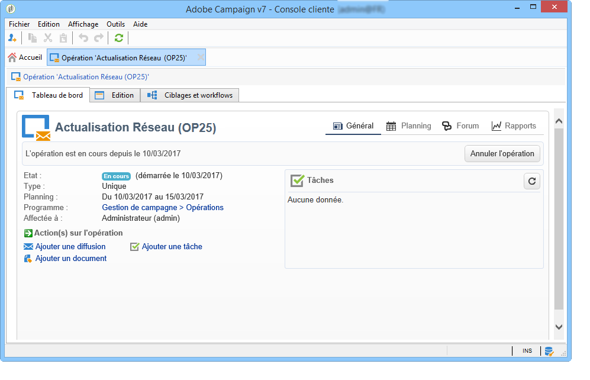

Seuls les onglets suivants s’affichent :

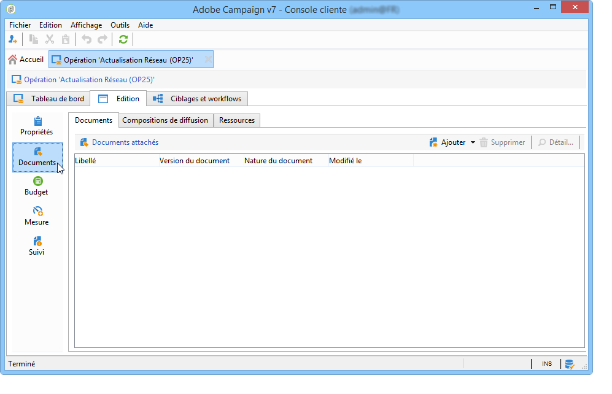

Par contre, avec ce type de paramétrage :

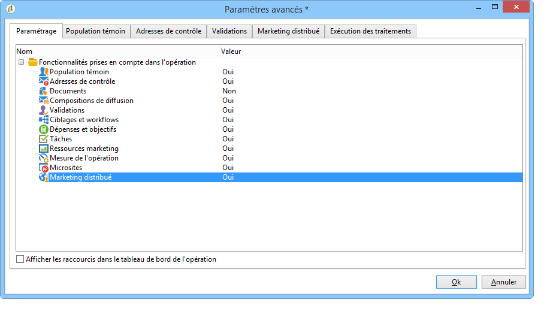

Les liens et onglets affichés seront les suivants :

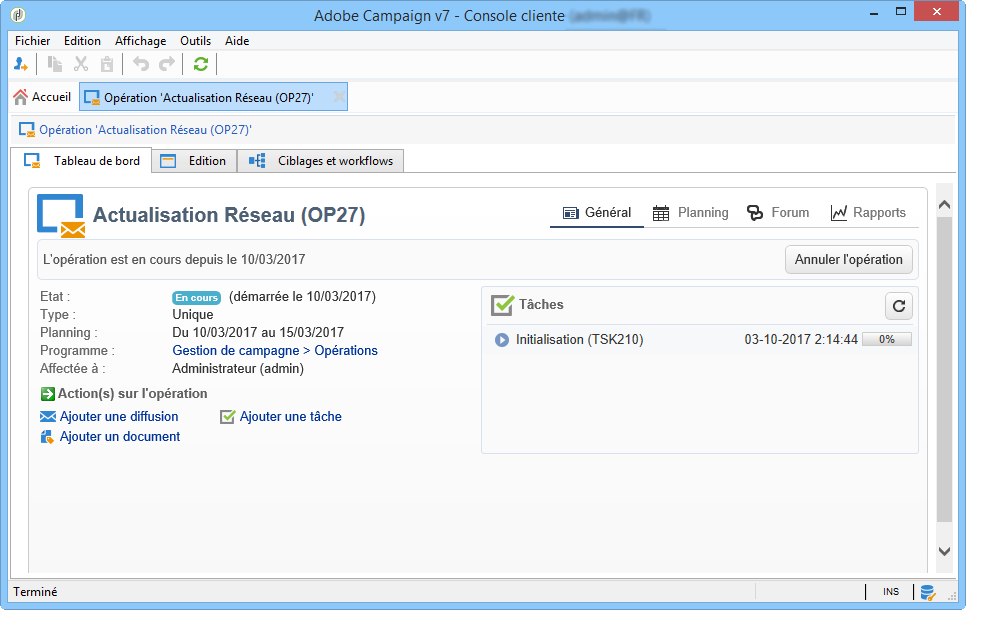

### Typologie des modules activés {#typology-of-enabled-modules}

* **Population témoin**

   Lorsque ce module est sélectionné, un onglet supplémentaire est ajouté dans les paramètres avancés du modèle et des opérations basées sur ce modèle. Le paramétrage peut être défini depuis le modèle ou individuellement au niveau de chaque opération.

   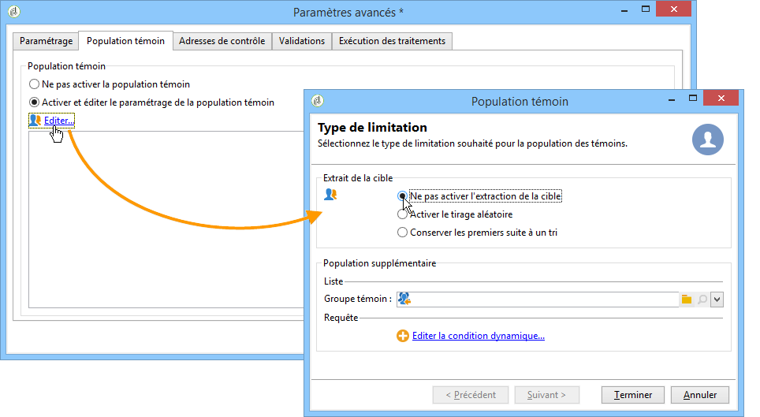

* **Adresses de contrôle**

   Lorsque ce module est sélectionné, un onglet supplémentaire est ajouté dans les paramètres avancés du modèle et des opérations basées sur ce modèle. Le paramétrage peut être défini depuis le modèle ou individuellement au niveau de chaque opération.

   

* **Documents**

   Lorsque ce module est sélectionné, un onglet supplémentaire est ajouté à l’ **[!UICONTROL Edition]** onglet du modèle et aux campagnes basées sur ce modèle. Les documents joints peuvent être ajoutés à partir du modèle ou individuellement pour chaque campagne.

   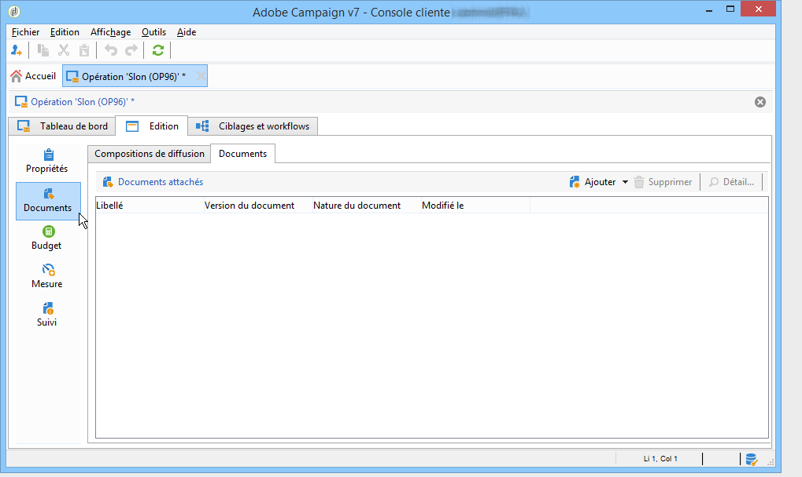

* **Composition**

   When this module is selected, a **[!UICONTROL Delivery outlines]** sub-tab is added to the **[!UICONTROL Documents]** tab in order to define delivery outlines for the campaign.

   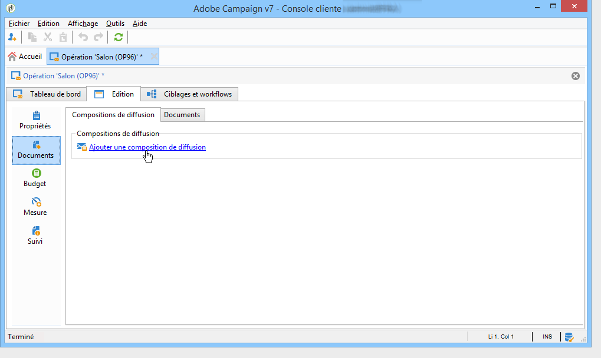

* **Ciblages et workflows**

   Lorsque vous sélectionnez le **[!UICONTROL Targeting and workflows]** module, un onglet est ajouté pour vous permettre de créer un ou plusieurs processus pour les campagnes basées sur ce modèle. Les processus peuvent également être configurés individuellement pour chaque campagne en fonction de ce modèle.

   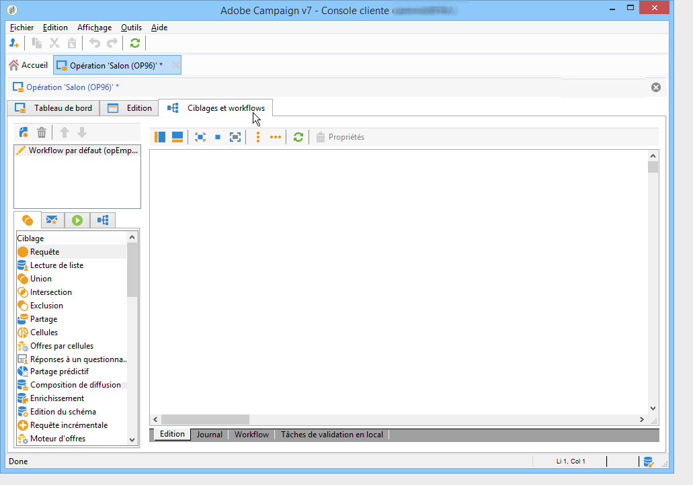

   Lorsque ce module est activé, un onglet supplémentaire est ajouté dans les paramètres avancés de l&#39;opération afin de définir les priorités d&#39;exécution des traitements.

   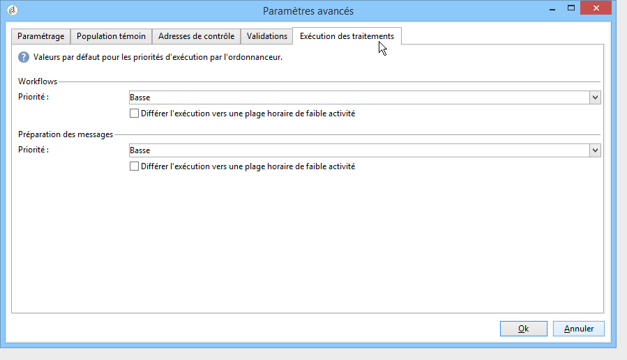

* **Validation**

   If you select the **[!UICONTROL Approval]**, you can select the processes to approve as well as the operators in charge of approvals.

   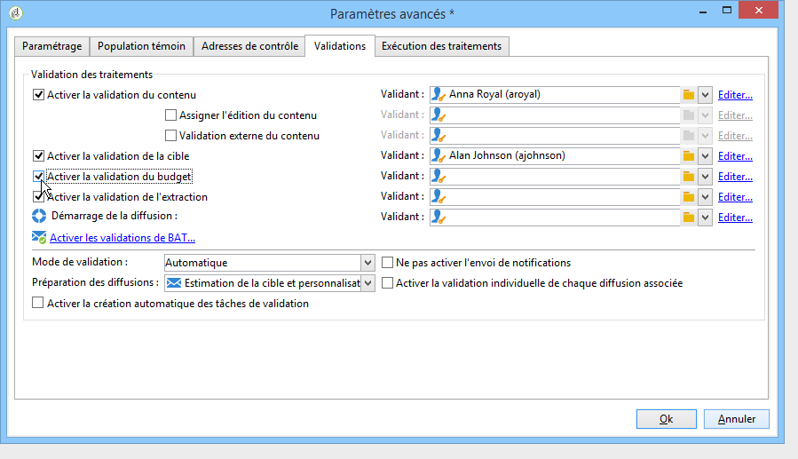

* **Dépenses et objectifs**

   Lorsque ce module est sélectionné, un onglet **[!UICONTROL Budget]** est ajouté dans le détail du modèle et des opérations basées sur ce modèle afin de sélectionner le budget de rattachement.

   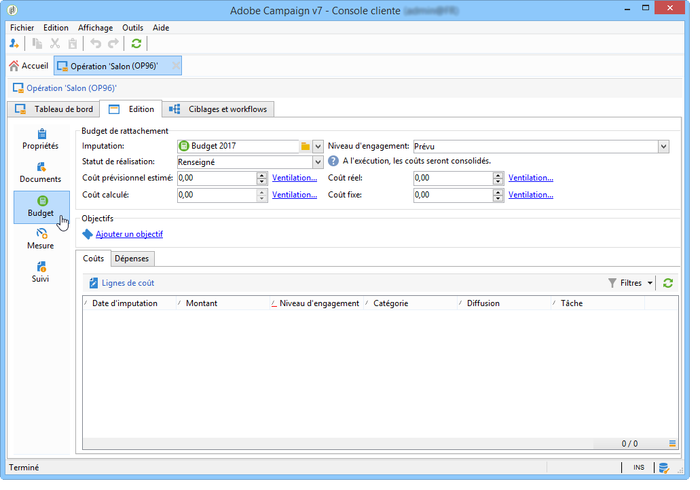

### Validation des traitements {#approval-of-jobs}

Vous pouvez choisir d’activer ou non l’approbation de processus via l’ **[!UICONTROL Approvals]** onglet de la section des paramètres avancés des modèles. Les tâches pour lesquelles l’approbation est sélectionnée doivent être approuvées pour que la remise des messages soit autorisée.

Vous devez associer un opérateur ou groupe d&#39;opérateur validant à chaque validation activée.

## Paramétrage général {#general-configuration}

### Propriétés des modèles {#template-properties}

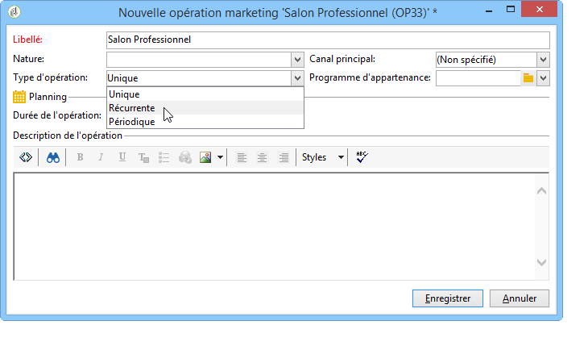

Lorsque vous créez un modèle d&#39;opération, vous devez indiquer les informations suivantes :

* Saisissez le **libellé** du modèle : ce libellé sera attribué par défaut à toutes les opérations créées à partir de ce modèle.
* Select the campaign **nature** from the drop-down list. Les valeurs disponibles dans cette liste sont celles enregistrées dans l’ **[!UICONTROL natureOp]** énumération.

   >[!NOTE]
   >
   >Pour plus d&#39;informations sur les énumérations, reportez-vous à la section [Prise en main](../../platform/using/managing-enumerations.md).

* Sélectionnez le **type de campagne**: unique, périodique ou périodique. Par défaut, les modèles de campagne s’appliquent aux campagnes uniques. Les campagnes périodiques et périodiques sont détaillées ici : Campagnes [périodiques et périodiques](../../campaign/using/setting-up-marketing-campaigns.md#recurring-and-periodic-campaigns).
* Indiquez la durée de l&#39;opération, c&#39;est-à-dire la période sur laquelle s&#39;étalera l&#39;opération. Lors de la création d&#39;une opération basée sur ce modèle, les dates de début et de fin de l&#39;opération seront alors automatiquement renseignées.

   S&#39;il s&#39;agit d&#39;une opération récurrente, vous devez indiquer les dates de début et de fin de l&#39;opération directement dans le modèle.

* Indiquez le **programme d&#39;appartenance** du modèle : les opérations basées sur le modèle seront associées au programme sélectionné.

### Paramètres d&#39;exécution du modèle {#template-execution-parameters}

Le **[!UICONTROL Advanced campaign settings...]** lien vous permet de configurer les options avancées du modèle pour le traitement de la cible de remise (groupe de contrôle, adresses de départ, etc.) et la configuration de la mesure de la campagne et de l’exécution du processus.

## Rétroplanning d&#39;opération {#campaign-reverse-scheduling}

Vous pouvez réaliser le rétroplanning d&#39;une opération, par exemple pour préparer un événement dont la date est connue à l&#39;avance. En effet, dans les modèles d&#39;opération, vous pouvez calculer la date de début d&#39;une tâche par rapport à la date de fin d&#39;une opération.

Dans la zone de configuration de la tâche, accédez à la **[!UICONTROL Implementation schedule]** zone et cochez la **[!UICONTROL The start date is calculated based on the campaign end date]** case. (Ici, &quot;date de début&quot; est la date de début de la tâche). Accédez au **[!UICONTROL Start]** champ et entrez un intervalle : la tâche démarrera bien avant la date de fin de la campagne. Si vous entrez une période plus longue que la durée définie pour la campagne, la tâche commence avant la campagne.

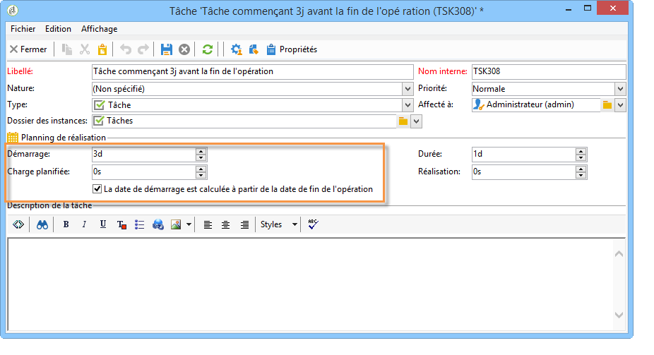

Lorsque vous créerez une opération d&#39;après ce modèle, la date de début de la tâche sera calculée automatiquement. Il vous sera cependant toujours possible de la modifier.
