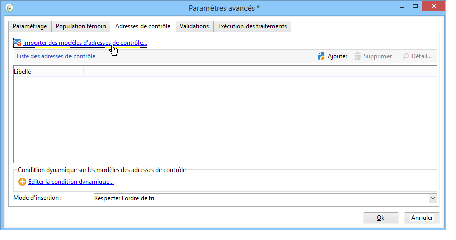

# Création et configuration de modèles d’opération {#campaign-templates}

Toutes les campagnes marketing sont basées sur un modèle qui stocke les principales caractéristiques et fonctionnalités. Les modèles d’opération sont centralisés dans le nœud **[!UICONTROL Ressources > Modèles > Modèles d’opération]**. Un modèle par défaut est fourni en guise d’exemple standard. Il vous permet de créer une opération qui utilise tous les modules disponibles (Documents, Tâches, Adresses de contrôle et autres). Toutefois, les modules proposés dépendent de vos droits et de la configuration de votre plateforme Adobe Campaign.

>[!NOTE]
>
>Vous pouvez afficher l’arborescence en cliquant sur l’icône de l’**[!UICONTROL Explorateur]** sur la page d’accueil.

Un modèle natif est fourni pour créer une opération pour laquelle aucune configuration spécifique n’a été définie. Vous pouvez créer et configurer des modèles d’opération, puis créer des opérations à partir de ces modèles.

 Pour en savoir plus sur la création d’opérations, reportez-vous à [cette vidéo](../../campaign/using/marketing-campaign-deliveries.md#create-email-video).

## Création d’un modèle d’opération {#creating-or-duplicating-a-campaign-template}

Pour créer un modèle de campagne, procédez comme suit :

1. Ouvrez l&#39;**Explorateur** de Campaign.
1. Dans **Ressources > Modèles > Modèles d&#39;opération**, cliquez sur **Nouveau** dans la barre d&#39;outils située au-dessus de la liste des modèles.

   

1. Saisissez le libellé du nouveau modèle d&#39;opération.
1. Cliquez sur **Enregistrer**, puis rouvrez le modèle.
1. Dans l&#39;onglet **Edition**, saisissez le **nom interne** et d&#39;autres valeurs si nécessaire.
1. Sélectionnez **Paramètres avancés de l&#39;opération** pour ajouter un workflow à votre modèle d&#39;opération.

   

1. Remplacez la valeur **Ciblages et workflows** par **Oui**.

   

1. Dans l&#39;onglet **Ciblages et workflows**, cliquez sur **Ajouter un workflow...**.

   

1. Renseignez le champ **Libellé** et cliquez sur **OK**.
1. Créez votre workflow selon vos besoins.
1. Cliquez sur **Enregistrer**. Le modèle peut maintenant être utilisé dans une campagne.

Vous pouvez également **dupliquer** le modèle par défaut afin de le réutiliser et d&#39;adapter sa configuration à vos besoins.

Les divers onglets et sous-onglets du modèle de campagne vous permettent d&#39;accéder à ses paramètres, qui sont décrits dans la section [Configuration générale](#general-configuration).

## Sélection des modules {#select-modules}

Le lien **[!UICONTROL Paramètres avancés de l’opération…]** vous permet d’activer et de désactiver des traitements pour les opérations basées sur ce modèle. Sélectionnez les fonctionnalités à activer dans les opérations créées à partir de ce modèle.

Si une fonctionnalité n’est pas sélectionnée, les éléments relatifs au processus (menus, icônes, options, onglets, sous-onglets, autres) n’apparaîtront pas dans l’interface du modèle ou dans les opérations basées sur ce modèle. Les onglets situés à gauche des détails de l’opération coïncident généralement avec les processus sélectionnés dans le modèle. Par exemple, si **Dépenses et objectifs** n’est pas sélectionné, l’onglet **[!UICONTROL Budget]** correspondant n’apparaîtra pas dans les opérations basées sur ce modèle.

De plus, des raccourcis vers les fenêtres de configuration sont ajoutés dans le tableau de bord de l&#39;opération : lorsqu&#39;une fonctionnalité est activée, un lien direct permet d&#39;y accéder depuis le tableau de bord de l&#39;opération.

Par exemple, avec le paramétrage ci-dessous :

Les liens suivants sont affichés dans le tableau de bord de l&#39;opération (le lien **[!UICONTROL Ajouter une tâche]** est manquant) :

Et seuls les onglets suivants seront affichés :

Par contre, avec ce type de paramétrage :

Les liens et onglets affichés seront les suivants :

## Typologie des modules {#typology-of-enabled-modules}

* **Population témoin**

   Lorsque ce module est sélectionné, un onglet supplémentaire est ajouté dans les paramètres avancés du modèle et des opérations basées sur ce modèle. La configuration peut être définie à partir du modèle ou individuellement, au niveau de chaque opération. En savoir plus sur les populations témoins dans [cette section](../../campaign/using/marketing-campaign-deliveries.md#defining-a-control-group).

   

* **Adresses de contrôle**

   Lorsque ce module est sélectionné, un onglet supplémentaire est ajouté dans les paramètres avancés du modèle et des opérations basées sur ce modèle. La configuration peut être définie à partir du modèle ou individuellement, au niveau de chaque opération. En savoir plus sur les adresses de contrôle dans [cette section](../../delivery/using/about-seed-addresses.md).

   

* **Documents**

   Lorsque ce module est sélectionné, un onglet supplémentaire est ajouté dans l’onglet **[!UICONTROL Édition]** du modèle et des opérations basées sur ce modèle. Les documents attachés peuvent être ajoutés à partir du modèle ou individuellement, au niveau de chaque opération. En savoir plus sur les documents dans [cette section](../../campaign/using/marketing-campaign-deliveries.md#managing-associated-documents).

   

* **Composition**

   Lorsque ce module est sélectionné, un sous-onglet **[!UICONTROL Compositions de diffusion]** est ajouté à l’onglet **[!UICONTROL Documents]** afin de définir des compositions de diffusion pour l’opération. En savoir plus sur les compositions de diffusion dans [cette section](../../campaign/using/marketing-campaign-deliveries.md#associating-and-structuring-resources-linked-via-a-delivery-outline).

   

* **Ciblages et workflows**

   Lorsque vous sélectionnez le module **[!UICONTROL Ciblages et workflows]**, un onglet est ajouté pour vous permettre de créer un ou plusieurs workflows pour les opérations basées sur ce modèle. Les workflows peuvent également être configurés individuellement pour chaque opération en fonction de ce modèle. En savoir plus sur les workflows des opérations dans [cette section](../../campaign/using/marketing-campaign-deliveries.md#building-the-main-target-in-a-workflow).

   

   Lorsque ce module est activé, un onglet supplémentaire est ajouté dans les paramètres avancés de l&#39;opération afin de définir les priorités d&#39;exécution des traitements.

   

* **Validation**

   Si vous sélectionnez le module **[!UICONTROL Validation]**, vous pouvez sélectionner les processus à valider et choisir les opérateurs chargés de leur validation. En savoir plus sur les validations dans [cette section](../../campaign/using/marketing-campaign-approval.md#selecting-reviewers).

   

   Vous pouvez choisir d&#39;activer ou non la validation des traitements, à partir de l&#39;onglet **[!UICONTROL Validations]** des paramètres avancés du modèle. Les traitements pour lesquels une validation est sélectionnée devront être validés pour autoriser la diffusion des messages.

   Vous devez associer un opérateur ou groupe d&#39;opérateur validant à chaque validation activée.

* **Dépenses et objectifs**

   Lorsque ce module est sélectionné, un onglet **[!UICONTROL Budget]** est ajouté dans les détails du modèle et des opérations basées sur ce modèle afin de sélectionner le budget associé.

   

## Propriétés et exécution {#general-configuration}

### Propriétés des modèles {#template-properties}

Lorsque vous créez un modèle de campagne, vous devez indiquer les informations suivantes :

* Saisissez le **libellé** du modèle : ce libellé sera attribué par défaut à toutes les opérations créées à partir de ce modèle.
* Sélectionnez la **nature** de l&#39;opération dans la liste déroulante. Les valeurs proposées dans cette liste correspondent à celles enregistrées dans l&#39;énumération **[!UICONTROL natureOp]**.

   >[!NOTE]
   >
   >Pour plus d&#39;informations sur les énumérations, reportez-vous à la section [Prise en main](../../platform/using/managing-enumerations.md).

* Sélectionnez le **type de campagne** : unique, récurrente ou périodique. Par défaut, les modèles de campagne s&#39;appliquent aux campagnes uniques. Les opérations périodiques et récurrentes sont décrites dans [cette section](../../campaign/using/setting-up-marketing-campaigns.md#recurring-and-periodic-campaigns).
* Indiquez la durée de l&#39;opération, c&#39;est-à-dire la période sur laquelle s&#39;étalera l&#39;opération. Lors de la création d&#39;une opération basée sur ce modèle, les dates de début et de fin de l&#39;opération seront alors automatiquement renseignées.

   S&#39;il s&#39;agit d&#39;une opération récurrente, vous devez indiquer les dates de début et de fin de l&#39;opération directement dans le modèle.

* Indiquez le **programme d&#39;appartenance** du modèle : les opérations basées sur le modèle seront associées au programme sélectionné.

### Paramètres d&#39;exécution du modèle {#template-execution-parameters}

Le lien **[!UICONTROL Paramètres avancés de l&#39;opération...]** permet de configurer les options avancées du modèle pour le traitement de la cible des diffusions (population témoin, adresses de contrôle, etc.), ainsi que la configuration de la mesure des opérations et de l&#39;exécution des workflows.

## Suivi de l’exécution des opérations{#campaign-reverse-scheduling}

Vous pouvez créer le planning d’une opération et suivre ainsi les réalisations, par exemple pour préparer un planning d’événement pour une date spécifique. Les modèles d’opération vous permettent maintenant de calculer la date de début d’une tâche en fonction de la date de fin d’une opération.

Dans la boîte de paramétrage de la tâche, dans la zone **[!UICONTROL Planning de réalisation]**, cochez la case **[!UICONTROL La date de démarrage est calculée à partir de la date de fin de l&#39;opération]**. (Ici, &quot;date de démarrage&quot; désigne la date de début de la tâche.) Dans le champ **[!UICONTROL Démarrage]**, entrez un intervalle : la tâche commencera d&#39;autant avant la date de fin de l&#39;opération. Si vous entrez une durée supérieure à la durée de l&#39;opération, la tâche commencera avant le début de l&#39;opération.

Lorsque vous créerez une opération d&#39;après ce modèle, la date de début de la tâche sera calculée automatiquement. Il vous sera cependant toujours possible de la modifier.
