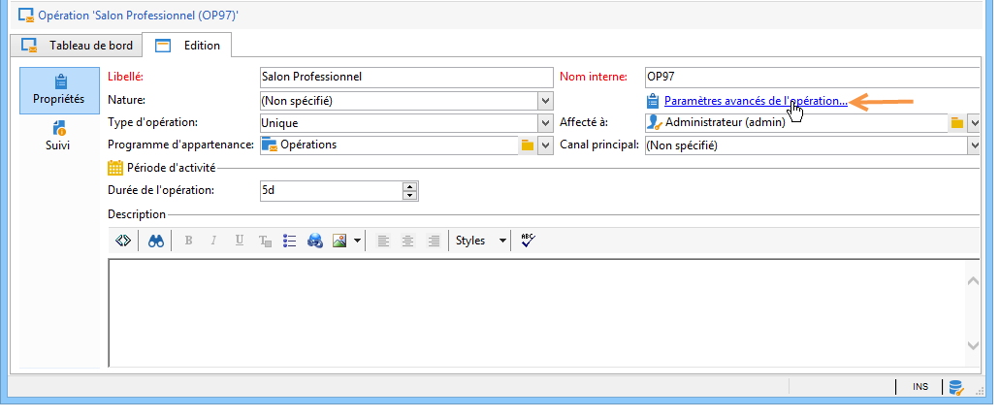

# Modèles de campagne marketing {#campaign-templates}

Les modèles d&#39;opération sont centralisés dans le noeud **[!UICONTROL Ressources > Modèles > Modèles d&#39;opération]**. Un modèle par défaut est livré en standard. Il vous permet de créer une nouvelle opération qui utilise tous les modules disponibles (Documents, Tâches, Adresses de contrôle, etc.). Toutefois, les modules proposés dépendent de vos droits et de la configuration de votre plateforme Adobe Campaign.

## Création ou duplication d&#39;un modèle d&#39;opération {#creating-or-duplicating-a-campaign-template}

Pour créer un modèle, procédez comme suit :

1. Ouvrez l&#39;**Explorateur** de Campaign.
1. Dans **Ressources > Modèles > Modèles d&#39;opération**, cliquez sur **Nouveau** dans la barre d&#39;outils située au-dessus de la liste des modèles.

   

1. Saisissez le libellé du nouveau modèle d&#39;opération.
1. Cliquez sur **Enregistrer**, puis rouvrez le modèle.
1. Dans l&#39;onglet **Edition**, saisissez le **nom interne** et d&#39;autres valeurs si nécessaire.
1. Sélectionnez **Paramètres avancés de l&#39;opération** pour ajouter un workflow à votre modèle d&#39;opération.

   

1. Remplacez la valeur **Ciblages et workflows** par **Oui**.

   

1. Dans l&#39;onglet **Ciblages et workflows**, cliquez sur **Ajouter un workflow...**.

   

1. Renseignez le champ **Libellé** et cliquez sur **OK**.
1. Créez votre workflow selon vos besoins.
1. Cliquez sur **Enregistrer**. Le modèle peut maintenant être utilisé dans une campagne.

Vous pouvez également dupliquer le modèle par défaut afin de le réutiliser et adapter sa configuration à vos besoins.

The various tabs and sub-tabs of the campaign template allow you to access its settings, described in [General configuration](#general-configuration).

## Configurer un modèle d&#39;opération {#configuring-a-campaign-template}

Les campagnes reposent sur des modèles qui partagent un ensemble de paramètres prédéfinis.

Dans une configuration par défaut, les modèles d&#39;opération sont centralisés dans le noeud **[!UICONTROL Ressources > Modèles > Modèles d&#39;opération]** de l&#39;arborescence Adobe Campaign.

>[!NOTE]
>
>L&#39;arborescence est affichée à l&#39;aide de l&#39;icône **[!UICONTROL Explorateur]** de la page d&#39;accueil.

Un modèle prêt à l’emploi est fourni pour créer une campagne pour laquelle aucune configuration spécifique n’a été définie. Vous pouvez créer et configurer des modèles de campagne, puis créer des campagnes à partir de ces modèles.

The creation and configuration of campaign templates are presented in [Campaign templates](#campaign-templates).

Pour plus d&#39;informations sur la création d&#39;une opération, voir la vidéo sur la [création d&#39;une opération et d&#39;un email](https://docs.campaign.adobe.com/doc/AC/en/Videos/Videos.html).

## Configuration des modules proposés {#configuration-of-the-available-modules}

### Sélection des modules {#module-selection}

Le lien **[!UICONTROL Paramètres avancés de l&#39;opération...]** permet d&#39;activer et désactiver les traitements pour les opérations basées sur ce modèle. Sélectionnez dans la liste les fonctionnalités à activer dans les opérations créées à partir de ce modèle.

Si une fonctionnalité n&#39;est pas sélectionnée, les éléments relatifs à ce traitement (menus, icônes, options, onglets, sous-onglets, etc.) n&#39;apparaîtront pas dans l&#39;interface du modèle et des opérations basées sur ce modèle. Typiquement, les onglets situés à gauche du détail d&#39;une opération correspondent aux processus sélectionnés dans le modèle. Par exemple, si le **Dépenses et objectifs** n&#39;est pas sélectionné, l&#39;onglet **[!UICONTROL Budget]** correspondant ne sera pas présent dans les opérations basées sur ce modèle.

De plus, des raccourcis vers les fenêtres de configuration sont ajoutés dans le tableau de bord de l&#39;opération : lorsqu&#39;une fonctionnalité est activée, un lien direct permet d&#39;y accéder depuis le tableau de bord de l&#39;opération.

Par exemple, avec le paramétrage ci-dessous :

Les liens suivants sont affichés dans le tableau de bord de l&#39;opération (le lien **[!UICONTROL Ajouter une tâche]** est manquant) :

Seuls les onglets suivants s’affichent :

Par contre, avec ce type de paramétrage :

Les liens et onglets affichés seront les suivants :

### Typologie des modules activés {#typology-of-enabled-modules}

* **Population témoin**

   Lorsque ce module est sélectionné, un onglet supplémentaire est ajouté dans les paramètres avancés du modèle et des opérations basées sur ce modèle. Le paramétrage peut être défini depuis le modèle ou individuellement au niveau de chaque opération.

   

* **Adresses de contrôle**

   Lorsque ce module est sélectionné, un onglet supplémentaire est ajouté dans les paramètres avancés du modèle et des opérations basées sur ce modèle. Le paramétrage peut être défini depuis le modèle ou individuellement au niveau de chaque opération.

   

* **Documents**

   Lorsque ce module est sélectionné, un onglet supplémentaire est ajouté dans l&#39;onglet **[!UICONTROL Edition]** du modèle et des opérations basées sur ce modèle. Les documents attachés peuvent être ajoutés depuis le modèle ou individuellement au niveau de chaque opération.

   

* **Composition**

   Lorsque ce module est sélectionné, un sous-onglet **[!UICONTROL Compositions de diffusion]** est ajouté à l&#39;onglet **[!UICONTROL Documents]** afin de définir des compositions pour l&#39;opération.

   

* **Ciblages et workflows**

   Lorsque vous sélectionnez le module **[!UICONTROL Ciblages et Workflows]**, un onglet supplémentaire est ajouté afin de créer un ou plusieurs workflows pour les opérations basées sur ce modèle. Les workflows peuvent aussi être paramétrés unitairement au niveau de chaque opération basée sur ce modèle.

   

   Lorsque ce module est activé, un onglet supplémentaire est ajouté dans les paramètres avancés de l&#39;opération afin de définir les priorités d&#39;exécution des traitements.

   

* **Validation**

   Si vous sélectionnez le module **[!UICONTROL Validation]**, vous pouvez sélectionner les traitements à valider et choisir les opérateurs chargés de leur validation.

   

* **Dépenses et objectifs**

   Lorsque ce module est sélectionné, un onglet **[!UICONTROL Budget]** est ajouté dans le détail du modèle et des opérations basées sur ce modèle afin de sélectionner le budget de rattachement.

   

### Validation des traitements {#approval-of-jobs}

Vous pouvez choisir d&#39;activer ou non la validation des traitements, à partir de l&#39;onglet **[!UICONTROL Validations]** des paramètres avancés du modèle. Les traitements pour lesquels une validation est sélectionnée devront être validés pour autoriser la diffusion des messages.

Vous devez associer un opérateur ou groupe d&#39;opérateur validant à chaque validation activée.

## Paramétrage général {#general-configuration}

### Propriétés des modèles {#template-properties}

Lorsque vous créez un modèle d&#39;opération, vous devez indiquer les informations suivantes :

* Saisissez le **libellé** du modèle : ce libellé sera attribué par défaut à toutes les opérations créées à partir de ce modèle.
* Sélectionnez la **nature** de l&#39;opération dans la liste déroulante. Les valeurs proposées dans cette liste correspondent à celles enregistrées dans l&#39;énumération **[!UICONTROL natureOp]**.

   >[!NOTE]
   >
   >Pour plus d&#39;informations sur les énumérations, reportez-vous à la section [Prise en main](../../platform/using/managing-enumerations.md).

* Sélectionnez le **type de campagne**: unique, périodique ou périodique. Par défaut, les modèles de campagne s’appliquent aux campagnes uniques. Les campagnes périodiques et périodiques sont détaillées ici : Campagnes [périodiques et périodiques](../../campaign/using/setting-up-marketing-campaigns.md#recurring-and-periodic-campaigns).
* Indiquez la durée de l&#39;opération, c&#39;est-à-dire la période sur laquelle s&#39;étalera l&#39;opération. Lors de la création d&#39;une opération basée sur ce modèle, les dates de début et de fin de l&#39;opération seront alors automatiquement renseignées.

   S&#39;il s&#39;agit d&#39;une opération récurrente, vous devez indiquer les dates de début et de fin de l&#39;opération directement dans le modèle.

* Indiquez le **programme d&#39;appartenance** du modèle : les opérations basées sur le modèle seront associées au programme sélectionné.

### Paramètres d&#39;exécution du modèle {#template-execution-parameters}

Le lien **[!UICONTROL Paramètres avancés de l&#39;opération...]** permet de configurer les options avancées du modèle pour le traitement de la cible des diffusions (population témoin, adresses de contrôle, etc.), ainsi que la configuration de la mesure des opérations et de l&#39;exécution des workflows.

## Rétroplanning d&#39;opération {#campaign-reverse-scheduling}

Vous pouvez réaliser le rétroplanning d&#39;une opération, par exemple pour préparer un événement dont la date est connue à l&#39;avance. En effet, dans les modèles d&#39;opération, vous pouvez calculer la date de début d&#39;une tâche par rapport à la date de fin d&#39;une opération.

Dans la boîte de paramétrage de la tâche, dans la zone **[!UICONTROL Planning de réalisation]**, cochez la case **[!UICONTROL La date de démarrage est calculée à partir de la date de fin de l&#39;opération]**. (Ici, &quot;date de démarrage&quot; désigne la date de début de la tâche.) Dans le champ **[!UICONTROL Démarrage]**, entrez un intervalle : la tâche commencera d&#39;autant avant la date de fin de l&#39;opération. Si vous entrez une durée supérieure à la durée de l&#39;opération, la tâche commencera avant le début de l&#39;opération.

Lorsque vous créerez une opération d&#39;après ce modèle, la date de début de la tâche sera calculée automatiquement. Il vous sera cependant toujours possible de la modifier.
