# Prestataires, stocks et budgets{#providers-stocks-and-budgets}

Adobe Campaign vous permet de définir des prestataires qui seront impliqués dans les traitements réalisés dans les opérations. Les informations relatives aux prestataires et les structures de coûts qui leur sont associées sont définies par l&#39;administrateur Adobe Campaign, à partir de la vue globale. Le prestataire est référencé au niveau de la diffusion : ses structures de coûts permettent le calcul des coûts liés à cette diffusion ainsi que la gestion des stocks impactés.

## Créer les prestataires et leurs structures de coûts {#creating-service-providers-and-their-cost-structures}

Chaque prestataire est enregistré dans une fiche avec ses coordonnées, ses modèles de prestation et les traitements associés.

Service providers are configured in the **[!UICONTROL Administration > Campaign management]** node of the tree.

Les traitements réalisés dans les diffusions sont assurés par des prestataires, notamment pour le courrier et les canaux mobiles. Ces prestataires peuvent par exemple intervenir dans les opérations d&#39;impression ou de distribution des messages. Ces traitements engendrent des paramétrages et des coûts spécifiques à chaque prestataire. Le paramétrage des prestataires est assuré au travers de quatre étapes :

1. Création du prestataire dans Adobe Campaign.

   See [Adding a service provider](#adding-a-service-provider).

1. Définition des postes et structures de coûts des modèles de prestation qui lui sont associés

   Voir [Définition des catégories](#defining-cost-categories) de coûts et [Définition de la structure](#defining-the-cost-structure)de coûts.

1. Configuration des traitements

   See [Configuring processes associated with a service](#configuring-processes-associated-with-a-service).

1. Référencement du prestataire au niveau des opérations

   See [Associating a service with a campaign](#associating-a-service-with-a-campaign).

### Création d&#39;un prestataire et de ses postes de coûts {#creating-a-service-provider-and-its-cost-categories}

#### Ajouter un prestataire {#adding-a-service-provider}

Vous pouvez créer autant de prestataires que nécessaire pour vos diffusions. Pour ajouter un prestataire, les étapes sont les suivantes :

1. Right-click the list of service providers and select **[!UICONTROL New]**, or click the **[!UICONTROL New]** button above the list of service providers.
1. Dans la section inférieure de la fenêtre, indiquez son nom et ses coordonnées.

   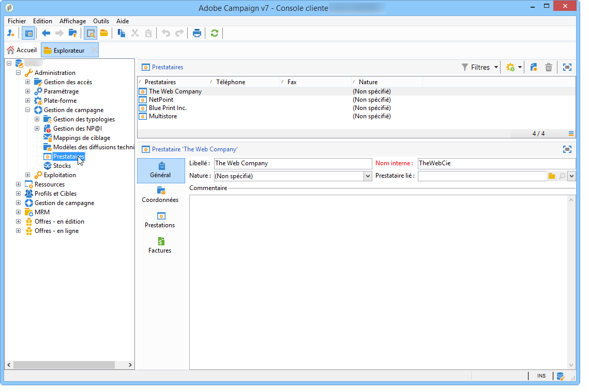

1. Click the **[!UICONTROL Save]** button to add the service provider to the list.

#### Définir les postes de coût {#defining-cost-categories}

A chaque prestataire, vous devez associer des modèles de prestations. Dans ces modèles, vous devez d&#39;abord identifier les différents postes de coût, et au besoin les stocks impactés. Puis, vous devez créer les règles de calcul des coûts pour chaque type de poste, via les structures de coûts.

>[!NOTE]
>
>For more on this, refer to [Defining the cost structure](#defining-the-cost-structure).

Un poste de coût est une entité qui regroupe un ensemble de coûts éligible pour un type de diffusion (email, courrier, etc.) ou pour une tâche. Les postes de coûts sont regroupés dans des modèles de prestations qui sont associés aux prestataires. Chaque prestataire peut référencer un ou plusieurs modèles de prestations.

Pour créer un modèle de prestation et définir son contenu, les étapes sont les suivantes :

1. In the **[!UICONTROL Services]** tab of the service provider, click the **[!UICONTROL Add]** button and name the service template.

   

1. Créez les catégories de coûts pour chaque type de processus (livraison par courrier électronique, courrier électronique, etc.). ou tâche). Pour ce faire, cliquez sur l&#39; **[!UICONTROL Cost categories]** onglet, puis sur le **[!UICONTROL Add]** bouton, puis saisissez les paramètres de chaque catégorie de coûts.

   

   * Enter a label for this cost category and select the type of process concerned: Delivery by **[!UICONTROL Direct mail]**, **[!UICONTROL E-mail]**, **[!UICONTROL Mobile]**, **[!UICONTROL Telephone]**, **[!UICONTROL Fax]** or **[!UICONTROL Task]**.
   * Click the **[!UICONTROL Add]** button to define the types of cost associated with this category.
   * Au besoin, associez une ligne de stock à chaque type de coût afin de reporter automatiquement les quantités utilisées sur les stocks existant.

      >[!NOTE]
      >
      >The stock lines are defined in the **[!UICONTROL Stock management]** node.\
      >Pour plus d&#39;informations sur ce sujet, reportez-vous à la page Gestion [des](#stock-and-order-management)stocks et des commandes.

1. Vous pouvez présélectionner une valeur pour cette catégorie de coûts, qui sera proposée par défaut dans les catégories de coûts du fournisseur de services (au lieu d’un champ vide). Pour ce faire, sélectionnez l’option dans la **[!UICONTROL Selected]** colonne correspondant au type de catégorie concernée :

   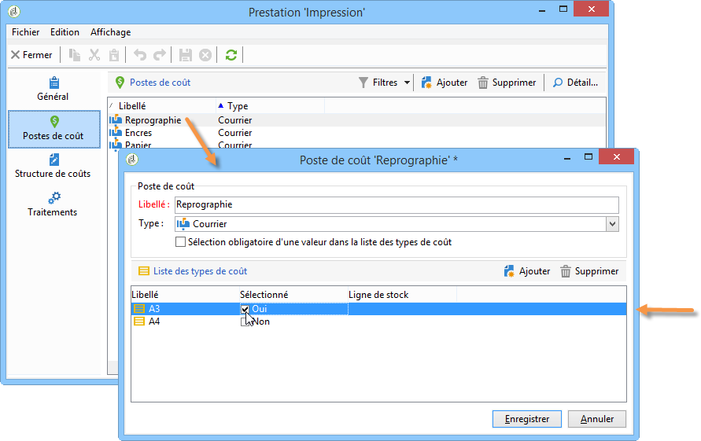

   Au niveau de la diffusion, la valeur sera sélectionnée par défaut :

   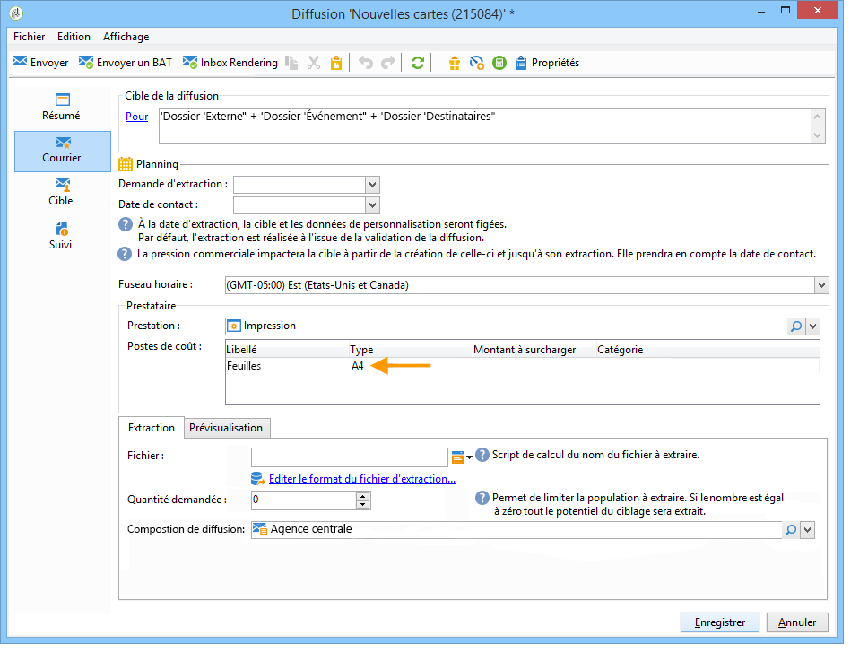

### Définir la structure de coûts {#defining-the-cost-structure}

Une structure de coûts indique, pour chaque type de coût, les règles de calcul à appliquer.

Cliquez sur l&#39; **[!UICONTROL Cost structure]** onglet pour configurer le calcul du coût pour chaque catégorie et type de coût. Cliquez sur **[!UICONTROL Add]** et saisissez la structure de coûts.

* Pour créer la structure des coûts, sélectionnez le type de message et la catégorie de coûts concernés dans les listes déroulantes, ainsi que le type de coût auquel la règle de calcul s&#39;appliquera. Le contenu de ces listes déroulantes provient des informations saisies via l’ **[!UICONTROL Cost categories]** onglet.

   Vous devez attribuer un libellé à la structure de coûts. Par défaut, il est composé comme suit : **Poste de coût - Type de coût**.

   You can, however, rename it: enter the desired value directly in the **[!UICONTROL Label]** field.

* La formule de calcul du coût est définie dans la section inférieure de la fenêtre.

   Cette formule peut être fixe (quel que soit le nombre de message), ou calculée en fonction du nombre de messages.

   En fonction du nombre de messages, la structure de calcul des coûts peut être **[!UICONTROL Linear]**, **[!UICONTROL Linear by threshold]** ou **[!UICONTROL Constant by threshold]**.

#### Structure linéaire {#linear-structure}

If the amount is always the same for a message (or a batch of messages) irrespective of the total number of messages, select **[!UICONTROL Linear]** and enter the cost of each message.

If this amount applies to a batch of messages, specify the number of messages concerned in the **[!UICONTROL for]** field.

#### Structure linéaire par seuil {#linear-structure-by-threshold}

Si le montant s’applique par seuil pour chaque message, vous devez définir une structure de **[!UICONTROL Linear by threshold]** calcul. Dans ce type de structure de coûts, chaque message coûtera 0,13, par exemple, si le nombre total de messages est compris entre 1 et 100, et 0,12 entre 100 et 1 000 messages envoyés, ou 0,11 au-delà de 1 000 messages.

Le paramétrage sera le suivant :

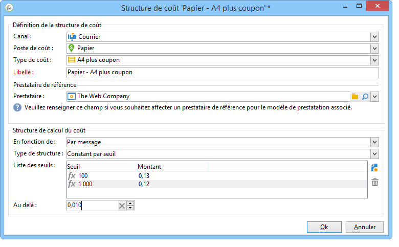

To add a threshold, click the **[!UICONTROL Add]** button to the right of the list.

#### Structure constante par seuil {#constant-structure-by-threshold}

Enfin, vous pouvez configurer un calcul de coût en fonction du nombre total de messages. Pour ce faire, sélectionnez une structure de **[!UICONTROL Constant by threshold]** calcul. Par exemple, le coût sera fixé à 12,00 pour 1 à 100 messages, et à 100,00 pour 101 à 1000 messages, et à 500,00 pour toute remise de plus de 1000 messages, quel que soit le nombre total.

### Paramétrer les traitements associés à la prestation {#configuring-processes-associated-with-a-service}

You can associate information on the processes associated with the service via the **[!UICONTROL Processes]** tab.

To do this, click the **[!UICONTROL Processes]** tab to configure the sending of information to the router.

* La **[!UICONTROL File extraction]** section indique le modèle d’exportation utilisé pour la livraison lorsque ce service est sélectionné. Vous pouvez indiquer le nom du fichier de sortie dans le **[!UICONTROL Extraction file]** champ. Le bouton à droite du champ permet d’insérer des variables.

   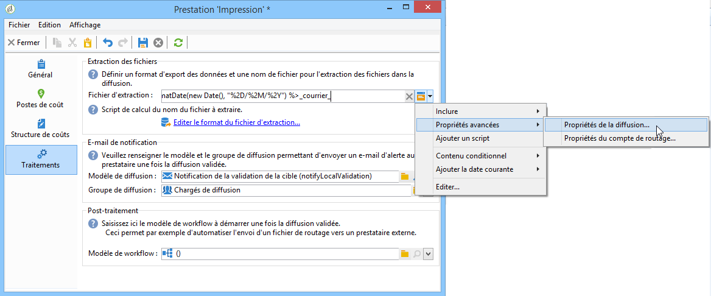

* La **[!UICONTROL Notification e-mail]** section vous permet de spécifier le modèle pour avertir les fournisseurs de services une fois les fichiers envoyés. Sélectionnez le modèle utilisé pour créer le message d’alerte et le groupe de destinataires.

   By default, delivery templates for notification messages are saved in the **[!UICONTROL Administration > Campaign management > Technical delivery templates]** node, which is accessible from the general view.

* La **[!UICONTROL Post-processing]** section vous permet de sélectionner le processus à lancer une fois la diffusion approuvée. Si un modèle de processus est saisi, une instance de processus est automatiquement créée, puis lancée dès que l’approbation prend effet. Ce processus peut envoyer le fichier d’extraction à un fournisseur de services externe pour traitement, par exemple.

### Associer une prestation à une opération {#associating-a-service-with-a-campaign}

Les prestations sont associées aux opérations via les diffusions ou les tâches. Les prestataires sont associés aux modèles de diffusion afin de proposer leurs prestations dans les diffusions créées depuis ce modèle.

Lorsqu&#39;une prestation est sélectionnée, les postes de coûts correspondants au type de diffusion (courrier, email, etc.) sont automatiquement indiqués dans le tableau central, ainsi que les options de traitement qui ont été définies.

>[!NOTE]
>
>Si aucune catégorie de coûts n’est affichée lorsqu’un service est sélectionné, cela signifie qu’aucune catégorie de coûts n’a été définie pour ce type de processus. Par exemple, dans le cas d’une remise par courrier électronique, si aucune catégorie de coût de **[!UICONTROL E-mail]** type n’a été définie, aucune catégorie ne s’affichera et la sélection du service n’aura aucun effet.

* Pour une diffusion courrier, vous pouvez sélectionner la prestation à partir de la fenêtre de configuration.

   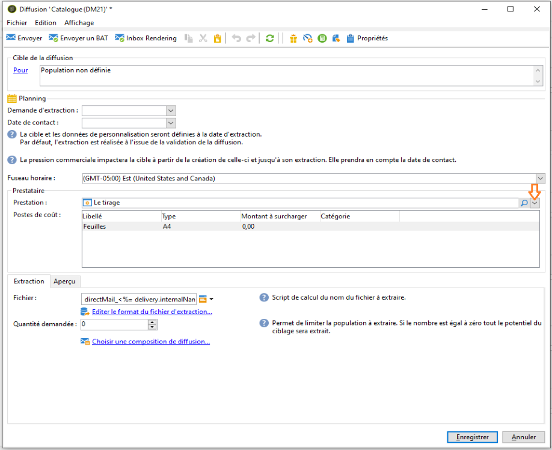

* Pour une diffusion sur canaux mobiles, par fax ou téléphone, le mode de sélection est le même.
* For an email delivery, the service is selected from the **[!UICONTROL Advanced]** tab in the delivery properties, as in the following example:

   

The **[!UICONTROL Amount to surcharge]** column lets you add a cost for this category in the context of the delivery or task concerned.

You can impose mandatory selection of a cost type during the definition of cost categories for a delivery. To do this, select **[!UICONTROL A cost type must be selected]**.

## Gestion des stocks et des commandes {#stock-and-order-management}

Les types de coûts peuvent être associés à des lignes de stocks afin de gérer les alertes, suivre les approvisionnements et lancer des commandes.

Pour mettre en place la gestion des stocks et des commandes dans Adobe Campaign, et alerter les opérateurs en cas d&#39;approvisionnement insuffisant pour la réalisation d&#39;une diffusion, les étapes sont les suivantes :

1. Création des stocks et référencement des prestataires associés.

   See [Creating a stock](#creating-a-stock).

1. Ajouter les lignes de stocks

   Voir [Ajout de lignes](#adding-stock-lines)boursières.

1. Notification des opérateurs en cas d&#39;alerte

   Voir Opérateurs [d’](#alerting-operators)alerte.

1. Commandes et approvisionnement

   Consultez [Commandes](#orders).

### Gestion des stocks {#stock-management}

Adobe Campaign peut avertir un groupe d’opérateurs si le stock est épuisé ou a atteint un seuil minimum. Les niveaux de stock sont accessibles par le **[!UICONTROL Stocks]** lien de l&#39; **[!UICONTROL Campaigns]** univers via le **[!UICONTROL Other choices]** lien de la zone de navigation.

#### Créer un stock {#creating-a-stock}

Pour créer un nouveau stock, les étapes sont les suivantes :

1. Click the **[!UICONTROL Create]** button above the list of stocks.
1. Saisissez le libellé du stock et sélectionnez dans la liste déroulante le prestataire auquel il est associé.

   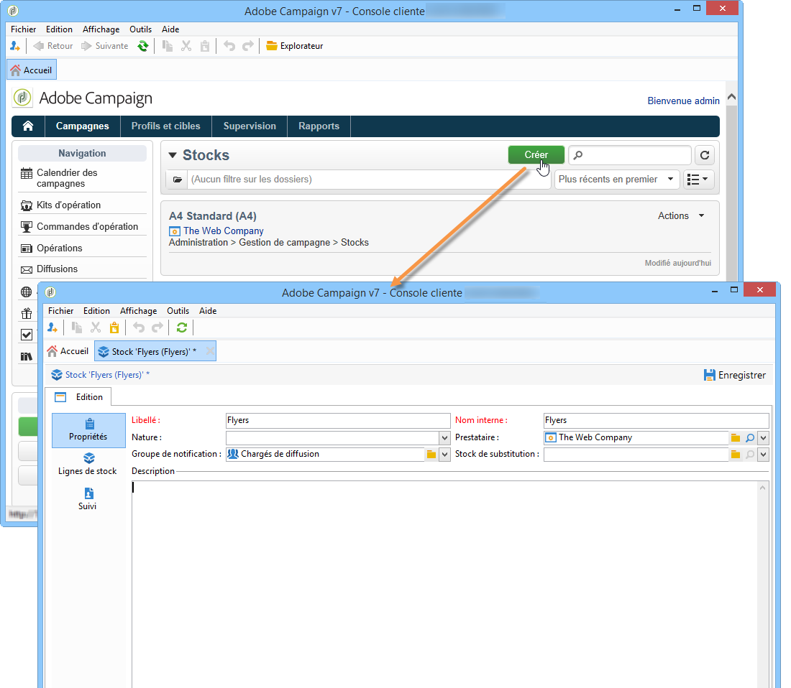

   >[!NOTE]
   >
   >Pour plus d&#39;informations, reportez-vous à [Création de fournisseurs de services et à leurs structures](#creating-service-providers-and-their-cost-structures)de coûts.

#### Ajouter les lignes de stocks {#adding-stock-lines}

Un stock est composé de différentes lignes de stocks. Une ligne de stock contient une quantité initiale de ressources qui seront consommées par les diffusions. Chaque ligne de stock indique aussi la quantité consommée, la quantité en stock et la quantité en commande.

When you create a stock, click the **[!UICONTROL Stock lines]** tab to add new lines.

Une fois le stock créé, cliquez sur un stock pour l&#39;éditer et utilisez son tableau de bord pour créer et visualiser les lignes de stock.

Click the **[!UICONTROL Create]** button to define the stock parameters.

* Indiquez la quantité initialement en stock dans le **[!UICONTROL Initial stock]** champ. Les champs **[!UICONTROL Consumed]** et **[!UICONTROL In stock]** sont calculés automatiquement et mis à jour au fur et à mesure que les campagnes progressent.

   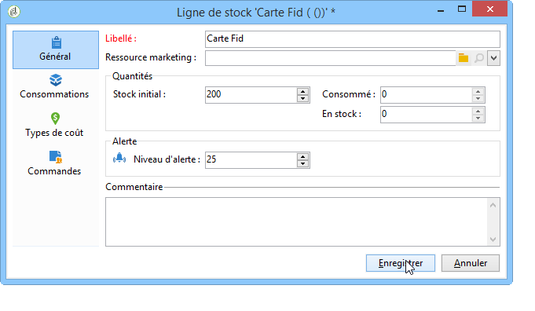

* Indiquez le seuil à partir duquel les opérateurs doivent être avertis pour commander des stocks dans le **[!UICONTROL Alert level]** champ. Lorsque le niveau d’alerte est atteint, un message d’avertissement s’affiche dans la fenêtre d’approbation des livraisons utilisant ce stock.

#### Associer un stock à des postes de coûts {#associating-a-stock-with-cost-categories}

Au niveau du prestataire, dans une prestation, une ligne de stock peut être référencée par l&#39;un de ses postes de coûts, comme ci-dessous :

### Tracking des stocks {#stock-tracking}

#### Alerter les opérateurs {#alerting-operators}

Une alerte est affichée lorsqu&#39;un stock référencé dans une diffusion est insuffisant. Par exemple, l&#39;alerte suivante sera affichée lors de la validation d&#39;un fichier d&#39;extraction :

#### Les commandes {#orders}

The **[!UICONTROL Orders]** sub-tab lets you view current orders and save new orders.

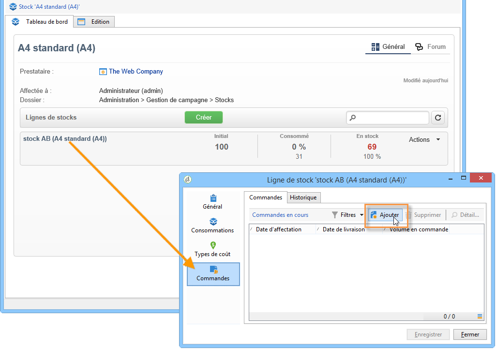

To save an order, edit the targeted stock line, click the **[!UICONTROL Add]** button and specify the delivery date and the quantity ordered.

>[!NOTE]
>
>Une fois la date de livraison atteinte, la ligne de stock commandée disparaît automatiquement et la quantité saisie dans le **[!UICONTROL Volume on order]** champ est ajoutée à l&#39; **[!UICONTROL Tracking]** onglet. Cette quantité est automatiquement ajoutée au volume du stock.

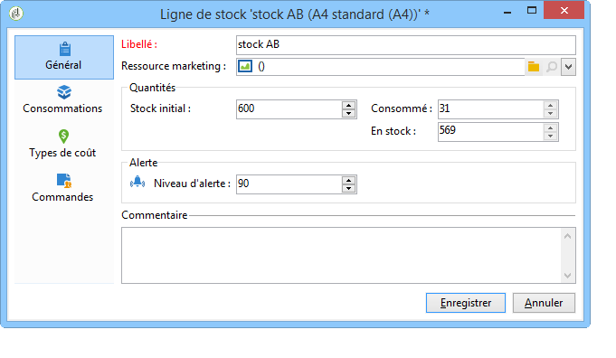

L&#39; **[!UICONTROL Consumptions]** onglet contient le volume consommé par campagne. Les informations de cet onglet sont automatiquement saisies en fonction des livraisons effectuées. Cliquez sur le **[!UICONTROL Edit]** bouton pour ouvrir la campagne concernée.

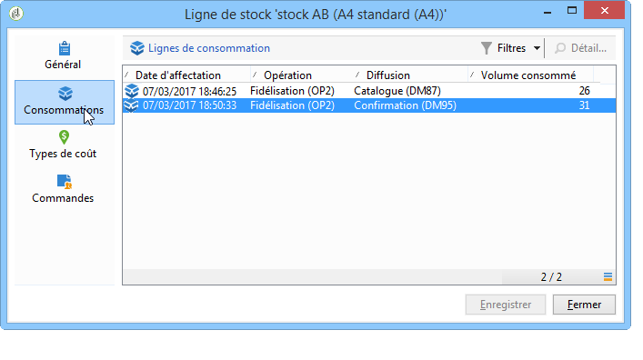

## Calcul des budgets {#calculating-budgets}

### Principe {#principle}

Les coûts sont gérés pour les diffusions et les opérations. En fonction de l&#39;état d&#39;avancement, ces coûts seront répercutés sur les budgets.

Les coûts de diffusion d&#39;une opération sont consolidés au niveau de l&#39;opération et les coûts de toutes les opérations d&#39;un programme sont répercutées au niveau du programme auquel elles sont associées. Des rapports dédiés permettent d&#39;assurer le suivi des budgets pour l&#39;ensemble de la plateforme ou au niveau de chaque plan et de chaque programme.

### Mise en oeuvre {#implementation}

Dans une campagne, lorsque vous sélectionnez le budget, vous devez saisir le montant initial. Les coûts calculés seront automatiquement mis à jour en fonction du niveau d&#39;engagement des montants inscrits (dépenses effectuées, attendues, réservées, engagées). Voir [Calcul des montants](../../campaign/using/controlling-costs.md#calculating-amounts).

>[!NOTE]
>
>La procédure de création de budgets est présentée dans [Création d&#39;un budget](../../campaign/using/controlling-costs.md#creating-a-budget).

