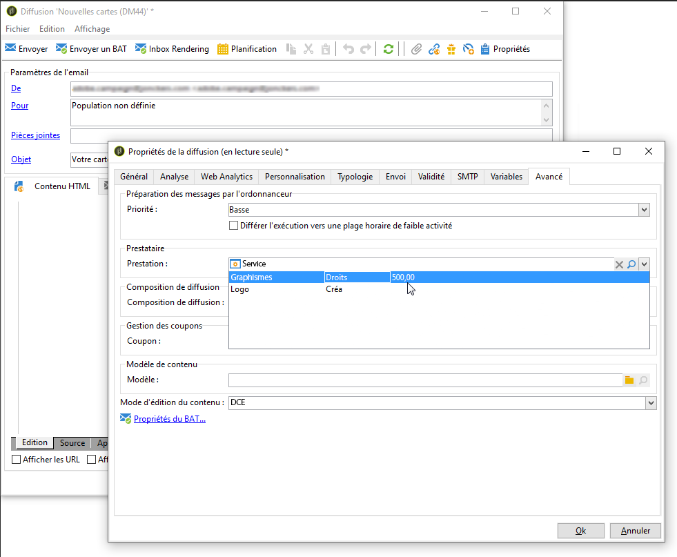
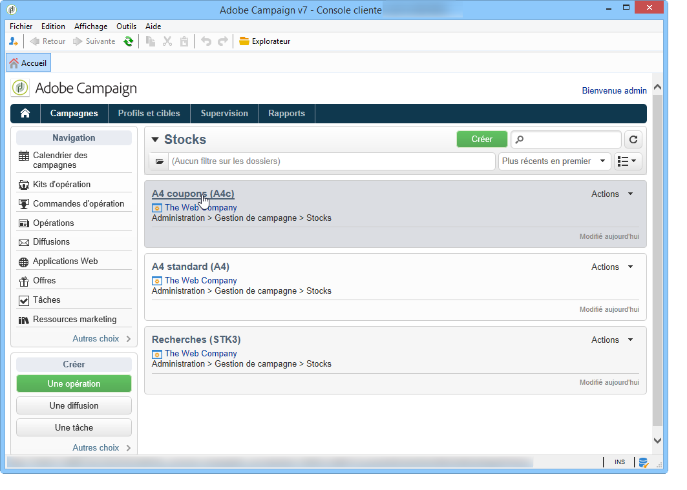
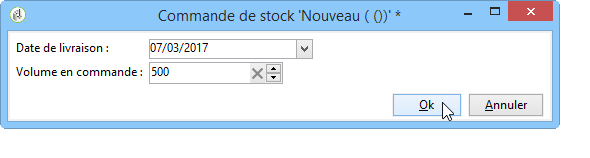

# Prestataires, stocks et budgets{#providers-stocks-and-budgets}

Adobe Campaign vous permet de définir des prestataires qui seront impliqués dans les traitements réalisés dans les opérations. Les informations relatives aux prestataires et les structures de coûts qui leur sont associées sont définies par l&#39;administrateur Adobe Campaign, à partir de la vue globale. Le prestataire est référencé au niveau de la diffusion : ses structures de coûts permettent le calcul des coûts liés à cette diffusion ainsi que la gestion des stocks impactés.

## Créer les prestataires et leurs structures de coûts {#creating-service-providers-and-their-cost-structures}

Chaque prestataire est enregistré dans une fiche avec ses coordonnées, ses modèles de prestation et les traitements associés.

Les prestataires sont paramétrés dans le noeud **[!UICONTROL Administration > Gestion de campagne > Prestataires]** de l&#39;arborescence.

Les traitements réalisés dans les diffusions sont assurés par des prestataires, notamment pour le courrier et les canaux mobiles. Ces prestataires peuvent par exemple intervenir dans les opérations d&#39;impression ou de distribution des messages. Ces traitements engendrent des paramétrages et des coûts spécifiques à chaque prestataire. Le paramétrage des prestataires est assuré au travers de quatre étapes :

1. Création du prestataire dans Adobe Campaign.

   Voir [Ajouter un prestataire](#adding-a-service-provider).

1. Définition des postes et structures de coûts des modèles de prestation qui lui sont associés

   Voir [Définir les postes de coût](#defining-cost-categories) et [Définir la structure de coûts](#defining-the-cost-structure).

1. Configuration des traitements

   Voir [Paramétrer les traitements associés à la prestation](#configuring-processes-associated-with-a-service).

1. Référencement du prestataire au niveau des opérations

   Voir [Associer une prestation à une campagne](#associating-a-service-with-a-campaign).

### Création d&#39;un prestataire et de ses postes de coûts {#creating-a-service-provider-and-its-cost-categories}

#### Ajouter un prestataire {#adding-a-service-provider}

Vous pouvez créer autant de prestataires que nécessaire pour vos diffusions. Pour ajouter un prestataire, les étapes sont les suivantes :

1. Cliquez avec le bouton droit dans la liste des prestataires et choisissez **[!UICONTROL Nouveau]**, ou cliquez sur le bouton **[!UICONTROL Nouveau]** situé au-dessus de la liste des prestataires.
1. Dans la section inférieure de la fenêtre, indiquez son nom et ses coordonnées.

   

1. Cliquez sur le bouton **[!UICONTROL Enregistrer]** pour ajouter le prestataire dans la liste.

#### Définir les postes de coût {#defining-cost-categories}

A chaque prestataire, vous devez associer des modèles de prestations. Dans ces modèles, vous devez d&#39;abord identifier les différents postes de coût, et au besoin les stocks impactés. Puis, vous devez créer les règles de calcul des coûts pour chaque type de poste, via les structures de coûts.

>[!NOTE]
>
>Voir à ce sujet la section [Définir la structure de coûts](#defining-the-cost-structure).

Un poste de coût est une entité qui regroupe un ensemble de coûts éligible pour un type de diffusion (email, courrier, etc.) ou pour une tâche. Les postes de coûts sont regroupés dans des modèles de prestations qui sont associés aux prestataires. Chaque prestataire peut référencer un ou plusieurs modèles de prestations.

Pour créer un modèle de prestation et définir son contenu, les étapes sont les suivantes :

1. Dans l&#39;onglet **[!UICONTROL Prestations]** du prestataire, cliquez sur le bouton **[!UICONTROL Ajouter]** et nommez le modèle de prestation.

   

1. Créez les postes de coûts pour chaque type de traitement (diffusion par courrier/email/etc. ou tâche). Pour ce faire, cliquez sur le bouton **[!UICONTROL Catégories de coûts]** puis l’onglet **[!UICONTROL Ajouter]** et renseignez les paramètres de chaque poste de coût.

   

   * Saisissez un libellé pour ce poste de coût et sélectionnez le type de traitement concerné : diffusion par **[!UICONTROL Courrier]**, **[!UICONTROL E-mail]**, **[!UICONTROL Mobile]**, **[!UICONTROL Téléphone]** ou **[!UICONTROL Tâche]**.
   * Cliquez sur le bouton **[!UICONTROL Ajouter]** pour définir les types de coûts associés à ce poste.
   * Au besoin, associez une ligne de stock à chaque type de coût afin de reporter automatiquement les quantités utilisées sur les stocks existant.

     >[!NOTE]
     >
     >Les lignes de stock sont définies dans le noeud **[!UICONTROL Gestion des stocks]**.\
     >Voir à ce sujet la section [Gestion des stocks et des commandes](#stock-and-order-management).

1. Vous pouvez pré-sélectionner une valeur pour ce poste de coût, qui sera proposée par défaut dans les postes de coûts du prestataire (plutôt qu&#39;une valeur vide). Pour ce faire, sélectionnez l’option dans le **[!UICONTROL Sélectionné]** pour le type de catégorie concernée :

   

   Au niveau de la diffusion, la valeur sera sélectionnée par défaut :

   

### Définir la structure de coûts {#defining-the-cost-structure}

Une structure de coûts indique, pour chaque type de coût, les règles de calcul à appliquer.

Cliquez sur le bouton **[!UICONTROL Structure de coûts]** pour paramétrer le calcul des coûts pour chaque poste et type de coût. Cliquez sur **[!UICONTROL Ajouter]** et saisissez la structure de coûts.

* Pour créer la structure de coûts, sélectionnez dans les listes déroulantes le type de message et le poste de coût concerné, ainsi que le type de coût sur lequel s&#39;appliquera la règle de calcul. Le contenu de ces listes déroulantes reprend les informations renseignées à partir du **[!UICONTROL Catégories de coûts]** .

  Vous devez attribuer un libellé à la structure de coûts. Par défaut, elle présente la composition de diffusion suivante : **Poste de coût - Type de coût**.

  Vous pouvez toutefois le renommer : saisissez alors directement la valeur souhaitée dans le champ **[!UICONTROL Libellé]**.

* La formule de calcul du coût est définie dans la section inférieure de la fenêtre.

  Cette formule peut être fixe (quel que soit le nombre de message), ou calculée en fonction du nombre de messages.

  Lorsqu&#39;elle dépend du nombre de messages, la structure de calcul du coût peut être **[!UICONTROL Linéaire]**, **[!UICONTROL Linéaire par seuil]** ou **[!UICONTROL Constant par seuil]**.

#### Structure linéaire {#linear-structure}

Si le montant est toujours le même, pour un message (ou un lot de messages), et ce, quel que soit le nombre de messages total, sélectionnez un type de structure **[!UICONTROL Linéaire]** et saisissez le coût de chaque message.

Si ce montant s&#39;applique à un lot de messages, indiquez le nombre de messages concernés dans le champ **[!UICONTROL pour]**.

#### Structure linéaire par seuil {#linear-structure-by-threshold}

Si le montant s&#39;applique par seuil pour chaque message, vous devez alors définir une structure de calcul **[!UICONTROL Linéaire par seuil]**. Dans ce type de structure de coût, chaque message coûtera, par exemple, 0,13 si le nombre total de message se situe entre 1 et 100, puis coûtera 0,12 entre 100 et 1000 messages envoyés, et 0,11 au-delà de 1000 messages.

Le paramétrage sera le suivant :

Pour ajouter un seuil, cliquez sur le bouton **[!UICONTROL Ajouter]** situé à droite de la liste.

#### Structure constante par seuil {#constant-structure-by-threshold}

Enfin, vous pouvez paramétrer un calcul des coûts en fonction du nombre total de messages. Pour ce faire, sélectionnez une **[!UICONTROL Constante par seuil]** structure de calcul. Par exemple, le coût sera fixé à 12,00 pour 1 à 100 messages, et à 100,00 pour une diffusion de 101 à 1000 messages, et à 500,00 pour toute diffusion de plus de 1000 messages, quel que soit le nombre total.

### Paramétrer les traitements associés à la prestation {#configuring-processes-associated-with-a-service}

Vous pouvez associer des informations sur les traitements liés à une prestation depuis l&#39;onglet **[!UICONTROL Traitements]**.

Pour cela, cliquez sur l&#39;onglet **[!UICONTROL Traitements]** pour paramétrer l&#39;envoi des informations au routeur.

* La variable **[!UICONTROL Extraction de fichier]** indique le modèle d&#39;export utilisé pour la diffusion lorsque cette prestation est sélectionnée. Vous pouvez indiquer le nom du fichier de sortie dans la variable **[!UICONTROL Fichier d&#39;extraction]** champ . Le bouton situé à droite du champ permet d&#39;insérer des variables.

  

* La section **[!UICONTROL E-mail de notification]** permet d’indiquer le modèle de notification au fournisseur de services après l’envoi des fichiers. Vous devez sélectionner le modèle utilisé pour créer le message d’alerte et le groupe de destinataires.

  Par défaut, les modèles de diffusion pour les messages de notification sont enregistrés sous le noeud **[!UICONTROL Administration > Gestion de campagne > Modèles des diffusions techniques]**, accessible depuis la vue globale.

* La section **[!UICONTROL Post-traitement]** permet de sélectionner le workflow à lancer une fois la diffusion validée. Si un modèle de workflow est renseigné, une instance de workflow sera automatiquement créée puis démarrée dès que la validation sera effective. Ce workflow peut par exemple permettre d&#39;envoyer le fichier d&#39;extraction vers un prestataire externe chargé de l&#39;exploiter.

### Associer une prestation à une opération {#associating-a-service-with-a-campaign}

Les services sont associés aux opérations via les diffusions ou les tâches. Les fournisseurs de services sont associés aux modèles de diffusion afin de proposer leurs services dans les diffusions créées depuis ce modèle.

Lorsqu’un service est sélectionné, les postes de coûts correspondant au type de diffusion (courrier, e-mail, etc.) sont automatiquement indiqués dans le tableau central, ainsi que les options de traitement qui ont été définies.

>[!NOTE]
>
>Si aucun poste de coût n&#39;est affiché lorsqu&#39;une prestation est sélectionnée, cela signifie qu&#39;aucun poste de coût n&#39;a été défini pour ce type de traitement. Par exemple, pour une diffusion email, si aucun **[!UICONTROL Email]** le type de poste de coût a été défini, aucun poste ne s&#39;affichera et la sélection du service n&#39;aura aucun effet.

* Pour une diffusion courrier, vous pouvez sélectionner le service à partir de la fenêtre de configuration.

  

* Pour une diffusion sur canaux mobiles ou par téléphone, le mode de sélection est le même.
* Pour une diffusion par email, la prestation est sélectionnée à partir de l&#39;onglet **[!UICONTROL Avancé]** des propriétés de la diffusion, comme dans l&#39;exemple ci-dessous :

  

La colonne **[!UICONTROL Montant à surcharger]** permet d&#39;ajouter un coût pour ce poste dans le contexte de la diffusion ou de la tâche concernée.

Vous pouvez imposer une sélection obligatoire d&#39;un type de coût lors de la définition des postes de coût pour une diffusion. Pour ce faire, sélectionnez **[!UICONTROL Un type de coût doit être sélectionné]**.

## Gestion des stocks et des commandes {#stock-and-order-management}

Les types de coûts peuvent être associés à des lignes de stocks afin de gérer les alertes, suivre les approvisionnements et lancer des commandes.

Pour mettre en place la gestion des stocks et des commandes dans Adobe Campaign, et alerter les opérateurs en cas d&#39;approvisionnement insuffisant pour la réalisation d&#39;une diffusion, les étapes sont les suivantes :

1. Création des stocks et référencement des prestataires associés.

   Voir [Créer un stock](#creating-a-stock).

1. Ajouter les lignes de stocks

   Voir [Ajouter les lignes de stock](#adding-stock-lines).

1. Notification des opérateurs en cas d&#39;alerte

   Voir [Alerter les opérateurs](#alerting-operators).

1. Commandes et approvisionnement

   Voir [Commandes](#orders).

### Gestion des stocks {#stock-management}

Adobe Campaign peut alerter un groupe d’utilisateurs si le stock est épuisé ou a atteint un seuil minimum. Les niveaux de stock sont accessibles via le lien **[!UICONTROL Stocks]** de l’onglet **[!UICONTROL Campagnes]** à partir du lien **[!UICONTROL Autres choix]** dans la zone de navigation.

#### Créer un stock {#creating-a-stock}

Pour créer un nouveau stock, les étapes sont les suivantes :

1. Cliquez sur le bouton **[!UICONTROL Créer]** situé au-dessus de la liste des stocks.
1. Saisissez le libellé du stock et sélectionnez dans la liste déroulante le prestataire auquel il est associé.

   

   >[!NOTE]
   >
   >Voir à ce sujet la section [Créer les prestataires et leurs structures de coûts](#creating-service-providers-and-their-cost-structures).

#### Ajouter les lignes de stocks {#adding-stock-lines}

Un stock est composé de différentes lignes de stocks. Une ligne de stock contient une quantité initiale de ressources qui seront consommées par les diffusions. Chaque ligne de stock indique aussi la quantité consommée, la quantité en stock et la quantité en commande.

Lorsque vous créez un stock, cliquez sur l&#39;onglet **[!UICONTROL Lignes de stock]** pour ajouter des lignes de stocks.

Une fois le stock créé, cliquez sur un stock pour l&#39;éditer et utilisez son tableau de bord pour créer et visualiser les lignes de stock.

Cliquez sur le bouton **[!UICONTROL Créer]** pour définir les paramètres du stock.

* Indiquez la quantité initialement en stock dans la variable **[!UICONTROL Stock initial]** champ . La variable **[!UICONTROL Consommé]** et **[!UICONTROL En stock]** les champs sont calculés automatiquement et mis à jour au fil des opérations.

  

* Indiquez, dans le champ **[!UICONTROL Niveau d&#39;alerte]**, le seuil à partir duquel il faudra alerter les opérateurs de le renouveler. Lorsque le niveau d&#39;alerte est atteint, un avertissement est affiché dans la fenêtre de validation des diffusions qui utilisent ce stock.

#### Associer un stock à des postes de coûts {#associating-a-stock-with-cost-categories}

Au niveau du prestataire, dans une prestation, une ligne de stock peut être référencée par l&#39;un de ses postes de coûts, comme ci-dessous :

### Tracking des stocks {#stock-tracking}

#### Alerter les opérateurs {#alerting-operators}

Une alerte est affichée lorsqu&#39;un stock référencé dans une diffusion est insuffisant. Par exemple, l&#39;alerte suivante sera affichée lors de la validation d&#39;un fichier d&#39;extraction :

#### Les commandes {#orders}

Le sous-onglet **[!UICONTROL Commandes]** permet de visualiser les commandes en cours et d&#39;enregistrer de nouvelles commandes.

Pour enregistrer une commande, éditez la ligne de stock visée, cliquez sur le bouton **[!UICONTROL Ajouter]** et indiquez la date de livraison et la quantité commandée.

>[!NOTE]
>
>Une fois la date de livraison atteinte, la ligne de stock en commande disparaît automatiquement et la quantité renseignée dans le champ **[!UICONTROL Volume en commande]** passe dans l&#39;onglet **[!UICONTROL Tracking]**. Cette quantité est automatiquement ajoutée au volume en stock.

La variable **[!UICONTROL Consommations]** contient le volume consommé par opération. Les informations de cet onglet sont automatiquement renseignées en fonction des diffusions réalisées. Cliquez sur le bouton **[!UICONTROL Modifier]** pour ouvrir l&#39;opération concernée.

## Calcul des budgets {#calculating-budgets}

### Principe {#principle}

Les coûts sont gérés pour les diffusions et les opérations. En fonction de l&#39;état d&#39;avancement, ces coûts seront répercutés sur les budgets.

Les coûts de diffusion d&#39;une opération sont consolidés au niveau de l&#39;opération et les coûts de toutes les opérations d&#39;un programme sont répercutées au niveau du programme auquel elles sont associées. Des rapports dédiés permettent d&#39;assurer le suivi des budgets pour l&#39;ensemble de la plateforme ou au niveau de chaque plan et de chaque programme.

### Mise en œuvre {#implementation}

Dans une opération, lorsque vous sélectionnez le budget, vous devez renseigner le montant initial. Les coûts calculés seront mis à jour automatiquement en fonction du degré d&#39;engagement des montants renseignés (dépenses réalisées, prévues, réservées, engagées). Voir [Calcul des montants](../../mrm/using/controlling-costs.md#calculating-amounts).

>[!NOTE]
>
>La procédure de création de budgets est présentée dans [Créer un budget](../../mrm/using/controlling-costs.md#creating-a-budget).
