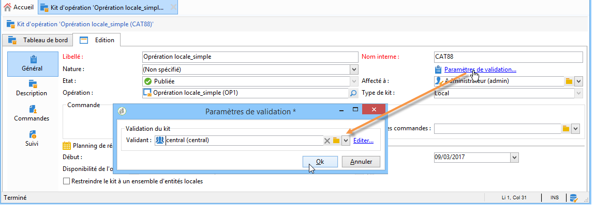
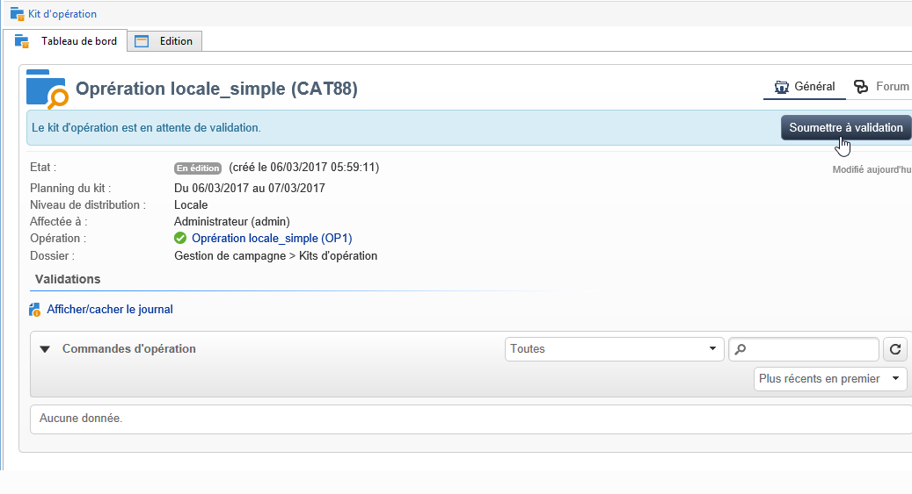
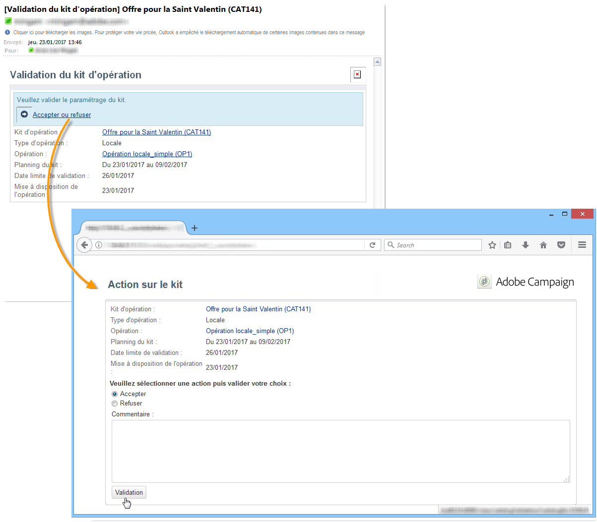
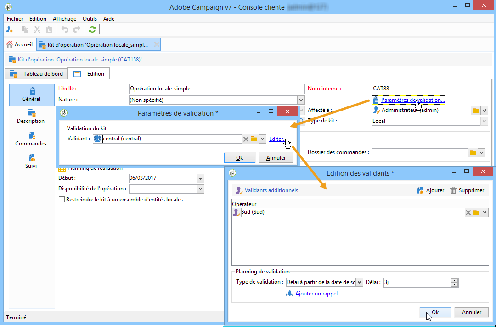
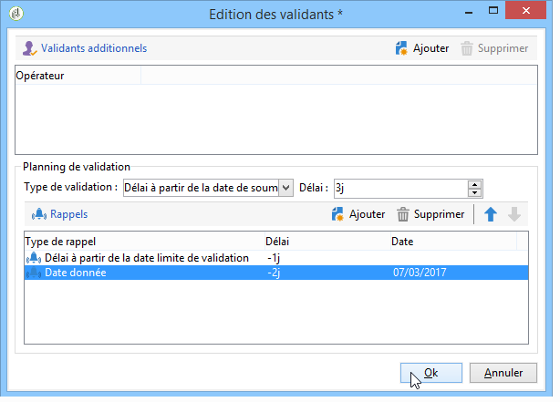
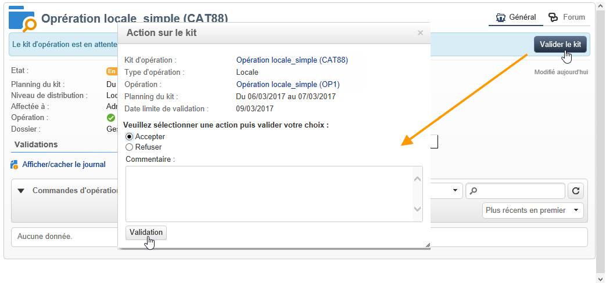

# Publier le kit d&#39;opération{#publishing-the-campaign-package}

Central entity operators publish campaigns they wish to offer to local entities in the **[!UICONTROL list of campaign packages]**.

Avant de pouvoir les publier dans la liste des packages de campagne, les packages de campagne doivent être approuvés par l’entité centrale. Pour ce faire, vous pouvez spécifier un réviseur ou un groupe de réviseurs via le **[!UICONTROL Approval parameters]** lien du package de campagne.

## Définir un opérateur validant {#assigning-a-reviewer}

To select the reviewer, click the **[!UICONTROL Approval parameters]** link from the campaign package and choose the relevant reviewer from the drop-down list.

You may then begin the approval process by clicking **[!UICONTROL Submit for approval]**.

Un message de notification est alors envoyé à l&#39;opérateur validant afin de confirmer la mise à disposition de ce kit d&#39;opération. Ce message propose un lien pour accepter ou refuser la validation via un accès Web.

>[!NOTE]
>
>Au niveau de l&#39;entité organisationnelle, vous pouvez également spécifier des réviseurs pour approuver les commandes. For more on this, refer to [Organizational entities](../../campaign/using/about-distributed-marketing.md#organizational-entities).

## Ajouter d&#39;autres opérateurs validants {#adding-other-reviewers}

You can add other reviewers from the **[!UICONTROL Edit...]** link, found in the campaign package&#39;s **[!UICONTROL Approval parameters...]** tab.

## Délais de validation {#approval-periods}

Par défaut, les opérateurs validants disposent de trois jours pour procéder à la validation, à partir de la date de soumission.

Dans la fenêtre Modifier les réviseurs, vous pouvez également définir des rappels pour envoyer un ou plusieurs messages si un package de campagne n’a pas été approuvé. Pour ce faire, cliquez sur le **[!UICONTROL Add reminder]** lien, puis sur le **[!UICONTROL Add]** bouton.

Les rappels peuvent être envoyés à une date donnée et/ou **x** jours après la date d&#39;envoi. Le type de rappel peut être configuré dans la première colonne du tableau des rappels. Dans l’exemple ci-dessous, les réviseurs recevront un message de rappel le 29/01/2014, c’est-à-dire deux jours avant la date sélectionnée dans la **[!UICONTROL Date]** colonne, et un deuxième rappel un jour avant la fin de la période d’approbation, c’est-à-dire deux jours après la date d’approbation de l’envoi.

Une fois défini et que le package a été envoyé pour approbation, le calendrier d’exécution s’affiche dans l’ **[!UICONTROL Audit]** onglet. Il indique la date limite de traitement calculée en fonction de la configuration précédente, ainsi que les dates de tous les rappels configurés.

## Validation via la console Adobe Campaign {#approving-via-the-adobe-campaign-console}

If no reviewer has been specified or if none of the notified operators have approved the package, the **[!UICONTROL Approve the package]** button lets you proceed directly to the approval from the campaign package **[!UICONTROL Dashboard]** or from the packages overview.

Après approbation, la campagne est publiée, ajoutée à la liste et, dès que la date de disponibilité est atteinte, les entités locales peuvent l’utiliser. Si les entités locales ont été spécifiées lors de la création de la campagne, un message est envoyé aux opérateurs du groupe de notification pour les informer que la campagne est disponible. Si aucune entité n’a été spécifiée au préalable, la campagne est disponible par défaut pour toutes les entités locales. For more on this, refer to [Organizational entities](../../campaign/using/about-distributed-marketing.md#organizational-entities).
