# Prise en main des campagnes marketing{#setting-up-marketing-campaigns}

Les campagnes incluent des actions (diffusions) et des processus (importation ou extraction de fichiers), ainsi que des ressources (documents marketing, compositions de diffusion). Ils sont utilisés dans les campagnes marketing. Les campagnes font partie d&#39;un programme et les programmes sont inclus dans un plan de campagne.

 Découvrez comment créer un plan marketing, des programmes et des campagnes [dans une vidéo](#video)

Pour créer une campagne marketing, suivez les étapes suivantes :

1. Créez une campagne : découvrez les campagnes et leurs caractéristiques : libellé, type, dates de début et de fin, budget, ressources associées, responsable(s) et personnes qui participent. [En savoir plus](#creating-a-campaign).

1. Définissez la ou les population(s) cible(s) : créez un workflow avec requêtes de ciblage. [En savoir plus](../../campaign/using/marketing-campaign-deliveries.md#selecting-the-target-population).

1. Créez des diffusions : sélectionnez un ou plusieurs canaux et définissez le contenu à envoyer. [En savoir plus](../../campaign/using/marketing-campaign-deliveries.md#creating-deliveries).

1. Validez les diffusions. [En savoir plus](../../campaign/using/marketing-campaign-approval.md).

1. Surveillez les diffusions. [En savoir plus](../../campaign/using/marketing-campaign-monitoring.md).

1. Planifiez les opérations et les coûts associés. [En savoir plus](../../campaign/using/providers-stocks-and-budgets.md#creating-service-providers-and-their-cost-structures).

Une fois ces étapes terminées, vous pouvez lancer les diffusions (voir [cette section](../../campaign/using/marketing-campaign-deliveries.md#starting-a-delivery)), vérifier les données, les processus et les informations relatifs aux diffusions et, si nécessaire, gérer les documents associés (voir [cette section](../../campaign/using/marketing-campaign-deliveries.md#managing-associated-documents)). Vous pouvez également suivre l’exécution des phases de traitement des opérations et des diffusions (voir [cette section](../../campaign/using/marketing-campaign-monitoring.md)).

## Création d’une hiérarchie de plans et de programmes {#creating-plan-and-program-hierarchy}

Pour configurer l&#39;arborescence des dossiers des plans marketing et des programmes, procédez comme suit :

1. Cliquez sur l&#39;icône **Explorateur** dans la page d&#39;accueil.
1. Cliquez avec le bouton droit de la souris sur le dossier dans lequel vous souhaitez créer le plan.
1. Sélectionnez **Ajouter un dossier > Gestion de campagne > Plan**.

   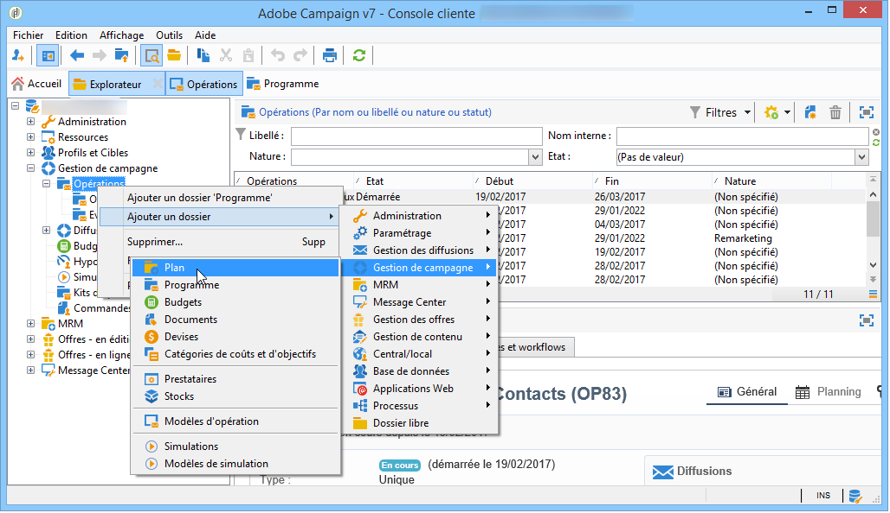

1. Renommez le plan.
1. Cliquez avec le bouton droit de la souris sur le plan nouvellement créé et sélectionnez **Propriétés...**.

   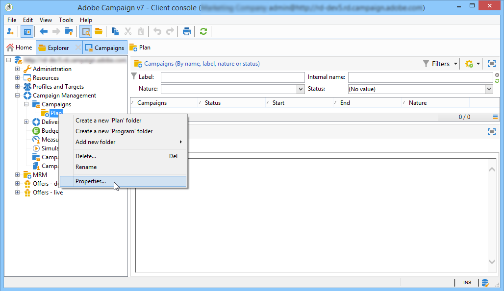

1. Dans l&#39;onglet **Général**, modifiez le **nom interne** pour éviter les doublons lors des exports de package.
1. Cliquez sur **Enregistrer**.
1. Cliquez avec le bouton droit de la souris sur le plan nouvellement créé et sélectionnez **Ajouter un dossier &#39;Programme&#39;**.
1. Répétez les étapes décrites ci-dessus pour renommer le nouveau dossier de programmes et modifier le nom interne.

## Créer une campagne {#creating-a-campaign}

### Ajout d’une opération {#adding-a-campaign}

Vous pouvez créer une campagne à partir de la liste des campagnes. Pour afficher cette vue, sélectionnez le lien **[!UICONTROL Opérations]** disponible depuis le tableau de bord **[!UICONTROL Campagnes]**.

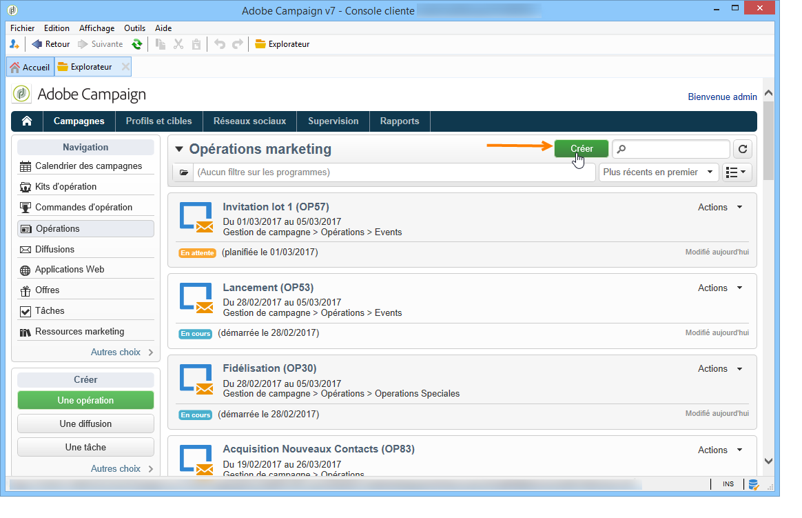

Le champ **[!UICONTROL Programme]** permet de sélectionner le programme auquel sera rattachée la campagne. Cette information est obligatoire.

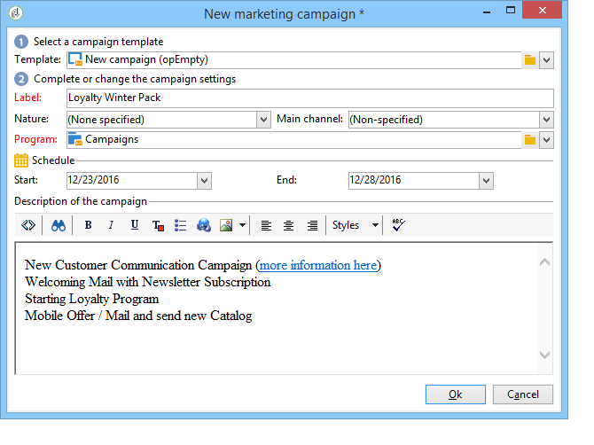

Les opérations peuvent également être créées depuis un programme. Pour cela, cliquez sur le bouton **[!UICONTROL Ajouter]** proposé dans l&#39;onglet **[!UICONTROL Planning]** programme concerné.

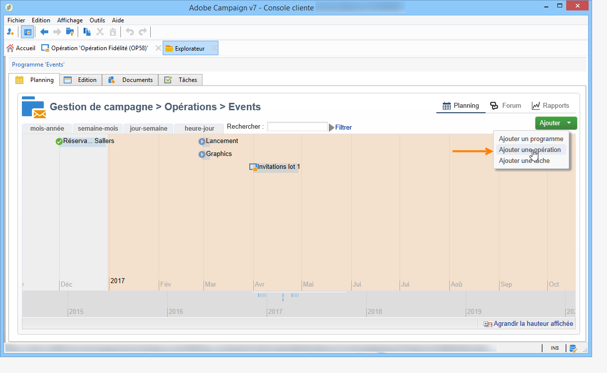

Lorsque vous créez une campagne à partir de l’onglet **[!UICONTROL Planning]** d’un programme, la campagne est automatiquement rattachée au programme concerné. Le champ **[!UICONTROL Programme]** est alors masqué.

Dans la fenêtre de création de campagne, sélectionnez le modèle de campagne et ajoutez un nom et une description de la campagne. Vous pouvez également spécifier les dates de début et de fin de la campagne.

Cliquez sur **[!UICONTROL OK]** pour créer la campagne. Elle est ajoutée au planning du programme.

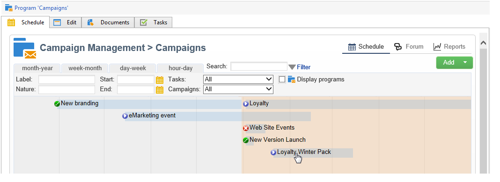

>[!NOTE]
>
>Pour filtrer les opérations à afficher, cliquez sur le lien **[!UICONTROL Filtrer]** et sélectionnez le statut des opérations à afficher.

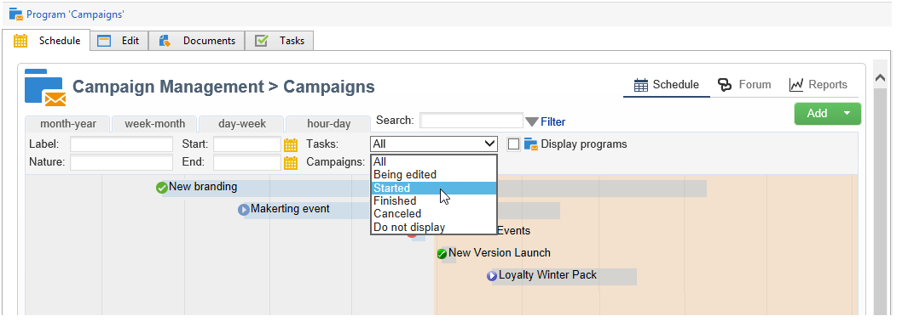

### Modification et configuration d’une campagne {#editing-and-configuring-a-campaign}

Vous pouvez ensuite éditer l&#39;opération que vous venez de créer et en définir les paramètres.

Pour ouvrir et configurer une opération, sélectionnez-la dans le planning et cliquez sur le lien **[!UICONTROL Ouvrir]**.

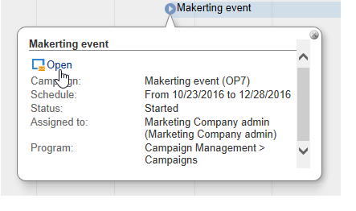

Vous accédez alors au tableau de bord de l&#39;opération.

## Les opérations récurrentes et périodiques {#recurring-and-periodic-campaigns}

Une campagne récurrente est une campagne basée sur un modèle spécifique dont les workflows sont configurés pour être exécutés selon un planning associé. Les workflows seront donc récurrents dans une campagne. Le ciblage est dupliqué à chaque exécution et les différents processus et populations cibles sont suivis. Il est également possible d&#39;exécuter des ciblages futurs à l&#39;avance, via la période de couverture lors de la création automatique des workflows, afin de lancer des simulations avec des estimations de cibles.

Une opération périodique est une opération qui se créé automatiquement selon le planning d&#39;exécution de son modèle.

### Création d’une campagne récurrente {#creating-a-recurring-campaign}

Les campagnes récurrentes sont créées à partir d’un modèle spécifique qui définit le modèle de workflow à exécuter et le planning d’exécution.

#### Création d’un modèle pour les campagnes récurrentes {#creating-the-campaign-template}

1. Créez un modèle d&#39;opération de type **[!UICONTROL Récurrente]**.

   >[!NOTE]
   >
   >Il est recommandé de dupliquer le modèle par défaut plutôt que de créer un modèle vide.

   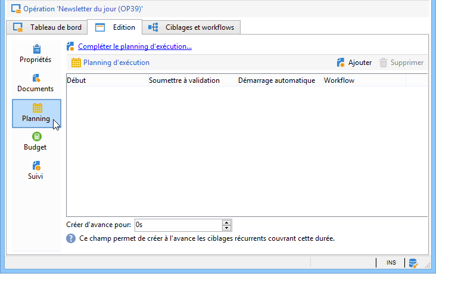

1. Saisissez le libellé du modèle et renseignez la durée de l&#39;opération.

   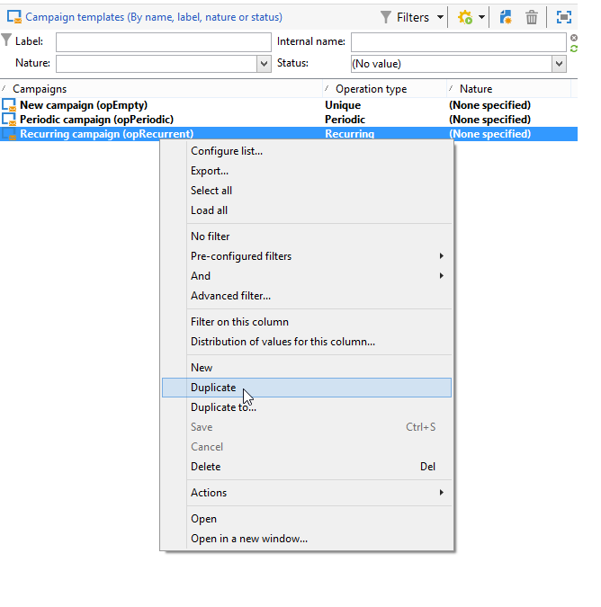

1. Pour ce type d&#39;opération, un onglet **[!UICONTROL Planning]** est ajouté afin de créer le planning d&#39;exécution du modèle.

Dans cet onglet, définissez les dates prévues d&#39;exécution des opérations basées sur ce modèle.

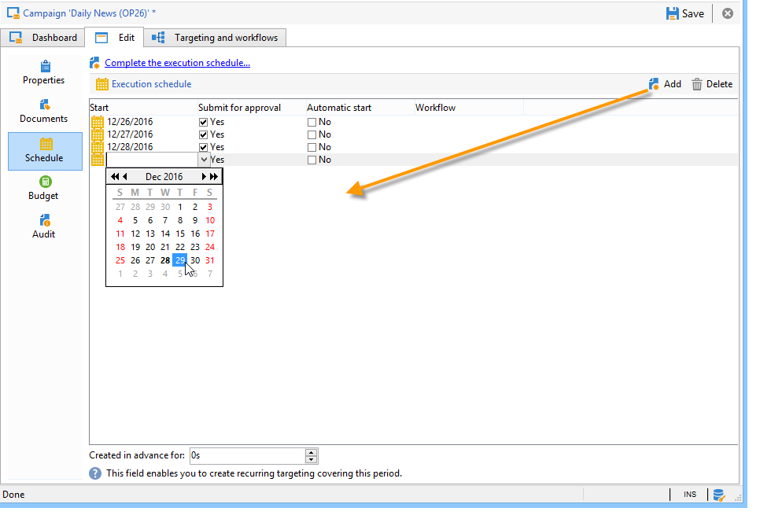

Le mode de configuration du planning d&#39;exécution correspond à l&#39;objet **[!UICONTROL Planificateur]** du workflow. Pour plus d’informations, consultez [cette section](../../workflow/using/architecture.md).

>[!IMPORTANT]
>
>La configuration du planning d&#39;exécution doit être effectuée avec précaution afin de ne pas surcharger la base de données. Les campagnes récurrentes dupliquent le ou les workflows de leur modèle selon le planning spécifié. La mise en œuvre de créations de workflows trop fréquentes peut entraver le fonctionnement de la base de données.

1. Indiquez une valeur dans le champ **[!UICONTROL Créer d&#39;avance pour]** afin de créer les workflows correspondants pour la période indiquée.
1. Créez le modèle de workflow qui sera utilisé dans les opérations basées sur ce modèle, avec les paramètres de ciblage et une ou plusieurs diffusions génériques.

   >[!NOTE]
   >
   >Ce workflow doit être enregistré comme un modèle de workflow récurrent. Pour cela, éditez les propriétés du workflow et sélectionnez l&#39;option **[!UICONTROL Modèle de workflow récurrent]** dans l&#39;onglet **[!UICONTROL Exécution]**.

   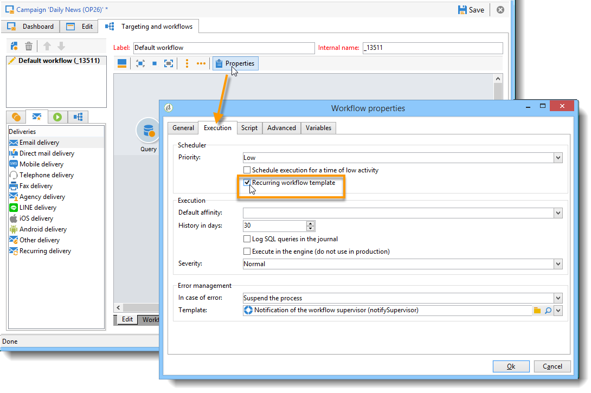

#### Créer la campagne récurrente {#create-the-recurring-campaign}

Pour créer l&#39;opération récurrente et exécuter ses workflows selon le planning défini dans le modèle, les étapes sont les suivantes :

1. Créez une nouvelle opération basée sur un modèle d&#39;opération récurrente.
1. Renseignez le planning d&#39;exécution des workflows.

   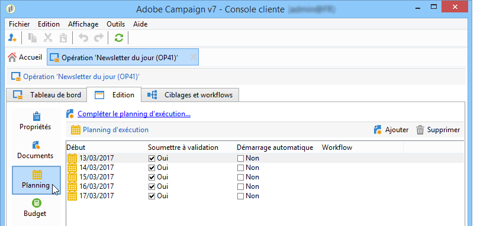

1. Le planning de l&#39;opération permet de renseigner pour chaque ligne la date de début de création ou d&#39;exécution du workflow automatique.

   Pour chaque ligne, il est possible d&#39;ajouter les options supplémentaires suivantes :

   * **[!UICONTROL À valider]** : permet de forcer les demandes d’approbation des diffusions dans le workflow.
   * **[!UICONTROL A démarrer]** : permet de démarrer le workflow une fois la date de début atteinte.

   Le champ **[!UICONTROL Créer d&#39;avance pour]** permet de créer l&#39;ensemble des workflows couvrant la période renseignée.

   Lors de l&#39;exécution du workflow **[!UICONTROL Traitements sur les campagnes]**, les workflows dédiés sont créés à partir des occurrences définies dans le planning de la campagne. Un workflow est ainsi créé pour chaque date d’exécution.

1. Les workflows récurrents sont créés automatiquement à partir du modèle de workflow présent dans l&#39;opération. Ils sont visibles à partir de l&#39;onglet **[!UICONTROL Ciblages et workflows]** de l&#39;opération.

   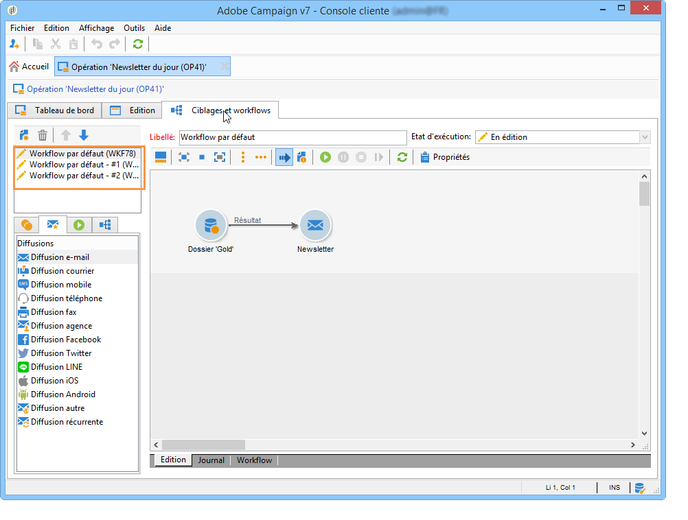

   Le libellé d&#39;une instance de workflow récurrent est composé du libellé de son modèle et du numéro du workflow. Les deux informations sont séparées par un caractère #.

   Les workflow créés à partir du planning y sont automatiquement associés, dans la colonne **[!UICONTROL Workflow]** de l&#39;onglet **[!UICONTROL Planning]**.

   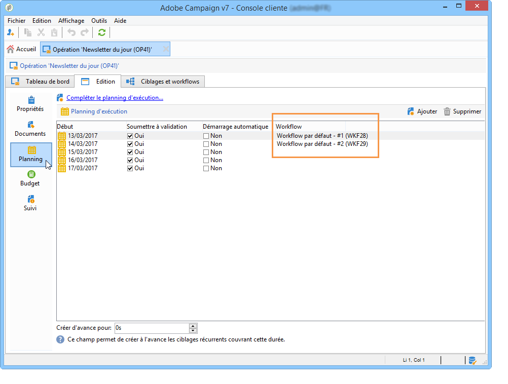

   Chaque workflow peut être édité à partir de cet onglet.

   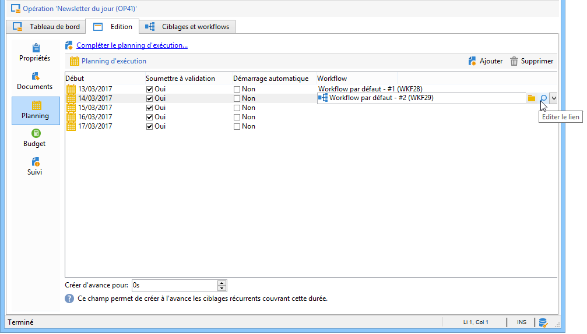

   >[!NOTE]
   >
   >La date de début de la ligne de planning associée au workflow est disponible à partir d&#39;une variable du workflow avec la syntaxe suivante :\
   >`$date(instance/vars/@startPlanningDate)`

### Création d’une campagne périodique {#creating-a-periodic-campaign}

Une campagne périodique est une campagne basée sur un modèle spécifique qui permet de créer des instances Campaign en fonction d&#39;un planning d&#39;exécution. Les instances Campaign sont créées automatiquement en fonction d&#39;un modèle de campagne périodique, selon la fréquence définie dans le planning du modèle.

#### Création du modèle de campagne {#creating-the-campaign-template-1}

1. Créez un modèle d&#39;opération de type **[!UICONTROL Périodique]**, de préférence en dupliquant un modèle d&#39;opération existant.

   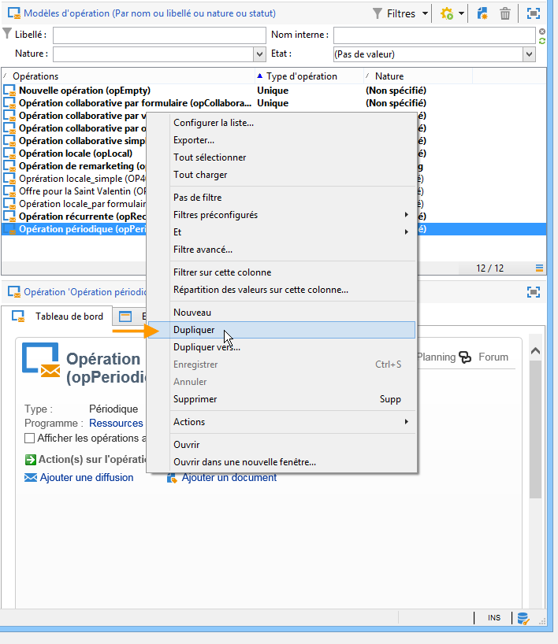

1. Renseignez les propriétés du modèle.

   >[!NOTE]
   >
   >L&#39;opérateur auquel est affecté le modèle doit avoir les droits suffisants pour créer des opérations dans le programme sélectionné.

1. Créez le workflow associé à ce modèle. Elle sera dupliquée dans chaque campagne périodique créée par le modèle.

   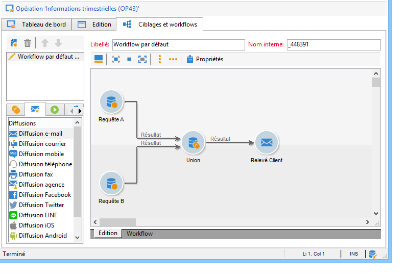

   >[!NOTE]
   >
   >Ce workflow est un modèle de workflow. Elle ne peut pas être exécutée à partir du modèle de campagne.

1. Renseignez son planning d’exécution selon le même mode que pour un modèle d’opération récurrente : cliquez sur le bouton **[!UICONTROL Ajouter]** et définissez les dates de début et de fin, ou complétez le planning d’exécution à partir du lien.

   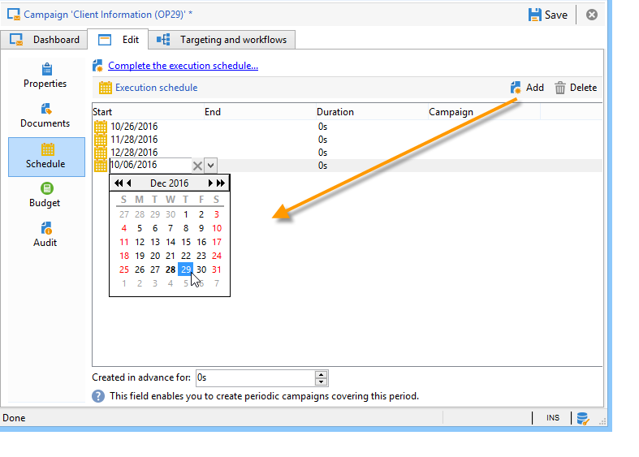

   >[!IMPORTANT]
   >
   >Les modèles d’opérations périodiques créent de nouvelles campagnes selon le planning défini ci-dessus. Elle doit donc être complétée avec précaution, afin de ne pas surcharger la base Adobe Campaign.

1. Une fois la date de début d’exécution atteinte, la campagne correspondante est créée automatiquement. Il reprend toutes les caractéristiques de son modèle.

   Chaque opération peut être éditée à partir du planning du modèle.

   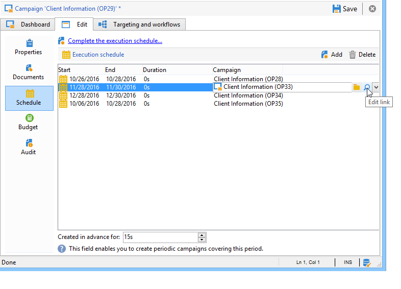

Chaque campagne périodique contient les mêmes éléments. Une fois créée, elle est gérée comme une campagne standard.

## Tutoriel vidéo {#video}

Cette vidéo explique comment créer un plan marketing, des programmes et des campagnes.

>[!VIDEO](https://video.tv.adobe.com/v/35132?quality=12)

D’autres vidéos pratiques sur Campaign sont disponibles [ici](https://experienceleague.adobe.com/docs/campaign-classic-learn/tutorials/overview.html?lang=fr).
