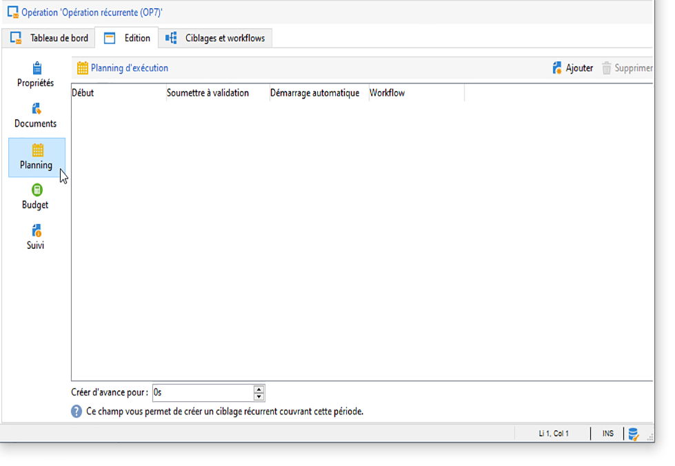
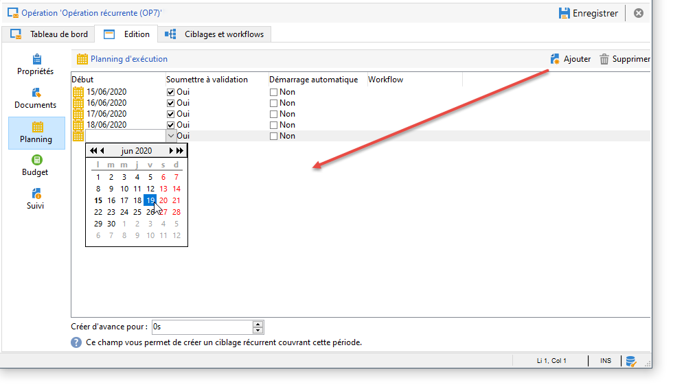
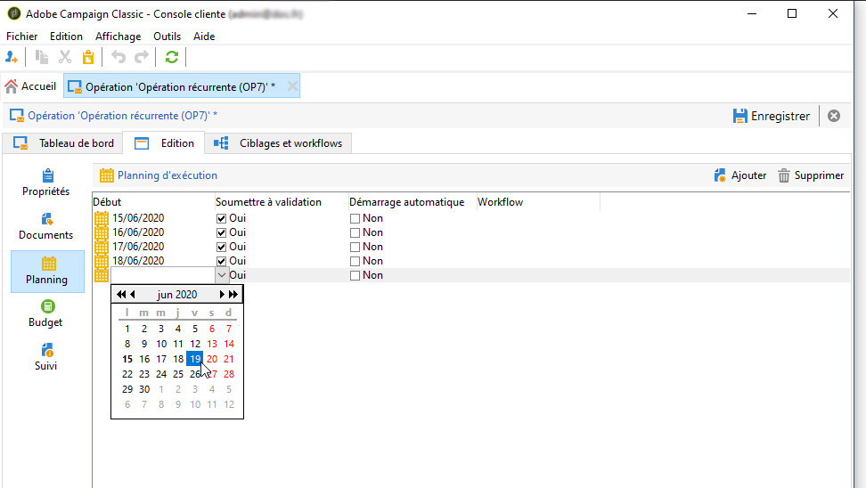
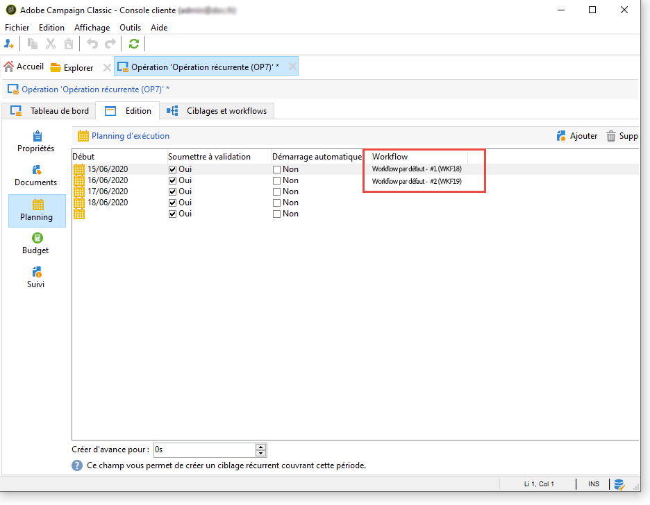
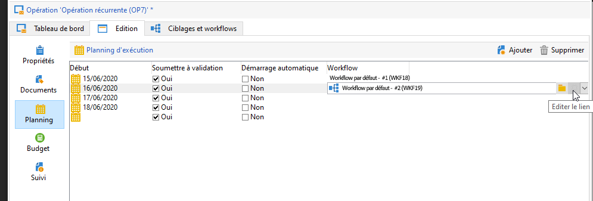
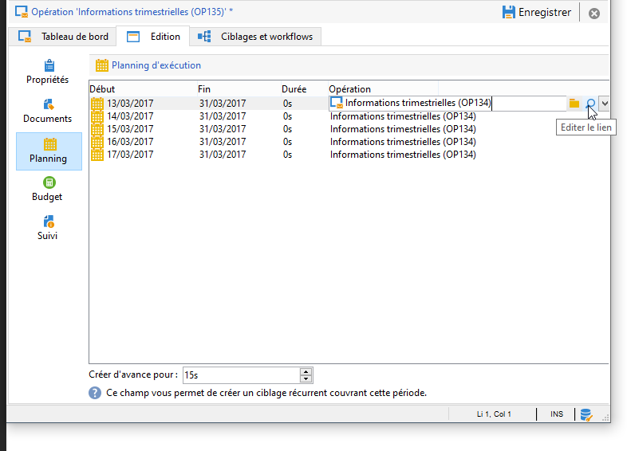

# Créer des campagnes marketing{#setting-up-marketing-campaigns}

Les campagnes comprennent des actions (remises) et des processus (importation ou extraction de fichiers), ainsi que des ressources (documents marketing, contours de diffusion). Elles sont utilisées dans les campagnes marketing. Les campagnes font partie d’un programme et les programmes sont inclus dans un plan de campagne.

Pour créer une campagne marketing :

1. Créez une campagne : découvrez les campagnes et leurs caractéristiques : libellé, type, dates de début et de fin, budget, ressources associées, gestionnaire(s) et participants.

   See [Creating a campaign](#creating-a-campaign).

1. Définir la ou les populations cibles : créez un processus avec des requêtes de ciblage.

   See [Selecting the target population](../../campaign/using/marketing-campaign-deliveries.md#selecting-the-target-population).

1. Créer des remises : sélectionnez les canaux et définissez le contenu à envoyer.

   Voir [Création de distributions](../../campaign/using/marketing-campaign-deliveries.md#creating-deliveries).

1. Approuvez les livraisons.

   Reportez-vous au processus [d’](../../campaign/using/marketing-campaign-approval.md#approval-process)approbation.

1. Surveillez les remises.

   Reportez-vous à [Surveillance](../../campaign/using/marketing-campaign-monitoring.md).

1. Planifiez les campagnes et les coûts associés.

   See [Creating service providers and their cost structures](../../campaign/using/providers--stocks-and-budgets.md#creating-service-providers-and-their-cost-structures).

Une fois ces étapes terminées, vous pouvez lancer les livraisons (voir [Lancement d’une livraison](../../campaign/using/marketing-campaign-deliveries.md#starting-a-delivery)), vérifier les données, les processus et les informations relatifs aux livraisons et, si nécessaire, gérer les documents associés (voir [Gestion des documents](../../campaign/using/marketing-campaign-deliveries.md#managing-associated-documents)associés). Vous pouvez également suivre l’exécution des phases de traitement des campagnes et des livraisons (voir [Suivi](../../campaign/using/marketing-campaign-monitoring.md)).

## Créer une hiérarchie de plans et de programmes {#creating-plan-and-program-hierarchy}

Pour configurer la hiérarchie des dossiers pour les plans et programmes marketing :

1. Cliquez sur l&#39;icône **Explorateur** dans la page d&#39;accueil.
1. Cliquez avec le bouton droit de la souris sur le dossier dans lequel vous souhaitez créer le plan.
1. Sélectionnez **Ajouter un dossier > Gestion de campagne > Plan**.

   

1. Renommez le plan.
1. Cliquez avec le bouton droit de la souris sur le plan nouvellement créé et sélectionnez **Propriétés...**.

   

1. Dans l&#39;onglet **Général**, modifiez le **nom interne** pour éviter les doublons lors des exports de package.
1. Cliquez sur **Enregistrer**.
1. Cliquez avec le bouton droit de la souris sur le plan nouvellement créé et sélectionnez **Ajouter un dossier &#39;Programme&#39;**.
1. Répétez les étapes décrites ci-dessus pour renommer le nouveau dossier de programmes et modifier le nom interne.

## Créer une campagne  {#creating-a-campaign}

### Ajouter une opération {#adding-a-campaign}

Vous pouvez créer une campagne à partir de la liste des campagnes. Pour afficher cette vue, sélectionnez le **[!UICONTROL Campaigns]** menu dans le **[!UICONTROL Campaigns]** tableau de bord.

Le **[!UICONTROL Program]** champ vous permet de sélectionner le programme auquel la campagne sera associée. Cette information est obligatoire.

Les campagnes peuvent également être créées via un programme. Pour ce faire, cliquez sur le **[!UICONTROL Add]** bouton dans l&#39; **[!UICONTROL Schedule]** onglet du programme concerné.

Lorsque vous créez une campagne via l’ **[!UICONTROL Schedule]** onglet d’un programme, celle-ci est automatiquement liée au programme concerné. Le **[!UICONTROL Program]** champ est alors masqué.

Dans la fenêtre de création de campagne, sélectionnez le modèle de campagne et ajoutez un nom et une description de la campagne. Vous pouvez également spécifier les dates de début et de fin de la campagne.

Cliquez sur **[!UICONTROL OK]** pour créer la campagne. Il est ajouté au programme.

>[!NOTE]
>
>To filter the campaigns to display, click the **[!UICONTROL Filter]** link and select the status of campaigns to display.

### Editer et configurer l&#39;opération {#editing-and-configuring-a-campaign}

Vous pouvez ensuite éditer l&#39;opération que vous venez de créer et en définir les paramètres.

To open and configure a campaign, select it from the schedule and click **[!UICONTROL Open]**.

Vous accédez alors au tableau de bord de l&#39;opération.

## Les opérations récurrentes et périodiques {#recurring-and-periodic-campaigns}

Une opération récurrente est une opération basée sur un modèle spécifique et dont les workflows sont paramétrés pour s&#39;exécuter selon un planning associé. Ainsi, les workflows vont être récurrents au sein d&#39;une même opération. Le ciblage est dupliqué à chaque exécution et une trace des différents traitements et populations cibles est conservée. De plus, il est possible d&#39;exécuter à l&#39;avance les ciblages futurs - via la période de couvrement lors de la création automatique des workflows - afin de lancer des simulations avec estimation de la cible.

Une opération périodique est une opération qui se créé automatiquement selon le planning d&#39;exécution de son modèle.

### Créer une opération récurrente {#creating-a-recurring-campaign}

Les opérations récurrentes sont créées à partir d&#39;un modèle spécifique qui définit le modèle de workflow à exécuter et le planning d&#39;exécution.

#### Création d’un modèle pour les campagnes récurrentes {#creating-the-campaign-template}

1. Create a **[!UICONTROL Recurring]** campaign template.

   >[!NOTE]
   >
   >Il est recommandé de dupliquer le modèle par défaut plutôt que de créer un modèle vide.

   

1. Saisissez le libellé du modèle et renseignez la durée de l&#39;opération.

   

1. For this type of campaign, a **[!UICONTROL Schedule]** tab is added in order to create the template execution schedule.

Dans cet onglet, définissez les dates prévues d&#39;exécution des opérations basées sur ce modèle.

Vous pouvez utiliser l’assistant de création de planification pour remplir automatiquement toutes les dates d’exécution. Pour ce faire, cliquez sur le **[!UICONTROL Complete the execution schedule...]** lien situé au-dessus du tableau.

Le mode de configuration du calendrier d’exécution coïncide avec l’ **[!UICONTROL Scheduler]** objet du flux de travail. Voir à ce propos [cette section](../../workflow/using/executing-a-workflow.md#architecture).

>[!IMPORTANT]
>
>Le paramétrage du planning d&#39;exécution doit être réalisé avec précaution afin de ne pas surcharger la base de données. En effet, les opérations récurrentes dupliquent le ou les workflows de leur modèle selon le planning défini. La mise en place trop grande fréquence de création de ces workflows peut nuire au bon fonctionnement de la base de données.

1. Specify a value in the **[!UICONTROL Create in advance for]** field in order to create the corresponding workflows for the period indicated.
1. Créez le modèle de workflow qui sera utilisé dans les opérations basées sur ce modèle, avec les paramètres de ciblage et une ou plusieurs diffusions génériques.

   >[!NOTE]
   >
   >Ce processus doit être enregistré en tant que modèle de processus récurrent. Pour ce faire, modifiez les propriétés du processus et sélectionnez l’ **[!UICONTROL Recurring workflow template]** option dans l’ **[!UICONTROL Execution]** onglet.

   

#### Créer l&#39;opération récurrente {#create-the-recurring-campaign}

Pour créer l&#39;opération récurrente et exécuter ses workflows selon le planning défini dans le modèle, les étapes sont les suivantes :

1. Créez une nouvelle opération basée sur un modèle d&#39;opération récurrente.
1. Renseignez le planning d&#39;exécution des workflows.

   

1. Le planning de l&#39;opération permet de renseigner pour chaque ligne la date de début de création ou d&#39;exécution du workflow automatique.

   Pour chaque ligne, il est possible d&#39;ajouter les options supplémentaires suivantes :

   * **[!UICONTROL To be approved]** : vous permet de forcer les demandes d’approbation de remise dans le processus.
   * **[!UICONTROL To be started]** : vous permet de démarrer le flux de travail lorsque la date de début est atteinte.
   Le **[!UICONTROL Create in advance for]** champ vous permet de créer tous les processus couvrant la période saisie.

   Lors de l’exécution du **[!UICONTROL Jobs on campaigns]** processus, les processus dédiés sont créés en fonction des occurrences définies dans la planification de la campagne. Un processus est donc créé pour chaque date d’exécution.

1. Les processus récurrents sont créés automatiquement à partir du modèle de processus présent dans la campagne. Ils sont visibles à partir de l’ **[!UICONTROL Targeting and workflows]** onglet de la campagne.

   

   Le libellé d&#39;une instance de workflow récurrent est composé du libellé de son modèle et du numéro du workflow. Les deux informations sont séparées par un caractère #.

   Workflows created from the schedule are automatically associated with it in the **[!UICONTROL Workflow]** column of the **[!UICONTROL Schedule]** tab.

   

   Chaque workflow peut être édité à partir de cet onglet.

   

   >[!NOTE]
   >
   >La date de début de la ligne de planning associée au workflow est disponible à partir d&#39;une variable du workflow avec la syntaxe suivante :\
   >`$date(instance/vars/@startPlanningDate)`

### Créer une opération périodique {#creating-a-periodic-campaign}

Une opération périodique est une opération basée sur un modèle spécifique qui permet de créer des instances d&#39;opérations selon un planning d&#39;exécution. Les instances d&#39;opérations sont créées automatiquement sur la base d&#39;un modèle d&#39;opération périodique, selon la fréquence définie dans le planning du modèle.

#### Créer le modèle d&#39;opération {#creating-the-campaign-template-1}

1. Create a **[!UICONTROL Periodic]** campaign template, preferably by duplicating an existing campaign template.

   

1. Renseignez les propriétés du modèle.

   >[!NOTE]
   >
   >L&#39;opérateur auquel est affecté le modèle doit avoir les droits suffisants pour créer des opérations dans le programme sélectionné.

1. Créez le workflow associé à ce modèle. Il sera dupliqué dans chaque opération périodique créée par le modèle.

   

   >[!NOTE]
   >
   >Ce workflow est un modèle de workflow. Il ne peut pas être exécuté à partir du modèle d&#39;opération.

1. Complete its execution schedule as for a recurring campaign template: click the **[!UICONTROL Add]** button and define the start and end dates, or fill in the execution schedule via the link.

   

   >[!IMPORTANT]
   >
   >Les modèles d&#39;opérations périodiques créent de nouvelles opérations selon le planning défini ci-dessus. Il doit donc être renseigné avec précaution afin de ne pas surcharger la base Adobe Campaign.

1. Une fois la date de début d&#39;exécution atteinte, l&#39;opération correspondante est automatiquement créée. Elle reprend l&#39;ensemble des caractéristiques de son modèle.

   Chaque opération peut être éditée à partir du planning du modèle.

   

Chaque opération périodique contient les mêmes éléments. Une fois créée, elle est ensuite gérée comme une opération standard.
