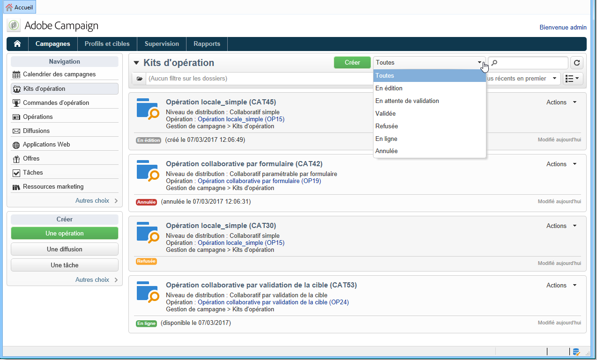
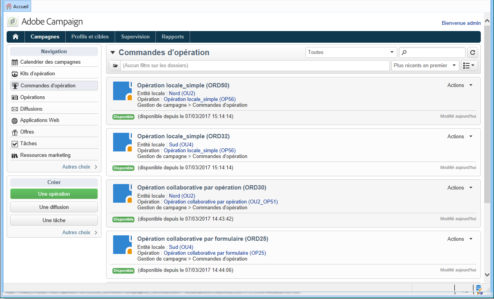
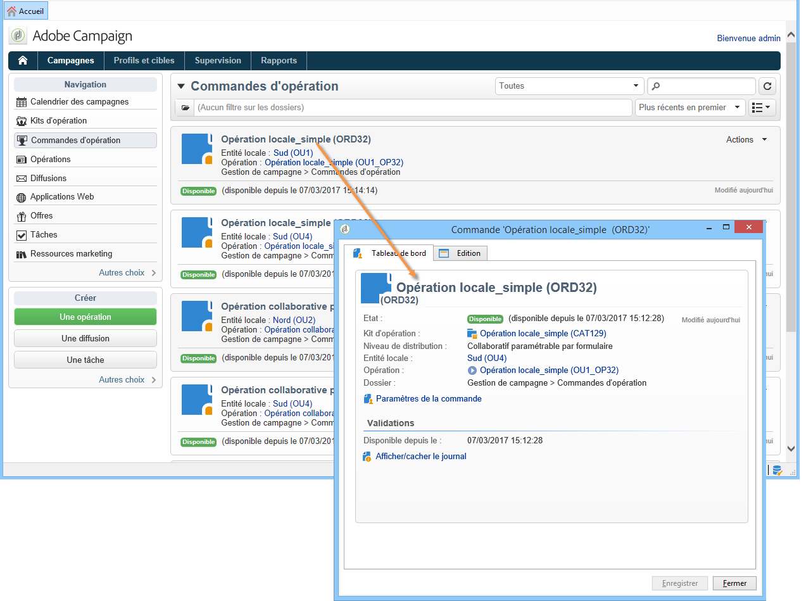
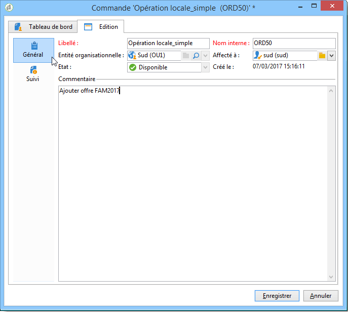
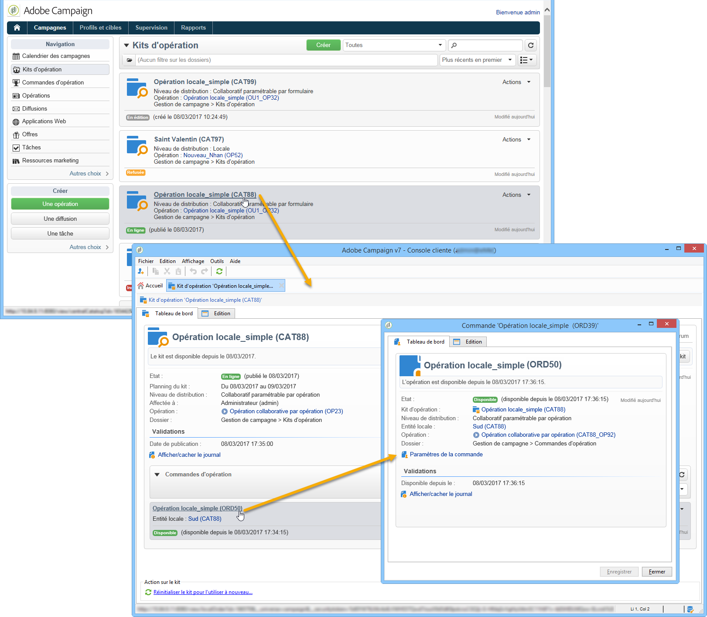
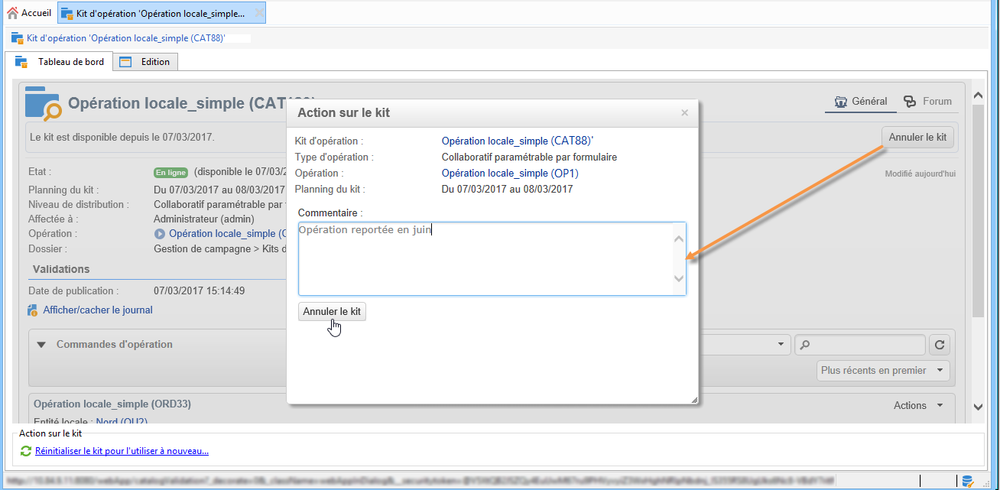
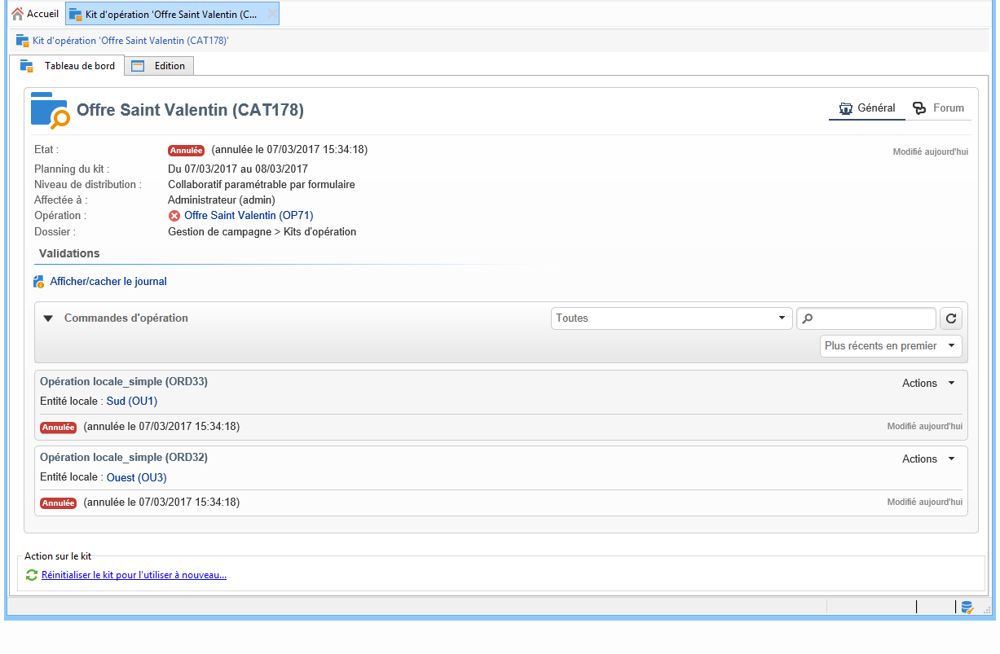
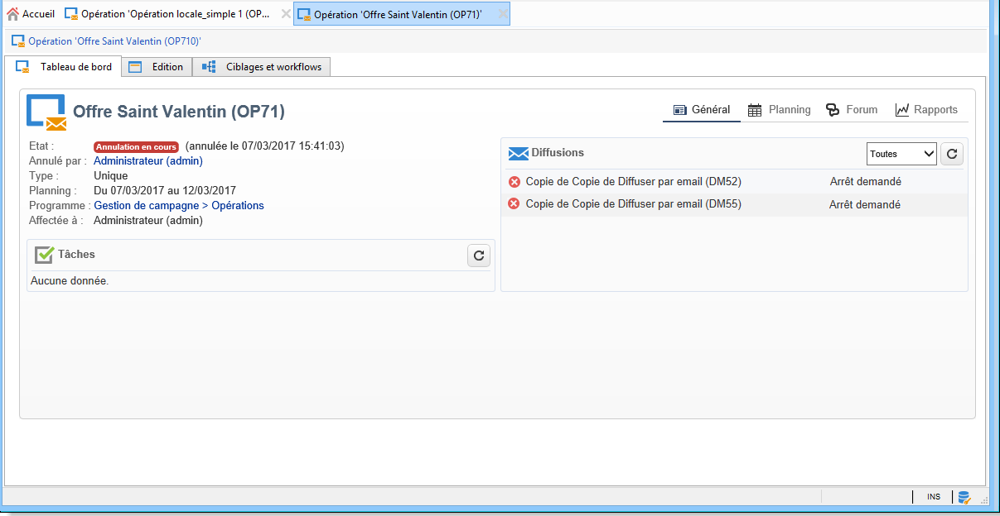
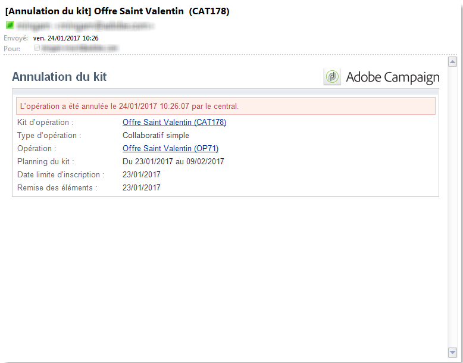
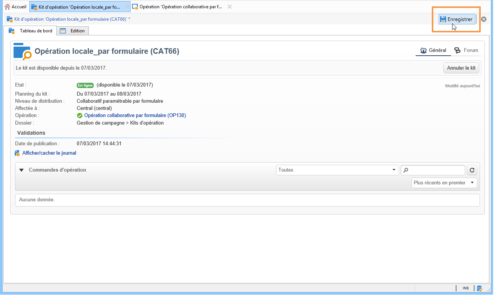

# Tracking d’une opération{#tracking-a-campaign}

Les opérateurs de l&#39;entité centrale peuvent effectuer un tracking des commandes des opérations proposées dans la liste des kits d&#39;opération.

Ils peuvent ainsi :

* [Filtrer les kits](#filter-packages),
* [Editer les kits](#edit-packages),
* [Annuler un kit](#cancel-a-package),
* [Réinitialiser un kit](#reinitializing-a-package).

## Filtrer les kits {#filter-packages}

Dans **[!UICONTROL Campaigns universe]**, vous pouvez afficher la liste des **[!UICONTROL Campaign packages]** groupes qui regroupent toutes les campagnes de marketing distribué existantes. Vous pouvez filtrer cette liste afin qu’elle affiche uniquement les campagnes publiées, en retard, en attente d’approbation, etc. Pour ce faire, cliquez sur les liens dans la section supérieure de cette vue ou utilisez le **[!UICONTROL Filter list]** lien et sélectionnez l’état du package de campagne à afficher.

## Editer les kits {#edit-packages}

The **[!UICONTROL Campaign packages]** page lets you view the summary of each package.

Ce résumé affiche les informations suivantes : le libellé, le type d&#39;opération, le nom de l&#39;opération à partir de laquelle le kit a été créé et le dossier d&#39;enregistrement.

Cliquez sur le nom du kit pour l&#39;éditer. Vous pourrez alors visualiser les commandes réalisées par les entités locales et leur état.

This information is also offered in the **[!UICONTROL Campaign orders]** view which lists all orders.

L&#39;opérateur central peut éditer la commande. Pour cela, il dispose de deux modes :

1. L&#39;opérateur peut cliquer sur le nom de la commande pour l&#39;éditer : il accède alors au détail de commande.

   

   The **[!UICONTROL Edit > General]** tab lets you view information entered by the local entity when it ordered the campaign.

   

1. L&#39;opérateur peut cliquer sur le libellé du kit d&#39;opération pour l&#39;éditer : il peut éventuellement modifier certains paramétrages.

   

## Annuler un kit {#cancel-a-package}

A tout moment, l&#39;entité centrale a la possibilité d&#39;annuler un kit d&#39;opération.

Cliquez sur **[!UICONTROL Cancel]** dans le package de campagne **[!UICONTROL Dashboard]**.

The **[!UICONTROL Comment]** field lets you justify the cancellation.

Pour les **opérations locales**, l&#39;annulation d&#39;un kit le supprime de la liste des opérations marketing disponibles.

Pour les **opérations collaboratives**, l&#39;annulation d&#39;un kit d&#39;opération provoque :

1. L&#39;annulation de toutes les commandes relatives à ce kit,

   

1. L&#39;annulation de l&#39;opération de référence et l&#39;arrêt de tous les traitements en cours (workflows, diffusions),

   

1. L&#39;envoi d&#39;une notification aux entités locales concernées.

   

Une fois annulée, l&#39;entité centrale peut toujours accéder au kit et éventuellement le réinitialiser, au besoin. Il ne sera à nouveau proposée aux entités locales que lorsqu&#39;il sera validé et démarré. Le processus de réinitialisation d&#39;un kit d&#39;opération est présenté ci-après.

## Réinitialiser un kit {#reinitializing-a-package}

Vous pouvez réinitialiser un kit d&#39;opération déjà publié afin de le modifier puis le mettre à nouveau à disposition des entités locales.

1. Pour cela, sélectionnez le kit concerné.
1. Cliquez sur le **[!UICONTROL Reinitialize the package to reuse it]** lien, puis sur **[!UICONTROL OK]**.

   

1. Click the **[!UICONTROL Save]** button to approve package re-initialization.

   

1. The package status changes to **[!UICONTROL Being edited]**. Modify, approve and publish it again to restore it to the list of campaign package.

>[!NOTE]
>
>Vous pouvez également réinitialiser un kit d&#39;opération qui a été annulé.

