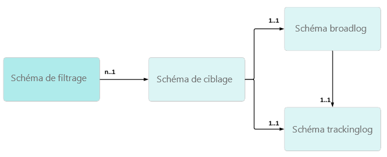

# Utilisation d’une table des destinataires personnalisée{#about-custom-recipient-table}

Cette section présente les principes d&#39;utilisation d&#39;une table de destinataires personnalisée (ou externe).

Par défaut, Adobe Campaign propose une table de destinataires intégrée à laquelle sont liés les processus et fonctions d&#39;usine. La table des destinataires intégrée dispose de plusieurs champs et tables prédéfinis qui peuvent être facilement étendus à l&#39;aide d&#39;une table d&#39;extension.

Si cette méthode d&#39;extension offre une bonne flexibilité pour étendre une table, elle ne permet pas de réduire le nombre de champs ou de liens dans celle-ci. L&#39;utilisation d&#39;une table non standard, dite &#39;table de destinataires externe&#39;, permet une plus grande flexibilité, mais nécessite certaines précautions dans sa mise en œuvre.

Cette fonctionnalité permet notamment à Adobe Campaign d&#39;exploiter des données provenant d&#39;une base de données externe : ces données seront utilisées comme ensemble de profils pour les diffusions. La mise en oeuvre de ce mode de fonctionnement implique plusieurs spécificités qui peuvent s&#39;avérer pertinentes selon les besoins du client. Ainsi :

* Pas de flux de mise à jour vers et depuis la base Adobe Campaign : les données de cette table peuvent être mises à jour directement via le moteur de base de données qui l&#39;héberge.
* Pas de changements dans les processus qui opèrent sur la base existante.
* Utilisation d&#39;une base de profils avec une structure différente de celle proposée en standard : possibilité de diffuser avec une même instance vers des profils enregistrés dans des tables différentes, avec des structures différentes.
* Pas de changements ou de maintenance requis lors des mises à jour de la base de données Adobe Campaign.
* La table des destinataires intégrée est inutile si vous n&#39;avez pas besoin de la plupart des champs de la table ou si le modèle de base de données n&#39;est pas centré sur les destinataires.
* Pour être efficace, une table avec peu de champs est nécessaire si vous disposez d&#39;un nombre important de profils. La table des destinataires intégrée comporte trop de champs pour ce cas spécifique.

Cette section décrit les points clés qui permettent de mapper les tables existantes dans Adobe Campaign et la configuration à appliquer pour exécuter des diffusions sur la base de n’importe quel tableau. Enfin, il décrit comment fournir aux utilisateurs des interfaces de requêtage aussi pratiques que celles disponibles avec la table de destinataires intégrée. Pour comprendre le contenu présenté dans cette section, une bonne connaissance des principes de conception des écrans et des schémas est nécessaire.

## Recommandations et limitations    {#recommendations-and-limitations}

L&#39;utilisation d&#39;une table de destinataires personnalisée présente les limitations suivantes :

* Adobe Campaign ne prend pas en charge les schémas de destinataires multiples, appelés schémas de ciblage, liés aux mêmes schémas de broadlog et/ou de trackinglog. Leur prise en charge entraînerait des anomalies dans la réconciliation ultérieure des données.

   Le graphique ci-dessous décrit la structure relationnelle nécessaire pour chaque schéma de destinataire personnalisé :
   

   Nous vous recommandons de procéder comme suit :

   * Dédier les schémas **[!UICONTROL nms:BroadLogRcp]** et **[!UICONTROL nms:TrackingLogRcp]** aux schémas **[!UICONTROL nms:Recipientschema]** prêts à l&#39;emploi. Ces deux tables de log ne doivent pas être liées à une autre table de destinataires par défaut.
   * Définir des schémas broadlog et trackinglog personnalisés dédiés à chaque nouveau schéma de destinataires personnalisé. Il est possible de le faire automatiquement lors de la configuration du mapping de ciblage, voir la section [Mapping de ciblage](../../configuration/using/target-mapping.md).

* Il n&#39;est pas possible d&#39;utiliser les **[!UICONTROL Services et Abonnements]** standards proposés dans le produit.

   Ainsi, le fonctionnement présenté dans [cette section](../../delivery/using/managing-subscriptions.md) n&#39;est pas applicable.

* Le lien avec la table des **[!UICONTROL visiteurs]** n&#39;est pas opérationnel.

   Ainsi, l&#39;utilisation du module **[!UICONTROL Social Marketing]** nécessite de paramétrer l&#39;étape d&#39;enregistrement afin de référencer la bonne table.

   De même, dans le cadre de l&#39;utilisation des fonctionnalités de parainage, le modèle standard de transfert du message initial doit être adapté.

* Il n&#39;est pas possible d&#39;ajouter manuellement des profils dans une liste.

   Ainsi, le fonctionnement présenté dans [cette section](../../platform/using/creating-and-managing-lists.md) n&#39;est pas applicable sans une configuration supplémentaire.

   >[!NOTE]
   >
   >Vous pouvez toujours créer des listes de destinataires à l&#39;aide de workflows. Pour plus d&#39;informations à ce propos, consultez la section [Création d&#39;une liste de profils avec un workflow](../../configuration/using/creating-a-profile-list-with-a-workflow.md).

Il est également recommandé de vérifier les valeurs par défaut utilisées dans les différents paramétrages d&#39;usine : plusieurs adaptations doivent être apportées, selon les fonctionnalités utilisées.

Par exemple :

* Certains rapports standards, notamment ceux proposés pour **Interaction** et les **Applications mobiles**, doivent être redéveloppés. Pour plus d&#39;informations, consultez la section [Gestion des rapports](../../configuration/using/managing-reports.md).
* Les paramètres par défaut de certaines activités de workflow référencent la table des destinataires standards (**[!UICONTROL nms:recipient]**) : ces paramètres doivent être modifiés dans le cadre de l&#39;utilisation d&#39;une table de destinataires externe. Pour plus d&#39;informations, consultez la section [Gestion des workflows](../../configuration/using/managing-workflows.md).
* Le bloc de personnalisation du **[!UICONTROL Lien de désinscription]** standard doit être adapté.
* Le mapping de ciblage des modèles de diffusion standard doit être modifié.
* Les formulaires v4 ne sont pas compatibles avec l‘utilisation d’une table de destinataires externe : vous devez utiliser les applications Web.
