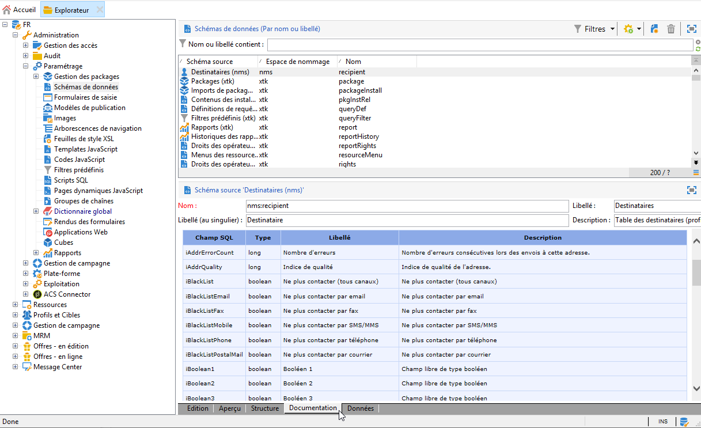

# Prise en main du modèle de données de Campaign{#about-data-model}

Le modèle de données conceptuel de la base de données Adobe Campaign se compose d’un ensemble de tables intégrées et de leur interaction. Les tables et concepts principaux sont répertoriés dans cette page.

## Vue d&#39;ensemble {#data-model-overview}

Adobe Campaign repose sur une base de données relationnelle contenant des tables liées entre elles. La structure de base du modèle de données Adobe Campaign peut être décrite comme suit.

### Table des destinataires {#recipient-table}

Le modèle de données repose sur une table principale qui est par défaut la table des destinataires (**NmsRecipient**). Cette table permet de stocker tous les profils marketing.

Pour plus d’informations sur la table des destinataires, voir cette [section](#default-recipient-table).

### Table de diffusion {#delivery-table}

Le modèle de données comprend également une partie dédiée au stockage de toutes les activités marketing. Généralement, il s&#39;agit de la table de diffusion (**NmsDelivery**). Chaque enregistrement de cette table représente une action de diffusion ou un modèle de diffusion. Elle contient tous les paramètres nécessaires pour effectuer des diffusions telles que la cible, le contenu, etc.

### Tables de logs {#log-tables}

Une autre partie du modèle de données permet de stocker temporairement tous les logs associés à l’exécution des campagnes.

Les logs de diffusion sont tous des messages envoyés aux destinataires ou aux appareils sur tous les canaux. Le tableau des logs de diffusion principale (**NmsBroadLog**) contient les logs de diffusion pour tous les destinataires.
La table principale des logs de tracking (**NmsTrackingLog**) stocke les logs de tracking pour tous les destinataires. Les logs de tracking se rapportent aux réactions des destinataires, telles que les ouvertures d’email et les clics. Chaque réaction correspond à un log de tracking.
Les mpgs de diffusion et de tracking sont supprimés après une certaine période, spécifiée dans Adobe Campaign et modifiable. Il est donc vivement recommandé d&#39;exporter les logs de façon régulière.

### Tables techniques {#technical-tables}

Enfin, une partie du modèle de données est constituée de données techniques utilisées pour le processus applicatif, y compris les opérateurs et les droits d’utilisateur (**NmsGroup**), les dossiers (**XtkFolder**).

## Utilisation de la table des destinataires native {#default-recipient-table}

La table des destinataires intégrée d&#39;Adobe Campaign est un bon point de départ pour créer votre modèle de données. Elle comporte un certain nombre de champs prédéfinis et de liens vers des tables faciles à étendre. Son emploi est particulièrement efficace si vous ciblez principalement les destinataires, car elle s&#39;appuie sur un modèle de données centré sur ces derniers.

Les avantages d&#39;une table de destinataires native sont les suivants :

* Des fonctionnalités natives telles que les abonnements, les listes de contrôle, etc.
* Disposer d&#39;une base de données marketing dotée d&#39;un modèle de données axé sur les destinataires.
* Permettre une mise en œuvre plus rapide.
* Des prestations de maintenance facilitées de la part de l&#39;assistance et des partenaires.

Il est toutefois possible d&#39;étendre la table des destinataires, mais sans réduire le nombre de champs ou de liens qu&#39;elle contient.

>[!IMPORTANT]
>
>Il est recommandé de ne pas supprimer les champs (même s&#39;ils sont inutiles) de la table des destinataires, car cela peut entraîner des erreurs dans les modules intégrés.

En outre, la table des destinataires, qui fait partie du produit, et son formulaire associé, évoluent au fur et à mesure des changements apportés au produit. Des opérations de maintenance supplémentaires sont donc nécessaires pour vérifier que les extensions sont toujours valides lors de la mise à niveau.

## Extension du modèle de données {#extending-data-model}

Lorsque vous commencez à utiliser Adobe Campaign, vous devez évaluer le modèle de données par défaut pour déterminer quelle table est adaptée au stockage de vos données marketing.

Le cas échéant, vous pouvez utiliser la table des destinataires par défaut avec les champs d’usine, comme décrit dans cette [section](#default-recipient-table).

En cas de besoin, vous pouvez l’étendre avec deux mécanismes :

* Étendez une table existante avec de nouveaux champs. Par exemple, vous pouvez ajouter un nouveau champ « Fidélité » à la table des destinataires.
* Créez une table, par exemple une table « Achat » répertoriant tous les achats effectués par chaque profil de la base de données et liez-la à la table des destinataires.

Pour plus d’informations sur la configuration des schémas d’extension pour étendre le modèle de données conceptuelles, voir [À propos de l’édition de schéma](../../configuration/using/about-schema-edition.md).

>[!IMPORTANT]
>
>L’extension du modèle de données est réservée aux utilisateurs expérimentés.

## Utilisation d&#39;une table de destinataires par défaut {#custom-recipient-table}

Pour concevoir votre modèle de données Adobe Campaign, vous pouvez utiliser la [table des destinataires intégrée](#default-recipient-table) ou décider de créer une [table des destinataires personnalisée](../../configuration/using/about-custom-recipient-table.md) pour stocker vos profils marketing.

En effet, si votre modèle de données ne correspond pas à une structure centrée sur les destinataires, vous pouvez configurer d&#39;autres tables pour créer une dimension de ciblage dans Adobe Campaign. Cette approche peut, par exemple, être pertinente si vous devez cibler des ménages, des comptes (comme les téléphones portables) et des entreprises/des sites plutôt que des destinataires.

>[!NOTE]
>
>Dans ce cas, vous devrez créer un nouveau [mapping de ciblage](../../configuration/using/target-mapping.md).

Les principes et les procédures applicables pour utiliser une table de destinataires par défaut sont détaillés dans cette [section](../../configuration/using/about-custom-recipient-table.md).

Les avantages d&#39;une table de destinataires par défaut sont les suivants :

* **Modèle de données flexible** - La table des destinataires intégrée est sans intérêt si vous n’avez pas besoin de la plupart de ses champs ou si le modèle de données n’est pas axé sur les destinataires.

* **Évolutivité** - Pour une conception efficace, les gros volumes nécessitent un tableau rationalisé comportant peu de champs. Le tableau des destinataires intégré comporterait trop de champs inutiles, ce qui pourrait avoir un impact sur les performances et réduire l’efficacité.

* **Emplacement des données** - Si les données se trouvent dans une base de données marketing externe existante, l’utilisation du tableau des destinataires intégré pourrait nécessiter un effort trop important. Dans ce cas, il est plus simple de créer une nouvelle structure basée sur celle qui existe.

* **Migration simple** - Aucune maintenance n’est nécessaire pour vérifier que toutes les extensions sont encore valides lors d’une mise à niveau.

>[!IMPORTANT]
>
>L&#39;utilisation d&#39;une table de destinataires par défaut est réservée aux utilisateurs avancés et s&#39;accompagne de certaines restrictions. Voir à ce propos [cette section](../../configuration/using/about-custom-recipient-table.md).

## Rubriques connexes :

En savoir plus sur le modèle de données Campaign dans les sections suivantes :

* **Description des tables principales** - Pour plus d’informations sur la description du modèle de données par défaut de Campaign Classic, consultez [cette section](../../configuration/using/data-model-description.md).

* **Description complète de chaque table** - Pour obtenir la description de chaque table, accédez à&#x200B;**[!UICONTROL h>Admin > Configuration > Schémas de données]**, sélectionnez une ressource dans la liste et cliquez sur l’onglet  **[!UICONTROL Documentation]**.

  

* **Schémas Campaign** - La structure physique et logique des données transportées dans l’application est décrite dans le langage XML. Celui-ci obéit à une grammaire spécifique à Adobe Campaign, appelée un schéma. Pour en savoir plus sur les schémas Adobe Campaign, lisez cette [section](../../configuration/using/about-schema-reference.md).

* **Bonnes pratiques relatives aux modèles de données** - Découvrez l&#39;architecture des modèles de données Campaign et les bonnes pratiques connexes, dans [cette section](../../configuration/using/data-model-best-practices.md#data-model-architecture).
