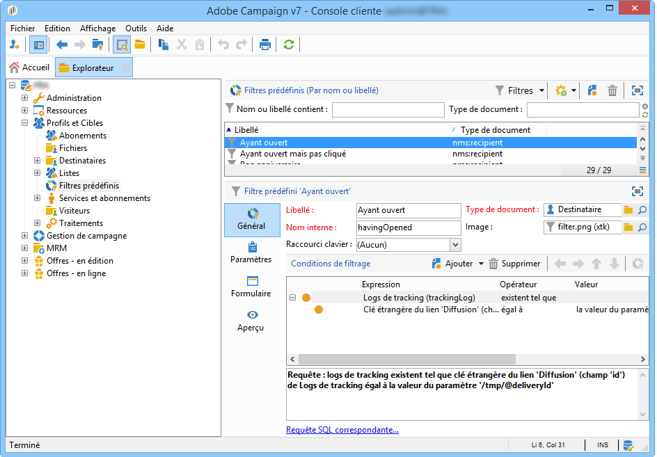
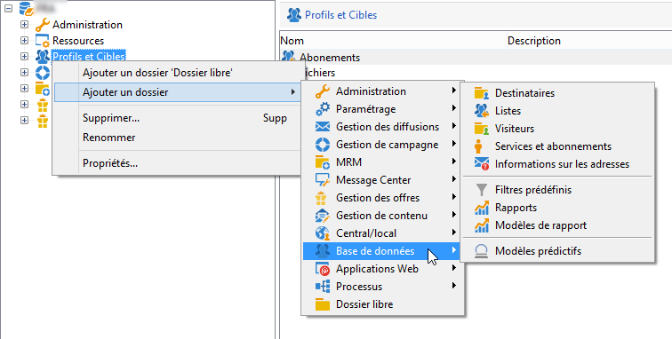

# A propos de la hiérarchie de navigation{#about-navigation-hierarchy}

L&#39;arborescence de navigation utilise le principe d&#39;un explorateur de fichiers (par exemple l&#39;Explorateur Windows®). Un dossier peut contenir un ensemble de sous-dossiers. La sélection d&#39;un noeud fait apparaître la vue correspondante au noeud.

La vue affichée est une liste associée à un schéma et à un formulaire de saisie pour l&#39;édition de la ligne sélectionnée.

Pour ajouter un nouveau dossier dans l&#39;arborescence, cliquez avec le bouton droit sur le dossier dans la branche duquel vous souhaitez insérer un dossier et choisissez **[!UICONTROL Ajouter un dossier]**. Dans le menu contextuel, sélectionnez le type de dossier à créer.

