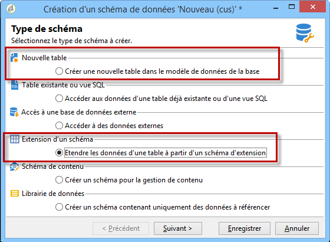
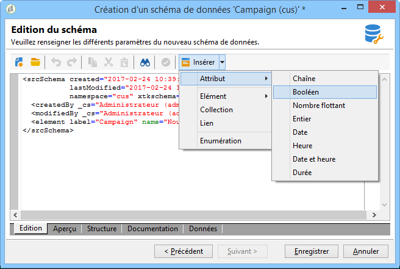
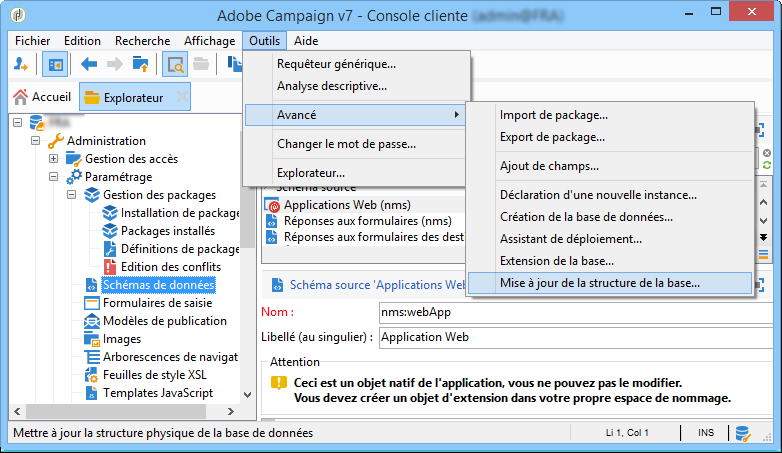

# A propos de l’édition de schéma{#about-schema-edition}

Dans Adobe Campaign, les schémas de données permettent de :

* définir la façon dont les objets de l&#39;application sont liés à des tables de la base de données ;
* définir des liens entre les différents objets de l&#39;application ;
* définir et décrire les champs individuels inclus dans chaque objet.

Pour une meilleure compréhension des tableaux intégrés aux campagnes et de leur interaction, consultez le modèle [de données de](https://helpx.adobe.com/campaign/kb/acc-datamodel.html)Campaign Classic.

## Extension ou création de schémas {#extending-or-creating-schemas}

Pour ajouter un champ ou un index ou un autre élément à l’un des schémas de données principaux de Campaign, comme la table des destinataires (nms:Recipient), vous devez étendre ce schéma. Pour plus d’informations, reportez-vous à la section [Extension d’un schéma](../../configuration/using/extending-a-schema.md) .

Pour ajouter un nouveau type de données qui n’existe pas prêt à l’emploi dans Adobe Campaign (une table de contrats, par exemple), vous pouvez créer directement un schéma personnalisé. For more on this, refer to the [Data schemas](../../configuration/using/data-schemas.md) section.



Une fois que vous avez créé une extension ou un nouveau schéma, il est recommandé de définir les éléments de son contenu XML dans l&#39;ordre ci-dessous.

## Enumérations {#enumerations}

Les énumérations sont définies avant l&#39;élément principal du schéma. Elles permettent d&#39;afficher des valeurs dans une liste afin de restreindre les choix de l&#39;utilisateur pour un champ donné.

Exemple :

```
<enumeration basetype="byte" name="exTransactionTypeEnum" default="store">
<value label="Website" name="web" value="0"/>
<value label="Call Center" name="phone" value="1"/>
<value label="In Store" name="store" value="2"/>
</enumeration>
```

Quand vous définissez des champs, vous pouvez ensuite utiliser cette énumération de la façon suivante :

```
<attribute desc="Type of Transaction" label="Transaction Type" name="transactionType" 
type="string" enum="exTransactionTypeEnum"/>
```

>[!NOTE]
>
>Vous pouvez également ajouter des énumérations gérées par l&#39;utilisateur (accessibles depuis le noeud **[!UICONTROL Administration]** > **[!UICONTROL Platform]**) pour spécifier les valeurs d&#39;un champ donné. Cela peut être judicieux si vous envisagez d&#39;utiliser votre énumération en dehors du schéma sur lequel vous travaillez.

To find out more about enumerations, refer to the [Enumerations](../../configuration/using/schema-structure.md#enumerations) and [`<enumeration>` element](../../configuration/using/elements-and-attributes.md#enumeration--element) sections.

## Index {#index}

Les index sont les premiers éléments déclarés à partir de l&#39;élément principal du schéma.

Ils peuvent être uniques ou non et référencer un ou plusieurs champs.

Exemples:

```
<dbindex name="email" unique="true">
  <keyfield xpath="@email"/>
</dbindex>
```

```
<dbindex name="lastNameAndZip">
  <keyfield xpath="@lastName"/>
  <keyfield xpath="location/@zipCode"/>
</dbindex>
```

L&#39;attribut **xpath** pointe vers le champ de votre schéma que vous souhaitez indexer.

>[!IMPORTANT]
>
>Les index permettent d&#39;optimiser les performances des requêtes SQL en termes de lecture mais aussi d&#39;écriture. Ils doivent donc être utilisés avec précaution.

For more on indexes, refer to the [Indexed fields](../../configuration/using/database-mapping.md#indexed-fields) section.

## Clés {#keys}

Chaque table doit posséder au moins une clé. Celle-ci est souvent définie automatiquement dans l&#39;élément principal du schéma au moyen de l&#39;attribut **@autopk** avec la valeur &quot;true&quot;.

La clé primaire peut également être définie au moyen de l&#39;attribut **internal**.

Exemple :

```
<key name="householdId" internal="true">
  <keyfield xpath="@householdId"/>
</key>
```

Dans cet exemple, au lieu de laisser l&#39;attribut **@autopk** créer une clé primaire par défaut nommée &quot;id&quot;, on définit ici la clé primaire &quot;householdId&quot;.

>[!IMPORTANT]
>
>Lors de la création ou de l’extension d’un schéma, vous devez conserver la valeur de la séquence de la clé primaire (@pkSequence) pour l’ensemble du schéma.

To find out more about keys, refer to the [Management of keys](../../configuration/using/database-mapping.md#management-of-keys) section.

## Attributs (champs) {#attributes--fields-}

Attributes allow you to define the fields which make up your data object. You can use the **[!UICONTROL Insert]** button in the schema edition toolbar to drop empty attribute templates into your XML where your cursor is. For more on this, refer to the [Data schemas](../../configuration/using/data-schemas.md) section.



La liste complète des attributs est disponible dans la section [`<attribute>` Elément](../../configuration/using/elements-and-attributes.md#attribute--element) . Voici quelques-uns des attributs les plus utilisés :

* **@advanced**
* **@dataPolicy**
* **@default**
* **@desc**
* **@enum**
* **@expr**
* **@label**
* **@length**
* **@name**
* **@notNull**
* **@required**
* **@ref**
* **@xml**
* **@type**

   To view a table listing the mappings for the data types generated by Adobe Campaign for the different database management systems, refer to the [Mapping the types of Adobe Campaign/DBMS data](../../configuration/using/schema-structure.md#mapping-the-types-of-adobe-campaign-dbms-data) section.

For more information on each attribute, refer to the [Attribute description](../../configuration/using/elements-and-attributes.md#attribute-description) section.

### Exemples {#examples}

Exemple de définition d&#39;une valeur par défaut :

```
<attribute name="transactionDate" label="Transaction Date" type="datetime" default="GetDate()"/>
```

Exemple d&#39;utilisation d&#39;un attribut commun en tant que modèle pour un champ également marqué comme obligatoire :

```
<attribute name="mobile" label="Mobile" template="nms:common:phone" required="true" />
```

Exemple de champ calculé masqué au moyen de l&#39;attribut **@advanced** :

```
<attribute name="domain" label="Email domain" desc="Domain of recipient email address" expr="GetEmailDomain([@email])" advanced="true" />
```

Exemple de champ XML également stocké dans un champ SQL et qui a un attribut **@dataPolicy** :

```
<attribute name="secondaryEmail" label="Secondary email address" length="100" xml="true" sql="true" dataPolicy="email" />
```

>[!IMPORTANT]
>
>Alors que la plupart des attributs sont associés selon une cardinalité 1-1 à un champ physique de la base de données, ce n&#39;est pas le cas pour les champs XML ni les champs calculés.\
>Un champ XML est stocké dans un champ memo (&quot;mData&quot;) de la table.\
>Un champ calculé en revanche est créé dynamiquement chaque fois qu&#39;une requête est lancée ; il n&#39;existe donc que dans la couche applicative.

## Liens {#links}

Les liens sont parmi les derniers éléments de l&#39;élément principal de votre schéma. Ils définissent comment les différents schémas de votre instance sont associés les uns aux autres.

Les liens sont déclarés dans le schéma qui contient la **clé étrangère** de la table à laquelle il est lié.

Il existe trois types de cardinalité : 1-1, 1-N et N-N. C&#39;est le type d&#39;association 1-N qui est utilisé par défaut.

### Exemples {#examples-1}

Exemple de relation 1-N entre la table des destinataires (schéma d&#39;usine) et une table des transactions personnalisée :

```
<element label="Recipient" name="lnkRecipient" revLink="lnkTransactions" target="nms:recipient" type="link"/>
```

Exemple de relation 1-1 entre un schéma personnalisé &quot;Car&quot; (dans l&#39;espace de nommage &quot;cus&quot;) et la table des destinataires :

```
<element label="Car" name="lnkCar" revCardinality="single" revLink="recipient" target="cus:car" type="link"/>
```

Exemple d&#39;une jointure externe entre la table des destinataires et une table des adresses reposant sur l&#39;adresse email et non une clé primaire :

```
<element name="emailInfo" label="Email Info" revLink="recipient" target="nms:address" type="link" externalJoin="true">
  <join xpath-dst="@address" xpath-src="@email"/>
</element>
```

&quot;xpath-dst&quot; correspond ici à la clé primaire dans le schéma cible et &quot;xpath-src&quot; à la clé étrangère dans le schéma source.

## Suivi {#audit-trail}

Il peut être utile d&#39;ajouter à la fin de votre schéma un élément de suivi.

Procédez comme dans l&#39;exemple ci-dessous pour inclure les champs relatifs à la date de création, à l&#39;utilisateur qui a créé la donnée, à la date et à l&#39;auteur de la dernière modification pour toutes les données de votre table :

```
<element aggregate="xtk:common:auditTrail" name="auditTrail"/>
```

## Mettre à jour la structure de la base de données {#updating-the-database-structure}

Une fois vos modifications effectuées et enregistrées, toutes celles affectant la structure SQL doivent être appliquées. Pour cela, vous devez lancer l&#39;assistant de mise à jour de la base de données.



Voir à ce sujet la section [Mettre à jour la structure de la base de données](../../configuration/using/updating-the-database-structure.md).

>[!NOTE]
>
>**[!UICONTROL Lorsque les modifications n&#39;affectent pas la structure de la base de données, vous devez simplement régénérer les schémas. Pour ce faire, sélectionnez le ou les schémas à mettre à jour, cliquez avec le bouton droit de la souris et choisissez]** Actions > Régénérer les schémas sélectionnés.... For more on this, refer to the [Regenerating schemas](../../configuration/using/regenerating-schemas.md) section.

