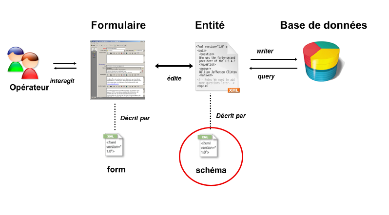
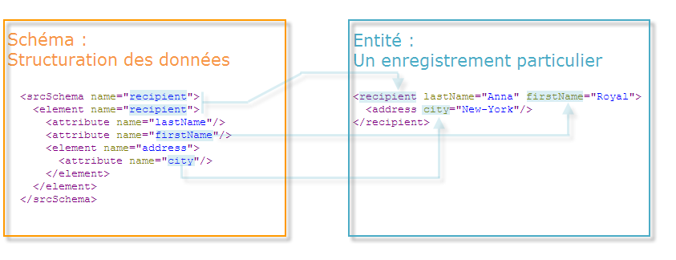

# Prise en main des schémas {#about-schema-reference}

## Qu’est-ce qu’un schéma ? {#what-is-a-schema}

Ce chapitre explique comment configurer des schémas d’extension afin d’étendre le modèle conceptuel de données de la base de données Adobe Campaign.

Pour une meilleure compréhension des tables intégrées de Campaign et de leur interaction, voir la section [Modèle de données Campaign Classic](about-data-model.md).

Dans Adobe Campaign, la structure physique et logique des données véhiculées dans l’application est décrite en XML. Un **schéma** est un document XML associé à une table de la base de données. Il définit la structure des données et décrit la définition SQL de la table :

* le nom de la table,
* des champs ;
* des index ;
* les liens avec les autres tables,

mais aussi la structure XML utilisée pour stocker les données :

* Eléments et attributs
* la hiérarchie entre les éléments,
* les types des éléments et des attributs,
* Les valeurs par défaut
* les libellés, les descriptions et autres propriétés.

Les schémas servent à définir en base une entité. A chaque entité, correspond un schéma.

L&#39;illustration suivante montre la place des schémas dans le système de données d&#39;Adobe Campaign :



## Syntaxe des schémas {#syntax-of-schemas}

L&#39;élément racine du schéma est **`<srcschema>`**. Il contient les sous-éléments **`<element>`** et **`<attribute>`**.

Le premier sous-élément **`<element>`** correspond à la racine de l&#39;entité.

```
<srcSchema name="recipient" namespace="cus">
  <element name="recipient">  
    <attribute name="lastName"/>
    <attribute name="email"/>
    <element name="location">
      <attribute name="city"/>
   </element>
  </element>
</srcSchema>
```

>[!NOTE]
>
>L&#39;élément racine de l&#39;entité porte le nom du schéma.



Les balises **`<element>`** définissent les noms des éléments d&#39;entité. Les balises **`<attribute>`** du schéma définissent les noms des attributs dans les balises **`<element>`** auxquelles elles ont été liées.

## Identification d&#39;un schéma {#identification-of-a-schema}

Un schéma de données est identifié par son nom et son espace de noms.

Un espace de noms vous permet de regrouper un ensemble de schémas par domaine d’intérêt. Par exemple, l’espace de noms **cus** est utilisé pour la configuration spécifique aux clientes et clients (**clients**).

La clé d&#39;identification d&#39;un schéma est une chaîne construite avec l&#39;espace de noms et le nom séparés par le caractère &#39;:&#39;, par exemple **cus:recipient**.

>[!IMPORTANT]
>
>* Le nom de l&#39;espace de noms doit être court et ne doit contenir que des caractères autorisés conformément aux règles de nommage XML.
>
>* Les identifiants ne doivent pas commencer par des caractères numériques.
>
>* Les espaces de noms suivants sont réservés à la description des entités système requises pour le fonctionnement de l’application Adobe Campaign et ne doivent pas être utilisés : **xtk**, **nl**, **nms**, **ncm**, **temp**, **ncl**, **crm**, **xxl**.
>
