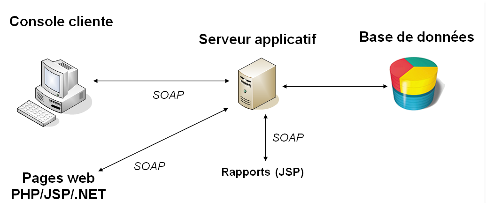
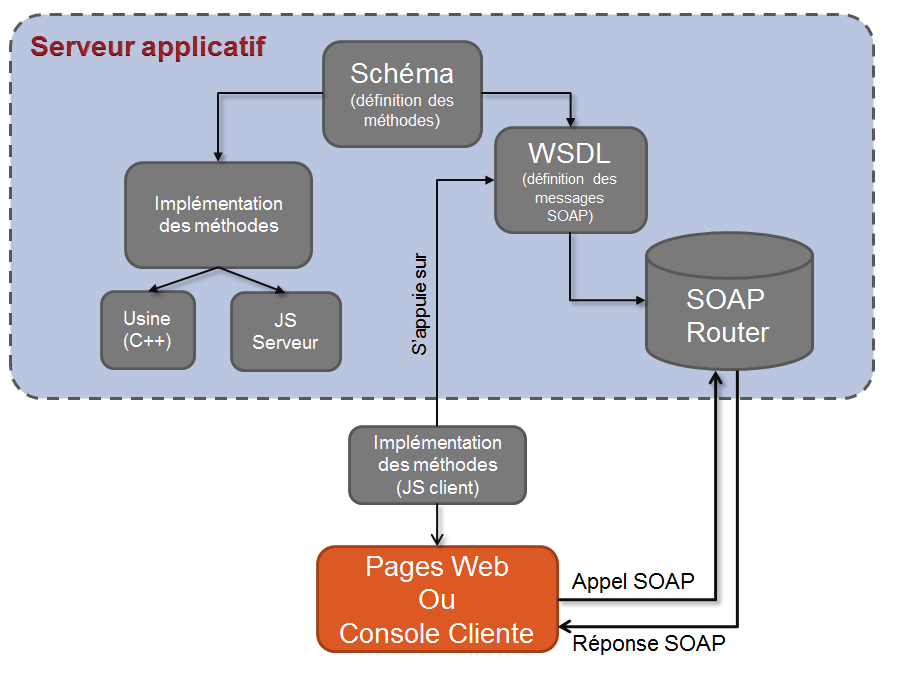

<?xml version="1.0" encoding="UTF-8"?>
<xliff xmlns="urn:oasis:names:tc:xliff:document:1.2" xmlns:okp="okapi-framework:xliff-extensions" xmlns:its="http://www.w3.org/2005/11/its" xmlns:itsxlf="http://www.w3.org/ns/its-xliff/" version="1.2" its:version="2.0">
<file original="help/configuration/using/about-web-services.md.mdsc" source-language="en-US" target-language="en-XX" datatype="x-text/markdown">
<body>
<trans-unit id="tu9" xml:space="preserve">
<source xml:lang="en-US">https://helpx.adobe.com/fr/legal/product-descriptions/adobe-campaign-classic---product-description.html</source>
<target xml:lang="en-XX">https://helpx.adobe.com/fr/legal/product-descriptions/adobe-campaign-classic---product-description.html</target>
</trans-unit>
<trans-unit id="tu1" restype="x-YAML_METADATA_HEADER_VALUE" xml:space="preserve">
<source xml:lang="en-US">About web services</source>
<target xml:lang="en-XX">À propos des services web</target>
</trans-unit>
<trans-unit id="tu2" restype="x-YAML_METADATA_HEADER_VALUE" xml:space="preserve">
<source xml:lang="en-US">About web services</source>
<target xml:lang="en-XX">À propos des services web</target>
</trans-unit>
<trans-unit id="tu3" xml:space="preserve">
<source xml:lang="en-US">About web services</source>
<target xml:lang="en-XX">À propos des services web</target>
</trans-unit>
<trans-unit id="tu4" xml:space="preserve">
<source xml:lang="en-US">Definition of Adobe Campaign APIs</source>
<target xml:lang="en-XX">Définition des API Adobe Campaign</target>
</trans-unit>
<trans-unit id="tu5" xml:space="preserve">
<source xml:lang="en-US">The Adobe Campaign application server was designed for openness and easy integration with increasingly diverse and complex company information systems.</source>
<target xml:lang="en-XX">Le serveur applicatif Adobe Campaign a été conçu dans un souci d'ouverture afin de faciliter son implémentation applicative et son intégration dans des environnements d'entreprise de plus en plus hétérogènes et complexes.</target>
</trans-unit>
<trans-unit id="tu6" xml:space="preserve">
<source xml:lang="en-US">Adobe Campaign APIs are used in JavaScript within the application and in SOAP outside of it. They make up a library of generic functions that can be enriched. For further information, refer to <ph id="1" ctype="x-LINK">[</ph>Implementing SOAP methods<ph id="2" ctype="x-LINK">](../../configuration/using/implementing-soap-methods.md)</ph>.</source>
<target xml:lang="en-XX">Les API Adobe Campaign sont utilisées dans l’application avec JavaScript et en externe avec SOAP. Elles constituent une bibliothèque de fonctions génériques qui peuvent être enrichies. Pour plus d’informations, voir la section <ph id="1" ctype="x-LINK">[</ph>Implémenter des méthodes SOAP<ph id="2" ctype="x-LINK">](../../configuration/using/implementing-soap-methods.md)</ph>.</target>
</trans-unit>
<trans-unit id="tu7" xml:space="preserve">
<source xml:lang="en-US"><ph id="1" ctype="x-regxph" equiv-text="&lbrack;!IMPORTANT">[!IMPORTANT]</ph></source>
<target xml:lang="en-XX"><ph id="1" ctype="x-regxph" equiv-text="&lbrack;!IMPORTANT">[!IMPORTANT]</ph></target>
</trans-unit>
<trans-unit id="tu8" xml:space="preserve">
<source xml:lang="en-US">The number of authorized Engine Calls per day varies upon your license contract. For more on this, refer to <ph id="1" ctype="x-LINK">&lbrack;</ph>this page<ph id="2" ctype="x-LINK">[#$tu9]</ph>.</source>
<target xml:lang="en-XX">Le nombre d'appels de moteur autorisé par jour varie selon votre contrat de licence. Pour plus d’informations, consultez <ph id="1" ctype="x-LINK">&lbrack;</ph>cette page<ph id="2" ctype="x-LINK">[#$tu9]</ph>.</target>
</trans-unit>
<trans-unit id="tu10" xml:space="preserve">
<source xml:lang="en-US">A list of all the APIs including their full description is available in <ph id="1" ctype="x-LINK_REF">[</ph>this dedicated documentation<ph id="2" ctype="x-LINK_REF">]</ph>(https://experienceleague.adobe.com/fr/tools/campaign-api</source>
<target xml:lang="en-XX">Retrouvez la liste de toutes les API, ainsi que leur description complète, dans <ph id="1" ctype="x-LINK_REF">[</ph>cette documentation dédiée<ph id="2" ctype="x-LINK_REF">]</ph>(https://experienceleague.adobe.com/fr/tools/campaign-api)</target>
</trans-unit>
<trans-unit id="tu11" xml:space="preserve">
<source xml:lang="en-US">Prerequisites</source>
<target xml:lang="en-XX">Conditions préalables</target>
</trans-unit>
<trans-unit id="tu12" xml:space="preserve">
<source xml:lang="en-US">Before using the Adobe Campaign APIs, you need to be familiar with the following topics:</source>
<target xml:lang="en-XX">Afin d’utiliser les API Adobe Campaign, il est conseillé de posséder des notions sur les sujets suivants :</target>
</trans-unit>
<trans-unit id="tu13" xml:space="preserve">
<source xml:lang="en-US">Javascript</source>
<target xml:lang="en-XX">Javascript</target>
</trans-unit>
<trans-unit id="tu14" xml:space="preserve">
<source xml:lang="en-US">SOAP protocol</source>
<target xml:lang="en-XX">protocole SOAP</target>
</trans-unit>
<trans-unit id="tu15" xml:space="preserve">
<source xml:lang="en-US">Adobe Campaign data model</source>
<target xml:lang="en-XX">Modèle de données Adobe Campaign</target>
</trans-unit>
<trans-unit id="tu16" xml:space="preserve">
<source xml:lang="en-US">Using Adobe Campaign APIs</source>
<target xml:lang="en-XX">Utilisation des API Adobe Campaign</target>
</trans-unit>
<trans-unit id="tu17" xml:space="preserve">
<source xml:lang="en-US">Adobe Campaign uses two types of APIs:</source>
<target xml:lang="en-XX">Adobe Campaign utilise deux types d’API :</target>
</trans-unit>
<trans-unit id="tu18" xml:space="preserve">
<source xml:lang="en-US">Generic data access APIs for querying the data model data. Refer to <ph id="1" ctype="x-LINK">[</ph>Data oriented APIs<ph id="2" ctype="x-LINK">](../../configuration/using/data-oriented-apis.md)</ph>.</source>
<target xml:lang="en-XX">API génériques d’accès aux données pour interroger les données du modèle de données. Pour plus d'informations, consultez la section <ph id="1" ctype="x-LINK">[</ph>API orientées données<ph id="2" ctype="x-LINK">](../../configuration/using/data-oriented-apis.md)</ph>.</target>
</trans-unit>
<trans-unit id="tu19" xml:space="preserve">
<source xml:lang="en-US">Business specific APIs that let you act on each object: deliveries, workflows, subscriptions, etc. Refer to <ph id="1" ctype="x-LINK">[</ph>Business oriented APIs<ph id="2" ctype="x-LINK">](../../configuration/using/business-oriented-apis.md)</ph>.</source>
<target xml:lang="en-XX">API spécifiques métier qui permettent d’agir sur chaque type d’objet : diffusions, workflows, abonnements, etc. Consultez la section <ph id="1" ctype="x-LINK">[</ph>API orientées métier<ph id="2" ctype="x-LINK">](../../configuration/using/business-oriented-apis.md)</ph>.</target>
</trans-unit>
<trans-unit id="tu20" xml:space="preserve">
<source xml:lang="en-US">In order to develop APIs and interact with Adobe Campaign, you need to be familiar with your data model. Adobe Campaign lets you generate a complete description of the base. Refer to <ph id="1" ctype="x-LINK">[</ph>Description of the model<ph id="2" ctype="x-LINK">](../../configuration/using/data-oriented-apis.md#description-of-the-model)</ph>.</source>
<target xml:lang="en-XX">Pour développer des API et interagir avec Adobe Campaign, vous devez connaître votre modèle de données. Adobe Campaign permet de générer une description complète de la base. Pour plus d'informations, consultez la section <ph id="1" ctype="x-LINK">[</ph>Description du modèle<ph id="2" ctype="x-LINK">](../../configuration/using/data-oriented-apis.md#description-of-the-model)</ph>.</target>
</trans-unit>
<trans-unit id="tu21" xml:space="preserve">
<source xml:lang="en-US">SOAP calls</source>
<target xml:lang="en-XX">Appels SOAP</target>
</trans-unit>
<trans-unit id="tu22" xml:space="preserve">
<source xml:lang="en-US">The SOAP protocol lets you invoke API methods, via the rich client, third-party applications using webservices, or JSP using these methods natively.</source>
<target xml:lang="en-XX">Le protocole SOAP permet l'invocation des méthodes de l'API, soit par le client riche, soit par des applications tierces au moyen de webservices, soit par des JSP utilisant nativement les méthodes.</target>
</trans-unit>
<trans-unit id="tu23" xml:space="preserve">
<source xml:lang="en-US"><ph id="1" ctype="x-IMAGE"></ph></source>
<target xml:lang="en-XX"><ph id="1" ctype="x-IMAGE"></ph></target>
</trans-unit>
<trans-unit id="tu24" xml:space="preserve">
<source xml:lang="en-US">The structure of a SOAP message is as follows:</source>
<target xml:lang="en-XX">La structure d'un message SOAP est la suivante :</target>
</trans-unit>
<trans-unit id="tu25" xml:space="preserve">
<source xml:lang="en-US">an envelope which defines the structure of the message,</source>
<target xml:lang="en-XX">une enveloppe qui définit la structure du message,</target>
</trans-unit>
<trans-unit id="tu26" xml:space="preserve">
<source xml:lang="en-US">an optional header,</source>
<target xml:lang="en-XX">un en-tête optionnel,</target>
</trans-unit>
<trans-unit id="tu27" xml:space="preserve">
<source xml:lang="en-US">a body containing the information about the call and the response,</source>
<target xml:lang="en-XX">un corps contenant les informations sur l'appel et la réponse,</target>
</trans-unit>
<trans-unit id="tu28" xml:space="preserve">
<source xml:lang="en-US">error management that defines the error condition.</source>
<target xml:lang="en-XX">une gestion d'erreur qui identifie la condition d'erreur.</target>
</trans-unit>
<trans-unit id="tu29" xml:space="preserve">
<source xml:lang="en-US">Resources and exchanges</source>
<target xml:lang="en-XX">Ressources et échanges</target>
</trans-unit>
<trans-unit id="tu30" xml:space="preserve">
<source xml:lang="en-US">The following schema shows the various resources involved in the use of Adobe Campaign APIs:</source>
<target xml:lang="en-XX">Le schéma suivant montre les différentes ressources interagissant dans l'utilisation des API Adobe Campaign :</target>
</trans-unit>
<trans-unit id="tu31" xml:space="preserve">
<source xml:lang="en-US"><ph id="1" ctype="x-IMAGE"></ph></source>
<target xml:lang="en-XX"><ph id="1" ctype="x-IMAGE"></ph></target>
</trans-unit>
<trans-unit id="tu32" xml:space="preserve">
<source xml:lang="en-US">Example of a SOAP message on the 'ExecuteQuery' method</source>
<target xml:lang="en-XX">Exemple de message SOAP sur la méthode « ExecuteQuery »</target>
</trans-unit>
<trans-unit id="tu33" xml:space="preserve">
<source xml:lang="en-US">In this example, a SOAP query invokes the "ExecuteQuery" method, which takes a character string as a parameter for authentication (session token) and an XML content for the description of the query to be executed.</source>
<target xml:lang="en-XX">Dans cet exemple, une requête SOAP invoque la méthode « ExecuteQuery » qui prend comme paramètre une chaîne de caractères pour l’authentification (jeton de session) et un contenu XML pour la description de la requête à exécuter.</target>
</trans-unit>
<trans-unit id="tu34" xml:space="preserve">
<source xml:lang="en-US">For further information, refer to <ph id="1" ctype="x-LINK">[</ph>ExecuteQuery (xtk<ph id="2" ctype="x-inline-directive">:queryDef</ph>)<ph id="3" ctype="x-LINK">](../../configuration/using/data-oriented-apis.md#executequery--xtk-querydef-)</ph>.</source>
<target xml:lang="en-XX">Pour plus d’informations, consultez <ph id="1" ctype="x-LINK">[</ph>ExecuteQuery (xtk<ph id="2" ctype="x-inline-directive">:queryDef</ph>)<ph id="3" ctype="x-LINK">](../../configuration/using/data-oriented-apis.md#executequery--xtk-querydef-)</ph>.</target>
</trans-unit>
<trans-unit id="tu35" xml:space="preserve">
<source xml:lang="en-US"><ph id="1" ctype="x-regxph" equiv-text="&lbrack;!NOTE">[!NOTE]</ph></source>
<target xml:lang="en-XX"><ph id="1" ctype="x-regxph" equiv-text="&lbrack;!NOTE">[!NOTE]</ph></target>
</trans-unit>
<trans-unit id="tu36" xml:space="preserve">
<source xml:lang="en-US">The WSDL description of this service is completed in the example shown here: <ph id="1" ctype="x-LINK">[</ph>Web service description: WSDL<ph id="2" ctype="x-LINK">](../../configuration/using/web-service-calls.md#web-service-description--wsdl)</ph>.</source>
<target xml:lang="en-XX">La description WSDL de ce service est renseignée dans l’exemple de la section <ph id="1" ctype="x-LINK">[</ph>Description des services web : WSDL<ph id="2" ctype="x-LINK">](../../configuration/using/web-service-calls.md#web-service-description--wsdl)</ph>.</target>
</trans-unit>
<trans-unit id="tu37" xml:space="preserve">
<source xml:lang="en-US">SOAP query</source>
<target xml:lang="en-XX">Requête SOAP</target>
</trans-unit>
<trans-unit id="tu38" xml:space="preserve">
<source xml:lang="en-US">The <ph id="1" ctype="x-CODE">`&lt;soap-env:envelope>`</ph> element is the first element of the message representing the SOAP envelope.</source>
<target xml:lang="en-XX">L’élément <ph id="1" ctype="x-CODE">`&lt;soap-env:envelope>`</ph> est le premier élément du message représentant l’enveloppe SOAP.</target>
</trans-unit>
<trans-unit id="tu39" xml:space="preserve">
<source xml:lang="en-US">The <ph id="1" ctype="x-CODE">`&lt;soap-env:body>`</ph> element is the first child element of the envelope. It contains the description of the message, i.e. the content of the query or the response.</source>
<target xml:lang="en-XX">L’élément <ph id="1" ctype="x-CODE">`&lt;soap-env:body>`</ph> est le premier élément enfant de l’enveloppe. Il contient la description du message, c’est-à-dire le contenu de la requête ou de la réponse.</target>
</trans-unit>
<trans-unit id="tu40" xml:space="preserve">
<source xml:lang="en-US">The method to be invoked is entered in the <ph id="1" ctype="x-CODE">`&lt;executequery>`</ph> element from the body of the SOAP message.</source>
<target xml:lang="en-XX">La méthode à invoquer est renseignée dans l’élément <ph id="1" ctype="x-CODE">`&lt;executequery>`</ph> à partir du corps du message SOAP.</target>
</trans-unit>
<trans-unit id="tu41" xml:space="preserve">
<source xml:lang="en-US">In SOAP, the parameters are recognized by order of appearance. The first parameter, <ph id="1" ctype="x-CODE">`&lt;__sessiontoken>`</ph>, takes the authentication chain, the second parameter is the XML description of the query from the <ph id="2" ctype="x-CODE">`&lt;querydef>`</ph> element.</source>
<target xml:lang="en-XX">Dans SOAP, les paramètres sont reconnus par ordre d’apparition. Le premier paramètre, <ph id="1" ctype="x-CODE">`&lt;__sessiontoken>`</ph>, contient la chaîne d’authentification, le second est la description XML de la requête de l’élément <ph id="2" ctype="x-CODE">`&lt;querydef>`</ph>.</target>
</trans-unit>
<trans-unit id="tu42" xml:space="preserve">
<source xml:lang="en-US">SOAP response</source>
<target xml:lang="en-XX">Réponse SOAP</target>
</trans-unit>
<trans-unit id="tu43" xml:space="preserve">
<source xml:lang="en-US">The result of the query is entered from the <ph id="1" ctype="x-CODE">`&lt;pdomoutput>`</ph> element.</source>
<target xml:lang="en-XX">Le résultat de la requête est renseigné à partir de l’élément <ph id="1" ctype="x-CODE">`&lt;pdomoutput>`</ph>.</target>
</trans-unit>
<trans-unit id="tu44" xml:space="preserve">
<source xml:lang="en-US">Error management</source>
<target xml:lang="en-XX">Gestion des erreurs</target>
</trans-unit>
<trans-unit id="tu45" xml:space="preserve">
<source xml:lang="en-US">Example SOAP error response:</source>
<target xml:lang="en-XX">Exemple de réponse d'erreur SOAP :</target>
</trans-unit>
<trans-unit id="tu46" xml:space="preserve">
<source xml:lang="en-US">The <ph id="1" ctype="x-CODE">`&lt;soap-env:fault>`</ph> element in the body of the SOAP message is used to convey the error signals arising during the processing of the web service. This is composed of the following sub-elements:</source>
<target xml:lang="en-XX">L’élément <ph id="1" ctype="x-CODE">`&lt;soap-env:fault>`</ph> du corps du message SOAP sert à transmettre les signaux d’erreur qui se produisent pendant le traitement du service web. Il se compose des sous-éléments suivants :</target>
</trans-unit>
<trans-unit id="tu47" xml:space="preserve">
<source xml:lang="en-US"><ph id="1" ctype="x-CODE">`&lt;faultcode>`</ph> : indicates the type of error. The error types are:</source>
<target xml:lang="en-XX"><ph id="1" ctype="x-CODE">`&lt;faultcode>`</ph> : indique le type d’erreur. Les types d’erreurs sont les suivants :</target>
</trans-unit>
<trans-unit id="tu48" xml:space="preserve">
<source xml:lang="en-US">"VersionMismatch" in the event of incompatibility with the SOAP version used,</source>
<target xml:lang="en-XX">"VersionMismatch" en cas d'incompatibilité avec la version de SOAP utilisée,</target>
</trans-unit>
<trans-unit id="tu49" xml:space="preserve">
<source xml:lang="en-US">"MustUnderstand" in the event of a problem in the message header,</source>
<target xml:lang="en-XX">"MustUnderstand" en cas de problème dans l'en-tête du message,</target>
</trans-unit>
<trans-unit id="tu50" xml:space="preserve">
<source xml:lang="en-US">"Client" in the event that the client is missing some information,</source>
<target xml:lang="en-XX">"Client" en cas de manque d'informations de la part du client,</target>
</trans-unit>
<trans-unit id="tu51" xml:space="preserve">
<source xml:lang="en-US">"Server" in the event that the server has a problem executing the processing.</source>
<target xml:lang="en-XX">"Server" en cas de problème d'exécution des traitements par le serveur.</target>
</trans-unit>
<trans-unit id="tu52" xml:space="preserve">
<source xml:lang="en-US"><ph id="1" ctype="x-CODE">`&lt;faultstring>`</ph> : message describing the error</source>
<target xml:lang="en-XX"><ph id="1" ctype="x-CODE">`&lt;faultstring>`</ph> : message décrivant l’erreur</target>
</trans-unit>
<trans-unit id="tu53" xml:space="preserve">
<source xml:lang="en-US"><ph id="1" ctype="x-CODE">`&lt;detail>`</ph> : long error message</source>
<target xml:lang="en-XX"><ph id="1" ctype="x-CODE">`&lt;detail>`</ph> : message long de l’erreur</target>
</trans-unit>
<trans-unit id="tu54" xml:space="preserve">
<source xml:lang="en-US">The success or failure of the service invocation is identified when the <ph id="1" ctype="x-CODE">`&lt;faultcode>`</ph> element is verified.</source>
<target xml:lang="en-XX">Le succès ou l’échec de l’invocation du service est identifié par la vérification de l’élément <ph id="1" ctype="x-CODE">`&lt;faultcode>`</ph></target>
</trans-unit>
<trans-unit id="tu55" xml:space="preserve">
<source xml:lang="en-US"><ph id="1" ctype="x-regxph" equiv-text="&lbrack;!IMPORTANT">[!IMPORTANT]</ph></source>
<target xml:lang="en-XX"><ph id="1" ctype="x-regxph" equiv-text="&lbrack;!IMPORTANT">[!IMPORTANT]</ph></target>
</trans-unit>
<trans-unit id="tu56" xml:space="preserve">
<source xml:lang="en-US">All Adobe Campaign Web services handle errors. It is therefore strongly recommended to test each call in order to handle returned errors.</source>
<target xml:lang="en-XX">Tous les services web Adobe Campaign gèrent les erreurs. Il est donc fortement recommandé de tester chaque appel afin de gérer les retours d’erreur.</target>
</trans-unit>
<trans-unit id="tu57" xml:space="preserve">
<source xml:lang="en-US">Example of error handling in C#:</source>
<target xml:lang="en-XX">Exemple de gestion des erreurs en C# :</target>
</trans-unit>
<trans-unit id="tu58" xml:space="preserve">
<source xml:lang="en-US">URL of Web service server (or EndPoint)</source>
<target xml:lang="en-XX">URL du serveur des services Web (ou point d’entrée)</target>
</trans-unit>
<trans-unit id="tu59" xml:space="preserve">
<source xml:lang="en-US">To submit the Web service, the Adobe Campaign server that implements the corresponding service method must be contacted.</source>
<target xml:lang="en-XX">Pour soumettre le service Web, il faut contacter le serveur Adobe Campaign implémentant la méthode du service correspondant.</target>
</trans-unit>
<trans-unit id="tu60" xml:space="preserve">
<source xml:lang="en-US">The server URL is as follows:</source>
<target xml:lang="en-XX">L'URL du serveur est la suivante :</target>
</trans-unit>
<trans-unit id="tu61" xml:space="preserve">
<source xml:lang="en-US">https://serverName/nl/jsp/soaprouter.jsp</source>
<target xml:lang="en-XX">https://serverName/nl/jsp/soaprouter.jsp</target>
</trans-unit>
<trans-unit id="tu62" xml:space="preserve">
<source xml:lang="en-US">With <ph id="1" ctype="x-STRONG_EMPHASIS">**`&lt;server>`**</ph> the Adobe Campaign application server (<ph id="4" ctype="x-STRONG_EMPHASIS">**</ph>nlserver web<ph id="5" ctype="x-STRONG_EMPHASIS">**</ph>).</source>
<target xml:lang="en-XX">Avec <ph id="1" ctype="x-STRONG_EMPHASIS">**`&lt;server>`**</ph> le serveur applicatif Adobe Campaign (<ph id="4" ctype="x-STRONG_EMPHASIS">**</ph>nlserver web<ph id="5" ctype="x-STRONG_EMPHASIS">**</ph>).</target>
</trans-unit>
</body>
</file>
</xliff>