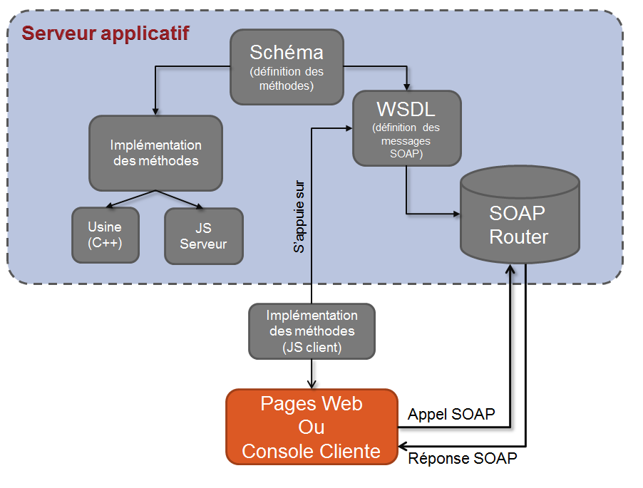

# À propos des services web{#about-web-services}

## Définition des API Adobe Campaign {#definition-of-adobe-campaign-apis}

Le serveur applicatif Adobe Campaign a été conçu dans un souci d&#39;ouverture afin de faciliter son implémentation applicative et son intégration dans des environnements d&#39;entreprise de plus en plus hétérogènes et complexes.

Les API Adobe Campaign sont utilisées dans l’application avec JavaScript et en externe avec SOAP. Elles constituent une bibliothèque de fonctions génériques qui peuvent être enrichies. Pour plus d’informations, voir la section [Implémenter des méthodes SOAP](../../configuration/using/implementing-soap-methods.md).

>[!IMPORTANT]
>
>Le nombre d&#39;appels de moteur autorisé par jour varie selon votre contrat de licence. Voir à ce sujet [cette page](https://helpx.adobe.com/fr/legal/product-descriptions/adobe-campaign-classic---product-description.html).\
>Retrouvez la liste de toutes les API, ainsi que leur description complète, dans [cette documentation dédiée](https://experienceleague.adobe.com/developer/campaign-api/api/index.html?lang=fr).

## Conditions préalables {#prerequisites}

Afin d’utiliser les API Adobe Campaign, il est conseillé de posséder des notions sur les sujets suivants :

* Javascript
* protocole SOAP
* modèle de données Adobe Campaign

## Utilisation des API Adobe Campaign {#using-adobe-campaign-apis}

Adobe Campaign utilise deux types d’API :

* Les API génériques d’accès aux données qui permettent d’interroger les données du modèle de données. Pour plus d&#39;informations, consultez la section [API orientées données](../../configuration/using/data-oriented-apis.md).
* Les API spécifiques métier qui permettent d&#39;agir sur chaque type d’objet : diffusions, workflows, abonnements, etc. Pour plus d&#39;informations, consultez la section [API orientées métier](../../configuration/using/business-oriented-apis.md).

Pour développer des API et interagir avec Adobe Campaign, vous devez connaître votre modèle de données. Adobe Campaign permet de générer une description complète de la base. Pour plus d&#39;informations, consultez la section [Description du modèle](../../configuration/using/data-oriented-apis.md#description-of-the-model).

## Appels SOAP {#soap-calls}

Le protocole SOAP permet l&#39;invocation des méthodes de l&#39;API, soit par le client riche, soit par des applications tierces au moyen de webservices, soit par des JSP utilisant nativement les méthodes.


La structure d&#39;un message SOAP est la suivante :

* une enveloppe qui définit la structure du message,
* un en-tête optionnel,
* un corps contenant les informations sur l&#39;appel et la réponse,
* une gestion d&#39;erreur qui identifie la condition d&#39;erreur.

## Ressources et échanges {#resources-and-exchanges}

Le schéma suivant montre les différentes ressources interagissant dans l&#39;utilisation des API Adobe Campaign :



## Exemple de message SOAP sur la méthode &#39;ExecuteQuery&#39; {#example-of-a-soap-message-on-the--executequery--method--}

Dans cet exemple, une requête SOAP invoque la méthode &quot;ExecuteQuery&quot; qui prend en paramètre une chaîne de caractères pour l&#39;authentification (token de session) et un contenu XML pour la description de la requête à exécuter.

Pour plus d’informations, voir la section [ExecuteQuery (xtk:queryDef)](../../configuration/using/data-oriented-apis.md#executequery--xtk-querydef-).

>[!NOTE]
>
>La description WSDL de ce service est renseignée dans l’exemple de la section [Description des services Web : WSDL](../../configuration/using/web-service-calls.md#web-service-description--wsdl).

### Requête SOAP {#soap-query}

```
<?xml version='1.0' encoding='ISO-8859-1'?>
  <SOAP-ENV:Envelope xmlns:xsd='http://www.w3.org/2001/XMLSchema' xmlns:xsi='http://www.w3.org/2001/XMLSchema-instance' xmlns:ns='http://xml.apache.org/xml-soap' xmlns:SOAP-ENV='http://schemas.xmlsoap.org/soap/envelope/'>
    <SOAP-ENV:Body>
      <ExecuteQuery xmlns='urn:xtk:queryDef' SOAP-ENV:encodingStyle='http://schemas.xmlsoap.org/soap/encoding/'>
        <__sessiontoken xsi:type='xsd:string'/>
        <entity xsi:type='ns:Element' SOAP-ENV:encodingStyle='http://xml.apache.org/xml-soap/literalxml'>
          <queryDef firstRows="true" lineCount="200" operation="select" schema="nms:rcpGrpRel" startLine="0" startPath="/" xtkschema="xtk:queryDef">
          ...
          </queryDef>
        </entity>
      </ExecuteQuery>
  </SOAP-ENV:Body>
</SOAP-ENV:Envelope>
```

L’élément `<soap-env:envelope>` est le premier élément du message représentant l’enveloppe SOAP.

L’élément `<soap-env:body>` est le premier élément enfant de l’enveloppe. Il contient la description du message, c’est-à-dire le contenu de la requête ou de la réponse.

La méthode à invoquer est renseignée dans l’élément `<executequery>` à partir du corps du message SOAP.

Dans SOAP, les paramètres sont reconnus par ordre d’apparition. Le premier paramètre, `<__sessiontoken>`, contient la chaîne d’authentification, le second est la description XML de la requête de l’élément `<querydef>`.

### Réponse SOAP {#soap-response}

```
<?xml version='1.0' encoding='ISO-8859-1'?>
  <SOAP-ENV:Envelope xmlns:xsd='http://www.w3.org/2001/XMLSchema' xmlns:xsi='http://www.w3.org/2001/XMLSchema-instance' xmlns:ns='http://xml.apache.org/xml-soap' xmlns:SOAP-ENV='http://schemas.xmlsoap.org/soap/envelope/'>
    <SOAP-ENV:Body>
      <ExecuteQueryResponse xmlns='urn:xtk:queryDef' SOAP-ENV:encodingStyle='http://schemas.xmlsoap.org/soap/encoding/'>
        <pdomOutput xsi:type='ns:Element' SOAP-ENV:encodingStyle='http://xml.apache.org/xml-soap/literalxml'>
          <rcpGrpRel-collection><rcpGrpRel group-id="1872" recipient-id="1362"></rcpGrpRel></rcpGrpRel-collection>
        </pdomOutput>
      </ExecuteQueryResponse>
    </SOAP-ENV:Body>
</SOAP-ENV:Envelope>
```

Le résultat de la requête est renseigné à partir de l’élément `<pdomoutput>`.

## Gestion des erreurs        {#error-management}

Exemple de réponse d&#39;erreur SOAP :

```
<?xml version='1.0' encoding='ISO-8859-1'?>
<SOAP-ENV:Envelope xmlns:SOAP-ENV='http://schemas.xmlsoap.org/soap/envelope/'>
  <SOAP-ENV:Body>
    <SOAP-ENV:Fault>
      <faultcode>SOAP-ENV:Server</faultcode>
      <faultstring>Error while executing 'Write' of the 'xtk:persist'.</faultstring> service
      <detail>ODBC error: [Microsoft][ODBC SQL Server Driver][SQL Server]Cannot insert duplicate key row in object 'XtkOption' with unique index 'XtkOption_name'. SQLSTate: 23000
ODBC error: [Microsoft][ODBC SQL Server Driver][SQL Server]The statement has been terminated. SQLSTate: 01000 Cannot save the 'Options (xtk:option)' document </detail>
    </SOAP-ENV:Fault>
  </SOAP-ENV:Body>
</SOAP-ENV:Envelope>
```

L’élément `<soap-env:fault>` du corps du message SOAP sert à transmettre les signaux d’erreur qui se produisent pendant le traitement du service web. Il se compose des sous-éléments suivants :

* `<faultcode>` : indique le type d’erreur. Les types d’erreurs sont les suivants :

   * &quot;VersionMismatch&quot; en cas d&#39;incompatibilité avec la version de SOAP utilisée,
   * &quot;MustUnderstand&quot; en cas de problème dans l&#39;en-tête du message,
   * &quot;Client&quot; en cas de manque d&#39;informations de la part du client,
   * &quot;Server&quot; en cas de problème d&#39;exécution des traitements par le serveur.

* `<faultstring>` : message décrivant l’erreur
* `<detail>` : message long de l’erreur

Le succès ou l’échec de l’invocation du service est identifié par la vérification de l’élément `<faultcode>`

>[!IMPORTANT]
>
>Tous les services Web Adobe Campaign gèrent les erreurs. Il est donc fortement recommandé de tester chaque appel afin de gérer les retours d&#39;erreur.

Exemple de gestion des erreurs en C# :

```
try 
{
  // Invocation of method
  ...
}
catch (SoapException e)
{
  System.Console.WriteLine("Soap exception: " + e.Message);        
  if (e.Detail != null)
    System.Console.WriteLine(e.Detail.InnerText);
}
```

## URL du serveur des services Web (ou point d’entrée) {#url-of-web-service-server--or-endpoint-}

Pour soumettre le service Web, il faut contacter le serveur Adobe Campaign implémentant la méthode du service correspondant.

L&#39;URL du serveur est la suivante :

https://serverName/nl/jsp/soaprouter.jsp

Avec **`<server>`** le serveur applicatif Adobe Campaign (**nlserver web**).
