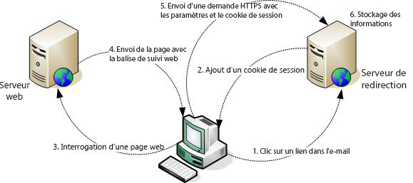

# À propos du tracking web{#about-web-tracking}

Outre le suivi standard qui montre le comportement d’un internaute qui clique sur un lien dans un e-mail, la plateforme Adobe Campaign permet de collecter des informations sur la navigation des internautes sur votre site web. Cette collecte de données est réalisée par le module de tracking web.

Lorsqu’un internaute clique sur un lien suivi dans un e-mail d’une diffusion donnée, le serveur de redirection contacté dépose un cookie de session contenant l’identifiant broadlog (broadlogId) ainsi que l’identifiant de la diffusion (deliveryId).

Le client Web transmettra alors ce cookie au serveur à chaque fois qu&#39;il visitera une page contenant une balise de tracking Web, ceci pendant toute la durée de la session, c&#39;est-à-dire jusqu&#39;à ce que le client Web soit fermé.

Le serveur de redirection collecte donc les informations suivantes :

* l&#39;URL de la page web visitée, via un identifiant transmis en paramètre,
* la diffusion à partir de laquelle la page web est visitée, via le cookie de session,
* l&#39;identifiant de l&#39;internaute ayant cliqué, via le cookie de session,
* des informations supplémentaires, telles que le chiffre d&#39;affaires généré.

Le schéma suivant présente les étapes de la conversation entre le client et les différents serveurs.

