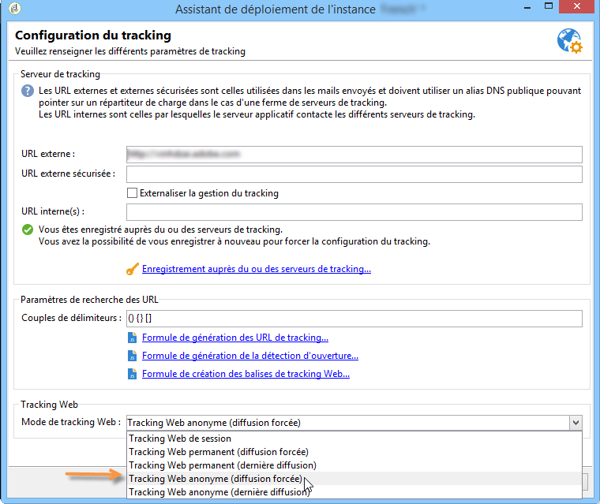
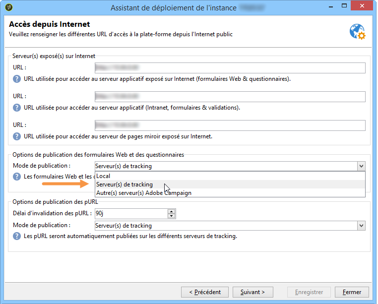

# Tracking anonyme{#anonymous-tracking}

Adobe Campaign permet d’associer les informations de tracking Web collectées à un destinataire lorsqu’il navigue anonymement sur votre site. En effet, lorsqu’un internaute navigue sur les pages tagguées de votre site web, ses informations de navigation sont collectées. Lorsqu’il clique dans un email envoyé via Adobe Campaign, il est identifié et les informations lui sont automatiquement rattachées.

>[!IMPORTANT]
>
>La mise en place du tracking anonyme sur un site peut entraîner la collecte de très nombreux logs de tracking, et affecter le bon fonctionnement de la base de données. Il doit être configuré avec précaution sur votre site.\
>Les logs de tracking sont enregistrés dans la base de données jusqu’à la purge des données de tracking. Les délais de purge sont paramétrés au travers de l’assistant de déploiement. Consultez à ce propos [cette section](../../installation/using/deploying-an-instance.md#purging-data)

Pour activer le tracking Web anonyme sur votre instance, les éléments suivants doivent être configurés :

* Le paramètre **trackWebVisitors** de l’élément **redirection** du fichier **serverConf.xml** du serveur de tracking doit être réglé sur ‘**true**’, afin de poser un cookie permanent (**uuid230**) dans le navigateur des internautes inconnus qui visitent les pages du site.
* Le mode **Tracking Web anonyme** doit être sélectionné dans la fenêtre de configuration du tracking de l’assistant de déploiement.

  

* Les formulaires web doivent être publiés et exécutés sur le serveur de tracking. L&#39;option correspondante doit être sélectionnée dans l&#39;assistant de déploiement.

  
