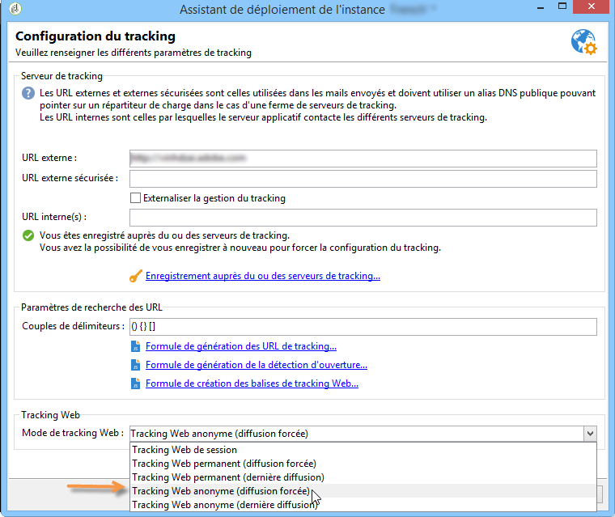
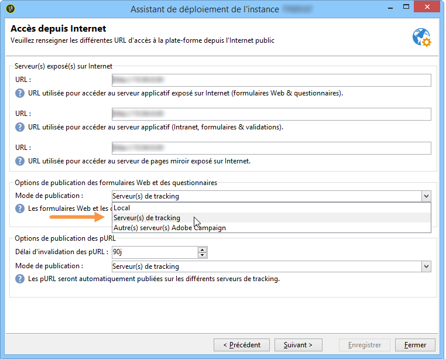

# Tracking anonyme{#anonymous-tracking}

Adobe Campaign vous permet d’associer les informations de tracking web collectées à une personne destinataire lorsqu’elle navigue anonymement sur votre site.Lorsqu’une personne navigue sur les pages balisées de votre site web, ses informations de navigation sont collectées. Lorsqu’elle clique sur un e-mail envoyé par Adobe Campaign, elle est identifiée et les informations lui sont automatiquement rattachées.

>[!IMPORTANT]
>
>La mise en place du tracking anonyme sur un site web peut entraîner la collecte d’un très grand nombre de logs de tracking et affecter le fonctionnement de la base de données.Configurez cette option avec soin.\
>Les logs de tracking sont enregistrés dans la base de données jusqu’à ce que les données de tracking soient purgées.Utilisez l’assistant de déploiement pour configurer la fréquence de purge.Voir à ce propos [cette section](../../installation/using/deploying-an-instance.md#purging-data).

Pour activer le tracking Web anonyme sur votre instance, les éléments suivants doivent être configurés :

* Le paramètre **trackWebVisitors** de l’élément **redirection** du fichier **serverConf.xml** du serveur de tracking doit être réglé sur ‘**true**’, afin de poser un cookie permanent (**uuid230**) dans le navigateur des internautes inconnus qui visitent les pages du site.
* Le mode **Tracking Web anonyme** doit être sélectionné dans la fenêtre de configuration du tracking de l’assistant de déploiement.

  

* Les formulaires web doivent être publiés et exécutés sur le serveur de tracking. L&#39;option correspondante doit être sélectionnée dans l&#39;assistant de déploiement.

  
