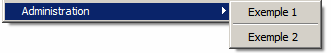
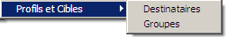

# Configuration{#configuration}

Les types de dossiers utilisés par la liste de navigation sont décrits dans un document XML respectant la grammaire du schéma **xtk:navtree**.

La structure du document XML est la suivante :

```
<navtree name="name" namespace="name_space">
  <!-- Global commands -->
  <commands>
      ...
  </commands>
  
  <!-- Structured space for adding a folder -->
  <model name="<name>" label="<Label>">
    <!-- Folder type -->
    <nodeModel>
      ...
    </nodeModel>
<model name="<name>" label="<Sub model>">
      ...
    </model>
  </model> 
</navtree>
```

Le document XML contient l’élément **`<navtree>`** racine avec les attributs **name** et **namespace** pour spécifier le nom et l’espace de noms du document. Le nom et l’espace de noms constituent la clé d’identification du document.

The global commands of the application are declared in the document from the **`<commands>`** element.

The declaration of file types is structured in the document with the following elements: **`<model>`** and **`<nodemodel>`**.

## Commandes globales {#global-commands}

Une commande globale permet de lancer une action, cette action peut être une forme de saisie ou un appel SOAP.

Les commandes globales sont accessibles à partir du menu principal **[!UICONTROL Outils]**.

La struture du paramétrage des commandes est la suivante :

```
<commands>
  <!-- Description of a command -->
  <command name="<name>" label="<label>" desc="<Description>" form="<form>" rights="<rights>">
    <soapCall name="<name>" service="<schema>">
      <param type="<type>" exprIn="<xpath>"/>  
        ...
    </soapCall>
    <enter>
      ...
    </enter>
  </command>
  <!-- Separator -->
  <command label="-" name="<name>"/>
  <!-- Command structure -->
  <command name="<name>" label="<Label>">
    <command...
  </command>
</commands>
```

The description of a global command is entered in the **`<command>`** element with the following properties:

* **name** : nom interne de la commande : le nom doit obligatoirement être renseigné et unique.
* **label** : libellé de la commande.
* **desc** : description visible à partir de la barre de statut de l&#39;écran principal.
* **form** : formulaire à lancer : la valeur à renseigner est la clé d&#39;identification du formulaire de saisie (par exemple &quot;cus:recipient&quot;).
* **rights** : liste des droits nommés (séparés par une virgule) permettant l&#39;accès à cette commande. La liste des droits disponibles est accessible à partir du dossier **[!UICONTROL Administration > Gestion des accès > Droits nommés]**.
* **promptLabel** : affiche une boîte de confirmation avant l&#39;exécution de la commande.

Un **`<command>`** élément peut contenir **`<command>`** des sous-éléments. Dans ce cas, l’élément parent vous permet d’afficher un sous-menu composé de ces éléments enfants.

L&#39;affichage des commandes respecte l&#39;ordre de déclaration dans le document XML.

Un séparateur de commande permet d&#39;afficher une barre de séparation entre les commandes, il est identifié par la valeur **&#39;-&#39;** contenue dans le libellé de la commande.

La présence facultative de la **`<soapcall>`** balise avec ses paramètres d’entrée définit l’appel d’une méthode SOAP à exécuter. Pour plus d’informations sur l’API SOAP, consultez la documentation [JSAPI de](http://docs.campaign.adobe.com/doc/AC/en/jsapi/index.html)Campaign.

Le contexte du formulaire peut être mis à jour lors de l’initialisation à partir de la **`<enter>`** balise . Pour plus d’informations sur cette balise, consultez la documentation sur les formulaires d’entrée.

**Exemple**:

* Déclaration d&#39;une commande globale pour lancer la forme &quot;xtk:import&quot; :

   ```
   <command desc="Start the data import wizard" form="xtk:import" label="&amp;Data import..." name="import" rights="import,recipientImport"/>
   ```

   A keyboard shortcut is declared on the &#39;I&#39; character by the presence of **&amp;** in the command label.

* Exemple de sous-menu avec séparateur :

   

   ```
   <command label="Administration" name="admin">
     <command name="cmd1" label="Example 1" form="cus:example1"/>
     <command name="sep" label="-"/>
     <command name="cmd1" label="Example 2" form="cus:example2">
       <enter>
         <set xpath="@type" expr="1"/>
       </enter>
     </command>
   </command>
   ```

* Exécution d&#39;une méthode SOAP :

   ```
   <command name="cmd3" label="Example 3" promptLabel="Do you really want to execute the command?">
     <soapCall name="Execute" service="xtk:sql"/>
   </command>
   ```

## Type de dossier {#folder-type}

Un type de dossier permet de donner l&#39;accès aux données d&#39;un schéma. La vue associée au dossier est composée d&#39;une liste et d&#39;un formulaire de saisie.

La structure du paramétrage des types de dossier est la suivante :

```
<!-- Structured location to add the folder -->
<model name="name" label="Labelled">
  <!-- Type of folder -->
  <nodeModel name="<name>" label="<Labelled>" img="<image>">
    <view name="<name>" schema="<schema>" type="<listdet|list|form|editForm>">
      <columns>
        <node xpath="<field1>"/>
        ...
    </columns>
    </view> 
  </nodeModel>
  <model name="<name>" label="<Sous modèle>">
    ...
  </model>
</model>
```

La déclaration de type de dossier doit être saisie sous un **`<model>`** élément. Cet élément vous permet de définir une organisation hiérarchique visible à partir du menu **[!UICONTROL Ajouter un nouveau dossier]** . Un **`<model>`** élément doit contenir **`<nodemodel>`** des éléments et d’autres **`<model>`** éléments.

Les attributs **name** et **label** renseignent le nom interne de l&#39;élément et le libellé affiché dans le menu **[!UICONTROL Ajouter un dossier]**.

The **`<nodemodel>`** element contains the description of the folder type with the following properties:

* **name** : nom interne.
* **label** : libellé utilisé dans le menu **[!UICONTROL Ajouter un dossier]** et comme libellé par défaut lors de l&#39;insertion d&#39;un dossier.
* **img** : image par défaut à l&#39;insertion du dossier.
* **hiddenCommands** : liste des commandes (séparées par une virgule) à masquer, les valeurs possibles sont : &quot;insert&quot;, &quot;delete&quot;, &quot;update&quot; et &quot;duplicate&quot;.
* **newFolderShortCuts**: liste de raccourcis sur les modèles (**`<nodemodel>`** séparés par une virgule) dans la création de dossiers.
* **insertRight**, **editRight**, **deleteRight** : droits pour l&#39;insertion, l&#39;édition et la suppression des dossiers.

L’ **`<view>`** élément situé sous l’ **`<nodemodel>`** élément contient la configuration de la liste associée à la vue. Le schéma de la liste est entré dans l’attribut de **schéma** de l’ **`<view>`** élément.

Pour modifier les enregistrements de la liste, le formulaire d’entrée portant le même nom que le schéma de liste est implicitement utilisé. L’attribut **type** sur l’ **`<view>`** élément affecte l’affichage du formulaire. Les valeurs possibles sont les suivantes :

* **listdet** : affiche le formulaire en base de la liste.
* **list** : affiche la liste seule, le formulaire est lancé par un double clic ou par le menu &quot;Ouvrir&quot; sur la sélection de la liste.
* **form** : affiche une forme de consultation.
* **editForm** : affiche un formulaire en édition.

>[!NOTE]
>
>The name of the input form can be overloaded by entering the **form** attribute in the **`<view>`** element.

La configuration par défaut des colonnes de la liste est saisie via l’ **`<columns>`** élément. Une colonne est déclarée sur un **`<node>`** élément contenant l’attribut **xpath** avec le champ à référencer dans son schéma comme valeur.

**Exemple** : déclaration d&#39;un type de dossier sur le schéma &quot;nms:recipient&quot;.

```
<model label="Profiles and targets" name="nmsProfiles">
  <nodeModel deleteRight="folderDelete" editRight="folderEdit" folderLink="folder"
             img="nms:folder.png" insertRight="folderInsert" label="Recipients"
             name="nmsFolder">
    <view name="listdet" schema="nms:recipient" type="listdet">
      <columns>
        <node xpath="@firstName"/>
        <node xpath="@lastName"/>
        <node xpath="@email"/>
        <node xpath="@account"/>
      </columns>
    </view>
  </nodeModel>
  <nodeModel name="nmsGroup" label="Groups"...
</model>
```

Le menu d&#39;insertion de dossier correspondant :



Un filtre et un tri peuvent être appliqués lors du chargement de la liste :

```
<view name="listdet" schema="nms:recipient" type="listdet">
  <columns>
    ...
  </columns>

  <orderBy>
    <node expr="@lastName" desc="true"/>
</orderBy>
  <sysFilter>
    <condition expr="@type = 1"/>
  </sysFilter>
</view>  
```

### Commandes contextuelles {#shortcut-commands}

Une commande contextuelle permet de lancer une action sur la sélection de la liste, cette action peut être une forme de saisie ou un appel SOAP.

Les commandes sont accessibles à partir du menu **[!UICONTROL Action]** de la liste ou du bouton menu associé.

La struture du paramétrage des commandes est la suivante :

```
<nodeModel...
  ...
  <command name="<name>" label="<label>" desc="<Description>" form="<form>" rights="<rights>">
    <soapCall name="<name>" service="<schema>">
      <param type="<type>" exprIn="<xpath>"/>  
        ...
    </soapCall>
    <enter>
      ...
    </enter>
  </command>
</nodeModel>
```

The description of a command is entered on the **`<command>`** element with the following properties:

* **name** : nom interne de la commande, le nom doit obligatoirement être renseigné et unique.
* **label** : libellé de la commande.
* **desc** : description visible à partir de la barre de statut de l&#39;écran principal.
* **form** : formulaire à lancer : la valeur à renseigner est la clé d&#39;identification du formulaire de saisie (par exemple : &quot;cus:recipient&quot;).
* **rights** : liste des droits nommés (séparés par une virgule) permettant l&#39;accès à cette commande. La liste des droits disponibles est accessible à partir du dossier **[!UICONTROL Administration > Gestion des accès > Droits nommés]**.
* **promptLabel** : affiche une boîte de confirmation avant l&#39;exécution de la commande.
* **monoSelection** : force la mono sélection (sélection multiple par défaut).
* **refreshView** : force le rechargement de la liste après l&#39;exécution de la commande.
* **enabledIf** : active la commande en fonction de l&#39;expression renseignée.
* **img** : renseigne une image permettant l&#39;accès de la commande à partir de la barre d&#39;outils de la liste.

Un **`<command>`** élément peut contenir **`<command>`** des sous-éléments. Dans ce cas, l’élément parent vous permet d’afficher un sous-menu composé de ces éléments enfants.

L&#39;affichage des commandes respecte l&#39;ordre de déclaration dans le document XML.

Un séparateur de commande permet d&#39;afficher une barre de séparation entre les commandes, il est identifié par la valeur **&#39;-&#39;** contenue dans le libellé de la commande.

La présence facultative de la **`<soapcall>`** balise avec ses paramètres d’entrée définit l’appel d’une méthode SOAP à exécuter. Pour plus d’informations sur les API SOAP, consultez la documentation [JSAPI de](http://docs.campaign.adobe.com/doc/AC/en/jsapi/index.html)Campaign.

Le contexte du formulaire peut être mis à jour lors de l’initialisation via la **`<enter>`** balise . Pour plus d’informations sur cette balise, consultez la documentation du formulaire d’entrée.

**Exemple**:

```
<command desc="Cancel execution of the job" enabledIf="EV(@status, 'running')"
         img="nms:difstop.bmp" label="Cancel..." name="cancelJob" 
         promptLabel="Do you really want to cancel this job?" refreshView="true">
  <soapCall name="Cancel" service="xtk:jobInterface"/>
</command>
<command label="-" name="sep1"/>
<command desc="Execute selected template" form="cus:form" lmonoSelection="true" name="executeModel"
         rights="import,export,aggregate">
  <enter>
    <set expr="0" xpath="@status"/>
  </enter>
</command>
```

### Dossier lié {#linked-folder}

Il existe deux types de fonctionnement dans la gestion des dossiers :

1. Le dossier est une vue : la liste affiche tous les enregistrements associés au schéma avec possibilité de filtrage système renseigné dans les propriétés du dossier.
1. Le dossier est lié : les enregistrements de la liste sont implicitement filtrés sur le lien du dossier.

Pour un dossier lié, l’attribut **folderLink** de l’ **`<nodemodel>`** élément doit être renseigné. Cet attribut contient le nom du lien sur le dossier configuré dans le schéma de données.

Exemple de déclaration d&#39;un dossier lié dans le schéma de données :

```
<element default="DefaultFolder('nmsFolder')" label="Folder" name="folder" revDesc="Recipients in the folder" revIntegrity="own" revLabel="Recipients" target="xtk:folder" type="link"/>
```

The configuration of the **`<nodemodel>`** on the link of the folder named &quot;folder&quot; is as follows:

```
<nodeModel deleteRight="folderDelete" editRight="folderEdit" folderLink="folder"
  img="nms:folder.png" insertRight="folderInsert" label="Recipients" name="nmsFolder">
...
</nodeModel>
```

