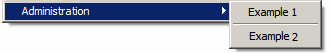
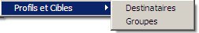

<?xml version="1.0" encoding="UTF-8"?>
<xliff xmlns="urn:oasis:names:tc:xliff:document:1.2" xmlns:okp="okapi-framework:xliff-extensions" xmlns:its="http://www.w3.org/2005/11/its" xmlns:itsxlf="http://www.w3.org/ns/its-xliff/" version="1.2" its:version="2.0">
<file original="help/configuration/using/configuration.md.mdsc" source-language="en-US" target-language="en-XX" datatype="x-text/markdown">
<body>
<trans-unit id="tu6" xml:space="preserve">
<source xml:lang="en-US">https://experienceleague.adobe.com/fr/docs/campaign/campaign-v8/new/campaign-ui</source>
<target xml:lang="en-XX">https://experienceleague.adobe.com/fr/docs/campaign/campaign-v8/new/campaign-ui</target>
</trans-unit>
<trans-unit id="tu27" xml:space="preserve">
<source xml:lang="en-US">https://experienceleague.adobe.com/fr/tools/campaign-api</source>
<target xml:lang="en-XX">https://experienceleague.adobe.com/fr/tools/campaign-api</target>
</trans-unit>
<trans-unit id="tu79" xml:space="preserve">
<source xml:lang="en-US">https://experienceleague.adobe.com/fr/tools/campaign-api</source>
<target xml:lang="en-XX">https://experienceleague.adobe.com/fr/tools/campaign-api</target>
</trans-unit>
<trans-unit id="tu1" restype="x-YAML_METADATA_HEADER_VALUE" xml:space="preserve">
<source xml:lang="en-US">Configure Campaign Explorer navigation tree</source>
<target xml:lang="en-XX">Configurer l’arborescence de navigation de l’Explorateur Campaign</target>
</trans-unit>
<trans-unit id="tu2" restype="x-YAML_METADATA_HEADER_VALUE" xml:space="preserve">
<source xml:lang="en-US">Learn how to configure Campaign Explorer navigation tree</source>
<target xml:lang="en-XX">Découvrez comment configurer l’arborescence de navigation de l’Explorateur Campaign.</target>
</trans-unit>
<trans-unit id="tu3" xml:space="preserve">
<source xml:lang="en-US">Configure Campaign Explorer navigation tree</source>
<target xml:lang="en-XX">Configurer l’arborescence de navigation de l’Explorateur Campaign</target>
</trans-unit>
<trans-unit id="tu4" xml:space="preserve">
<source xml:lang="en-US">As an expert user, you can add folders in the explorer tree and customize it.</source>
<target xml:lang="en-XX">En tant qu’utilisateur expert ou utilisatrice experte, vous pouvez ajouter des dossiers dans l’arborescence de l’explorateur et la personnaliser.</target>
</trans-unit>
<trans-unit id="tu5" xml:space="preserve">
<source xml:lang="en-US">Learn more about Campaign user interface in <ph id="1" ctype="x-LINK">&lbrack;</ph>Adobe Campaign v8 (console) documentation<ph id="2" ctype="x-LINK">[#$tu6]{target=_blank}</ph>.</source>
<target xml:lang="en-XX">En savoir plus sur l’interface d’utilisation de Campaign dans la <ph id="1" ctype="x-LINK">&lbrack;</ph>documentation d’Adobe Campaign v8 (console)<ph id="2" ctype="x-LINK">[#$tu6]{target=_blank}</ph>.</target>
</trans-unit>
<trans-unit id="tu7" xml:space="preserve">
<source xml:lang="en-US">The types of folders used by the navigation list are described in an XML document that obeys the grammar of the <ph id="1" ctype="x-STRONG_EMPHASIS">**</ph>xtk<ph id="2" ctype="x-inline-directive">:navtree**</ph> schema.</source>
<target xml:lang="en-XX">Les types de dossiers utilisés par la liste de navigation sont décrits dans un document XML qui respecte la grammaire du schéma <ph id="1" ctype="x-STRONG_EMPHASIS">**</ph>xtk<ph id="2" ctype="x-inline-directive">:navtree**</ph>.</target>
</trans-unit>
<trans-unit id="tu8" xml:space="preserve">
<source xml:lang="en-US">The XML document is structured as follows:</source>
<target xml:lang="en-XX">La structure du document XML est la suivante :</target>
</trans-unit>
<trans-unit id="tu9" xml:space="preserve">
<source xml:lang="en-US">The XML document contains the <ph id="1" ctype="x-STRONG_EMPHASIS">**`&lt;navtree>`**</ph> root element with the <ph id="4" ctype="x-STRONG_EMPHASIS">**</ph>name<ph id="5" ctype="x-STRONG_EMPHASIS">**</ph> and <ph id="6" ctype="x-STRONG_EMPHASIS">**</ph>namespace<ph id="7" ctype="x-STRONG_EMPHASIS">**</ph> attributes to specify the document name and namespace. The name and namespace make up the document identification key.</source>
<target xml:lang="en-XX">Le document XML contient l’élément racine <ph id="1" ctype="x-STRONG_EMPHASIS">**`&lt;navtree>`**</ph> avec les attributs <ph id="4" ctype="x-STRONG_EMPHASIS">**</ph>name<ph id="5" ctype="x-STRONG_EMPHASIS">**</ph> et <ph id="6" ctype="x-STRONG_EMPHASIS">**</ph>namespace<ph id="7" ctype="x-STRONG_EMPHASIS">**</ph> pour spécifier le nom du document et l’espace de noms. Le nom et l’espace de noms constituent la clé d’identification du document.</target>
</trans-unit>
<trans-unit id="tu10" xml:space="preserve">
<source xml:lang="en-US">The global commands of the application are declared in the document from the <ph id="1" ctype="x-STRONG_EMPHASIS">**`&lt;commands>`**</ph> element.</source>
<target xml:lang="en-XX">Les commandes globales de l'application sont déclarées dans le document à partir de l’élément <ph id="1" ctype="x-STRONG_EMPHASIS">**`&lt;commands>`**</ph>.</target>
</trans-unit>
<trans-unit id="tu11" xml:space="preserve">
<source xml:lang="en-US">The declaration of file types is structured in the document with the following elements: <ph id="1" ctype="x-STRONG_EMPHASIS">**`&lt;model>`**</ph> and <ph id="4" ctype="x-STRONG_EMPHASIS">**`&lt;nodemodel>`**</ph>.</source>
<target xml:lang="en-XX">La déclaration des types de dossiers est structurée dans le document avec les éléments suivants : <ph id="1" ctype="x-STRONG_EMPHASIS">**`&lt;model>`**</ph> et <ph id="4" ctype="x-STRONG_EMPHASIS">**`&lt;nodemodel>`**</ph>.</target>
</trans-unit>
<trans-unit id="tu12" xml:space="preserve">
<source xml:lang="en-US">Global commands</source>
<target xml:lang="en-XX">Commandes globales</target>
</trans-unit>
<trans-unit id="tu13" xml:space="preserve">
<source xml:lang="en-US">A global command lets you launch an action. This action can be an input form or a SOAP call.</source>
<target xml:lang="en-XX">Une commande globale permet de lancer une action. Cette action peut être un formulaire de saisie ou un appel SOAP.</target>
</trans-unit>
<trans-unit id="tu14" xml:space="preserve">
<source xml:lang="en-US">Global commands are accessible from the main <ph id="1" ctype="x-STRONG_EMPHASIS">**[!UICONTROL </ph>Tools<ph id="3" ctype="x-LINK_REF">]**</ph> menu.</source>
<target xml:lang="en-XX">Les commandes globales sont accessibles à partir du menu principal <ph id="1" ctype="x-STRONG_EMPHASIS">**[!UICONTROL </ph>Outils<ph id="3" ctype="x-LINK_REF">]**</ph>.</target>
</trans-unit>
<trans-unit id="tu15" xml:space="preserve">
<source xml:lang="en-US">The command configuration structure is as follows:</source>
<target xml:lang="en-XX">La struture du paramétrage des commandes est la suivante :</target>
</trans-unit>
<trans-unit id="tu16" xml:space="preserve">
<source xml:lang="en-US">The description of a global command is entered in the <ph id="1" ctype="x-STRONG_EMPHASIS">**`&lt;command>`**</ph> element with the following properties:</source>
<target xml:lang="en-XX">La description d'une commande globale est renseignée sur l'élément <ph id="1" ctype="x-STRONG_EMPHASIS">**`&lt;command>`**</ph> avec les propriétés suivantes :</target>
</trans-unit>
<trans-unit id="tu17" xml:space="preserve">
<source xml:lang="en-US"><ph id="1" ctype="x-STRONG_EMPHASIS">**</ph>name<ph id="2" ctype="x-STRONG_EMPHASIS">**</ph>: internal name of the command: the name must be entered and unique</source>
<target xml:lang="en-XX"><ph id="1" ctype="x-STRONG_EMPHASIS">**</ph>name<ph id="2" ctype="x-STRONG_EMPHASIS">**</ph> : nom interne de la commande : le nom doit obligatoirement être renseigné et unique.</target>
</trans-unit>
<trans-unit id="tu18" xml:space="preserve">
<source xml:lang="en-US"><ph id="1" ctype="x-STRONG_EMPHASIS">**</ph>label<ph id="2" ctype="x-STRONG_EMPHASIS">**</ph>: label of the command.</source>
<target xml:lang="en-XX"><ph id="1" ctype="x-STRONG_EMPHASIS">**</ph>label<ph id="2" ctype="x-STRONG_EMPHASIS">**</ph> : libellé de la commande.</target>
</trans-unit>
<trans-unit id="tu19" xml:space="preserve">
<source xml:lang="en-US"><ph id="1" ctype="x-STRONG_EMPHASIS">**</ph>desc<ph id="2" ctype="x-STRONG_EMPHASIS">**</ph>: description visible from the status bar of the main screen.</source>
<target xml:lang="en-XX"><ph id="1" ctype="x-STRONG_EMPHASIS">**</ph>desc<ph id="2" ctype="x-STRONG_EMPHASIS">**</ph> : description visible à partir de la barre de statut de l'écran principal.</target>
</trans-unit>
<trans-unit id="tu20" xml:space="preserve">
<source xml:lang="en-US"><ph id="1" ctype="x-STRONG_EMPHASIS">**</ph>form<ph id="2" ctype="x-STRONG_EMPHASIS">**</ph>: form to be launched: the value to be entered is the identification key of the input form (e.g. "cus<ph id="3" ctype="x-inline-directive">:recipient</ph>")</source>
<target xml:lang="en-XX"><ph id="1" ctype="x-STRONG_EMPHASIS">**</ph>form<ph id="2" ctype="x-STRONG_EMPHASIS">**</ph> : formulaire à lancer ; la valeur à renseigner est la clé d’identification du formulaire de saisie (par exemple, « cus<ph id="3" ctype="x-inline-directive">:recipient</ph> »).</target>
</trans-unit>
<trans-unit id="tu21" xml:space="preserve">
<source xml:lang="en-US"><ph id="1" ctype="x-STRONG_EMPHASIS">**</ph>rights<ph id="2" ctype="x-STRONG_EMPHASIS">**</ph>: list of named rights (separated by a comma) allowing access to this command. The list of available rights is accessible from the <ph id="3" ctype="x-STRONG_EMPHASIS">**[!UICONTROL </ph>Administration > Access management > Named rights<ph id="5" ctype="x-LINK_REF">]**</ph> folder.</source>
<target xml:lang="en-XX"><ph id="1" ctype="x-STRONG_EMPHASIS">**</ph>rights<ph id="2" ctype="x-STRONG_EMPHASIS">**</ph> : liste des droits nommés (séparés par une virgule) permettant l’accès à cette commande. La liste des droits disponibles est accessible à partir du dossier <ph id="3" ctype="x-STRONG_EMPHASIS">**[!UICONTROL </ph>Administration > Gestion des accès > Droits nommés<ph id="5" ctype="x-LINK_REF">]**</ph>.</target>
</trans-unit>
<trans-unit id="tu22" xml:space="preserve">
<source xml:lang="en-US"><ph id="1" ctype="x-STRONG_EMPHASIS">**</ph>promptLabel<ph id="2" ctype="x-STRONG_EMPHASIS">**</ph>: displays a confirmation box before execution of the command.</source>
<target xml:lang="en-XX"><ph id="1" ctype="x-STRONG_EMPHASIS">**</ph>promptLabel<ph id="2" ctype="x-STRONG_EMPHASIS">**</ph> : affiche une boîte de confirmation avant l'exécution de la commande.</target>
</trans-unit>
<trans-unit id="tu23" xml:space="preserve">
<source xml:lang="en-US">A <ph id="1" ctype="x-STRONG_EMPHASIS">**`&lt;command>`**</ph> element can contain <ph id="4" ctype="x-STRONG_EMPHASIS">**`&lt;command>`**</ph> sub-elements. In this case, the parent element lets you display a sub-menu made up of these child elements.</source>
<target xml:lang="en-XX">Un élément <ph id="1" ctype="x-STRONG_EMPHASIS">**`&lt;command>`**</ph> peut contenir des sous-éléments <ph id="4" ctype="x-STRONG_EMPHASIS">**`&lt;command>`**</ph>. Dans ce cas, l’élément parent vous permet d’afficher un sous-menu composé de ces éléments enfants.</target>
</trans-unit>
<trans-unit id="tu24" xml:space="preserve">
<source xml:lang="en-US">The commands are displayed in the same order as they are declared in the XML document.</source>
<target xml:lang="en-XX">L'affichage des commandes respecte l'ordre de déclaration dans le document XML.</target>
</trans-unit>
<trans-unit id="tu25" xml:space="preserve">
<source xml:lang="en-US">A command separator lets you display a separation bar between commands. It is identified by the <ph id="1" ctype="x-STRONG_EMPHASIS">**</ph>'-'<ph id="2" ctype="x-STRONG_EMPHASIS">**</ph> value contained in the command label.</source>
<target xml:lang="en-XX">Un séparateur de commande permet d’afficher une barre de séparation entre les commandes. Il est identifié par la valeur <ph id="1" ctype="x-STRONG_EMPHASIS">**</ph>'-'<ph id="2" ctype="x-STRONG_EMPHASIS">**</ph> contenue dans le libellé de la commande.</target>
</trans-unit>
<trans-unit id="tu26" xml:space="preserve">
<source xml:lang="en-US">The optional presence of the <ph id="1" ctype="x-STRONG_EMPHASIS">**`&lt;soapcall>`**</ph> tag with its input parameters defines the call of a SOAP method to be executed. For further information on the SOAP API, refer to <ph id="4" ctype="x-LINK">&lbrack;</ph>Campaign JSAPI documentation<ph id="5" ctype="x-LINK">[#$tu27]</ph>.</source>
<target xml:lang="en-XX">La présence facultative de la balise <ph id="1" ctype="x-STRONG_EMPHASIS">**`&lt;soapcall>`**</ph> avec ses paramètres d’entrée définit l’appel d’une méthode SOAP à exécuter. Pour plus d’informations sur l’API SOAP, consultez la <ph id="4" ctype="x-LINK">&lbrack;</ph>documentation JSAPI Campaign<ph id="5" ctype="x-LINK">[#$tu27]</ph>.</target>
</trans-unit>
<trans-unit id="tu28" xml:space="preserve">
<source xml:lang="en-US">The form context can be updated on initialization from the <ph id="1" ctype="x-STRONG_EMPHASIS">**`&lt;enter>`**</ph> tag. For further information on this tag, refer to the documentation on input forms.</source>
<target xml:lang="en-XX">Le contexte du formulaire peut être mis à jour lors de l’initialisation à partir de la balise <ph id="1" ctype="x-STRONG_EMPHASIS">**`&lt;enter>`**</ph>. Pour plus d’informations sur cette balise, consultez la documentation sur les formulaires de saisie.</target>
</trans-unit>
<trans-unit id="tu29" xml:space="preserve">
<source xml:lang="en-US"><ph id="1" ctype="x-STRONG_EMPHASIS">**</ph>Example<ph id="2" ctype="x-STRONG_EMPHASIS">**</ph>:</source>
<target xml:lang="en-XX"><ph id="1" ctype="x-STRONG_EMPHASIS">**</ph>Exemple<ph id="2" ctype="x-STRONG_EMPHASIS">**</ph>:</target>
</trans-unit>
<trans-unit id="tu30" xml:space="preserve">
<source xml:lang="en-US">Declaration of a global command to launch the "xtk<ph id="1" ctype="x-inline-directive">:import</ph>" form:</source>
<target xml:lang="en-XX">Déclaration d’une commande globale pour lancer le formulaire « xtk<ph id="1" ctype="x-inline-directive">:import</ph> » :</target>
</trans-unit>
<trans-unit id="tu31" xml:space="preserve">
<source xml:lang="en-US">A keyboard shortcut is declared on the 'I' character by the presence of <ph id="1" ctype="x-STRONG_EMPHASIS">**</ph>&amp;<ph id="2" ctype="x-STRONG_EMPHASIS">**</ph> in the command label.</source>
<target xml:lang="en-XX">Un raccourci clavier est déclaré sur le caractère « l » par la présence du <ph id="1" ctype="x-STRONG_EMPHASIS">**</ph>&amp;<ph id="2" ctype="x-STRONG_EMPHASIS">**</ph> dans le libellé de la commande.</target>
</trans-unit>
<trans-unit id="tu32" xml:space="preserve">
<source xml:lang="en-US">Example of a sub-menu with a separator:</source>
<target xml:lang="en-XX">Exemple de sous-menu avec séparateur :</target>
</trans-unit>
<trans-unit id="tu33" xml:space="preserve">
<source xml:lang="en-US"><ph id="1" ctype="x-IMAGE"></ph></source>
<target xml:lang="en-XX"><ph id="1" ctype="x-IMAGE"></ph></target>
</trans-unit>
<trans-unit id="tu34" xml:space="preserve">
<source xml:lang="en-US">Execution of a SOAP method:</source>
<target xml:lang="en-XX">Exécution d'une méthode SOAP :</target>
</trans-unit>
<trans-unit id="tu35" xml:space="preserve">
<source xml:lang="en-US">Folder type</source>
<target xml:lang="en-XX">Type de dossier</target>
</trans-unit>
<trans-unit id="tu36" xml:space="preserve">
<source xml:lang="en-US">A folder type lets you give access to the data of a schema. The view associated with the folder consists of a list and an input form.</source>
<target xml:lang="en-XX">Un type de dossier permet de donner l’accès aux données d’un schéma. La vue associée au dossier est composée d’une liste et d’un formulaire de saisie.</target>
</trans-unit>
<trans-unit id="tu37" xml:space="preserve">
<source xml:lang="en-US">The folder type configuration structure is as follows:</source>
<target xml:lang="en-XX">La structure du paramétrage des types de dossier est la suivante :</target>
</trans-unit>
<trans-unit id="tu38" xml:space="preserve">
<source xml:lang="en-US">The folder type declaration must be entered under a <ph id="1" ctype="x-STRONG_EMPHASIS">**`&lt;model>`**</ph> element. This element lets you define a hierarchical organization visible from the <ph id="4" ctype="x-STRONG_EMPHASIS">**[!UICONTROL </ph>Add new folder<ph id="6" ctype="x-LINK_REF">]**</ph> menu. A <ph id="8" ctype="x-STRONG_EMPHASIS">**`&lt;model>`**</ph> element must contain <ph id="11" ctype="x-STRONG_EMPHASIS">**`&lt;nodemodel>`**</ph> elements and other <ph id="14" ctype="x-STRONG_EMPHASIS">**`&lt;model>`**</ph> elements.</source>
<target xml:lang="en-XX">La déclaration de type de dossier doit être saisie sous un élément <ph id="1" ctype="x-STRONG_EMPHASIS">**`&lt;model>`**</ph>. Cet élément vous permet de définir une organisation hiérarchique visible à partir du menu <ph id="4" ctype="x-STRONG_EMPHASIS">**[!UICONTROL </ph>Ajouter un dossier<ph id="6" ctype="x-LINK_REF">]**</ph> . Un élément <ph id="8" ctype="x-STRONG_EMPHASIS">**`&lt;model>`**</ph> doit contenir des éléments <ph id="11" ctype="x-STRONG_EMPHASIS">**`&lt;nodemodel>`**</ph> et d’autres éléments <ph id="14" ctype="x-STRONG_EMPHASIS">**`&lt;model>`**</ph>.</target>
</trans-unit>
<trans-unit id="tu39" xml:space="preserve">
<source xml:lang="en-US">The <ph id="1" ctype="x-STRONG_EMPHASIS">**</ph>name<ph id="2" ctype="x-STRONG_EMPHASIS">**</ph> and <ph id="3" ctype="x-STRONG_EMPHASIS">**</ph>label<ph id="4" ctype="x-STRONG_EMPHASIS">**</ph> attributes populate the internal name of the element and the label displayed in the <ph id="5" ctype="x-STRONG_EMPHASIS">**[!UICONTROL </ph>Add new folder<ph id="7" ctype="x-LINK_REF">]**</ph> menu.</source>
<target xml:lang="en-XX">Les attributs <ph id="1" ctype="x-STRONG_EMPHASIS">**</ph>name<ph id="2" ctype="x-STRONG_EMPHASIS">**</ph> et <ph id="3" ctype="x-STRONG_EMPHASIS">**</ph>label<ph id="4" ctype="x-STRONG_EMPHASIS">**</ph> renseignent le nom interne de l'élément et le libellé affiché dans le menu <ph id="5" ctype="x-STRONG_EMPHASIS">**[!UICONTROL </ph>Ajouter un dossier<ph id="7" ctype="x-LINK_REF">]**</ph>.</target>
</trans-unit>
<trans-unit id="tu40" xml:space="preserve">
<source xml:lang="en-US">The <ph id="1" ctype="x-STRONG_EMPHASIS">**`&lt;nodemodel>`**</ph> element contains the description of the folder type with the following properties:</source>
<target xml:lang="en-XX">L’élément <ph id="1" ctype="x-STRONG_EMPHASIS">**`&lt;nodemodel>`**</ph>  contient la description du type de dossier avec les propriétés suivantes :</target>
</trans-unit>
<trans-unit id="tu41" xml:space="preserve">
<source xml:lang="en-US"><ph id="1" ctype="x-STRONG_EMPHASIS">**</ph>name<ph id="2" ctype="x-STRONG_EMPHASIS">**</ph>: internal name</source>
<target xml:lang="en-XX"><ph id="1" ctype="x-STRONG_EMPHASIS">**</ph>name<ph id="2" ctype="x-STRONG_EMPHASIS">**</ph> : nom interne.</target>
</trans-unit>
<trans-unit id="tu42" xml:space="preserve">
<source xml:lang="en-US"><ph id="1" ctype="x-STRONG_EMPHASIS">**</ph>label<ph id="2" ctype="x-STRONG_EMPHASIS">**</ph>: label used in the <ph id="3" ctype="x-STRONG_EMPHASIS">**[!UICONTROL </ph>Add new folder<ph id="5" ctype="x-LINK_REF">]**</ph> menu and as a default label when inserting a folder.</source>
<target xml:lang="en-XX"><ph id="1" ctype="x-STRONG_EMPHASIS">**</ph>label<ph id="2" ctype="x-STRONG_EMPHASIS">**</ph> : libellé utilisé dans le menu <ph id="3" ctype="x-STRONG_EMPHASIS">**[!UICONTROL </ph>Ajouter un dossier<ph id="5" ctype="x-LINK_REF">]**</ph> et comme libellé par défaut lors de l'insertion d'un dossier.</target>
</trans-unit>
<trans-unit id="tu43" xml:space="preserve">
<source xml:lang="en-US"><ph id="1" ctype="x-STRONG_EMPHASIS">**</ph>img<ph id="2" ctype="x-STRONG_EMPHASIS">**</ph>: default image on folder insertion.</source>
<target xml:lang="en-XX"><ph id="1" ctype="x-STRONG_EMPHASIS">**</ph>img<ph id="2" ctype="x-STRONG_EMPHASIS">**</ph> : image par défaut à l'insertion du dossier.</target>
</trans-unit>
<trans-unit id="tu44" xml:space="preserve">
<source xml:lang="en-US"><ph id="1" ctype="x-STRONG_EMPHASIS">**</ph>hiddenCommands<ph id="2" ctype="x-STRONG_EMPHASIS">**</ph>: list of commands (separated by a comma) to be masked. Possible values: "adbnew", "adbsave", "adbcancel" and "adbdup".</source>
<target xml:lang="en-XX"><ph id="1" ctype="x-STRONG_EMPHASIS">**</ph>hiddenCommands<ph id="2" ctype="x-STRONG_EMPHASIS">**</ph> : liste des commandes (séparées par une virgule) à masquer. Valeurs possibles : "adbnew", "adbsave", "adbcancel" et "adbdup".</target>
</trans-unit>
<trans-unit id="tu45" xml:space="preserve">
<source xml:lang="en-US"><ph id="1" ctype="x-STRONG_EMPHASIS">**</ph>newFolderShortCuts<ph id="2" ctype="x-STRONG_EMPHASIS">**</ph>: list of shortcuts on models (<ph id="3" ctype="x-STRONG_EMPHASIS">**`&lt;nodemodel>`**</ph> separated by a comma) in folder creation.</source>
<target xml:lang="en-XX"><ph id="1" ctype="x-STRONG_EMPHASIS">**</ph>newFolderShortCuts<ph id="2" ctype="x-STRONG_EMPHASIS">**</ph> : liste des raccourcis sur les modèles (<ph id="3" ctype="x-STRONG_EMPHASIS">**`&lt;nodemodel>`**</ph> séparés par une virgule) en création de dossier.</target>
</trans-unit>
<trans-unit id="tu46" xml:space="preserve">
<source xml:lang="en-US"><ph id="1" ctype="x-STRONG_EMPHASIS">**</ph>insertRight<ph id="2" ctype="x-STRONG_EMPHASIS">**</ph>, <ph id="3" ctype="x-STRONG_EMPHASIS">**</ph>editRight<ph id="4" ctype="x-STRONG_EMPHASIS">**</ph>, <ph id="5" ctype="x-STRONG_EMPHASIS">**</ph>deleteRight<ph id="6" ctype="x-STRONG_EMPHASIS">**</ph>: rights for inserting, editing and deleting folders.</source>
<target xml:lang="en-XX"><ph id="1" ctype="x-STRONG_EMPHASIS">**</ph>insertRight<ph id="2" ctype="x-STRONG_EMPHASIS">**</ph>, <ph id="3" ctype="x-STRONG_EMPHASIS">**</ph>editRight<ph id="4" ctype="x-STRONG_EMPHASIS">**</ph>, <ph id="5" ctype="x-STRONG_EMPHASIS">**</ph>deleteRight<ph id="6" ctype="x-STRONG_EMPHASIS">**</ph> : droits pour l'insertion, l'édition et la suppression des dossiers.</target>
</trans-unit>
<trans-unit id="tu47" xml:space="preserve">
<source xml:lang="en-US">The <ph id="1" ctype="x-STRONG_EMPHASIS">**`&lt;view>`**</ph> element under the <ph id="4" ctype="x-STRONG_EMPHASIS">**`&lt;nodemodel>`**</ph> element contains the configuration of the list associated with the view. The schema of the list is entered in the <ph id="7" ctype="x-STRONG_EMPHASIS">**</ph>schema<ph id="8" ctype="x-STRONG_EMPHASIS">**</ph> attribute of the <ph id="9" ctype="x-STRONG_EMPHASIS">**`&lt;view>`**</ph> element.</source>
<target xml:lang="en-XX">L’élément <ph id="1" ctype="x-STRONG_EMPHASIS">**`&lt;view>`**</ph> situé sous l’élément <ph id="4" ctype="x-STRONG_EMPHASIS">**`&lt;nodemodel>`**</ph> contient la configuration de la liste associée à l’affichage. Le schéma de la liste est saisi dans l’attribut de <ph id="7" ctype="x-STRONG_EMPHASIS">**</ph>schéma<ph id="8" ctype="x-STRONG_EMPHASIS">**</ph> de l’élément <ph id="9" ctype="x-STRONG_EMPHASIS">**`&lt;view>`**</ph>.</target>
</trans-unit>
<trans-unit id="tu48" xml:space="preserve">
<source xml:lang="en-US">To edit the records of the list, the input form with the same name as the list schema is implicitly used. The <ph id="1" ctype="x-STRONG_EMPHASIS">**</ph>type<ph id="2" ctype="x-STRONG_EMPHASIS">**</ph> attribute on the <ph id="3" ctype="x-STRONG_EMPHASIS">**`&lt;view>`**</ph> element affects the display of the form. Possible values are:</source>
<target xml:lang="en-XX">Pour modifier les enregistrements de la liste, le formulaire de saisie portant le même nom que le schéma de liste est implicitement utilisé. L’attribut <ph id="1" ctype="x-STRONG_EMPHASIS">**</ph>type<ph id="2" ctype="x-STRONG_EMPHASIS">**</ph> sur l’élément <ph id="3" ctype="x-STRONG_EMPHASIS">**`&lt;view>`**</ph> affecte l’affichage du formulaire. Les valeurs possibles sont les suivantes :</target>
</trans-unit>
<trans-unit id="tu49" xml:space="preserve">
<source xml:lang="en-US"><ph id="1" ctype="x-STRONG_EMPHASIS">**</ph>listdet<ph id="2" ctype="x-STRONG_EMPHASIS">**</ph>: displays the form at the bottom of the list.</source>
<target xml:lang="en-XX"><ph id="1" ctype="x-STRONG_EMPHASIS">**</ph>listdet<ph id="2" ctype="x-STRONG_EMPHASIS">**</ph> : affiche le formulaire en base de la liste.</target>
</trans-unit>
<trans-unit id="tu50" xml:space="preserve">
<source xml:lang="en-US"><ph id="1" ctype="x-STRONG_EMPHASIS">**</ph>list<ph id="2" ctype="x-STRONG_EMPHASIS">**</ph>: displays the list alone. The form is launched by double-clicking or via the "Open" in the menu on selecting the list.</source>
<target xml:lang="en-XX"><ph id="1" ctype="x-STRONG_EMPHASIS">**</ph>list<ph id="2" ctype="x-STRONG_EMPHASIS">**</ph> : affiche la liste seule. Le formulaire est lancé par un double clic ou par le menu « Ouvrir » sur sélection de la liste.</target>
</trans-unit>
<trans-unit id="tu51" xml:space="preserve">
<source xml:lang="en-US"><ph id="1" ctype="x-STRONG_EMPHASIS">**</ph>form<ph id="2" ctype="x-STRONG_EMPHASIS">**</ph>: displays a read-only form.</source>
<target xml:lang="en-XX"><ph id="1" ctype="x-STRONG_EMPHASIS">**</ph>form<ph id="2" ctype="x-STRONG_EMPHASIS">**</ph> : affiche une forme de consultation.</target>
</trans-unit>
<trans-unit id="tu52" xml:space="preserve">
<source xml:lang="en-US"><ph id="1" ctype="x-STRONG_EMPHASIS">**</ph>editForm<ph id="2" ctype="x-STRONG_EMPHASIS">**</ph>: displays a form in edit mode.</source>
<target xml:lang="en-XX"><ph id="1" ctype="x-STRONG_EMPHASIS">**</ph>editForm<ph id="2" ctype="x-STRONG_EMPHASIS">**</ph> : affiche un formulaire en édition.</target>
</trans-unit>
<trans-unit id="tu53" xml:space="preserve">
<source xml:lang="en-US"><ph id="1" ctype="x-regxph" equiv-text="&lbrack;!NOTE">[!NOTE]</ph></source>
<target xml:lang="en-XX"><ph id="1" ctype="x-regxph" equiv-text="&lbrack;!NOTE">[!NOTE]</ph></target>
</trans-unit>
<trans-unit id="tu54" xml:space="preserve">
<source xml:lang="en-US">The name of the input form can be overloaded by entering the <ph id="1" ctype="x-STRONG_EMPHASIS">**</ph>form<ph id="2" ctype="x-STRONG_EMPHASIS">**</ph> attribute in the <ph id="3" ctype="x-STRONG_EMPHASIS">**`&lt;view>`**</ph> element.</source>
<target xml:lang="en-XX">Le nom du formulaire de saisie peut être surchargé en renseignant l'attribut <ph id="1" ctype="x-STRONG_EMPHASIS">**</ph>form<ph id="2" ctype="x-STRONG_EMPHASIS">**</ph> dans l’élément <ph id="3" ctype="x-STRONG_EMPHASIS">**`&lt;view>`**</ph>.</target>
</trans-unit>
<trans-unit id="tu55" xml:space="preserve">
<source xml:lang="en-US">The default configuration of the list columns is entered via the <ph id="1" ctype="x-STRONG_EMPHASIS">**`&lt;columns>`**</ph> element. A column is declared on a <ph id="4" ctype="x-STRONG_EMPHASIS">**`&lt;node>`**</ph> element containing the <ph id="7" ctype="x-STRONG_EMPHASIS">**</ph>xpath<ph id="8" ctype="x-STRONG_EMPHASIS">**</ph> attribute with the field to be referenced in its schema as its value.</source>
<target xml:lang="en-XX">La configuration par défaut des colonnes de la liste est saisie via l’élément <ph id="1" ctype="x-STRONG_EMPHASIS">**`&lt;columns>`**</ph>. Une colonne est déclarée sur un élément <ph id="4" ctype="x-STRONG_EMPHASIS">**`&lt;node>`**</ph> contenant l’attribut <ph id="7" ctype="x-STRONG_EMPHASIS">**</ph>xpath<ph id="8" ctype="x-STRONG_EMPHASIS">**</ph> avec le champ à référencer dans son schéma comme sa valeur.</target>
</trans-unit>
<trans-unit id="tu56" xml:space="preserve">
<source xml:lang="en-US"><ph id="1" ctype="x-STRONG_EMPHASIS">**</ph>Example<ph id="2" ctype="x-STRONG_EMPHASIS">**</ph>: declaration of a folder type on the "nms<ph id="3" ctype="x-inline-directive">:recipient</ph>" schema.</source>
<target xml:lang="en-XX"><ph id="1" ctype="x-STRONG_EMPHASIS">**</ph>Exemple<ph id="2" ctype="x-STRONG_EMPHASIS">**</ph> : déclaration d’un type de dossier sur le schéma « nms<ph id="3" ctype="x-inline-directive">:recipient</ph> ».</target>
</trans-unit>
<trans-unit id="tu57" xml:space="preserve">
<source xml:lang="en-US">The corresponding folder insertion menu:</source>
<target xml:lang="en-XX">Le menu d'insertion de dossier correspondant :</target>
</trans-unit>
<trans-unit id="tu58" xml:space="preserve">
<source xml:lang="en-US"><ph id="1" ctype="x-IMAGE"></ph></source>
<target xml:lang="en-XX"><ph id="1" ctype="x-IMAGE"></ph></target>
</trans-unit>
<trans-unit id="tu59" xml:space="preserve">
<source xml:lang="en-US">Filtering and sorting can be applied when the list is being loaded:</source>
<target xml:lang="en-XX">Un filtre et un tri peuvent être appliqués lors du chargement de la liste :</target>
</trans-unit>
<trans-unit id="tu60" xml:space="preserve">
<source xml:lang="en-US">Shortcut commands</source>
<target xml:lang="en-XX">Commandes contextuelles</target>
</trans-unit>
<trans-unit id="tu61" xml:space="preserve">
<source xml:lang="en-US">A shortcut command lets you launch an action on selecting the list. The action can be an input form or a SOAP call.</source>
<target xml:lang="en-XX">Un raccourci permet de lancer une action sur sélection de la liste. L’action peut être un formulaire de saisie ou un appel SOAP.</target>
</trans-unit>
<trans-unit id="tu62" xml:space="preserve">
<source xml:lang="en-US">Commands are accessible from the <ph id="1" ctype="x-STRONG_EMPHASIS">**[!UICONTROL </ph>Action<ph id="3" ctype="x-LINK_REF">]**</ph> menu of the list or the associated menu button.</source>
<target xml:lang="en-XX">Les commandes sont accessibles à partir du menu <ph id="1" ctype="x-STRONG_EMPHASIS">**[!UICONTROL </ph>Action<ph id="3" ctype="x-LINK_REF">]**</ph> de la liste ou du bouton menu associé.</target>
</trans-unit>
<trans-unit id="tu63" xml:space="preserve">
<source xml:lang="en-US">The command configuration structure is as follows:</source>
<target xml:lang="en-XX">La struture du paramétrage des commandes est la suivante :</target>
</trans-unit>
<trans-unit id="tu64" xml:space="preserve">
<source xml:lang="en-US">The description of a command is entered on the <ph id="1" ctype="x-STRONG_EMPHASIS">**`&lt;command>`**</ph> element with the following properties:</source>
<target xml:lang="en-XX">La description de la commande est renseignée sur l’élément <ph id="1" ctype="x-STRONG_EMPHASIS">**`&lt;command>`**</ph> avec les propriétés suivantes :</target>
</trans-unit>
<trans-unit id="tu65" xml:space="preserve">
<source xml:lang="en-US"><ph id="1" ctype="x-STRONG_EMPHASIS">**</ph>name<ph id="2" ctype="x-STRONG_EMPHASIS">**</ph>: internal name of the command: the name must be entered and unique.</source>
<target xml:lang="en-XX"><ph id="1" ctype="x-STRONG_EMPHASIS">**</ph>name<ph id="2" ctype="x-STRONG_EMPHASIS">**</ph> : nom interne de la commande, le nom doit obligatoirement être renseigné et unique.</target>
</trans-unit>
<trans-unit id="tu66" xml:space="preserve">
<source xml:lang="en-US"><ph id="1" ctype="x-STRONG_EMPHASIS">**</ph>label<ph id="2" ctype="x-STRONG_EMPHASIS">**</ph>: label of the command.</source>
<target xml:lang="en-XX"><ph id="1" ctype="x-STRONG_EMPHASIS">**</ph>label<ph id="2" ctype="x-STRONG_EMPHASIS">**</ph> : libellé de la commande.</target>
</trans-unit>
<trans-unit id="tu67" xml:space="preserve">
<source xml:lang="en-US"><ph id="1" ctype="x-STRONG_EMPHASIS">**</ph>desc<ph id="2" ctype="x-STRONG_EMPHASIS">**</ph>: description visible from the status bar of the main screen.</source>
<target xml:lang="en-XX"><ph id="1" ctype="x-STRONG_EMPHASIS">**</ph>desc<ph id="2" ctype="x-STRONG_EMPHASIS">**</ph> : description visible à partir de la barre de statut de l'écran principal.</target>
</trans-unit>
<trans-unit id="tu68" xml:space="preserve">
<source xml:lang="en-US"><ph id="1" ctype="x-STRONG_EMPHASIS">**</ph>form<ph id="2" ctype="x-STRONG_EMPHASIS">**</ph>: form to be launched: the value to be entered is the identification key of the input form (e.g. "cus<ph id="3" ctype="x-inline-directive">:recipient</ph>").</source>
<target xml:lang="en-XX"><ph id="1" ctype="x-STRONG_EMPHASIS">**</ph>form<ph id="2" ctype="x-STRONG_EMPHASIS">**</ph> : formulaire à lancer ; la valeur à renseigner est la clé d’identification du formulaire de saisie (par exemple, « cus<ph id="3" ctype="x-inline-directive">:recipient</ph> »).</target>
</trans-unit>
<trans-unit id="tu69" xml:space="preserve">
<source xml:lang="en-US"><ph id="1" ctype="x-STRONG_EMPHASIS">**</ph>rights<ph id="2" ctype="x-STRONG_EMPHASIS">**</ph>: list of named rights (separated by a comma) allowing access to this command. The list of available rights is accessible from the <ph id="3" ctype="x-STRONG_EMPHASIS">**[!UICONTROL </ph>Administration > Access management > Named rights<ph id="5" ctype="x-LINK_REF">]**</ph> folder.</source>
<target xml:lang="en-XX"><ph id="1" ctype="x-STRONG_EMPHASIS">**</ph>rights<ph id="2" ctype="x-STRONG_EMPHASIS">**</ph> : liste des droits nommés (séparés par une virgule) permettant l’accès à cette commande. La liste des droits disponibles est accessible à partir du dossier <ph id="3" ctype="x-STRONG_EMPHASIS">**[!UICONTROL </ph>Administration > Gestion des accès > Droits nommés<ph id="5" ctype="x-LINK_REF">]**</ph>.</target>
</trans-unit>
<trans-unit id="tu70" xml:space="preserve">
<source xml:lang="en-US"><ph id="1" ctype="x-STRONG_EMPHASIS">**</ph>promptLabel<ph id="2" ctype="x-STRONG_EMPHASIS">**</ph>: displays a confirmation box before execution of the command</source>
<target xml:lang="en-XX"><ph id="1" ctype="x-STRONG_EMPHASIS">**</ph>promptLabel<ph id="2" ctype="x-STRONG_EMPHASIS">**</ph> : affiche une boîte de confirmation avant l'exécution de la commande.</target>
</trans-unit>
<trans-unit id="tu71" xml:space="preserve">
<source xml:lang="en-US"><ph id="1" ctype="x-STRONG_EMPHASIS">**</ph>monoSelection<ph id="2" ctype="x-STRONG_EMPHASIS">**</ph>: forces mono-selection (multiple selection by default).</source>
<target xml:lang="en-XX"><ph id="1" ctype="x-STRONG_EMPHASIS">**</ph>monoSelection<ph id="2" ctype="x-STRONG_EMPHASIS">**</ph> : force la mono sélection (sélection multiple par défaut).</target>
</trans-unit>
<trans-unit id="tu72" xml:space="preserve">
<source xml:lang="en-US"><ph id="1" ctype="x-STRONG_EMPHASIS">**</ph>refreshView<ph id="2" ctype="x-STRONG_EMPHASIS">**</ph>: forces reloading of the list after execution of the command.</source>
<target xml:lang="en-XX"><ph id="1" ctype="x-STRONG_EMPHASIS">**</ph>refreshView<ph id="2" ctype="x-STRONG_EMPHASIS">**</ph> : force le rechargement de la liste après l'exécution de la commande.</target>
</trans-unit>
<trans-unit id="tu73" xml:space="preserve">
<source xml:lang="en-US"><ph id="1" ctype="x-STRONG_EMPHASIS">**</ph>enabledIf<ph id="2" ctype="x-STRONG_EMPHASIS">**</ph>: activates the command depending on the expression entered.</source>
<target xml:lang="en-XX"><ph id="1" ctype="x-STRONG_EMPHASIS">**</ph>enabledIf<ph id="2" ctype="x-STRONG_EMPHASIS">**</ph> : active la commande en fonction de l'expression renseignée.</target>
</trans-unit>
<trans-unit id="tu74" xml:space="preserve">
<source xml:lang="en-US"><ph id="1" ctype="x-STRONG_EMPHASIS">**</ph>img<ph id="2" ctype="x-STRONG_EMPHASIS">**</ph>: enters an image allowing access to the command from the list toolbar.</source>
<target xml:lang="en-XX"><ph id="1" ctype="x-STRONG_EMPHASIS">**</ph>img<ph id="2" ctype="x-STRONG_EMPHASIS">**</ph> : renseigne une image permettant l'accès de la commande à partir de la barre d'outils de la liste.</target>
</trans-unit>
<trans-unit id="tu75" xml:space="preserve">
<source xml:lang="en-US">A <ph id="1" ctype="x-STRONG_EMPHASIS">**`&lt;command>`**</ph> element can contain <ph id="4" ctype="x-STRONG_EMPHASIS">**`&lt;command>`**</ph> sub-elements. In this case, the parent element lets you display a sub-menu made up of these child elements.</source>
<target xml:lang="en-XX">Un élément <ph id="1" ctype="x-STRONG_EMPHASIS">**`&lt;command>`**</ph> peut contenir des sous-éléments <ph id="4" ctype="x-STRONG_EMPHASIS">**`&lt;command>`**</ph>. Dans ce cas, l’élément parent vous permet d’afficher un sous-menu composé de ces éléments enfants.</target>
</trans-unit>
<trans-unit id="tu76" xml:space="preserve">
<source xml:lang="en-US">The commands are displayed in the same order as they are declared in the XML document.</source>
<target xml:lang="en-XX">L'affichage des commandes respecte l'ordre de déclaration dans le document XML.</target>
</trans-unit>
<trans-unit id="tu77" xml:space="preserve">
<source xml:lang="en-US">A command separator lets you display a separation bar between commands. It is identified by the <ph id="1" ctype="x-STRONG_EMPHASIS">**</ph>'-'<ph id="2" ctype="x-STRONG_EMPHASIS">**</ph> value contained in the command label.</source>
<target xml:lang="en-XX">Un séparateur de commande permet d’afficher une barre de séparation entre les commandes. Il est identifié par la valeur <ph id="1" ctype="x-STRONG_EMPHASIS">**</ph>'-'<ph id="2" ctype="x-STRONG_EMPHASIS">**</ph> contenue dans le libellé de la commande.</target>
</trans-unit>
<trans-unit id="tu78" xml:space="preserve">
<source xml:lang="en-US">The optional presence of the <ph id="1" ctype="x-STRONG_EMPHASIS">**`&lt;soapcall>`**</ph> tag with its input parameters defines the call of a SOAP method to be executed. For further information about SOAP APIs, refer to <ph id="4" ctype="x-LINK">&lbrack;</ph>Campaign JSAPI documentation<ph id="5" ctype="x-LINK">[#$tu79]</ph>.</source>
<target xml:lang="en-XX">La présence facultative de la balise <ph id="1" ctype="x-STRONG_EMPHASIS">**`&lt;soapcall>`**</ph> avec ses paramètres d’entrée définit l’appel d’une méthode SOAP à exécuter. Pour plus d’informations sur les API SOAP, consultez la <ph id="4" ctype="x-LINK">&lbrack;</ph>documentation JSAPI Campaign<ph id="5" ctype="x-LINK">[#$tu79]</ph>.</target>
</trans-unit>
<trans-unit id="tu80" xml:space="preserve">
<source xml:lang="en-US">The form context can be updated on initialization via the <ph id="1" ctype="x-STRONG_EMPHASIS">**`&lt;enter>`**</ph> tag. For further information about this tag, refer to the input form documentation.</source>
<target xml:lang="en-XX">Le contexte du formulaire peut être mis à jour lors de l’initialisation via la balise <ph id="1" ctype="x-STRONG_EMPHASIS">**`&lt;enter>`**</ph>. Pour plus d’informations sur cette balise, consultez la documentation du formulaire de saisie.</target>
</trans-unit>
<trans-unit id="tu81" xml:space="preserve">
<source xml:lang="en-US"><ph id="1" ctype="x-STRONG_EMPHASIS">**</ph>Example<ph id="2" ctype="x-STRONG_EMPHASIS">**</ph>:</source>
<target xml:lang="en-XX"><ph id="1" ctype="x-STRONG_EMPHASIS">**</ph>Exemple<ph id="2" ctype="x-STRONG_EMPHASIS">**</ph>:</target>
</trans-unit>
<trans-unit id="tu82" xml:space="preserve">
<source xml:lang="en-US">Linked folder</source>
<target xml:lang="en-XX">Dossier lié</target>
</trans-unit>
<trans-unit id="tu83" xml:space="preserve">
<source xml:lang="en-US">There are two types of folder management operations:</source>
<target xml:lang="en-XX">Il existe deux types de fonctionnement dans la gestion des dossiers :</target>
</trans-unit>
<trans-unit id="tu84" xml:space="preserve">
<source xml:lang="en-US">The folder is a view: the list displays all records associated with the schema, with the possibility of system filtering entered in the folder properties.</source>
<target xml:lang="en-XX">Le dossier est une vue : la liste affiche tous les enregistrements associés au schéma avec possibilité de filtrage système renseigné dans les propriétés du dossier.</target>
</trans-unit>
<trans-unit id="tu85" xml:space="preserve">
<source xml:lang="en-US">The folder is linked: the records in the list are implicitly filtered on the folder link.</source>
<target xml:lang="en-XX">Le dossier est lié : les enregistrements de la liste sont implicitement filtrés sur le lien du dossier.</target>
</trans-unit>
<trans-unit id="tu86" xml:space="preserve">
<source xml:lang="en-US">For a linked folder, the <ph id="1" ctype="x-STRONG_EMPHASIS">**</ph>folderLink<ph id="2" ctype="x-STRONG_EMPHASIS">**</ph> attribute on the <ph id="3" ctype="x-STRONG_EMPHASIS">**`&lt;nodemodel>`**</ph> element must be populated. This attribute contains the name of the link on the folder configured in the data schema.</source>
<target xml:lang="en-XX">Pour un dossier lié, l’attribut <ph id="1" ctype="x-STRONG_EMPHASIS">**</ph>folderLink<ph id="2" ctype="x-STRONG_EMPHASIS">**</ph> de l’élément <ph id="3" ctype="x-STRONG_EMPHASIS">**`&lt;nodemodel>`**</ph> doit être renseigné. Cet attribut contient le nom du lien sur le dossier configuré dans le schéma de données.</target>
</trans-unit>
<trans-unit id="tu87" xml:space="preserve">
<source xml:lang="en-US">Example of declaration of a linked folder in the data schema:</source>
<target xml:lang="en-XX">Exemple de déclaration d'un dossier lié dans le schéma de données :</target>
</trans-unit>
<trans-unit id="tu88" xml:space="preserve">
<source xml:lang="en-US">The configuration of the <ph id="1" ctype="x-STRONG_EMPHASIS">**`&lt;nodemodel>`**</ph> on the link of the folder named "folder" is as follows:</source>
<target xml:lang="en-XX">La configuration du <ph id="1" ctype="x-STRONG_EMPHASIS">**`&lt;nodemodel>`**</ph> sur le lien du dossier nommé « Dossier » est la suivante :</target>
</trans-unit>
</body>
</file>
</xliff>