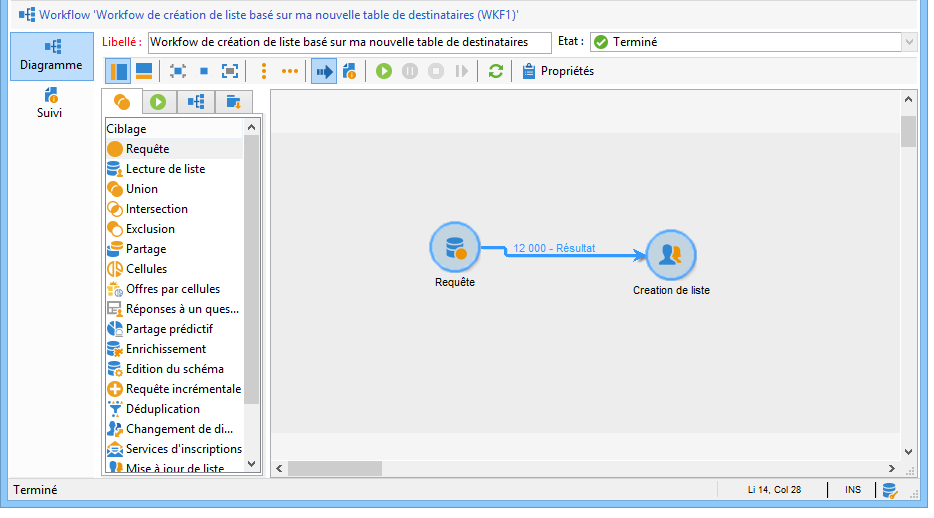
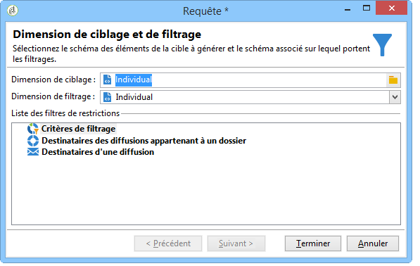
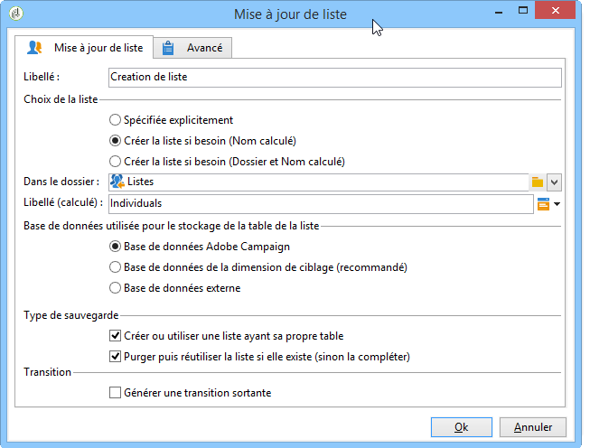
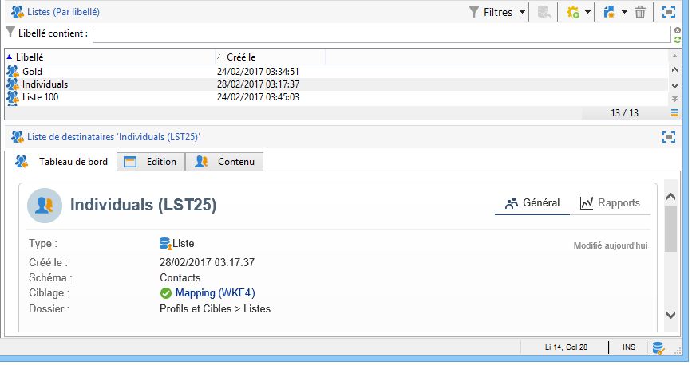

# Création d&#39;une liste de profils avec un workflow{#creating-a-profile-list-with-a-workflow}

Pour créer une liste de type **[!UICONTROL Liste]** basée sur la nouvelle table des destinataires, vous devez créer un workflow de ciblage qui va générer la liste.

Pour plus d&#39;informations sur les listes dans Campaign, consultez [cette section](../../platform/using/creating-and-managing-lists.md#about-lists-in-adobe-campaign).

 [Découvrez cette fonctionnalité en vidéo](../../platform/using/creating-and-managing-lists.md#create-list-in-a-wf-video)

Pour créer un workflow de ciblage et mettre à jour des destinataires dans une table de destinataires personnalisée, procédez comme suit :

1. Ouvrez le nœud **[!UICONTROL Profils et cibles > Traitements > Workflows de ciblage]** dans l&#39;explorateur.
1. Créez un nouveau workflow de ciblage.
1. Placez une activité **Requête** puis une activité **Mise à jour de liste**.

   

1. Double cliquez sur l&#39;activité **Requête** puis cliquez sur **[!UICONTROL Editer la requête]** afin de choisir une dimension de ciblage basée sur le schéma de la nouvelle table de destinataires (dans le cas de l&#39;exemple : **Individual**). Cliquez sur **[!UICONTROL Terminer]** pour valider.

   

1. Double cliquez sur l&#39;activité **Mise à jour de la liste** puis sélectionnez le bouton radio **[!UICONTROL Créer la liste si besoin (Nom calculé)]**.

   

1. Sélectionner le dossier de création de la nouvelle liste.
1. Exécuter le workflow pour créer la liste.
1. Visualiser le résultat dans le noeud de l&#39;arborescence que vous avez choisi lors de l&#39;activité **[!UICONTROL Mise à jour de la liste]**.

   Le tableau de bord précise le schéma sur lequel est basée la liste, comme le montre l&#39;écran ci-dessous :

   
