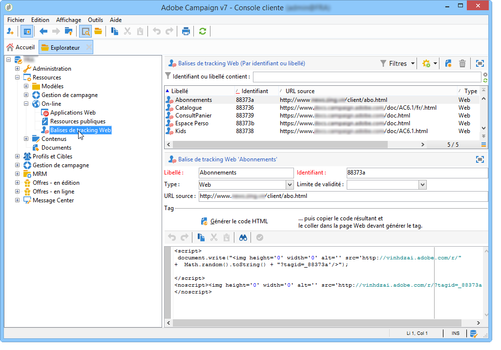

# Création de balises de tracking web{#creating-web-tracking-tags}


Chaque page du site que vous souhaitez tracker doit être référencée dans votre plateforme Adobe Campaign. Ce référencement peut se faire de deux façons :

1. Définition manuelle des URL des pages qui font l&#39;objet d&#39;un tracking Web.
1. Création à la volée des URL des pages qui font l&#39;objet d&#39;un tracking Web.

## Définir les URL à tracker dans Adobe Campaign {#defining-the-urls-to-be-tracked-in-the-application}

Cette méthode permet de définir manuellement les pages qui font l&#39;objet d&#39;un tracking Web, puis de générer la balise de tracking Web associée. Cette opération est réalisée depuis le noeud **[!UICONTROL Ressources>On-line>Balises de tracking Web]** de la console Adobe Campaign.



Pour générer le code HTML à insérer dans la page :

* Saisissez le libellé de la balise : il sera affiché dans les logs de tracking,
* Indiquez l&#39;URL source : ce champ est informatif et permet d&#39;indiquer la page trackée (facultatif),
* Saisissez éventuellement une limite de validité,
* Cliquez sur **[!UICONTROL Générer]** le code HTML.

Copiez ensuite le code généré et collez-le dans la page à tracker.

## Création à la volée des URL des pages qui font l&#39;objet d&#39;un tracking Web {#on-the-fly-creation-of-urls-to-be-tracked}

Vous pouvez créer les URL de tracking Web à la volée en ajoutant des informations dans la valeur du paramètre **tagid** :

* le type de la page webtrackée : &#39;w&#39; pour WEB, &#39;t&#39; pour TRANSACTION,
* le nom interne du dossier dans lequel l&#39;URL doit être créée.

Ces deux informations doivent être concaténées à l&#39;identifiant de la page Web concernée en ajoutant le caractère &#39;|&#39; :

```
tagid=<identifier>|<type>|<foldername>
```

>[!IMPORTANT]
>
>Vous devez encoder la valeur du paramètre **tagid** lorsqu&#39;il est utilisé comme paramètre d&#39;URL.

**Exemple** : création d&#39;une URL de tracking Web de type transaction.

**http://myserver.adobe.com/r/a?tagid=accueil%7Ct%7CMonDossier**
